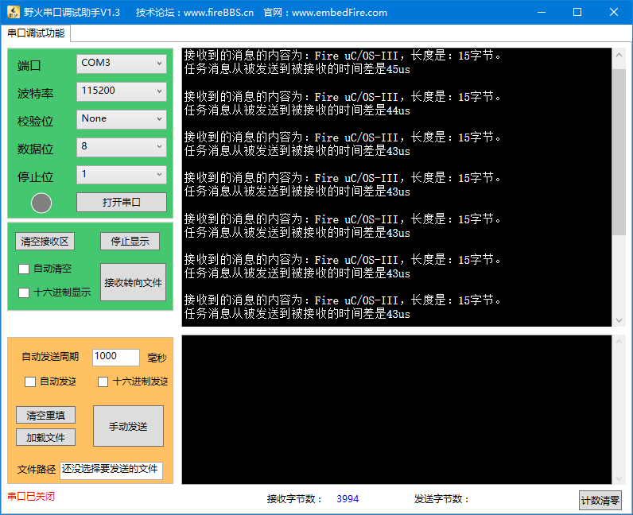

.. vim: syntax=rst

任务消息队列
===============

任务消息队列的基本概念
~~~~~~~~~~~~~~~~~~~~~~~~~~

任务消息队列跟任务信号量一样，均隶属于某一个特定任务，不需单独创建，任务在则任务消息队列在，只有该任务才可以获取（接收）这个任务消息队列的消息，
其他任务只能给这个任务消息队列发送消息，却不能获取。任务消息队列与前面讲解的（普通）消息队列极其相似，只是任务消息队列已隶属于一个特定任务，
所以它不具有等待列表，在操作的过程中省去了等待任务插入和移除列表的动作，所以工作原理相对更简单一点，效率也比较高一些。

注意：本书所提的“消息队列”，若无特别说明，均指前面的（普通）消息队列（属于内核对象），而非任务消息队列。

通过对任务消息队列的合理使用，可以在一定场合下替代μC/OS的消息队列，用户只需向任务内部的消息队列发送一个消息而不用通过外部的消息队列进行发送，
这样子处理就会很方便并且更加高效，当然，凡事都有利弊，任务消息队列虽然处理更快，RAM开销更小，但也有限制：只能指定消息发送的对象，
有且只有一个任务接收消息；而内核对象的消息队列则没有这个限制，用户在发送消息的时候，可以采用广播消息的方式，让所有等待该消息的任务都获取到消息。

在实际任务间的通信中，一个或多个任务发送一个消息给另一个任务是非常常见的，而一个任务给多个任务发送消息的情况相对比较少，
前者就很适合采用任务消息队列进行传递消息，如果任务消息队列可以满足设计需求，那么尽量不要使用普通消息队列，这样子设计的系统会更加高效。

（内核对象）消息队列是用结构体OS_Q来管理的，包含了管理消息的元素 MsgQ 和管理等待列表的元素 PendList等。
而任务消息队列的结构体成员变量就少了PendList，因为等待任务消息队列只有拥有任务消息队列本身的任务才可以进行获取，
故任务消息队列不需要等待列表的相关数据结构，具体见 代码清单:任务消息队列-1_ 。

注意：想要使用任务消息队列，就必须将OS_CFG_TASK_Q_EN宏定义配置为1，该宏定义位于os_cfg.h文件中。

.. code-block:: c
    :caption: 代码清单:任务消息队列-1任务消息队列数据结构
    :name: 代码清单:任务消息队列-1
    :linenos:

    struct  os_msg_q
    {
        OS_MSG              *InPtr;		(1)
        OS_MSG              *OutPtr;		(2)
        OS_MSG_QTY           NbrEntriesSize;	(3)
        OS_MSG_QTY           NbrEntries;		(4)
        OS_MSG_QTY           NbrEntriesMax;		(5)
    };

-   代码清单:任务消息队列-1_  **(1)、(2)**\ ：任务消息队列中进出消息指针。

-   代码清单:任务消息队列-1_  **(3)**\ ：任务消息队列中最大可用的消息个数，在创建任务的时候由用户指定这个值的大小。

-   代码清单:任务消息队列-1_  **(4)**\ ：记录任务消息队列中当前的消息个数，
    每当发送一个消息到任务消息队列的时候，若任务没有在等待该消息，那么新发送的消息被插入任务消息队列后此值加1，
    NbrEntries 的大小不能超过NbrEntriesSize。

-   代码清单:任务消息队列-1_  **(5)**\ ：记录任务消息队列最多的时候拥有的消息个数。

任务消息队列的运作机制与普通消息队列一样，没什么差别。

任务消息队列的函数接口讲解
~~~~~~~~~~~~~~~~~~~~~~~~~~~~~~~

任务消息队列发送函数OSTaskQPost()
^^^^^^^^^^^^^^^^^^^^^^^^^^^^^^^^^^^^^^^^^^^^^

函数 OSTaskQPost()用来发送任务消息队列，参数中有指向消息要发送给的任务控制块的指针，
任何任务都可以发送消息给拥有任务消息队列的任务（任务在被创建的时候，要设置参数 q_size 大于 0），
其源码具体见 代码清单:任务消息队列-2_ 。

.. code-block:: c
    :caption: 代码清单:任务消息队列-2 OSTaskQPost()源码
    :name: 代码清单:任务消息队列-2
    :linenos:

    #if OS_CFG_TASK_Q_EN > 0u	//如果启用了任务消息队列
    void  OSTaskQPost (OS_TCB       *p_tcb,    	(1)	//目标任务
    void         *p_void,   	(2)	//消息内容地址
                    OS_MSG_SIZE   msg_size, 	(3)	//消息长度
                    OS_OPT        opt,      	(4)	//选项
                    OS_ERR       *p_err)   	(5)	//返回错误类型
    {
        CPU_TS   ts;

    #ifdef OS_SAFETY_CRITICAL//如果启用（默认禁用）了安全检测
        if (p_err == (OS_ERR *)0)           //如果错误类型实参为空
        {
            OS_SAFETY_CRITICAL_EXCEPTION(); //执行安全检测异常函数
            return;                         //返回，停止执行
        }
    #endif

    #if OS_CFG_ARG_CHK_EN > 0u//如果启用了参数检测
        switch (opt)                          //根据选项分类处理
        {
        case OS_OPT_POST_FIFO:            //如果选项在预期内
        case OS_OPT_POST_LIFO:
        case OS_OPT_POST_FIFO | OS_OPT_POST_NO_SCHED:
        case OS_OPT_POST_LIFO | OS_OPT_POST_NO_SCHED:
        break;                       //直接跳出

        default:                          //如果选项超出预期
            *p_err = OS_ERR_OPT_INVALID;  //错误类型为“选项非法”
            return;                      //返回，停止执行
        }
    #endif

        ts = OS_TS_GET();                                  //获取时间戳

    #if OS_CFG_ISR_POST_DEFERRED_EN > 0u//如果启用了中断延迟发布
        if (OSIntNestingCtr > (OS_NESTING_CTR)0)       //如果该函数在中断中被调用
        {
            OS_IntQPost((OS_OBJ_TYPE)OS_OBJ_TYPE_TASK_MSG, //将消息先发布到中断消息队列
                        (void      *)p_tcb,
                        (void      *)p_void,
                        (OS_MSG_SIZE)msg_size,
                        (OS_FLAGS   )0,
                        (OS_OPT     )opt,
                        (CPU_TS     )ts,
                        (OS_ERR    *)p_err);		(6)
            return;                                         //返回
        }
    #endif

        OS_TaskQPost(p_tcb,                                 //将消息直接发布
                    p_void,
                    msg_size,
                    opt,
                    ts,
                    p_err);				(7)
    }
    #endif

-   代码清单:任务消息队列-2_  **(1)**\ ：目标任务。

-   代码清单:任务消息队列-2_  **(2)**\ ：任务消息内容指针。

-   代码清单:任务消息队列-2_  **(3)**\ ：任务消息的大小。

-   代码清单:任务消息队列-2_  **(4)**\ ：发送的选项。

-   代码清单:任务消息队列-2_  **(5)**\ ：用于保存返回的错误类型。

-   代码清单:任务消息队列-2_  **(6)**\ ：如果启用了中断延迟发布，并且如果该函数在中断中被调用，就先将消息先发布到中断消息队列。

-   代码清单:任务消息队列-2_  **(7)**\ ：调用OS_TaskQPost()函数将消息直接发送，其源码具体见 代码清单:任务消息队列-3_ 。

.. code-block:: c
    :caption: 代码清单:任务消息队列-3 OS_TaskQPost()源码
    :name: 代码清单:任务消息队列-3
    :linenos:

    #if OS_CFG_TASK_Q_EN > 0u//如果启用了任务消息队列
    void  OS_TaskQPost (OS_TCB       *p_tcb,    //目标任务
                        void         *p_void,   //消息内容地址
                        OS_MSG_SIZE   msg_size, //消息长度
                        OS_OPT        opt,      //选项
                        CPU_TS        ts,       //时间戳
                        OS_ERR       *p_err)    //返回错误类型
    {
        CPU_SR_ALLOC();  //使用到临界段（在关/开中断时）时必须用到该宏，该宏声明和
        //定义一个局部变量，用于保存关中断前的 CPU 状态寄存器
        // SR（临界段关中断只需保存SR），开中断时将该值还原。

        OS_CRITICAL_ENTER();                                   //进入临界段
        if (p_tcb == (OS_TCB *)0)                (1)//如果 p_tcb 为空
        {
            p_tcb = OSTCBCurPtr;                          //目标任务为自身
        }
        *p_err  = OS_ERR_NONE;                            //错误类型为“无错误”
        switch (p_tcb->TaskState)                (2)//根据任务状态分类处理
        {
            case OS_TASK_STATE_RDY:                          //如果目标任务没等待状态
            case OS_TASK_STATE_DLY:
            case OS_TASK_STATE_SUSPENDED:
            case OS_TASK_STATE_DLY_SUSPENDED:
            OS_MsgQPut(&p_tcb->MsgQ,                    //把消息放入任务消息队列
                    p_void,
                    msg_size,
                    opt,
                    ts,
                    p_err);			(3)
            OS_CRITICAL_EXIT();                           //退出临界段
            break;                                        //跳出

            case OS_TASK_STATE_PEND:                        //如果目标任务有等待状态
            case OS_TASK_STATE_PEND_TIMEOUT:
            case OS_TASK_STATE_PEND_SUSPENDED:
            case OS_TASK_STATE_PEND_TIMEOUT_SUSPENDED:
            if (p_tcb->PendOn == OS_TASK_PEND_ON_TASK_Q) //如果等的是任务消息队列
            {
                OS_Post((OS_PEND_OBJ *)0,                 //把消息发布给目标任务
                        p_tcb,
                        p_void,
                        msg_size,
                        ts);			(4)
                OS_CRITICAL_EXIT_NO_SCHED();              //退出临界段（无调度）
                if ((opt & OS_OPT_POST_NO_SCHED) == (OS_OPT)0u)   //如果要调度任务
                {
                    OSSched();                                    //调度任务
                }
            }
            else(5)//如果没在等待任务消息队列
            {
                OS_MsgQPut(&p_tcb->MsgQ,             //把消息放入任务消息队列
                        p_void,
                        msg_size,
                        opt,
                        ts,
                        p_err);
                OS_CRITICAL_EXIT();                      //退出临界段
            }
            break;                                       //跳出

            default:                             (6)//如果状态超出预期
            OS_CRITICAL_EXIT();                          //退出临界段
            *p_err = OS_ERR_STATE_INVALID;                //错误类型为“状态非法”
            break;                                       //跳出
        }
    }
    #endif

-   代码清单:任务消息队列-3_  **(1)**\ ：如果目标任务为空，则表示将任务消息释放给自己，那么p_tcb就指向当前任务。

-   代码清单:任务消息队列-3_  **(2)**\ ：根据任务状态分类处理。

-   代码清单:任务消息队列-3_  **(3)**\ ：如果目标任务没等待状态，就调用OS_MsgQPut()函数将消息放入队列中，执行完毕就退出。

-   代码清单:任务消息队列-3_  **(4)**\ ：如果目标任务有等待状态，
    那就看看是不是在等待任务消息队列，如果是的话，调用OS_Post()函数把任务消息发送给目标任务。

-   代码清单:任务消息队列-3_  **(5)**\ ：如果任务并不是在等待任务消息队列，
    那么调用OS_MsgQPut()函数将消息放入任务消息队列中即可。

-   代码清单:任务消息队列-3_  **(6)**\ ：如果状态超出预期，返回错误类型为“状态非法”的错误代码。

任务消息队列的发送过程是跟消息队列发送过程差不多，先检查目标任务的状态，如果该任务刚刚好在等待任务消息队列的消息，
那么直接让任务脱离等待状态即可。如果任务没有在等待任务消息队列的消息，那么就将消息插入要发送消息的任务消息队列。

任务消息队列发送函数的使用实例具体见 代码清单:任务消息队列-4_ 。

.. code-block:: c
    :caption: 代码清单:任务消息队列-4 OSTaskQPost()使用实例
    :name: 代码清单:任务消息队列-4
    :linenos:

    OS_ERR      err;

    /* 发布消息到任务 AppTaskPend */
    OSTaskQPost ((OS_TCB      *)&AppTaskPendTCB,          //目标任务的控制块
                (void        *)"YeHuo μC/OS-III",             //消息内容
                (OS_MSG_SIZE  )sizeof ( "YeHuo μC/OS-III" ),  //消息长度
                (OS_OPT       )OS_OPT_POST_FIFO,
    //发布到任务消息队列的入口端
                (OS_ERR      *)&err);                           //返回错误类型

任务消息队列获取函数OSTaskQPend()
^^^^^^^^^^^^^^^^^^^^^^^^^^^^^^^^^^^^^^^^^^^^^

与OSTaskQPost()任务消息队列发送函数相对应，OSTaskQPend()函数用于获取一个任务消息队列，函数的参数中没有指定哪个任务获取任务消息，
实际上就是当前执行的任务，当任务调用了这个函数就表明这个任务需要获取任务消息，OSTaskQPend()源码具体见 代码清单:任务消息队列-5_ 。

.. code-block:: c
    :caption: 代码清单:任务消息队列-5OSTaskQPend()源码
    :name: 代码清单:任务消息队列-5
    :linenos:

    #if OS_CFG_TASK_Q_EN > 0u//如果启用了任务消息队列
    void  *OSTaskQPend (OS_TICK       timeout,   (1)//等待期限（单位：时钟节拍）
                        OS_OPT        opt,       (2)	//选项
                        OS_MSG_SIZE  *p_msg_size, (3)	//返回消息长度
                        CPU_TS       *p_ts,       (4)	//返回时间戳
                        OS_ERR       *p_err)      (5)	//返回错误类型
    {
        OS_MSG_Q     *p_msg_q;
        void         *p_void;
        CPU_SR_ALLOC(); //使用到临界段（在关/开中断时）时必须用到该宏，该宏声明和
        //定义一个局部变量，用于保存关中断前的 CPU 状态寄存器
        // SR（临界段关中断只需保存SR），开中断时将该值还原。

    #ifdef OS_SAFETY_CRITICAL//如果启用（默认禁用）了安全检测
        if (p_err == (OS_ERR *)0)           //如果错误类型实参为空
        {
            OS_SAFETY_CRITICAL_EXCEPTION(); //执行安全检测异常函数
            return ((void *)0);             //返回0（有错误），停止执行
        }
    #endif

    #if OS_CFG_CALLED_FROM_ISR_CHK_EN > 0u//如果启用了中断中非法调用检测
        if (OSIntNestingCtr > (OS_NESTING_CTR)0)    //如果该函数在中断中被调用
        {
            *p_err = OS_ERR_PEND_ISR;                //错误类型为“在中断中中止等待”
            return ((void *)0);                     //返回0（有错误），停止执行
        }
    #endif

    #if OS_CFG_ARG_CHK_EN > 0u//如果启用了参数检测
        if (p_msg_size == (OS_MSG_SIZE *)0)      //如果 p_msg_size 为空
        {
            *p_err = OS_ERR_PTR_INVALID;          //错误类型为“指针不可用”
            return ((void *)0);                  //返回0（有错误），停止执行
        }
        switch (opt)                             //根据选项分类处理
        {
        case OS_OPT_PEND_BLOCKING:           //如果选项在预期内
        case OS_OPT_PEND_NON_BLOCKING:
        break;                          //直接跳出

        default:                             //如果选项超出预期
            *p_err = OS_ERR_OPT_INVALID;     //错误类型为“选项非法”
            return ((void *)0);             //返回0（有错误），停止执行
        }
    #endif

        if (p_ts != (CPU_TS *)0)      //如果 p_ts 非空
        {
            *p_ts  = (CPU_TS  )0;      //初始化（清零）p_ts，待用于返回时间戳
        }

        CPU_CRITICAL_ENTER();                           //关中断
        p_msg_q = &OSTCBCurPtr->MsgQ;        (6)//获取当前任务的消息队列
        p_void  = OS_MsgQGet(p_msg_q,                   //从队列里获取一个消息
                            p_msg_size,
                            p_ts,
                            p_err);	(7)
        if (*p_err == OS_ERR_NONE)                            //如果获取消息成功
        {
    #if OS_CFG_TASK_PROFILE_EN > 0u

            if (p_ts != (CPU_TS *)0)
            {
                OSTCBCurPtr->MsgQPendTime = OS_TS_GET() - *p_ts;
                if (OSTCBCurPtr->MsgQPendTimeMax < OSTCBCurPtr->MsgQPendTime)
                {
                    OSTCBCurPtr->MsgQPendTimeMax = OSTCBCurPtr->MsgQPendTime;
                }
            }
    #endif
            CPU_CRITICAL_EXIT();                             //开中断
            return (p_void);                                 //返回消息内容
        }
        /* 如果获取消息不成功（队列里没有消息） */	(8)
        if ((opt & OS_OPT_PEND_NON_BLOCKING) != (OS_OPT)0) //如果选择了不阻塞任务
        {
            *p_err = OS_ERR_PEND_WOULD_BLOCK;            //错误类型为“缺乏阻塞”
            CPU_CRITICAL_EXIT();                             //开中断
            return ((void *)0);                     //返回0（有错误），停止执行
        }
        else(9)//如果选择了阻塞任务
        {
            if (OSSchedLockNestingCtr > (OS_NESTING_CTR)0)   //如果调度器被锁
            {
                CPU_CRITICAL_EXIT();                         //开中断
                *p_err = OS_ERR_SCHED_LOCKED;          //错误类型为“调度器被锁”
                return ((void *)0);                     //返回0（有错误），停止执行
            }
        }
        /* 如果调度器未被锁 */
        OS_CRITICAL_ENTER_CPU_EXIT();          (10)//锁调度器，重开中断
        OS_Pend((OS_PEND_DATA *)0,             (11)//阻塞当前任务，等待消息
                (OS_PEND_OBJ  *)0,
                (OS_STATE      )OS_TASK_PEND_ON_TASK_Q,
                (OS_TICK       )timeout);
        OS_CRITICAL_EXIT_NO_SCHED();                    //解锁调度器（无调度）

        OSSched();                             (12)//调度任务
            /* 当前任务（获得消息队列的消息）得以继续运行 */
        CPU_CRITICAL_ENTER();                (13)//关中断
        switch (OSTCBCurPtr->PendStatus)           //根据任务的等待状态分类处理
        {
            case OS_STATUS_PEND_OK:               (14)//如果任务已成功获得消息
            p_void      = OSTCBCurPtr->MsgPtr;          //提取消息内容地址
            *p_msg_size  = OSTCBCurPtr->MsgSize;         //提取消息长度
            if (p_ts != (CPU_TS *)0)                    //如果 p_ts 非空
            {
                *p_ts  = OSTCBCurPtr->TS;            //获取任务等到消息时的时间戳
    #if OS_CFG_TASK_PROFILE_EN > 0u

                OSTCBCurPtr->MsgQPendTime = OS_TS_GET() - OSTCBCurPtr->TS;
                if (OSTCBCurPtr->MsgQPendTimeMax < OSTCBCurPtr->MsgQPendTime)
                {
                    OSTCBCurPtr->MsgQPendTimeMax = OSTCBCurPtr->MsgQPendTime;
                }
    #endif
            }
            *p_err = OS_ERR_NONE;                        //错误类型为“无错误”
            break;                                      //跳出

            case OS_STATUS_PEND_ABORT:           (15)//如果等待被中止
            p_void     = (void      *)0;                //返回消息内容为空
            *p_msg_size = (OS_MSG_SIZE)0;                //返回消息大小为0
            if (p_ts  != (CPU_TS *)0)                   //如果 p_ts 非空
            {
                *p_ts   = (CPU_TS  )0;                   //清零 p_ts
            }
            *p_err      =  OS_ERR_PEND_ABORT;            //错误类型为“等待被中止”
            break;                                      //跳出

            case OS_STATUS_PEND_TIMEOUT:          (16)//如果等待超时，
            default:                                         //或者任务状态超出预期。
            p_void     = (void      *)0;                //返回消息内容为空
            *p_msg_size = (OS_MSG_SIZE)0;                //返回消息大小为0
            if (p_ts  != (CPU_TS *)0)                   //如果 p_ts 非空
            {
                *p_ts   =  OSTCBCurPtr->TS;
            }
            *p_err      =  OS_ERR_TIMEOUT;               //错误类为“等待超时”
            break;                                      //跳出
        }
        CPU_CRITICAL_EXIT();                                 //开中断
        return (p_void);                    (17)//返回消息内容地址
    }
    #endif

-   代码清单:任务消息队列-5_  **(1)**\ ：指定超时时间（单位：时钟节拍）。

-   代码清单:任务消息队列-5_  **(2)**\ ：获取任务消息队列的选项。

-   代码清单:任务消息队列-5_  **(3)**\ ：返回消息大小。

-   代码清单:任务消息队列-5_  **(4)**\ ：返回时间戳。

-   代码清单:任务消息队列-5_  **(5)**\ ：返回错误类型。

-   代码清单:任务消息队列-5_  **(6)**\ ：获取当前任务的消息队列保存在p_msg_q变量中。

-   代码清单:任务消息队列-5_  **(7)**\ ：调用OS_MsgQGet()函数从消息队列获取一个消息，如果获取消息成功，则返回指向消息的指针。

-   代码清单:任务消息队列-5_  **(8)**\ ：如果获取消息不成功（任务消息队列里没有消息），
    并且如果用户选择了不阻塞任务，那么返回错误类型为“缺乏阻塞”的错误代码，然后退出。

-   代码清单:任务消息队列-5_  **(9)**\ ：如果选择了阻塞任务，先判断一下调度器是否被锁，如果被锁了也就不能继续执行。

-   代码清单:任务消息队列-5_  **(10)**\ ：如果调度器未被锁，系统会锁调度器，重开中断。

-   代码清单:任务消息队列-5_  **(11)**\ ：调用OS_Pend()函数将当前任务脱离就绪列表，
    并根据用户指定的阻塞时间插入节拍列表，但是不会插入队列等待列表，然后打开调度器，但不进行调度，OS_Pend()源码具体见代码清单18‑18。

-   代码清单:任务消息队列-5_  **(12)**\ ：进行一次任务调度。

-   代码清单:任务消息队列-5_  **(13)**\ ：程序能执行到这里，就说明大体上有两种情况，
    要么是任务获取到消息了；任务还没获取到消息（任务没获取到消息的情况有很多种），无论是哪种情况，都先把中断关掉再说，然后根据当前运行任务的等待状态分类处理。

-   代码清单:任务消息队列-5_  **(14)**\ ：如果任务状态是OS_STATUS_PEND_OK，
    则表示任务获取到消息了，那么就从任务控制块中提取消息，这是因为在发送消息给任务的时候，会将消息放入任务控制块的MsgPtr成员变量中，
    然后继续提取消息大小，如果p_ts非空，记录获取任务等到消息时的时间戳，返回错误类型为“无错误”的错误代码，跳出switch语句。

-   代码清单:任务消息队列-5_  **(15)**\ ：如果任务在等待（阻塞）重被中止，
    则返回消息内容为空，返回消息大小为0，返回错误类型为“等待被中止”的错误代码，跳出switch语句。

-   代码清单:任务消息队列-5_  **(16)**\ ：如果任务等待（阻塞）超时，说明等待的时间过去了，
    任务也没获取到消息，则返回消息内容为空，返回消息大小为0，返回错误类型为“等待超时”的错误代码，跳出switch语句。

-   代码清单:任务消息队列-5_  **(17)**\ ：打开中断，返回消息内容。

任务消息队列实验
~~~~~~~~~~~~~~~~~~~~

任务通知代替消息队列是在ΜC/OS中创建了两个任务，其中一个任务是用于接收任务消息，另一个任务发送任务消息。
两个任务独立运行，发送消息任务每秒发送一次任务消息，接收任务在就一直在等待消息，
一旦获取到消息通知就把消息打印在串口调试助手里，具体见 代码清单:任务消息队列-6_ 。

.. code-block::
    :caption: 代码清单:任务消息队列-6任务通知代替消息队列
    :name: 代码清单:任务消息队列-6
    :linenos:

    #include <includes.h>

    static  OS_TCB   AppTaskStartTCB;      //任务控制块
    static  OS_TCB   AppTaskPostTCB;
    static  OS_TCB   AppTaskPendTCB;
    static  CPU_STK  AppTaskStartStk[APP_TASK_START_STK_SIZE];       //任务栈
    static  CPU_STK  AppTaskPostStk [ APP_TASK_POST_STK_SIZE ];
    static  CPU_STK  AppTaskPendStk [ APP_TASK_PEND_STK_SIZE ];
    static  void  AppTaskStart  ( void *p_arg);               //任务函数声明
    static  void  AppTaskPost   ( void * p_arg );
    static  void  AppTaskPend   ( void * p_arg );

    int  main (void)
    {
        OS_ERR  err;
        OSInit(&err);                  //初始化 μC/OS

        /* 创建起始任务 */
        OSTaskCreate((OS_TCB     *)&AppTaskStartTCB,
                    //任务控制块地址
                    (CPU_CHAR   *)"App Task Start",          //任务名称
                    (OS_TASK_PTR ) AppTaskStart,             //任务函数
                    (void       *) 0,
                    //传递给任务函数（形参p_arg）的实参
                    (OS_PRIO     ) APP_TASK_START_PRIO,        //任务的优先级
                    (CPU_STK    *)&AppTaskStartStk[0],
                    //任务栈的基地址
                    (CPU_STK_SIZE) APP_TASK_START_STK_SIZE / 10,
                    //任务栈空间剩下1/10时限制其增长
                    (CPU_STK_SIZE) APP_TASK_START_STK_SIZE,
                    //任务栈空间（单位：sizeof(CPU_STK)）
                    (OS_MSG_QTY  ) 5u,
                    //任务可接收的最大消息数
                    (OS_TICK     ) 0u,
                    //任务的时间片节拍数（0表默认值OSCfg_TickRate_Hz/10）
                    (void       *) 0,
                    //任务扩展（0表不扩展）
                    (OS_OPT     )(OS_OPT_TASK_STK_CHK | OS_OPT_TASK_STK_CLR),//任务选项
                    (OS_ERR     *)&err);                     //返回错误类型

        OSStart(&err);
        //启动多任务管理（交由μC/OS-III控制）
    }

    static  void  AppTaskStart (void *p_arg)
    {
        CPU_INT32U  cpu_clk_freq;
        CPU_INT32U  cnts;
        OS_ERR      err;

        (void)p_arg;

        BSP_Init();                                          //板级初始化
        CPU_Init();     //初始化 CPU组件（时间戳、关中断时间测量和主机名）

        cpu_clk_freq = BSP_CPU_ClkFreq();
        //获取 CPU内核时钟频率（SysTick 工作时钟）
        cnts = cpu_clk_freq / (CPU_INT32U)OSCfg_TickRate_Hz;
        //根据用户设定的时钟节拍频率计算 SysTick 定时器的计数值
        OS_CPU_SysTickInit(cnts);              //调用 SysTick
        初始化函数，设置定时器计数值和启动定时器

        Mem_Init();
        //初始化内存管理组件（堆内存池和内存池表）

    #if OS_CFG_STAT_TASK_EN > 0u
        //如果启用（默认启用）了统计任务
        OSStatTaskCPUUsageInit(&err);

    #endif

        CPU_IntDisMeasMaxCurReset();
        //复位（清零）当前最大关中断时间

        /* 创建 AppTaskPost 任务 */
        OSTaskCreate((OS_TCB     *)&AppTaskPostTCB,
        //任务控制块地址
                    (CPU_CHAR   *)"App Task Post",          //任务名称
                    (OS_TASK_PTR ) AppTaskPost,         //任务函数
                    (void       *) 0,
                    //传递给任务函数（形参p_arg）的实参
                    (OS_PRIO     ) APP_TASK_POST_PRIO,    //任务的优先级
                    (CPU_STK    *)&AppTaskPostStk[0],
                    //任务栈的基地址
                    (CPU_STK_SIZE) APP_TASK_POST_STK_SIZE / 10,
                    //任务栈空间剩下1/10时限制其增长
                    (CPU_STK_SIZE) APP_TASK_POST_STK_SIZE,
                    //任务栈空间（单位：sizeof(CPU_STK)）
                    (OS_MSG_QTY  ) 5u,
                    //任务可接收的最大消息数
                    (OS_TICK     ) 0u,
                    //任务的时间片节拍数（0表默认值OSCfg_TickRate_Hz/10）
                    (void       *) 0,
                    //任务扩展（0表不扩展）
                    (OS_OPT      )(OS_OPT_TASK_STK_CHK | OS_OPT_TASK_STK_CLR),
                    (OS_ERR     *)&err);                       //返回错误类型

        /* 创建 AppTaskPend 任务 */
        OSTaskCreate((OS_TCB     *)&AppTaskPendTCB,
        //任务控制块地址
                    (CPU_CHAR   *)"App Task Pend",        //任务名称
                    (OS_TASK_PTR ) AppTaskPend,                 //任务函数
                    (void       *) 0,
                    //传递给任务函数（形参p_arg）的实参
                    (OS_PRIO     ) APP_TASK_PEND_PRIO,   //任务的优先级
                    (CPU_STK    *)&AppTaskPendStk[0],
                    //任务栈的基地址
                    (CPU_STK_SIZE) APP_TASK_PEND_STK_SIZE / 10,
                    //任务栈空间剩下1/10时限制其增长
                    (CPU_STK_SIZE) APP_TASK_PEND_STK_SIZE,
                    //任务栈空间（单位：sizeof(CPU_STK)）
                    (OS_MSG_QTY  ) 50u,
                    //任务可接收的最大消息数
                    (OS_TICK     ) 0u,
                    //任务的时间片节拍数（0表默认值OSCfg_TickRate_Hz/10）
                    (void       *) 0,
                    //任务扩展（0表不扩展）
                    (OS_OPT      )(OS_OPT_TASK_STK_CHK | OS_OPT_TASK_STK_CLR), //任务选项
                    (OS_ERR     *)&err);              //返回错误类型

        OSTaskDel ( & AppTaskStartTCB, & err );
        //删除起始任务本身，该任务不再运行

    }

    static  void  AppTaskPost ( void * p_arg )
    {
        OS_ERR      err;

        (void)p_arg;

    while (DEF_TRUE)                                   //任务体
        {
            /* 发送消息到任务 AppTaskPend */
            OSTaskQPost ((OS_TCB      *)&AppTaskPendTCB, //目标任务的控制块
                        (void        *)"Fire μC/OS-III", //消息内容
                        (OS_MSG_SIZE  )sizeof( "Fire μC/OS-III" ), //消息长度
                        (OS_OPT       )OS_OPT_POST_FIFO,
                        //发送到任务消息队列的入口端
                        (OS_ERR      *)&err);          //返回错误类型

            OSTimeDlyHMSM ( 0, 0, 1, 0, OS_OPT_TIME_DLY, & err );

        }
    }

    static  void  AppTaskPend ( void * p_arg )
    {
        OS_ERR         err;
        OS_MSG_SIZE    msg_size;
        CPU_TS         ts;
        CPU_INT32U     cpu_clk_freq;
        CPU_SR_ALLOC();

        char * pMsg;

        (void)p_arg;

        cpu_clk_freq = BSP_CPU_ClkFreq();
        //获取CPU时钟，时间戳是以该时钟计数

    while (DEF_TRUE)                                 //任务体
        {
            /* 阻塞任务，等待任务消息 */
            pMsg = OSTaskQPend ((OS_TICK        )0,        //无期限等待
            (OS_OPT    )OS_OPT_PEND_BLOCKING, //没有消息就阻塞任务
            (OS_MSG_SIZE   *)&msg_size,  //返回消息长度
            (CPU_TS        *)&ts,
            //返回消息被发送的时间戳
            (OS_ERR        *)&err);  //返回错误类型

            ts = OS_TS_GET() - ts;
            //计算消息从发送到被接收的时间差

            macLED1_TOGGLE ();                     //切换LED1的亮灭状态

            OS_CRITICAL_ENTER();
            //进入临界段，避免串口打印被打断

            printf ( "\r\n接收到的消息的内容为：%s，长度是：%d字节。",
                    pMsg, msg_size );

            printf ( "\r\n任务消息从被发送到被接收的时间差是%dus\r\n",
                    ts / ( cpu_clk_freq / 1000000 ) );

            OS_CRITICAL_EXIT();                               //退出临界段
        }

    }

任务消息队列实验现象
~~~~~~~~~~~~~~~~~~~~~~~~~

将程序编译好，用USB线连接计算机和开发板的USB接口（对应丝印为USB转串口），
用DAP仿真器把配套程序下载到野火STM32开发板（具体型号根据购买的板子而定，每个型号的板子都配套有对应的程序），
在计算机上打开串口调试助手，然后复位开发板就可以在调试助手中看到串口的运行打印信息，
具体见图 任务通知代替消息队列实验现象_ 。

