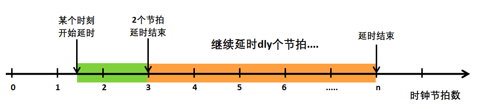
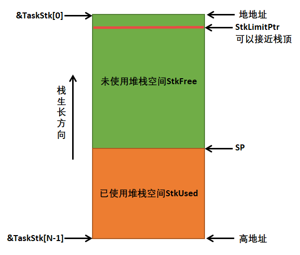
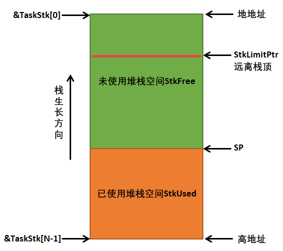
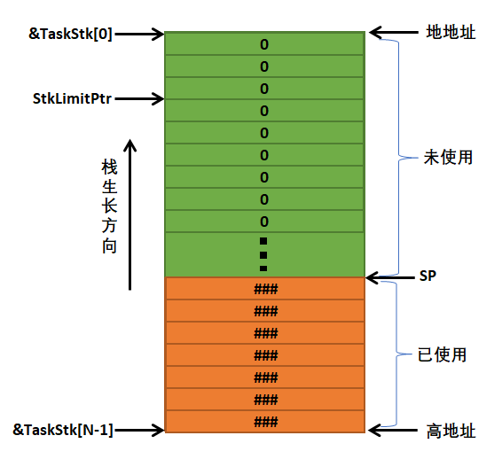
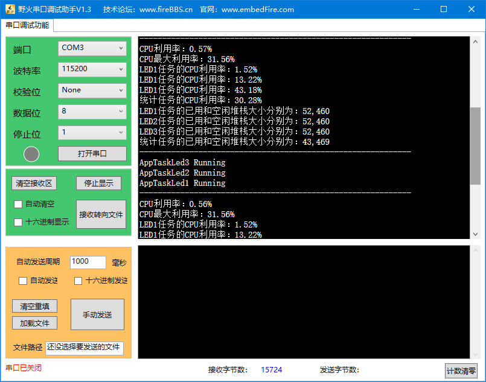

.. vim: syntax=rst

CPU利用率及栈检测统计
=======================

CPU利用率的基本概念及作用
~~~~~~~~~~~~~~~~~~~~~~~~~~~~

CPU利用率其实就是系统运行的程序占用的CPU资源，表示机器在某段时间程序运行的情况，如果这段时间中，程序一直在占用CPU的使用权，
那么可以认为CPU的利用率是100%。CPU的利用率越高，说明机器在这个时间上运行了很多程序，反之较少。利用率的高低与CPU性能强弱有直接关系，就像一段一模一样的程序，
如果使用运算速度很慢的CPU，它可能要运行1000ms，而使用很运算速度很快的CPU可能只需要10ms，那么在1000ms这段时间中，前者的CPU利用率就是100%，
而后者的CPU利用率只有1%，因为1000ms内前者都在使用CPU做运算，而后者只使用10ms的时间做运算，剩下的时间CPU可以做其他事情。

μC/OS是多任务操作系统，对 CPU 都是分时使用的：比如A任务占用10ms，
然后B任务占用30ms，然后空闲60ms，再又是A任务占10ms，B任务占30ms，
空闲60ms；如果在一段时间内都是如此，那么这段时间内的利用率为40%，因为整个系统中只有40%的时间是CPU处理数据的时间。

一个系统设计的好坏，可以使用CPU利用率来衡量，一个好的系统必然是能完美响应急需的处理，并且系统的资源不会过于浪费（性价比高）。举个例子，
假设一个系统的CPU利用率经常在90%~100%徘徊，那么系统就很少有空闲的时候，这时候突然有一些事情急需CPU的处理，
但是此时CPU都很可能被其他任务在占用了，那么这个紧急事件就有可能无法被相应，即启用被相应，那么占用CPU的任务又处于等待状态，这种系统就是不够完美的，
因为资源处理得太过于紧迫；反过来，假如CPU的利用率在1%以下，那么我们就可以认为这种产品的资源过于浪费，
搞一个那么好的CPU去干着没啥意义的活（大部分时间处于空闲状态），作为产品的设计，既不能让资源过于浪费，也不能让资源过于紧迫，这种设计才是完美的，
在需要的时候能及时处理完突发事件，而且资源也不会过剩，性价比更高。

μC/OS提供的CPU利用率统计是一个可选功能，只有将OS_CFG_STAT_TASK_EN宏定义启用后用户才能使用CPU利用率统计相关函数，该宏定义位于os_cfg.h文件中。

CPU利用率统计初始化
~~~~~~~~~~~~~~~~~~~~~

μC/OS对CPU利用率进行统计是怎么实现的呢？简单来说，CPU利用率统计的原理很简单，我们知道，系统中必须存在空闲任务，当且仅当CPU空闲的时候才会去执行空闲任务，
那么我们就可以让CPU在空闲任务中一直做加法运算，假设某段时间T中CPU一直都在空闲任务中做加法运算（变量自加），那么这段时间算出来的值就是CPU空闲时候的最大值，
我们假设为100，那么当系统中有其他任务的时候，CPU就不可能一直处于空闲任务做运算了，那么同样的一段时间T里，空闲任务算出来的值变成了80，
那么是不是可以说明空闲任务只占用了系统的80%的资源，剩下的20%被其他任务占用了，这是显而易见的，同样的，利用这个原理，
我们就能知道CPU的利用率大约是多少了（这种计算不会很精确），假设CPU在T时间内空闲任务中运算的最大值为OSStatTaskCtrMax（100），
而有其他任务参与时候T时间内空闲任务运算的值为80（OSStatTaskCtr），
那么CPU的利用率CPUUsage的公式应该为：
CPUUsage（%） = 100*（1- OSStatTaskCtr / OSStatTaskCtrMax），
假设有一次空闲任务运算的值为100（OSStatTaskCtr），说明没有其他任务参与，那么CPU的利用率就是0%，如果OSStatTaskCtr的值为0，
那么表示这段时间里CPU都没在空闲任务中运算，那么CPU的利用率自然就是100%。

注意：一般情况下时间T由OS_CFG_STAT_TASK_RATE_HZ宏定义决定，是我们自己在os_cfg_app.h文件中定义的，我们的例程定义为 10，
该宏定义决定了统计任务的执行频率，即决定了更新一次 CPU 利用率的时间为 1/OS_CFG_STAT_TASK_RATE_HZ，单位是秒。
此外，统计任务的时钟节拍与软件定时器任务的时钟节拍一样，
都是由系统时钟节拍分频得到的，如果统计任务运行的频率设定不是时钟节拍整数倍，那么统计任务实际运行的频率跟设定的就会有误差，这点跟定时器是一样的。

在统计CPU 利用率之前必须先调用OSStatTaskCPUUsageInit()函数进行相关初始化，
这个函数的目的就是为了计算只有空闲任务时CPU在某段时间内的运算最大值，
也就是OSStatTaskCtrMax，其源码具体见 代码清单:利用率-1_ 。

.. code-block:: c
    :caption: 代码清单:利用率-1OSStatTaskCPUUsageInit()源码
    :name: 代码清单:利用率-1
    :linenos:

    void  OSStatTaskCPUUsageInit (OS_ERR  *p_err)
    {
        OS_ERR   err;
        OS_TICK  dly;
        CPU_SR_ALLOC(); //使用到临界段（在关/开中断时）时必须用到该宏，该宏声明和
        //定义一个局部变量，用于保存关中断前的 CPU 状态寄存器
        // SR（临界段关中断只需保存SR），开中断时将该值还原。

    #ifdef OS_SAFETY_CRITICAL//如果启用了安全检测
        if (p_err == (OS_ERR *)0)                          //如果 p_err 为空
        {
            OS_SAFETY_CRITICAL_EXCEPTION();               //执行安全检测异常函数
            return;                                           //返回，停止执行
        }
    #endif

    #if (OS_CFG_TMR_EN > 0u)//如果启用了软件定时器
        OSTaskSuspend(&OSTmrTaskTCB, &err);        (1)//挂起软件定时任务
        if (err != OS_ERR_NONE)                          //如果挂起失败
        {
            *p_err = err;                                     //返回失败原因
            return;                                          //返回，停止执行
        }
    #endif

        OSTimeDly((OS_TICK )2,
                //先延时两个节拍，为后面延时同步时钟节拍，增加准确性
                (OS_OPT  )OS_OPT_TIME_DLY,
                (OS_ERR *)&err);			(2)
        if (err != OS_ERR_NONE)                              //如果延时失败
        {
            *p_err = err;                                     //返回失败原因
            return;                                          //返回，停止执行
        }
        CPU_CRITICAL_ENTER();                                //关中断
        OSStatTaskCtr = (OS_TICK)0;                          //清零空闲计数器
        CPU_CRITICAL_EXIT();                                 //开中断
        /* 根据设置的宏计算统计任务的执行节拍数 */
        dly = (OS_TICK)0;				(3)
        if (OSCfg_TickRate_Hz > OSCfg_StatTaskRate_Hz)
        {
            dly = (OS_TICK)(OSCfg_TickRate_Hz / OSCfg_StatTaskRate_Hz);
        }
        if (dly == (OS_TICK)0)
        {
            dly =  (OS_TICK)(OSCfg_TickRate_Hz / (OS_RATE_HZ)10);
        }
        /* 延时累加空闲计数器，获取最大空闲计数值 */
        OSTimeDly(dly,
                OS_OPT_TIME_DLY,
                &err);				(4)

    #if (OS_CFG_TMR_EN > 0u)//如果启用了软件定时器
        OSTaskResume(&OSTmrTaskTCB, &err);          (5)//恢复软件定时器任务
        if (err != OS_ERR_NONE)                          //如果恢复失败
        {
            *p_err = err;                                     //返回错误原因
            return;                                          //返回，停止执行
        }
    #endif
        /* 如果上面没产生错误 */
        CPU_CRITICAL_ENTER();                                //关中断
        OSStatTaskTimeMax = (CPU_TS)0;                       //

        OSStatTaskCtrMax  = OSStatTaskCtr;           (6)//存储最大空闲计数值
        OSStatTaskRdy     = OS_STATE_RDY;            (7)//准备就绪统计任务
        CPU_CRITICAL_EXIT();                                 //开中断
        *p_err             = OS_ERR_NONE;                   //错误类型为“无错误”
    }

-   代码清单:利用率-1_  **(1)**\ ：如果启用了软件定时器，
    那么在系统初始化的时候就会创建软件定时器任务，此处不希望别的任务打扰空闲任务的运算，就暂时将软件定时器任务挂起。

-   代码清单:利用率-1_  **(2)**\ ：先延时两个节拍，为后面延时同步时钟节拍，增加准确性，
    为什么要先延时两个节拍呢？因为是为了匹配后面一个延时的时间起点，当两个时钟节拍到达后，再继续延时dly个时钟节拍，
    这样子时间就比较精确，程序执行到这里的时候，我们并不知道时间过去了多少，所以此时的延时起点并不一定与系统的时钟节拍匹配，具体见图 延时误差分析_ 。

-   代码清单:利用率-1_  **(3)**\ ：根据设置的宏计算统计任务的执行节拍数，也就是T时间。

-   代码清单:利用率-1_  **(4)**\ ：延时dly个时钟节拍（这个时钟节拍的延时会比较准确），
    将当前任务阻塞，让空闲做累加运算，获取最大空闲运算数值OSStatTaskCtrMax。

-   代码清单:利用率-1_  **(5)**\ ：恢复软件定时器任务。

-   代码清单:利用率-1_  **(6)**\ ：保存一下空闲任务最大的运算数值OSStatTaskCtrMax

-   代码清单:利用率-1_  **(7)**\ ：准备就绪统计任务。

注意，调用OSStatTaskCPUUsageInit()函数进行初始化的时候，一定要在创建用户任务之前，否则当系统有很多任务在调度的时候，
空闲任务就没法在某段时间内完成运算并且得到准确的OSStatTaskCtrMax，这样子的CPU利用率计算是不准确的。

注意：统计的过程在后文讲解。

栈溢出检测概念及作用
~~~~~~~~~~~~~~~~~~~~

如果处理器有MMU或者MPU，检测栈是否溢出是非常简单的，MMU和MPU是处理器上特殊的硬件设施，可以检测非法访问，
如果任务企图访问未被允许的内存空间的话，就会产生警告，但是我们使用的STM32是没有MMU和MPU的，但是可以使用软件模拟栈检测，
但是软件的模拟比较难以实现，但是μC/OS为我们提供了栈使用情况统计的功能，直接使用即可，如果需要使用栈溢出检测的功能，
就需要用户自己在App_OS_TaskSwHook()钩子函数中自定义实现（我们不实现该功能），需要使用μC/OS为我们提供的栈检测功能，
想要使用该功能就需要在os_cfg_app.h文件中将OS_CFG_STAT_TASK_STK_CHK_EN宏定义配置为1。

某些处理器中有一些栈溢出检测相关的寄存器，当CPU的栈指针小于（或大于，取决于栈的生长方向）设置于这个寄存器的值时，
就会产生一个异常（中断），异常处理程序就需要确保未允许访问空间代码的安全（可能会发送警告给用户，或者其他处理）。
任务控制块中的成员变量StkLimitPtr就是为这种目的而设置的，如图 栈溢出检测_硬件_ 所示。每个任务的栈必须分配足够大的内存空间供任务使用，
在大多数情况下，StkLimitPtr指针的值可以设置接近于栈顶（&TaskStk[0]，假定栈是从高地址往低地址生长的，
事实上STM32的栈生长方向就是向下生长，从高地址向低地址生长），StkLimitPtr的值在创建任务的时候由用户指定。

注意：此处的栈检测是对于带有MPU的处理器。

那么μC/OS中对于没有MPU的处理器是怎么做到栈检测的呢？

当μC/OS从一个任务切换到另一个任务的时候，它会调用一个钩子函数OSTaskSwHook()，它允许用户扩展上下文切换时的功能。
所以，如果处理器没有硬件支持溢出检测功能，就可以在该钩子函数中添加代码软件模拟该功能。在切换到任务B前，
我们需要检测将要被载入CPU栈指针的值是否超出该任务B的任务控制块中StkLimitPtr的限制。因为软件不能在溢出时就迅速地做出反应，
所以应该设置StkLimitPtr的值尽可能远离栈顶，保证有足够的溢出缓冲，具体见 栈溢出检测_软件_ 。
软件检测不会像硬件检测那样有效，但也可以有效防止栈溢出。

栈溢出检测过程
~~~~~~~~~~~~~~~~

在前面的章节中我们已经详细讲解了栈相关的知识，每个任务独立的栈空间对任务来说是至关重要的，栈空间中保存了任务运行过程中需要保存局部变量、
寄存器等重要的信息，如果设置的栈太小，任务无法正常运行，可能还会出现各种奇怪的错误，如果发现我们的程序出现奇怪的错误，一定要检查栈空间，
包括 MSP的栈，系统任务的栈，用户任务的栈。

μC/OS是怎么检测任务使用了多少栈的呢？以STM32的栈生长方向为例子（高地址向低地址生长），在任务初始化的时候先将任务所有的栈都置 0，
使用后的栈不为0，在检测的时候只需从栈的低地址开始对为0的栈空间进行计数统计，然后通过计算就可以得出任务的栈使用了多少，
这样子用户就可以根据实际情况进行调整任务栈的大小，具体见图 栈检测示意图_ ，
这些信息同样也会在统计任务每隔 1/OSCfg_StatTaskRate_Hz 秒就进行更新。

统计任务OS_StatTask()
~~~~~~~~~~~~~~~~~~~~~~~~~~~~~~~~~

μC/OS提供了统计任务的函数，该函数为系统内部函数（任务），在启用宏定义OS_CFG_STAT_TASK_EN后，系统会自动创建一个统计任务——OS_StatTask()，
它会在任务中计算整个系统的CPU 利用率，各个任务的 CPU 利用率和各个任务的栈使用信息，其源码具体见 代码清单:利用率-2_ 。

.. code-block:: c
    :caption: 代码清单:利用率-2OS_StatTask()源码
    :name: 代码清单:利用率-2
    :linenos:

    void  OS_StatTask (void  *p_arg)           //统计任务函数
    {
    #if OS_CFG_DBG_EN > 0u
    #if OS_CFG_TASK_PROFILE_EN > 0u
        OS_CPU_USAGE usage;
        OS_CYCLES    cycles_total;
        OS_CYCLES    cycles_div;
        OS_CYCLES    cycles_mult;
        OS_CYCLES    cycles_max;
    #endif
        OS_TCB      *p_tcb;
    #endif
        OS_TICK      ctr_max;
        OS_TICK      ctr_mult;
        OS_TICK      ctr_div;
        OS_ERR       err;
        OS_TICK      dly;
        CPU_TS       ts_start;
        CPU_TS       ts_end;
        CPU_SR_ALLOC();
        //使用到临界段（在关/开中断时）时必须用到该宏，该宏声明和
        //定义一个局部变量，用于保存关中断前的 CPU 状态寄存器
        // SR（临界段关中断只需保存SR），开中断时将该值还原。

        p_arg = p_arg;
        //没意义，仅为预防编译器警告
        while (OSStatTaskRdy != DEF_TRUE)              //如果统计任务没被允许运行
        {
            OSTimeDly(2u * OSCfg_StatTaskRate_Hz,               //一直延时
                    OS_OPT_TIME_DLY,
                    &err);
        }
        OSStatReset(&err);                          (1)
        //如果统计任务已被就绪，复位统计，继续执行
        /* 根据设置的宏计算统计任务的执行节拍数 */
        dly = (OS_TICK)0;
        if (OSCfg_TickRate_Hz > OSCfg_StatTaskRate_Hz)
        {
            dly = (OS_TICK)(OSCfg_TickRate_Hz / OSCfg_StatTaskRate_Hz);
        }
        if (dly == (OS_TICK)0)
        {
            dly =  (OS_TICK)(OSCfg_TickRate_Hz / (OS_RATE_HZ)10);
        }						(2)

        while (DEF_ON)                                         //进入任务体
        {
            ts_start        = OS_TS_GET();                     //获取时间戳
    #ifdef  CPU_CFG_INT_DIS_MEAS_EN//如果要测量关中断时间
            OSIntDisTimeMax = CPU_IntDisMeasMaxGet();   //获取最大的关中断时间
    #endif

            CPU_CRITICAL_ENTER();                              //关中断
            OSStatTaskCtrRun   = OSStatTaskCtr; (3)//获取上一次空闲任务的计数值
            OSStatTaskCtr      = (OS_TICK)0;    //进行下一次空闲任务计数清零
            CPU_CRITICAL_EXIT();                               //开中断
            /* 计算CPU利用率 */
            if (OSStatTaskCtrMax > OSStatTaskCtrRun)       (4)
            //如果空闲计数值小于最大空闲计数值
            {
                if (OSStatTaskCtrMax < 400000u)
                //这些分类是为了避免计算CPU利用率过程中
                {
                    ctr_mult = 10000u;     //产生溢出，就是避免相乘时超出32位寄存器。
                    ctr_div  =     1u;
                }
                else if (OSStatTaskCtrMax <   4000000u)
                {
                    ctr_mult =  1000u;
                    ctr_div  =    10u;
                }
                else if (OSStatTaskCtrMax <  40000000u)
                {
                    ctr_mult =   100u;
                    ctr_div  =   100u;
                }
                else if (OSStatTaskCtrMax < 400000000u)
                {
                    ctr_mult =    10u;
                    ctr_div  =  1000u;
                }
                else
                {
                    ctr_mult =     1u;
                    ctr_div  = 10000u;
                }
                ctr_max            = OSStatTaskCtrMax / ctr_div;
                OSStatTaskCPUUsage = (OS_CPU_USAGE)((OS_TICK)10000u -
                ctr_mult * OSStatTaskCtrRun / ctr_max);	(5)
                if (OSStatTaskCPUUsageMax < OSStatTaskCPUUsage)
                //更新CPU利用率的最大历史记录
                {
                    OSStatTaskCPUUsageMax = OSStatTaskCPUUsage;
                }
            }
            else(6)
            //如果空闲计数值大于或等于最大空闲计数值
            {
                OSStatTaskCPUUsage = (OS_CPU_USAGE)10000u; //那么CPU利用率为0
            }

            OSStatTaskHook();                           //用户自定义的钩子函数

    /* 下面计算各个任务的CPU利用率，原理跟计算整体CPU利用率相似 */
    #if OS_CFG_DBG_EN > 0u//如果启用了调试代码和变量
    #if OS_CFG_TASK_PROFILE_EN > 0u
    //如果启用了允许统计任务信息
            cycles_total = (OS_CYCLES)0;

            CPU_CRITICAL_ENTER();                              //关中断
            p_tcb = OSTaskDbgListPtr;
            //获取任务双向调试列表的首个任务
            CPU_CRITICAL_EXIT();                               //开中断
            while (p_tcb != (OS_TCB *)0)                       //如果该任务非空
            {
                OS_CRITICAL_ENTER();                           //进入临界段
                p_tcb->CyclesTotalPrev =  p_tcb->CyclesTotal; (7)//保存任务的运行周期
                p_tcb->CyclesTotal     = (OS_CYCLES)0;
                //复位运行周期，为下次运行做准备
                OS_CRITICAL_EXIT();                            //退出临界段

                cycles_total+=p_tcb->CyclesTotalPrev;(8)//所有任务运行周期的总和

                CPU_CRITICAL_ENTER();                          //关中断
                p_tcb                  = p_tcb->DbgNextPtr;
                //获取列表的下一个任务，进行下一次循环
                CPU_CRITICAL_EXIT();                           //开中断
            }
    #endif

    /* 使用算法计算各个任务的CPU利用率和任务栈用量 */
    #if OS_CFG_TASK_PROFILE_EN > 0u
    //如果启用了任务的统计功能

            if (cycles_total > (OS_CYCLES)0u)            //如果有任务占用过CPU
            {
                if (cycles_total < 400000u)
                //这些分类是为了避免计算CPU利用率过程中
                {
                    cycles_mult = 10000u;    //产生溢出，就是避免相乘时超出32位寄存器。
                    cycles_div  =     1u;
                }
                else if (cycles_total <   4000000u)
                {
                    cycles_mult =  1000u;
                    cycles_div  =    10u;
                }
                else if (cycles_total <  40000000u)
                {
                    cycles_mult =   100u;
                    cycles_div  =   100u;
                }
                else if (cycles_total < 400000000u)
                {
                    cycles_mult =    10u;
                    cycles_div  =  1000u;
                }
                else
                {
                    cycles_mult =     1u;
                    cycles_div  = 10000u;
                }
                cycles_max  = cycles_total / cycles_div;
            }
            else//如果没有任务占用过CPU
            {
                cycles_mult = 0u;
                cycles_max  = 1u;
            }
    #endif
            CPU_CRITICAL_ENTER();                              //关中断
            p_tcb = OSTaskDbgListPtr;
            //获取任务双向调试列表的首个任务
            CPU_CRITICAL_EXIT();                               //开中断
            while (p_tcb != (OS_TCB *)0)                       //如果该任务非空
            {
    #if OS_CFG_TASK_PROFILE_EN > 0u
    //如果启用了任务控制块的简况变量
                usage = (OS_CPU_USAGE)(cycles_mult * 	//计算任务的CPU利用率
                p_tcb->CyclesTotalPrev / cycles_max);	(9)
                if (usage > 10000u)                //任务的CPU利用率为100%
                {
                    usage = 10000u;
                }
                p_tcb->CPUUsage = usage;              //保存任务的CPU利用率
                if (p_tcb->CPUUsageMax < usage)
                //更新任务的最大CPU利用率的历史记录
                {
                    p_tcb->CPUUsageMax = usage;
                }
    #endif
    /* 栈检测 */
    #if OS_CFG_STAT_TASK_STK_CHK_EN > 0u//如果启用了任务栈检测
                OSTaskStkChk( p_tcb,                //计算被激活任务的栈用量
                            &p_tcb->StkFree,
                            &p_tcb->StkUsed,
                            &err);			(10)
    #endif

                CPU_CRITICAL_ENTER();                 //关中断
                p_tcb = p_tcb->DbgNextPtr;
                //获取列表的下一个任务，进行下一次循环
                CPU_CRITICAL_EXIT();                           //开中断
            }
    #endif

    if (OSStatResetFlag == DEF_TRUE)                   //如果需要复位统计
            {
                OSStatResetFlag  = DEF_FALSE;
                OSStatReset(&err);                             //复位统计
            }

            ts_end = OS_TS_GET() - ts_start;          //计算统计任务的执行时间
            if (OSStatTaskTimeMax < ts_end)
            //更新统计任务的最大执行时间的历史记录
            {
                OSStatTaskTimeMax = ts_end;
            }

            OSTimeDly(dly,//按照先前计算的执行节拍数延时
                    OS_OPT_TIME_DLY,
                    &err);				(11)
        }
    }

-   代码清单:利用率-2_  **(1)**\ ：如果统计任务没被允许运行，
    就让让它一直延时，直到允许被运行为止，当统计任务准备就绪，就会调用OSStatReset()函数复位。

-   代码清单:利用率-2_  **(2)**\ ：根据设置的宏计算统计任务的执行频率，这与我们前面讲解的定时器任务很像。

-   代码清单:利用率-2_  **(3)**\ ：进入统计任务主体代码，
    获取上一次空闲任务的计数值保存在OSStatTaskCtrRun变量中，然后进行下一次空闲任务计数清零。

-   代码清单:利用率-2_  **(4)**\ ：计算CPU利用率，
    如果空闲任务的计数值小于最大空闲的计数值，表示是正常的，然后根据算法得到CPU的利用率，对OSStatTaskCtrMax值的大小进行分类是为了避免计算CPU利用率过程中产生溢出。

-   代码清单:利用率-2_  **(5)**\ ：通过算法得到CPU的利用率OSStatTaskCPUUsage。
    算法很简单，如果不会就代一个数值进去计算一下就能得到。

-   代码清单:利用率-2_  **(6)**\ ：如果空闲任务计数值大于或等于最大空闲的计数值，说明CPU利用率为0，CPU一直在空闲任务中计数。

-   代码清单:利用率-2_  **(7)**\ ：下面计算各个任务的CPU利用率，
    原理跟计算整体CPU利用率相似，不过却要启用OS_CFG_DBG_EN与OS_CFG_TASK_PROFILE_EN宏定义，保存任务的运行周期。

-   代码清单:利用率-2_  **(8)**\ ：所有被统计的任务运行周期相加得到一个总的运行周期。

-   代码清单:利用率-2_  **(9)**\ ：与计算整体CPU利用率一样，计算得到各个任务的CPU利用率。

-   代码清单:利用率-2_  **(10)**\ ：如果启用了任务栈检测，调用OSTaskStkChk()函数进行任务的栈检测，在下文讲解该函数。

-   代码清单:利用率-2_  **(11)**\ ：按照先前计算的执行节拍数延时，因为统计任务也是按照周期运行的。

栈检测OSTaskStkChk()
~~~~~~~~~~~~~~~~~~~~~~~~~~~~~~~~~

μC/OS提供OSTaskStkChk()函数用来进行栈检测，在使用之前必须将宏定义OS_CFG_STAT_TASK_STK_CHK_EN配置为1，对于需要进行任务栈检测的任务，
在其被OSTaskCreate()函数创建时，选项参数 opt 还需包含OS_OPT_TASK_STK_CHK。
统计任务会以我们设定的运行频率不断更新栈使用的情况并且保存到任务控制块的StkFree和StkUsed成员变量中，
这两个变量分别表示任务栈的剩余空间与已使用空间大小，单位为任务栈大小的单位（在STM32中采用4字节），其源码具体见 代码清单:利用率-3_ 。

.. code-block:: c
    :caption: 代码清单:利用率-3OSTaskStkChk()源码
    :name: 代码清单:利用率-3
    :linenos:

    #if OS_CFG_STAT_TASK_STK_CHK_EN > 0u//如果启用了任务栈检测
    void  OSTaskStkChk (OS_TCB        *p_tcb,       (1)//目标任务控制块的指针
                        CPU_STK_SIZE  *p_free,      (2)//返回空闲栈大小
                        CPU_STK_SIZE  *p_used,      (3)//返回已用栈大小
                        OS_ERR        *p_err)       (4)//返回错误类型
    {
        CPU_STK_SIZE  free_stk;
        CPU_STK      *p_stk;
        CPU_SR_ALLOC(); //使用到临界段（在关/开中断时）时必须用到该宏，该宏声明和
        //定义一个局部变量，用于保存关中断前的 CPU 状态寄存器
        // SR（临界段关中断只需保存SR），开中断时将该值还原。

    #ifdef OS_SAFETY_CRITICAL//如果启用了安全检测
        if (p_err == (OS_ERR *)0)                      //如果 p_err 为空
        {
            OS_SAFETY_CRITICAL_EXCEPTION();            //执行安全检测异常函数
            return;                                    //返回，停止执行
        }
    #endif

    #if OS_CFG_CALLED_FROM_ISR_CHK_EN > 0u//如果启用了中断中非法调用检测
        if (OSIntNestingCtr > (OS_NESTING_CTR)0)   //如果该函数是在中断中被调用
        {
            *p_err = OS_ERR_TASK_STK_CHK_ISR;      //错误类型为“在中断中检测栈”
            return;                                    //返回，停止执行
        }
    #endif

    #if OS_CFG_ARG_CHK_EN > 0u//如果启用了参数检测
        if (p_free == (CPU_STK_SIZE*)0)                //如果 p_free 为空
        {
            *p_err  = OS_ERR_PTR_INVALID;               //错误类型为“指针非法”
            return;                                    //返回，停止执行
        }

        if (p_used == (CPU_STK_SIZE*)0)                //如果 p_used 为空
        {
            *p_err  = OS_ERR_PTR_INVALID;               //错误类型为“指针非法”
            return;                                    //返回，停止执行
        }
    #endif

        CPU_CRITICAL_ENTER();                               //关中断
        if (p_tcb == (OS_TCB *)0)             (5)//如果 p_tcb 为空
        {
            p_tcb = OSTCBCurPtr;
            //目标任务为当前运行任务（自身）
        }

        if (p_tcb->StkPtr == (CPU_STK*)0)      (6)//如果目标任务的栈为空
        {
            CPU_CRITICAL_EXIT();                       //开中断
            *p_free = (CPU_STK_SIZE)0;                  //清零 p_free
            *p_used = (CPU_STK_SIZE)0;                    //清零 p_used
            *p_err  =  OS_ERR_TASK_NOT_EXIST;             //错误类型为“任务不存在
            return;                                           //返回，停止执行
        }
        /* 如果目标任务的栈非空 */
        if ((p_tcb->Opt & OS_OPT_TASK_STK_CHK) == (OS_OPT)0) (7)
        //如果目标任务没选择检测栈
        {
            CPU_CRITICAL_EXIT();                                //开中断
            *p_free = (CPU_STK_SIZE)0;                           //清零 p_free
            *p_used = (CPU_STK_SIZE)0;                           //清零 p_used
            *p_err  =  OS_ERR_TASK_OPT;
            //错误类型为“任务选项有误”
            return;                                             //返回，停止执行
        }
        CPU_CRITICAL_EXIT();
        //如果任务选择了检测栈，开中断
        /* 开始计算目标任务的栈的空闲数目和已用数目 */
        free_stk  = 0u;                           (8)//初始化计算栈工作
    #if CPU_CFG_STK_GROWTH == CPU_STK_GROWTH_HI_TO_LO
        //如果CPU的栈是从高向低增长
        p_stk = p_tcb->StkBasePtr;             (9)
        //从目标任务栈最低地址开始计算
        while (*p_stk == (CPU_STK)0)                      //计算值为0的栈数目
        {
            p_stk++;
            free_stk++;				(10)
        }
    #else
        //如果CPU的栈是从低向高增长
        p_stk = p_tcb->StkBasePtr + p_tcb->StkSize - 1u;
        //从目标任务栈最高地址开始计算
        while (*p_stk == (CPU_STK)0)                      //计算值为0的栈数目
        {
            free_stk++;
            p_stk--;				(11)
        }
    #endif
        *p_free = free_stk;
        //返回目标任务栈的空闲数目
        *p_used = (p_tcb->StkSize - free_stk);  	(12)
        //返回目标任务栈的已用数目
        *p_err  = OS_ERR_NONE;                            //错误类型为“无错误”
    }
    #endif

-   代码清单:利用率-3_  **(1)**\ ：目标任务控制块的指针。

-   代码清单:利用率-3_  **(2)**\ ：p_free用于保存返回空闲栈大小。

-   代码清单:利用率-3_  **(3)**\ ：p_used用于保存返回已用栈大小。

-   代码清单:利用率-3_  **(4)**\ ：p_err用于保存返回错误类型。

-   代码清单:利用率-3_  **(5)**\ ：如果p_tcb为空，目标任务为当前运行任务（自身）。

-   代码清单:利用率-3_  **(6)**\ ：如果目标任务的栈为空，系统将p_free与p_used清零，返回错误类型为“任务不存在”的错误代码。

-   代码清单:利用率-3_  **(7)**\ ：如果目标任务的栈非空，
    但是用户在创建任务的时候没有选择检测栈，那么系统将p_free与p_used清零，返回错误类型为“任务选项有误”的错误代码。

-   代码清单:利用率-3_  **(8)**\ ：初始化计算栈工作。

-   代码清单:利用率-3_  **(9)**\ ：通过宏定义CPU_CFG_STK_GROWTH选择CPU栈生长的方向，
    如果CPU的栈是从高向低增长，从目标任务栈最低地址开始计算。

-   代码清单:利用率-3_  **(10)**\ ：计算栈空间中内容为0的栈大小，栈空间地址递增。

-   代码清单:利用率-3_  **(11)**\ ：如果CPU的栈是从低向高增长，从目标任务栈最高地址开始计算内容为0的栈大小，栈空间地址递减。

-   代码清单:利用率-3_  **(12)**\ ：返回目标任务栈的空闲大小与已用大小。

注意：我们自己也可以调用该函数进行统计某个任务的栈空间使用情况。

任务栈大小的确定
~~~~~~~~~~~~~~~~

任务栈的大小取决于该任务的需求，设定栈大小时，我们就需要考虑：所有可能被栈调用的函数及其函数的嵌套层数，相关局部变量的大小，
中断服务程序所需要的空间，另外，栈还需存入CPU寄存器，如果处理器有浮点数单元FPU寄存器的话还需存入FPU寄存器。

嵌入式系统的潜规则，避免写递归函数，这样子可以人为计算出一个任务需要的栈空间大小，逐级嵌套所有可能被调用的函数，计数被调用函数中所有的参数，
计算上下文切换时的CPU寄存器空间，计算切换到中断时所需的CPU寄存器空间（假如CPU没有独立的栈用于处理中断），计算处理中断服务函数（ISR）所需的栈空间，
将这些值相加即可得到任务最小的需求空间，但是我们不可能计算出精确的栈空间，我们通常会将这个值再乘以1.5到2.0以确保任务的安全运行。
这个计算的值是假定在任务所有的执行路线都是已知的情况下的，但这在真正的应用中并不太可能，比如说，如果调用printf()函数或者其他的函数，
这些函数所需要的空间是很难测得或者说就是不可能知道的，在这种情况下，我们这种人为计算任务栈大小的方法就变得不太可能了，
那么我们可以在刚开始创建任务的时候给任务设置一个较大的栈空间，并监测该任务运行时栈空间的实际使用量，
运行一段时间后得到任务的最大栈使用情况（或者叫任务栈最坏结果），然后用该值乘1.5到2.0作为栈空间大小就差不多可以作为任务栈的空间大小，
这样子得到的值就会比较精确一点，在调试阶段可以这样子进行测试，发现崩溃就增大任务的栈空间，直到任务能正常稳定运行为止。

CPU利用率及栈检测统计实验
~~~~~~~~~~~~~~~~~~~~~~~~~~~~

CPU利用率及栈检测统计实验是在μC/OS中创建了四个任务，其中三个任务是普通任务，
另一个任务用于获取CPU利用率与任务相关信息并通过串口打印出来。具体见 代码清单:利用率-4_  。

.. code-block:: c
    :caption: 代码清单:利用率-4CPU利用率及栈检测统计实验
    :name: 代码清单:利用率-4
    :linenos:

    #include <includes.h>

    static  OS_TCB   AppTaskStartTCB;

    static  OS_TCB   AppTaskLed1TCB;
    static  OS_TCB   AppTaskLed2TCB;
    static  OS_TCB   AppTaskLed3TCB;
    static  OS_TCB   AppTaskStatusTCB;

    static  CPU_STK  AppTaskStartStk[APP_TASK_START_STK_SIZE];

    static  CPU_STK  AppTaskLed1Stk [ APP_TASK_LED1_STK_SIZE ];
    static  CPU_STK  AppTaskLed2Stk [ APP_TASK_LED2_STK_SIZE ];
    static  CPU_STK  AppTaskLed3Stk [ APP_TASK_LED3_STK_SIZE ];
    static  CPU_STK  AppTaskStatusStk [ APP_TASK_STATUS_STK_SIZE ];

    static  void  AppTaskStart  (void *p_arg);

    static  void  AppTaskLed1  ( void * p_arg );
    static  void  AppTaskLed2  ( void * p_arg );
    static  void  AppTaskLed3  ( void * p_arg );
    static  void  AppTaskStatus  ( void * p_arg );

    int  main (void)
    {
        OS_ERR  err;

        OSInit(&err);                      /* Init μC/OS-III.  */

        OSTaskCreate((OS_TCB     *)&AppTaskStartTCB,

                    (CPU_CHAR   *)"App Task Start",
                    (OS_TASK_PTR ) AppTaskStart,
                    (void       *) 0,
                    (OS_PRIO     ) APP_TASK_START_PRIO,
                    (CPU_STK    *)&AppTaskStartStk[0],
                    (CPU_STK_SIZE) APP_TASK_START_STK_SIZE / 10,
                    (CPU_STK_SIZE) APP_TASK_START_STK_SIZE,
                    (OS_MSG_QTY  ) 5u,
                    (OS_TICK     ) 0u,
                    (void       *) 0,
                    (OS_OPT      )(OS_OPT_TASK_STK_CHK | OS_OPT_TASK_STK_CLR),
                    (OS_ERR     *)&err);

        OSStart(&err);

    }

    static  void  AppTaskStart (void *p_arg)
    {
        CPU_INT32U  cpu_clk_freq;
        CPU_INT32U  cnts;
        OS_ERR      err;

        (void)p_arg;

        BSP_Init();

        CPU_Init();

        cpu_clk_freq = BSP_CPU_ClkFreq();

        cnts = cpu_clk_freq / (CPU_INT32U)OSCfg_TickRate_Hz;

        OS_CPU_SysTickInit(cnts);

        Mem_Init();

    #if OS_CFG_STAT_TASK_EN > 0u

        OSStatTaskCPUUsageInit(&err);

    #endif

            CPU_IntDisMeasMaxCurReset();

    /* Create the Led1 task         */
        OSTaskCreate((OS_TCB     *)&AppTaskLed1TCB,
                    (CPU_CHAR   *)"App Task Led1",
                    (OS_TASK_PTR ) AppTaskLed1,
                    (void       *) 0,
                    (OS_PRIO     ) APP_TASK_LED1_PRIO,
                    (CPU_STK    *)&AppTaskLed1Stk[0],
                    (CPU_STK_SIZE) APP_TASK_LED1_STK_SIZE / 10,
                    (CPU_STK_SIZE) APP_TASK_LED1_STK_SIZE,
                    (OS_MSG_QTY  ) 5u,
                    (OS_TICK     ) 0u,
                    (void       *) 0,
                    (OS_OPT      )(OS_OPT_TASK_STK_CHK | OS_OPT_TASK_STK_CLR),
                    (OS_ERR     *)&err);

    /* Create the Led2 task                                */
        OSTaskCreate((OS_TCB     *)&AppTaskLed2TCB,
                    (CPU_CHAR   *)"App Task Led2",
                    (OS_TASK_PTR ) AppTaskLed2,
                    (void       *) 0,
                    (OS_PRIO     ) APP_TASK_LED2_PRIO,
                    (CPU_STK    *)&AppTaskLed2Stk[0],
                    (CPU_STK_SIZE) APP_TASK_LED2_STK_SIZE / 10,
                    (CPU_STK_SIZE) APP_TASK_LED2_STK_SIZE,
                    (OS_MSG_QTY  ) 5u,
                    (OS_TICK     ) 0u,
                    (void       *) 0,
                    (OS_OPT      )(OS_OPT_TASK_STK_CHK | OS_OPT_TASK_STK_CLR),
                    (OS_ERR     *)&err);

    /* Create the Led3 task                                */
        OSTaskCreate((OS_TCB     *)&AppTaskLed3TCB,
                    (CPU_CHAR   *)"App Task Led3",
                    (OS_TASK_PTR ) AppTaskLed3,
                    (void       *) 0,
                    (OS_PRIO     ) APP_TASK_LED3_PRIO,
                    (CPU_STK    *)&AppTaskLed3Stk[0],
                    (CPU_STK_SIZE) APP_TASK_LED3_STK_SIZE / 10,
                    (CPU_STK_SIZE) APP_TASK_LED3_STK_SIZE,
                    (OS_MSG_QTY  ) 5u,
                    (OS_TICK     ) 0u,
                    (void       *) 0,
                    (OS_OPT      )(OS_OPT_TASK_STK_CHK | OS_OPT_TASK_STK_CLR),
                    (OS_ERR     *)&err);

    /* Create the status task                                */
        OSTaskCreate((OS_TCB     *)&AppTaskStatusTCB,
                    (CPU_CHAR   *)"App Task Status",
                    (OS_TASK_PTR ) AppTaskStatus,
                    (void       *) 0,
                    (OS_PRIO     ) APP_TASK_STATUS_PRIO,
                    (CPU_STK    *)&AppTaskStatusStk[0],
                    (CPU_STK_SIZE) APP_TASK_STATUS_STK_SIZE / 10,
                    (CPU_STK_SIZE) APP_TASK_STATUS_STK_SIZE,
                    (OS_MSG_QTY  ) 5u,
                    (OS_TICK     ) 0u,
                    (void       *) 0,
                    (OS_OPT      )(OS_OPT_TASK_STK_CHK | OS_OPT_TASK_STK_CLR),
                    (OS_ERR     *)&err);

        OSTaskDel ( & AppTaskStartTCB, & err );

    }

    static  void  AppTaskLed1 ( void * p_arg )
    {
        OS_ERR      err;
    uint32_t    i;

        (void)p_arg;

    while (DEF_TRUE)

        {

            printf("AppTaskLed1 Running\n");

    for (i=0; i<10000; i++)   //模拟任务占用cpu
            {
                ;
            }

            macLED1_TOGGLE ();
            OSTimeDlyHMSM (0,0,0,500,OS_OPT_TIME_PERIODIC,&err);
        }

    }

    static  void  AppTaskLed2 ( void * p_arg )
    {
        OS_ERR      err;
    uint32_t    i;

        (void)p_arg;

    while (DEF_TRUE)

        {
            printf("AppTaskLed2 Running\n");

    for (i=0; i<100000; i++)   //模拟任务占用cpu
            {
                ;
            }
            macLED2_TOGGLE ();

            OSTimeDlyHMSM (0,0,0,500,OS_OPT_TIME_PERIODIC,&err);
        }

    }

    static  void  AppTaskLed3 ( void * p_arg )
    {
        OS_ERR      err;

    uint32_t    i;
        (void)p_arg;

    while (DEF_TRUE)
        {

            macLED3_TOGGLE ();

    for (i=0; i<500000; i++)   //模拟任务占用cpu
            {
                ;
            }

            printf("AppTaskLed3 Running\n");

            OSTimeDlyHMSM (0,0,0,500,OS_OPT_TIME_PERIODIC,&err);

        }

    }

    static  void  AppTaskStatus  ( void * p_arg )
    {
        OS_ERR      err;

        CPU_SR_ALLOC();

        (void)p_arg;

    while (DEF_TRUE)
        {

            OS_CRITICAL_ENTER();
            //进入临界段，避免串口打印被打断
            printf("---------------------------------------------------\n");
            printf ( "CPU利用率：%d.%d%%\r\n",
                    OSStatTaskCPUUsage / 100, OSStatTaskCPUUsage % 100 );
            printf ( "CPU最大利用率：%d.%d%%\r\n",
                OSStatTaskCPUUsageMax / 100, OSStatTaskCPUUsageMax % 100 );

            printf ( "LED1任务的CPU利用率：%d.%d%%\r\n",
                AppTaskLed1TCB.CPUUsageMax / 100, AppTaskLed1TCB.CPUUsageMax % 100 );
            printf ( "LED1任务的CPU利用率：%d.%d%%\r\n",
                AppTaskLed2TCB.CPUUsageMax / 100, AppTaskLed2TCB.CPUUsageMax % 100 );
            printf ( "LED1任务的CPU利用率：%d.%d%%\r\n",
                AppTaskLed3TCB.CPUUsageMax / 100, AppTaskLed3TCB.CPUUsageMax % 100 );
            printf ( "统计任务的CPU利用率：%d.%d%%\r\n",
                AppTaskStatusTCB.CPUUsageMax / 100, AppTaskStatusTCB.CPUUsageMax % 100 ) ;

            printf ( "LED1任务的已用和空闲栈大小分别为：%d,%d\r\n",
                    AppTaskLed1TCB.StkUsed, AppTaskLed1TCB.StkFree );
            printf ( "LED2任务的已用和空闲栈大小分别为：%d,%d\r\n",
                    AppTaskLed2TCB.StkUsed, AppTaskLed2TCB.StkFree );
            printf ( "LED3任务的已用和空闲栈大小分别为：%d,%d\r\n",
                    AppTaskLed3TCB.StkUsed, AppTaskLed3TCB.StkFree );
            printf ( "统计任务的已用和空闲栈大小分别为：%d,%d\r\n",
                    AppTaskStatusTCB.StkUsed, AppTaskStatusTCB.StkFree );

            printf("---------------------------------------------------\n");
            OS_CRITICAL_EXIT();                               //退出临界段

            OSTimeDlyHMSM (0,0,0,500,OS_OPT_TIME_PERIODIC,&err);

        }
    }

CPU利用率及栈检测统计实验现象
~~~~~~~~~~~~~~~~~~~~~~~~~~~~~~~~

程序编译好，用USB线连接计算机和开发板的USB接口（对应丝印为USB转串口），
用DAP仿真器把配套程序下载到野火STM32开发板（具体型号根据购买的板子而定，每个型号的板子都配套有对应的程序），
在计算机上打开串口调试助手，然后复位开发板就可以在调试助手中看到串口的打印信息，具体见图 CPU利用率及栈检测统计实验现象_ 。

