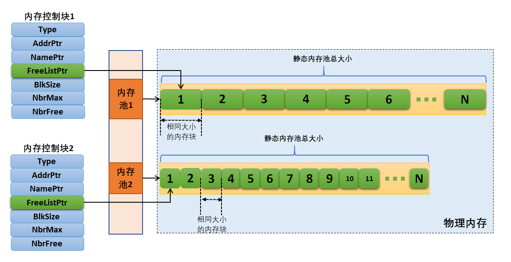
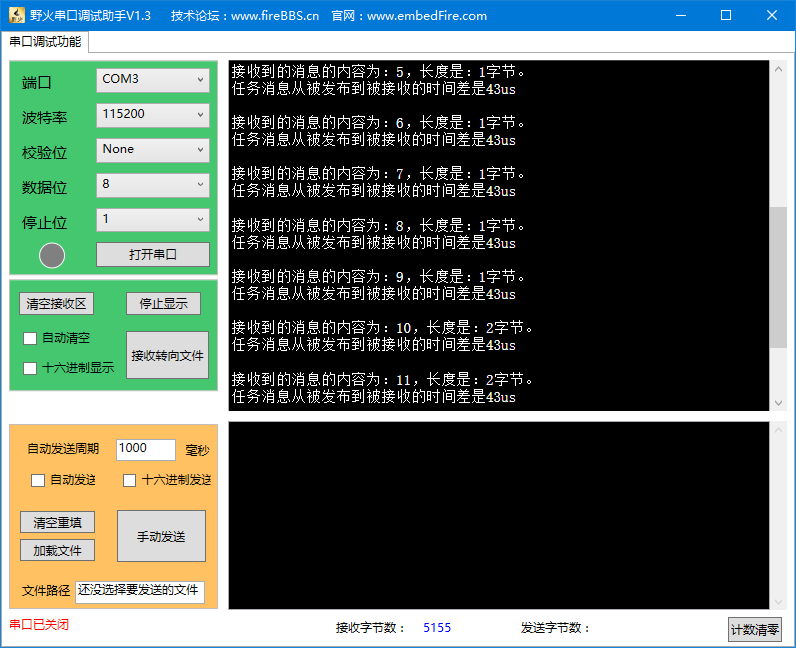

.. vim: syntax=rst

内存管理
===========

内存管理的基本概念
~~~~~~~~~~~~~~~~~~~~~~~~~

在计算系统中，变量、中间数据一般存放在系统存储空间中，只有在实际使用时才将它们从存储空间调入到中央处理器内部进行运算。
通常存储空间可以分为两种：内部存储空间和外部存储空间。内部存储空间访问速度比较快，能够按照变量地址随机地访问，
也就是我们通常所说的RAM（随机存储器），或计算机的内存；而外部存储空间内所保存的内容相对来说比较固定，即使掉电后数据也不会丢失，
可以把它理解为计算机的硬盘。在这一章中我们主要讨论内部存储空间（RAM）的管理——内存管理。

在嵌入式系统设计中，内存分配应该是根据所设计系统的特点来决定选择使用动态内存分配还是静态内存分配算法，
一些可靠性要求非常高的系统应选择使用静态的，而普通的业务系统可以使用动态来提高内存使用效率。
静态可以保证设备的可靠性但是需要考虑内存上限，内存使用效率低，而动态则是相反。

μC/OS的内存管理是采用内存池的方式进行管理，也就是创建一个内存池，静态划分一大块连续空间作为内存管理的空间，
里面划分为很多个内存块，我们在使用的时候就从这个内存池中获取一个内存块，使用完毕的时候用户可以将其放回内存池中，
这样子就不会导致内存碎片的产生。

μC/OS内存管理模块管理用于系统中内存资源，它是操作系统的核心模块之一，主要包括内存池的创建、分配以及释放。

很多人会有疑问，为什么不直接使用C标准库中的内存管理函数呢？在计算机中我们可以用 malloc()和 free()这两个函数动态的分配内存和释放内存。
但是，在嵌入式实时操作系统中，调用 malloc()和 free()却是危险的，原因有以下几点：

    -  这些函数在小型嵌入式系统中并不总是可用的，小型嵌入式设备中的RAM不足。

    -  它们的实现可能非常的大，占据了相当大的一块代码空间。

    -  他们几乎都不是安全的。

    -  它们并不是确定的，每次调用这些函数执行的时间可能都不一样。

    -  它们有可能产生碎片。

    -  这两个函数会使得链接器配置得复杂。

    -  如果允许堆空间的生长方向覆盖其他变量占据的内存，它们会成为debug的灾难。

在一般的实时嵌入式系统中，由于实时性的要求，很少使用虚拟内存机制。所有的内存都需要用户参与分配，直接操作物理内存，
所分配的内存不能超过系统的物理内存，所有的系统栈的管理，都由用户自己管理。

同时，在嵌入式实时操作系统中，对内存的分配时间要求更为苛刻，分配内存的时间必须是确定的。
一般内存管理算法是根据需要存储的数据的长度在内存中去寻找一个与这段数据相适应的空闲内存块，然后将数据存储在里面，
而寻找这样一个空闲内存块所耗费的时间是不确定的，因此对于实时系统来说，这就是不可接受的，
实时系统必须要保证内存块的分配过程在可预测的确定时间内完成，否则实时任务对外部事件的响应也将变得不可确定。

在嵌入式系统中，内存是十分有限而且是十分珍贵的，用一块内存就少了一块内存，而在分配中随着内存不断被分配和释放，
整个系统内存区域会产生越来越多的碎片，因为在使用过程中，申请了一些内存，其中一些释放了，导致内存空间中存在一些小的内存块，
它们地址不连续，不能够作为一整块的大内存分配出去，所以一定会在某个时间，系统已经无法分配到合适的内存了，导致系统瘫痪。
其实系统中实际是还有内存的，但是因为小块的内存的地址不连续，导致无法分配成功，所以我们需要一个优良的内存分配算法来避免这种情况的出现。
所以μC/OS提供的内存分配算法是只允许用户分配固定大小的内存块，当使用完成就将其放回内存池中，这样子分配效率极高，
时间复杂度是O(1)，也就是一个固定的时间常数，并不会因为系统内存的多少而增加遍历内存块列表的时间，并且还不会导致内存碎片的出现，
但是这样的内存分配机制会导致内存利用率的下降以及申请内存大小的限制。

内存管理的运作机制
~~~~~~~~~~~~~~~~~~~~~~~~~

内存池（Memory Pool）是一种用于分配大量大小相同的内存对象的技术，它可以极大加快内存分配/释放的速度。

在系统编译的时候，编译器就静态划分了一个大数组作为系统的内存池，然后在初始化的时候将其分成大小相等的多个内存块，
内存块直接通过链表连接起来（此链表也称为空闲内存块列表）。每次分配的时候，从空闲内存块列表中取出表头上第一个内存块，
提供给申请者。物理内存中允许存在多个大小不同的内存池，每一个内存池又由多个大小相同的空闲内存块组成。
我们必须先创建内存池才能去使用内存池里面的内存块，在创建的时候，我们必须定义一个内存池控制块，然后进行相关初始化，
内存控制块的参数包括内存池名称，内存池起始地址，内存块大小，内存块数量等信息，在以后需要从内存池取出内存块或者释放内存块的时候，
我们只需根据内存控制块的信息就能很轻易做到，内存控制块的数据结构具体见 代码清单:内存管理-1_ 。内存池一旦创建完成，
其内部的内存块大小将不能再做调整，具体见图 静态内存示意图_ 。

.. code-block:: c
    :caption: 代码清单:内存管理-1内存控制块数据结构
    :name: 代码清单:内存管理-1
    :linenos:

    struct os_mem
    {
        OS_OBJ_TYPE          Type;		(1)
        void                *AddrPtr;		(2)
        CPU_CHAR            *NamePtr;		(3)
        void                *FreeListPtr;	(4)
        OS_MEM_SIZE          BlkSize;		(5)
        OS_MEM_QTY           NbrMax;		(6)
        OS_MEM_QTY           NbrFree;		(7)
    #if OS_CFG_DBG_EN > 0u
        OS_MEM              *DbgPrevPtr;
        OS_MEM              *DbgNextPtr;
    #endif
    };

-   代码清单:内存管理-1_  **(1)**\ ：内核对象类型。

-   代码清单:内存管理-1_   **(2)**\ ：内存池的起始地址。

-   代码清单:内存管理-1_   **(3)**\ ：内存池名称。

-   代码清单:内存管理-1_   **(4)**\ ：空闲内存块列表。

-   代码清单:内存管理-1_   **(5)**\ ：内存块大小。

-   代码清单:内存管理-1_   **(6)**\ ：内存池中内存块的总数量。

-   代码清单:内存管理-1_   **(7)**\ ：空闲内存块数量。

注意：内存池中的内存块是通过单链表连接起来的，类似于消息池，内存池在创建的时候内存块地址是连续的，
但是经过多次申请以及释放后，空闲内存块列表的内存块在地址上不一定是连续的。

内存管理的应用场景
~~~~~~~~~~~~~~~~~~~~~~~~~

首先，在使用内存分配前，必须明白自己在做什么，这样做与其他的方法有什么不同，特别是会产生哪些负面影响，在自己的产品面前，应当选择哪种分配策略。

内存管理的主要工作是动态划分并管理用户分配好的内存区间，主要是在用户需要使用大小不等的内存块的场景中使用，
当用户需要分配内存时，可以通过操作系统的内存申请函数索取指定大小内存块，一旦使用完毕，通过动态内存释放函数归还所占用内存，
使之可以重复使用（heap_1.c的内存管理除外）。

例如我们需要定义一个float型数组：floatArr[];

但是，在使用数组的时候，总有一个问题困扰着我们：数组应该有多大？在很多的情况下，你并不能确定要使用多大的数组，
可能为了避免发生错误你就需要把数组定义得足够大。即使你知道想利用的空间大小，但是如果因为某种特殊原因空间利用的大小有增加或者减少，
你又必须重新去修改程序，扩大数组的存储范围。这种分配固定大小的内存分配方法称之为静态内存分配。这种内存分配的方法存在比较严重的缺陷，
在大多数情况下会浪费大量的内存空间，在少数情况下，当你定义的数组不够大时，可能引起下标越界错误，甚至导致严重后果。

μC/OS将系统静态分配的大数组作为内存池，然后进行内存池的初始化，然后分配固定大小的内存块。

注意：μC/OS也不能很好解决这种问题，因为内存块的大小是固定的，无法解决这种弹性很大的内存需求，只能按照最大的内存块进行分配。
但是μC/OS的内存分配能解决内存利用率的问题，在不需要使用内存的时候，将内存释放到内存池中，让其他任务能正常使用该内存块。

内存管理函数接口讲解
~~~~~~~~~~~~~~~~~~~~~~~~~~~~~~

内存池创建函数
^^^^^^^^^^^^^^^^^^^

在使用内存池的时候首先要创建一个内存池，需要用户静态分配一个数组空间作为系统的内存池，且用户还需定义一个内存控制块。
创建内存池后，任务才可以通过系统的内存申请、释放函数从内存池中申请或释放内存，μC/OS提供内存池创建函数OSMemCreate()，
内存池创建函数源码具体见 代码清单:内存管理-2_ 。

.. code-block:: c
    :caption: 代码清单:内存管理-2静态内存创建函数rt_mp_create()源码
    :name: 代码清单:内存管理-2
    :linenos:

    void  OSMemCreate (OS_MEM       *p_mem,    	(1)	//内存池控制块
                    CPU_CHAR     *p_name,   	(2)	//命名内存池
                    void         *p_addr,   	(3)	//内存池首地址
                    OS_MEM_QTY    n_blks,   	(4)	//内存块数目
                    OS_MEM_SIZE   blk_size, 	(5)	//内存块大小（单位：字节）
                    OS_ERR       *p_err)    	(6)	//返回错误类型
    {
    #if OS_CFG_ARG_CHK_EN > 0u
        CPU_DATA       align_msk;
    #endif
        OS_MEM_QTY     i;
        OS_MEM_QTY     loops;
        CPU_INT08U    *p_blk;
        void         **p_link;               //二级指针，存放指针的指针
        CPU_SR_ALLOC(); //使用到临界段（在关/开中断时）时必须用到该宏，该宏声明和
        //定义一个局部变量，用于保存关中断前的 CPU 状态寄存器
        // SR（临界段关中断只需保存SR），开中断时将该值还原。

    #ifdef OS_SAFETY_CRITICAL//如果启用了安全检测
        if (p_err == (OS_ERR *)0)            //如果错误类型实参为空
        {
            OS_SAFETY_CRITICAL_EXCEPTION();  //执行安全检测异常函数
            return;                          //返回，停止执行
        }
    #endif

    #ifdef OS_SAFETY_CRITICAL_IEC61508//如果启用了安全关键
        if (OSSafetyCriticalStartFlag == DEF_TRUE)
        {
            *p_err = OS_ERR_ILLEGAL_CREATE_RUN_TIME;//错误类型为“非法创建内核对象”
            return;                                  //返回，停止执行
        }
    #endif

    #if OS_CFG_CALLED_FROM_ISR_CHK_EN > 0u//如果启用了中断中非法调用检测
        if (OSIntNestingCtr > (OS_NESTING_CTR)0)   //如果该函数是在中断中被调用
        {
            *p_err = OS_ERR_MEM_CREATE_ISR;         //错误类型为“在中断中创建对象”
            return;                                //返回，停止执行
        }
    #endif

    #if OS_CFG_ARG_CHK_EN > 0u//如果启用了参数检测
        if (p_addr == (void *)0)                (7)//如果 p_addr 为空
        {
            *p_err   = OS_ERR_MEM_INVALID_P_ADDR;    //错误类型为“内存池地址非法”
            return;                                        //返回，停止执行
        }
        if (n_blks < (OS_MEM_QTY)2)             (8)//如果内存池的内存块数目少于2
        {
            *p_err = OS_ERR_MEM_INVALID_BLKS;         //错误类型为“内存块数目非法”
            return;                                        //返回，停止执行
        }
        if (blk_size <sizeof(void *))          (9)//如果内存块空间小于指针的
        {
            *p_err = OS_ERR_MEM_INVALID_SIZE;          //错误类型为“内存空间非法”
            return;                                        //返回，停止执行
        }
        align_msk = sizeof(void *) - 1u;        (10)//开始检查内存地址是否对齐
        if (align_msk > 0u)
        {
            if (((CPU_ADDR)p_addr & align_msk) != 0u)  //如果首地址没对齐
            {
                *p_err = OS_ERR_MEM_INVALID_P_ADDR;   //错误类型为“内存池地址非法”
                return;                                    //返回，停止执行
            }
            if ((blk_size & align_msk) != 0u)   (11)//如果内存块地址没对齐
            {
                *p_err = OS_ERR_MEM_INVALID_SIZE;     //错误类型为“内存块大小非法”
                return;                                    //返回，停止执行
            }
        }
    #endif
        /* 将空闲内存块串联成一个单向链表 */
        p_link = (void **)p_addr;              (12)//内存池首地址转为二级指针
        p_blk  = (CPU_INT08U *)p_addr;         (13)//首个内存块地址
        loops  = n_blks - 1u;
        for (i = 0u; i < loops; i++)           (14)//将内存块逐个串成单向链表
        {
            p_blk +=  blk_size;                            //下一内存块地址
            *p_link = (void  *)p_blk;
            //在当前内存块保存下一个内存块地址
            p_link = (void **)(void *)p_blk;
            //下一个内存块的地址转为二级指针
        }
        *p_link             = (void *)0;       (15)//最后一个内存块指向空

        OS_CRITICAL_ENTER();                             //进入临界段
        p_mem->Type        = OS_OBJ_TYPE_MEM;  (16)//设置对象的类型
        p_mem->NamePtr     = p_name;           (17)//保存内存池的命名
        p_mem->AddrPtr     = p_addr;           (18)//存储内存池的首地址
        p_mem->FreeListPtr = p_addr;           (19)//初始化空闲内存块池的首地址
        p_mem->NbrFree     = n_blks;          (20)//存储空闲内存块的数目
        p_mem->NbrMax      = n_blks;           (21)//存储内存块的总数目
        p_mem->BlkSize     = blk_size;         (22)//存储内存块的空间大小

    #if OS_CFG_DBG_EN > 0u//如果启用了调试代码和变量
        OS_MemDbgListAdd(p_mem);      //将内存管理对象插入内存管理双向调试列表
    #endif

        OSMemQty++;             (23)//内存管理对象数目加1

        OS_CRITICAL_EXIT_NO_SCHED();  //退出临界段（无调度）
        *p_err = OS_ERR_NONE;          //错误类型为“无错误”
    }

-   代码清单:内存管理-2_   **(1)**\ ：内存池控制块指针。

-   代码清单:内存管理-2_   **(2)**\ ：内存池名字。

-   代码清单:内存管理-2_   **(3)**\ ：内存池首地址。

-   代码清单:内存管理-2_   **(4)**\ ：内存块数目。

-   代码清单:内存管理-2_   **(5)**\ ：内存块大小（单位：字节）。

-   代码清单:内存管理-2_   **(6)**\ ：返回的错误类型。

-   代码清单:内存管理-2_   **(7)**\ ：如果启用了参数检测，在编译的时候回包含参数检测相关代码，
    如果 p_addr 为空，返回错误类型为“内存池地址非法”的错误代码。

-   代码清单:内存管理-2_   **(8)**\ ：如果内存池的内存块数目少于2，返回错误类型为“内存块数目非法”错误代码。

-   代码清单:内存管理-2_   **(9)**\ ：如果内存块空间小于一个指针的大小（在stm32上是4字节），
    返回错误类型为“内存空间非法”的错误代码。sizeof(void \*)是求出 CPU 指针的字节大小，STM32 是 32 位单片机，
    求出的指针所占字节大小是 4，减去 1 后就是 3，3的二进制数是 11(B)。如果一个地址或者内存块字节大小是4 字节对齐的，
    那么用二进制表示地址或内存块大小最低两位都是 0，比如 11100(B)、101010100(B)这些 4 字节对齐的都最低 2 位都是 0，
    那么 11(B)与上一个低两位字节都是0 的数结果肯定为 0，不为 0 说明不是 4字节对齐。同理可以检测内存块的大小是否是 4的倍数。

-   代码清单:内存管理-2_   **(10)**\ ：开始检查内存地址是否对齐，如果内存池首地址没对齐，返回错误类型为“内存池地址非法”的错误代码。

-   代码清单:内存管理-2_   **(11)**\ ：如果内存块地址没对齐，返回错误类型为“内存块大小非法”的错误代码。

-   代码清单:内存管理-2_   **(12)**\ ：程序执行到这里，就表示传递进来的参数都是正确的，
    下面开始初始化内存池以及内存控制块的信息，将内存池首地址转为二级指针保存在p_link变量中。

-   代码清单:内存管理-2_   **(13)**\ ：获取内存池中首个内存块地址。

-   代码清单:内存管理-2_   **(14)**\ ：将空闲内存块逐个连接成一个单向链表，
    根据内存块起始地址与内存块大小获取下一个内存块的地址，然后在当前内存块中保存下一个内存块的地址，
    再将下一个内存块的地址转为二级指针，将这些内存块连接成一个单链表，也就是空闲内存块链表。

一个内存块的操作是先计算是下一个内存块的地址，因为此时数组元素的地址是连续的，
所以开始的时候只要在前一个内存块的首地址加上内存块字节大小即可得到下一个内存块的首地址，
然后把下一个内存块的首地址放在前一个内存块中，就将他们串起来了，如此循环反复即可串成空闲内存块列表。

-   代码清单:内存管理-2_   **(15)**\ ：然后将最后一个内存块存储的地址为空，
    表示到达空闲内存块列表尾部，连接完成的示意图具体见图 空闲内存块列表初始化完成_ 。

-   代码清单:内存管理-2_   **(16)**\ ：设置对象的类型。

-   代码清单:内存管理-2_   **(17)**\ ：保存内存池的名称。

-   代码清单:内存管理-2_   **(18)**\ ：保存内存池的首地址。

-   代码清单:内存管理-2_   **(19)**\ ：初始化空闲内存块列表的首地址，指向下一个可用的内存块。

-   代码清单:内存管理-2_   **(20)**\ ：保存空闲内存块的数目。

-   代码清单:内存管理-2_   **(21)**\ ：保存内存块的总数目。

-   代码清单:内存管理-2_   **(22)**\ ：保存内存块的空间大小。

-   代码清单:内存管理-2_   **(23)**\ ：创建完成，内存管理对象数目加1。

整个内存池创建完成示意图具体见图 内存池创建完成_ 。

.. image:: media/memory_management/memory004.png
   :align: center
   :name: 内存池创建完成
   :alt: 内存池创建完成

内存池创建函数的使用实例具体见 代码清单:内存管理-3_ 。

.. code-block:: c
    :caption: 代码清单:内存管理-3 OSMemCreate()使用实例
    :name: 代码清单:内存管理-3
    :linenos:

    OS_MEM  mem;                    //声明内存管理对象
    uint8_t ucArray [ 3 ] [ 20 ];   //声明内存池大小

    OS_ERR      err;
    /* 创建内存管理对象 mem */
    OSMemCreate ((OS_MEM      *)&mem,             //指向内存管理对象
                (CPU_CHAR    *)"Mem For Test",   //命名内存管理对象
                (void        *)ucArray,          //内存池的首地址
                (OS_MEM_QTY   )3,                //内存池中内存块数目
                (OS_MEM_SIZE  )20,               //内存块的字节数目
                (OS_ERR      *)&err);            //返回错误类型

内存申请函数OSMemGet()
^^^^^^^^^^^^^^^^^^^^^^^^^^^^^^^^^^^^^^^^^^^^^^^^

这个函数用于申请固定大小的内存块，从指定的内存池中分配一个内存块给用户使用，该内存块的大小在内存池初始化的时候就已经决定的。
如果内存池中有可用的内存块，则从内存池的空闲内存块列表上取下一个内存块并且返回对应的内存地址；如果内存池中已经没有可用内存块，
则返回0与对应的错误代码OS_ERR_MEM_NO_FREE_BLKS，其源码具体见 代码清单:内存管理-4_ 。

.. code-block:: c
    :caption: 代码清单:内存管理-4OSMemGet()源码
    :name: 代码清单:内存管理-4
    :linenos:

    void  *OSMemGet (OS_MEM  *p_mem, 	(1)	//内存管理对象
                    OS_ERR  *p_err) 	(2)	//返回错误类型
    {
        void    *p_blk;
        CPU_SR_ALLOC(); //使用到临界段（在关/开中断时）时必须用到该宏，该宏声明和
        //定义一个局部变量，用于保存关中断前的 CPU 状态寄存器
        // SR（临界段关中断只需保存SR），开中断时将该值还原。

    #ifdef OS_SAFETY_CRITICAL//如果启用了安全检测
        if (p_err == (OS_ERR *)0)            //如果错误类型实参为空
        {
            OS_SAFETY_CRITICAL_EXCEPTION();  //执行安全检测异常函数
            return ((void *)0);              //返回0（有错误），停止执行
        }
    #endif

    #if OS_CFG_ARG_CHK_EN > 0u//如果启用了参数检测
        if (p_mem == (OS_MEM *)0)              //如果 p_mem 为空
        {
            *p_err  = OS_ERR_MEM_INVALID_P_MEM; //错误类型为“内存池非法”
            return ((void *)0);                //返回0（有错误），停止执行
        }
    #endif

        CPU_CRITICAL_ENTER();                    //关中断
        if (p_mem->NbrFree == (OS_MEM_QTY)0) (3)//如果没有空闲的内存块
        {
            CPU_CRITICAL_EXIT();                 //开中断
            *p_err = OS_ERR_MEM_NO_FREE_BLKS;     //错误类型为“没有空闲内存块”
            return ((void *)0);                  //返回0（有错误），停止执行
        }
        p_blk  = p_mem->FreeListPtr; 	(4)	//如果还有空闲内存块，就获取它
        p_mem->FreeListPtr = *(void **)p_blk;(5)//调整空闲内存块指针
        p_mem->NbrFree--;                   (6)//空闲内存块数目减1
        CPU_CRITICAL_EXIT();                     //开中断
        *p_err = OS_ERR_NONE;                     //错误类型为“无错误”
        return (p_blk);                      (7)//返回获取到的内存块
    }

-   代码清单:内存管理-4_   **(1)**\ ：指定内存池对象。

-   代码清单:内存管理-4_   **(2)**\ ：保存返回的错误类型。

-   代码清单:内存管理-4_   **(3)**\ ：判断一下内存池控制块中NbrFree的值，如果没有空闲的内存块，
    就没法申请内存，保存错误类型为“没有空闲内存块”的错误代码，返回0表示没申请到内存块。

-   代码清单:内存管理-4_   **(4)**\ ：如果内存池中还有空闲内存块，就获取它，
    获取的过程就是从空闲内存块中取出一个内存块，并且返回该内存块的地址。

-   代码清单:内存管理-4_   **(5)**\ ：调整内存池控制块的空闲内存块指针，指向下一个可用的内存块。

-   代码清单:内存管理-4_   **(6)**\ ：内存池中空闲内存块数目减1。

-   代码清单:内存管理-4_   **(7)**\ ：返回获取到的内存块地址。

假设我们在内存池创建完成后就调用OSMemGet()函数申请一个内存块，那么申请完毕后的内存块示意图具体见图 申请内存块完成示意图_ ，
被申请出去的内存块会脱离空闲内存块列表，并且内存控制块中的NbrFree变量会减一。

.. image:: media/memory_management/memory005.png
   :align: center
   :name: 申请内存块完成示意图
   :alt: 申请内存块完成示意图

OSMemGet()函数的使用实例具体见 代码清单:内存管理-5_ 。

.. code-block:: c
    :caption: 代码清单:内存管理-5OSMemGet()使用实例
    :name: 代码清单:内存管理-5
    :linenos:

    OS_MEM  mem;                    //声明内存管理对象
    OS_ERR      err;
    /* 向 mem 获取内存块 */
    p_mem_blk = OSMemGet ((OS_MEM      *)&mem,              //指向内存管理对象
                        (OS_ERR      *)&err);             //返回错误类型

内存释放函数
^^^^^^^^^^^^^^^^^^

嵌入式系统的内存对我们来说是十分珍贵的，任何内存块使用完后都必须被释放，否则会造成内存泄漏，
导致系统发生致命错误。μC/OS提供了OSMemPut()函数进行内存的释放管理，使用该函数接口时，根据指定的内存控制块对象，
将内存块插入内存池的空闲内存块列表中，然后增加该内存池的可用内存块数目，其源码具体见 代码清单:内存管理-6_ 。

.. code-block:: c
    :caption: 代码清单:内存管理-6 OSMemPut()源码
    :name: 代码清单:内存管理-6
    :linenos:

    void  OSMemPut (OS_MEM  *p_mem,   	(1)	//内存管理对象
    void    *p_blk,   	(2)	//要退回的内存块
                    OS_ERR  *p_err)   	(3)	//返回错误类型
    {
        CPU_SR_ALLOC(); //使用到临界段（在关/开中断时）时必须用到该宏，该宏声明和
        //定义一个局部变量，用于保存关中断前的 CPU 状态寄存器
        // SR（临界段关中断只需保存SR），开中断时将该值还原。

    #ifdef OS_SAFETY_CRITICAL//如果启用了安全检测
        if (p_err == (OS_ERR *)0)            //如果错误类型实参为空
        {
            OS_SAFETY_CRITICAL_EXCEPTION();  //执行安全检测异常函数
            return;                          //返回，停止执行
        }
    #endif

    #if OS_CFG_ARG_CHK_EN > 0u//如果启用了参数检测
        if (p_mem == (OS_MEM *)0)               //如果 p_mem 为空
        {
            *p_err  = OS_ERR_MEM_INVALID_P_MEM;  //错误类型为“内存池非法”
            return;                             //返回，停止执行
        }
        if (p_blk == (void *)0)                 //如果内存块为空
        {
            *p_err  = OS_ERR_MEM_INVALID_P_BLK;  //错误类型为"内存块非法"
            return;                             //返回，停止执行
        }
    #endif

        CPU_CRITICAL_ENTER();                   //关中断
        if (p_mem->NbrFree >= p_mem->NbrMax)  (4)//如果内存池已满
        {
            CPU_CRITICAL_EXIT();                 //开中断
            *p_err = OS_ERR_MEM_FULL;             //错误类型为“内存池已满”
            return;                              //返回，停止执行
        }
        *(void **)p_blk = p_mem->FreeListPtr; (5)//把内存块插入空闲内存块链表
        p_mem->FreeListPtr = p_blk;           (6)//内存块退回到链表的最前端
        p_mem->NbrFree++;                     (7)//空闲内存块数目加1
        CPU_CRITICAL_EXIT();                  //开中断
        *p_err              = OS_ERR_NONE;        //错误类型为“无错误”
    }

-   代码清单:内存管理-6_   **(1)**\ ：内存控制块指针，指向要操作的内存池。

-   代码清单:内存管理-6_   **(2)**\ ：要释放的内存块。

-   代码清单:内存管理-6_   **(3)**\ ：保存返回的错误类型。

-   代码清单:内存管理-6_   **(4)**\ ：如果内存池已经满了，那是无法进行释放的，返回错误类型为“内存池已满”的错误代码。

-   代码清单:内存管理-6_   **(5)**\ ：如果内存池没满，那么释放内存块到内存池中，把内存块插入空闲内存块列表。

-   代码清单:内存管理-6_   **(6)**\ ：内存块退回到链表的最前端。

-   代码清单:内存管理-6_   **(7)**\ ：空闲内存块数目加1。

我们在释放一个内存块的时候，我们会将内存插入内存池中空闲内存块列表的首部，然后增加内存池中空闲内存块的数量，
该函数的使用实例具体见 代码清单:内存管理-7_ 。

.. code-block:: c
    :caption: 代码清单:内存管理-7 OSMemPut()使用实例
    :name: 代码清单:内存管理-7
    :linenos:

    OS_MEM  mem;                    //声明内存管理对象

    OS_ERR      err;

    /* 释放内存块 */
    OSMemPut ((OS_MEM  *)&mem,                        //指向内存管理对象
            (void    *)pMsg,                        //内存块的首地址
            (OS_ERR  *)&err);                       //返回错误类型

至此μC/OS常用的内存管理函数就讲解完，需要注意的是：我们想要使用内存管理相关的函数时，
需要将os_cfg.h中的OS_CFG_MEM_EN宏定义配置为1；OSMemCreate()只能在任务级被调用，
但是OSMemGet()和OSMemPut()可以在中断中被调用。

内存管理实验
~~~~~~~~~~~~~~~~~~

本次的实验例程采用消息队列进行发送与接收消息，只不过存放消息的地方是在内存块中，在获取完消息的时候，
就进行释放内存块，反复使用内存块，具体见 代码清单:内存管理-8_ 加粗部分。

.. code-block:: c
    :caption: 代码清单:内存管理-8内存管理实验
    :emphasize-lines: 79-85,156-159,216-219
    :name: 代码清单:内存管理-8
    :linenos:

    #include <includes.h>
    #include <string.h>

    OS_MEM  mem;                    //声明内存管理对象
    uint8_t ucArray [ 3 ] [ 20 ];   //声明内存分区大小

    static  OS_TCB   AppTaskStartTCB;    //任务控制块
    static  OS_TCB   AppTaskPostTCB;
    static  OS_TCB   AppTaskPendTCB;

    static  CPU_STK  AppTaskStartStk[APP_TASK_START_STK_SIZE];       //任务栈
    static  CPU_STK  AppTaskPostStk [ APP_TASK_POST_STK_SIZE ];
    static  CPU_STK  AppTaskPendStk [ APP_TASK_PEND_STK_SIZE ];

    static  void  AppTaskStart  (void *p_arg);               //任务函数声明
    static  void  AppTaskPost   ( void * p_arg );
    static  void  AppTaskPend   ( void * p_arg );

    int  main (void)
    {
        OS_ERR  err;
        OSInit(&err);
        //初始化 μC/OS-III

        /* 创建起始任务 */
        OSTaskCreate((OS_TCB     *)&AppTaskStartTCB,
                    //任务控制块地址
                    (CPU_CHAR   *)"App Task Start",
                    //任务名称
                    (OS_TASK_PTR ) AppTaskStart,
                    //任务函数
                    (void       *) 0,
                    //传递给任务函数（形参p_arg）的实参
                    (OS_PRIO     ) APP_TASK_START_PRIO,
                    //任务的优先级
                    (CPU_STK    *)&AppTaskStartStk[0],
                    //任务栈的基地址
                    (CPU_STK_SIZE) APP_TASK_START_STK_SIZE / 10,
                    //任务栈空间剩下1/10时限制其增长
                    (CPU_STK_SIZE) APP_TASK_START_STK_SIZE,
                    //任务栈空间（单位：sizeof(CPU_STK)）
                    (OS_MSG_QTY  ) 5u,
                    //任务可接收的最大消息数
                    (OS_TICK     ) 0u,
                    //任务的时间片节拍数（0表默认值OSCfg_TickRate_Hz/10）
                    (void       *) 0,
                    //任务扩展（0表不扩展）
                    (OS_OPT      )(OS_OPT_TASK_STK_CHK | OS_OPT_TASK_STK_CLR),
                    //任务选项
                    (OS_ERR     *)&err);
                    //返回错误类型
        OSStart(&err);
        //启动多任务管理（交由μC/OS-III控制）
    }

    static  void  AppTaskStart (void *p_arg)
    {
        CPU_INT32U  cpu_clk_freq;
        CPU_INT32U  cnts;
        OS_ERR      err;

        (void)p_arg;

        BSP_Init();   //板级初始化
        CPU_Init();   //初始化 CPU组件（时间戳、关中断时间测量和主机名）

        cpu_clk_freq = BSP_CPU_ClkFreq();
        cnts = cpu_clk_freq / (CPU_INT32U)OSCfg_TickRate_Hz;
        OS_CPU_SysTickInit(cnts);

        Mem_Init();    //初始化内存管理组件（堆内存池和内存池表）

    #if OS_CFG_STAT_TASK_EN > 0u//如果启用（默认启用）了统计任务
        OSStatTaskCPUUsageInit(&err);
    #endif

        CPU_IntDisMeasMaxCurReset();//复位（清零）当前最大关中断时间

        /* 创建内存管理对象 mem */
        OSMemCreate ((OS_MEM      *)&mem,             //指向内存管理对象
                    (CPU_CHAR    *)"Mem For Test",   //命名内存管理对象
                    (void        *)ucArray,          //内存分区的首地址
                    (OS_MEM_QTY   )3,                //内存分区中内存块数目
                    (OS_MEM_SIZE  )20,               //内存块的字节数目
                    (OS_ERR      *)&err);            //返回错误类型

        /* 创建 AppTaskPost 任务 */
        OSTaskCreate((OS_TCB     *)&AppTaskPostTCB,
                    //任务控制块地址
                    (CPU_CHAR   *)"App Task Post",
                    //任务名称
                    (OS_TASK_PTR ) AppTaskPost,
                    //任务函数
                    (void       *) 0,
                    //传递给任务函数（形参p_arg）的实参
                    (OS_PRIO     ) APP_TASK_POST_PRIO,
                    //任务的优先级
                    (CPU_STK    *)&AppTaskPostStk[0],
                    //任务栈的基地址
                    (CPU_STK_SIZE) APP_TASK_POST_STK_SIZE / 10,
                    //任务栈空间剩下1/10时限制其增长
                    (CPU_STK_SIZE) APP_TASK_POST_STK_SIZE,
                    //任务栈空间（单位：sizeof(CPU_STK)）
                    (OS_MSG_QTY  ) 5u,
                    //任务可接收的最大消息数
                    (OS_TICK     ) 0u,
                    //任务的时间片节拍数（0表默认值OSCfg_TickRate_Hz/10）
                    (void       *) 0,
                    //任务扩展（0表不扩展）
                    (OS_OPT      )(OS_OPT_TASK_STK_CHK | OS_OPT_TASK_STK_CLR),
                    //任务选项
                    (OS_ERR     *)&err);
                    //返回错误类型

        /* 创建 AppTaskPend 任务 */
        OSTaskCreate((OS_TCB     *)&AppTaskPendTCB,
                    //任务控制块地址
                    (CPU_CHAR   *)"App Task Pend",
                    //任务名称
                    (OS_TASK_PTR ) AppTaskPend,
                    //任务函数
                    (void       *) 0,
                    //传递给任务函数（形参p_arg）的实参
                    (OS_PRIO     ) APP_TASK_PEND_PRIO,
                    //任务的优先级
                    (CPU_STK    *)&AppTaskPendStk[0],
                    //任务栈的基地址
                    (CPU_STK_SIZE) APP_TASK_PEND_STK_SIZE / 10,
                    //任务栈空间剩下1/10时限制其增长
                    (CPU_STK_SIZE) APP_TASK_PEND_STK_SIZE,
                    //任务栈空间（单位：sizeof(CPU_STK)）
                    (OS_MSG_QTY  ) 50u,
                    //任务可接收的最大消息数
                    (OS_TICK     ) 0u,
                    //任务的时间片节拍数（0表默认值OSCfg_TickRate_Hz/10）
                    (void       *) 0,
                    //任务扩展（0表不扩展）
                    (OS_OPT      )(OS_OPT_TASK_STK_CHK | OS_OPT_TASK_STK_CLR),
                    //任务选项
                    (OS_ERR     *)&err);
                    //返回错误类型
        OSTaskDel ( & AppTaskStartTCB, & err );
        //删除起始任务本身，该任务不再运行
    }

    static  void  AppTaskPost ( void * p_arg )
    {
        OS_ERR      err;
        char *   p_mem_blk;
        uint32_t ulCount = 0;

        (void)p_arg;

        while (DEF_TRUE)                              //任务体
        {
            /* 向 mem 获取内存块 */
            p_mem_blk = OSMemGet ((OS_MEM      *)&mem,
                                //指向内存管理对象
                                (OS_ERR      *)&err);    //返回错误类型

            sprintf ( p_mem_blk, "%d", ulCount ++ );
            //向内存块存取计数值

            /* 发布任务消息到任务 AppTaskPend */
            OSTaskQPost ((OS_TCB      *)&AppTaskPendTCB,
                        //目标任务的控制块
                        (void        *)p_mem_blk,
                        //消息内容的首地址
                        (OS_MSG_SIZE  )strlen ( p_mem_blk ),  //消息长度
                        (OS_OPT       )OS_OPT_POST_FIFO,
                        //发布到任务消息队列的入口端
                        (OS_ERR      *)&err);              //返回错误类型
            OSTimeDlyHMSM ( 0, 0, 1, 0, OS_OPT_TIME_DLY, & err );
        }
    }

    static  void  AppTaskPend ( void * p_arg )
    {
        OS_ERR         err;
        OS_MSG_SIZE    msg_size;
        CPU_TS         ts;
        CPU_INT32U     cpu_clk_freq;
        CPU_SR_ALLOC();

        char * pMsg;
        (void)p_arg;

        cpu_clk_freq = BSP_CPU_ClkFreq();
        //获取CPU时钟，时间戳是以该时钟计数

        while (DEF_TRUE)                                             //任务体
        {
            /* 阻塞任务，等待任务消息 */
            pMsg = OSTaskQPend ((OS_TICK        )0,    //无期限等待
                                (OS_OPT         )OS_OPT_PEND_BLOCKING,
                                //没有消息就阻塞任务
                                (OS_MSG_SIZE   *)&msg_size,  //返回消息长度
                                (CPU_TS        *)&ts,
                                //返回消息被发布的时间戳
                                (OS_ERR        *)&err);  //返回错误类型

            ts = OS_TS_GET() - ts;
            //计算消息从发布到被接收的时间差

            macLED1_TOGGLE ();          //切换LED1的亮灭状态

            OS_CRITICAL_ENTER();
            //进入临界段，避免串口打印被打断

            printf ( "\r\n接收到的消息的内容为：%s，长度是：%d字节。",pMsg, msg_size );

            printf ( "\r\n任务消息从被发布到被接收的时间差是%dus\r\n",ts / ( cpu_clk_freq / 1000000 ) );

            OS_CRITICAL_EXIT();                               //退出临界段

            /* 退还内存块 */
            OSMemPut ((OS_MEM  *)&mem,                 //指向内存管理对象
                    (void    *)pMsg,                        //内存块的首地址
                    (OS_ERR  *)&err);                       //返回错误类型
        }
    }

内存管理实验现象
~~~~~~~~~~~~~~~~~~~~~~~~

程序编译好，用USB线连接计算机和开发板的USB接口（对应丝印为USB转串口），
用DAP仿真器把配套程序下载到野火STM32开发板（具体型号根据购买的板子而定，每个型号的板子都配套有对应的程序），
在计算机上打开串口调试助手，然后复位开发板就可以在调试助手中看到串口的打印信息与运行结果，具体见图 静态内存管理实验现象_ 。

