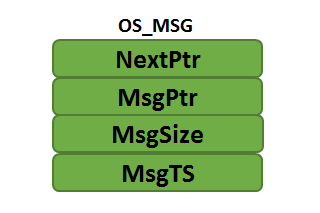
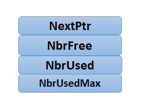
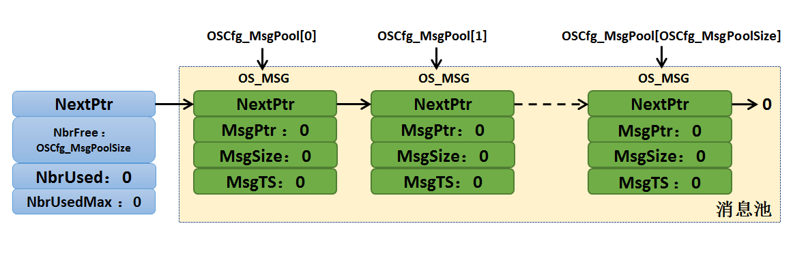
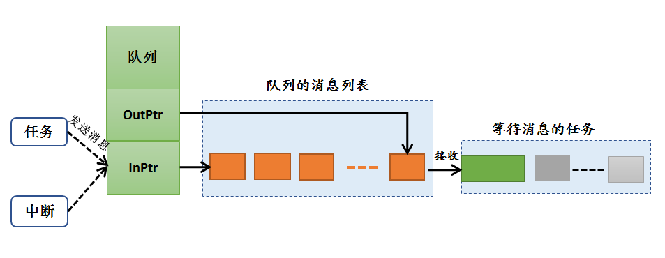
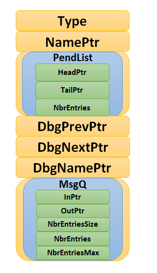
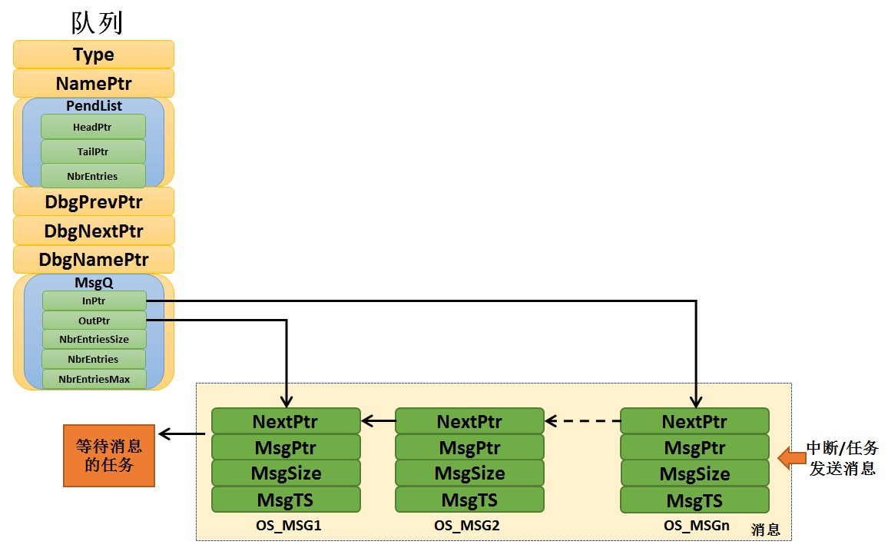
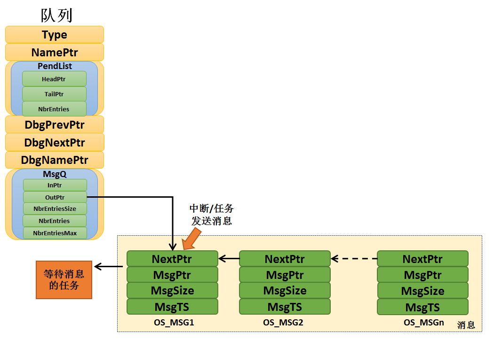
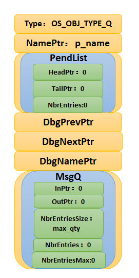
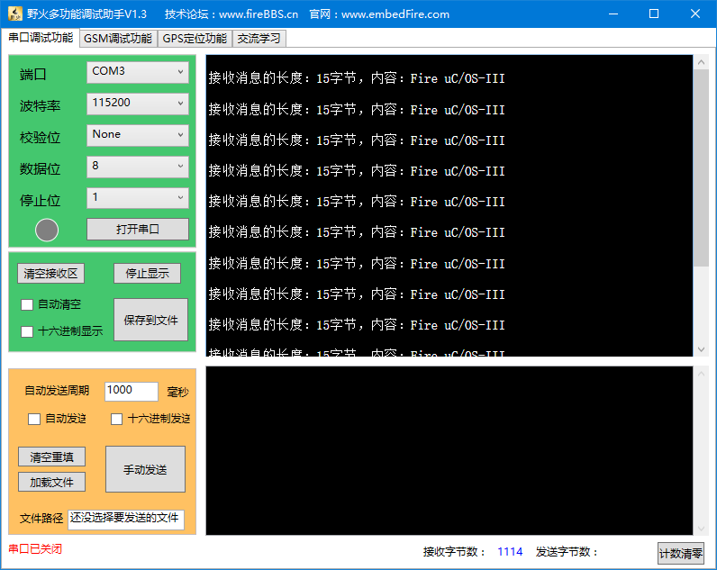

.. vim: syntax=rst

消息队列
===========

同学们，回想一下，在我们裸机的编程中，我们是怎么样用全局的一个数组的呢？

消息队列的基本概念
~~~~~~~~~~~~~~~~~~~~~~~~~

队列又称消息队列，是一种常用于任务间通信的数据结构，队列可以在任务与任务间、中断和任务间传递信息，
实现了任务接收来自其他任务或中断的不固定长度的消息，任务能够从队列里面读取消息，当队列中的消息是空时，
读取消息的任务将被阻塞，用户还可以指定阻塞的任务时间timeout，在这段时间中，如果队列为空，
该任务将保持阻塞状态以等待队列数据有效。当队列中有新消息时，被阻塞的任务会被唤醒并处理新消息；
当等待的时间超过了指定的阻塞时间，即使队列中尚无有效数据，任务也会自动从阻塞态转为就绪态。消息队列是一种异步的通信方式。

通过消息队列服务，任务或中断服务程序可以将消息放入消息队列中。同样，一个或多个任务可以从消息队列中获得消息。当有多个消息发送到消息队列时，
通常是将先进入消息队列的消息先传给任务，也就是说，任务先得到的是最先进入消息队列的消息，即先进先出原则（FIFO），
但是μC/OS也支持后进先出原则（LIFO）。

μC/OS中使用队列数据结构实现任务异步通信工作，具有如下特性：

消息队列工作过程
~~~~~~~~~~~~~~~~~~~~~~~~

在μC/OS-III 中定义了一个数组OSCfg_MsgPool[OS_CFG_MSG_POOL_SIZE]，因为在使用消息队列的时候存取消息比较频繁，
在系统初始化的时候就将这个大数组的各个元素串成单向链表，组成我们说的消息池，而这些元素我们称之为消息。
为什么这里是单向链表而不是我们之前在各种列表中看到的双向链表？因为消息的存取并不需要从链表中间，
只需在链表的首尾存取即可，单向链表即够用，使用双向链表反而更复杂。消息池的大小OS_CFG_MSG_POOL_SIZE由用户自己定义，
该宏定义在os_cfg_app.h头文件中。

可能很多同学有疑问，为什么μC/OS的消息队列要搞一个消息池呢？因为这样子的处理很快，并且共用了资源，
系统中所有被创建的队列都可以从消息池中取出消息，挂载到自身的队列上，以表示消息队列拥有消息，当消息使用完毕，
则又会被释放回到消息池中，其他队列也可以从中取出消息，这样子的消息资源是能被系统所有的消息队列反复使用。

消息池初始化
^^^^^^^^^^^^^^^^^^

在系统初始化（OSInit()）的时候，系统就会将消息池进行初始化，其中， OS_MsgPoolInit()函数就是用来初始化消息池的，
OS_MsgPoolInit()函数的定义位于 os_msg.c文件中，其源码具体见 代码清单:消息队列-1_。

.. code-block:: c
    :caption: 代码清单:消息队列-1OS_MsgPoolInit()源码
    :name: 代码清单:消息队列-1
    :linenos:

    void  OS_MsgPoolInit (OS_ERR  *p_err)   //返回错误类型
    {
        OS_MSG      *p_msg1;
        OS_MSG      *p_msg2;
        OS_MSG_QTY   i;
        OS_MSG_QTY   loops;

    #ifdef OS_SAFETY_CRITICAL(1)//如果启用（默认禁用）了安全检测
    if (p_err == (OS_ERR *)0) {         //如果错误类型实参为空
            OS_SAFETY_CRITICAL_EXCEPTION(); //执行安全检测异常函数
    return;                         //返回，停止执行
        }
    #endif

    #if OS_CFG_ARG_CHK_EN > 0u(2)//如果启用了参数检测
    if (OSCfg_MsgPoolBasePtr == (OS_MSG *)0) {//如果消息池不存在
            *p_err = OS_ERR_MSG_POOL_NULL_PTR;     //错误类型为“消息池指针为空”
    return;                               //返回，停止执行
        }
    if (OSCfg_MsgPoolSize == (OS_MSG_QTY)0) { //如果消息池不能存放消息
            *p_err = OS_ERR_MSG_POOL_EMPTY;        //错误类型为“消息池为空”
    return;                               //返回，停止执行
        }
    #endif
    /* 将消息池里的消息逐条串成单向链表，方便管理 */
        p_msg1 = OSCfg_MsgPoolBasePtr;
        p_msg2 = OSCfg_MsgPoolBasePtr;
        p_msg2++;
        loops  = OSCfg_MsgPoolSize - 1u;
    for (i = 0u; i < loops; i++) {    (3)//初始化每一条消息
            p_msg1->NextPtr = p_msg2;
            p_msg1->MsgPtr  = (void      *)0;
            p_msg1->MsgSize = (OS_MSG_SIZE)0u;
            p_msg1->MsgTS   = (CPU_TS     )0u;
            p_msg1++;
            p_msg2++;
        }
        p_msg1->NextPtr = (OS_MSG    *)0;     (4)//最后一条消息
        p_msg1->MsgPtr  = (void      *)0;
        p_msg1->MsgSize = (OS_MSG_SIZE)0u;
        p_msg1->MsgTS   = (CPU_TS     )0u;
    /* 初始化消息池数据 */
        OSMsgPool.NextPtr    =  OSCfg_MsgPoolBasePtr;(5)
        OSMsgPool.NbrFree    =  OSCfg_MsgPoolSize;
        OSMsgPool.NbrUsed    = (OS_MSG_QTY)0;
        OSMsgPool.NbrUsedMax = (OS_MSG_QTY)0;
        *p_err                =  OS_ERR_NONE;      //错误类型为“无错误”
    }

-   代码清单:消息队列-1_  **(1)**\ ：如果启用了安全检测（OS_SAFETY_CRITICAL）这个宏定义，
    那么在编译代码的时候会包含安全检测，
    如果p_err指针为空，系统会执行安全检测异常函数OS_SAFETY_CRITICAL_EXCEPTION()，然后退出。

-   代码清单:消息队列-1_  **(2)**\ ：如果启用了参数检测（OS_CFG_ARG_CHK_EN）这个宏定义，
    那么在编译代码的时候会包含参数检测，
    如果消息池不存在，系统会返回错误类型为“消息池指针为空”的错误代码，然后退出，不执行初始化操作；如果消息池不能存放消息，
    系统会返回错误类型为“消息池为空”的错误代码，然后退出，也不执行初始化操作。

-   代码清单:消息队列-1_  **(3)**\ ：系统会将消息池里的消息逐条串成单向链表，方便管理，
    通过for循环将消息池中的每个消息元素（消息）进行初始化，并且通过单链表连接起来。

-   代码清单:消息队列-1_  **(4)**\ ：初始化最后一个消息，每个消息有四个元素，具体见图 OS_MSG_

    -  NextPtr ：指向下一个可用的消息。

    -  MsgPtr：指向实际的消息。

    -  MsgSize：记录消息的大小（以字节为单位）。

    -  MsgTS：记录发送消息时的时间戳。

-   代码清单:消息队列-1_  **(5)**\ ：OSMsgPool是个全局变量，用来管理内存池的存取操作，
    它包含以下四个元素，具体见图 OSMsgPool_。

    -  NextPtr ：指向下一个可用的消息。

    -  NbrFree ：记录消息池中可用的消息个数。

    -  NbrUsed：记录已用的消息个数。

    -  NbrUsedMax：记录使用的消息峰值数量。

初始化完成的消息池示意图具体见图 初始化完成的消息池_。

消息队列的运作机制
^^^^^^^^^^^^^^^^^^^^^^^^^

μC/OS的消息队列控制块由多个元素组成，当消息队列被创建时，编译器会静态为消息队列分配对应的内存空间（因为我们需要自己定义一个消息队列控制块），
用于保存消息队列的一些信息如队列的名字，队列可用的最大消息个数，入队指针、出队指针等。在创建成功的时候，这些内存就被占用了，
创建队列的时候用户指定队列的最大消息个数，无法再次更改，每个消息空间可以存放任意类型的数据。

任务或者中断服务程序都可以给消息队列发送消息，当发送消息时，如果队列未满，μC/OS会将从消息池中取出一个消息，将消息挂载到队列的尾部，
消息中的成员变量MsgPtr指向要发送的消息。如果队列已满，则返回错误代码，入队失败。

μC/OS还支持发送紧急消息，也就是我们所说的后进先出（LIFO）排队，其过程与发送消息几乎一样，唯一的不同是，当发送紧急消息时，
发送的消息会挂载到队列的队头而非队尾，这样，接收者就能够优先接收到紧急消息，从而及时进行消息处理。

当某个任务试图读一个队列时，可以指定一个阻塞超时时间。在这段时间中，如果队列为空，该任务将保持阻塞状态以等待队列数据有效。
当其他任务或中断服务程序往其等待的队列中写入了数据，该任务将自动由阻塞态转移为就绪态。当等待的时间超过了指定的阻塞时间，
即使队列中尚无有效数据，任务也会自动从阻塞态转移为就绪态。

当消息队列不再被使用时，可以对它进行删除操作，一旦删除操作完成，消息队列将被永久性的删除，所有关于队列的信息会被清空，
知道再次创建才可使用。

消息队列的运作过程具体见图 消息队列运作过程_。

消息队列的阻塞机制
~~~~~~~~~~~~~~~~~~~~~~~~~

我们使用的消息队列一般不是属于某个任务的队列，在很多时候，我们创建的队列，是每个任务都可以去对他进行读写操作的，
但是为了保护每个任务对它进行读操作的过程（μC/OS队列的写操作是没有阻塞的），我们必须要有阻塞机制，在某个任务对它读操作的时候，
必须保证该任务能正常完成读操作，而不受后来的任务干扰，凡事都有先来后到嘛！

那么，如何实现这个先来后到的机制呢，很简单，因为μC/OS已经为我们做好了，我们直接使用就好了，每个对消息队列读的函数，
都有这种机制，我称之为阻塞机制。假设有一个任务A对某个队列进行读操作的时候（也就是我们所说的出队），发现它没有消息，
那么此时任务A有3个选择：第一个选择，任务A扭头就走，既然队列没有消息，那我也不等了，干其他事情去，这样子任务A不会进入阻塞态；
第二个选择，任务A还是在这里等等吧，可能过一会队列就有消息，此时任务A会进入阻塞状态，在等待着消息的道来，而任务A的等待时间就由我们自己定义，
比如设置1000个系统时钟节拍tick的等待，在这1000个tick到来之前任务A都是处于阻塞态，当阻塞的这段时间任务A等到了队列的消息，
那么任务A就会从阻塞态变成就绪态，如果此时任务A比当前运行的任务优先级还高，那么，任务A就会得到消息并且运行；假如1000个tick都过去了，
队列还没消息，那任务A就不等了，从阻塞态中唤醒，返回一个没等到消息的错误代码，然后继续执行任务A的其他代码；第三个选择，任务A死等，
不等到消息就不走了，这样子任务A就会进入阻塞态，直到完成读取队列的消息。

假如有多个任务阻塞在一个消息队列中，那么这些阻塞的任务将按照任务优先级进行排序，优先级高的任务将优先获得队列的访问权。

如果发送消息的时候用户选择广播消息，那么在等待中的任务都会收到一样的消息。

消息队列的应用场景
~~~~~~~~~~~~~~~~~~~~~~~~~

消息队列可以应用于发送不定长消息的场合，包括任务与任务间的消息交换，队列是μC/OS中任务与任务间、中断与任务间主要的通讯方式，
发送到队列的消息是通过引用方式实现的，这意味着队列存储的是数据的地址，我们可以通过这个地址将这个数据读取出来，这样子，
无论数据量是多大，其操作时间都是一定的，只是一个指向数据地址指针。

消息队列的结构
~~~~~~~~~~~~~~~~~~~

μC/OS的消息队列由多个元素组成，在信号量被创建时，需要由我们自己定义消息队列（也可以称之为消息队列句柄），
因为它是用于保存消息队列的一些信息的，其数据结构OS_Q除了队列必须的一些基本信息外，还有PendList链表与MsgQ，
为的是方便系统来管理消息队列。其数据结构具体见 代码清单:消息队列-2_ ，示意图具体见 消息队列的结构_。

.. code-block:: c
    :caption: 代码清单:消息队列-2消息队列结构
    :name: 代码清单:消息队列-2
    :linenos:

    struct  os_q {
    /* ------------------ GENERIC  MEMBERS ------------------ */
        OS_OBJ_TYPE          Type;              (1)
        CPU_CHAR            *NamePtr;            (2)
        OS_PEND_LIST         PendList;           (3)
    #if OS_CFG_DBG_EN > 0u
        OS_Q                *DbgPrevPtr;
        OS_Q                *DbgNextPtr;
        CPU_CHAR            *DbgNamePtr;
    #endif
    /* ------------------ SPECIFIC MEMBERS ------------------ */
        OS_MSG_Q             MsgQ;               (4)
    };

-   代码清单:消息队列-2_  **(1)**\ ：消息队列的类型，用户无需理会。

-   代码清单:消息队列-2_  **(2)**\ ：消息队列的名字。

-   代码清单:消息队列-2_  **(3)**\ ：等待消息队列的任务列表。

-   代码清单:消息队列-2_  **(4)**\ ：消息列表，这里才是用户要留意的地方，
    这是一个真正管理队列中消息的地方，其结构具体见 代码清单:消息队列-3_。

.. code-block:: c
    :caption: 代码清单:消息队列-3 os_msg_q结构
    :name: 代码清单:消息队列-3
    :linenos:

    struct  os_msg_q {                   /* OS_MSG_Q     */
        OS_MSG              *InPtr;  (1)/*指向要插入队列的下一个OS_MSG的指针*/
        OS_MSG              *OutPtr; (2)/*指向要从队列中提取的下一个OS_MSG的指针*/
        OS_MSG_QTY           NbrEntriesSize;(3)/*队列中允许的最大消息个数*/
        OS_MSG_QTY           NbrEntries; (4)/* 队列中当前的消息个数*/
        OS_MSG_QTY           NbrEntriesMax;(5)/*队列中的消息个数峰值*/
    };

-   代码清单:消息队列-3_  **(1)、(2)**\ ：队列中消息也是用单向链表串联起来的，但存取消息不像消息池只是从固定的一端。
    队列存取消息有两种方式，一种是FIFO模式，即先进先出，这个时候消息的存取是在单向链表的两端，一个头一个尾，
    存取位置可能不一样就产生了这两个输入指针和输出指针，具体见图 FIFO模式_。另一    种是LIFO 模式，后进先出，
    这个时候消息的存取都是在单向链表的一端，仅仅用OutPtr就足够指示存取的位置，具体见图 LIFO模式_。
    当队列中已经存在比较多的消息没有处理，这个时候有个紧急的消息需要马上传送到其他任务去的时候就可以在发布消息的时候选择LIFO模式。

-   代码清单:消息队列-3_  **(3)**\ ：消息队列最大可用的消息个数，消息队列创建的时候由用户指定这个值的大小。

-   代码清单:消息队列-3_  **(4)**\ ：记录消息队列中当前的消息个数，每发送一个消息，若没有任务在等待该消息队列的消息，
    那么新发送的消息被插入此消息队列后此值加1，NbrEntries 的大小不能超过NbrEntriesSize。

-   代码清单:消息队列-3_  **(5)**\ ：记录队列最多的时候拥有的消息个数。

消息队列常用函数讲解
~~~~~~~~~~~~~~~~~~~~~~~~~~~~~~

创建消息队列函数OSQCreate()
^^^^^^^^^^^^^^^^^^^^^^^^^^^^^^^^^^^^^^^^^^^^^^^^^^^^^^^

要使用 μC/OS的消息队列必须先声明和创建消息队列，OSQCreate()用于创建一个新的队列。队列就是一个数据结构，
用于任务间的数据的传递。每创建一个新的队列都需要为其分配RAM，在创建的时候我们需要自己定义一个消息队列结构体，
其内存是由编译器自动分配的，OSQCreate的源码具体见 代码清单:消息队列-4_。

.. code-block:: c
    :caption: 代码清单:消息队列-4OSQCreate()源码
    :name: 代码清单:消息队列-4
    :linenos:

    void  OSQCreate (OS_Q        *p_q,     	(1)	//消息队列指针
                    CPU_CHAR    *p_name,  	(2)	//消息队列名称
                    OS_MSG_QTY   max_qty, 	(3)	//消息队列大小（不能为0）
                    OS_ERR      *p_err)   	(4)	//返回错误类型

    {
        CPU_SR_ALLOC();(5)//使用到临界段（在关/开中断时）时必须用到该宏，该宏声明和
        //定义一个局部变量，用于保存关中断前的 CPU 状态寄存器
        // SR（临界段关中断只需保存SR），开中断时将该值还原。

    #ifdef OS_SAFETY_CRITICAL(6)//如果启用了安全检测
        if (p_err == (OS_ERR *)0) {         //如果错误类型实参为空
            OS_SAFETY_CRITICAL_EXCEPTION(); //执行安全检测异常函数
            return;                         //返回，停止执行
        }
    #endif
    #ifdef OS_SAFETY_CRITICAL_IEC61508	//如果启用了安全关键
    //如果在调用OSSafetyCriticalStart()后创建
        if (OSSafetyCriticalStartFlag == DEF_TRUE) {
            *p_err = OS_ERR_ILLEGAL_CREATE_RUN_TIME; //错误类型为“非法创建内核对象”
            return;                                  //返回，停止执行
        }
    #endif

    #if OS_CFG_CALLED_FROM_ISR_CHK_EN > 0u(7)//如果启用了中断中非法调用检测
        if (OSIntNestingCtr > (OS_NESTING_CTR)0) { //如果该函数是在中断中被调用
            *p_err = OS_ERR_CREATE_ISR;             //错误类型为“在中断中创建对象”
            return;                                //返回，停止执行
        }
    #endif

    #if OS_CFG_ARG_CHK_EN > 0u(8)	//如果启用了参数检测
        if (p_q == (OS_Q *)0) {           //如果 p_q 为空
            *p_err = OS_ERR_OBJ_PTR_NULL;  //错误类型为“创建对象为空”
            return;                       //返回，停止执行
        }
        if (max_qty == (OS_MSG_QTY)0) { (9)//如果 max_qty = 0
            *p_err = OS_ERR_Q_SIZE;        //错误类型为“队列空间为0”
            return;                       //返回，停止执行
        }
    #endif

        OS_CRITICAL_ENTER();             //进入临界段
        p_q->Type    = OS_OBJ_TYPE_Q; (10)//标记创建对象数据结构为消息队列
        p_q->NamePtr = p_name;        (11)//标记消息队列的名称
        OS_MsgQInit(&p_q->MsgQ,          //初始化消息队列
        max_qty);	(12)
        OS_PendListInit(&p_q->PendList); (13)	//初始化该消息队列的等待列表

    #if OS_CFG_DBG_EN > 0u//如果启用了调试代码和变量
        OS_QDbgListAdd(p_q);             //将该队列添加到消息队列双向调试链表
    #endif
        OSQQty++;                    (14)//消息队列个数加1

        OS_CRITICAL_EXIT_NO_SCHED();     	//退出临界段（无调度）
        *p_err = OS_ERR_NONE;           //错误类型为“无错误”
    }

-   代码清单:消息队列-4_  **(1)**\ ：消息队列指针，在创建之前我们要定义一个队列的数据结构，然后将消息队列指针指向该队列。

-   代码清单:消息队列-4_  **(2)**\ ：消息队列的名称，字符串形式，这个名称一般与消息队列名称一致，为了方便调试。

-   代码清单:消息队列-4_  **(3)**\ ：消息队列的大小，也就是消息队列的可用消息个数最大为多少，一旦确定无法修改。

-   代码清单:消息队列-4_  **(4)**\ ：用于保存返回的错误类型。

-   代码清单:消息队列-4_  **(5)**\ ：使用到临界段（在关/开中断时）时必须用到该宏，该宏声明和定义一个局部变量，
    用于保存关中断前的 CPU 状态寄存器SR（临界段关中断只需保存SR），开中断时将该值还原。

-   代码清单:消息队列-4_  **(6)**\ ：如果启用了安全检测，在编译时则会包含安全检测相关的代码，如果错误类型实参为空，
    系统会执行安全检测异常函数，然后返回，停止执行。

-   代码清单:消息队列-4_  **(7)**\ ：如果启用了中断中非法调用检测，在编译时则会包含中断非法调用检测相关的代码，
    如果该函数是在中断中被调用，则是非法的，返回错误类型为“在中断中创建对象”的错误代码，并且退出，不执行创建队列操作。

-   代码清单:消息队列-4_  **(8)**\ ：如果启用了参数检测，在编译时则会包含参数检测相关的代码，
    如果 p_q 参数为空，返回错误类型为“创建对象为空”的错误代码，并且退出，不执行创建队列操作。

-   代码清单:消息队列-4_  **(9)**\ ：如果 max_qty参数为 0，表示不存在消息空间，这也是错误的，
    返回错误类型为“队列空间为0”的错误代码，并且退出，不执行创建队列操作。

-   代码清单:消息队列-4_  **(10)**\ ：标记创建对象数据结构为消息队列。

-   代码清单:消息队列-4_  **(11)**\ ：初始化消息队列的名称。

-   代码清单:消息队列-4_  **(12)**\ ：调用OS_MsgQInit()函数初始化消息队列，其实就是初始化消息队列结构的相关信息，
    该函数源码具体见 代码清单:消息队列-5_。

.. code-block:: c
    :caption: 代码清单:消息队列-5OS_MsgQInit()源码
    :name: 代码清单:消息队列-5
    :linenos:

    void  OS_MsgQInit (OS_MSG_Q    *p_msg_q, //消息队列指针
                    OS_MSG_QTY   size)    //消息队列空间
    {
        p_msg_q->NbrEntriesSize = (OS_MSG_QTY)size; //消息队列可存放消息数目
        p_msg_q->NbrEntries     = (OS_MSG_QTY)0;    //消息队列目前可用消息数
        p_msg_q->NbrEntriesMax  = (OS_MSG_QTY)0;    //可用消息数的最大历史记录
        p_msg_q->InPtr          = (OS_MSG   *)0;    //队列的入队指针
        p_msg_q->OutPtr         = (OS_MSG   *)0;    //队列的出队指针
    }

-   代码清单:消息队列-4_  **(13)**\ ：初始化消息队列的阻塞列表，消息队列的阻塞列表是用于记录阻塞在此消息队列上的任务。

-   代码清单:消息队列-4_  **(14)**\ ：OSQQty是系统中的一个全局变量，
    用于记录已经创建的消息队列个数，现在创建队列完毕，所以该变量要加一。

消息队列创建完成的示意图具体见图 消息队列创建完成_。

在创建消息队列的时候，是需要用户自己定义消息队列的句柄的，但是注意了，定义了队列的句柄并不等于创建了队列，
创建队列必须是调用消息队列创建函数进行创建，否则，以后根据队列句柄使用消息队列的其他函数的时候会发生错误，
用户通过消息队列句柄就可使用消息队列进行发送与获取消息的操作，用户可以根据返回的错误代码进行判断消息队列是否创建成功，
消息队列创建函数OSQCreate()使用实例具体见 代码清单:消息队列-6_。

.. code-block:: c
    :caption: 代码清单:消息队列-6 OSQCreate()使用实例
    :name: 代码清单:消息队列-6
    :linenos:

    OS_Q queue;                             //声明消息队列

    OS_ERR      err;

    /* 创建消息队列 queue */
    OSQCreate ((OS_Q         *)&queue,            //指向消息队列的指针
            (CPU_CHAR     *)"Queue For Test",  //队列的名字
            (OS_MSG_QTY    )20,                //最多可存放消息的数目
            (OS_ERR       *)&err);             //返回错误类型

消息队列删除函数OSQDel()
^^^^^^^^^^^^^^^^^^^^^^^^^^^^^^^^^^^^^^^^^^^^^^^^

队列删除函数是根据队列结构（队列句柄）直接删除的，删除之后这个消息队列的所有信息都会被系统清空，而且不能再次使用这个消息队列了，
但是需要注意的是，如果某个消息队列没有被定义，那也是无法被删除的。想要使用消息队列删除函数就必须将OS_CFG_Q_DEL_EN宏定义配置为1，
其函数源码具体见 代码清单:消息队列-7_。

.. code-block:: c
    :caption: 代码清单:消息队列-7OSQDel()源码
    :name: 代码清单:消息队列-7
    :linenos:

    #if OS_CFG_Q_DEL_EN > 0u//如果启用了 OSQDel() 函数
    OS_OBJ_QTY  OSQDel (OS_Q    *p_q,   (1)//消息队列指针
                        OS_OPT   opt,  (2)//选项
                OS_ERR  *p_err) (3)//返回错误类型
    {
        OS_OBJ_QTY     cnt;
        OS_OBJ_QTY     nbr_tasks;
        OS_PEND_DATA  *p_pend_data;
        OS_PEND_LIST  *p_pend_list;
        OS_TCB        *p_tcb;
        CPU_TS         ts;
        CPU_SR_ALLOC(); //使用到临界段（在关/开中断时）时必须用到该宏，该宏声明和
    //定义一个局部变量，用于保存关中断前的 CPU 状态寄存器
    // SR（临界段关中断只需保存SR），开中断时将该值还原。

    #ifdef OS_SAFETY_CRITICAL(4)//如果启用（默认禁用）了安全检测
    if (p_err == (OS_ERR *)0) {         //如果错误类型实参为空
            OS_SAFETY_CRITICAL_EXCEPTION(); //执行安全检测异常函数
    return ((OS_OBJ_QTY)0);         //返回0（有错误），停止执行
        }
    #endif

    #if OS_CFG_CALLED_FROM_ISR_CHK_EN > 0u(5)//如果启用了中断中非法调用检测
    if (OSIntNestingCtr > (OS_NESTING_CTR)0) {  //如果该函数在中断中被调用
            *p_err = OS_ERR_DEL_ISR;                 //错误类型为“在中断中中止等待”
    return ((OS_OBJ_QTY)0);                 //返回0（有错误），停止执行
        }
    #endif

    #if OS_CFG_ARG_CHK_EN > 0u(6)//如果启用了参数检测
    if (p_q == (OS_Q *)0) {               //如果 p_q 为空
            *p_err =  OS_ERR_OBJ_PTR_NULL;     //错误类型为“对象为空”
    return ((OS_OBJ_QTY)0u);          //返回0（有错误），停止执行
        }
    switch (opt) {              (7)//根据选项分类处理
    case OS_OPT_DEL_NO_PEND:          //如果选项在预期内
    case OS_OPT_DEL_ALWAYS:
    break;                       //直接跳出

    default:			(8)
            *p_err =  OS_ERR_OPT_INVALID; //如果选项超出预期
    return ((OS_OBJ_QTY)0u);     //返回0（有错误），停止执行
        }
    #endif

    #if OS_CFG_OBJ_TYPE_CHK_EN > 0u(9)//如果启用了对象类型检测
    if (p_q->Type != OS_OBJ_TYPE_Q) { //如果 p_q 不是消息队列类型
            *p_err = OS_ERR_OBJ_TYPE;      //错误类型为“对象类型有误”
    return ((OS_OBJ_QTY)0);       //返回0（有错误），停止执行
        }
    #endif

        CPU_CRITICAL_ENTER();                                  //关中断
        p_pend_list = &p_q->PendList;      (10)//获取消息队列的等待列表
        cnt         = p_pend_list->NbrEntries;  (11)//获取等待该队列的任务数
        nbr_tasks   = cnt;               (12)//按照任务数目逐个处理
    switch (opt) {                   (13)//根据选项分类处理
    case OS_OPT_DEL_NO_PEND:        (14)//如果只在没有任务等待的情况下删除队列
    if (nbr_tasks == (OS_OBJ_QTY)0) {(15)//如果没有任务在等待该队列
    #if OS_CFG_DBG_EN > 0u//如果启用了调试代码和变量
                OS_QDbgListRemove(p_q);          //将该队列从消息队列调试列表移除
    #endif
                OSQQty--;                (16)//消息队列数目减1
        OS_QClr(p_q);            (17)//清除该队列的内容
                CPU_CRITICAL_EXIT();                      //开中断
                *p_err = OS_ERR_NONE;     (18)//错误类型为“无错误”
            } else {  (19)//如果有任务在等待该队列
                CPU_CRITICAL_EXIT();               //开中断
                *p_err = OS_ERR_TASK_WAITING;      //错误类型为“有任务在等待该队列”
            }
    break;

    case OS_OPT_DEL_ALWAYS:                (20)//如果必须删除信号量
            OS_CRITICAL_ENTER_CPU_EXIT();                  //进入临界段，重开中断
            ts = OS_TS_GET();                              //获取时间戳
    while (cnt > 0u) {              (21)//逐个移除该队列等待列表中的任务
                p_pend_data = p_pend_list->HeadPtr;
                p_tcb       = p_pend_data->TCBPtr;
                OS_PendObjDel((OS_PEND_OBJ *)((void *)p_q),
                            p_tcb,
                            ts);
                cnt--;				(22)
            }
    #if OS_CFG_DBG_EN > 0u//如果启用了调试代码和变量
            OS_QDbgListRemove(p_q);            //将该队列从消息队列调试列表移除
    #endif
            OSQQty--;                          (23)//消息队列数目减1
            OS_QClr(p_q);                      (24)//清除消息队列内容
            OS_CRITICAL_EXIT_NO_SCHED();                  //退出临界段（无调度）
            OSSched();                        (25)//调度任务
            *p_err = OS_ERR_NONE;              (26)//错误类型为“无错误”
    break;                                        //跳出

    default:(27)//如果选项超出预期
            CPU_CRITICAL_EXIT();              //开中断
            *p_err = OS_ERR_OPT_INVALID;                   //错误类型为“选项非法”
    break;                                        //跳出
        }
    return (nbr_tasks);                 //返回删除队列前等待其的任务数
    }
    #endif

-   代码清单:消息队列-7_ **(1)**\ ：消息队列指针，指向要删除的消息队列。

-   代码清单:消息队列-7_ **(2)**\ ：操作消息队列的选项，具体在后面讲解。

-   代码清单:消息队列-7_ **(3)**\ ：用于保存返回的错误类型。

-   代码清单:消息队列-7_ **(4)**\ ：如果启用（默认禁用）了安全检测，在编译时则会包含安全检测相关的代码，如果错误类型实参为空，
    系统会执行安全检测异常函数，然后返回，停止执行。

-   代码清单:消息队列-7_ **(5)**\ ：如果启用了中断中非法调用检测，在编译时则会包含中断非法调用检测相关的代码，
    如果该函数是在中断中被调用，则是非法的，返回错误类型为“在中断中删除”的错误代码，并且退出，不执行删除队列操作。

-   代码清单:消息队列-7_ **(6)**\ ：如果启用了参数检测，在编译时则会包含参数检测相关的代码，如果 p_q 参数为空，
    返回错误类型为“删除对象为空”的错误代码，并且退出，不执行删除队列操作。

-   代码清单:消息队列-7_ **(7)**\ ：根据选项分类处理，如果选项在预期内，直接跳出switch语句。

-   代码清单:消息队列-7_ **(8)**\ ：如果选项超出预期，就退出，不执行删除队列操作。

-   代码清单:消息队列-7_ **(9)**\ ：如果启用了对象类型检测，在编译时则会包含对象类型检测相关代码，如果 p_q 不是消息队列类型，
    那么返回错误类型为“对象类型有误”的错误代码，并且退出，不执行删除队列操作。

-   代码清单:消息队列-7_ **(10)**\ ：程序能执行到这里，说明传入的参数都是正确的，此时可以执行删除队列操作，
    系统首先获取消息队列中的等待列表，通过p_pend_list变量进行消息队列等待列表的访问。

-   代码清单:消息队列-7_ **(11)**\ ：获取阻塞在该队列上的任务个数。

-   代码清单:消息队列-7_ **(12)**\ ：按照任务数目逐个处理。

-   代码清单:消息队列-7_ **(13)**\ ：根据选项分类处理。

-   代码清单:消息队列-7_ **(14)**\ ：如果如果删除选项是只在没有任务等待的情况下删除队列，系统就会判断有没有任务阻塞在改队列上。

-   代码清单:消息队列-7_ **(15)**\ ：如果没有任务在等待该队列，那就执行删除操作。

-   代码清单:消息队列-7_ **(16)**\ ：系统的消息队列数目减1。

-   代码清单:消息队列-7_ **(17)**\ ：清除该队列的内容。

-   代码清单:消息队列-7_ **(18)**\ ：返回错误类型为“无错误”的错误代码。

-   代码清单:消息队列-7_ **(19)**\ ：而如果有任务在等待该队列，那么就没法进行删除操作，返回错误类型为“有任务在等待该队列”的错误代码。

-   代码清单:消息队列-7_ **(20)**\ ：如果删除操作的选项是必须删除消息队列，无论是否有任务阻塞在该消息队列上，系统都会进行删除操作。

-   代码清单:消息队列-7_ **(21)**\ ：根据消息队列当前等待的任务个数，逐个移除该队列等待列表中的任务。

-   代码清单:消息队列-7_ **(22)**\：调用OS_PendObjDel()函数将阻塞在内核对象（如信号量）上的任务从阻塞态恢复，
    此时系统在删除内核对象，
    删除之后，这些等待事件的任务需要被恢复，其源码具体见 代码清单:消息队列-8_。每移除一个，消息队列的任务个数就减一，
    当没有任务阻塞在该队列上，就进行删除队列操作。

.. code-block:: c
    :caption: 代码清单:消息队列-8OS_PendObjDel()源码
    :name: 代码清单:消息队列-8
    :linenos:

    void  OS_PendObjDel (OS_PEND_OBJ  *p_obj,  (1)	//被删除对象的类型
                        OS_TCB       *p_tcb, (2)	//任务控制块指针
            CPU_TS        ts)    (3)	//信号量被删除时的时间戳
    {
    switch (p_tcb->TaskState)             (4)//根据任务状态分类处理
        {
    case OS_TASK_STATE_RDY:                             //如果任务是就绪状态
    case OS_TASK_STATE_DLY:                             //如果任务是延时状态
    case OS_TASK_STATE_SUSPENDED:                       //如果任务是挂起状态
    case OS_TASK_STATE_DLY_SUSPENDED:            //如果任务是在延时中被挂起
    break;                           (5)
    //这些情况均与等待无关，直接跳出

    case OS_TASK_STATE_PEND:                    //如果任务是无期限等待状态
    case OS_TASK_STATE_PEND_TIMEOUT:            //如果任务是有期限等待状态
    if (p_tcb->PendOn == OS_TASK_PEND_ON_MULTI)
    //如果任务在等待多个信号量或消息队列
            {
                OS_PendObjDel1(p_obj,              //强制解除任务对某一对象的等待
                            p_tcb,
                            ts);	 (6)
            }
    #if (OS_MSG_EN > 0u)(7)//如果启用了任务队列或消息队列
            p_tcb->MsgPtr     = (void *)0;        //清除（复位）任务的消息域
            p_tcb->MsgSize    = (OS_MSG_SIZE)0u;
    #endif
            p_tcb->TS         = ts;          (8)
    //保存等待被中止时的时间戳到任务控制块
            OS_PendListRemove(p_tcb);      (9)//将任务从所有等待列表中移除
            OS_TaskRdy(p_tcb);              (10)//让任务进准备运行
            p_tcb->TaskState  = OS_TASK_STATE_RDY;  (11)//修改任务状态为就绪状态
            p_tcb->PendStatus = OS_STATUS_PEND_DEL;(12)//标记任务的等待对象被删除
    p_tcb->PendOn     = OS_TASK_PEND_ON_NOTHING;(13)//标记任务目前没有等待任何对象
    break;                                       //跳出

    case OS_TASK_STATE_PEND_SUSPENDED:      //如果任务在无期限等待中被挂起
    case OS_TASK_STATE_PEND_TIMEOUT_SUSPENDED: //如果任务在有期限等待中被挂起
    if (p_tcb->PendOn == OS_TASK_PEND_ON_MULTI)
    //如果任务在等待多个信号量或消息队列
            {
                OS_PendObjDel1(p_obj,          //强制解除任务对某一对象的等待
                            p_tcb,
                            ts);		(14)
            }
    #if (OS_MSG_EN > 0u)(15)//如果启用了任务队列或消息队列
            p_tcb->MsgPtr     = (void      *)0;(16)//清除（复位）任务的消息域
            p_tcb->MsgSize    = (OS_MSG_SIZE)0u;
    #endif
            p_tcb->TS         = ts;      (17)
    //保存等待被中止时的时间戳到任务控制块
            OS_TickListRemove(p_tcb);     (18)//让任务脱离节拍列表
            OS_PendListRemove(p_tcb);     (19)//将任务从所有等待列表中移除
            p_tcb->TaskState  = OS_TASK_STATE_SUSPENDED; (20)//修改任务状态为挂起状态
    p_tcb->PendStatus = OS_STATUS_PEND_DEL;(21)//标记任务的等待对象被删除
            p_tcb->PendOn     = OS_TASK_PEND_ON_NOTHING;  //标记任务目前没有等待任何对象
    break;                                        //跳出

    default:                               (22)//如果任务状态超出预期
    break;                                        //不需处理，直接跳出
        }
    }

-   代码清单:消息队列-8_ **(1)**\ ：被删除对象的类型（如消息队列、信号量、互斥量、事件等）。

-   代码清单:消息队列-8_ **(2)**\ ：任务控制块指针。

-   代码清单:消息队列-8_ **(3)**\ ：内核对象被删除时的时间戳。

-   代码清单:消息队列-8_ **(4)**\ ：根据任务状态分类处理。

-   代码清单:消息队列-8_ **(5)**\ ：如果任务是就绪状态、延时状态、挂起状态或者是在延时中被挂起，
    这些任务状态均与等待内核对象是无关的，在内核对象被删除的时候无需进行任何操作。

-   代码清单:消息队列-8_ **(6)**\ ：如果任务是无期限等待状态或者是有期限等待状态，
    那么在内核对象被删除的时候需要将这些任务恢复。如果这些任务在等待多个内核对象（信号量或消息队列等），
    那么就需要强制解除任务对某一对象的等待，比如现在删除的是消息队列，
    那么就将该任务对消息队列的等待进行解除。

-   代码清单:消息队列-8_ **(7)**\ ：如果启用了任务队列或消息队列，清除（复位）任务的消息指针，任务等待的消息大小为0。

-   代码清单:消息队列-8_ **(8)**\ ：保存等待被中止时的时间戳到任务控制块。

-   代码清单:消息队列-8_ **(9)**\ ：调用OS_PendListRemove()函数将任务从所有等待列表中移除。

-   代码清单:消息队列-8_ **(10)**\ ：调用OS_TaskRdy()函数让任务进入就绪态参与系统调度，准备运行。

-   代码清单:消息队列-8_ **(11)**\ ：修改任务状态为就绪状态。

-   代码清单:消息队列-8_ **(12)**\ ：标记任务的等待对象被删除。

-   代码清单:消息队列-8_ **(13)**\ ：标记任务目前没有等待任何对象。

-   代码清单:消息队列-8_ **(14)**\：如果任务在无期限等待中被挂起或者在有期限等待中被挂起，
    也是需要将这些等待内核对象的任务从等待中移除，但是由于在等待中被挂起，那么就不会将这些任务恢复为就绪态，
    仅仅是将任务从等待列表中移除。如果任务在等待多个信号量或消息队列，同样也是讲任务从等待的对象中移除即可。

-   代码清单:消息队列-8_ **(15)**\ ：如果启用了任务队列或消息队列。

-   代码清单:消息队列-8_ **(16)**\ ：需要清除（复位）任务的消息指针，任务等待的消息大小为0。

-   代码清单:消息队列-8_ **(17)**\ ：保存等待被中止时的时间戳到任务控制块。

-   代码清单:消息队列-8_ **(18)**\ ：调用OS_TickListRemove()函数让任务脱离节拍列表。

-   代码清单:消息队列-8_ **(19)**\ ：调用OS_PendListRemove()函数将任务从所有等待列表中移除。

-   代码清单:消息队列-8_ **(20)**\ ：修改任务状态为挂起状态，因为在等待中被挂起，此时即使任务不等的内核对象了，它还是处于挂起态。

-   代码清单:消息队列-8_ **(21)**\ ：任务的等待对象被删除，标记任务目前没有等待任何对象。

-   代码清单:消息队列-8_ **(22)**\ ：如果任务状态超出预期，不需处理，直接跳出。

-   代码清单:消息队列-7_ **(23)**\ ：系统的消息队列数目减1。

-   代码清单:消息队列-7_ **(24)**\ ：清除消息队列内容。

-   代码清单:消息队列-7_ **(25)**\ ：发起一次调度任务。

-   代码清单:消息队列-7_ **(26)**\ ：返回错误类型为“无错误”的错误代码。

-   代码清单:消息队列-7_ **(27)**\ ：而如果选项超出预期，返回错误类型为“选项非法”的错误代，码，然后退出。

消息队列删除函数OSQDel()的使用也是很简单的，只需要传入要删除的消息队列的句柄与选项还有保存返回的错误类型即可，调用函数时，
系统将删除这个消息队列。需要注意的是在调用删除消息队列函数前，系统应存在已创建的消息队列。如果删除消息队列时，
有任务正在等待消息，则不应该进行删除操作，删除之后的消息队列就不可用了，删除消息队列函数OSQDel()的使用实例具体见 代码清单:消息队列-9_。

.. code-block:: c
    :caption: 代码清单:消息队列-9消息队列删除函数OSQDel()使用实例
    :name: 代码清单:消息队列-9
    :linenos:

    OS_Q queue;                             //声明消息队列

    OS_ERR      err;

    /* 删除消息队列 queue */
    OSQDel ((OS_Q         *)&queue,            //指向消息队列的指针
    OS_OPT_DEL_NO_PEND,
    (OS_ERR       *)&err);             //返回错误类型

消息队列发送函数OSQPost()
^^^^^^^^^^^^^^^^^^^^^^^^^^^^^^^^^^^^^^^^^^^^^^^^^

任务或者中断服务程序都可以给消息队列发送消息，当发送消息时，如果队列未满，就说明运行信息入队。μC/OS会从消息池中取出一个消息，
挂载到消息队列的末尾（FIFO发送方式），如果是LIFO发送方式，则将消息挂载到消息队列的头部，
然后将消息中MsgPtr成员变量指向要发送的消息（此处可以理解为添加要发送的信息到消息（块）中），
如果系统有任务阻塞在消息队列中，那么在发送了消息队列的时候，会将任务解除阻塞，其源码具体见 代码清单:消息队列-10_。

.. code-block:: c
    :caption: 代码清单:消息队列-10 OSQPost()源码
    :name: 代码清单:消息队列-10
    :linenos:

    void  OSQPost (OS_Q         *p_q,     (1)	//消息队列指针
    void         *p_void,  (2)	//消息指针
            OS_MSG_SIZE   msg_size,(3)	//消息大小（单位：字节）
                OS_OPT        opt,     (4)	//选项
                OS_ERR       *p_err)   (5)	//返回错误类型
    {
        CPU_TS  ts;

    #ifdef OS_SAFETY_CRITICAL(6)//如果启用（默认禁用）了安全检测
    if (p_err == (OS_ERR *)0) {         //如果错误类型实参为空
            OS_SAFETY_CRITICAL_EXCEPTION(); //执行安全检测异常函数
    return;                         //返回，停止执行
        }
    #endif

    #if OS_CFG_ARG_CHK_EN > 0u(7)//如果启用了参数检测
    if (p_q == (OS_Q *)0) {            //如果 p_q 为空
            *p_err = OS_ERR_OBJ_PTR_NULL;   //错误类型为“内核对象为空”
    return;                        //返回，停止执行
        }
    switch (opt) {                   (8)//根据选项分类处理
    case OS_OPT_POST_FIFO:             //如果选项在预期内
    case OS_OPT_POST_LIFO:
    case OS_OPT_POST_FIFO | OS_OPT_POST_ALL:
    case OS_OPT_POST_LIFO | OS_OPT_POST_ALL:
    case OS_OPT_POST_FIFO | OS_OPT_POST_NO_SCHED:
    case OS_OPT_POST_LIFO | OS_OPT_POST_NO_SCHED:
    case OS_OPT_POST_FIFO | OS_OPT_POST_ALL | OS_OPT_POST_NO_SCHED:
    case OS_OPT_POST_LIFO | OS_OPT_POST_ALL | OS_OPT_POST_NO_SCHED:
    break;                       //直接跳出

    default:                       (9)//如果选项超出预期
            *p_err =  OS_ERR_OPT_INVALID; //错误类型为“选项非法”
    return;                      //返回，停止执行
        }
    #endif

    #if OS_CFG_OBJ_TYPE_CHK_EN > 0u(10)//如果启用了对象类型检测
    if (p_q->Type != OS_OBJ_TYPE_Q) { //如果 p_q 不是消息队列类型
            *p_err = OS_ERR_OBJ_TYPE;      //错误类型为“对象类型错误”
    return;                       //返回，停止执行
        }
    #endif

        ts = OS_TS_GET();                 //获取时间戳

    #if OS_CFG_ISR_POST_DEFERRED_EN > 0u(11)//如果启用了中断延迟发布
    if (OSIntNestingCtr > (OS_NESTING_CTR)0) {  //如果该函数在中断中被调用
            OS_IntQPost((OS_OBJ_TYPE)OS_OBJ_TYPE_Q, //将该消息发布到中断消息队列
                        (void      *)p_q,
                        (void      *)p_void,
                        (OS_MSG_SIZE)msg_size,
                        (OS_FLAGS   )0,
                        (OS_OPT     )opt,
                        (CPU_TS     )ts,
                        (OS_ERR    *)p_err);
    return;                                //返回（尚未发布），停止执行
        }
    #endif

        OS_QPost(p_q,                              //将消息按照普通方式
                p_void,
                msg_size,
                opt,
                ts,
                p_err);			(12)
    }

-   代码清单:消息队列-10_ **(1)**\ ：消息队列指针，指向要发送消息的队列。

-   代码清单:消息队列-10_ **(2)**\ ：消息指针，指向任何类型的消息数据。

-   代码清单:消息队列-10_ **(3)**\ ：消息的大小（单位：字节）。

-   代码清单:消息队列-10_ **(4)**\ ：发送消息的选项，在os.h中定义，具体见代码清单:消息队列-11。

.. code-block:: c
    :caption: 代码清单:消息队列-11发送消息的选项
    :name: 代码清单:消息队列-11
    :linenos:

    #define  OS_OPT_POST_FIFO   (OS_OPT)(0x0000u)/* 默认采用FIFO方式发送 */
    #define  OS_OPT_POST_LIFO  (OS_OPT)(0x0010u)/*采用LIFO方式发送消息*/
    #define  OS_OPT_POST_1   (OS_OPT)(0x0000u)/*将消息发布到最高优先级的等待任务*/
    #define  OS_OPT_POST_ALL (OS_OPT)(0x0200u)/*向所有等待的任务广播消息*/

    #define  OS_OPT_POST_NO_SCHED (OS_OPT)(0x8000u)/*发送消息但是不进行任务调度*/

-   代码清单:消息队列-10_ **(5)**\ ：保存返回的错误类型，用户可以根据此变量得知错误的原因。

-   代码清单:消息队列-10_ **(6)**\ ：如果启用（默认禁用）了安全检测，在编译时则会包含安全检测相关的代码，如果错误类型实参为空，
    系统会执行安全检测异常函数，然后返回，停止执行。

-   代码清单:消息队列-10_ **(7)**\ ：如果启用了参数检测，在编译时则会包含参数检测相关的代码，如果 p_q 参数为空，
    返回错误类型为“内核对象为空”的错误代码，并且退出，不执行发送消息操作。

-   代码清单:消息队列-10_ **(8)**\ ：根据opt选项进行分类处理，如果选项在预期内，直接退出，其实在这里只是对选项的一个检查，
    看看传入的选项参数是否正确。

-   代码清单:消息队列-10_ **(9)**\ ：如果opt选项超出预期，返回错误类型为“选项非法”的错误代码，并且退出，不执行发送消息操作。

-   代码清单:消息队列-10_ **(10)**\ ：如果启用了对象类型检测，在编译时则会包含对象类型检测相关代码，
    如果 p_q 不是消息队列类型，那么返回错误类型为“对象类型有误”的错误代码，并且退出，不执行发送消息操作。

-   代码清单:消息队列-10_ **(11)**\ ：如果启用了中断延迟发布，并且发送消息的函数是在中断中被调用，
    此时就不该立即发送消息，而是将消息的发送放在指定发布任务中，此时系统就将消息发布到租单消息队列中，
    等待到中断发布任务唤醒再发送消息，该函数会在中断管理章节详细讲解。

-   代码清单:消息队列-10_ **(12)**\ ：而如果不是在中断中调用OSQPost()函数，或者未启用中断延迟发布，
    则直接调用OS_QPost()函数进行消息的发送，OS_QPost()函数源码具体见 代码清单:消息队列-12_。

.. code-block:: c
    :caption: 代码清单:消息队列-12 OS_QPost()源码
    :name: 代码清单:消息队列-12
    :linenos:

    void  OS_QPost (OS_Q         *p_q,      //消息队列指针
    void         *p_void,   //消息指针
                    OS_MSG_SIZE   msg_size, //消息大小（单位：字节）
                    OS_OPT        opt,      //选项
                    CPU_TS        ts,       //消息被发布时的时间戳
                    OS_ERR       *p_err)    //返回错误类型
    {
        OS_OBJ_QTY     cnt;
        OS_OPT         post_type;
        OS_PEND_LIST  *p_pend_list;
        OS_PEND_DATA  *p_pend_data;
        OS_PEND_DATA  *p_pend_data_next;
        OS_TCB        *p_tcb;
        CPU_SR_ALLOC();  //使用到临界段（在关/开中断时）时必须用到该宏，该宏声明和
    //定义一个局部变量，用于保存关中断前的 CPU 状态寄存器
    // SR（临界段关中断只需保存SR），开中断时将该值还原。

        OS_CRITICAL_ENTER();                              //进入临界段
        p_pend_list = &p_q->PendList;                	//取出该队列的等待列表
    if (p_pend_list->NbrEntries == (OS_OBJ_QTY)0)    (1)//如果没有任务在等待该队列
        {
    if ((opt & OS_OPT_POST_LIFO) == (OS_OPT)0)   //把消息发布到队列的末端
            {
                post_type = OS_OPT_POST_FIFO;	(2)
            }
    else//把消息发布到队列的前端
            {
                post_type = OS_OPT_POST_LIFO;	(3)
            }

    OS_MsgQPut(&p_q->MsgQ,                    //把消息放入消息队列
                    p_void,
                    msg_size,
                    post_type,
                    ts,
                    p_err);			(4)
            OS_CRITICAL_EXIT();                          //退出临界段
    return;                                      //返回，执行完毕
        }
    /* 如果有任务在等待该队列 */
    if ((opt & OS_OPT_POST_ALL) != (OS_OPT)0)    (5)//如果要把消息发布给所有等待任务
        {
            cnt = p_pend_list->NbrEntries;              //获取等待任务数目
        }
    else//如果要把消息发布给一个等待任务
        {
            cnt = (OS_OBJ_QTY)1;          (6)//要处理的任务数目为1
        }
        p_pend_data = p_pend_list->HeadPtr; (7)//获取等待列表的头部（任务）
    while (cnt > 0u)                     (8)//根据要发布的任务数目逐个发布
        {
            p_tcb            = p_pend_data->TCBPtr;		(9)
            p_pend_data_next = p_pend_data->NextPtr;
            OS_Post((OS_PEND_OBJ *)((void *)p_q),       //把消息发布给任务
                    p_tcb,
                    p_void,
                    msg_size,
                    ts);				(10)
            p_pend_data = p_pend_data_next;
            cnt--;				(11)
        }
        OS_CRITICAL_EXIT_NO_SCHED();       	//退出临界段（无调度）
    if ((opt & OS_OPT_POST_NO_SCHED) == (OS_OPT)0)  //如果没选择“发布完不调度任务”
        {
            OSSched();                        (12)//任务调度
        }
        *p_err = OS_ERR_NONE;                            //错误类型为“无错误”
    }

-   代码清单:消息队列-12_ **(1)**\ ：使用局部变量p_pend_list获取队列的等待列表，
    然后查看等待列表中是否有任务在等待，分情况处理，因为没有任务等待就直接将消息放入队列中即可，
    而有任务在等待则有可能需要唤醒该任务。

-   代码清单:消息队列-12_ **(2)**\ ：如果没有任务在等待，系统就会看看用户发送消息的选项是什么，
    如果是发送到细细道来的末端（队尾，FIFO方式），那么表示发送类型的post_type变量就被设置为OS_OPT_POST_FIFO。

-   代码清单:消息队列-12_ **(3)**\ ：否则就设置为OS_OPT_POST_LIFO，
    采用LIFO方式发送消息。将消息发送到队列的前端（对头）。

-   代码清单:消息队列-12_ **(4)**\ ：调用OS_MsgQPut()函数将消息放入队列中，
    执行完毕就退出，其源码具体见 代码清单:消息队列-13_。

.. code-block:: c
    :caption: 代码清单:消息队列-13 OS_MsgQPut()源码
    :name: 代码清单:消息队列-13
    :linenos:

    void  OS_MsgQPut (OS_MSG_Q     *p_msg_q,   //消息队列指针
    void         *p_void,    //消息指针
                    OS_MSG_SIZE   msg_size,  //消息大小（单位：字节）
                    OS_OPT        opt,       //选项
                    CPU_TS        ts,        //消息被发布时的时间戳
                    OS_ERR       *p_err)     //返回错误类型
    {
        OS_MSG  *p_msg;
        OS_MSG  *p_msg_in;

    #ifdef OS_SAFETY_CRITICAL//如果启用了安全检测
    if (p_err == (OS_ERR *)0)            //如果错误类型实参为空
        {
            OS_SAFETY_CRITICAL_EXCEPTION();  //执行安全检测异常函数
    return;                          //返回，停止执行
        }
    #endif

    if (p_msg_q->NbrEntries >= p_msg_q->NbrEntriesSize)   //如果消息队列已没有可用空间
        {
            *p_err = OS_ERR_Q_MAX;                      //错误类型为“队列已满”
    return;                                     //返回，停止执行
        }

    if (OSMsgPool.NbrFree == (OS_MSG_QTY)0)    //如果消息池没有可用消息
        {
            *p_err = OS_ERR_MSG_POOL_EMPTY;         //错误类型为“消息池没有消息”
    return;                                //返回，停止执行
        }
    /* 从消息池获取一个消息（暂存于 p_msg ）*/
        p_msg             = OSMsgPool.NextPtr; (1)//将消息控制块从消息池移除
        OSMsgPool.NextPtr = p_msg->NextPtr;     (2)//指向下一个消息（取走首个消息）
        OSMsgPool.NbrFree--;                   (3)//消息池可用消息数减1
        OSMsgPool.NbrUsed++;                    (4)//消息池被用消息数加1
    if (OSMsgPool.NbrUsedMax < OSMsgPool.NbrUsed)  (5)//更新消息被用最大数目的历史记录
        {
            OSMsgPool.NbrUsedMax = OSMsgPool.NbrUsed;
        }
    /* 将获取的消息插入消息队列 */
    if (p_msg_q->NbrEntries == (OS_MSG_QTY)0)  (6)//如果消息队列目前没有消息
        {
            p_msg_q->InPtr         = p_msg;           //将其入队指针指向该消息
            p_msg_q->OutPtr        = p_msg;          //出队指针也指向该消息
            p_msg_q->NbrEntries    = (OS_MSG_QTY)1;  //队列的消息数为1
            p_msg->NextPtr         = (OS_MSG *)0;    //该消息的下一个消息为空
        }
    else(7)//如果消息队列目前已有消息
        {
    if ((opt & OS_OPT_POST_LIFO) == OS_OPT_POST_FIFO)   //如果用FIFO方式插入队列，
            {
                p_msg_in           = p_msg_q->InPtr;//将消息插入入队端，入队
                p_msg_in->NextPtr  = p_msg;                     //指针指向该消息。
                p_msg_q->InPtr     = p_msg;
                p_msg->NextPtr     = (OS_MSG *)0;
            }
    else(8)//如果用LIFO方式插入队列，
            {
                p_msg->NextPtr     = p_msg_q->OutPtr;  //将消息插入出队端，出队
                p_msg_q->OutPtr    = p_msg;            //指针指向该消息。
            }
            p_msg_q->NbrEntries++;               (9)//消息队列的消息数目加1
        }
    if (p_msg_q->NbrEntriesMax < p_msg_q->NbrEntries)  (10)//更新改消息队列的最大消息
        {
            p_msg_q->NbrEntriesMax = p_msg_q->NbrEntries;       //数目的历史记录。
        }
        p_msg->MsgPtr  = p_void;                (11)//给该消息填写消息内容
        p_msg->MsgSize = msg_size;              (12)//给该消息填写消息大小
        p_msg->MsgTS   = ts;                    (13)//填写发布该消息时的时间戳
        *p_err          = OS_ERR_NONE;          (14)//错误类型为“无错误”
    }

-   代码清单:消息队列-13_ **(1)**\ ：从消息池获取一个消息（暂存于 p_msg ），
    OSMsgPool是消息池，它的NextPtr成员变量指向消息池中可用的消息。

-   代码清单:消息队列-13_ **(2)**\ ：更新消息池中NextPtr成员变量，指向消息池中下一个可用的消息。

-   代码清单:消息队列-13_ **(3)**\ ：消息池可中用消息个数减1。

-   代码清单:消息队列-13_ **(4)**\ ：消息池已使用的消息个数加1。

-   代码清单:消息队列-13_ **(5)**\ ：更新消息被用最大数目的历史记录。

-   代码清单:消息队列-13_ **(6)**\：将获取的消息插入消息队列，插入队列时分两种情况：一种是队列中有消息情况，
    另一种是队列中没有消息情况。如果消息队列目前没有消息，将队列中的入队指针指向该消息，出队指针也指向该消息，
    因为现在消息放进来了，只有一个消息，无论是入队还是出队，都是该消息，更新队列的消息个数为1，该消息的下一个消息为空。

-   代码清单:消息队列-13_ **(7)**\：而如果消息队列目前已有消息，那么又分两种入队的选项，
    是先进先出排队呢还是后进先出排队呢？如果采用FIFO方式插入队列，那么就将消息插入入队端，
    消息队列的最后一个消息的NextPtr指针就指向该消息，然后入队的消息成为队列中排队的最后一个消息，
    那么需要更新它的下一个消息为空。

-   代码清单:消息队列-13_ **(8)**\ ：而如果采用LIFO方式插入队列，
    将消息插入出队端，队列中出队指针OutPtr指向该消息，需要出队的时候就是
    该消息首先出队，这就是后进先出原则。

-   代码清单:消息队列-13_ **(9)**\ ：无论是采用哪种方式入队，消息队列的消息数目都要加1。

-   代码清单:消息队列-13_ **(10)**\ ：更新改消息队列的最大消息。

-   代码清单:消息队列-13_ **(11)**\ ：既然消息已经入队了，那肯定得添加我们自己的消息内容啊，
    需要给该消息填写消息内容，消息中的MsgPtr指针指向我们的消息内容。

-   代码清单:消息队列-13_ **(12)**\ ：给该消息填写我们发送的消息大小。

-   代码清单:消息队列-13_ **(13)**\ ：填写发布该消息时的时间戳。

-   代码清单:消息队列-13_ **(14)**\ ：当程序执行到这里，表面就是没有错误，返回错误类型为“无错误”的错误代码。

-   代码清单:消息队列-12_ **(5)**\：而如果有任务在等待消息，会有两种情况，
    一种是将消息发送到所有等待任务（广播消息），另一种是只将消息发送到等待任务中最高优先级的任务。
    根据opt选项选择其中一种方式进行发送消息，如果要把消息发送给所有等待任务，那就首先获取到等待任务个数，
    保存在要处理任务个数cnt变量中。

-   代码清单:消息队列-12_ **(6)**\ ：否则就是把消息发布给一个等待任务，要处理任务个数cnt变量为1。

-   代码清单:消息队列-12_ **(7)**\ ：获取等待列表中的第一个任务。

-   代码清单:消息队列-12_ **(8)**\ ：根据要处理任务个数cnt逐个将消息发送出去。

-   代码清单:消息队列-12_ **(9)**\ ：获取任务的控制块。

-   代码清单:消息队列-12_ **(10)**\ ：调用OS_Post()函数把消息发送给任务，其源码具体见代码清单:消息队列-14。

-   代码清单:消息队列-12_ **(11)**\ ：每处理完一个任务，cnt变量就要减一，等到为0的时候退出while循环。

-   代码清单:消息队列-12_ **(12)**\ ：如果没选择“发送完不调度任务”，在发送消息完成的时候就要进行一次任务调度。

.. code-block:: c
    :caption: 代码清单:消息队列-14OS_Post()源码
    :name: 代码清单:消息队列-14
    :linenos:

    void  OS_Post (OS_PEND_OBJ  *p_obj,     (1)	//内核对象类型指针
                OS_TCB       *p_tcb,     (2)	//任务控制块
    void         *p_void,    (3)	//消息
                OS_MSG_SIZE   msg_size,  (4)	//消息大小
                CPU_TS        ts)        (5)	//时间戳
    {
    switch (p_tcb->TaskState)           (6)//根据任务状态分类处理
        {
    case OS_TASK_STATE_RDY:                   //如果任务处于就绪状态
    case OS_TASK_STATE_DLY:                   //如果任务处于延时状态
    case OS_TASK_STATE_SUSPENDED:             //如果任务处于挂起状态
    case OS_TASK_STATE_DLY_SUSPENDED:
    //如果任务处于延时中被挂起状态
    break;                           (7)//不用处理，直接跳出

    case OS_TASK_STATE_PEND:             //如果任务处于无期限等待状态
    case OS_TASK_STATE_PEND_TIMEOUT:         //如果任务处于有期限等待状态
    if (p_tcb->PendOn == OS_TASK_PEND_ON_MULTI) (8)
    //如果任务在等待多个信号量或消息队列
            {
                OS_Post1(p_obj,                   //标记哪个内核对象被发布
                        p_tcb,
                        p_void,
                        msg_size,
                        ts);			(9)
            }
    else(10)
    //如果任务不是在等待多个信号量或消息队列
            {
    #if (OS_MSG_EN > 0u)
    //如果启用了任务队列或消息队列
                p_tcb->MsgPtr  = p_void;        (11)//保存消息到等待任务
                p_tcb->MsgSize = msg_size;
    #endif
                p_tcb->TS      = ts;           (12)//保存时间戳到等待任务
            }
    if (p_obj != (OS_PEND_OBJ *)0)        //如果内核对象不为空
            {
                OS_PendListRemove(p_tcb);     (13)//从等待列表移除该等待任务
    #if OS_CFG_DBG_EN > 0u//如果启用了调试代码和变量
                OS_PendDbgNameRemove(p_obj,         //移除内核对象的调试名
                                    p_tcb);
    #endif
            }
            OS_TaskRdy(p_tcb);         (14)	//让该等待任务准备运行
            p_tcb->TaskState  = OS_TASK_STATE_RDY;  (15)//任务状态改为就绪状态
            p_tcb->PendStatus = OS_STATUS_PEND_OK;    (16)//清除等待状态
            p_tcb->PendOn     = OS_TASK_PEND_ON_NOTHING; (17)//标记不再等待
    break;

    case OS_TASK_STATE_PEND_SUSPENDED:
    //如果任务在无期限等待中被挂起
    case OS_TASK_STATE_PEND_TIMEOUT_SUSPENDED:
    //如果任务在有期限等待中被挂起
    if (p_tcb->PendOn == OS_TASK_PEND_ON_MULTI)     (18)
    //如果任务在等待多个信号量或消息队列
            {
                OS_Post1(p_obj,                    //标记哪个内核对象被发布
                        p_tcb,
                        p_void,
                        msg_size,
                        ts);			(19)
            }
    else(20)
    //如果任务不在等待多个信号量或消息队列
            {
    #if (OS_MSG_EN > 0u)//如果启用了调试代码和变量
                p_tcb->MsgPtr  = p_void;       (21)//保存消息到等待任务
                p_tcb->MsgSize = msg_size;
    #endif
                p_tcb->TS      = ts;                //保存时间戳到等待任务
            }
            OS_TickListRemove(p_tcb);       (22)//从节拍列表移除该等待任务
    if (p_obj != (OS_PEND_OBJ *)0)          //如果内核对象为空
            {
                OS_PendListRemove(p_tcb);     (23)//从等待列表移除该等待任务
        #if OS_CFG_DBG_EN > 0u//如果启用了调试代码和变量
                OS_PendDbgNameRemove(p_obj,        //移除内核对象的调试名
                                    p_tcb);
        #endif
            }
            p_tcb->TaskState  = OS_TASK_STATE_SUSPENDED;  (24)//任务状态改为被挂起状态
            p_tcb->PendStatus = OS_STATUS_PEND_OK;   (25)//清除等待状态
            p_tcb->PendOn     = OS_TASK_PEND_ON_NOTHING; (26)//标记不再等待
    break;

    default:                               (27)//如果任务状态超出预期
    break;                                           //直接跳出
        }
    }

-   代码清单:消息队列-14_ **(1)**\ ：内核对象类型指针，表示是哪个内核对象进行发布（释放/发送）操作。

-   代码清单:消息队列-14_ **(2)**\ ：任务控制块指针，指向被操作的任务。

-   代码清单:消息队列-14_ **(3)**\ ：消息指针。

-   代码清单:消息队列-14_ **(4)**\ ：消息大小。

-   代码清单:消息队列-14_ **(5)**\ ：时间戳。

-   代码清单:消息队列-14_ **(6)**\ ：根据任务状态分类处理。

-   代码清单:消息队列-14_ **(7)**\ ：如果任务处于就绪状态、延时状态、挂起状态或者是延时中被挂起状态，都不用处理，
    直接退出，因为现在这个操作是内核对象进行发布（释放）操作，而这些状态的任务是与内核对象无关的状态，
        也就是这些任务没在等待相关的内核对象（如消息队列、信号量等）。

-   代码清单:消息队列-14_ **(8)**\ ：如果任务处于无期限等待状态或者是有期限等待状态，那么就需要处理了，先看看任务是不是在等待多个内核对象。

-   代码清单:消息队列-14_ **(9)**\ ：如果任务在等待多个信号量或消息队列，
    就调用OS_Post1()函数标记一下是哪个内核对象进行发布（释放）操作。

-   代码清单:消息队列-14_ **(10)**\ ：如果任务不是在等待多个信号量或消息队列，就直接操作即可。

-   代码清单:消息队列-14_ **(11)**\ ：如果启用了任务队列或消息队列（启用了OS_MSG_EN宏定义），
    保存消息到等待任务控制块的MsgPtr成员变量中，
    将消息的大小保存到等待任务控制块的MsgSize成员变量中。

-   代码清单:消息队列-14_ **(12)**\ ：保存时间戳到等待任务控制块的TS成员变量中。

-   代码清单:消息队列-14_ **(13)**\ ：如果内核对象不为空，调用OS_PendListRemove()函数从等待列表移除该等待任务。

-   代码清单:消息队列-14_ **(14)**\ ：调用OS_TaskRdy()函数让该等待任务准备运行。

-   代码清单:消息队列-14_ **(15)**\ ：任务状态改为就绪状态。

-   代码清单:消息队列-14_ **(16)**\ ：清除任务的等待状态。

-   代码清单:消息队列-14_ **(17)**\ ：标记任务不再等待。

-   代码清单:消息队列-14_ **(18)**\ ：如果任务在无期限等待中被挂起，或者任务在有期限等待中被挂起，反正任务就是在等待中被挂起了，
    也能进行内核对象发布（释放）操作，同理，先看看任务是不是在等待多个内核对象。

-   代码清单:消息队列-14_ **(19)**\ ：如果任务在等待多个信号量或消息队列，
    就调用OS_Post1()函数标记一下是哪个内核对象进行发布（释放）操作。

-   代码清单:消息队列-14_ **(20)**\ ：如果任务不在等待多个信号量或消息队列，就直接操作即可。

-   代码清单:消息队列-14_ **(21)**\ ：如果启用了任务队列或消息队列（启用了OS_MSG_EN宏定义），
    保存消息到等待任务控制块的MsgPtr成员变量中，将消息的大小保存到等待任务控制块的MsgSize成员变量中。

-   代码清单:消息队列-14_ **(22)**\ ：调用OS_TickListRemove()函数将任务从节拍列表中移除。

-   代码清单:消息队列-14_ **(23)**\ ：从等待列表移除该等待任务。

-   代码清单:消息队列-14_ **(24)**\ ：任务状态改为被挂起状态。

-   代码清单:消息队列-14_ **(25)**\ ：清除任务的等待状态。

-   代码清单:消息队列-14_ **(26)**\ ：标记任务不再等待。

-   代码清单:消息队列-14_ **(27)**\ ：如果任务状态超出预期，直接跳出。

从消息队列的入队操作（发送消息）我们可以看出：μC/OS支持向所有任务发送消息，也支持只向一个任务发送消息，
这样子系统的灵活性就会大大提高，与此同时，μC/OS还支持中断延迟发布，不在中断中直接发送消息。

消息队列的发送函数OSQPost()使用实例具体见 代码清单:消息队列-15_。

.. code-block:: c
    :caption: 代码清单:消息队列-15OSQPost()使用实例
    :name: 代码清单:消息队列-15
    :linenos:

    /* 发送消息到消息队列 queue */
    OSQPost ((OS_Q        *)&queue,                             //消息变量指针
            (void        *)"Binghuo μC/OS-III",
    //要发送的数据的指针，将内存块首地址通过队列“发送出去”
            (OS_MSG_SIZE  )sizeof ( "Binghuo μC/OS-III" ),     //数据字节大小
            (OS_OPT       )OS_OPT_POST_FIFO | OS_OPT_POST_ALL,
    //先进先出和发布给全部任务的形式
            (OS_ERR      *)&err);                              //返回错误类型

消息队列获取函数OSQPend()
^^^^^^^^^^^^^^^^^^^^^^^^^^^^^^^^^^^^^^^^^^^^^^^^^

当任务试图从队列中的获取消息时，用户可以指定一个阻塞超时时间，当且仅当消息队列中有消息的时候，任务才能获取到消息。在这段时间中，
如果队列为空，该任务将保持阻塞状态以等待队列消息有效。当其他任务或中断服务程序往其等待的队列中写入了数据，
该任务将自动由阻塞态转为就绪态。当任务等待的时间超过了用户指定的阻塞时间，即使队列中尚无有效消息，
任务也会自动从阻塞态转为就绪态，OSQPend()函数源码具体见 代码清单:消息队列-16_。

.. code-block:: c
    :caption: 代码清单:消息队列-16OSQPend()源码
    :name: 代码清单:消息队列-16
    :linenos:

    void  *OSQPend (OS_Q         *p_q,       (1)	//消息队列指针
                    OS_TICK       timeout,   (2)	//等待期限（单位：时钟节拍）
                    OS_OPT        opt,       (3)	//选项
                    OS_MSG_SIZE  *p_msg_size,(4)	//返回消息大小（单位：字节）
                    CPU_TS       *p_ts,      (5)	//获取等到消息时的时间戳
                    OS_ERR       *p_err)     (6)	//返回错误类型
    {
        OS_PEND_DATA  pend_data;
    void         *p_void;
        CPU_SR_ALLOC(); //使用到临界段（在关/开中断时）时必须用到该宏，该宏声明和
    //定义一个局部变量，用于保存关中断前的 CPU 状态寄存器
    // SR（临界段关中断只需保存SR），开中断时将该值还原。

    #ifdef OS_SAFETY_CRITICAL(7)//如果启用（默认禁用）了安全检测
    if (p_err == (OS_ERR *)0)           //如果错误类型实参为空
        {
            OS_SAFETY_CRITICAL_EXCEPTION(); //执行安全检测异常函数
    return ((void *)0);             //返回0（有错误），停止执行
        }
    #endif

    #if OS_CFG_CALLED_FROM_ISR_CHK_EN > 0u(8)//如果启用了中断中非法调用检测
    if (OSIntNestingCtr > (OS_NESTING_CTR)0)   //如果该函数在中断中被调用
        {
            *p_err = OS_ERR_PEND_ISR;               //错误类型为“在中断中中止等待”
    return ((void *)0);                    //返回0（有错误），停止执行
        }
    #endif

    #if OS_CFG_ARG_CHK_EN > 0u(9)//如果启用了参数检测
    if (p_q == (OS_Q *)0)                 //如果 p_q 为空
        {
            *p_err = OS_ERR_OBJ_PTR_NULL;      //错误类型为“对象为空”
    return ((void *)0);               //返回0（有错误），停止执行
        }
    if (p_msg_size == (OS_MSG_SIZE *)0)   //如果 p_msg_size 为空
        {
            *p_err = OS_ERR_PTR_INVALID;       //错误类型为“指针不可用”
    return ((void *)0);               //返回0（有错误），停止执行
        }
    switch (opt)                    (10)//根据选项分类处理
        {
    case OS_OPT_PEND_BLOCKING:        //如果选项在预期内
    case OS_OPT_PEND_NON_BLOCKING:
    break;                       //直接跳出

    default:                     (11)//如果选项超出预期
            *p_err = OS_ERR_OPT_INVALID;  //返回错误类型为“选项非法”
    return ((void *)0);          //返回0（有错误），停止执行
        }
    #endif

    #if OS_CFG_OBJ_TYPE_CHK_EN > 0u(12)//如果启用了对象类型检测
    if (p_q->Type != OS_OBJ_TYPE_Q)    //如果 p_q 不是消息队列类型
        {
            *p_err = OS_ERR_OBJ_TYPE;       //错误类型为“对象类型有误”
    return ((void *)0);            //返回0（有错误），停止执行
        }
    #endif

    if (p_ts != (CPU_TS *)0)    (13)	//如果 p_ts 非空
        {
            *p_ts  = (CPU_TS  )0;    	//初始化（清零）p_ts，待用于返回时间戳
        }

        CPU_CRITICAL_ENTER();  //关中断
        p_void = OS_MsgQGet(&p_q->MsgQ,        (14)//从消息队列获取一个消息
                            p_msg_size,
                            p_ts,
                            p_err);
    if (*p_err == OS_ERR_NONE)            (15)//如果获取消息成功
        {
            CPU_CRITICAL_EXIT();                              //开中断
    return (p_void);                                  //返回消息内容
        }
    /* 如果获取消息不成功 */		 (16)
    if ((opt & OS_OPT_PEND_NON_BLOCKING) != (OS_OPT)0) //如果选择了不阻塞任务
        {
            CPU_CRITICAL_EXIT();                              //开中断
            *p_err = OS_ERR_PEND_WOULD_BLOCK;           //错误类型为“等待渴求阻塞”
    return ((void *)0);                       //返回0（有错误），停止执行
        }
    else(17)//如果选择了阻塞任务
        {
    if (OSSchedLockNestingCtr > (OS_NESTING_CTR)0)(18)//如果调度器被锁
            {
                CPU_CRITICAL_EXIT();                  //开中断
                *p_err = OS_ERR_SCHED_LOCKED;         //错误类型为“调度器被锁”
    return ((void *)0);                   //返回0（有错误），停止执行
            }
        }
    /* 如果调度器未被锁 */
        OS_CRITICAL_ENTER_CPU_EXIT();          (19)//锁调度器，重开中断
        OS_Pend(&pend_data,
    //阻塞当前任务，等待消息队列，
                (OS_PEND_OBJ *)((void *)p_q),         //将当前任务脱离就绪列表，并
                OS_TASK_PEND_ON_Q,                   //插入节拍列表和等待列表。
                timeout);			(20)
        OS_CRITICAL_EXIT_NO_SCHED();          //开调度器，但不进行调度

        OSSched();                            (21)
    //找到并调度最高优先级就绪任务
    /* 当前任务（获得消息队列的消息）得以继续运行 */
        CPU_CRITICAL_ENTER();                 (22)//关中断
    switch (OSTCBCurPtr->PendStatus)      (23)
    //根据当前运行任务的等待状态分类处理
        {
    case OS_STATUS_PEND_OK:                 (24)//如果等待状态正常
            p_void     = OSTCBCurPtr->MsgPtr;    (25)
    //从（发布时放于）任务控制块提取消息
            *p_msg_size = OSTCBCurPtr->MsgSize;  //提取消息大小
    if (p_ts  != (CPU_TS *)0)                    //如果 p_ts 非空
            {
                *p_ts   =  OSTCBCurPtr->TS;         //获取任务等到消息时的时间戳
            }
            *p_err      = OS_ERR_NONE;                    //错误类型为“无错误”
    break;                                       //跳出

    case OS_STATUS_PEND_ABORT:             (26)//如果等待被中止
            p_void     = (void      *)0;                 //返回消息内容为空
            *p_msg_size = (OS_MSG_SIZE)0;                 //返回消息大小为0
    if (p_ts  != (CPU_TS *)0)                    //如果 p_ts 非空
            {
                *p_ts   =  OSTCBCurPtr->TS;        //获取等待被中止时的时间戳
            }
            *p_err      = OS_ERR_PEND_ABORT;      //错误类型为“等待被中止”
    break;                                       //跳出

    case OS_STATUS_PEND_TIMEOUT:           (27)//如果等待超时
            p_void     = (void      *)0;                 //返回消息内容为空
            *p_msg_size = (OS_MSG_SIZE)0;                 //返回消息大小为0
    if (p_ts  != (CPU_TS *)0)                    //如果 p_ts 非空
            {
                *p_ts   = (CPU_TS  )0;                    //清零 p_ts
            }
            *p_err      = OS_ERR_TIMEOUT;                 //错误类型为“等待超时”
    break;                                       //跳出

    case OS_STATUS_PEND_DEL:             (28)//如果等待的内核对象被删除
            p_void     = (void      *)0;                 //返回消息内容为空
            *p_msg_size = (OS_MSG_SIZE)0;                 //返回消息大小为0
    if (p_ts  != (CPU_TS *)0)                    //如果 p_ts 非空
            {
                *p_ts   =  OSTCBCurPtr->TS;          //获取对象被删时的时间戳
            }
            *p_err      = OS_ERR_OBJ_DEL;           //错误类型为“等待对象被删”
    break;                                       //跳出

    default:                               (29)//如果等待状态超出预期
            p_void     = (void      *)0;                 //返回消息内容为空
            *p_msg_size = (OS_MSG_SIZE)0;                 //返回消息大小为0
            *p_err      = OS_ERR_STATUS_INVALID;          //错误类型为“状态非法”
    break;                                       //跳出
        }
        CPU_CRITICAL_EXIT();                                  //开中断
    return(p_void);                      (30)//返回消息内容
    }

-   代码清单:消息队列-16_ **(1)**\ ：消息队列指针，指向要获取消息的队列。

-   代码清单:消息队列-16_ **(2)**\ ：指定阻塞时间（单位：时钟节拍）。

-   代码清单:消息队列-16_ **(3)**\ ：获取消息的选项，在os.h中有定义。

-   代码清单:消息队列-16_ **(4)**\ ：用于保存返回获取的消息大小（单位：字节）。

-   代码清单:消息队列-16_ **(5)**\ ：用于保存返回等到消息时的时间戳。

-   代码清单:消息队列-16_ **(6)**\ ：用于保存返回的错误类型，用户可以根据此变量得知错误的原因。

-   代码清单:消息队列-16_ **(7)**\ ：如果启用（默认禁用）了安全检测，在编译时则会包含安全检测相关的代码，
    如果错误类型实参为空，系统会执行安全检测异常函数，然后返回，停止执行。

-   代码清单:消息队列-16_ **(8)**\ ：如果启用了中断中非法调用检测，并且如果该函数在中断中被调用，
    则返回错误类型为“在中断获取消息”的错误代码，然后退出，停止执行。

-   代码清单:消息队列-16_ **(9)**\ ：如果启用了参数检测，在编译时则会包含参数检测相关的代码，
    如果 p_q 参数为空，返回错误类型为“内核对象为空”的错误代码，并且退出，不执行获取消息操作。

-   代码清单:消息队列-16_ **(10)**\ ：根据opt选项进行分类处理，如果选项在预期内，直接退出，
    其实在这里只是对选项的一个检查，看看传入的选项参数是否正确。

-   代码清单:消息队列-16_ **(11)**\ ：如果opt选项超出预期，
    返回错误类型为“选项非法”的错误代码，并且退出，不执行获取消息操作。

-   代码清单:消息队列-16_ **(12)**\ ：如果启用了对象类型检测，在编译时则会包含对象类型检测相关代码，
    如果 p_q 不是消息队列类型，那么返回错误类型为“对象类型有误”的错误代码，并且退出，不执行获取消息操作。

-   代码清单:消息队列-16_ **(13)**\ ：如果 p_ts 非空，就初始化（清零）p_ts，待用于返回时间戳。

-   代码清单:消息队列-16_ **(14)**\ ：调用OS_MsgQGet()函数从消息队列获取一个消息，其源码具体见 代码清单:消息队列-17_。

.. code-block:: c
    :caption: 代码清单:消息队列-17OS_MsgQGet()源码
    :name: 代码清单:消息队列-17
    :linenos:

    void  *OS_MsgQGet (OS_MSG_Q     *p_msg_q,     //消息队列
                    OS_MSG_SIZE  *p_msg_size,  //返回消息大小
                    CPU_TS       *p_ts,        //返回某些操作的时间戳
                    OS_ERR       *p_err)       //返回错误类型
    {
        OS_MSG  *p_msg;
    void    *p_void;

    #ifdef OS_SAFETY_CRITICAL//如果启用（默认禁用）了安全检测
    if (p_err == (OS_ERR *)0)           //如果错误类型实参为空
        {
            OS_SAFETY_CRITICAL_EXCEPTION(); //执行安全检测异常函数
    return ((void *)0);             //返回空消息，停止执行
        }
    #endif

    if (p_msg_q->NbrEntries == (OS_MSG_QTY)0) (1)//如果消息队列没有消息
        {
            *p_msg_size = (OS_MSG_SIZE)0;             //返回消息长度为0
    if (p_ts != (CPU_TS *)0)                 //如果 p_ts 非空
            {
                *p_ts  = (CPU_TS  )0;                 //清零 p_ts
            }
            *p_err = OS_ERR_Q_EMPTY;                  //错误类型为“队列没消息”
    return ((void *)0);                      //返回空消息，停止执行
        }
    /* 如果消息队列有消息 */
        p_msg           = p_msg_q->OutPtr;    (2)//从队列的出口端提取消息
        p_void          = p_msg->MsgPtr;     (3)//提取消息内容
        *p_msg_size      = p_msg->MsgSize;   (4)//提取消息长度
    if (p_ts != (CPU_TS *)0)             (5)//如果 p_ts 非空
        {
            *p_ts  = p_msg->MsgTS;                   //获取消息被发布时的时间戳
        }

        p_msg_q->OutPtr = p_msg->NextPtr;    (6)//修改队列的出队指针

    if (p_msg_q->OutPtr == (OS_MSG *)0)  (7)//如果队列没有消息了
        {
            p_msg_q->InPtr      = (OS_MSG   *)0;  //清零出队指针
            p_msg_q->NbrEntries = (OS_MSG_QTY)0; //清零消息数
        }
    else(8)//如果队列还有消息
        {
            p_msg_q->NbrEntries--;                  //队列的消息数减1
        }
    /* 从消息队列提取完消息信息后，将消息释放回消息池供继续使用 */
        p_msg->NextPtr    = OSMsgPool.NextPtr;   (9)//消息插回消息池
        OSMsgPool.NextPtr = p_msg;
        OSMsgPool.NbrFree++;                    (10)//消息池的可用消息数加1
        OSMsgPool.NbrUsed--;                    (11)//消息池的已用消息数减1

        *p_err             = OS_ERR_NONE;            //错误类型为“无错误”
    return (p_void);                        (12)//返回消息内容
    }

-   代码清单:消息队列-17_ **(1)**\ ：如果消息队列目前没有可用消息，返回消息长度为0，
    并且返回错误类型为“队列没消息”的错误代码和空消息，停止执行。

-   代码清单:消息队列-17_ **(2)**\ ：而如果队列中有消息，则从队列的出口端提取消息。

-   代码清单:消息队列-17_ **(3)**\ ：提取消息内容。

-   代码清单:消息队列-17_ **(4)**\ ：提取消息长度。

-   代码清单:消息队列-17_ **(5)**\ ：如果p_ts非空，获取消息入队时的时间戳。

-   代码清单:消息队列-17_ **(6)**\ ：修改队列的出队指针。

-   代码清单:消息队列-17_ **(7)**\ ：如果队列没有消息了，就将出队指针与消息个数清零。

-   代码清单:消息队列-17_ **(8)**\ ：如果队列还有消息，队列的消息个数减1。

-   代码清单:消息队列-17_ **(9)**\ ：消息插回消息池，以便重复利用。

-   代码清单:消息队列-17_ **(10)**\ ：消息池的可用消息数加1。

-   代码清单:消息队列-17_ **(11)**\ ：消息池的已用消息数减1。

-   代码清单:消息队列-17_ **(12)**\ ：返回消息内容。

-   代码清单:消息队列-16_ **(15)**\ ：如果获取消息成功，就返回消息的内容。

-   代码清单:消息队列-16_ **(16)**\ ：如果获取消息不成功，并且用户选择了不阻塞等待，
    则返回错误类型为“等待渴求阻塞（OS_ERR_PEND_WOULD_BLOCK）”的错误代码，并且返回0，表示没有获取到消息。

-   代码清单:消息队列-16_ **(17)**\ ：当获取消息不成功的时候，用户选择了阻塞等待，那么就会将任务状态变为阻塞态以等待消息。

-   代码清单:消息队列-16_ **(18)**\ ：判断一下调度器是否被锁，如果被锁了，则返回错误类型为“调度器被锁”的错误代码，然后退出。

-   代码清单:消息队列-16_ **(19)**\ ：如果调度器未被锁，就锁定调度器，重新打开中断。此次可能有同学就会问了，
    为什么刚刚调度器被锁就错误的呢，而现在又要锁定调度器？那是因为之前锁定的调度器不是由这个函数进行锁定的，
    这是不允许的，因为现在要阻塞当前任务，而调度器锁定了就表示无法进行任务调度，这也是不允许的。那为什么又要关闭调度器呢，
    因为接下来的操作是需要操作队列与任务的列表，这个时间就不会很短，系统不希望有其他任务来操作任务列表，因为可能引起其他任务解除阻塞，
    这可能会发生优先级翻转。比如任务A的优先级低于当前任务，但是在当前任务进入阻塞的过程中，任务A却因为其他原因解除阻塞了，
    那系统肯定是会去运行任务A，这显然是要绝对禁止的，因为挂起调度器意味着任务不能切换并且不准调用可能引起任务切换的API函数，
    所以，锁定调度器，打开中断这样的处理，既不会影响中断的响应，又避免了其他任务来操作队列与任务的列表。

-   代码清单:消息队列-16_ **(20)**\ ：调用OS_Pend()函数将当前任务脱离就绪列表，
    并根据用户指定的阻塞时间插入节拍列表和队列等待列表，
    然后打开调度器，但不进行调度，OS_Pend()源码具体见 代码清单:消息队列-18_。

注：此源码的注释很丰富，就不再讲解源码了。

.. code-block:: c
    :caption: 代码清单:消息队列-18OS_Pend()源码
    :name: 代码清单:消息队列-18
    :linenos:

    void  OS_Pend (OS_PEND_DATA  *p_pend_data,  //待插入等待列表的元素
                OS_PEND_OBJ   *p_obj,        //等待的内核对象
                OS_STATE       pending_on,   //等待哪种对象内核
                OS_TICK        timeout)      //等待期限
    {
        OS_PEND_LIST  *p_pend_list;
        OSTCBCurPtr->PendOn     = pending_on;             //资源不可用，开始等待
        OSTCBCurPtr->PendStatus = OS_STATUS_PEND_OK;             //正常等待中
        OS_TaskBlock(OSTCBCurPtr,timeout);       //阻塞当前运行任务，如果 timeout非0，把任务插入的节拍列表

        if (p_obj != (OS_PEND_OBJ *)0)                    //如果等待对象非空
        {
            p_pend_list             = &p_obj->PendList;    //获取对象的等待列表到p_pend_list
            p_pend_data->PendObjPtr = p_obj;              //保存要等待的对象
            OS_PendDataInit((OS_TCB       *)OSTCBCurPtr,         //初始化 p_pend_data（待插入等待列表）
                            (OS_PEND_DATA *)p_pend_data,
                            (OS_OBJ_QTY    )1);
            //按优先级将p_pend_data插入等待列表
            OS_PendListInsertPrio(p_pend_list,
                                p_pend_data);
        }
        else//如果等待对象为空
        {
            OSTCBCurPtr->PendDataTblEntries = (OS_OBJ_QTY    )0; //清零当前任务的等待域数据
            OSTCBCurPtr->PendDataTblPtr     = (OS_PEND_DATA *)0;
        }
    #if OS_CFG_DBG_EN > 0u//如果启用了调试代码和变量
        OS_PendDbgNameAdd(p_obj,         //更新信号量的 DbgNamePtr元素为其等待
        OSTCBCurPtr);//列表中优先级最高的任务的名称。
    #endif
    }

-   代码清单:消息队列-16_ **(21)**\ ：在这里就进行一次任务的调度。

-   代码清单:消息队列-16_ **(22)**\ ：程序能执行到这里，就说明大体上有两种情况，要么是消息队列中有消息入队，任务获取到消息了；
    任务还没获取到消息（任务没获取到消息的情况有很多种），无论是哪种情况，都先把中断关掉再说。

-   代码清单:消息队列-16_ **(23)**\ ：根据当前运行任务的等待状态分类处理。

-   代码清单:消息队列-16_ **(24)**\ ：如果任务状态是OS_STATUS_PEND_OK，则表示任务获取到消息了。

-   代码清单:消息队列-16_ **(25)**\ ：从任务控制块中提取消息，这是因为在发送消息给任务的时候，
    会将消息放入任务控制块的MsgPtr成员变量中，然后继续提取消息大小，如果p_ts非空，记录获取任务等到消息时的时间戳，
    返回错误类型为“无错误”的错误代码，跳出switch语句。

-   代码清单:消息队列-16_ **(26)**\ ：如果任务在等待（阻塞）被中止，则返回消息内容为空，返回消息大小为0，
    如果p_ts非空，获取等待被中止时的时间戳，返回错误类型为“等待被中止”的错误代码，跳出switch语句。

-   代码清单:消息队列-16_ **(27)**\ ：如果等待（阻塞）超时，说明等待的时间过去了，任务也没获取到消息，
    则返回消息内容为空，返回消息大小为0，如果p_ts非空，将p_ts清零，返回错误类型为“等待超时”的错误代码，跳出switch语句。

-   代码清单:消息队列-16_ **(28)**\ ：如果等待的内核对象被删除，则返回消息内容为空，返回消息大小为0，
    如果p_ts非空，获取对象被删时的时间戳，返回错误类型为“等待对象被删”的错误代码，跳出switch语句。

-   代码清单:消息队列-16_ **(29)**\ ：如果等待状态超出预期，则返回消息内容为空，返回消息大小为0，
    返回错误类型为“状态非法”的错误代码，跳出switch语句。

-   代码清单:消息队列-16_ **(30)**\ ：打开中断，返回消息内容。

消息队列获取函数的使用实例具体见 代码清单:消息队列-19_。

.. code-block:: c
    :caption: 代码清单:消息队列-19 OSQPend()使用实例
    :name: 代码清单:消息队列-19
    :linenos:

    OS_Q queue;                             //声明消息队列

    OS_ERR      err;
    OS_MSG_SIZE msg_size;

    /* 获取消息队列 queue 的消息 */
    pMsg = OSQPend ((OS_Q         *)&queue,             //消息变量指针
                    (OS_TICK       )0,          //等待时长为无限
    (OS_OPT        )OS_OPT_PEND_BLOCKING, //如果没有获取到信号量就等待
                    (OS_MSG_SIZE  *)&msg_size,          //获取消息的字节大小
                    (CPU_TS       *)0,                  //获取任务发送时的时间戳
                    (OS_ERR       *)&err);              //返回错误

消息队列使用注意事项
~~~~~~~~~~~~~~~~~~~~~~~~~~~~~~

在使用μC/OS提供的消息队列函数的时候，需要了解以下几点：

    1. 使用OSQPend()、OSQPost()等这些函数之前应先创建需消息队列，
    并根据队列句柄（队列控制块）进行操作。

    2. 队列读取采用的是先进先出（FIFO）模式，会先读取先存储在队列中的数据。
    当然也μC/OS也支持后进先出（LIFO）模式，那么读取的时候就会读取到后进队列的数据。

    3. 无论是发送或者是接收消息都是以
    数据引用的方式进行。

    4. 队列是具有自己独立权限的内核对象，并不属于任何任务。所有任务都可以向同一队列写入和读出。
    一个队列由多任务或中断写入是经常的事，但由多个任务读出倒是用的比较少。

    5. 消息的传递实际上只是传递传送内容的指针和传送内容的字节大小。这在使用消息队列的时候就要注意了，
    获取消息之前不能释放存储在消息中的指针内容，比如中断定义了一个局部变量，然后将其地址放在消息中进行传递，
    中断退出之前消息并没有被其他任务获取，退出中断的时候 CPU已经释放了中断中的这个局部变量，后面任务获取这个地址的内容就会出错。
    所以一定要保证在获取内容地址之前不能释放内容这个内存单元。有三种方式可以避免这种情况：

        -  将变量定义为静态变量，即在其前面加上 static，这样内存单元就不会被释放。

        -  将变量定义为全局变量。

        -  将要传递的内容当做指针传递过去。比如地址 0x12345678存放一个变量的值为 5，
           常规是把0x12345678这个地址传递给接收消息的任务，
           任务接收到这个消息后，取出这个地址的内容 5。但是如果我们把 5 当做“地址”传递给任务，
           最后接收消息的任务直接拿着这个“地址”当做内容去处理即可。不过这种方法不能传递结构体等比较复杂的数据结构，
           因为消息中存放地址的变量内存大小是有限的（一个指针大小）。

消息队列实验
~~~~~~~~~~~~~~~~~~

消息队列实验是在μC/OS中创建了两个任务AppTaskPost()和 AppTaskPend()，
任务 AppTaskPost() 用于发送消息，任务 AppTaskPend()用于接收消息，
两个任务独立运行，并把接收到的消息通过串口调试助手打印出来。具体见 代码清单:消息队列-20_。

.. code-block:: c
    :caption: 代码清单:消息队列-20消息队列实验
    :name: 代码清单:消息队列-20
    :linenos:

    #include <includes.h>

    /**************************************************************************
                                        LOCAL DEFINES
    **************************************************************************/
    OS_Q queue;                             //声明消息队列

    /**************************************************************************
                                            TCB
    ************************************************************************/

    static  OS_TCB   AppTaskStartTCB;      //任务控制块
    static  OS_TCB   AppTaskPostTCB;
    static  OS_TCB   AppTaskPendTCB;

    /*************************************************************************
                                             STACKS
    ************************************************************************/

    static  CPU_STK  AppTaskStartStk[APP_TASK_START_STK_SIZE];       //任务栈
    static  CPU_STK  AppTaskPostStk [ APP_TASK_POST_STK_SIZE ];
    static  CPU_STK  AppTaskPendStk [ APP_TASK_PEND_STK_SIZE ];

    /*************************************************************************
                                      FUNCTION PROTOTYPES
    *************************************************************************/

    static  void  AppTaskStart  (void *p_arg);               //任务函数声明
    static  void  AppTaskPost   ( void * p_arg );
    static  void  AppTaskPend   ( void * p_arg );

    /*
    ***********************************************************************
    *                                                main()
    *
    * Description : This is the standard entry point for C code.  It is assumed that
    *    your code will call main() once you have performed all necessary
    * 	initialization.
    * Arguments   : none
    *
    * Returns     : none
    **************************************************************************/

    int  main (void)
    {
        OS_ERR  err;
        OSInit(&err);                                     //初始化 μC/OS-III

        /* 创建起始任务 */
        OSTaskCreate((OS_TCB     *)&AppTaskStartTCB,       //任务控制块地址
                    (CPU_CHAR   *)"App Task Start",             //任务名称
                    (OS_TASK_PTR ) AppTaskStart,                  //任务函数
                    (void       *) 0,
                    //传递给任务函数（形参p_arg）的实参
                    (OS_PRIO     ) APP_TASK_START_PRIO,         //任务的优先级
                    (CPU_STK    *)&AppTaskStartStk[0],
                    //任务栈的基地址
                    (CPU_STK_SIZE) APP_TASK_START_STK_SIZE / 10,
                    //任务栈空间剩下1/10时限制其增长
                    (CPU_STK_SIZE) APP_TASK_START_STK_SIZE,
                    //任务栈空间（单位：sizeof(CPU_STK)）
                    (OS_MSG_QTY  ) 5u,
                    //任务可接收的最大消息数
                    (OS_TICK     ) 0u,
                    //任务的时间片节拍数（0表默认值OSCfg_TickRate_Hz/10）
                    (void       *) 0,
                    //任务扩展（0表不扩展）
                    (OS_OPT      )(OS_OPT_TASK_STK_CHK | OS_OPT_TASK_STK_CLR),
                    (OS_ERR     *)&err);  //返回错误类型

        OSStart(&err);
        //启动多任务管理（交由μC/OS-III控制）

    }

    /*************************************************************************
    *                         STARTUP TASK
    *
    * Description : This is an example of a startup task.  As mentioned in
    * the book's text, you MUST initialize the ticker only once mu
    *		ltitasking has started.
    * Arguments   : p_arg   is the argument passed to 'AppTaskStart()' by
    *		'OSTaskCreate()'.
    * Returns     : none
    *
    * Notes       : 1) The first line of code is used to prevent a compiler
            warning because 'p_arg' is not
    *                  used.  The compiler should not generate any code for
    this statement.
    ***********************************************************
    */

    static  void  AppTaskStart (void *p_arg)
    {
        CPU_INT32U  cpu_clk_freq;
        CPU_INT32U  cnts;
        OS_ERR      err;

        (void)p_arg;

        BSP_Init();                                    //板级初始化
        CPU_Init();
        //初始化 CPU组件（时间戳、关中断时间测量和主机名）

        cpu_clk_freq = BSP_CPU_ClkFreq();
        //获取 CPU内核时钟频率（SysTick 工作时钟）
        cnts = cpu_clk_freq / (CPU_INT32U)OSCfg_TickRate_Hz;
        //根据用户设定的时钟节拍频率计算 SysTick 定时器的计数值
        OS_CPU_SysTickInit(cnts);
        //调用 SysTick初始化函数，设置定时器计数值和启动定时器

        Mem_Init();
        //初始化内存管理组件（堆内存池和内存池表）

    #if OS_CFG_STAT_TASK_EN > 0u
    //如果启用（默认启用）了统计任务
        OSStatTaskCPUUsageInit(&err);
        //计算没有应用任务（只有空闲任务）运行时 CPU的（最大）

    #endif//容量（决定 OS_Stat_IdleCtrMax的值，为后面计算 CPU使用率使用）。
        CPU_IntDisMeasMaxCurReset();
        //复位（清零）当前最大关中断时间

        /* 创建消息队列 queue */
        OSQCreate ((OS_Q         *)&queue,            //指向消息队列的指针
                    (CPU_CHAR     *)"Queue For Test",  //队列的名字
                    (OS_MSG_QTY    )20,                //最多可存放消息的数目
                    (OS_ERR       *)&err);             //返回错误类型

        /* 创建 AppTaskPost 任务 */
        OSTaskCreate((OS_TCB     *)&AppTaskPostTCB,           //任务控制块地址
                    (CPU_CHAR   *)"App Task Post",           //任务名称
                    (OS_TASK_PTR ) AppTaskPost,             //任务函数
                    (void       *) 0,
                    //传递给任务函数（形参p_arg）的实参
                    (OS_PRIO     ) APP_TASK_POST_PRIO,  //任务的优先级
                    (CPU_STK    *)&AppTaskPostStk[0],
                    //任务栈的基地址
                    (CPU_STK_SIZE) APP_TASK_POST_STK_SIZE / 10,
                    //任务栈空间剩下1/10时限制其增长
                    (CPU_STK_SIZE) APP_TASK_POST_STK_SIZE,
                    //任务栈空间（单位：sizeof(CPU_STK)）
                    (OS_MSG_QTY  ) 5u,
                    //任务可接收的最大消息数
                    (OS_TICK     ) 0u,
                    //任务的时间片节拍数（0表默认值OSCfg_TickRate_Hz/10）
                    (void       *) 0,
                    //任务扩展（0表不扩展）
                    (OS_OPT      )(OS_OPT_TASK_STK_CHK | OS_OPT_TASK_STK_CLR),
                    (OS_ERR     *)&err);                   //返回错误类型

        /* 创建 AppTaskPend 任务 */
        OSTaskCreate((OS_TCB     *)&AppTaskPendTCB,           //任务控制块地址
                    (CPU_CHAR   *)"App Task Pend",               //任务名称
                    (OS_TASK_PTR ) AppTaskPend,                //任务函数
                    (void       *) 0,
                    //传递给任务函数（形参p_arg）的实参
                    (OS_PRIO     ) APP_TASK_PEND_PRIO,//任务的优先级
                    (CPU_STK    *)&AppTaskPendStk[0],
                    //任务栈的基地址
                    (CPU_STK_SIZE) APP_TASK_PEND_STK_SIZE / 10,
                    //任务栈空间剩下1/10时限制其增长
                    (CPU_STK_SIZE) APP_TASK_PEND_STK_SIZE,
                    //任务栈空间（单位：sizeof(CPU_STK)）
                    (OS_MSG_QTY  ) 5u,
                    //任务可接收的最大消息数
                    (OS_TICK     ) 0u,
                    //任务的时间片节拍数（0表默认值OSCfg_TickRate_Hz/10）
                    (void       *) 0,
                    //任务扩展（0表不扩展）
                    (OS_OPT      )(OS_OPT_TASK_STK_CHK | OS_OPT_TASK_STK_CLR),
                    (OS_ERR     *)&err);                     //返回错误类型

        OSTaskDel ( & AppTaskStartTCB, & err );
        //删除起始任务本身，该任务不再运行

    }

    /************************************************************************
                                         POST TASK
    ***********************************************************************/
    static  void  AppTaskPost ( void * p_arg )
    {
        OS_ERR      err;
        (void)p_arg;

        while (DEF_TRUE)                            //任务体
        {
            /* 发布消息到消息队列 queue */
            OSQPost ((OS_Q        *)&queue,          //消息变量指针
                    (void        *)"Fire μC/OS-III",
                    //要发送的数据的指针，将内存块首地址通过队列“发送出去”
                    (OS_MSG_SIZE  )sizeof ( "Fire μC/OS-III" ),//数据字节大小
                    (OS_OPT       )OS_OPT_POST_FIFO | OS_OPT_POST_ALL,
                    //先进先出和发布给全部任务的形式
                    (OS_ERR      *)&err);               //返回错误类型

            OSTimeDlyHMSM ( 0, 0, 0, 500, OS_OPT_TIME_DLY, & err );
        }
    }

    /*************************************************************************
                                         PEND TASK
    *************************************************************************/
    static  void  AppTaskPend ( void * p_arg )
    {
        OS_ERR      err;
        OS_MSG_SIZE msg_size;
        CPU_SR_ALLOC(); //使用到临界段（在关/开中断时）时必须用到该宏，该宏声明和
        //定义一个局部变量，用于保存关中断前的 CPU 状态寄存器
        // SR（临界段关中断只需保存SR），开中断时将该值还原。
        char * pMsg;
        (void)p_arg;

        while (DEF_TRUE)                                         //任务体
        {
            /* 请求消息队列 queue 的消息 */
            pMsg = OSQPend ((OS_Q         *)&queue,          //消息变量指针
                            (OS_TICK       )0,               //等待时长为无限
                            (OS_OPT        )OS_OPT_PEND_BLOCKING,
                            //如果没有获取到信号量就等待
                            (OS_MSG_SIZE  *)&msg_size,     //获取消息的字节大小
                            (CPU_TS       *)0,         //获取任务发送时的时间戳
                            (OS_ERR       *)&err);         //返回错误

            if ( err == OS_ERR_NONE )                       //如果接收成功
            {
                OS_CRITICAL_ENTER();                      //进入临界段
                printf ( "\r\n接收消息的长度：%d字节，内容：%s\r\n", msg_size, pMsg );
                OS_CRITICAL_EXIT();
            }
        }
    }

消息队列实验现象
~~~~~~~~~~~~~~~~~~~~~~~~

将程序编译好，用USB线连接计算机和开发板的USB接口（对应丝印为USB转串口），
用DAP仿真器把配套程序下载到野火STM32开发板（具体型号根据购买的板子而定，每个型号的板子都配套有对应的程序），
在计算机上打开串口调试助手，然后复位开发板就可以在调试助手中看到串口的打印信息，具体见图 消息队列实验现象_。

