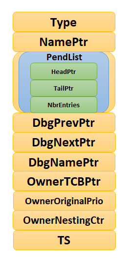
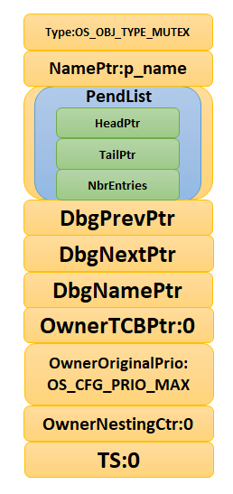
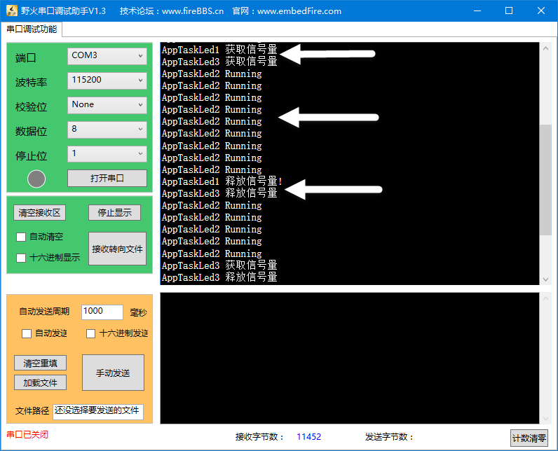
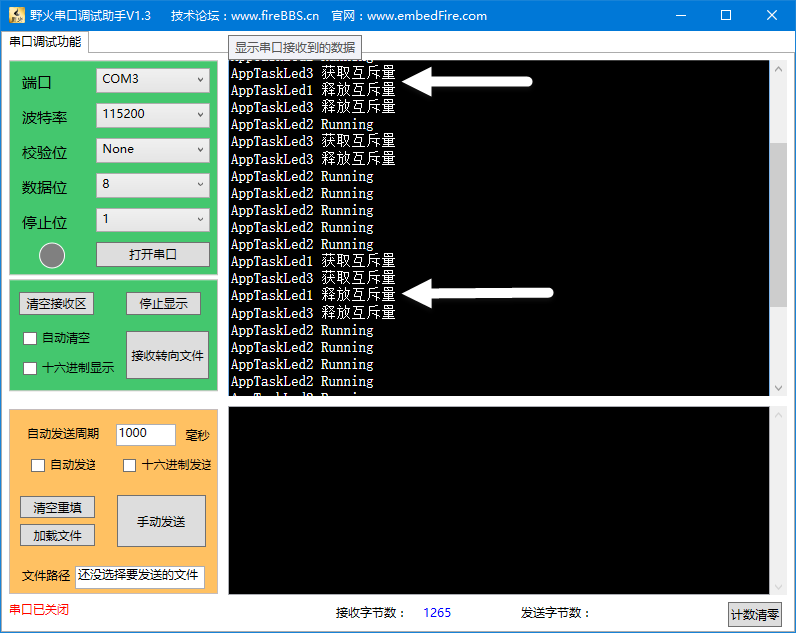
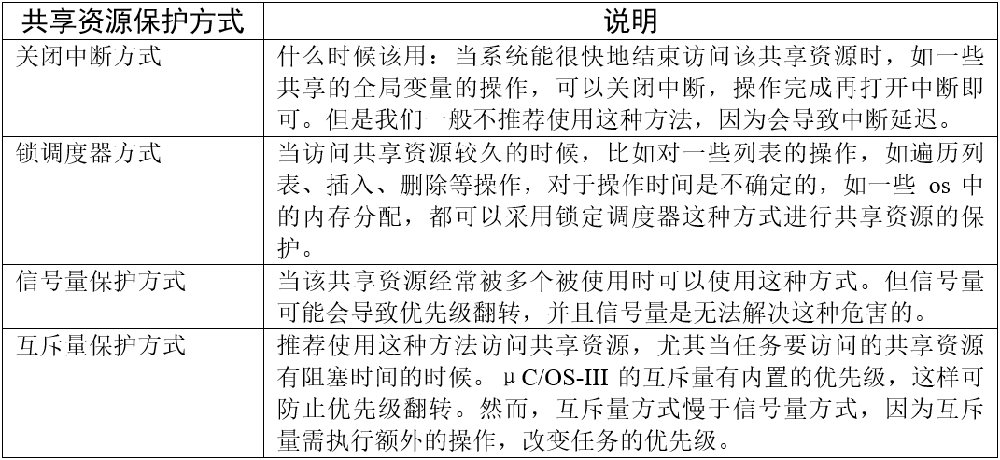

.. vim: syntax=rst

互斥量
========

互斥量的基本概念
~~~~~~~~~~~~~~~~~~~~~~~~

互斥量又称互斥信号量（本质也是一种信号量，不具备传递数据功能），是一种特殊的二值信号量，它和信号量不同的是，
它支持互斥量所有权、递归访问以及防止优先级翻转的特性，用于实现对临界资源的独占式处理。任意时刻互斥量的状态只有两种，
开锁或闭锁。当互斥量被任务持有时，该互斥量处于闭锁状态，这个任务获得互斥量的所有权。当该任务释放这个互斥量时，
该互斥量处于开锁状态，任务失去该互斥量的所有权。当一个任务持有互斥量时，其他任务将不能再对该互斥量进行开锁或持有。
持有该互斥量的任务也能够再次获得这个锁而不被挂起，这就是递归访问，也就是递归互斥量的特性，这个特性与一般的信号量有很大的不同，
在信号量中，由于已经不存在可用的信号量，任务递归获取信号量时会发生主动挂起任务最终形成死锁。

如果想要用于实现同步（任务之间或者任务与中断之间），二值信号量或许是更好的选择，虽然互斥量也可以用于任务与任务间同步，
但是互斥量更多的是用于保护资源的互锁。

用于互锁的互斥量可以充当保护资源的令牌，当一个任务希望访问某个资源时，它必须先获取令牌。当任务使用完资源后，必须还回令牌，
以便其他任务可以访问该资源。是不是很熟悉，在我们的二值信号量里面也是一样的，用于保护临界资源，保证多任务的访问井然有序。
当任务获取到信号量的时候才能开始使用被保护的资源，使用完就释放信号量，下一个任务才能获取到信号量从而可用使用被保护的资源。
但是信号量会导致的另一个潜在问题，那就是任务优先级翻转（具体会在下文讲解）。而μC/OS提供的互斥量可以通过优先级继承算法，
可以降低优先级翻转问题产生的影响，所以，用于临界资源的保护一般建议使用互斥量。

互斥量的优先级继承机制
~~~~~~~~~~~~~~~~~~~~~~~~~~~~~~~

在μC/OS操作系统中为了降低优先级翻转问题利用了优先级继承算法。优先级继承算法是指，暂时提高某个占有某种资源的低优先级任务的优先级，
使之与在所有等待该资源的任务中优先级最高那个任务的优先级相等，而当这个低优先级任务执行完毕释放该资源时，优先级重新回到初始设定值。
因此，继承优先级的任务避免了系统资源被任何中间优先级的任务抢占。

互斥量与二值信号量最大的不同是：互斥量具有优先级继承机制，而信号量没有。也就是说，某个临界资源受到一个互斥量保护，
如果这个资源正在被一个低优先级任务使用，那么此时的互斥量是闭锁状态，也代表了没有任务能申请到这个互斥量，如果此时一个高优先级任务想要对这个资源进行访问，
去申请这个互斥量，那么高优先级任务会因为申请不到互斥量而进入阻塞态，那么系统会将现在持有该互斥量的任务的优先级临时提升到与高优先级任务的优先级相同，
这个优先级提升的过程叫作优先级继承。这个优先级继承机制确保高优先级任务进入阻塞状态的时间尽可能短，以及将已经出现的“优先级翻转”危害降低到最小。

没有理解？没问题，结合过程示意图再说一遍。我们知道任务的优先级在创建的时候就已经是设置好的，高优先级的任务可以打断低优先级的任务，
抢占CPU的使用权。但是在很多场合中，某些资源只有一个，当低优先级任务正在占用该资源的时候，
即便高优先级任务也只能乖乖的等待低优先级任务使用完该资源后释放资源。这里高优先级任务无法运行而低优先级任务可以运行的现象称为“优先级翻转”。

为什么说优先级翻转在操作系统中是危害很大？因为在我们一开始创造这个系统的时候，我们就已经设置好了任务的优先级了，越重要的任务优先级越高。
但是发生优先级翻转，对我们操作系统是致命的危害，会导致系统的高优先级任务阻塞时间过长。

举个例子，现在有3个任务分别为H任务（High）、M任务（Middle）、L任务（Low），3个任务的优先级顺序为H任务>M任务>L任务。
正常运行的时候H任务可以打断M任务与L任务，M任务可以打断L任务，假设系统中有一个资源被保护了，此时该资源被L任务正在使用中，
某一刻，H任务需要使用该资源，但是L任务还没使用完，H任务则因为申请不到资源而进入阻塞态，L任务继续使用该资源，此时已经出现了“优先级翻转”现象，
高优先级任务在等着低优先级的任务执行，如果在L任务执行的时候刚好M任务被唤醒了，由于M任务优先级比L任务优先级高，那么会打断L任务，
抢占了CPU的使用权，直到M任务执行完，再把CUP使用权归还给L任务，L任务继续执行，等到执行完毕之后释放该资源，H任务此时才从阻塞态解除，
使用该资源。这个过程，本来是最高优先级的H任务，在等待了更低优先级的L任务与M任务，其阻塞的时间是M任务运行时间+L任务运行时间，
这只是只有3个任务的系统，假如很多个这样子的任务打断最低优先级的任务，那这个系统最高优先级任务岂不是崩溃了，这个现象是绝对不允许出现的，
高优先级的任务必须能及时响应。所以，没有优先级继承的情况下，使用资源保护，其危害极大，具体见图 优先级翻转图解_ 。

.. image:: media/mutex/mutex002.png
   :align: center
   :name: 优先级翻转图解
   :alt: 优先级翻转图解

-   优先级翻转图解_  **(1)**\ ：L任务正在使用某临界资源， H任务被唤醒，执行H任务。但L任务并未执行完毕，此时临界资源还未释放。

-   优先级翻转图解_ **(2)**\ ：这个时刻H任务也要对该临界资源进行访问，
    但 L任务还未释放资源，由于保护机制，H任务进入阻塞态，L任务得以继续运行，此时已经发生了优先级翻转现象。

-   优先级翻转图解_ **(3)**\ ：某个时刻M任务被唤醒，由于M任务的优先级高于L任务，
    M任务抢占了CPU的使用权，M任务开始运行，此时L任务尚未执行完，临界资源还没被释放。

-   优先级翻转图解_ **(4)**\ ：M任务运行结束，归还CPU使用权，L任务继续运行。

-   优先级翻转图解_ **(5)**\ ：L任务运行结束，释放临界资源，H任务得以对资源进行访问，H任务开始运行。

在这过程中，H任务的等待时间过长，这对系统来说这是很致命的，所以这种情况不允许出现，而互斥量就是用来降低优先级翻转的产生的危害。

假如有优先级继承呢？那么，在H任务申请该资源的时候，由于申请不到资源会进入阻塞态，那么系统就会把当前正在使用资源的L任务的优先级临时提高到与H任务优先级相同，
此时M任务被唤醒了，因为它的优先级比H任务低，所以无法打断L任务，因为此时L任务的优先级被临时提升到H，所以当L任务使用完该资源了，进行释放，
那么此时H任务优先级最高，将接着抢占CPU的使用权， H任务的阻塞时间仅仅是L任务的执行时间，此时的优先级的危害降到了最低，看！这就是优先级继承的优势，
具体见图 优先级继承_ 。

.. image:: media/mutex/mutex003.png
   :align: center
   :name: 优先级继承
   :alt: 优先级继承

-   优先级继承_  **(1)**\ ：L任务正在使用某临界资源，L任务正在使用某临界资源，
    H任务被唤醒，执行H任务。但L任务并未执行完毕，此时临界资源还未释放。

-   优先级继承_  **(2)**\ ：某一时刻H任务也要对该资源进行访问，由于保护机制，
    H任务进入阻塞态。此时发生优先级继承，系统将L任务的优先级暂时提升到与H任务优先级相同，L任务继续执行。

-   优先级继承_  **(3)**\ ：在某一时刻M任务被唤醒，由于此时M任务的优先级暂时低于L任务，所以M任务仅在就绪态，而无法获得CPU使用权。

-   优先级继承_  **(4)**\ ：L任务运行完毕，H任务获得对资源的访问权，H任务从阻塞态变成运行态，此时L任务的优先级会变回原来的优先级。

-   优先级继承_  **(5)**\ ：当H任务运行完毕，M任务得到CPU使用权，开始执行。

-   优先级继承_  **(6)**\ ：系统正常运行，按照设定好的优先级运行。

但是使用互斥量的时候一定需要注意：在获得互斥量后，请尽快释放互斥量，同时需要注意的是在任务持有互斥量的这段时间，
不得更改任务的优先级。ΜC/OS的优先级继承机制不能解决优先级翻转，只能将这种情况的影响降低到最小，硬实时系统在一开始设计时就要避免优先级翻转发生。

互斥量应用场景
~~~~~~~~~~~~~~~~~~~

互斥量的使用比较单一，因为它是信号量的一种，并且它是以锁的形式存在。在初始化的时候，互斥量处于开锁的状态，而被任务持有的时候则立刻转为闭锁的状态。
互斥量更适合于：

    -  可能会引起优先级翻转的情况。

    -  任务可能会多次获取互斥量的情况下，这样可以避免同一任务多次递归持有而造成死锁的问题。

多任务环境下往往存在多个任务竞争同一临界资源的应用场景，互斥量可被用于对临界资源的保护从而实现独占式访问。另外，
互斥量可以降低信号量存在的优先级翻转问题带来的影响。

比如有两个任务需要对串口进行发送数据，其硬件资源只有一个，那么两个任务肯定不能同时发送啦，不然导致数据错误，那么，
就可以用互斥量对串口资源进行保护，当一个任务正在使用串口的时候，另一个任务则无法使用串口，等到任务使用串口完毕之后，另外一个任务才能获得串口的使用权。

另外需要注意的是互斥量不能在中断服务函数中使用，因为其特有的优先级继承机制只在任务起作用，而在中断的上下文环境中毫无意义。

互斥量运作机制
~~~~~~~~~~~~~~~~~~~

多任务环境下会存在多个任务访问同一临界资源的场景，该资源会被任务独占处理。其他任务在资源被占用的情况下不允许对该临界资源进行访问，
这个时候就需要用到μC/OS的互斥量来进行资源保护，那么互斥量是怎样来避免这种冲突？

用互斥量处理不同任务对临界资源的同步访问时，任务想要获得互斥量才能进行资源访问，如果一旦有任务成功获得了互斥量，则互斥量立即变为闭锁状态，
此时其他任务会因为获取不到互斥量而不能访问这个资源，任务会根据用户自定义的等待时间进行等待，直到互斥量被持有的任务释放后，
其他任务才能获取互斥量从而得以访问该临界资源，此时互斥量再次上锁，如此一来就可以确保每个时刻只有一个任务正在访问这个临界资源，保证了临界资源操作的安全性。

.. image:: media/mutex/mutex004.png
   :align: center
   :name: 互斥量运作机制
   :alt: 互斥量运作机制

-   互斥量运作机制_  **(1)**\ ：因为互斥量具有优先级继承机制，一般选择使用互斥量对资源进行保护，
    如果资源被占用的时候，无论是什么优先级的任务想要使用该资源都会被阻塞。

-   互斥量运作机制_  **(2)**\ ：假如正在使用该资源的任务1比阻塞中的任务2的优先级还低，
    那么任务1将被系统临时提升到与高优先级任务2相等的优先级（任务1的优先级从L 变成H）。

-   互斥量运作机制_  **(3)**\ ：当任务1使用完资源之后，释放互斥量，此时任务1的优先级会从H变回原来的L。

-   互斥量运作机制_  **(4)-(5)**\ ：任务2此时可以获得互斥量，然后进行资源的访问，
    当任务2访问了资源的时候，该互斥量的状态又为闭锁状态，其他任务无法获取互斥量。

互斥量控制块
~~~~~~~~~~~~~~~~~~

μC/OS的互斥量由多个元素组成，在互斥量被创建时，需要由我们自己定义互斥量（也可以称之为互斥量句柄），因为它是用于保存互斥量的一些信息的，
其数据结构OS_MUTEX除了互斥量必须的一些基本信息外，还有指向任务控制块的指针OwnerTCBPtr、任务优先级变量OwnerOriginalPrio、
PendList链表与OwnerNestingCtr变量等，为的是方便系统来管理互斥量。
其数据结构具体见 代码清单:互斥量-1_ ，示意图具体见图 互斥量的控制块数据结构_ 。

.. code-block:: c
    :caption: 代码清单:互斥量-1互斥量控制块数据结构
    :name: 代码清单:互斥量-1
    :linenos:

    struct  os_mutex

    {
    /* ------------------ GENERIC  MEMBERS ------------------ */
        OS_OBJ_TYPE          Type;                 (1)
        CPU_CHAR            *NamePtr;              (2)
        OS_PEND_LIST         PendList;             (3)

    #if OS_CFG_DBG_EN > 0u
        OS_MUTEX            *DbgPrevPtr;
        OS_MUTEX            *DbgNextPtr;
        CPU_CHAR            *DbgNamePtr;
    #endif
    /* ------------------ SPECIFIC MEMBERS ------------------ */
        OS_TCB              *OwnerTCBPtr;		(4)
        OS_PRIO              OwnerOriginalPrio;	(5)
        OS_NESTING_CTR       OwnerNestingCtr;       (6)
        CPU_TS               TS;			(7)
    };

-   代码清单:互斥量-1_  **(1)**\ ：互斥量的类型，用户无需理会，μC/OS能识别它是一个mutex。

-   代码清单:互斥量-1_  **(2)**\ ：互斥量的名字，每个内核对象都被分配一个名。

-   代码清单:互斥量-1_  **(3)**\ ：等待互斥量的任务列表。

-   代码清单:互斥量-1_  **(4)**\ ：指向持有互斥量任务控制块的指针，
    如果任务占用这个mutex，那么该变量OwnerTCBPtr会指向占用这个mutex的任务的OS_TCB。

-   代码清单:互斥量-1_  **(5)**\ ：用于记录持有互斥量任务的优先级，
    如果任务占用这个mutex，那么该变量OwnerOriginalPrio中存放着任务的原优先级，当占用mutex任务的优先级被提升时就会用到这个变量。

-   代码清单:互斥量-1_  **(6)**\ ：表示互斥量是否可用，当该值为0的时候表示互斥量处于开锁状态，
    互斥量可用。μC/OS允许任务递归调用同一个mutex多达256次，每递归调用一次mutex该值就会加一，但也需要释放相同次数才能真正释放掉这个mutex。

-   代码清单:互斥量-1_  **(7)**\ ：mutex中的变量TS用于保存该mutex最后一次被释放的时间戳。
    当mutex被释放，读取时基计数值并存放到该变量中。

注意：用户代码不能直接访问这个结构体，必须通过μC/OS提供的API访问。

互斥量函数接口讲解
~~~~~~~~~~~~~~~~~~~~~~~~~

创建互斥量函数OSMutexCreate()
^^^^^^^^^^^^^^^^^^^^^^^^^^^^^^^^^^^^^^^^^

在定义完互斥量结构体变量后就可以调用 OSMutexCreate()函数进行创建一个互斥量，跟信号量的创建差不多，我们知道，
其实这里的“创建互斥量”指的就是对内核对象（互斥量）的一些初始化。要特别注意的是内核对象使用之前一定要先创建，
这个创建过程必须要保证在所有可能使用内核对象的任务之前，所以一般我们都是在创建任务之前就创建好系统需要的内核对象（如互斥量等），
创建互斥量函数OSMutexCreate()源码具体见 代码清单:互斥量-2_ 。

.. code-block:: c
    :caption: 代码清单:互斥量-2OSMutexCreate()源码
    :name: 代码清单:互斥量-2
    :linenos:

    void  OSMutexCreate (OS_MUTEX  *p_mutex, (1)	//互斥量指针
                        CPU_CHAR  *p_name,  (2)	//取互斥量的名称
                        OS_ERR    *p_err)   (3)	//返回错误类型
    {
        CPU_SR_ALLOC(); //使用到临界段（在关/开中断时）时必须用到该宏，该宏声明和
        //定义一个局部变量，用于保存关中断前的 CPU 状态寄存器
        // SR（临界段关中断只需保存SR），开中断时将该值还原。

    #ifdef OS_SAFETY_CRITICAL(4)//如果启用（默认禁用）了安全检测
        if (p_err == (OS_ERR *)0)           //如果错误类型实参为空
        {
            OS_SAFETY_CRITICAL_EXCEPTION(); //执行安全检测异常函数
            return;                         //返回，不继续执行
        }
    #endif

    #ifdef OS_SAFETY_CRITICAL_IEC61508(5)//如果启用（默认禁用）了安全关键
        //如果是在调用 OSSafetyCriticalStart()后创建
        if (OSSafetyCriticalStartFlag == DEF_TRUE)
        {
            *p_err = OS_ERR_ILLEGAL_CREATE_RUN_TIME; //错误类型为“非法创建内核对象”
            return;                                  //返回，不继续执行
        }
    #endif

    #if OS_CFG_CALLED_FROM_ISR_CHK_EN > 0u       (6)
        //如果启用（默认启用）了中断中非法调用检测
        if (OSIntNestingCtr > (OS_NESTING_CTR)0)     //如果该函数是在中断中被调用
        {
            *p_err = OS_ERR_CREATE_ISR;             //错误类型为“在中断函数中定时”
            return;                                  //返回，不继续执行
        }
    #endif

    #if OS_CFG_ARG_CHK_EN > 0u(7)//如果启用（默认启用）了参数检测
        if (p_mutex == (OS_MUTEX *)0) //如果参数 p_mutex 为空
        {
            *p_err = OS_ERR_OBJ_PTR_NULL;  //错误类型为“创建对象为空”
            return;                       //返回，不继续执行
        }
    #endif

        OS_CRITICAL_ENTER();              //进入临界段，初始化互斥量指标
        //标记创建对象数据结构为互斥量
        p_mutex->Type              =  OS_OBJ_TYPE_MUTEX;  (8)
        p_mutex->NamePtr           =  p_name;		(9)
        p_mutex->OwnerTCBPtr       = (OS_TCB       *)0;	(10)
        p_mutex->OwnerNestingCtr   = (OS_NESTING_CTR)0; (11)
        p_mutex->TS                = (CPU_TS        )0;	(12)
        p_mutex->OwnerOriginalPrio =  OS_CFG_PRIO_MAX;
        OS_PendListInit(&p_mutex->PendList);        //初始化该互斥量的等待列表

    #if OS_CFG_DBG_EN > 0u//如果启用（默认启用）了调试代码和变量
        OS_MutexDbgListAdd(p_mutex); //将该互斥量添加到互斥量双向调试链表
    #endif
        OSMutexQty++;          		(13)//互斥量个数加1

        OS_CRITICAL_EXIT_NO_SCHED(); 	(14)	//退出临界段（无调度）
        *p_err = OS_ERR_NONE;          		//错误类型为“无错误”
    }

-   代码清单:互斥量-2_  **(1)**\ ：互斥量控制块指针，
    指向我们定义的互斥量控制块结构体变量，所以在创建之前我们需要先定义一个互斥量控制块变量。

-   代码清单:互斥量-2_  **(2)**\ ：互斥量名称，字符串形式。

-   代码清单:互斥量-2_  **(3)**\ ：用于保存返回的错误类型。

-   代码清单:互斥量-2_  **(4)**\ ：如果启用了安全检测（默认禁用），
    在编译时则会包含安全检测相关的代码，如果错误类型实参为空，系统会执行安全检测异常函数，然后返回，不执行创建互斥量操作。

-   代码清单:互斥量-2_  **(5)**\ ：如果启用（默认禁用）了安全关键检测，
    在编译时则会包含安全关键检测相关的代码，如果是在调用OSSafetyCriticalStart()后创建该互斥量，则是非法的，
    返回错误类型为“非法创建内核对象”错误代码，并且退出，不执行创建互斥量操作。

-   代码清单:互斥量-2_  **(6)**\ ：如果启用了中断中非法调用检测（默认启用），
    在编译时则会包含中断非法调用检测相关的代码，如果该函数是在中断中被调用，则是非法的，返回错误类型为“在中断中创建对象”的错误代码，
    并且退出，不执行创建互斥量操作。

-   代码清单:互斥量-2_  **(7)**\ ：如果启用了参数检测（默认启用），
    在编译时则会包含参数检测相关的代码，如果p_mutex参数为空，返回错误类型为“创建对象为空”的错误代码，并且退出，不执行创建互斥量操作。

-   代码清单:互斥量-2_  **(8)**\ ：标记创建对象数据结构为互斥量。

-   代码清单:互斥量-2_  **(9)**\ ：初始化互斥量的名称。

-   代码清单:互斥量-2_  **(10)**\ ：初始化互斥量结构体中的OwnerTCBPtr成员变量，目前系统中尚无任务持有互斥量。

-   代码清单:互斥量-2_  **(11)**\ ：初始化互斥量结构体中的OwnerNestingCtr成员变量为0，表示互斥量可用。

-   代码清单:互斥量-2_  **(12)**\ ：记录时间戳的变量TS初始化为0。
    初始化互斥量结构体中的OwnerOriginalPrio成员变量为OS_CFG_PRIO_MAX（最低优先级）。初始化该互斥量的等待列表等。

-   代码清单:互斥量-2_  **(13)**\ ：系统中互斥量个数加1。

-   代码清单:互斥量-2_  **(14)**\ ：退出临界段（无调度），创建互斥量成功。

如果我们创建一个互斥量，那么互斥量创建成功的示意图具体见图 互斥量创建完成示意图_ 。

互斥量创建函数的使用实例具体见 代码清单:互斥量-3_ 。

.. code-block:: c
    :caption: 代码清单:互斥量-3OSMutexCreate()使用实例
    :name: 代码清单:互斥量-3
    :linenos:

    OS_MUTEX mutex;                         //声明互斥量
    /* 创建互斥量 mutex */
    OSMutexCreate ((OS_MUTEX  *)&mutex,           //指向互斥量变量的指针
                (CPU_CHAR  *)"Mutex For Test", //互斥量的名字
                (OS_ERR    *)&err);            //错误类型

删除互斥量函数OSMutexDel()
^^^^^^^^^^^^^^^^^^^^^^^^^^^^^^^^^^^^^^^^^^^^^^^^^^^^^^^

OSSemDel()用于删除一个互斥量，互斥量删除函数是根据互斥量结构（互斥量句柄）直接删除的，删除之后这个互斥量的所有信息都会被系统清空，
而且不能再次使用这个互斥量了，但是需要注意的是，如果某个互斥量没有被定义，那也是无法被删除的，如果有任务阻塞在该互斥量上，
那么尽量不要删除该互斥量。想要使用互斥量删除函数就必须将OS_CFG_MUTEX_DEL_EN宏定义配置为1，其函数源码具体见 代码清单:互斥量-4_ 。

.. code-block:: c
    :caption: 代码清单:互斥量-4 OSMutexDel()源码
    :name: 代码清单:互斥量-4
    :linenos:

    #if OS_CFG_MUTEX_DEL_EN > 0u	//如果启用了 OSMutexDel()
    OS_OBJ_QTY  OSMutexDel (OS_MUTEX  *p_mutex, (1)	//互斥量指针
                            OS_OPT     opt,     (2)	//选项
                            OS_ERR    *p_err)   (3)	//返回错误类型
    {
        OS_OBJ_QTY     cnt;
        OS_OBJ_QTY     nbr_tasks;
        OS_PEND_DATA  *p_pend_data;
        OS_PEND_LIST  *p_pend_list;
        OS_TCB        *p_tcb;
        OS_TCB        *p_tcb_owner;
        CPU_TS         ts;
        CPU_SR_ALLOC(); //使用到临界段（在关/开中断时）时必须用到该宏，该宏声明和
        //定义一个局部变量，用于保存关中断前的 CPU 状态寄存器
        // SR（临界段关中断只需保存SR），开中断时将该值还原。

    #ifdef OS_SAFETY_CRITICAL(4)//如果启用（默认禁用）了安全检测
        if (p_err == (OS_ERR *)0)           //如果错误类型实参为空
        {
            OS_SAFETY_CRITICAL_EXCEPTION(); //执行安全检测异常函数
            return ((OS_OBJ_QTY)0);         //返回0（有错误），停止执行
        }
    #endif

    #if OS_CFG_CALLED_FROM_ISR_CHK_EN > 0u(5)//如果启用了中断中非法调用检测
        if (OSIntNestingCtr > (OS_NESTING_CTR)0)  //如果该函数在中断中被调用
        {
            *p_err = OS_ERR_DEL_ISR;               //错误类型为“在中断中中止等待”
            return ((OS_OBJ_QTY)0);               //返回0（有错误），停止执行
        }
    #endif

    #if OS_CFG_ARG_CHK_EN > 0u(6)//如果启用了参数检测
        if (p_mutex == (OS_MUTEX *)0)         //如果 p_mutex 为空
        {
            *p_err = OS_ERR_OBJ_PTR_NULL;      //错误类型为“对象为空”
            return ((OS_OBJ_QTY)0);           //返回0（有错误），停止执行
        }
        switch (opt)                   (7)//根据选项分类处理
        {
        case OS_OPT_DEL_NO_PEND:          //如果选项在预期内
        case OS_OPT_DEL_ALWAYS:
        break;                       //直接跳出

        default:                     (8)//如果选项超出预期
            *p_err =  OS_ERR_OPT_INVALID; //错误类型为“选项非法”
            return ((OS_OBJ_QTY)0);      //返回0（有错误），停止执行
        }
    #endif

    #if OS_CFG_OBJ_TYPE_CHK_EN > 0u(9)//如果启用了对象类型检测
        if (p_mutex->Type != OS_OBJ_TYPE_MUTEX)   //如果 p_mutex 非互斥量类型
        {
            *p_err = OS_ERR_OBJ_TYPE;              //错误类型为“对象类型错误”
            return ((OS_OBJ_QTY)0);               //返回0（有错误），停止执行
        }
    #endif

        OS_CRITICAL_ENTER();                        //进入临界段
        p_pend_list = &p_mutex->PendList;     (10)//获取互斥量的等待列表
        cnt         = p_pend_list->NbrEntries;  (11)//获取等待该互斥量的任务数
        nbr_tasks   = cnt;
        switch (opt)                     (12)//根据选项分类处理
        {
            case OS_OPT_DEL_NO_PEND:         (13)//如果只在没任务等待时删除互斥量
            if (nbr_tasks == (OS_OBJ_QTY)0)    //如果没有任务在等待该互斥量
            {
    #if OS_CFG_DBG_EN > 0u//如果启用了调试代码和变量
                OS_MutexDbgListRemove(p_mutex);//将该互斥量从互斥量调试列表移除
    #endif
                OSMutexQty--;            (14)//互斥量数目减1
                OS_MutexClr(p_mutex);    (15)//清除互斥量内容
                OS_CRITICAL_EXIT();            //退出临界段
                *p_err = OS_ERR_NONE;    (16)//错误类型为“无错误”
            }
            else(17)//如果有任务在等待该互斥量
            {
                OS_CRITICAL_EXIT();            	//退出临界段
                *p_err = OS_ERR_TASK_WAITING;  //错误类型为“有任务正在等待”
            }
            break;                             //跳出

            case OS_OPT_DEL_ALWAYS:            (18)//如果必须删除互斥量
            p_tcb_owner = p_mutex->OwnerTCBPtr;     (19)//获取互斥量持有任务
            if ((p_tcb_owner       != (OS_TCB *)0) &&//如果持有任务存在，
                    (p_tcb_owner->Prio !=  p_mutex->OwnerOriginalPrio))
                    //而且优先级被提升过。		(20)
            {
            switch (p_tcb_owner->TaskState)     (21)//根据其任务状态处理
                {
                    case OS_TASK_STATE_RDY:          (22)//如果是就绪状态
                    OS_RdyListRemove(p_tcb_owner);       //将任务从就绪列表移除
                    p_tcb_owner->Prio = p_mutex->OwnerOriginalPrio;(23)//还原任务的优先级
                    OS_PrioInsert(p_tcb_owner->Prio);   (24)
                    //将该优先级插入优先级表格
                    OS_RdyListInsertTail(p_tcb_owner); (25)//将任务重插入就绪列表
                    break;                                         //跳出

                    case OS_TASK_STATE_DLY:              (26)//如果是延时状态
                    case OS_TASK_STATE_SUSPENDED:          //如果是被挂起状态
                    case OS_TASK_STATE_DLY_SUSPENDED:       //如果是延时中被挂起状态
                                    p_tcb_owner->Prio = p_mutex->OwnerOriginalPrio;//还原任务的优先级
                    break;

                    case OS_TASK_STATE_PEND:      (27)//如果是无期限等待状态
                    case OS_TASK_STATE_PEND_TIMEOUT:         //如果是有期限等待状态
                    case OS_TASK_STATE_PEND_SUSPENDED:
                    //如果是无期等待中被挂状态
                    case OS_TASK_STATE_PEND_TIMEOUT_SUSPENDED:
                    //如果是有期等待中被挂状态
                    OS_PendListChangePrio(p_tcb_owner,
                    //改变任务在等待列表的位置
                                        p_mutex->OwnerOriginalPrio);
                    break;

                    default:                       (28)//如果状态超出预期
                    OS_CRITICAL_EXIT();
                    *p_err = OS_ERR_STATE_INVALID;
                    //错误类型为“任务状态非法”
                    return ((OS_OBJ_QTY)0);
                    //返回0（有错误），停止执行
                }
            }

            ts = OS_TS_GET();                    (29)//获取时间戳
            while(cnt > 0u)                     (30)
            //移除该互斥量等待列表中的所有任务。
            {
                p_pend_data = p_pend_list->HeadPtr;
                p_tcb       = p_pend_data->TCBPtr;
                OS_PendObjDel((OS_PEND_OBJ *)((void *)p_mutex),
                            p_tcb,
                            ts);		(31)
                cnt--;
            }
    #if OS_CFG_DBG_EN > 0u//如果启用了调试代码和变量
            OS_MutexDbgListRemove(p_mutex);    //将互斥量从互斥量调试列表移除
    #endif
            OSMutexQty--;                (32)//互斥量数目减1
            OS_MutexClr(p_mutex);         (33)//清除互斥量内容
            OS_CRITICAL_EXIT_NO_SCHED();  (34)//退出临界段，但不调度
            OSSched();                    (35)//调度最高优先级任务运行
            *p_err = OS_ERR_NONE;(36)//错误类型为“无错误”
    break;                             //跳出

    default:                         (37)//如果选项超出预期
            OS_CRITICAL_EXIT();                //退出临界段
            *p_err = OS_ERR_OPT_INVALID;        //错误类型为“选项非法”
    break;                             //跳出
        }
        return (nbr_tasks);               (38)
        //返回删除前互斥量等待列表中的任务数
    }
    #endif

-   代码清单:互斥量-4_  **(1)**\ ：互斥量控制块指针，指向我们定义的互斥量控制块结构体变量，
    所以在删除之前我们需要先定义一个互斥量控制块变量，并且成功创建互斥量后再进行删除操作。

-   代码清单:互斥量-4_  **(2)**\ ：互斥量删除的选项。

-   代码清单:互斥量-4_  **(3)**\ ：用于保存返回的错误类型。

-   代码清单:互斥量-4_  **(4)**\ ：如果启用了安全检测（默认），
    在编译时则会包含安全检测相关的代码，如果错误类型实参为空，系统会执行安全检测异常函数，然后返回，不执行删除互斥量操作。

-   代码清单:互斥量-4_  **(5)**\ ：如果启用了中断中非法调用检测（默认启用），
    在编译时则会包含中断非法调用检测相关的代码，如果该函数是在中断中被调用，则是非法的，返回错误类型为“在中断中删除对象”的错误代码，并且退出，不执行删除互斥量操作。

-   代码清单:互斥量-4_  **(6)**\ ：如果启用了参数检测（默认启用），
    在编译时则会包含参数检测相关的代码，如果p_mutex参数为空，返回错误类型为“内核对象为空”的错误代码，并且退出，不执行删除互斥量操作。

-   代码清单:互斥量-4_  **(7)**\ ：判断opt选项是否合理，该选项有两个，
    OS_OPT_DEL_ALWAYS与OS_OPT_DEL_NO_PEND，在os.h文件中定义。此处是判断一下选项是否在预期之内，如果在则跳出switch语句。

-   代码清单:互斥量-4_  **(8)**\ ：如果选项超出预期，则返回错误类型为“选项非法”的错误代码，退出，不继续执行。

-   代码清单:互斥量-4_  **(9)**\ ：如果启用了对象类型检测，在编译时则会包含对象类型检测相关的代码，
    如果p_mutex不是互斥量类型，返回错误类型为“内核对象类型错误”的错误代码，并且退出，不执行删除互斥量操作。

-   代码清单:互斥量-4_  **(10)**\ ：程序执行到这里，表示可以删除互斥量了，系统首先获取互斥量的等待列表保存到p_pend_list变量中。

-   代码清单:互斥量-4_  **(11)**\ ：然后再获取等待该互斥量的任务数。

-   代码清单:互斥量-4_  **(12)**\ ：根据选项分类处理。

-   代码清单:互斥量-4_  **(13)**\ ：如果opt是OS_OPT_DEL_NO_PEND，
    则表示只在没有任务等待的情况下删除互斥量，如果当前系统中有任务阻塞在该互斥量上，则不能删除，反之，则可以删除互斥量。

-   代码清单:互斥量-4_  **(14)**\ ：如果没有任务在等待该互斥量，互斥量数目减1。

-   代码清单:互斥量-4_  **(15)**\ ：清除互斥量内容

-   代码清单:互斥量-4_  **(16)**\ ：删除成功，返回错误类型为“无错误”的错误代码。

-   代码清单:互斥量-4_  **(17)**\ ：如果有任务在等待该互斥量，则返回错误类型为“有任务在等待该互斥量”错误代码。

-   代码清单:互斥量-4_  **(18)**\ ：如果opt是OS_OPT_DEL_ALWAYS，则表示无论如何都必须删除互斥量，
    那么在删除之前，系统会把所有阻塞在该互斥量上的任务恢复。

-   代码清单:互斥量-4_  **(19)**\ ：首先获取一下持有互斥量的任务。

-   代码清单:互斥量-4_  **(20)**\ ：如果该互斥量被任务持有了，并且优先级也被提升了（发生优先级继承）。

-   代码清单:互斥量-4_  **(21)**\ ：根据持有互斥量任务的状态进行分类处理。

-   代码清单:互斥量-4_  **(22)**\ ：如果任务处于就绪状态。

-   代码清单:互斥量-4_  **(23)**\ ：那么就将任务从就绪列表移除，然后还原任务的优先级，
    互斥量控制块中的OwnerOriginalPrio成员变量保存的就是持有互斥量任务的原本优先级。

-   代码清单:互斥量-4_  **(24)**\ ：调用OS_PrioInsert()函数将任务按照其原本的优先级插入优先级列表中。

-   代码清单:互斥量-4_  **(25)**\ ：将任务重新插入就绪列表。

-   代码清单:互斥量-4_  **(26)**\ ：如果任务处于延时状态、被挂起状态或者是延时中被挂起状态，
    就直接将任务的优先级恢复即可，并不用进行任务列表相关的操作。

-   代码清单:互斥量-4_  **(27)**\ ：如果任务处于无期限等待状态、有期限等待状态、
    无期等待中被挂状态或者是有期等待中被挂状态，那么就调用OS_PendListChangePrio()函数改变任务在等待列表的位置，根据任务的优先级进行修改即可。

-   代码清单:互斥量-4_  **(28)**\ ：如果状态超出预期，则返回错误类型为“任务状态非法”的错误代码。

-   代码清单:互斥量-4_  **(29)**\ ：获取时间戳，记录一下删除的时间。

-   代码清单:互斥量-4_  **(30)**\ ：然后根据前面cnt记录阻塞在该互斥量上的任务个数，逐个移除该互斥量等待列表中的任务。

-   代码清单:互斥量-4_  **(31)**\ ：调用OS_PendObjDel()函数将阻塞在内核对象（如互斥量）上的任务从阻塞态恢复，
    此时系统在删除内核对象，删除之后，这些等待事件的任务需要被恢复，其源码具体见 **代码清单:消息队列-18**。

-   代码清单:互斥量-4_  **(32)**\ ：系统中互斥量数目减1。

-   代码清单:互斥量-4_  **(33)**\ ：清除互斥量中的内容。

-   代码清单:互斥量-4_  **(34)**\ ：退出临界段，但不调度。

-   代码清单:互斥量-4_  **(35)**\ ：调度最高优先级任务运行。

-   代码清单:互斥量-4_  **(36)**\ ：删除互斥量完成，返回错误类型为“无错误”的错误代码。

-   代码清单:互斥量-4_  **(37)**\ ：如果选项超出预期则返回错误类型为“任务状态非法”的错误代码。

-   代码清单:互斥量-4_  **(38)**\ ：返回删除前互斥量等待列表中的任务数。

互斥量删除函数OSMutexDel()的使用也是很简单的，只需要传入要删除的互斥量的句柄与选项还有保存返回的错误类型即可，调用函数时，系统将删除这个互斥量。
需要注意的是在调用删除互斥量函数前，系统应存在已创建的互斥量。如果删除互斥量时，系统中有任务正在等待该互斥量，则不应该进行删除操作，
因为删除之后的互斥量就不可用了，删除互斥量函数OSMutexDel()的使用实例具体见 代码清单:互斥量-5_ 。

.. code-block:: c
    :caption: 代码清单:互斥量-5 OSMutexDel()函数使用实例
    :name: 代码清单:互斥量-5
    :linenos:

    OS_SEM mutex;;                             //声明互斥量
    OS_ERR      err;

    /* 删除互斥量mutex*/
    OSMutexDel ((OS_MUTEX         *)&mutex,      //指向互斥量的指针
    OS_OPT_DEL_NO_PEND,
    (OS_ERR       *)&err);             //返回错误类型

获取互斥量函数OSMutexPend()
^^^^^^^^^^^^^^^^^^^^^^^^^^^^^^^^^^^^^^^^^^^^^^^^^^^^^^^^^^^^

我们知道，当互斥量处于开锁的状态，任务才能获取互斥量成功，当任务持有了某个互斥量的时候，其他任务就无法获取这个互斥量，需要等到持有互斥量的任务进行释放后，
其他任务才能获取成功，任务通过互斥量获取函数来获取互斥量的所有权。任务对互斥量的所有权是独占的，任意时刻互斥量只能被一个任务持有，如果互斥量处于开锁状态，
那么获取该互斥量的任务将成功获得该互斥量，并拥有互斥量的使用权；如果互斥量处于闭锁状态，获取该互斥量的任务将无法获得互斥量，任务将被挂起，在任务被挂起之前，
会进行优先级继承，如果当前任务优先级比持有互斥量的任务优先级高，那么将会临时提升持有互斥量任务的优先级。
互斥量的获取函数就是OSMutexPend()，其源码具体见 代码清单:互斥量-6_ 。

.. code-block:: c
    :caption: 代码清单:互斥量-6OSMutexPend()源码
    :name: 代码清单:互斥量-6
    :linenos:

    void  OSMutexPend (OS_MUTEX  *p_mutex, 	(1)	//互斥量指针
                    OS_TICK    timeout, 	(2)	//超时时间（节拍）
                    OS_OPT     opt,     	(3)	//选项
                    CPU_TS    *p_ts,    	(4)	//时间戳
                    OS_ERR    *p_err)   	(5)	//返回错误类型
    {
        OS_PEND_DATA  pend_data;
        OS_TCB       *p_tcb;
        CPU_SR_ALLOC(); //使用到临界段（在关/开中断时）时必须用到该宏，该宏声明和
        //定义一个局部变量，用于保存关中断前的 CPU 状态寄存器
        // SR（临界段关中断只需保存SR），开中断时将该值还原。

    #ifdef OS_SAFETY_CRITICAL//如果启用（默认禁用）了安全检测
        if (p_err == (OS_ERR *)0)           //如果错误类型实参为空
        {
            OS_SAFETY_CRITICAL_EXCEPTION(); //执行安全检测异常函数
            return;                         //返回，不继续执行
        }
    #endif

    #if OS_CFG_CALLED_FROM_ISR_CHK_EN > 0u//如果启用了中断中非法调用检测
        if (OSIntNestingCtr > (OS_NESTING_CTR)0)   //如果该函数在中断中被调用
        {
            *p_err = OS_ERR_PEND_ISR;               //错误类型为“在中断中等待”
            return;                                //返回，不继续执行
        }
    #endif

    #if OS_CFG_ARG_CHK_EN > 0u//如果启用了参数检测
        if (p_mutex == (OS_MUTEX *)0)        //如果 p_mutex 为空
        {
            *p_err = OS_ERR_OBJ_PTR_NULL;     //返回错误类型为“内核对象为空”
            return;                          //返回，不继续执行
        }
        switch (opt)                         //根据选项分类处理
        {
        case OS_OPT_PEND_BLOCKING:       //如果选项在预期内
        case OS_OPT_PEND_NON_BLOCKING:
        break;

        default:                         //如果选项超出预期
            *p_err = OS_ERR_OPT_INVALID; //错误类型为“选项非法”
            return;                     //返回，不继续执行
        }
    #endif

    #if OS_CFG_OBJ_TYPE_CHK_EN > 0u//如果启用了对象类型检测
        if (p_mutex->Type != OS_OBJ_TYPE_MUTEX)   //如果 p_mutex 非互斥量类型
        {
            *p_err = OS_ERR_OBJ_TYPE;              //错误类型为“内核对象类型错误”
            return;                               //返回，不继续执行
        }
    #endif

        if (p_ts != (CPU_TS *)0)    //如果 p_ts 非空
        {
            *p_ts  = (CPU_TS  )0;    //初始化（清零）p_ts，待用于返回时间戳
        }

        CPU_CRITICAL_ENTER();                                //关中断
        if (p_mutex->OwnerNestingCtr == (OS_NESTING_CTR)0)(6)//如果互斥量可用
        {
            p_mutex->OwnerTCBPtr       =  OSTCBCurPtr; (7)//让当前任务持有互斥量
            p_mutex->OwnerOriginalPrio =  OSTCBCurPtr->Prio; (8)//保存持有任务的优先级
            p_mutex->OwnerNestingCtr   = (OS_NESTING_CTR)1; (9)//开始嵌套
            if (p_ts != (CPU_TS *)0)                         //如果 p_ts 非空
            {
                *p_ts  = p_mutex->TS;          (10)//返回互斥量的时间戳记录
            }
            CPU_CRITICAL_EXIT();                             //开中断
            *p_err = OS_ERR_NONE;                         //错误类型为“无错误”
            return;                                          //返回，不继续执行
        }
    /* 如果互斥量不可用 */		 (11)
    if (OSTCBCurPtr == p_mutex->OwnerTCBPtr) //如果当前任务已经持有该互斥量
        {
            p_mutex->OwnerNestingCtr++;      (12)//互斥量嵌套数加1
            if (p_ts != (CPU_TS *)0)               //如果 p_ts 非空
            {
                *p_ts  = p_mutex->TS;               //返回互斥量的时间戳记录
            }
            CPU_CRITICAL_EXIT();                   //开中断
            *p_err = OS_ERR_MUTEX_OWNER;    (13)//错误类型为“任务已持有互斥量”
            return;                                //返回，不继续执行
        }
        /* 如果当前任务非持有该互斥量 */	(14)
        if ((opt & OS_OPT_PEND_NON_BLOCKING) != (OS_OPT)0) //如果选择了不阻塞任务
        {
            CPU_CRITICAL_EXIT();                            //开中断
            *p_err = OS_ERR_PEND_WOULD_BLOCK;             //错误类型为“渴求阻塞”
            return;                                         //返回，不继续执行
        }
        else(15)//如果选择了阻塞任务
        {
            if (OSSchedLockNestingCtr > (OS_NESTING_CTR)0)  //如果调度器被锁
            {
                CPU_CRITICAL_EXIT();                        //开中断
                *p_err = OS_ERR_SCHED_LOCKED;             //错误类型为“调度器被锁”
                return;                                     //返回，不继续执行
            }
        }
        /* 如果调度器未被锁 */			(16)
        OS_CRITICAL_ENTER_CPU_EXIT();                     //锁调度器，并重开中断
        p_tcb = p_mutex->OwnerTCBPtr;                //获取互斥量持有任务
        if (p_tcb->Prio > OSTCBCurPtr->Prio)   	(17)
        //如果持有任务优先级低于当前任务
        {
            switch (p_tcb->TaskState)       	(18)
            //根据持有任务的任务状态分类处理
            {
                case OS_TASK_STATE_RDY:                        //如果是就绪状态
                OS_RdyListRemove(p_tcb);                //从就绪列表移除持有任务
                p_tcb->Prio = OSTCBCurPtr->Prio;      (19)
                //提升持有任务的优先级到当前任务
                OS_PrioInsert(p_tcb->Prio);      (20)//将该优先级插入优先级表格
                OS_RdyListInsertHead(p_tcb);      (21)//将持有任务插入就绪列表
                break;                                    //跳出

                case OS_TASK_STATE_DLY:                        //如果是延时状态
                case OS_TASK_STATE_DLY_SUSPENDED:           //如果是延时中被挂起状态
                case OS_TASK_STATE_SUSPENDED:                  //如果是被挂起状态
                p_tcb->Prio = OSTCBCurPtr->Prio;      (22)
                //提升持有任务的优先级到当前任务
                break;                                    //跳出

                case OS_TASK_STATE_PEND:                   //如果是无期限等待状态
                case OS_TASK_STATE_PEND_TIMEOUT:           //如果是有期限等待状态
                case OS_TASK_STATE_PEND_SUSPENDED:     //如果是无期限等待中被挂起状态
                case OS_TASK_STATE_PEND_TIMEOUT_SUSPENDED:   //如果是有期限等待中被挂起状态
                OS_PendListChangePrio(p_tcb,       //改变持有任务在等待列表的位置
                                    OSTCBCurPtr->Prio);(23)
                break;                                    //跳出

                default:                          (24)//如果任务状态超出预期
                OS_CRITICAL_EXIT();                       //开中断
                *p_err = OS_ERR_STATE_INVALID;       //错误类型为“任务状态非法”
                return;                                   //返回，不继续执行
            }
        }
        /*
        阻塞任务，将当前任务脱离就绪列表，并插入节拍列表和等待列表。*/
        OS_Pend(&pend_data,
                (OS_PEND_OBJ *)((void *)p_mutex),
                OS_TASK_PEND_ON_MUTEX,
                timeout);				(25)

        OS_CRITICAL_EXIT_NO_SCHED();          //开调度器，但不进行调度

        OSSched();                    (26)//调度最高优先级任务运行

        CPU_CRITICAL_ENTER();                 //开中断
        switch (OSTCBCurPtr->PendStatus)(27)//根据当前运行任务的等待状态分类处理
        {
            case OS_STATUS_PEND_OK:     (28)//如果等待正常（获得互斥量）
            if (p_ts != (CPU_TS *)0)     //如果 p_ts 非空
            {
                *p_ts  = OSTCBCurPtr->TS; //返回互斥量最后一次被释放的时间戳
            }
            *p_err = OS_ERR_NONE;   (29)//错误类型为“无错误”
            break;                       //跳出

            case OS_STATUS_PEND_ABORT:   (30)//如果等待被中止
            if (p_ts != (CPU_TS *)0)     //如果 p_ts 非空
            {
                *p_ts  = OSTCBCurPtr->TS; //返回等待被中止时的时间戳
            }
            *p_err = OS_ERR_PEND_ABORT;   //错误类型为“等待被中止”
            break;                       //跳出

            case OS_STATUS_PEND_TIMEOUT:  (31)//如果超时内为获得互斥量
            if (p_ts != (CPU_TS *)0)     //如果 p_ts 非空
            {
                *p_ts  = (CPU_TS  )0;     //清零 p_ts
            }
            *p_err = OS_ERR_TIMEOUT;      //错误类型为“超时”
            break;                       //跳出

            case OS_STATUS_PEND_DEL:     (32)//如果互斥量已被删除
            if (p_ts != (CPU_TS *)0)     //如果 p_ts 非空
            {
                *p_ts  = OSTCBCurPtr->TS; //返回互斥量被删除时的时间戳
            }
            *p_err = OS_ERR_OBJ_DEL;      //错误类型为“对象被删除”
            break;                       //跳出

            default:                   (33)//根据等待状态超出预期
            *p_err = OS_ERR_STATUS_INVALID;//错误类型为“状态非法”
            break;                        //跳出
        }
        CPU_CRITICAL_EXIT();                   //开中断
    }

-   代码清单:互斥量-6_  **(1)**\ ：互斥量指针。

-   代码清单:互斥量-6_  **(2)**\ ：用户自定义的阻塞超时时间，单位为系统时钟节拍。

-   代码清单:互斥量-6_  **(3)**\ ：获取互斥量的选项，当互斥量不可用的时候，用户可以选择阻塞或者不阻塞。

-   代码清单:互斥量-6_  **(4)**\ ：用于保存返回等到互斥量时的时间戳。

-   代码清单:互斥量-6_  **(5)**\ ：用于保存返回的错误类型，用户可以根据此变量得知错误的原因。

-   代码清单:互斥量-6_  **(6)**\ ：如果互斥量可用，
    互斥量控制块中的OwnerNestingCtr变量为0则表示互斥量处于开锁状态，互斥量可用被任务获取。

-   代码清单:互斥量-6_  **(7)**\ ：让当前任务持有互斥量。

-   代码清单:互斥量-6_  **(8)**\ ：保存一下持有互斥量任务的优先级。如果发生了优先级继承，就会用到这个变量。

-   代码清单:互斥量-6_  **(9)**\：开始嵌套，这其实是将互斥量变为闭锁状态，
    而其他任务就不能获取互斥量，但是本身持有互斥量的任务就拥有该互斥量的所有权，能递归获取该互斥量，每获取一次已经持有的互斥量，
    OwnerNestingCtr的值就会加一，以表示互斥量嵌套，任务获取了多少次互斥量就需要释放多少次互斥量。

-   代码清单:互斥量-6_  **(10)**\ ：保存并且返回互斥量的时间戳记录，记录错误类型为“无错误”，退出，不继续执行。

-   代码清单:互斥量-6_  **(11)**\ ：而如果任务想要获取的斥量处于闭锁状态（OwnerNestingCtr变量不为0），
    那么就判断一下当前任务是否已经持有该互斥量。

-   代码清单:互斥量-6_  **(12)**\ ：如果当前任务已经持有该互斥量，那么任务就拥有互斥量的所有权，能递归获取互斥量，那么互斥量嵌套数就加1。

-   代码清单:互斥量-6_  **(13)**\ ：返回互斥量的时间戳记录与错误类型为“任务已持有互斥量”的错误代码，然后退出。

-   代码清单:互斥量-6_  **(14)**\ ：如果当前任务并没有持有该互斥量，那肯定是不能获取到的，
    就看看用户有没有选择阻塞任务，如果选择了不阻塞任务，那么就返回错误类型为“渴求阻塞”的错误代码，退出，不继续执行。

-   代码清单:互斥量-6_  **(15)**\ ：而用户如果选择了阻塞任务，
    就判断一下调度器是否被锁，如果调度器被锁了，就返回错误类型为“调度器被锁”的错误代码。

-   代码清单:互斥量-6_  **(16)**\ ：如果调度器未被锁，就锁调度器，并重开中断，
    至于为什么，在前面的章节就讲解过了，此处就不再重复赘述，具体见 **代码清单:信号量-13**\ **(20)**\ 。

-   代码清单:互斥量-6_  **(17)**\ ：获取持有互斥量的任务，判断一下当前任务与持有互斥量的任务优先级情况，
    如果持有互斥量的任务优先级低于当前任务，就会临时将持有互斥量任务的优先级提升，提升到与当前任务优先级一致，这就是优先级继承。

-   代码清单:互斥量-6_  **(18)**\ ：根据持有互斥量任务的任务状态分类处理。

-   代码清单:互斥量-6_  **(19)**\ ：如果该任务处于就绪状态，那么从就绪列表中移除该任务，然后将该任务的优先级到与当前任务优先级一致。

-   代码清单:互斥量-6_  **(20)**\ ：将该优先级插入优先级表格。

-   代码清单:互斥量-6_  **(21)**\ ：再将该任务按照优先级顺序插入就绪列表。

-   代码清单:互斥量-6_  **(22)**\ ：如果持有互斥量任务处于延时状态、延时中被挂起状态或者是被挂起状态，
    仅仅是提升持有互斥量任务的优先级与当前任务优先级一致即可，不需要操作就绪列表。

-   代码清单:互斥量-6_  **(23)**\ ：如果持有互斥量任务无期限等待状态、有期限等待状态、
    无期限等待中被挂起状态或者是有期限等待中被挂起状态，那么就直接根据任务的优先级来改变持有互斥量任务在等待列表的位置即可。

-   代码清单:互斥量-6_  **(24)**\ ：如果任务状态超出预期，返回错误类型为“任务状态非法”的错误代码，不继续执行。

-   代码清单:互斥量-6_  **(25)**\ ：程序执行到这里，就表示如果需要优先级继承的就已经处理完毕了，
    否则就不用优先级继承，那么可以直接调用OS_Pend()函数阻塞任务，将当前任务脱离就绪列表，并插入节拍列表和等待列表中。

-   代码清单:互斥量-6_  **(26)**\ ：进行一次任务调度，以运行处于最高优先级的就绪任务。

-   代码清单:互斥量-6_  **(27)**\ ：程序能执行到这里，
    表示任务已经从阻塞中恢复了，但是恢复的原因有多种，需要根据当前运行任务的等待状态分类处理。

-   代码清单:互斥量-6_  **(28)**\ ：如果任务等待正常（获得了互斥量），这是最好的结果了，任务等到了互斥量。

-   代码清单:互斥量-6_  **(29)**\ ：保存一下获取的时间戳与错误类型为“无错误”的错误代码，就跳出switch语句继续执行。

-   代码清单:互斥量-6_  **(30)**\ ：如果等待被中止，返回等待被中止时的时间戳与错误类型为“等待被中止”的错误代码，跳出switch语句。

-   代码清单:互斥量-6_  **(31)**\ ：如果超时时间内未获得互斥量，就返回错误类型为“阻塞超时”的错误代码，然后跳出switch语句。

-   代码清单:互斥量-6_  **(32)**\ ：如果互斥量已被删除，
    返回互斥量被删除时的时间戳与错误类型为“对象被删除”的错误代码，跳出switch语句。

-   代码清单:互斥量-6_  **(33)**\ ：根据等待状态超出预期，返回错误类型为“状态非法”的错误代码，退出。

至此，获取互斥量的操作就完成了，如果任务获取互斥量成功，那么在使用完毕需要立即释放，否则很容易造成其他任务无法获取互斥量，
因为互斥量的优先级继承机制是只能将优先级危害降低，而不能完全消除。同时还需注意的是，互斥量是不允许在中断中操作的，因为互斥量特有的优先级继承机制在中断是毫无意义的，
互斥量获取函数的使用实例具体见 代码清单:互斥量-7_ 。

.. code-block:: c
    :caption: 代码清单:互斥量-7OSMutexPend()函数使用实例
    :name: 代码清单:互斥量-7
    :linenos:

    OS_MUTEX mutex;                         //声明互斥量

    OS_ERR      err;

    OSMutexPend ((OS_MUTEX  *)&mutex,                  //申请互斥量 mutex
                (OS_TICK    )0,                       //无期限等待
    (OS_OPT     )OS_OPT_PEND_BLOCKING,  //如果不能申请到互斥量就阻塞任务
                (CPU_TS    *)0,                       //不想获得时间戳
                (OS_ERR    *)&err);                   //返回错误类

释放互斥量函数OSMutexPost()
^^^^^^^^^^^^^^^^^^^^^^^^^^^^^^^^^^^^^^^^^^^^^^^^^^^^^^^^^^^^

任务想要访问某个资源的时候，需要先获取互斥量，然后进行资源访问，在任务使用完该资源的时候，必须要及时归还互斥量，这样别的任务才能对资源进行访问。
在前面的讲解中，我们知道，当互斥量有效的时候，任务才能获取互斥量，那么，是什么函数使得互斥量变得有效呢？μC/OS给我们提供了互斥量释放函数OSMutexPost()，
任务可以调用该函数进行释放互斥量，表示我已经用完了，别人可以申请使用，但是要注意的是，互斥量的释放只能在任务中，不允许在中断中释放互斥量。

使用该函数接口时，只有已持有互斥量所有权的任务才能释放它，当任务调用OSMutexPost()函数时会释放一次互斥量，当互斥量的成员变量OwnerNestingCtr为0的时候，
互斥量状态才会成为开锁状态，等待获取该互斥量的任务将被唤醒。如果任务的优先级被互斥量的优先级翻转机制临时提升，那么当互斥量被完全释放后，
任务的优先级将恢复为原本设定的优先级，其源码具体见 代码清单:互斥量-8_ 。

.. code-block:: c
    :caption: 代码清单:互斥量-8 OSMutexPost()源码
    :name: 代码清单:互斥量-8
    :linenos:

    void  OSMutexPost (OS_MUTEX  *p_mutex, 	(1)	//互斥量指针
                    OS_OPT     opt,     	(2)	//选项
                    OS_ERR    *p_err)   	(3)	//返回错误类型
    {
        OS_PEND_LIST  *p_pend_list;
        OS_TCB        *p_tcb;
        CPU_TS         ts;
        CPU_SR_ALLOC();
        //使用到临界段（在关/开中断时）时必须用到该宏，该宏声明和定义一个局部变
        //量，用于保存关中断前的 CPU 状态寄存器 SR（临界段关中断只需保存SR）
        //，开中断时将该值还原。

    #ifdef OS_SAFETY_CRITICAL(4)//如果启用（默认禁用）了安全检测
        if (p_err == (OS_ERR *)0)           //如果错误类型实参为空
        {
            OS_SAFETY_CRITICAL_EXCEPTION(); //执行安全检测异常函数
            return;                         //返回，不继续执行
        }
    #endif

    #if OS_CFG_CALLED_FROM_ISR_CHK_EN > 0u(5)//如果启用了中断中非法调用检测
        if (OSIntNestingCtr > (OS_NESTING_CTR)0)   //如果该函数在中断中被调用
        {
            *p_err = OS_ERR_POST_ISR;               //错误类型为“在中断中等待”
            return;                                //返回，不继续执行
        }
    #endif

    #if OS_CFG_ARG_CHK_EN > 0u(6)//如果启用了参数检测
        if (p_mutex == (OS_MUTEX *)0)          //如果 p_mutex 为空
        {
            *p_err = OS_ERR_OBJ_PTR_NULL;       //错误类型为“内核对象为空”
            return;                            //返回，不继续执行
        }
        switch (opt)                           //根据选项分类处理
        {
            case OS_OPT_POST_NONE:             //如果选项在预期内，不处理
            case OS_OPT_POST_NO_SCHED:
            break;

            default:                           //如果选项超出预期
            *p_err =  OS_ERR_OPT_INVALID;  //错误类型为“选项非法”
            return;                       //返回，不继续执行
        }
    #endif

    #if OS_CFG_OBJ_TYPE_CHK_EN > 0u(7)//如果启用了对象类型检测
        if (p_mutex->Type != OS_OBJ_TYPE_MUTEX)   //如果 p_mutex 的类型不是互斥量类型
        {
            *p_err = OS_ERR_OBJ_TYPE;              //返回，不继续执行
            return;
        }
    #endif

        CPU_CRITICAL_ENTER();                      //关中断
        if(OSTCBCurPtr != p_mutex->OwnerTCBPtr)(8)//如果当前运行任务不持有该互斥量
        {
            CPU_CRITICAL_EXIT();                   //开中断
            *p_err = OS_ERR_MUTEX_NOT_OWNER; (9)//错误类型为“任务不持有该互斥量”
            return;                                //返回，不继续执行
        }

        OS_CRITICAL_ENTER_CPU_EXIT();                       //锁调度器，开中断
        ts          = OS_TS_GET();           (10)//获取时间戳
        p_mutex->TS = ts;
        //存储互斥量最后一次被释放的时间戳
        p_mutex->OwnerNestingCtr--;          (11)//互斥量的嵌套数减1
        if (p_mutex->OwnerNestingCtr > (OS_NESTING_CTR)0)  //如果互斥量仍被嵌套
        {
            OS_CRITICAL_EXIT();                             //解锁调度器
            *p_err = OS_ERR_MUTEX_NESTING;       (12)//错误类型为“互斥量被嵌套”
            return;                                         //返回，不继续执行
        }
        /* 如果互斥量未被嵌套，已可用 */
        p_pend_list = &p_mutex->PendList;          (13)//获取互斥量的等待列表
        if (p_pend_list->NbrEntries == (OS_OBJ_QTY)0) //如果没有任务在等待该互斥量
        {
            p_mutex->OwnerTCBPtr     = (OS_TCB  *)0;(14)//清空互斥量持有者信息
            p_mutex->OwnerNestingCtr = (OS_NESTING_CTR)0;(15)
            OS_CRITICAL_EXIT();                          //解锁调度器
            *p_err = OS_ERR_NONE;                (16)//错误类型为“无错误”
            return;                                      //返回，不继续执行
        }
        /* 如果有任务在等待该互斥量 */
        if (OSTCBCurPtr->Prio != p_mutex->OwnerOriginalPrio)(17)//如果当前任务的优先级被改过
        {
            OS_RdyListRemove(OSTCBCurPtr);       (18)//从就绪列表移除当前任务
            OSTCBCurPtr->Prio = p_mutex->OwnerOriginalPrio;(19)//还原当前任务的优先级
            OS_PrioInsert(OSTCBCurPtr->Prio);   (20)//在优先级表格插入这个优先级
            OS_RdyListInsertTail(OSTCBCurPtr);   (21)//将当前任务插入就绪列表尾端
            OSPrioCur     = OSTCBCurPtr->Prio;  (22)//更改当前任务优先级变量的值
        }

        p_tcb            = p_pend_list->HeadPtr->TCBPtr; 	(23)	//获取等待列表的首端任务
        p_mutex->OwnerTCBPtr       = p_tcb;         (24)//将互斥量交给该任务
        p_mutex->OwnerOriginalPrio = p_tcb->Prio;(25)
        p_mutex->OwnerNestingCtr   = (OS_NESTING_CTR)1;   (26)//开始嵌套
        /* 释放互斥量给该任务 */
        OS_Post((OS_PEND_OBJ *)((void *)p_mutex),
                (OS_TCB      *)p_tcb,
                (void        *)0,
                (OS_MSG_SIZE  )0,
                (CPU_TS       )ts);		(27)

        OS_CRITICAL_EXIT_NO_SCHED();             //减锁调度器，但不执行任务调度

        if ((opt & OS_OPT_POST_NO_SCHED) == (OS_OPT)0)   //如果 opt没选择“发布时不调度任务”
        {
            OSSched();                       (28)	//任务调度
        }

        *p_err = OS_ERR_NONE;                           //错误类型为“无错误”
    }

-   代码清单:互斥量-8_  **(1)**\ ：互斥量指针。

-   代码清单:互斥量-8_  **(2)**\ ：释放互斥量的选项。

-   代码清单:互斥量-8_  **(3)**\ ：用于保存返回的错误类型，用户可以根据此变量得知错误的原因。

-   代码清单:互斥量-8_  **(4)**\ ：如果启用（默认禁用）了安全检测，在编译时则会包含安全检测相关的代码，
    如果错误类型实参为空，系统会执行安全检测异常函数，然后返回，停止执行。

-   代码清单:互斥量-8_  **(5)**\ ：如果启用了中断中非法调用检测，并且如果该函数在中断中被调用，
    则返回错误类型为“在中断中释放”的错误代码，然后退出不继续执行。消息、信号量等内核对象可以在中断中释放，
    但是唯独互斥量是不可以的，因为其具备的优先级继承特性在中断的上下文环境中毫无意义。

-   代码清单:互斥量-8_  **(6)**\ ：如果启用了参数检测，在编译时则会包含参数检测相关的代码，
    如果p_mutex参数为空，返回错误类型为“内核对象为空”的错误代码，并且退出，不执行释放互斥量操作。

-   代码清单:互斥量-8_  **(7)**\ ：如果启用了对象类型检测，在编译时则会包含对象类型检测相关代码，
    如果 p_mutex不是互斥量类型，那么返回错误类型为“对象类型有误”的错误代码，并且退出，不执行释放互斥量操作。

-   代码清单:互斥量-8_  **(8)**\ ：程序能运行到这里，说明传递进来的参数是正确的，此时，
    系统会判断一下调用互斥量释放函数的任务是否持有该互斥量，如果是则进行互斥量的释放，否则就返回错误。

-   代码清单:互斥量-8_  **(9)**\ ：如果当前运行任务不持有该互斥量，返回错误类型为“任务不持有该互斥量”的错误代码，然后退出，不继续执行。

-   代码清单:互斥量-8_  **(10)**\ ：获取时间戳，保存一下互斥量最后一次被释放的时间戳。

-   代码清单:互斥量-8_  **(11)**\ ：互斥量控制块中的OwnerNestingCtr成员变量减一，
    也就是互斥量的嵌套数减1，当该变量为0的时候，互斥量才变为开锁状态。

-   代码清单:互斥量-8_  **(12)**\ ：如果互斥量仍被嵌套，也就是OwnerNestingCtr不为0，
    那还是表明当前任务还是持有互斥量的，并未完全释放，返回错误类型为“互斥量仍被嵌套”的错误代码，然后退出，不继续执行。

-   代码清单:互斥量-8_  **(13)**\ ：如果互斥量未被嵌套，已可用（OwnerNestingCtr为0），
    那么就获取互斥量的等待列表保存在p_pend_list变量中，通过该变量访问互斥量等待列表。

-   代码清单:互斥量-8_  **(14)**\ ：如果没有任务在等待该互斥量，
    那么就清空互斥量持有者信息，互斥量中的OwnerTCBPtr成员变量重置为0。

-   代码清单:互斥量-8_  **(15)**\ ：互斥量中的OwnerNestingCtr成员变量重置为0，表示互斥量处于开锁状态。

-   代码清单:互斥量-8_  **(16)**\ ：执行到这里，表示当前任务已经完全释放互斥量了，返回错误类型为“无错误”的错误代码。

-   代码清单:互斥量-8_  **(17)**\ ：如果有任务在等待该互斥量，那么就很有可能发生了优先级继承，
    先看看当前任务的优先级是否被修改过，如果有则说明发生了优先级继承，就需要重新恢复任务原本的优先级。

-   代码清单:互斥量-8_  **(18)**\ ：从就绪列表移除当前任务。

-   代码清单:互斥量-8_  **(19)**\ ：还原当前任务的优先级。

-   代码清单:互斥量-8_  **(20)**\ ：在优先级表格插入这个优先级。

-   代码清单:互斥量-8_  **(21)**\ ：将当前任务插入就绪列表尾端。

-   代码清单:互斥量-8_  **(22)**\ ：更改当前任务优先级变量的值。

-   代码清单:互斥量-8_  **(23)**\ ：获取等待列表的首端任务。

-   代码清单:互斥量-8_  **(24)**\ ：将互斥量交给该任务。

-   代码清单:互斥量-8_  **(25)**\ ：保存一下该任务的优先级。

-   代码清单:互斥量-8_  **(26)**\ ：互斥量的OwnerNestingCtr成员变量设置为1，表示互斥量处于闭锁状态。

-   代码清单:互斥量-8_  **(27)**\ ：调用OS_Post()函数释放互斥量给该任务。

-   代码清单:互斥量-8_  **(28)**\ ：进行一次任务调度。

已经获取到互斥量的任务拥有互斥量的所有权，能重复获取同一个互斥量，但是任务获取了多少次互斥量就要释放多少次互斥量才能彻底释放掉互斥量，
互斥量的状态才会变成开锁状态，否则在此之前互斥量都处于无效状态，别的任务就无法获取该互斥量。使用该函数接口时，只有已持有互斥量所有权的任务才能释放它，
每释放一次该互斥量，它的OwnerNestingCtr成员变量就减1。当该互斥量的OwnerNestingCtr成员变量为0时（即持有任务已经释放所有的持有操作），互斥量则变为开锁状态，
等待在该互斥量上的任务将被唤醒。如果任务的优先级被互斥量的优先级翻转机制临时提升，那么当互斥量被释放后，任务的优先级将恢复为原本设定的优先级，
下面看看互斥量释放函数是如何使用的，具体见 代码清单:互斥量-9_ 。

.. code-block:: c
    :caption: 代码清单:互斥量-9 OSMutexPost()使用实例
    :name: 代码清单:互斥量-9
    :linenos:

    OS_MUTEX mutex;                         //声明互斥互斥量
    OS_ERR      err;
    OSMutexPost ((OS_MUTEX  *)&mutex,                  //释放互斥互斥量 mutex
                (OS_OPT     )OS_OPT_POST_NONE,        //进行任务调度
                (OS_ERR    *)&err);                   //返回错误类型

实验
~~~~~~

模拟优先级翻转实验
^^^^^^^^^^^^^^^^^^^^^^^^^

模拟优先级翻转实验是在μC/OS中创建了三个任务与一个二值信号量，任务分别是高优先级任务AppTaskLed3，中优先级任务AppTaskLed2，低优先级任务AppTaskLed1，
用于模拟产生优先级翻转。低优先级任务在获取信号量的时候，被中优先级打断，中优先级的任务开始执行，因为低优先级还未释放信号量，
那么高优先级任务就无法取得信号量继续运行，此时就发生了优先级翻转，任务在运行中，使用串口打印出相关信息，具体见 代码清单:互斥量-10_ 。

.. code-block:: c
    :caption: 代码清单:互斥量-10模拟优先级翻转实验
    :name: 代码清单:互斥量-10
    :linenos:

    #include <includes.h>

    /*
    ****************************************************************
    *                        LOCAL DEFINES
    ****************************************************************
    */

    OS_SEM TestSem;          //信号量

    /*
    *********************************************************************
    *                   TCB
    *********************************************************************
    */

    static  OS_TCB   AppTaskStartTCB;
    static  OS_TCB   AppTaskLed1TCB;
    static  OS_TCB   AppTaskLed2TCB;
    static  OS_TCB   AppTaskLed3TCB;

    /*
    *************************************************************
    *                    STACKS
    *************************************************************
    */

    static  CPU_STK  AppTaskStartStk[APP_TASK_START_STK_SIZE];
    static  CPU_STK  AppTaskLed1Stk [ APP_TASK_LED1_STK_SIZE ];
    static  CPU_STK  AppTaskLed2Stk [ APP_TASK_LED2_STK_SIZE ];
    static  CPU_STK  AppTaskLed3Stk [ APP_TASK_LED3_STK_SIZE ];

    /*
    *********************************************************
    *            FUNCTION PROTOTYPES
    *********************************************************
    */

    static  void  AppTaskStart  (void *p_arg);
    static  void  AppTaskLed1  ( void * p_arg );
    static  void  AppTaskLed2  ( void * p_arg );
    static  void  AppTaskLed3  ( void * p_arg );

    int  main (void)
    {
        OS_ERR  err;
        OSInit(&err);           /* Init μC/OS-III.    */
        OSTaskCreate((OS_TCB    *)&AppTaskStartTCB,/* Create the start task*/
                    (CPU_CHAR   *)"App Task Start",
                    (OS_TASK_PTR ) AppTaskStart,
                    (void       *) 0,
                    (OS_PRIO     ) APP_TASK_START_PRIO,
                    (CPU_STK    *)&AppTaskStartStk[0],
                    (CPU_STK_SIZE) APP_TASK_START_STK_SIZE / 10,
                    (CPU_STK_SIZE) APP_TASK_START_STK_SIZE,
                    (OS_MSG_QTY  ) 5u,
                    (OS_TICK     ) 0u,
                    (void       *) 0,
                    (OS_OPT      )(OS_OPT_TASK_STK_CHK | OS_OPT_TASK_STK_CLR),
                    (OS_ERR     *)&err);
        OSStart(&err);
    }

    static  void  AppTaskStart (void *p_arg)
    {
        CPU_INT32U  cpu_clk_freq;
        CPU_INT32U  cnts;
        OS_ERR      err;

        (void)p_arg;

        BSP_Init();              /* Initialize BSP functions  */

        CPU_Init();

        cpu_clk_freq = BSP_CPU_ClkFreq();

        cnts = cpu_clk_freq / (CPU_INT32U)OSCfg_TickRate_Hz;

        OS_CPU_SysTickInit(cnts);

        Mem_Init();

    #if OS_CFG_STAT_TASK_EN > 0u
        OSStatTaskCPUUsageInit(&err);

    #endif

        CPU_IntDisMeasMaxCurReset();

        /* 创建信号量 TestSem */
        OSSemCreate((OS_SEM      *)&TestSem,    //指向信号量变量的指针
                    (CPU_CHAR    *)"TestSem ",    //信号量的名字
                    (OS_SEM_CTR   )1,
                    //信号量这里是指示事件发生，所以赋值为0，表示事件还没有发生
                    (OS_ERR      *)&err);         //错误类型

        /* Create the Led1 task                                */
        OSTaskCreate((OS_TCB     *)&AppTaskLed1TCB,
                    (CPU_CHAR   *)"App Task Led1",
                    (OS_TASK_PTR ) AppTaskLed1,
                    (void       *) 0,
                    (OS_PRIO     ) APP_TASK_LED1_PRIO,
                    (CPU_STK    *)&AppTaskLed1Stk[0],
                    (CPU_STK_SIZE) APP_TASK_LED1_STK_SIZE / 10,
                    (CPU_STK_SIZE) APP_TASK_LED1_STK_SIZE,
                    (OS_MSG_QTY  ) 5u,
                    (OS_TICK     ) 0u,
                    (void       *) 0,
                    (OS_OPT      )(OS_OPT_TASK_STK_CHK | OS_OPT_TASK_STK_CLR),
                    (OS_ERR     *)&err);

        /* Create the Led2 task                                */
        OSTaskCreate((OS_TCB     *)&AppTaskLed2TCB,
                    (CPU_CHAR   *)"App Task Led2",
                    (OS_TASK_PTR ) AppTaskLed2,
                    (void       *) 0,
                    (OS_PRIO     ) APP_TASK_LED2_PRIO,
                    (CPU_STK    *)&AppTaskLed2Stk[0],
                    (CPU_STK_SIZE) APP_TASK_LED2_STK_SIZE / 10,
                    (CPU_STK_SIZE) APP_TASK_LED2_STK_SIZE,
                    (OS_MSG_QTY  ) 5u,
                    (OS_TICK     ) 0u,
                    (void       *) 0,
                    (OS_OPT      )(OS_OPT_TASK_STK_CHK | OS_OPT_TASK_STK_CLR),
                    (OS_ERR     *)&err);

        /* Create the Led3 task                                */
        OSTaskCreate((OS_TCB     *)&AppTaskLed3TCB,
                    (CPU_CHAR   *)"App Task Led3",
                    (OS_TASK_PTR ) AppTaskLed3,
                    (void       *) 0,
                    (OS_PRIO     ) APP_TASK_LED3_PRIO,
                    (CPU_STK    *)&AppTaskLed3Stk[0],
                    (CPU_STK_SIZE) APP_TASK_LED3_STK_SIZE / 10,
                    (CPU_STK_SIZE) APP_TASK_LED3_STK_SIZE,
                    (OS_MSG_QTY  ) 5u,
                    (OS_TICK     ) 0u,
                    (void       *) 0,
                    (OS_OPT      )(OS_OPT_TASK_STK_CHK | OS_OPT_TASK_STK_CLR),
                    (OS_ERR     *)&err);

        OSTaskDel ( & AppTaskStartTCB, & err );
    }

    /*
    ***************************************************************
    *                   LED1 TASK
    **************************************************************
    */

    static  void  AppTaskLed1 ( void * p_arg )
    {
        OS_ERR      err;
        static uint32_t i;
        CPU_TS         ts_sem_post;

        (void)p_arg;

        while (DEF_TRUE)
        {
            printf("AppTaskLed1 获取信号量\n");
            //获取二值信号量TestSem,没获取到则一直等待
            OSSemPend ((OS_SEM   *)&TestSem,             //等待该信号量被发布
                        (OS_TICK   )0,                     //无期限等待
                        (OS_OPT    )OS_OPT_PEND_BLOCKING,
                        //如果没有信号量可用就等待
                        (CPU_TS   *)&ts_sem_post,
                        //获取信号量最后一次被发布的时间戳
                        (OS_ERR   *)&err);                 //返回错误类型

    for (i=0; i<600000; i++)   //模拟低优先级任务占用信号量
            {
                OSSched();//发起任务调度
            }

            printf("AppTaskLed1 释放信号量!\n");
            OSSemPost((OS_SEM  *)&TestSem,
                    //发布SemOfKey
                    (OS_OPT   )OS_OPT_POST_1,
                    //发布给所有等待任务
                    (OS_ERR  *)&err);

            macLED1_TOGGLE ();
            OSTimeDlyHMSM (0,0,1,0,OS_OPT_TIME_PERIODIC,&err);
        }
    }

    /*
    *********************************************************
    *                   LED2 TASK
    *********************************************************
    */

    static  void  AppTaskLed2 ( void * p_arg )
    {
        OS_ERR      err;
        (void)p_arg;

        while (DEF_TRUE)
        {
            printf("AppTaskLed2 Running\n");
            macLED2_TOGGLE ();
            OSTimeDlyHMSM (0,0,0,200,OS_OPT_TIME_PERIODIC,&err);
        }
    }

    /*
    *************************************************************
    *                      LED3 TASK
    *************************************************************
    */

    static  void  AppTaskLed3 ( void * p_arg )
    {
        OS_ERR      err;
        CPU_TS         ts_sem_post;
        (void)p_arg;

        while (DEF_TRUE)
        {
            printf("AppTaskLed3 获取信号量\n");
            //获取二值信号量TestSem,没获取到则一直等待
            OSSemPend ((OS_SEM   *)&TestSem,             //等待该信号量被发布
                        (OS_TICK   )0,                     //无期限等待
                        (OS_OPT    )OS_OPT_PEND_BLOCKING,
                        //如果没有信号量可用就等待
                        (CPU_TS   *)&ts_sem_post,
                        //获取信号量最后一次被发布的时间戳
                        (OS_ERR   *)&err);                 //返回错误类型

            macLED3_TOGGLE ();

            printf("AppTaskLed3 释放信号量\n");
            //给出二值信号量
            OSSemPost((OS_SEM  *)&TestSem,
                    //发布SemOfKey
                    (OS_OPT   )OS_OPT_POST_1,
                    (OS_ERR  *)&err);
            OSTimeDlyHMSM (0,0,1,0,OS_OPT_TIME_PERIODIC,&err);
        }
    }

互斥量实验
^^^^^^^^^^^^^

互斥量实验是基于优先级翻转实验进行修改的，将信号量改为互斥量，目的是为了测试互斥量的优先级继承机制是否有效，具体见 代码清单:互斥量-11_

.. code-block:: c
    :caption: 代码清单:互斥量-11互斥量实验
    :name: 代码清单:互斥量-11
    :linenos:

    #include <includes.h>

    /*
    *****************************************************************
    *                       LOCAL DEFINES
    *****************************************************************
    */

    OS_SEM TestMutex;          //互斥量

    /*
    *******************************************************************
    *                      TCB
    *******************************************************************
    */

    static  OS_TCB   AppTaskStartTCB;
    static  OS_TCB   AppTaskLed1TCB;
    static  OS_TCB   AppTaskLed2TCB;
    static  OS_TCB   AppTaskLed3TCB;

    /*
    ********************************************************************
    *                         STACKS
    *******************************************************************
    */

    static  CPU_STK  AppTaskStartStk[APP_TASK_START_STK_SIZE];
    static  CPU_STK  AppTaskLed1Stk [ APP_TASK_LED1_STK_SIZE ];
    static  CPU_STK  AppTaskLed2Stk [ APP_TASK_LED2_STK_SIZE ];
    static  CPU_STK  AppTaskLed3Stk [ APP_TASK_LED3_STK_SIZE ];

    /*
    ********************************************************************
    *                  FUNCTION PROTOTYPES
    *******************************************************************
    */

    static  void  AppTaskStart  (void *p_arg);
    static  void  AppTaskLed1  ( void * p_arg );
    static  void  AppTaskLed2  ( void * p_arg );
    static  void  AppTaskLed3  ( void * p_arg );

    int  main (void)
    {
        OS_ERR  err;

        OSInit(&err);

        OSTaskCreate((OS_TCB     *)&AppTaskStartTCB,
                    (CPU_CHAR   *)"App Task Start",
                    (OS_TASK_PTR ) AppTaskStart,
                    (void       *) 0,
                    (OS_PRIO     ) APP_TASK_START_PRIO,
                    (CPU_STK    *)&AppTaskStartStk[0],
                    (CPU_STK_SIZE) APP_TASK_START_STK_SIZE / 10,
                    (CPU_STK_SIZE) APP_TASK_START_STK_SIZE,
                    (OS_MSG_QTY  ) 5u,
                    (OS_TICK     ) 0u,
                    (void       *) 0,
                    (OS_OPT      )(OS_OPT_TASK_STK_CHK | OS_OPT_TASK_STK_CLR),
                    (OS_ERR     *)&err);

        OSStart(&err);

    }

    static  void  AppTaskStart (void *p_arg)
    {
        CPU_INT32U  cpu_clk_freq;
        CPU_INT32U  cnts;
        OS_ERR      err;

        (void)p_arg;

        BSP_Init();

        CPU_Init();

        cpu_clk_freq = BSP_CPU_ClkFreq();

        cnts = cpu_clk_freq / (CPU_INT32U)OSCfg_TickRate_Hz;

        OS_CPU_SysTickInit(cnts);

        Mem_Init();

    #if OS_CFG_STAT_TASK_EN > 0u
        OSStatTaskCPUUsageInit(&err);
    #endif

        CPU_IntDisMeasMaxCurReset();

        /* 创建互斥信号量 mutex */
        OSMutexCreate ((OS_MUTEX  *)&TestMutex,           //指向信号量变量的指针
                        (CPU_CHAR  *)"Mutex For Test", //信号量的名字
                        (OS_ERR    *)&err);            //错误类型

        /* Create the Led1 task                                */
        OSTaskCreate((OS_TCB     *)&AppTaskLed1TCB,
                    (CPU_CHAR   *)"App Task Led1",
                    (OS_TASK_PTR ) AppTaskLed1,
                    (void       *) 0,
                    (OS_PRIO     ) APP_TASK_LED1_PRIO,
                    (CPU_STK    *)&AppTaskLed1Stk[0],
                    (CPU_STK_SIZE) APP_TASK_LED1_STK_SIZE / 10,
                    (CPU_STK_SIZE) APP_TASK_LED1_STK_SIZE,
                    (OS_MSG_QTY  ) 5u,
                    (OS_TICK     ) 0u,
                    (void       *) 0,
                    (OS_OPT      )(OS_OPT_TASK_STK_CHK | OS_OPT_TASK_STK_CLR),
                    (OS_ERR     *)&err);

        /* Create the Led2 task                                */
        OSTaskCreate((OS_TCB     *)&AppTaskLed2TCB,
                    (CPU_CHAR   *)"App Task Led2",
                    (OS_TASK_PTR ) AppTaskLed2,
                    (void       *) 0,
                    (OS_PRIO     ) APP_TASK_LED2_PRIO,
                    (CPU_STK    *)&AppTaskLed2Stk[0],
                    (CPU_STK_SIZE) APP_TASK_LED2_STK_SIZE / 10,
                    (CPU_STK_SIZE) APP_TASK_LED2_STK_SIZE,
                    (OS_MSG_QTY  ) 5u,
                    (OS_TICK     ) 0u,
                    (void       *) 0,
                    (OS_OPT      )(OS_OPT_TASK_STK_CHK | OS_OPT_TASK_STK_CLR),
                    (OS_ERR     *)&err);

        /* Create the Led3 task                                */
        OSTaskCreate((OS_TCB     *)&AppTaskLed3TCB,
                    (CPU_CHAR   *)"App Task Led3",
                    (OS_TASK_PTR ) AppTaskLed3,
                    (void       *) 0,
                    (OS_PRIO     ) APP_TASK_LED3_PRIO,
                    (CPU_STK    *)&AppTaskLed3Stk[0],
                    (CPU_STK_SIZE) APP_TASK_LED3_STK_SIZE / 10,
                    (CPU_STK_SIZE) APP_TASK_LED3_STK_SIZE,
                    (OS_MSG_QTY  ) 5u,
                    (OS_TICK     ) 0u,
                    (void       *) 0,
                    (OS_OPT      )(OS_OPT_TASK_STK_CHK | OS_OPT_TASK_STK_CLR),
                    (OS_ERR     *)&err);

        OSTaskDel ( & AppTaskStartTCB, & err );
    }

    /*
    ************************************************************************
    *                      LED1 TASK
    ************************************************************************
    */

    static  void  AppTaskLed1 ( void * p_arg )
    {
        OS_ERR      err;
        static uint32_t i;

        (void)p_arg;

        while (DEF_TRUE)
        {
            printf("AppTaskLed1 获取互斥量\n");
            //获取互斥量 ,没获取到则一直等待
            OSMutexPend ((OS_MUTEX  *)&TestMutex,          //申请互斥量
                        (OS_TICK    )0,                       //无期限等待
                        (OS_OPT     )OS_OPT_PEND_BLOCKING,
                        //如果不能申请到信号量就阻塞任务
                        (CPU_TS    *)0,                       //不想获得时间戳
                        (OS_ERR    *)&err);                   //返回错误类型

            for (i=0; i<600000; i++)   //模拟低优先级任务占用互斥量
            {
                OSSched();//发起任务调度
            }

            printf("AppTaskLed1 释放互斥量\n");
            OSMutexPost ((OS_MUTEX  *)&TestMutex,          //释放互斥量
                        (OS_OPT     )OS_OPT_POST_NONE,        //进行任务调度
                        (OS_ERR    *)&err);                   //返回错误类型

            macLED1_TOGGLE ();
            OSTimeDlyHMSM (0,0,1,0,OS_OPT_TIME_PERIODIC,&err);
        }
    }

    /*
    **********************************************************************
    *                    LED2 TASK
    **********************************************************************
    */

    static  void  AppTaskLed2 ( void * p_arg )
    {
        OS_ERR      err;
        (void)p_arg;

        while (DEF_TRUE)
        {
            printf("AppTaskLed2 Running\n");
            macLED2_TOGGLE ();
            OSTimeDlyHMSM (0,0,0,200,OS_OPT_TIME_PERIODIC,&err);
        }
    }

    /*
    *********************************************************************
    *                       LED3 TASK
    ********************************************************************
    */

    static  void  AppTaskLed3 ( void * p_arg )
    {
        OS_ERR      err;
        (void)p_arg;

        while (DEF_TRUE)
        {
            printf("AppTaskLed3 获取互斥量\n");
            //获取互斥量 ,没获取到则一直等待
            OSMutexPend ((OS_MUTEX  *)&TestMutex,          //申请互斥量
                        (OS_TICK    )0,                       //无期限等待
                        (OS_OPT     )OS_OPT_PEND_BLOCKING,
                        //如果不能申请到信号量就阻塞任务
                        (CPU_TS    *)0,                       //不想获得时间戳
                        (OS_ERR    *)&err);                   //返回错误类型

            macLED3_TOGGLE ();

            printf("AppTaskLed3 释放互斥量\n");
            OSMutexPost ((OS_MUTEX  *)&TestMutex,        //释放互斥量
                        (OS_OPT     )OS_OPT_POST_NONE,        //进行任务调度
                        (OS_ERR    *)&err);                   //返回错误类型

            OSTimeDlyHMSM (0,0,1,0,OS_OPT_TIME_PERIODIC,&err);
        }
    }

实验现象
~~~~~~~~~~~~

模拟优先级翻转实验现象
^^^^^^^^^^^^^^^^^^^^^^^^^^^^^^^

将程序编译好，用USB线连接计算机和开发板的USB接口（对应丝印为USB转串口），
用DAP仿真器把配套程序下载到野火STM32开发板（具体型号根据购买的板子而定，每个型号的板子都配套有对应的程序），
在计算机上打开串口调试助手，然后复位开发板就可以在调试助手中看到串口的打印信息，它里面输出了信息表明任务正在运行中，
并且很明确可以看到高优先级任务在等待低优先级任务运行完毕才能得到信号量继续运行，具体见图 优先级翻转实验现象_ 。

互斥量实验现象
^^^^^^^^^^^^^^^^^^^

将程序编译好，用USB线连接计算机和开发板的USB接口（对应丝印为USB转串口），
用DAP仿真器把配套程序下载到野火STM32开发板（具体型号根据购买的板子而定，每个型号的板子都配套有对应的程序），
在计算机上打开串口调试助手，然后复位开发板就可以在调试助手中看到串口的打印信息，它里面输出了信息表明任务正在运行中，
并且很明确可以看到在低优先级任务运行的时候，中优先级任务无法抢占低优先级的任务，这是因为互斥量的优先级继承机制，
从而最大程度降低了优先级翻转产生的危害，具体见图 互斥量实验现象_ 。

总结
~~~~~~

互斥量更适用于保护各个任务间对共享资源的互斥访问，当然系统中对于这种互斥访问的资源可以使用很多种保护的方式，如关闭中断方式、
关调度器方式、信号量保护或者采用互斥量保护，但是这些方式各有好坏，下面就简单说明一下这 4种方式的使用情况_ ，具体见

