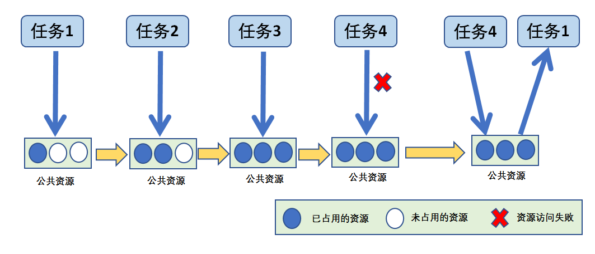
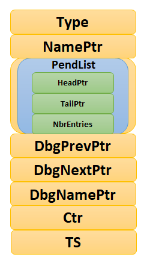
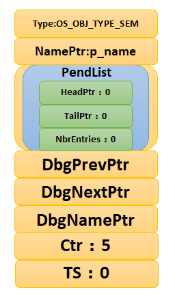
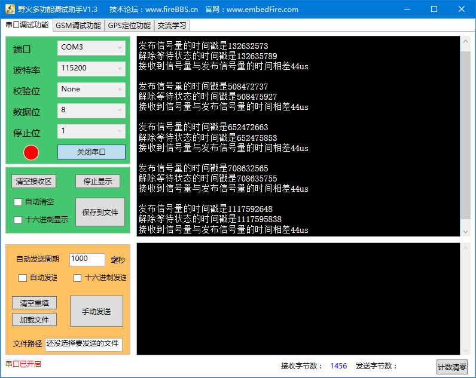
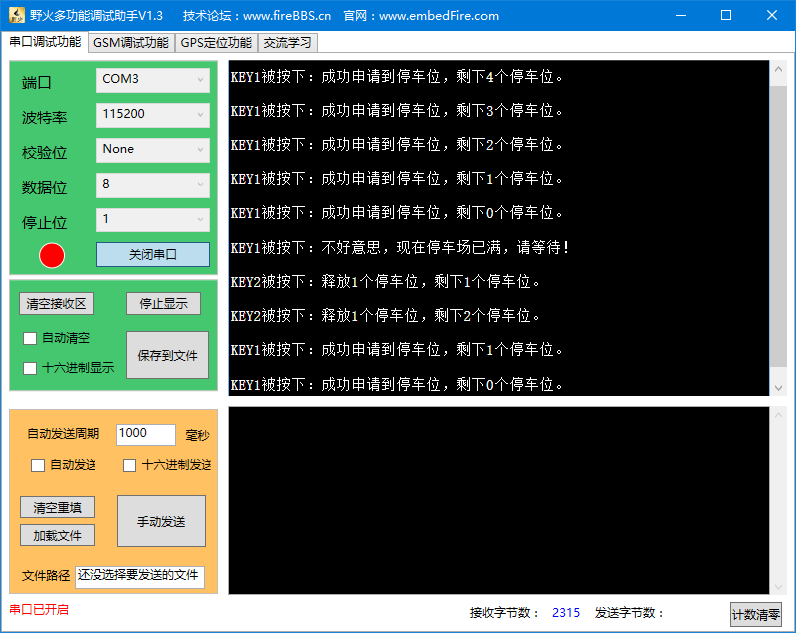

.. vim: syntax=rst

信号量
===========

同志们，回想一下，你是否在裸机编程中这样使用过一个变量：用于标记某个事件是否发生，或者标志一下某个东西是否正在被使用，
如果是被占用了的或者没发生，我们就不对它进行操作。

信号量基本概念
~~~~~~~~~~~~~~~~~~~

信号量（Semaphore）是一种实现任务间通信的机制，可以实现任务之间同步或临界资源的互斥访问，常用于协助一组相互竞争的任务来访问临界资源。
在多任务系统中，各任务之间需要同步或互斥实现临界资源的保护，信号量功能可以为用户提供这方面的支持。

抽象的来讲，信号量是一个非负整数，所有获取它的任务都会将该整数减一（获取它当然是为了使用资源），当该整数值为零时，
所有试图获取它的任务都将处于阻塞状态。通常一个信号量的计数值用于对应有效的资源数，表示剩下可被占用的临界资源数，
其值的含义分两种情况：

   -  0：表示没有积累下来的释放信号量操作，且有可能有在此信号量上阻塞的任务。

   -  正值：表示有一个或多个释放信号量操作。

注意：μC/OS的信号量并没有区分二值信号量与计数信号量，下面是作者为了更详细解释信号量的相关内容，自行区分二值信号量与计数信号量，
其实原理都是一样的，只不过用途不一样而已。

注意：μC/OS中的信号量不具备传递数据的功能。

二值信号量
^^^^^^^^^^^^^

二值信号量既可以用于临界资源访问也可以用于同步功能。

二值信号量和互斥信号量（以下使用互斥量表示互斥信号量）非常相似，但是有一些细微差别：互斥量有优先级继承机制，
二值信号量则没有这个机制。这使得二值信号量更偏向应用于同步功能（任务与任务间的同步或任务和中断间同步），而互斥量更偏向应用于临界资源的互斥访问。

用作同步时，信号量在创建后应被置为空，任务1获取信号量而进入阻塞，任务2在某种条件发生后，释放信号量，于是任务1获得信号量得以进入就绪态，
如果任务1的优先级是最高的，那么就会立即切换任务，从而达到了两个任务间的同步。同样的，在中断服务函数中释放信号量，任务1也会得到信号量，
从而达到任务与中断间的同步。

还记得我们经常说的中断要快进快出吗，在裸机开发中我们经常是在中断中做一个标记，然后在退出的时候进行轮询处理，这个就是类似我们使用信号量进行同步的，
当标记发生了，我们再做其他事情。在μC/OS中我们用信号量用于同步，任务与任务的同步，中断与任务的同步，可以大大提高效率。

计数信号量
^^^^^^^^^^^^^

顾名思义，计数信号量肯定是用于计数的，在实际的使用中，我们常将计数信号量用于事件计数与资源管理。每当某个事件发生时，
任务或者中断将释放一个信号量（信号量计数值加1），当处理被事件时（一般在任务中处理），处理任务会取走该信号量（信号量计数值减1），
信号量的计数值则表示还有多少个事件没被处理。此外，系统还有很多资源，我们也可以使用计数信号量进行资源管理，信号量的计数值表示系统中可用的资源数目，
任务必须先获取到信号量才能获取资源访问权，当信号量的计数值为零时表示系统没有可用的资源，但是要注意，在使用完资源的时候必须归还信号量，
否则当计数值为0的时候任务就无法访问该资源了。

计数型信号量允许多个任务对其进行操作，但限制了任务的数量。比如有一个停车场，里面只有100个车位，那么能停的车只有100辆，也相当于我们的信号量有100个，
假如一开始停车场的车位还有100个，那么每进去一辆车就要消耗一个停车位，车位的数量就要减一，对应的，我们的信号量在使用之后也需要减一，
当停车场停满了100辆车的时候，此时的停车位为0，再来的车就不能停进去了，否则将造成事故，也相当于我们的信号量为0，
后面的任务对这个停车场资源的访问也无法进行，当有车从停车场离开的时候，车位又空余出来了，那么，后面的车就能停进去了，
我们信号量的操作也是一样的，当我们释放了这个资源，后面的任务才能对这个资源进行访问。

信号量应用场景
~~~~~~~~~~~~~~~~~~~

在嵌入式操作系统中二值信号量是任务间、任务与中断间同步的重要手段，信号量使用最多的一般都是二值信号量与互斥量（互斥量在下一章讲解）。
为什么叫二值信号量呢？因为信号量资源被获取了，信号量值就是 0，信号量资源被释放，信号量值就是 1，把这种只有 0和 1 两种情况的信号量称之为二值信号量。

在多任务系统中，我们经常会使用这个二值信号量，比如，某个任务需要等待一个标记，那么任务可以在轮询中查询这个标记有没有被置位，
但是这样子做，就会很消耗CPU资源并且妨碍其他任务执行，更好的做法是任务的大部分时间处于阻塞状态（允许其他任务执行），
直到某些事件发生该任务才被唤醒去执行。可以使用二进制信号量实现这种同步，当任务取信号量时，因为此时尚未发生特定事件，
信号量为空，任务会进入阻塞状态；当事件的条件满足后，任务/中断便会释放信号量，告知任务这个事件发生了，任务取得信号量便被唤醒去执行对应的操作，
任务执行完毕并不需要归还信号量，这样子的CPU的效率可以大大提高，而且实时响应也是最快的。

再比如某个任务使用信号量在等中断的标记的发生，在这之前任务已经进入了阻塞态，在等待着中断的发生，当在中断发生之后，释放一个信号量，
也就是我们常说的标记，当它退出中断之后，操作系统会进行任务的调度，如果这个任务能够运行，系统就会去执行这个任务，这样子就大大提高了我们的效率。

二值信号量在任务与任务中同步的应用场景：假设我们有一个温湿度的传感器，假设是1s采集一次数据，那么我们让他在液晶屏中显示数据出来，
这个周期也是要1s一次的，如果液晶屏刷新的周期是100ms更新一次，那么此时的温湿度的数据还没更新，液晶屏根本无需刷新，
只需要在1s后温湿度数据更新的时候刷新即可，否则CPU就是白白做了多次的无效数据更新，CPU的资源就被刷新数据这个任务占用了大半，
造成CPU资源浪费，如果液晶屏刷新的周期是10s更新一次，那么温湿度的数据都变化了10次，液晶屏才来更新数据，那拿这个产品有啥用，
根本就是不准确的，所以，还是需要同步协调工作，在温湿度采集完毕之后，进行液晶屏数据的刷新，这样子，才是最准确的，并且不会浪费CPU的资源。

同理，二值信号量在任务与中断同步的应用场景：我们在串口接收中，我们不知道啥时候有数据发送过来，有一个任务是做接收这些数据处理，
总不能在任务中每时每刻都在任务查询有没有数据到来，那样会浪费CPU资源，所以在这种情况下使用二值信号量是很好的办法，
当没有数据到来的时候，任务就进入阻塞态，不参与任务的调度，等到数据到来了，释放一个二值信号量，任务就立即从阻塞态中解除，
进入就绪态，然后运行的时候处理数据，这样子系统的资源就会很好的被利用起来。

而计数信号量则用于资源统计，比如当前任务来了很多个消息，但是这些消息都放在缓冲区中，尚未处理，这时候就可以利用计数信号量对这些资源进行统计，
每来一个消息就加一，每处理完一个消息就减一，这样子系统就知道有多少资源未处理的。

二值信号量运作机制
~~~~~~~~~~~~~~~~~~~~~~~~~~~

创建信号量时，系统会为创建的信号量对象分配内存，并把可用信号量初始化为用户自定义的个数，二值信号量的最大可用信号量个数为1。

二值信号量获取，任何任务都可以从创建的二值信号量资源中获取一个二值信号量，获取成功则返回正确，
否则任务会根据用户指定的阻塞超时时间来等待其他任务/中断释放信号量。在等待这段时间，系统将任务变成阻塞态，
任务将被挂到该信号量的阻塞等待列表中。

在二值信号量无效的时候，假如此时有任务获取该信号量的话，那么任务将进入阻塞状态，具体见图 信号量无效时候获取_ 。

假如某个时间中断/任务释放了信号量，其过程具体见图 中断_任务释放信号量_ ，那么，
由于获取无效信号量而进入阻塞态的任务将获得信号量并且恢复为就绪态，其过程具体见图 二值信号量运作机制_ 。

计数信号量运作机制
~~~~~~~~~~~~~~~~~~~~~~~~~~~

计数信号量可以用于资源管理，允许多个任务获取信号量访问共享资源，但会限制任务的最大数目。访问的任务数达到可支持的最大数目时，
会阻塞其他试图获取该信号量的任务，直到有任务释放了信号量。这就是计数型信号量的运作机制，虽然计数信号量允许多个任务访问同一个资源，
但是也有限定，比如某个资源限定只能有3个任务访问，那么第4个任务访问的时候，会因为获取不到信号量而进入阻塞，
等到有任务（比如任务1）释放掉该资源的时候，第4个任务才能获取到信号量从而进行资源的访问，其运作的机制具体见图 计数信号量运作示意图_ 。

信号量控制块
~~~~~~~~~~~~~~~~~~

μC/OS的信号量由多个元素组成，在信号量被创建时，需要由我们自己定义信号量控制块（也可以称之为信号量句柄），
因为它是用于保存信号量的一些信息的，其数据结构OS_SEM除了信号量必须的一些基本信息外，还有PendList链表与Ctr，
为的是方便系统来管理信号量。其数据结构具体见 **代码清单:消息队列-2**，示意图具体见图 信号量的控制块数据结构_ 。

.. code-block:: c
    :caption: 代码清单:信号量-1消息队列结构
    :name: 代码清单:信号量-1
    :linenos:

    struct  os_sem
    {

        OS_OBJ_TYPE          Type;				(1)
        CPU_CHAR            *NamePtr;			(2)
        OS_PEND_LIST         PendList;			(3)
    #if OS_CFG_DBG_EN > 0u
        OS_SEM              *DbgPrevPtr;
        OS_SEM              *DbgNextPtr;
        CPU_CHAR            *DbgNamePtr;
    #endif

        OS_SEM_CTR           Ctr;				(4)
        CPU_TS               TS;				(5)
    };

-   代码清单:信号量-1_  **(1)**\ ：信号量的类型，用户无需理会。

-   代码清单:信号量-1_  **(2)**\ ：信号量的名字。

-   代码清单:信号量-1_  **(3)**\ ：等待信号量的任务列表。

-   代码清单:信号量-1_  **(4)**\ ：可用信号量的个数，如果为0则表示无可用信号量。

-   代码清单:信号量-1_  **(5)**\ ：用于记录时间戳。

信号量函数接口讲解
~~~~~~~~~~~~~~~~~~~~~~~~~~~

创建信号量函数OSSemCreate()
^^^^^^^^^^^^^^^^^^^^^^^^^^^^^^^^^^^^^^^^^^^^^^^^^^^^^^^^^^^^

在定义完信号量结构体变量后就可以调用 OSSemCreate()函数进行创建一个信号量，跟消息队列的创建差不多，我们知道，
其实这里的“创建信号量”指的就是对内核对象（信号量）的一些初始化。要特别注意的是内核对象使用之前一定要先创建，
这个创建过程必须要保证在所有可能使用内核对象的任务之前，所以一般我们都是在创建任务之前就创建好系统需要的内核对象（如信号量等），
创建信号量函数OSSemCreate()源码具体见 代码清单:信号量-2_ 。

.. code-block:: c
    :caption: 代码清单:信号量-2OSSemCreate()源码
    :name: 代码清单:信号量-2
    :linenos:

    void  OSSemCreate (OS_SEM   *p_sem,  (1)	//信号量控制块指针
                    CPU_CHAR    *p_name, (2)	//信号量名称
                    OS_SEM_CTR   cnt,    (3)	//资源数目或事件是否发生标志
                    OS_ERR      *p_err)  (4)	//返回错误类型
    {
        CPU_SR_ALLOC();
    //使用到临界段（在关/开中断时）时必须用到该宏，该宏声明和定义一个局部变
    //量，用于保存关中断前的 CPU 状态寄存器 SR（临界段关中断只需保存SR）
    //，开中断时将该值还原。

    #ifdef OS_SAFETY_CRITICAL(5)//如果启用（默认禁用）了安全检测
    if (p_err == (OS_ERR *)0)           //如果错误类型实参为空
        {
            OS_SAFETY_CRITICAL_EXCEPTION(); //执行安全检测异常函数
    return;                         //返回，不继续执行
        }
    #endif

    #ifdef OS_SAFETY_CRITICAL_IEC61508(6)//如果启用（默认禁用）了安全关键
    //如果是在调用OSSafetyCriticalStart()后创建该信号量
    if (OSSafetyCriticalStartFlag == DEF_TRUE)
        {
            *p_err = OS_ERR_ILLEGAL_CREATE_RUN_TIME; //错误类型为“非法创建内核对象”
    return;                                   //返回，不继续执行
        }
    #endif

    #if OS_CFG_CALLED_FROM_ISR_CHK_EN > 0u     (7)
    //如果启用（默认启用）了中断中非法调用检测
    if (OSIntNestingCtr > (OS_NESTING_CTR)0)      //如果该函数是在中断中被调用
        {
            *p_err = OS_ERR_CREATE_ISR;         //错误类型为“在中断函数中创建对象”
    return;                                   //返回，不继续执行
        }
    #endif

    #if OS_CFG_ARG_CHK_EN > 0u(8)//如果启用（默认启用）了参数检测
    if (p_sem == (OS_SEM *)0)         //如果参数 p_sem 为空
        {
            *p_err = OS_ERR_OBJ_PTR_NULL;  //错误类型为“信号量对象为空”
    return;                       //返回，不继续执行
        }
    #endif

        OS_CRITICAL_ENTER();               		//进入临界段
        p_sem->Type    = OS_OBJ_TYPE_SEM;  	(9)	//初始化信号量指标
        p_sem->Ctr     = cnt;
        p_sem->TS      = (CPU_TS)0;
        p_sem->NamePtr = p_name;
        OS_PendListInit(&p_sem->PendList); 	(10)//初始化该信号量的等待列表

    #if OS_CFG_DBG_EN > 0u//如果启用（默认启用）了调试代码和变量
        OS_SemDbgListAdd(p_sem); //将该定时添加到信号量双向调试链表
    #endif
        OSSemQty++;           (11)//信号量个数加1

        OS_CRITICAL_EXIT_NO_SCHED();     //退出临界段（无调度）
        *p_err = OS_ERR_NONE;             //错误类型为“无错误”
    }

-   代码清单:信号量-2_  **(1)**\ ：信号量控制块指针，指向我们定义的信号量控制块结构体变量，
    所以在创建之前我们需要先定义一个信号量控制块变量。

-   代码清单:信号量-2_  **(2)**\ ：信号量名称，字符串形式。

-   代码清单:信号量-2_  **(3)**\ ：这个值表示初始化时候资源的个数或事件是否发生标志，
    一般信号量是二值信号量的时候，这个值一般为0或者为1，而如果信号量作为计数信号量的时候，这个值一般定义为初始资源的个数。

-   代码清单:信号量-2_  **(4)**\ ：用于保存返回错误类型。

-   代码清单:信号量-2_  **(5)**\ ：如果启用了安全检测（默认禁用），在编译时则会包含安全检测相关的代码，
    如果错误类型实参为空，系统会执行安全检测异常函数，然后返回，不执行创建信号量操作。

-   代码清单:信号量-2_  **(6)**\ ：如果启用（默认禁用）了安全关键检测，在编译时则会包含安全关键检测相关的代码，
    如果是在调用OSSafetyCriticalStart()后创建该信号量，则是非法的，返回错误类型为“非法创建内核对象”错误代码，并且退出，不执行创建信号量操作。

-   代码清单:信号量-2_  **(7)**\ ：如果启用了中断中非法调用检测（默认启用），
    在编译时则会包含中断非法调用检测相关的代码，如果该函数是在中断中被调用，则是非法的，返回错误类型为“在中断中创建对象”的错误代码，
    并且退出，不执行创建信号量操作。

-   代码清单:信号量-2_  **(8)**\ ：如果启用了参数检测（默认启用），
    在编译时则会包含参数检测相关的代码，如果p_sem参数为空，返回错误类型为“创建对象为空”的错误代码，并且退出，不执行创建信号量操作。

-   代码清单:信号量-2_  **(9)**\ ：进入临界段，然后进行初始化信号量相关信息，
    如初始化信号量的类型、名字、可用信号量Ctr、记录时间戳的变量TS等。

-   代码清单:信号量-2_  **(10)**\ ：调用OS_PendListInit()函数初始化该信号量的等待列表。

-   代码清单:信号量-2_  **(11)**\ ：系统信号量个数加1。

如果我们创建一个初始可用信号量个数为5的信号量，那么信号量创建成功的示意图具体见图 信号量创建成功示意图_ 。

创建信号量函数OSSemCreate()的使用实例具体见 代码清单:信号量-3_ 。

.. code-block:: c
    :caption: 代码清单:信号量-3 OSSemCreate()使用实例
    :name: 代码清单:信号量-3
    :linenos:

    OS_SEM SemOfKey;          //标志KEY1是否被按下的信号量

    /* 创建信号量 SemOfKey */
    OSSemCreate((OS_SEM      *)&SemOfKey,    //指向信号量变量的指针
                (CPU_CHAR    *)"SemOfKey",    //信号量的名字
                (OS_SEM_CTR   )0,
    //信号量这里是指示事件发生，所以赋值为0，表示事件还没有发生
                (OS_ERR      *)&err);         //错误类型

信号量删除函数OSSemDel()
^^^^^^^^^^^^^^^^^^^^^^^^^^^^^^^^^^^^^^^^^^^^^^^^^

OSSemDel()用于删除一个信号量，信号量删除函数是根据信号量结构（信号量句柄）直接删除的，删除之后这个信号量的所有信息都会被系统清空，
而且不能再次使用这个信号量了，但是需要注意的是，如果某个信号量没有被定义，那也是无法被删除的，如果有任务阻塞在该信号量上，
那么尽量不要删除该信号量。想要使用互斥量删除函数就必须将OS_CFG_SEM_DEL_EN宏定义配置为1，其函数源码具体见 代码清单:信号量-4_ 。

.. code-block:: c
    :caption: 代码清单:信号量-4 OSSemDel()源码
    :name: 代码清单:信号量-4
    :linenos:

    #if OS_CFG_SEM_DEL_EN > 0u		//如果启用了 OSSemDel() 函数
    OS_OBJ_QTY  OSSemDel (OS_SEM  *p_sem,  	(1)	//信号量指针
                        OS_OPT   opt,    	(2)	//选项
                        OS_ERR  *p_err)  	(3)	//返回错误类型
    {
        OS_OBJ_QTY     cnt;
        OS_OBJ_QTY     nbr_tasks;
        OS_PEND_DATA  *p_pend_data;
        OS_PEND_LIST  *p_pend_list;
        OS_TCB        *p_tcb;
        CPU_TS         ts;
        CPU_SR_ALLOC();

    #ifdef OS_SAFETY_CRITICAL(4)//如果启用（默认禁用）了安全检测
    if (p_err == (OS_ERR *)0)                  //如果错误类型实参为空
        {
            OS_SAFETY_CRITICAL_EXCEPTION();        //执行安全检测异常函数
    return ((OS_OBJ_QTY)0);                //返回0（有错误），不继续执行
        }
    #endif

    #if OS_CFG_CALLED_FROM_ISR_CHK_EN > 0u(5)//如果启用了中断中非法调用检测
    if (OSIntNestingCtr > (OS_NESTING_CTR)0)   //如果该函数在中断中被调用
        {
            *p_err = OS_ERR_DEL_ISR;                //返回错误类型为“在中断中删除”
    return ((OS_OBJ_QTY)0);                //返回0（有错误），不继续执行
        }
    #endif

    #if OS_CFG_ARG_CHK_EN > 0u(6)//如果启用了参数检测
    if (p_sem == (OS_SEM *)0)                 //如果 p_sem 为空
        {
            *p_err = OS_ERR_OBJ_PTR_NULL;          //返回错误类型为“内核对象为空”
    return ((OS_OBJ_QTY)0);               //返回0（有错误），不继续执行
        }
    switch (opt)               	(7)//根据选项分类处理
        {
    case OS_OPT_DEL_NO_PEND:              //如果选项在预期之内
    case OS_OPT_DEL_ALWAYS:
    break;                           //直接跳出

    default:                        (8)//如果选项超出预期
            *p_err = OS_ERR_OPT_INVALID;      //返回错误类型为“选项非法”
    return ((OS_OBJ_QTY)0);          //返回0（有错误），不继续执行
        }
    #endif

    #if OS_CFG_OBJ_TYPE_CHK_EN > 0u(9)//如果启用了对象类型检测
    if (p_sem->Type != OS_OBJ_TYPE_SEM)      //如果 p_sem 不是信号量类型
        {
            *p_err = OS_ERR_OBJ_TYPE;           //返回错误类型为“内核对象类型错误”
    return ((OS_OBJ_QTY)0);            //返回0（有错误），不继续执行
        }
    #endif

        CPU_CRITICAL_ENTER();                      //关中断
        p_pend_list = &p_sem->PendList;  (10)//获取信号量的等待列表到p_pend_list
        cnt         = p_pend_list->NbrEntries;    //获取等待该信号量的任务数
        nbr_tasks   = cnt;
    switch (opt)                         (11)//根据选项分类处理
        {
    case OS_OPT_DEL_NO_PEND:               (12)
    //如果只在没有任务等待的情况下删除信号量
    if (nbr_tasks == (OS_OBJ_QTY)0)   //如果没有任务在等待该信号量
            {
    #if OS_CFG_DBG_EN > 0u//如果启用了调试代码和变量
                OS_SemDbgListRemove(p_sem);   //将该信号量从信号量调试列表移除
    #endif
                OSSemQty--;               (13)//信号量数目减1
                OS_SemClr(p_sem);          (14)//清除信号量内容
                CPU_CRITICAL_EXIT();          //开中断
        *p_err = OS_ERR_NONE;      (15)//返回错误类型为“无错误”
            }
    else(16)//如果有任务在等待该信号量
            {
                CPU_CRITICAL_EXIT();          //开中断
                *p_err = OS_ERR_TASK_WAITING;
    //返回错误类型为“有任务在等待该信号量”
            }
    break;

    case OS_OPT_DEL_ALWAYS:               (17)//如果必须删除信号量
            OS_CRITICAL_ENTER_CPU_EXIT();                  //锁调度器，并开中断
            ts = OS_TS_GET();                 (18)//获取时间戳
    while (cnt > 0u)              	(19)
    //逐个移除该信号量等待列表中的任务
            {
                p_pend_data = p_pend_list->HeadPtr;
                p_tcb       = p_pend_data->TCBPtr;
                OS_PendObjDel((OS_PEND_OBJ *)((void *)p_sem),
                            p_tcb,
                            ts);			(20)
                cnt--;
            }
    #if OS_CFG_DBG_EN > 0u//如果启用了调试代码和变量
            OS_SemDbgListRemove(p_sem);
    //将该信号量从信号量调试列表移除
    #endif
            OSSemQty--;                            (21)//信号量数目减1
            OS_SemClr(p_sem);                      (22)//清除信号量内容
            OS_CRITICAL_EXIT_NO_SCHED();        	//减锁调度器，但不进行调度
            OSSched();                           (23)
    //任务调度，执行最高优先级的就绪任务
            *p_err = OS_ERR_NONE;                    //返回错误类型为“无错误”
    break;

    default:                                (24)//如果选项超出预期
            CPU_CRITICAL_EXIT();                           //开中断
            *p_err = OS_ERR_OPT_INVALID;           //返回错误类型为“选项非法”
    break;
        }
    return ((OS_OBJ_QTY)nbr_tasks);          (25)
    //返回删除信号量前等待其的任务数
    }
    #endif

-   代码清单:信号量-4_  **(1)**\ ：信号量控制块指针，指向我们定义的信号量控制块结构体变量，
    所以在删除之前我们需要先定义一个信号量控制块变量，并且成功创建信号量后再进行删除操作。

-   代码清单:信号量-4_  **(2)**\ ：删除的选项。

-   代码清单:信号量-4_  **(3)**\ ：用于保存返回的错误类型。

-   代码清单:信号量-4_  **(4)**\ ：如果启用了安全检测（默认），在编译时则会包含安全检测相关的代码，
    如果错误类型实参为空，系统会执行安全检测异常函数，然后返回，不执行删除信号量操作。

-   代码清单:信号量-4_  **(5)**\ ：如果启用了中断中非法调用检测（默认启用），
    在编译时则会包含中断非法调用检测相关的代码，如果该函数是在中断中被调用，则是非法的，
    返回错误类型为“在中断中删除对象”的错误代码，并且退出，不执行删除信号量操作。

-   代码清单:信号量-4_  **(6)**\ ：如果启用了参数检测（默认启用），在编译时则会包含参数检测相关的代码，
    如果p_sem参数为空，返回错误类型为“内核对象为空”的错误代码，并且退出，不执行删除信号量操作。

-   代码清单:信号量-4_  **(7)**\ ：判断opt选项是否合理，该选项有两个，
    OS_OPT_DEL_ALWAYS与OS_OPT_DEL_NO_PEND，在os.h文件中定义。此处是判断一下选项是否在预期之内，如果在则跳出switch语句。

-   代码清单:信号量-4_  **(8)**\ ：如果选项超出预期，则返回错误类型为“选项非法”的错误代码，退出，不继续执行。

-   代码清单:信号量-4_  **(9)**\ ：如果启用了对象类型检测，在编译时则会包含对象类型检测相关的代码，
    如果p_sem不是信号量类型，返回错误类型为“内核对象类型错误”的错误代码，并且退出，不执行删除信号量操作。

-   代码清单:信号量-4_  **(10)**\ ：程序执行到这里，表示可以删除信号量了，
    系统首先获取信号量的等待列表保存到p_pend_list变量中。然后再获取等待该信号量的任务数。

-   代码清单:信号量-4_  **(11)**\ ：根据选项分类处理

-   代码清单:信号量-4_  **(12)**\ ：如果opt是OS_OPT_DEL_NO_PEND，则表示只在没有任务等待的情况下删除信号量，
    如果当前系统中有任务阻塞在该信号量上，则不能删除，反之，则可以删除信号量。

-   代码清单:信号量-4_  **(13)**\ ：如果没有任务在等待该信号量，信号量数目减1。

-   代码清单:信号量-4_  **(14)**\ ：清除信号量内容。

-   代码清单:信号量-4_  **(15)**\ ：删除成功，返回错误类型为“无错误”的错误代码。

-   代码清单:信号量-4_  **(16)**\ ：如果有任务在等待该信号量，则返回错误类型为“有任务在等待该信号量”错误代码。

-   代码清单:信号量-4_  **(17)**\ ：如果opt是OS_OPT_DEL_ALWAYS，则表示无论如何都必须删除信号量
    ，那么在删除之前，系统会把所有阻塞在该信号量上的任务恢复。

-   代码清单:信号量-4_  **(18)**\ ：获取时间戳，记录一下删除的时间。

-   代码清单:信号量-4_  **(19)**\ ：根据前面cnt记录阻塞在该信号量上的任务个数，逐个移除该信号量等待列表中的任务。

-   代码清单:信号量-4_  **(20)**\ ：调用OS_PendObjDel()函数将阻塞在内核对象（如信号量）上的任务从阻塞态恢复，
    此时系统在删除内核对象，删除之后，这些等待事件的任务需要被恢复，其源码具体见 **代码清单:消息队列-8**。

-   代码清单:信号量-4_  **(21)**\ ：执行到这里，表示已经删除了信号量了，系统信号量个数减1。

-   代码清单:信号量-4_  **(22)**\ ：清除信号量内容。

-   代码清单:信号量-4_  **(23)**\ ：进行一次任务调度。

-   代码清单:信号量-4_  **(24)**\ ：如果选项超出预期，返回错误类型为“选项非法”的错误代码，退出。

-   代码清单:信号量-4_  **(25)**\ ：返回删除信号量前阻塞在该信号量上的任务个数。

信号量删除函数OSSemDel()的使用也是很简单的，只需要传入要删除的信号量的句柄与选项还有保存返回的错误类型即可，调用函数时，
系统将删除这个信号量。需要注意的是在调用删除信号量函数前，系统应存在已创建的信号量。如果删除信号量时，系统中有任务正在等待该信号量，
则不应该进行删除操作，因为删除之后的信号量就不可用了，删除信号量函数OSSemDel()的使用实例具体见 代码清单:信号量-5_ 。

.. code-block:: c
    :caption: 代码清单:信号量-5OSSemDel()使用实例
    :name: 代码清单:信号量-5
    :linenos:

    OS_SEM SemOfKey;;                             //声明信号量

    OS_ERR      err;

    /* 删除信号量sem*/
    OSSemDel ((OS_SEM         *)&SemOfKey,      //指向信号量的指针
    OS_OPT_DEL_NO_PEND,
    OS_ERR       *)&err);             //返回错误类型

信号量释放函数OSSemPost()
^^^^^^^^^^^^^^^^^^^^^^^^^^^^^^^^^^^^^^^^^^^^^^^^^^^^^^

与消息队列的操作一样，信号量的释放可以在任务、中断中使用。

在前面的讲解中，我们知道，当信号量有效的时候，任务才能获取信号量，那么，是什么函数使得信号量变得有效？其实有两个方式，
一个是在创建的时候进行初始化，将它可用的信号量个数设置一个初始值；如果该信号量用作二值信号量，那么我们在创建信号量的时候其初始值的范围是0~1，
假如初始值为1个可用的信号量的话，被获取一次就变得无效了，那就需要我们释放信号量，μC/OS提供了信号量释放函数，
每调用一次该函数就释放一个信号量。但是有个问题，能不能一直释放？很显然如果用作二值信号量的话，一直释放信号量就达不到同步或者互斥访问的效果，
虽然说μC/OS的信号量是允许一直释放的，但是，信号量的范围还需我们用户自己根据需求进行决定，当用作二值信号量的时候，
必须确保其可用值在0~1范围内；而用作计数信号量的话，其范围是由用户根据实际情况来决定的，在写代码的时候，我们要注意代码的严谨性罢了，
信号量释放函数的源码具体见 代码清单:信号量-6_ 。

.. code-block:: c
    :caption: 代码清单:信号量-6 OSSemPost()源码
    :name: 代码清单:信号量-6
    :linenos:

    OS_SEM_CTR  OSSemPost (OS_SEM  *p_sem,    (1)	//信号量控制块指针
                        OS_OPT   opt,      (2)	//选项
                        OS_ERR  *p_err)    (3)	//返回错误类型
    {
        OS_SEM_CTR  ctr;
        CPU_TS      ts;

    #ifdef OS_SAFETY_CRITICAL//如果启用（默认禁用）了安全检测
    if (p_err == (OS_ERR *)0)             //如果错误类型实参为空
        {
            OS_SAFETY_CRITICAL_EXCEPTION();   //执行安全检测异常函数
    return ((OS_SEM_CTR)0);           //返回0（有错误），不继续执行
        }
    #endif

    #if OS_CFG_ARG_CHK_EN > 0u//如果启用（默认启用）了参数检测功能
    if (p_sem == (OS_SEM *)0)             //如果 p_sem 为空
        {
            *p_err  = OS_ERR_OBJ_PTR_NULL;     //返回错误类型为“内核对象指针为空”
    return ((OS_SEM_CTR)0);           //返回0（有错误），不继续执行
        }
    switch (opt)                        //根据选项情况分类处理
        {
    case OS_OPT_POST_1:                          //如果选项在预期内，不处理
    case OS_OPT_POST_ALL:
    case OS_OPT_POST_1   | OS_OPT_POST_NO_SCHED:
    case OS_OPT_POST_ALL | OS_OPT_POST_NO_SCHED:
    break;

    default:                                    //如果选项超出预期
            *p_err =  OS_ERR_OPT_INVALID;            //返回错误类型为“选项非法”
    return ((OS_SEM_CTR)0u);                //返回0（有错误），不继续执行
        }
    #endif

    #if OS_CFG_OBJ_TYPE_CHK_EN > 0u//如果启用了对象类型检测
    if (p_sem->Type != OS_OBJ_TYPE_SEM)    //如果 p_sem 的类型不是信号量类型
        {
            *p_err = OS_ERR_OBJ_TYPE;           //返回错误类型为“对象类型错误”
    return ((OS_SEM_CTR)0);            //返回0（有错误），不继续执行
        }
    #endif

        ts = OS_TS_GET();                             //获取时间戳

    #if OS_CFG_ISR_POST_DEFERRED_EN > 0u//如果启用了中断延迟发布
    if (OSIntNestingCtr > (OS_NESTING_CTR)0)      //如果该函数是在中断中被调用
        {
            OS_IntQPost((OS_OBJ_TYPE)OS_OBJ_TYPE_SEM,//将该信号量发布到中断消息队列
                        (void      *)p_sem,
                        (void      *)0,
                        (OS_MSG_SIZE)0,
                        (OS_FLAGS   )0,
                        (OS_OPT     )opt,
                        (CPU_TS     )ts,
                        (OS_ERR    *)p_err);	(4)
    return ((OS_SEM_CTR)0);                   //返回0（尚未发布），不继续执行
        }
    #endif

        ctr = OS_SemPost(p_sem,                       //将信号量按照普通方式处理
                        opt,
                        ts,
                        p_err);			(5)

    return (ctr);                                 //返回信号的当前计数值
    }

-   代码清单:信号量-6_  **(1)**\ ：信号量控制块指针。

-   代码清单:信号量-6_  **(2)**\ ：释放信号量的选项，该选项在os.h中定义，具体见 代码清单:信号量-7_ 。

.. code-block:: c
    :caption: 代码清单:信号量-7释放信号量选项
    :name: 代码清单:信号量-7
    :linenos:

    #define  OS_OPT_POST_FIFO                    (OS_OPT)(0x0000u)(1)

    #define  OS_OPT_POST_LIFO                    (OS_OPT)(0x0010u)(2)

    #define  OS_OPT_POST_1                       (OS_OPT)(0x0000u)(3)

    #define  OS_OPT_POST_ALL                     (OS_OPT)(0x0200u)(4)

-   代码清单:信号量-7_  **(1)**\ ：默认采用FIFO方式发布信号量

-   代码清单:信号量-7_  **(2)**\ ：μC/OS也支持采用FIFO方式发布信号量。

-   代码清单:信号量-7_  **(3)**\ ：发布给一个任务。

-   代码清单:信号量-7_  **(4)**\ ：发布给所有等待的任务，也叫广播信号量。

-   代码清单:信号量-6_  **(3)**\ ：用于保存返回错误类型。

-   代码清单:信号量-6_  **(4)**\ ：如果启用了中断延迟发布，并且该函数在中断中被调用，
    则使用OS_IntQPost()函数将信号量发布到中断消息队列中，OS_IntQPost()函数源码我们在前面已经将近过，就不再重复赘述。

-   代码清单:信号量-6_  **(5)**\ ：将信号量按照普通方式处理，OS_SemPost()源码具体见

.. code-block:: c
    :caption: 代码清单:信号量-8OS_SemPost()源码
    :name: 代码清单:信号量-8
    :linenos:

    OS_SEM_CTR  OS_SemPost (OS_SEM  *p_sem, 		//信号量指针
                            OS_OPT   opt,   	//选项
                            CPU_TS   ts,    	//时间戳
                            OS_ERR  *p_err) 	//返回错误类型
    {
        OS_OBJ_QTY     cnt;
        OS_SEM_CTR     ctr;
        OS_PEND_LIST  *p_pend_list;
        OS_PEND_DATA  *p_pend_data;
        OS_PEND_DATA  *p_pend_data_next;
        OS_TCB        *p_tcb;
        CPU_SR_ALLOC();

        CPU_CRITICAL_ENTER();                     //关中断
        p_pend_list = &p_sem->PendList;       (1)//取出该信号量的等待列表
    //如果没有任务在等待该信号量
    if (p_pend_list->NbrEntries == (OS_OBJ_QTY)0)   (2)
        {
    //判断是否将导致该信号量计数值溢出，
    switch (sizeof(OS_SEM_CTR))	(3)
            {
    case 1u:                                   (4)

    //如果溢出，则开中断，返回错误类型为
    if (p_sem->Ctr == DEF_INT_08U_MAX_VAL)
    //“计数值溢出”，返回0（有错误），
                {
                    CPU_CRITICAL_EXIT();                   //不继续执行。
                    *p_err = OS_ERR_SEM_OVF;
    return ((OS_SEM_CTR)0);
                }
    break;

    case 2u:
    if (p_sem->Ctr == DEF_INT_16U_MAX_VAL)
                {
                    CPU_CRITICAL_EXIT();
                    *p_err = OS_ERR_SEM_OVF;
    return ((OS_SEM_CTR)0);
                }
    break;

    case 4u:
    if (p_sem->Ctr == DEF_INT_32U_MAX_VAL)
                {
                    CPU_CRITICAL_EXIT();
                    *p_err = OS_ERR_SEM_OVF;
    return ((OS_SEM_CTR)0);
                }
    break;

    default:
    break;
            }
            p_sem->Ctr++;                    (5)//信号量计数值不溢出则加1
            ctr       = p_sem->Ctr;         //获取信号量计数值到 ctr
            p_sem->TS = ts;                  (6)//保存时间戳
            CPU_CRITICAL_EXIT();                                //则开中断
            *p_err     = OS_ERR_NONE;               //返回错误类型为“无错误”
    return (ctr);                    (7)
    //返回信号量的计数值，不继续执行
        }

        OS_CRITICAL_ENTER_CPU_EXIT();        (8)//加锁调度器，但开中断
    if ((opt & OS_OPT_POST_ALL) != (OS_OPT)0)
    //如果要将信号量发布给所有等待任务
        {
            cnt = p_pend_list->NbrEntries;    (9)//获取等待任务数目到 cnt
        }
    else
    //如果要将信号量发布给优先级最高的等待任务
        {
            cnt = (OS_OBJ_QTY)1;          (10)//将要操作的任务数为1，cnt置1

        }
        p_pend_data = p_pend_list->HeadPtr; //获取等待列表的首个任务到p_pend_data

    while (cnt > 0u)                     (11)//逐个处理要发布的任务
        {
            p_tcb            = p_pend_data->TCBPtr;        //取出当前任务
            p_pend_data_next = p_pend_data->NextPtr;       //取出下一个任务
            OS_Post((OS_PEND_OBJ *)((void *)p_sem),        //发布信号量给当前任务
                    p_tcb,
                    (void      *)0,
                    (OS_MSG_SIZE)0,
                    ts);			(12)
            p_pend_data = p_pend_data_next;             //处理下一个任务
            cnt--;			(13)
        }
        ctr = p_sem->Ctr;  //获取信号量计数值到 ctr
        OS_CRITICAL_EXIT_NO_SCHED();     (14)
    //减锁调度器，但不执行任务调度
    //如果 opt没选择“发布时不调度任务”
    if ((opt & OS_OPT_POST_NO_SCHED) == (OS_OPT)0)
        {
            OSSched();    (15)//任务调度
        }
        *p_err = OS_ERR_NONE;                (16)//返回错误类型为“无错误”
    return (ctr);                                   //返回信号量的当前计数值
    }

-   代码清单:信号量-8_  **(1)**\ ：取出该信号量的等待列表保存在p_pend_list变量中。

-   代码清单:信号量-8_  **(2)**\ ：判断一下有没有任务在等待该信号量，
    如果没有任务在等待该信号量，则要先看看信号量的信号量计数值是否即将溢出。

-   代码清单:信号量-8_  **(3)**\ ：怎么判断计数值是否溢出呢？μC/OS支持多个数据类型的信号量计数值，
    可以是8位的，16位的，32位的，具体是多少位是由我们自己定义的。

-   代码清单:信号量-8_  **(4)**\：先看看OS_SEM_CTR的大小是个字节，如果是1个字节，表示Ctr计数值是8位的，
    则判断一下Ctr是否到达了DEF_INT_08U_MAX_VAL，如果到达了，再释放信号量就会溢出，那么就会返回错误类型为“计数值溢出”的错误代码。
    而对于OS_SEM_CTR是2字节、4字节的也是同样的判断操作。

-   代码清单:信号量-8_  **(5)**\ ：程序能执行到这里，说明信号量的计数值不溢出，此时释放信号量则需要将Ctr加1。

-   代码清单:信号量-8_  **(6)**\ ：保存释放信号量时的时间戳。

-   代码清单:信号量-8_  **(7)**\ ：返回错误类型为“无错误”的错误代码，然后返回信号量的计数值，不继续执行。

-   代码清单:信号量-8_  **(8)**\：而程序能执行到这里，说明系统中有任务阻塞在该信号量上，
    此时我们释放了一个信号量，就要将等待的任务进行恢复，但是恢复一个还是恢复所有任务得看用户自定义的释放信号量选项。
    所以此时不管三七二十一将调度器锁定，但开中断，因为接下来的操作是需要操作任务与信号量的列表，系统不希望其他任务来打扰。

-   代码清单:信号量-8_  **(9)**\ ：如果要将信号量释放给所有等待任务，
    首先获取等待该信号量的任务个数到变量cnt中，用来记录即将要进行释放信号量操作的任务个数。

-   代码清单:信号量-8_  **(10)**\ ：如果要将信号量释放给优先级最高的等待任务，将要操作的任务数为1，所以将cnt置1。

-   代码清单:信号量-8_  **(11)**\ ：逐个处理要释放信号量的任务。

-   代码清单:信号量-8_  **(12)**\ ：调用OS_Post()函数进行对应的任务释放信号量，
    因为该源码在前面就讲解过了，此处就不再重复赘述，具体见 **代码清单:消息队列-14**。

-   代码清单:信号量-8_  **(13)**\ ：处理下一个任务。

-   代码清单:信号量-8_  **(14)**\ ：减锁调度器，但不执行任务调度.

-   代码清单:信号量-8_  **(15)**\ ：如果 opt 没选择“发布时不调度任务”，那么就进行任务调度。

-   代码清单:信号量-8_  **(16)**\ ：操作完成，返回错误类型为“无错误”的错误代码，并且返回信号量的当前计数值。

如果可用信号量未满，信号量控制块结构体成员变量Ctr就会加1，然后判断是否有阻塞的任务，如果有的话就会恢复阻塞的任务，
然后返回成功信息，用户可以选择只释放（发布）给一个任务或者是释放（发布）给所有在等待信号量的任务（广播信号量），
并且用户可以选择在释放（发布）完成的时候要不要进行任务调度，如果信号量在中断中释放，用户可以选择是否需要延迟释放（发布）。

信号量的释放函数的使用很简单，具体见 代码清单:信号量-9_

.. code-block:: c
    :caption: 代码清单:信号量-9OSSemPost()使用实例
    :name: 代码清单:信号量-9
    :linenos:

    OS_SEM SemOfKey;          //标志KEY1是否被按下的信号量
    OSSemPost((OS_SEM  *)&SemOfKey,       //发布SemOfKey
            (OS_OPT   )OS_OPT_POST_ALL,  //发布给所有等待任务
            (OS_ERR  *)&err); 		//返回错误类型

信号量获取函数OSSemPend()
^^^^^^^^^^^^^^^^^^^^^^^^^^^^^^^^^^^^^^^^^^^^^^^^^^^^^^

与消息队列的操作一样，信号量的获取可以在任务中使用。

与释放信号量对应的是获取信号量，我们知道，当信号量有效的时候，任务才能获取信号量，当任务获取了某个信号量的时候，
该信号量的可用个数就减一，当它减到0的时候，任务就无法再获取了，并且获取的任务会进入阻塞态（假如用户指定了阻塞超时时间的话）。
如果某个信号量中当前拥有1个可用的信号量的话，被获取一次就变得无效了，那么此时另外一个任务获取该信号量的时候，就会无法获取成功，
该任务便会进入阻塞态，阻塞时间由用户指定。

μC/OS支持系统中多个任务获取同一个信号量，假如信号量中已有多个任务在等待，那么这些任务会按照优先级顺序进行排列，
如果信号量在释放的时候选择只释放给一个任务，那么在所有等待任务中最高优先级的任务优先获得信号量，
而如果信号量在释放的时候选择释放给所有任务，则所有等待的任务都会获取到信号量，信号量获取函数OSSemPend()源码具体见。

.. code-block:: c
    :caption: 代码清单:信号量-10 OSSemPend()源码
    :name: 代码清单:信号量-10
    :linenos:

    OS_SEM_CTR  OSSemPend (OS_SEM   *p_sem,   (1)	//信号量指针
                        OS_TICK   timeout, (2)	//等待超时时间
                        OS_OPT    opt,     (3)	//选项
                        CPU_TS   *p_ts,    (4)	//等到信号量时的时间戳
                        OS_ERR   *p_err)   (5)	//返回错误类型
    {
        OS_SEM_CTR    ctr;
        OS_PEND_DATA  pend_data;
        CPU_SR_ALLOC();

    #ifdef OS_SAFETY_CRITICAL(6)//如果启用（默认禁用）了安全检测
    if (p_err == (OS_ERR *)0)                   //如果错误类型实参为空
        {
            OS_SAFETY_CRITICAL_EXCEPTION();//执行安全检测异常函数
    return ((OS_SEM_CTR)0);                 //返回0（有错误），不继续执行
        }
    #endif

    #if OS_CFG_CALLED_FROM_ISR_CHK_EN > 0u(7)//如果启用了中断中非法调用检测
    if (OSIntNestingCtr > (OS_NESTING_CTR)0)    //如果该函数在中断中被调用
        {
            *p_err = OS_ERR_PEND_ISR;                //返回错误类型为“在中断中等待”
    return ((OS_SEM_CTR)0);                 //返回0（有错误），不继续执行
        }
    #endif

    #if OS_CFG_ARG_CHK_EN > 0u(8)//如果启用了参数检测
    if (p_sem == (OS_SEM *)0)                  //如果 p_sem 为空
        {
            *p_err = OS_ERR_OBJ_PTR_NULL;           //返回错误类型为“内核对象为空”
    return ((OS_SEM_CTR)0);                //返回0（有错误），不继续执行
        }
    switch (opt)                      (9)//根据选项分类处理
        {
    case OS_OPT_PEND_BLOCKING:             //如果选择“等待不到对象进行阻塞”
    case OS_OPT_PEND_NON_BLOCKING:         //如果选择“等待不到对象不进行阻塞”
    break;                            //直接跳出，不处理

    default:                           (10)//如果选项超出预期
            *p_err = OS_ERR_OPT_INVALID;       //返回错误类型为“选项非法”
    return ((OS_SEM_CTR)0);           //返回0（有错误），不继续执行
        }
    #endif

    #if OS_CFG_OBJ_TYPE_CHK_EN > 0u(11)//如果启用了对象类型检测
    if (p_sem->Type != OS_OBJ_TYPE_SEM)       //如果 p_sem 不是信号量类型
        {
            *p_err = OS_ERR_OBJ_TYPE;            //返回错误类型为“内核对象类型错误”
    return ((OS_SEM_CTR)0);               //返回0（有错误），不继续执行
        }
    #endif

    if (p_ts != (CPU_TS *)0)        (12)//如果 p_ts 非空
        {
            *p_ts  = (CPU_TS)0;
    //初始化（清零）p_ts，待用于返回时间戳
        }
        CPU_CRITICAL_ENTER();                     //关中断
    if (p_sem->Ctr > (OS_SEM_CTR)0)    (13)//如果资源可用
        {
            p_sem->Ctr--;                  (14)//资源数目减1
    if (p_ts != (CPU_TS *)0)       (15)//如果 p_ts 非空
            {
                *p_ts  = p_sem->TS;             //获取该信号量最后一次发布的时间戳
            }
            ctr   = p_sem->Ctr;             (16)//获取信号量的当前资源数目
            CPU_CRITICAL_EXIT();                  //开中断
            *p_err = OS_ERR_NONE;                  //返回错误类型为“无错误”
    return (ctr);
    //返回信号量的当前资源数目，不继续执行
        }

    if ((opt & OS_OPT_PEND_NON_BLOCKING) != (OS_OPT)0)      (17)
    //如果没有资源可用，而且选择了不阻塞任务
        {
            ctr   = p_sem->Ctr;                     //获取信号量的资源数目到 ctr
            CPU_CRITICAL_EXIT();                                //开中断
            *p_err = OS_ERR_PEND_WOULD_BLOCK;
    //返回错误类型为“等待渴求阻塞”
    return (ctr);
    //返回信号量的当前资源数目，不继续执行
        }
    else
    //如果没有资源可用，但选择了阻塞任务		(18)
        {
    if (OSSchedLockNestingCtr > (OS_NESTING_CTR)0)(19)//如果调度器被锁
            {
                CPU_CRITICAL_EXIT();                            //开中断
                *p_err = OS_ERR_SCHED_LOCKED;
    //返回错误类型为“调度器被锁”
    return ((OS_SEM_CTR)0);
    //返回0（有错误），不继续执行
            }
        }

        OS_CRITICAL_ENTER_CPU_EXIT();      (20)	//锁调度器，并重开中断
        OS_Pend(&pend_data,
    //阻塞等待任务，将当前任务脱离就绪列表，
                (OS_PEND_OBJ *)((void *)p_sem),
    //并插入节拍列表和等待列表。
                OS_TASK_PEND_ON_SEM,
                timeout);				(21)

        OS_CRITICAL_EXIT_NO_SCHED();              //开调度器，但不进行调度

        OSSched();                               (22)
    //找到并调度最高优先级就绪任务
    /* 当前任务（获得信号量）得以继续运行 */
        CPU_CRITICAL_ENTER();                                   //关中断
    switch (OSTCBCurPtr->PendStatus)         (23)
    //根据当前运行任务的等待状态分类处理
        {
    case OS_STATUS_PEND_OK:                (24)//如果等待状态正常
    if (p_ts != (CPU_TS *)0)                       //如果 p_ts 非空
            {
                *p_ts  =  OSTCBCurPtr->TS;         //获取信号被发布的时间戳
            }
            *p_err = OS_ERR_NONE;                 //返回错误类型为“无错误”
    break;

    case OS_STATUS_PEND_ABORT:           (25)//如果等待被终止中止
    if (p_ts != (CPU_TS *)0)               //如果 p_ts 非空
            {
                *p_ts  =  OSTCBCurPtr->TS;         //获取等待被中止的时间戳
            }
            *p_err = OS_ERR_PEND_ABORT;            //返回错误类型为“等待被中止”
    break;

    case OS_STATUS_PEND_TIMEOUT:        (26)//如果等待超时
    if (p_ts != (CPU_TS *)0)                       //如果 p_ts 非空
            {
                *p_ts  = (CPU_TS  )0;                       //清零 p_ts
            }
            *p_err = OS_ERR_TIMEOUT;               //返回错误类型为“等待超时”
    break;

    case OS_STATUS_PEND_DEL:            (27)//如果等待的内核对象被删除
    if (p_ts != (CPU_TS *)0)              //如果 p_ts 非空
            {
                *p_ts  =  OSTCBCurPtr->TS;        //获取内核对象被删除的时间戳
            }
            *p_err = OS_ERR_OBJ_DEL;
    //返回错误类型为“等待对象被删除”
    break;

    default:                           (28)//如果等待状态超出预期
            *p_err = OS_ERR_STATUS_INVALID;
    //返回错误类型为“等待状态非法”
            CPU_CRITICAL_EXIT();                //开中断
    return ((OS_SEM_CTR)0);             //返回0（有错误），不继续执行
        }
        ctr = p_sem->Ctr;                       //获取信号量的当前资源数目
        CPU_CRITICAL_EXIT();                    //开中断
    return (ctr);                   (29)//返回信号量的当前资源数目
    }

-   代码清单:信号量-10_  **(1)**\ ：信号量指针。

-   代码清单:信号量-10_  **(2)**\ ：用户自定义的阻塞超时时间

-   代码清单:信号量-10_  **(3)**\ ：获取信号量的选项，当信号量不可用的时候，用户可以选择阻塞或者不阻塞。

-   代码清单:信号量-10_  **(4)**\ ：用于保存返回等到信号量时的时间戳。

-   代码清单:信号量-10_  **(5)**\ ：用于保存返回的错误类型，用户可以根据此变量得知错误的原因。

-   代码清单:信号量-10_  **(6)**\ ：如果启用（默认禁用）了安全检测，在编译时则会包含安全检测相关的代码，
    如果错误类型实参为空，系统会执行安全检测异常函数，然后返回，停止执行。

-   代码清单:信号量-10_  **(7)**\ ：如果启用了中断中非法调用检测，并且如果该函数在中断中被调用，
    则返回错误类型为“在中断获取信号量”的错误代码，然后退出，停止执行。

-   代码清单:信号量-10_  **(8)**\ ：如果启用了参数检测，在编译时则会包含参数检测相关的代码，
    如果 p_sem参数为空，返回错误类型为“内核对象为空”的错误代码，并且退出，不执行获取消息操作。

-   代码清单:信号量-10_  **(9)**\ ：判断一下opt选项是否合理，如果选择“等待不到对象进行阻塞”
    （OS_OPT_PEND_BLOCKING）或者选择“等待不到对象不进行阻塞”（OS_OPT_PEND_NON_BLOCKING），则是合理的，跳出switch语句。

-   代码清单:信号量-10_  **(10)**\ ：如果选项超出预期，则返回错误类型为“选项非法”的错误代码，并且推出。

-   代码清单:信号量-10_  **(11)**\ ：如果启用了对象类型检测，在编译时则会包含对象类型检测相关代码，
    如果 p_sem不是信号量类型，那么返回错误类型为“对象类型有误”的错误代码，并且退出，不执行获取信号量操作。

-   代码清单:信号量-10_  **(12)**\ ：如果 p_ts 非空，就初始化（清零）p_ts，待用于返回时间戳。

-   代码清单:信号量-10_  **(13)**\ ：如果当前信号量资源可用。

-   代码清单:信号量-10_  **(14)**\ ：那么被获取的信号量资源中的Ctr成员变量个数就要减一。

-   代码清单:信号量-10_  **(15)**\ ：如果 p_ts 非空，获取该信号量最后一次发布的时间戳。

-   代码清单:信号量-10_  **(16)**\ ：获取信号量的当前资源数目用于返回，执行完成，那么返回错误类型为“无错误”的错误代码，退出。

-   代码清单:信号量-10_  **(17)**\ ：如果没有资源可用，而且用户选择了不阻塞任务，
    获取信号量的资源数目到ctr变量用于返回，然后返回错误类型为“等待渴求组塞”的错误代码，退出操作。

-   代码清单:信号量-10_  **(18)**\ ：如果没有资源可用，但用户选择了阻塞任务，则需要判断一下调度器是否被锁。

-   代码清单:信号量-10_  **(19)**\ ：如果调度器被锁，返回错误类型为“调度器被锁”的错误代码，然后退出，不执行信号量获取操作。

-   代码清单:信号量-10_  **(20)**\ ：如果调度器未被锁，就锁定调度器，重新打开中断。
    此次可能有同学就会问了，为什么刚刚调度器被锁就错误的呢，而现在又要锁定调度器？那是因为之前锁定的调度器不是由这个函数进行锁定的，
    这是不允许的，因为现在要阻塞当前任务，而调度器锁定了就表示无法进行任务调度，这也是不允许的。那为什么又要关闭调度器呢，
    因为接下来的操作是需要操作队列与任务的列表，这个时间就不会很短，系统不希望有其他任务来操作任务列表，
    因为可能引起其他任务解除阻塞，这可能会发生优先级翻转。比如任务A的优先级低于当前任务，但是在当前任务进入阻塞的过程中，
    任务A却因为其他原因解除阻塞了，那系统肯定是会去运行任务A，这显然是要绝对禁止的，
    因为挂起调度器意味着任务不能切换并且不准调用可能引起任务切换的API函数，所以，锁定调度器，打开中断这样的处理，
    既不会影响中断的响应，又避免了其他任务来操作队列与任务的列表。

-   代码清单:信号量-10_  **(21)**\ ：调用OS_Pend()函数将当前任务脱离就绪列表，
    并根据用户指定的阻塞时间插入节拍列表和队列等待列表，然后打开调度器，但不进行调度，OS_Pend()源码具体见 **代码清单:消息队列-18**。

注：OS_Pend()源码注释很丰富，就不讲解了。

-   代码清单:信号量-10_  **(22)**\ ：当前任务阻塞了，就要进行一次任务的调度。

-   代码清单:信号量-10_  **(23)**\ ：当程序能执行到这里，就说明大体上有两种情况，
    要么是信号量中有可以的信号量了，任务获取到信号量了；要么任务还没获取到信号量（任务没获取到信号量的情况有很多种），
    无论是哪种情况，都先把中断关掉再说，再根据当前运行任务的等待状态分类处理。

-   代码清单:信号量-10_  **(24)**\ ：如果任务状态是OS_STATUS_PEND_OK，则表示任务获取到信号量了，
    获取信号被释放时候的时间戳，返回错误类型为“无错误”的错误代码。

-   代码清单:信号量-10_  **(25)**\ ：如果任务在等待（阻塞）被中止，则表示任务没有获取到信号量，
    如果p_ts非空，获取等待被中止时的时间戳，返回错误类型为“等待被中止”的错误代码，跳出switch语句。

-   代码清单:信号量-10_  **(26)**\ ：如果等待（阻塞）超时，说明等待的时间过去了，
    任务也没获取到信号量，如果p_ts非空，将p_ts清零，返回错误类型为“等待超时”的错误代码，跳出switch语句。

-   代码清单:信号量-10_  **(27)**\ ：如果等待的内核对象被删除，
    如果p_ts非空，获取对象被删时的时间戳，返回错误类型为“等待对象被删”的错误代码，跳出switch语句。

-   代码清单:信号量-10_  **(28)**\ ：如果等待状态超出预期，则返回错误类型为“状态非法”的错误代码，跳出switch语句。

-   代码清单:信号量-10_  **(29)**\ ：打开中断，返回信号量的当前资源数目。

当有任务试图获取信号量的时候，当且仅当信号量有效的时候，任务才能获取到信号量。如果信号量无效，在用户指定的阻塞超时时间中，
该任务将保持阻塞状态以等待信号量有效。当其他任务或中断释放了有效的信号量，该任务将自动由阻塞态转移为就绪态。
当任务等待的时间超过了指定的阻塞时间，即使信号量中还是没有可用信号量，任务也会自动从阻塞态转移为就绪态。

信号量获取函数OSSemPend()的使用实例具体见 代码清单:信号量-11_ 。

.. code-block:: c
    :caption: 代码清单:信号量-11 OSSemPend()使用实例
    :name: 代码清单:信号量-11
    :linenos:

    OSSemPend ((OS_SEM   *)&SemOfKey,             //等待该信号量被发布
            (OS_TICK   )0,                    //无期限等待
            (OS_OPT    )OS_OPT_PEND_BLOCKING, //如果没有信号量可用就等待
            (CPU_TS   *)&ts_sem_post,        //获取信号量最后一次被发布的时间戳
            (OS_ERR   *)&err);                //返回错误类型

使用信号量的注意事项
~~~~~~~~~~~~~~~~~~~~~~~~~~~~

-  信号量访问共享资源不会导致中断延迟。当任务在执行信号量所保护的共享资源时， ISR或高优先级任务可以抢占该任务。

-  应用中可以有任意个信号量用于保护共享资源。然而，推荐将信号量用于I/O端口的保护，而不是内存地址。

-  信号量经常会被过度使用。很多情况下，访问一个简短的共享资源时不推荐使用信号量，请求和释放信号量会消耗CPU时间。
   通过关/开中断能更有效地执行这些操作。假设两个任务共享一个32位的整数变量。第一个任务将这个整数变量加1，第二个任务将这个变量清零。
   考虑到执行这些操作用时很短，不需要使用信号量。执行这个操作前任务只需关中断，执行完毕后再开中断。
   但是若操作浮点数变量且处理器不支持硬件浮点操作时，就需要用到信号量。因为在这种情况下处理浮点数变量需较长时间。

-  信号量会导致一种严重的问题：优先级翻转。

信号量实验
~~~~~~~~~~~

二值信号量同步实验
^^^^^^^^^^^^^^^^^^^^^^^^^

信号量同步实验是在μC/OS中创建了两个任务，一个是获取信号量任务，一个是释放信号量任务，两个任务独立运行，
获取信号量任务是一直在等待信号量，其等待时间是无期限等待，等到获取到信号量之后，任务开始执行任务代码，如此反复等待另外任务释放的信号量。

释放信号量任务在检测按键是否按下，如果按下则释放信号量，此时释放信号量会唤醒获取任务，获取任务开始运行，
然后形成两个任务间的同步，LED进行翻转，因为如果没按下按键，那么信号量就不会释放，只有当信号量释放的时候，
获取信号量的任务才会被唤醒，如此一来就达到任务与任务的同步，同时程序的运行会在串口打印出相关信息，
具体见 代码清单:信号量-12_ 加粗部分。

.. code-block:: c
    :caption: 代码清单:信号量-12二值信号量同步实验
    :name: 代码清单:信号量-12
    :linenos:

    #include <includes.h>

    /*********************************************************************
    *                             LOCAL DEFINES
    **********************************************************************/

    OS_SEM SemOfKey;          //标志KEY1是否被按下的信号量

    /**********************************************************************
    *                                TCB
    **********************************************************************/

    static  OS_TCB   AppTaskStartTCB;          //任务控制块
    static  OS_TCB   AppTaskKeyTCB;
    static  OS_TCB   AppTaskLed1TCB;

    /**************************************************************************
    *                               STACKS
    **************************************************************************/

    static  CPU_STK  AppTaskStartStk[APP_TASK_START_STK_SIZE];       //任务栈
    static  CPU_STK  AppTaskKeyStk [ APP_TASK_KEY_STK_SIZE ];
    static  CPU_STK  AppTaskLed1Stk [ APP_TASK_LED1_STK_SIZE ];

    /**************************************************************************
    *                         FUNCTION PROTOTYPES
    **************************************************************************/

    static  void  AppTaskStart  (void *p_arg);             //任务函数声明

    static  void  AppTaskKey  ( void * p_arg );
    static  void  AppTaskLed1 ( void * p_arg );

    /**************************************************************************
    *                              main()
    *
    * Description : This is the standard entry point for C code.
    *               It is assumed that your code will callmain()
    *               once you have performed all necessary initialization.
    * Arguments   : none
    *
    * Returns     : none
    **************************************************************************/

    int  main (void)
    {
        OS_ERR  err;
        OSInit(&err);
        //初始化μC/OS-III

        /* 创建起始任务 */
        OSTaskCreate((OS_TCB     *)&AppTaskStartTCB,
                    //任务控制块地址
                    (CPU_CHAR   *)"App Task Start",
                    //任务名称
                    (OS_TASK_PTR ) AppTaskStart,
                    //任务函数
                    (void       *) 0,
                    //传递给任务函数（形参p_arg）的实参
                    (OS_PRIO     ) APP_TASK_START_PRIO,
                    //任务的优先级
                    (CPU_STK    *)&AppTaskStartStk[0],
                    //任务栈的基地址
                    (CPU_STK_SIZE) APP_TASK_START_STK_SIZE / 10,
                    //任务栈空间剩下1/10时限制其增长
                    (CPU_STK_SIZE) APP_TASK_START_STK_SIZE,
                    //任务栈空间（单位：sizeof(CPU_STK)）
                    (OS_MSG_QTY  ) 5u,
                    //任务可接收的最大消息数
                    (OS_TICK     ) 0u,
                    //任务的时间片节拍数（0表默认值OSCfg_TickRate_Hz/10）
                    (void       *) 0,
                    //任务扩展（0表不扩展）
                    (OS_OPT      )(OS_OPT_TASK_STK_CHK | OS_OPT_TASK_STK_CLR),
                    //任务选项
                    (OS_ERR     *)&err);
                    //返回错误类型

        OSStart(&err);
        //启动多任务管理（交由μC/OS-III控制）

    }

    static  void  AppTaskStart (void *p_arg)
    {
        CPU_INT32U  cpu_clk_freq;
        CPU_INT32U  cnts;
        OS_ERR      err;

        (void)p_arg;

        BSP_Init();
        //板级初始化
        CPU_Init();
        //初始化 CPU组件（时间戳、关中断时间测量和主机名）

        cpu_clk_freq = BSP_CPU_ClkFreq();
        //获取 CPU内核时钟频率（SysTick 工作时钟）
        cnts = cpu_clk_freq / (CPU_INT32U)OSCfg_TickRate_Hz;
        //根据用户设定的时钟节拍频率计算 SysTick定时器的计数值
        OS_CPU_SysTickInit(cnts);
        //调用 SysTick初始化函数，设置定时器计数值和启动定时器

        Mem_Init();
        //初始化内存管理组件（堆内存池和内存池表）

    #if OS_CFG_STAT_TASK_EN > 0u
    //如果启用（默认启用）了统计任务
        OSStatTaskCPUUsageInit(&err);
        //计算没有应用任务（只有空闲任务）运行时CPU 的（最大）
    #endif//容量（决定OS_Stat_IdleCtrMax 的值，为后面计算CPU使用率使用）。
        CPU_IntDisMeasMaxCurReset();
        //复位（清零）当前最大关中断时间

        /* 创建信号量 SemOfKey */
        OSSemCreate((OS_SEM      *)&SemOfKey,    //指向信号量变量的指针
                    (CPU_CHAR    *)"SemOfKey",    //信号量的名字
                    (OS_SEM_CTR   )0,
                    //信号量这里是指示事件发生，所以赋值为0，表示事件还没有发生
                    (OS_ERR      *)&err);         //错误类型

        /* 创建 AppTaskKey 任务 */
        OSTaskCreate((OS_TCB     *)&AppTaskKeyTCB,
                    //任务控制块地址
                    (CPU_CHAR   *)"App Task Key",
                    //任务名称
                    (OS_TASK_PTR ) AppTaskKey,
                    //任务函数
                    (void       *) 0,
                    //传递给任务函数（形参p_arg）的实参
                    (OS_PRIO     ) APP_TASK_KEY_PRIO,
                    //任务的优先级
                    (CPU_STK    *)&AppTaskKeyStk[0],
                    //任务栈的基地址
                    (CPU_STK_SIZE) APP_TASK_KEY_STK_SIZE / 10,
                    //任务栈空间剩下1/10时限制其增长
                    (CPU_STK_SIZE) APP_TASK_KEY_STK_SIZE,
                    //任务栈空间（单位：sizeof(CPU_STK)）
                    (OS_MSG_QTY  ) 5u,
                    //任务可接收的最大消息数
                    (OS_TICK     ) 0u,
                    //任务的时间片节拍数（0表默认值OSCfg_TickRate_Hz/10）
                    (void       *) 0,
                    //任务扩展（0表不扩展）
                    (OS_OPT      )(OS_OPT_TASK_STK_CHK | OS_OPT_TASK_STK_CLR),
                    //任务选项
                    (OS_ERR     *)&err);
                    //返回错误类型

        /* 创建 LED1 任务 */
        OSTaskCreate((OS_TCB     *)&AppTaskLed1TCB,
                    //任务控制块地址
                    (CPU_CHAR   *)"App Task Led1",
                    //任务名称
                    (OS_TASK_PTR ) AppTaskLed1,
                    //任务函数
                    (void       *) 0,
                    //传递给任务函数（形参p_arg）的实参
                    (OS_PRIO     ) APP_TASK_LED1_PRIO,
                    //任务的优先级
                    (CPU_STK    *)&AppTaskLed1Stk[0],
                    //任务栈的基地址
                    (CPU_STK_SIZE) APP_TASK_LED1_STK_SIZE / 10,
                    //任务栈空间剩下1/10时限制其增长
                    (CPU_STK_SIZE) APP_TASK_LED1_STK_SIZE,
                    //任务栈空间（单位：sizeof(CPU_STK)）
                    (OS_MSG_QTY  ) 5u,
                    //任务可接收的最大消息数
                    (OS_TICK     ) 0u,
                    //任务的时间片节拍数（0表默认值OSCfg_TickRate_Hz/10）
                    (void       *) 0,
                    //任务扩展（0表不扩展）
                    (OS_OPT      )(OS_OPT_TASK_STK_CHK | OS_OPT_TASK_STK_CLR),
                    //任务选项
                    (OS_ERR     *)&err);
                    //返回错误类型

        OSTaskDel ( & AppTaskStartTCB, & err );
        //删除起始任务本身，该任务不再运行

    }

    /************************************************************************
    *                              KEY TASK
    ************************************************************************/
    static  void  AppTaskKey ( void * p_arg )
    {
        OS_ERR      err;
        uint8_t ucKey1Press = 0;
        (void)p_arg;

        while (DEF_TRUE)
        //任务体
        {
            if ( Key_Scan ( macKEY1_GPIO_PORT, macKEY1_GPIO_PIN, 1, & ucKey1Press ) )
            //如果KEY1被按下
            OSSemPost((OS_SEM  *)&SemOfKey,
                        //发布SemOfKey
                        (OS_OPT   )OS_OPT_POST_ALL,
                        //发布给所有等待任务
                        (OS_ERR  *)&err);
                        //返回错误类型

            OSTimeDlyHMSM ( 0, 0, 0, 20, OS_OPT_TIME_DLY, & err );
            //每20ms扫描一次

        }

    }

    /************************************************************************
    *                    LED1 TASK
    *************************************************************************/

    static  void  AppTaskLed1 ( void * p_arg )
    {
        OS_ERR         err;
        CPU_INT32U     cpu_clk_freq;
        CPU_TS         ts_sem_post, ts_sem_get;
        CPU_SR_ALLOC();
        //使用到临界段（在关/开中断时）时必须用到该宏，该宏声明和定义一个局部变
        //量，用于保存关中断前的 CPU 状态寄存器SR（临界段关中断只需保存SR）开中断时将该值还原。
        (void)p_arg;

        cpu_clk_freq = BSP_CPU_ClkFreq();
        //获取CPU时钟，时间戳是以该时钟计数

        while (DEF_TRUE)
        //任务体
        {
            OSSemPend ((OS_SEM   *)&SemOfKey,
                        //等待该信号量被发布
                        (OS_TICK   )0,
                        //无期限等待
                        (OS_OPT    )OS_OPT_PEND_BLOCKING,
                        //如果没有信号量可用就等待
                        (CPU_TS   *)&ts_sem_post,
                        //获取信号量最后一次被发布的时间戳
                        (OS_ERR   *)&err);
                        //返回错误类型

            ts_sem_get = OS_TS_GET();
            //获取解除等待时的时间戳

            macLED1_TOGGLE ();
            //切换LED1的亮灭状态

            OS_CRITICAL_ENTER();
            //进入临界段，不希望下面串口打印遭到中断

            printf ( "\r\n发布信号量的时间戳是%d", ts_sem_post );
            printf ( "\r\n解除等待状态的时间戳是%d", ts_sem_get );
            printf ( "\r\n接收到信号量与发布信号量的时间相差%dus\r\n",( ts_sem_get - ts_sem_post ) / ( cpu_clk_freq / 1000000 ) );

            OS_CRITICAL_EXIT();

        }

    }

计数信号量实验
^^^^^^^^^^^^^^^^^^^

计数型信号量实验是模拟停车场工作运行。在创建信号量的时候初始化5个可用的信号量，并且创建了两个任务：一个是获取信号量任务，
一个是释放信号量任务，两个任务独立运行，获取信号量任务是通过按下KEY1按键进行信号量的获取，模拟停车场停车操作，
其等待时间是0，在串口调试助手输出相应信息。

释放信号量任务则是信号量的释放，释放信号量任务也是通过按下KEY2按键进行信号量的释放，模拟停车场取车操作，
在串口调试助手输出相应信息，实验源码具体见。

.. code-block:: c
    :caption: 代码清单:信号量-13计数信号量实验
    :name: 代码清单:信号量-13
    :linenos:

    #include <includes.h>

    /*
    ********************************************************************
    *                                   LOCAL DEFINES
    *********************************************************************
    */

    OS_SEM SemOfKey;          //标志KEY1是否被按下的信号量

    /*
    ***************************************************************
    *                                                 TCB
    ****************************************************************
    */

    static  OS_TCB   AppTaskStartTCB;                      //任务控制块
    static  OS_TCB   AppTaskKey1TCB;
    static  OS_TCB   AppTaskKey2TCB;

    /*
    *****************************************************************
    *                         STACKS
    ******************************************************************
    */

    static  CPU_STK  AppTaskStartStk[APP_TASK_START_STK_SIZE];       //任务栈
    static  CPU_STK  AppTaskKey1Stk [ APP_TASK_KEY1_STK_SIZE ];
    static  CPU_STK  AppTaskKey2Stk [ APP_TASK_KEY2_STK_SIZE ];

    /*
    ********************************************************************
    *                        FUNCTION PROTOTYPES
    ***************************************************************
    */

    static  void  AppTaskStart  (void *p_arg);               //任务函数声明
    static  void  AppTaskKey1  ( void * p_arg );
    static  void  AppTaskKey2  ( void * p_arg );

    int  main (void)
    {
        OS_ERR  err;
        OSInit(&err);     //初始化μC/OS-III

    /* 创建起始任务 */
        OSTaskCreate((OS_TCB     *)&AppTaskStartTCB,
    //任务控制块地址
                    (CPU_CHAR   *)"App Task Start",
    //任务名称
                    (OS_TASK_PTR ) AppTaskStart,
    //任务函数
                    (void       *) 0,
    //传递给任务函数（形参p_arg）的实参
                    (OS_PRIO     ) APP_TASK_START_PRIO,
    //任务的优先级
                    (CPU_STK    *)&AppTaskStartStk[0],
    //任务栈的基地址
                    (CPU_STK_SIZE) APP_TASK_START_STK_SIZE / 10,
    //任务栈空间剩下1/10时限制其增长
                    (CPU_STK_SIZE) APP_TASK_START_STK_SIZE,
    //任务栈空间（单位：sizeof(CPU_STK)）
                    (OS_MSG_QTY  ) 5u,
    //任务可接收的最大消息数
                    (OS_TICK     ) 0u,
    //任务的时间片节拍数（0表默认值OSCfg_TickRate_Hz/10）
                    (void       *) 0,
    //任务扩展（0表不扩展）
    (OS_OPT      )(OS_OPT_TASK_STK_CHK | OS_OPT_TASK_STK_CLR),
    //任务选项
                    (OS_ERR     *)&err);
    //返回错误类型

        OSStart(&err);
    //启动多任务管理（交由μC/OS-III控制）

    }

    static  void  AppTaskStart (void *p_arg)
    {
        CPU_INT32U  cpu_clk_freq;
        CPU_INT32U  cnts;
        OS_ERR      err;

        (void)p_arg;

        BSP_Init();
        //板级初始化
        CPU_Init();//初始化 CPU组件（时间戳、关中断时间测量和主机名）

        cpu_clk_freq = BSP_CPU_ClkFreq();
        //获取 CPU内核时钟频率（SysTick 工作时钟）
        cnts = cpu_clk_freq / (CPU_INT32U)OSCfg_TickRate_Hz;
        //根据用户设定的时钟节拍频率计算 SysTick定时器的计数值
        OS_CPU_SysTickInit(cnts);
        //调用 SysTick初始化函数，设置定时器计数值和启动定时器

        Mem_Init();
        //初始化内存管理组件（堆内存池和内存池表）

    #if OS_CFG_STAT_TASK_EN > 0u
    //如果启用（默认启用）了统计任务
        OSStatTaskCPUUsageInit(&err);
        //计算没有应用任务（只有空闲任务）运行时 CPU 的（最大）
    #endif
        //容量（决定OS_Stat_IdleCtrMax 的值，为后面计算 CPU使用率使用）。
        CPU_IntDisMeasMaxCurReset();
        //复位（清零）当前最大关中断时间

        /* 创建信号量 SemOfKey */
        OSSemCreate((OS_SEM      *)&SemOfKey,    //指向信号量变量的指针
                    (CPU_CHAR    *)"SemOfKey",    //信号量的名字
                    (OS_SEM_CTR   )5,             //表示现有资源数目
                    (OS_ERR      *)&err);         //错误类型

        /* 创建 AppTaskKey1 任务 */
        OSTaskCreate((OS_TCB     *)&AppTaskKey1TCB,
    //任务控制块地址
                    (CPU_CHAR   *)"App Task Key1",
    //任务名称
                    (OS_TASK_PTR ) AppTaskKey1,
    //任务函数
                    (void       *) 0,
    //传递给任务函数（形参p_arg）的实参
                    (OS_PRIO     ) APP_TASK_KEY1_PRIO,
    //任务的优先级
                    (CPU_STK    *)&AppTaskKey1Stk[0],
    //任务栈的基地址
                    (CPU_STK_SIZE) APP_TASK_KEY1_STK_SIZE / 10,
    //任务栈空间剩下1/10时限制其增长
                    (CPU_STK_SIZE) APP_TASK_KEY1_STK_SIZE,
    //任务栈空间（单位：sizeof(CPU_STK)）
                    (OS_MSG_QTY  ) 5u,
    //任务可接收的最大消息数
                    (OS_TICK     ) 0u,
    //任务的时间片节拍数（0表默认值OSCfg_TickRate_Hz/10）
                    (void       *) 0,
    //任务扩展（0表不扩展）
    (OS_OPT      )(OS_OPT_TASK_STK_CHK | OS_OPT_TASK_STK_CLR),
    //任务选项
                    (OS_ERR     *)&err);
    //返回错误类型

    /* 创建 AppTaskKey2 任务 */
        OSTaskCreate((OS_TCB     *)&AppTaskKey2TCB,
    //任务控制块地址
                    (CPU_CHAR   *)"App Task Key2",
    //任务名称
                    (OS_TASK_PTR ) AppTaskKey2,
    //任务函数
                    (void       *) 0,
    //传递给任务函数（形参p_arg）的实参
                    (OS_PRIO     ) APP_TASK_KEY2_PRIO,
    //任务的优先级
                    (CPU_STK    *)&AppTaskKey2Stk[0],
    //任务栈的基地址
                    (CPU_STK_SIZE) APP_TASK_KEY2_STK_SIZE / 10,
    //任务栈空间剩下1/10时限制其增长
                    (CPU_STK_SIZE) APP_TASK_KEY2_STK_SIZE,
    //任务栈空间（单位：sizeof(CPU_STK)）
                    (OS_MSG_QTY  ) 5u,
    //任务可接收的最大消息数
                    (OS_TICK     ) 0u,
    //任务的时间片节拍数（0表默认值OSCfg_TickRate_Hz/10）
                    (void       *) 0,
    //任务扩展（0表不扩展）
    (OS_OPT      )(OS_OPT_TASK_STK_CHK | OS_OPT_TASK_STK_CLR),
    //任务选项
                    (OS_ERR     *)&err);
    //返回错误类型

        OSTaskDel ( & AppTaskStartTCB, & err );
    //删除起始任务本身，该任务不再运行

    }

    /*
    ********************************************************************
    *                                          KEY1 TASK
    *********************************************************************
    */
    static  void  AppTaskKey1 ( void * p_arg )
    {
        OS_ERR      err;
        OS_SEM_CTR  ctr;
        CPU_SR_ALLOC();
    //使用到临界段（在关/开中断时）时必须用到该宏，该宏声明和定义一个局部变
    //量，用于保存关中断前的 CPU 状态寄存器SR（临界段关中断只需保存SR），开中断时将该值还原。
    uint8_t ucKey1Press = 0;

        (void)p_arg;

    while (DEF_TRUE)
    //任务体
        {
    if ( Key_Scan ( macKEY1_GPIO_PORT, macKEY1_GPIO_PIN, 1, & ucKey1Press ) )
    //如果KEY1被按下
            {
                ctr = OSSemPend ((OS_SEM   *)&SemOfKey, //等待该信号量SemOfKey

                                (OS_TICK   )0,
    //下面选择不等待，该参无效
                                (OS_OPT    )OS_OPT_PEND_NON_BLOCKING,
    //如果没信号量可用不等待
                                (CPU_TS   *)0,       //不获取时间戳
                                (OS_ERR   *)&err);     //返回错误类型

                OS_CRITICAL_ENTER();                  //进入临界段

    if ( err == OS_ERR_NONE )
                    printf ( "\r\nKEY1被按下：成功申请到停车位，剩下%d个停车位。\r\n", ctr );
    else if ( err == OS_ERR_PEND_WOULD_BLOCK )
                    printf ( "\r\nKEY1被按下：不好意思，现在停车场已满，请等待！\r\n" );

                OS_CRITICAL_EXIT();

            }

            OSTimeDlyHMSM ( 0, 0, 0, 20, OS_OPT_TIME_DLY, & err );

        }

    }

    /*
    ************************************************************************
    *                                          KEY2 TASK
    ***********************************************************************
    */
    static  void  AppTaskKey2 ( void * p_arg )
    {
        OS_ERR      err;
        OS_SEM_CTR  ctr;
        CPU_SR_ALLOC();
    //使用到临界段（在关/开中断时）时必须用到该宏，该宏声明和定义一个局部变
    //量，用于保存关中断前的 CPU 状态寄存器SR（临界段关中断只需保存SR）
    //，开中断时将该值还原。
    uint8_t ucKey2Press = 0;

        (void)p_arg;

    while (DEF_TRUE)
    //任务体
        {
    if ( Key_Scan ( macKEY2_GPIO_PORT, macKEY2_GPIO_PIN, 1, & ucKey2Press ) )
    //如果KEY2被按下
            {
                ctr = OSSemPost((OS_SEM  *)&SemOfKey,
    //发布SemOfKey
                                (OS_OPT   )OS_OPT_POST_ALL,
    //发布给所有等待任务
                                (OS_ERR  *)&err);
    //返回错误类型

                OS_CRITICAL_ENTER();
    //进入临界段

                printf ( "\r\nKEY2被按下：释放1个停车位，剩下%d个停车位。\r\n", ctr );

                OS_CRITICAL_EXIT();

            }

            OSTimeDlyHMSM ( 0, 0, 0, 20, OS_OPT_TIME_DLY, & err );
    //每20ms扫描一次

        }

    }

信号量实验现象
~~~~~~~~~~~~~~~~~~~

二值信号量同步实验现象
^^^^^^^^^^^^^^^^^^^^^^^^^^^^^^^

将程序编译好，用USB线连接计算机和开发板的USB接口（对应丝印为USB转串口），
用DAP仿真器把配套程序下载到野火STM32开发板（具体型号根据购买的板子而定，每个型号的板子都配套有对应的程序），
在计算机上打开串口调试助手，然后复位开发板，我们按下开发板的按键，串口打印任务运行的信息，
表明两个任务同步成功，具体见图 二值信号量同步实验现象_ 。

计数信号量实验现象
^^^^^^^^^^^^^^^^^^^^^^^^^

将程序编译好，用USB线连接计算机和开发板的USB接口（对应丝印为USB转串口），
用DAP仿真器把配套程序下载到野火STM32开发板（具体型号根据购买的板子而定，每个型号的板子都配套有对应的程序），
在计算机上打开串口调试助手，然后复位开发板就可以在调试助手中看到串口的打印信息，
按下开发板的KEY1按键获取信号量模拟停车，按下KEY2按键释放信号量模拟取车；我们按下KEY1与KEY2试试，
在串口调试助手中可以看到运行结果，具体见图 计数信号量实验现象_ 。

