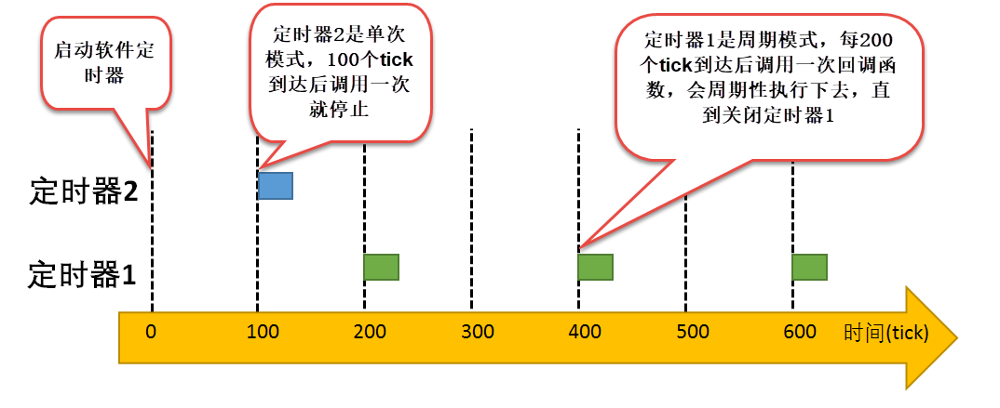
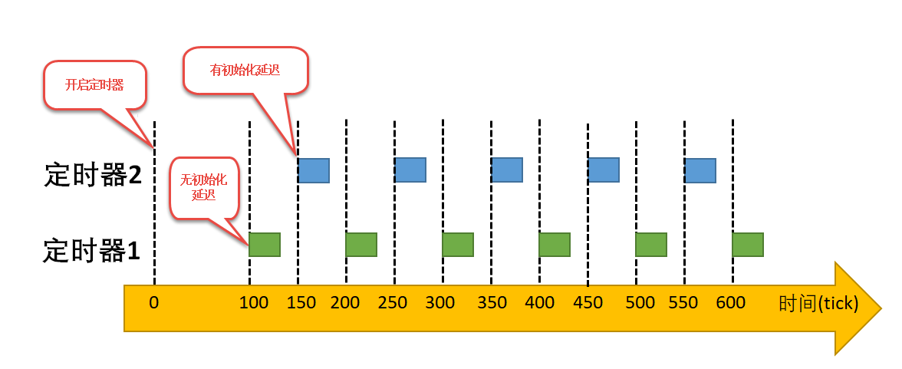
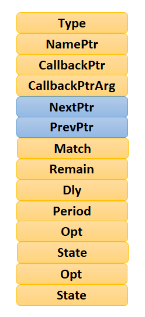
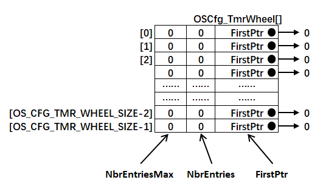
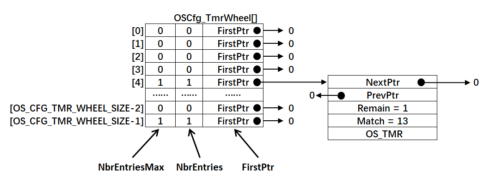
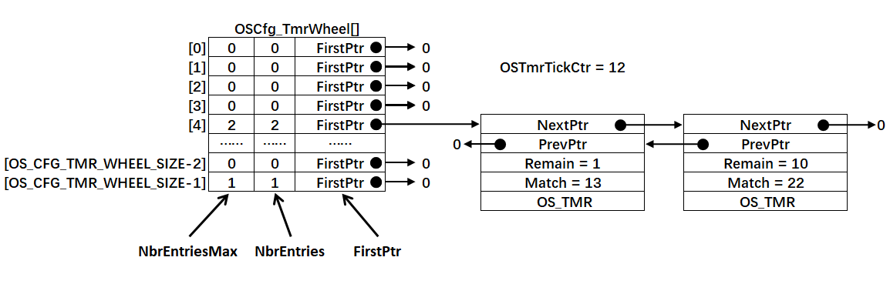
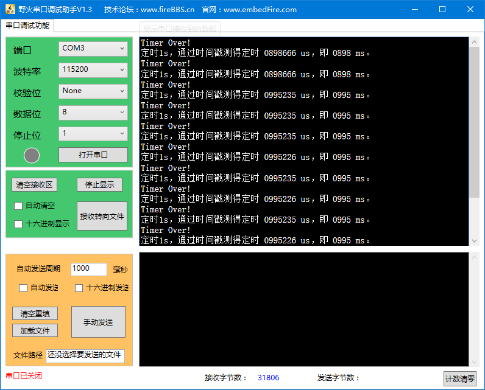

.. vim: syntax=rst

软件定时器
============

软件定时器的基本概念
~~~~~~~~~~~~~~~~~~~~~~~~~~~~~~

定时器，是指从指定的时刻开始，经过一个指定时间，然后触发一个超时事件，用户可以自定义定时器的周期与频率。类似生活中的闹钟，
我们可以设置闹钟每天什么时候响，还能设置响的次数，是响一次还是每天都响。

定时器有硬件定时器和软件定时器之分：

硬件定时器是芯片本身提供的定时功能。一般是由外部晶振提供给芯片输入时钟，芯片向软件模块提供一组配置寄存器，接受控制输入，
到达设定时间值后芯片中断控制器产生时钟中断。硬件定时器的精度一般很高，可以达到纳秒级别，并且是中断触发方式。

软件定时器，软件定时器是由操作系统提供的一类系统接口，它构建在硬件定时器基础之上，
使系统能够提供不受硬件定时器资源限制的定时器服务，它实现的功能与硬件定时器也是类似的。

使用硬件定时器时，每次在定时时间到达之后就会自动触发一个中断，用户在中断中处理信息；而使用软件定时器时，
需要我们在创建软件定时器时指定时间到达后要调用的函数（也称超时函数/回调函数，为了统一，下文均用回调函数描述），在回调函数中处理信息。

注意：软件定时器回调函数的上下文是任务，下文所说的定时器均为软件定时器。

软件定时器在被创建之后，当经过设定的时钟计数值后会触发用户定义的回调函数。定时精度与系统时钟的周期有关。
一般系统利用SysTick作为软件定时器的基础时钟，软件定时器的回调函数类似硬件的中断服务函数，所以，回调函数也要快进快出，
而且回调函数中不能有任何阻塞任务运行的情况（软件定时器回调函数的上下文环境是任务），比如OSTimeDly()以及其他能阻塞任务运行的函数，
两次触发回调函数的时间间隔period叫定时器的定时周期。

μC/OS操作系统提供软件定时器功能，软件定时器的使用相当于扩展了定时器的数量，允许创建更多的定时业务。μC/OS软件定时器功能上支持：

    -  裁剪：能通过宏关闭软件定时器功能。

    -  软件定时器创建。

    -  软件定时器启动。

    -  软件定时器停止。

    -  软件定时器删除。

μC/OS提供的软件定时器支持单次模式和周期模式，单次模式和周期模式的定时时间到之后都会调用软件定时器的回调函数，用户可以在回调函数中加入要执行的工程代码。

单次模式：当用户创建了定时器并启动了定时器后，定时时间到了，只执行一次回调函数之后就将不再重复执行，当然用户还是可以调用软件定时器启动函数OSTmrStart()来启动一次软件定时器。

周期模式：这个定时器会按照设置的定时时间循环执行回调函数，直到用户将定时器删除，具体见图 软件定时器的单次模式与周期模式_ 。

当然，μC/OS中软件定时器的周期模式也分为两种，一种是有初始化延迟的周期模式，另一种是无初始化延迟的周期模式，由OSTmrCreate()中的“dly”参数设置，
这两种周期模式基本是一致的，但是有个细微的差别。

有初始化延迟的周期模式：在软件定时器创建的时候，其第一个定时周期是由定时器中的dly参数决定，然后在运行完第一个周期后，其以后的定时周期均由period参数决定。

无初始化延迟的周期模式：该定时器从始至终都按照周期运行。

比如我们创建两个周期定时器，定时器1是无初始化延迟的定时器，周期为100个tick（时钟节拍），定时器2是有初始化延迟的定时器，
其初始化延迟的dly参数为150个tick，周期为100个tick，从tick为0的时刻就启动了两个软件定时器。定时器1从始至终都按照正常的周期运行，
但是定时器2则在第一个周期中的运行周期为dly，从第二个运行周期开始按照正常的100个tick来运行。其示意图具体见 两种周期模式运行示意图_ 。

μC/OS通过一个OS_TmrTask任务（也叫软件定时器任务）来管理软定时器，它是在系统初始化时（OSInit()函数中）自动创建的，
为了满足用户定时需求。TmrTask任务会在定时器节拍到来的时候检查定时器列表，看看是否有定时器时间到了，如果到了就调用其回调函数。
只有设置os_cfg.h中的宏定义OS_CFG_DBG_EN设置为1 ，才会将软件定时器相关代码编译进来，才能正常使用软件定时器相关功能。

软件定时器应用场景
~~~~~~~~~~~~~~~~~~~~~~~~~

在很多应用中，我们需要一些定时器任务，硬件定时器受硬件的限制，数量上不足以满足用户的实际需求，无法提供更多的定时器，
那么可以采用软件定时器来完成，由软件定时器代替硬件定时器任务。但需要注意的是软件定时器的精度是无法和硬件定时器相比的，
因为在软件定时器的定时过程中是极有可能被其他中断所打断，因为软件定时器的执行上下文环境是任务。所以，
软件定时器更适用于对时间精度要求不高的任务，一些辅助型的任务。

软件定时器的精度
~~~~~~~~~~~~~~~~~~~~~~~~

在操作系统中，通常软件定时器以系统节拍为计时的时基单位。系统节拍是系统的心跳节拍，表示系统时钟的频率，就类似人的心跳，
1s能跳动多少下，系统节拍配置为OS_CFG_TICK_RATE_HZ，该宏在os_app_cfg.h中有定义，默认是1000。
那么系统的时钟节拍周期就为1ms（1s跳动1000下，每一下就为1ms）。

μC/OS软件定时器的精度（分辨率）决定于系统时基频率，也就是变量OS_CFG_TMR_TASK_RATE_HZ的值，它是以 Hz为单位的。
如果软件定时器任务的频率（OS_CFG_TMR_TASK_RATE_HZ）设置为10Hz，系统中所有软件定时器的精度为十分之一秒。事实上，
这是用于软件定时器的推荐值，因为软件定时器常用于不精确时间尺度的任务。

注：为了书写简便，下文统一采用定时器表示软件定时器，如非同特别说明，本章所有的定时器均为软件定时器。

而且定时器所定时的数值必须是这个定时器任务精度的整数倍，例如，定时器任务的频率为10HZ，那么上层软件定时器定时数值只能是100ms，200ms，1000ms等，
而不能取值为150ms。由于系统节拍与软件定时器频率决定了系统中定时器能够分辨的精确度，用户可以根据实际CPU的处理能力和实时性需求设置合适的数值，
软件定时器频率的值越大，精度越高，但是系统开销也将越大，因为这代表在1秒中系统进入定时器任务的次数也就越多。

注意：定时器任务的频率OS_CFG_TMR_TASK_RATE_HZ的值不能大于系统时基频率OS_CFG_TMR_TASK_RATE_HZ的值。

软件定时器控制块
~~~~~~~~~~~~~~~~~~~~~~~~

本章先了解软件定时器的使用再讲解软件定时器的运作机制。

μC/OS的软件定时器也属于内核对象，是一个可以裁剪的功能模块，同样在系统中由一个控制块管理其相关信息，
软件定时器的控制块中包含创建的软件定时器基本信息，在使用定时器前我们需要通过OSTmrCreate()函数创建一个软件定时器，
但是在创建前需要我们定义一个定时器的句柄（控制块），下面来看看软件定时器控制块的成员变量，具体见 代码清单:定时器-1_ 。

.. code-block:: c
    :caption: 代码清单:定时器-1软件定时器控制块
    :name: 代码清单:定时器-1
    :linenos:

    struct  os_tmr
    {
        OS_OBJ_TYPE          Type;			(1)
        CPU_CHAR            *NamePtr;		(2)
        OS_TMR_CALLBACK_PTR  CallbackPtr;		(3)
        void                *CallbackPtrArg;	(4)
        OS_TMR              *NextPtr;		(5)
        OS_TMR              *PrevPtr;		(6)
        OS_TICK              Match;		(7)
        OS_TICK              Remain;		(8)
        OS_TICK              Dly;			(9)
        OS_TICK              Period;		(10)
        OS_OPT               Opt;			(11)
        OS_STATE             State;		(12)
    #if OS_CFG_DBG_EN > 0u
        OS_TMR              *DbgPrevPtr;
        OS_TMR              *DbgNextPtr;
    #endif
    };

-   代码清单:定时器-1_  **(1)**\ ：结构体开始于一个“Type”域，
    μC/OS可以通过这个域辨认它是个定时器（其他内核对象的结构体首部也有“Type”）。如果函数需传递一种内核对象，
    μC/OS会检测“Type”域是否为参数所需的类型。

-   代码清单:定时器-1_  **(2)**\ ：每个内核对象都可以被命名，以便于用户调试，这是一个指向内核对象名的指针。

-   代码清单:定时器-1_  **(3)**\ ：CallbackPtr是一个指向函数的指针，被指向的函数称作回调函数，
    当定时器定时时间到达后，其指向的回调函数将被调用。如果定时器创建时该指针值为NULL，回调函数将不会被调用。

-   代码清单:定时器-1_  **(4)**\ ：当回调函数需要接受一个参数时（CallbackPtr不为NULL），
    这个参数通过该指针传递给回调函数，简单来说就是指向回调函数中的形参。

-   代码清单:定时器-1_  **(5)**\ ：NextPtr 指针指向下一个定时器

-   代码清单:定时器-1_  **(6)**\ ： PrevPtr指针指向上一个定时器，与NextPtr指针联合工作将定时器链接成一个双向链表。

-   代码清单:定时器-1_  **(7)**\ ：当定时器管理器中的变量OSTmrTickCtr的值等于定时器中的Match值时，
    表示定时器时间到了，Match也被称为匹配时间（唤醒时间）。

-   代码清单:定时器-1_  **(8)**\ ：Remain中保存了距定时器定时时间到达还有多少个时基。

-   代码清单:定时器-1_  **(9)**\ ：Dly这个值包含了定时器的初次定时值（可以看作是第一次延迟的值），这个值以定时器时基为最小单位。

-   代码清单:定时器-1_  **(10)**\ ：Period是定时器的定时周期（当被设置为周期模式时）。这个值以定时器时基为最小单位。

-   代码清单:定时器-1_  **(11)**\ ：Opt是定时器的选项，可选参数。

-   代码清单:定时器-1_  **(12)**\ ：State记录定时器的状态。

软件定时器控制块示意图具体见 软件定时器控制块_  。

注意：即使了解 OS_TMR结构体的内容，用户也不允许直接访问这些内容，必须通过μC/OS提供的API进行访问。

软件定时器函数接口讲解
~~~~~~~~~~~~~~~~~~~~~~~~~~~~~~~

创建软件定时器函数OSTmrCreate()
^^^^^^^^^^^^^^^^^^^^^^^^^^^^^^^^

软件定时器也是内核对象，与消息队列、信号量等内核对象一样，都是需要创建之后才能使用的资源，我们在创建的时候需要指定定时器延时初始值dly、
定时器周期、定时器工作模式、回调函数等。每个软件定时器只需少许的RAM空间，理论上μC/OS支持无限多个软件定时器，只要RAM足够即可。

创建软件定时器函数OSTmrCreate()源码具体见 代码清单:定时器-3_ 。

.. code-block:: c
    :caption: 代码清单:定时器-3 OSTmrCreate()源码
    :name: 代码清单:定时器-3
    :linenos:

    void  OSTmrCreate (OS_TMR               *p_tmr,          //定时器控制块指针
            CPU_CHAR            *p_name,   //命名定时器，有助于调试
            OS_TICK             dly,            //初始定时节拍数
            OS_TICK             period,     //周期定时重载节拍数
            OS_OPT              opt,            //选项
            OS_TMR_CALLBACK_PTR  p_callback,  //定时到期时的回调函数
            void*p_callback_arg, //传给回调函数的参数
            OS_ERR  *p_err)          //返回错误类型
    {
        CPU_SR_ALLOC();
        //使用到临界段（在关/开中断时）时必须用到该宏，该宏声明和定义一个局部变
        //量，用于保存关中断前的 CPU 状态寄存器 SR（临界段关中断只需保存SR）
        //，开中断时将该值还原。

    #ifdef OS_SAFETY_CRITICAL//如果启用（默认禁用）了安全检测
        if (p_err == (OS_ERR *)0)           //如果错误类型实参为空
        {
            OS_SAFETY_CRITICAL_EXCEPTION(); //执行安全检测异常函数
            return;                         //返回，不执行定时操作
        }
    #endif

    #ifdef OS_SAFETY_CRITICAL_IEC61508//如果启用（默认禁用）了安全关键
        //如果是在调用 OSSafetyCriticalStart()后创建该定时器
        if (OSSafetyCriticalStartFlag == DEF_TRUE)
        {
            *p_err = OS_ERR_ILLEGAL_CREATE_RUN_TIME; //错误类型为“非法创建内核对象”
            return;                                  //返回，不执行定时操作
        }
    #endif

    #if OS_CFG_CALLED_FROM_ISR_CHK_EN > 0u
        //如果启用（默认启用）了中断中非法调用检测
        if (OSIntNestingCtr > (OS_NESTING_CTR)0)    //如果该函数是在中断中被调用
        {
            *p_err = OS_ERR_TMR_ISR;                 //错误类型为“在中断函数中定时”
            return;                                 //返回，不执行定时操作
        }
    #endif

    #if OS_CFG_ARG_CHK_EN > 0u//如果启用（默认启用）了参数检测
        if (p_tmr == (OS_TMR *)0)                       //如果参数 p_tmr 为空
        {
            *p_err = OS_ERR_OBJ_PTR_NULL;         //错误类型为“定时器对象为空”
            return;                                     //返回，不执行定时操作
        }

        switch (opt)                            //根据延时选项参数 opt 分类操作
        {
            case OS_OPT_TMR_PERIODIC:                   //如果选择周期性定时
            if (period == (OS_TICK)0)              //如果周期重载实参为0
            {
                *p_err = OS_ERR_TMR_INVALID_PERIOD; //错误类型为“周期重载实参无效”
                return;                            //返回，不执行定时操作
            }
            break;

            case OS_OPT_TMR_ONE_SHOT:                   //如果选择一次性定时
            if (dly == (OS_TICK)0)                 //如果定时初始实参为0
            {
                *p_err = OS_ERR_TMR_INVALID_DLY;    //错误类型为“定时初始实参无效”
                return;                            //返回，不执行定时操作
            }
            break;

            default:                                    //如果选项超出预期
            *p_err = OS_ERR_OPT_INVALID;            //错误类型为“选项非法”
            return;                                //返回，不执行定时操作
        }
    #endif

        OS_CRITICAL_ENTER();         //进入临界段,初始化定时器指标
        p_tmr->State          = (OS_STATE           )OS_TMR_STATE_STOPPED;
        p_tmr->Type           = (OS_OBJ_TYPE        )OS_OBJ_TYPE_TMR;
        p_tmr->NamePtr        = (CPU_CHAR          *)p_name;
        p_tmr->Dly            = (OS_TICK            )dly;
        p_tmr->Match          = (OS_TICK            )0;
        p_tmr->Remain         = (OS_TICK            )0;
        p_tmr->Period         = (OS_TICK            )period;
        p_tmr->Opt            = (OS_OPT             )opt;
        p_tmr->CallbackPtr    = (OS_TMR_CALLBACK_PTR)p_callback;
        p_tmr->CallbackPtrArg = (void              *)p_callback_arg;
        p_tmr->NextPtr        = (OS_TMR            *)0;
        p_tmr->PrevPtr        = (OS_TMR            *)0;

    #if OS_CFG_DBG_EN > 0u//如果启用（默认启用）了调试代码和变量
        OS_TmrDbgListAdd(p_tmr);     //将该定时添加到定时器双向调试链表
    #endif
        OSTmrQty++;                  //定时器个数加1

        OS_CRITICAL_EXIT_NO_SCHED(); //退出临界段（无调度）
        *p_err = OS_ERR_NONE;         //错误类型为“无错误”
    }

定时器创建函数比较简单，主要是根据用户指定的参数将定时器控制块进行相关初始化，并且定时器状态会被设置为OS_TMR_STATE_STOPPED，具体见源码注释即可。

该函数的使用也是很简单，具体见 代码清单:定时器-4_

.. code-block:: c
    :caption: 代码清单:定时器-4软件定时器创建函数OSTmrCreate()使用实例
    :name: 代码清单:定时器-4
    :linenos:

    OS_ERR      err;
    OS_TMR      my_tmr;   //声明软件定时器对象

    /* 创建软件定时器 */
    OSTmrCreate ((OS_TMR              *)&my_tmr,             //软件定时器对象
                (CPU_CHAR            *)"MySoftTimer",       //命名软件定时器
                (OS_TICK              )10,
                //定时器初始值，依10Hz时基计算，即为1s
                (OS_TICK              )10,
                //定时器周期重载值，依10Hz时基计算，即为1s
                (OS_OPT               )OS_OPT_TMR_PERIODIC, //周期性定时
                (OS_TMR_CALLBACK_PTR  )TmrCallback,         //回调函数
                (void                *)"Timer Over!",    //传递实参给回调函数
                (OS_ERR              *)err);                //返回错误类型

启动软件定时器函数OSTmrStart()
^^^^^^^^^^^^^^^^^^^^^^^^^^^^^^^^^

我们知道，在系统初始化的时候，系统会帮我们自动创建一个软件定时器任务，在这个任务中，如果暂时没有运行中的定时器，
任务会进入阻塞态等待定时器任务节拍的信号量。我们在创建一个软件定时器之后，如果没有启动它，该定时器就不会被添加到软件定时器列表中，
那么在定时器任务就不会运行该定时器，而OSTmrStart()函数就是将已经创建的软件定时器添加到定时器列表中，
这样子被创建的定时器就会被系统运行，其源码具体见 代码清单:定时器-5_ 。

.. code-block:: c
    :caption: 代码清单:定时器-5 OSTmrStart()源码
    :name: 代码清单:定时器-5
    :linenos:

    CPU_BOOLEAN  OSTmrStart (OS_TMR  *p_tmr,  (1)	//定时器控制块指针
                            OS_ERR  *p_err)  (2)	//返回错误类型
    {
        OS_ERR       err;
        CPU_BOOLEAN  success; //暂存函数执行结果

    #ifdef OS_SAFETY_CRITICAL//如果启用（默认禁用）了安全检测
        if (p_err == (OS_ERR *)0)           //如果错误类型实参为空
        {
            OS_SAFETY_CRITICAL_EXCEPTION(); //执行安全检测异常函数
            return (DEF_FALSE);             //返回 DEF_FALSE，不继续执行
        }
    #endif

    #if OS_CFG_CALLED_FROM_ISR_CHK_EN > 0u
        //如果启用（默认启用）了中断中非法调用检测
        if (OSIntNestingCtr > (OS_NESTING_CTR)0)   //如果该函数是在中断中被调用
        {
            *p_err = OS_ERR_TMR_ISR;                //错误类型为“在中断函数中定时”
            return (DEF_FALSE);                    //返回 DEF_FALSE，不继续执行
        }
    #endif

    #if OS_CFG_ARG_CHK_EN > 0u//如果启用（默认启用）了参数检测
        (p_tmr == (OS_TMR *)0)        //如果启用 p_tmr 的实参为空
        {
            *p_err = OS_ERR_TMR_INVALID;  //错误类型为“无效的定时器”
            return (DEF_FALSE);          //返回 DEF_FALSE，不继续执行
        }
    #endif

    #if OS_CFG_OBJ_TYPE_CHK_EN > 0u//如果启用（默认启用）了对象类型检测
        if (p_tmr->Type != OS_OBJ_TYPE_TMR)   //如果该定时器的对象类型有误
        {
            *p_err = OS_ERR_OBJ_TYPE;          //错误类型为“对象类型错误”
            return (DEF_FALSE);               //返回 DEF_FALSE，不继续执行
        }
    #endif

        OSSchedLock(&err);                           //锁住调度器
        switch (p_tmr->State)             (3)//根据定时器的状态分类处理
        {
            case OS_TMR_STATE_RUNNING:       //如果定时器正在运行，则重启
            OS_TmrUnlink(p_tmr);          (5)//从定时器列表里移除该定时器
            OS_TmrLink(p_tmr, OS_OPT_LINK_DLY);(4)//将该定时器重新插入定时器列表
            OSSchedUnlock(&err);                 //解锁调度器
            *p_err   = OS_ERR_NONE;               //错误类型为“无错误”
            success = DEF_TRUE;                  //执行结果暂为 DEF_TRUE
            break;

            case OS_TMR_STATE_STOPPED:                //如果定时器已被停止，则开启
            case OS_TMR_STATE_COMPLETED:      (6)//如果定时器已完成了，则开启
            OS_TmrLink(p_tmr, OS_OPT_LINK_DLY);  //将该定时器重新插入定时器列表
            OSSchedUnlock(&err);                 //解锁调度器
            *p_err   = OS_ERR_NONE;               //错误类型为“无错误”
            success = DEF_TRUE;                  //执行结果暂为 DEF_TRUE
            break;

            case OS_TMR_STATE_UNUSED:         (7)//如果定时器未被创建
            OSSchedUnlock(&err);                 //解锁调度器
            *p_err   = OS_ERR_TMR_INACTIVE;       //错误类型为“定时器未激活”
            success = DEF_FALSE;                 //执行结果暂为 DEF_FALSE
            break;

            default:                     (8)//如果定时器的状态超出预期
            OSSchedUnlock(&err);                 //解锁调度器
            *p_err = OS_ERR_TMR_INVALID_STATE;    //错误类型为“定时器无效”
            success = DEF_FALSE;                 //执行结果暂为 DEF_FALSE
            break;
        }
        return (success);                             //返回执行结果
    }

-   代码清单:定时器-5_  **(1)**\ ：定时器控制块指针，指向要启动的软件定时器。

-   代码清单:定时器-5_  **(2)**\ ：保存返回错误类型。

-   代码清单:定时器-5_  **(3)**\ ：锁住调度器，因为接下来的操作是需要操作定时器列表的，
    此时应该锁定调度器，不被其他任务打扰，然后根据定时器的状态分类处理。

注：源码中先看插入函数再看删除函数，代码清单:定时器-5_ **(4)**\ **(5)**\ 顺序在讲解中颠倒的。

-   代码清单:定时器-5_  **(4)**\ ：在然后移除之后需要将软件定时器重新按照周期插入定时器列表中，
    调用OS_TmrLink()函数即可将软件定时器插入定时器列表，其源码具体见 代码清单:定时器-6_ 。

.. code-block:: c
    :caption: 代码清单:定时器-6OS_TmrLink()源码
    :name: 代码清单:定时器-6
    :linenos:

    void  OS_TmrLink (OS_TMR  *p_tmr,  (1)	//定时器控制块指针
                    OS_OPT   opt)    (2)	//选项
    {
        OS_TMR_SPOKE     *p_spoke;
        OS_TMR           *p_tmr0;
        OS_TMR           *p_tmr1;
        OS_TMR_SPOKE_IX   spoke;

        //重置定时器为运行状态
        p_tmr->State = OS_TMR_STATE_RUNNING;

        if (opt == OS_OPT_LINK_PERIODIC)
        {
            //如果定时器是再次插入，匹配时间加个周期重载值
            p_tmr->Match = p_tmr->Period + OSTmrTickCtr;(3)
        }
        else
        {
            //如果定时器是首次插入
            if (p_tmr->Dly == (OS_TICK)0)
            {
                //如果定时器的 Dly = 0，匹配时间加个周期重载值
                p_tmr->Match = p_tmr->Period + OSTmrTickCtr;(4)
            }
            else
            {
                //如果定时器的 Dly != 0，匹配时间加个 Dly
                p_tmr->Match = p_tmr->Dly    + OSTmrTickCtr;(5)
            }
        }

        //通过哈希算法决定将该定时器插入定时器轮的哪个列表。
        spoke  = (OS_TMR_SPOKE_IX)(p_tmr->Match % OSCfg_TmrWheelSize);(6)
        p_spoke = &OSCfg_TmrWheel[spoke];

        if (p_spoke->FirstPtr ==  (OS_TMR *)0)(7)
        {
            //如果列表为空，直接将该定时器作为列表的第一个元素。
            p_tmr->NextPtr      = (OS_TMR *)0;
            p_tmr->PrevPtr      = (OS_TMR *)0;
            p_spoke->FirstPtr   = p_tmr;
            p_spoke->NbrEntries = 1u;
        }
        else
        {
            //如果列表非空，算出定时器 p_tmr 的剩余时间
            p_tmr->Remain  = p_tmr->Match - OSTmrTickCtr;	(8)
            //取列表的首个元素到 p_tmr1
            p_tmr1         = p_spoke->FirstPtr;	(9)
            while (p_tmr1 != (OS_TMR *)0)
            {
                //如果 p_tmr1 非空，算出 p_tmr1 的剩余时间
                p_tmr1->Remain = p_tmr1->Match
                                - OSTmrTickCtr;	(10)
                if (p_tmr->Remain > p_tmr1->Remain)
                {
                    //如果 p_tmr 的剩余时间大于 p_tmr1 的
                    if (p_tmr1->NextPtr  != (OS_TMR *)0)
                    {
                        //如果 p_tmr1后面非空，取p_tmr1后一个定时器为新的p_tmr1进行下一次循环
                        p_tmr1            = p_tmr1->NextPtr;(11)
                    }
                    else
                    {
                        //如果 p_tmr1 后面为空，将 p_tmr 插到 p_tmr1 的后面，结束循环
                        p_tmr->NextPtr    = (OS_TMR *)0;
                        p_tmr->PrevPtr    =  p_tmr1;
                        p_tmr1->NextPtr   =  p_tmr;
                        p_tmr1            = (OS_TMR *)0;	(12)
                    }
                }
                else
                {
                    //如果 p_tmr 的剩余时间不大于 p_tmr1 的，
                    if (p_tmr1->PrevPtr == (OS_TMR *)0)	(13)
                    {
                        //将 p_tmr 插入 p_tmr1 的前一个，结束循环。
                        p_tmr->PrevPtr    = (OS_TMR *)0;
                        p_tmr->NextPtr    = p_tmr1;
                        p_tmr1->PrevPtr   = p_tmr;
                        p_spoke->FirstPtr = p_tmr;
                    }
                    else
                    {
                        p_tmr0            = p_tmr1->PrevPtr;
                        p_tmr->PrevPtr    = p_tmr0;
                        p_tmr->NextPtr    = p_tmr1;
                        p_tmr0->NextPtr   = p_tmr;
                        p_tmr1->PrevPtr   = p_tmr;		(14)
                    }
                    p_tmr1 = (OS_TMR *)0;
                }
            }
            //列表元素成员数加1
            p_spoke->NbrEntries++;			(15)
        }
        if (p_spoke->NbrEntriesMax < p_spoke->NbrEntries)
        {
            //更新列表成员数最大值历史记录
            p_spoke->NbrEntriesMax = p_spoke->NbrEntries;(16)
        }
    }

-   代码清单:定时器-6_  **(1)**\ ：定时器控制块指针。

-   代码清单:定时器-6_  **(2)**\ ：插入定时器列表中的选项。

-   代码清单:定时器-6_  **(3)**\ ：重置定时器为运行状态，如果定时器是再次插入，
    肯定是周期性定时器，延时时间为 Period，定时器的匹配时间（唤醒时间）Match等于周期重载值Period加上当前的定时器计时时间。

-   代码清单:定时器-6_  **(4)**\ ：如果定时器是首次插入，
    如果定时器的延时时间 Dly 等于 0，定时器的匹配时间Match也等于周期重载值加上当前的定时器计时时间。

-   代码清单:定时器-6_  **(5)**\ ：而如果定时器的 Dly 不等于 0，定时器的匹配时间Match则等于Dly的值加上当前的定时器计时时间。

-   代码清单:定时器-6_  **(6)**\ ：通过哈希算法决定将该定时器插入定时器的哪个列表，
    这与第一部分讲解的时基列表很像。既然是哈希算法，开始插入的时候也要根据余数进行操作，
    根据软件定时器的到达时间（匹配时间或者称为唤醒时间也可以）对 OSCfg_TmrWheelSize
    的余数取出OSCfg_TmrWheel[OS_CFG_TMR_WHEEL_SIZE]中对应的定时器列表记录，然后将定时器插入对应的列表中。

-   代码清单:定时器-6_  **(7)**\ ：如果定时器列表为空，直接将该定时器作为列表的第一个元素。

-   代码清单:定时器-6_  **(8)**\ ：如果列表非空，算出定时器 p_tmr 的剩余时间，按照即将唤醒的时间插入定时器列表中。

-   代码清单:定时器-6_  **(9)**\ ：取列表的首个元素到 p_tmr1，遍历定时器列表。

-   代码清单:定时器-6_  **(10)**\ ：如果 p_tmr1 非空，算出 p_tmr1 的剩余时间，
    对比p_tmr与p_tmr1的时间，按照升序进行插入列表中。

-   代码清单:定时器-6_  **(11)**\ ：如果 p_tmr 的剩余时间大于 p_tmr1 的，
    取p_tmr1后一个定时器作为新的p_tmr1进行下一次循环，直到p_tmr找到合适的地方就插入定时器列表。

-   代码清单:定时器-6_  **(12)**\ ：如果 p_tmr1 后面为空，将 p_tmr
    插到 p_tmr1 的后面，结束循环。这些插入操作都是双向链表的插入操作，此处就不重复赘述。

-   代码清单:定时器-6_  **(13)**\ ：如果 p_tmr 的剩余时间不大于 p_tmr1 的，
    并且p_tmr1的前一个定时器为空，就直接将 p_tmr 插入 p_tmr1 的前一个位置，并且软件定时器列表的第一个定时器就是p_tmr。

-   代码清单:定时器-6_  **(14)**\ ：而如果的上一个不为空，将 p_tmr 插入 p_tmr1 的前一个位置。

-   代码清单:定时器-6_  **(15)**\ ：对应定时器列表元素成员数加1。

-   代码清单:定时器-6_  **(16)**\ ：更新列表成员数最大值历史记录。

软件定时器列表管理
^^^^^^^^^^^^^^^^^^^^^^^^^

有些情况下，当系统中有多个软件定时器的时候，μC/OS可能要维护上百个定时器。使用定时器列表会大大降低更新定时器列表所占用的CPU时间，
一个一个检测是否到期效率很低，有没有什么办法让系统快速查找到到期的软件定时器？μC/OS对软件定时器列表的管理就跟时间节拍一样，
采用哈希算法。OS_TmrLink将不同的定时器变量根据其对
OSCfg_TmrWheelSize余数的不同插入数组OSCfg_TmrWheel[OS_CFG_TMR_WHEEL_SIZE]中去，
μC/OS的软件定时器列表示意图具体见图 定时器列表_ 。

定时器列表中包含了OS_CFG_TMR_WHEEL_SIZE条记录，该值是一个宏定义，由用户指定，在os_cfg_app.h文件中。
能记录定时器的多少仅限于处理器的RAM 空间，推荐的设置值为定时器数 /4。
定时器列表的每个记录都由 3部分组成：NbrEntriesMax表明该记录中有多少个定时器；
NbrEntriesMax表明该记录中最大时存放了多少个定时器；FirstPtr指向当前记录的定时器链表。

可能这样子讲述的不够清晰，下面举个例子来讲述软件定时器采用哈希算法插入对应的定时器列表中的过程。

如图 插入一个定时器_ 所示，我们先假定此时的定时器列表是空的，设置的宏定义OS_CFG_TMR_WHEEL_SIZE为 9，
当前的OSTmrTickCtr为12。我们调用OSTmrStart()函数将定时器插入定时器列表。假定定时器创建时dly的值为1，
并且这个任务是单次定时模式。因为OSTmrTickCtr的值为12，定时器的定时值为1，那么在插入定时器列表的时候，
定时器的唤醒时间Match为13（Match = Dly+OSTmrTickCtr），经过哈希算法，得到spoke = 4，
该定时器会被放入定时器会被插入OSCfg_TmrWheel[4]列表中，因为当前定时器列表是空的，
OS_TMR会被放在队列中的首位置(OSCfg_TmrWheel[4]中成员变量FirstPtr将指向这个OS_TMR)，
并且索引4的计数值加一（OSCfg_TmrWheel[4]的成员变量NbrEntries为 1）。
定时器的匹配值Match被放在OS_TMR的Match成员变量中。
因为新插入的定时器是索引4的唯一一个定时器，所有定时器的NextPtr和PrevPtr都指向NULL（也就是0）。

如果系统此时再插入一个周期Period为10的定时器定时器，定时器的唤醒时间Match为22（Match = Period + OSTmrTickCtr），
那么经过哈希算法，得到spoke = 4，
该定时器会被放入定时器会被插入OSCfg_TmrWheel[4]列表中，但是由于OSCfg_TmrWheel[4]列表已有一个软件定时器，
那么第二个软件定时器会根据Remain的值按照升序进行插入操作，插入完成示意图具体见图 插入第二个定时器_ 。

-   代码清单:定时器-5_  **(5)**\ ：如果定时器正在运行，则重启，
    首先调用OS_TmrUnlink()函数将运行中的定时器从原本的定时器列表中移除，OS_TmrUnlink()源码具体见 代码清单:定时器-7_ 。

.. code-block:: c
    :caption: 代码清单:定时器-7 OS_TmrUnlink()源码
    :name: 代码清单:定时器-7
    :linenos:

    void  OS_TmrUnlink (OS_TMR  *p_tmr)   	(1)	//定时器控制块指针
    {
        OS_TMR_SPOKE    *p_spoke;
        OS_TMR          *p_tmr1;
        OS_TMR          *p_tmr2;
        OS_TMR_SPOKE_IX  spoke;

        spoke   = (OS_TMR_SPOKE_IX)(p_tmr->Match % OSCfg_TmrWheelSize);
        //与插入时一样，通过哈希算法找出
        p_spoke = &OSCfg_TmrWheel[spoke];   	(2)
        //该定时器在定时器的哪个列表。

        if (p_spoke->FirstPtr == p_tmr)    (3)//如果 p_tmr 是列表的首个元素
        {
            //取 p_tmr 后一个元素为 p_tmr1(可能为空)
            p_tmr1            = (OS_TMR *)p_tmr->NextPtr;
            p_spoke->FirstPtr = (OS_TMR *)p_tmr1;         //表首改为 p_tmr1
            if (p_tmr1 != (OS_TMR *)0)                  //如果 p_tmr1 确定非空
            {
                p_tmr1->PrevPtr = (OS_TMR *)0;           //p_tmr1 的前面清空
            }
        }
        else(4)//如果 p_tmr不是列表的首个元素
        {
            //将 p_tmr 从列表移除，并将p_tmr前后的两个元素连接在一起.
            p_tmr1          = (OS_TMR *)p_tmr->PrevPtr;

            p_tmr2          = (OS_TMR *)p_tmr->NextPtr;
            p_tmr1->NextPtr = p_tmr2;
            if (p_tmr2 != (OS_TMR *)0)
            {
                p_tmr2->PrevPtr = (OS_TMR *)p_tmr1;
            }
        }
        p_tmr->State   = OS_TMR_STATE_STOPPED;   //复位 p_tmr 的指标
        p_tmr->NextPtr = (OS_TMR *)0;
        p_tmr->PrevPtr = (OS_TMR *)0;
        p_spoke->NbrEntries--;           (5)//列表元素成员减1
    }

-   代码清单:定时器-7_  **(1)**\ ：定时器控制块指针，指向要移除的定时器。

-   代码清单:定时器-7_  **(2)**\ ：与插入时一样，通过哈希算法找出该定时器在定时器的哪个列表。

-   代码清单:定时器-7_  **(3)**\ ：如果 p_tmr 是列表的首个元素，
    取 p_tmr 后一个元素为 p_tmr1(可能为空)，软件定时器列表头部的定时器改为 p_tmr1，如果 p_tmr1 确定非空，
    那就将p_tmr删除（p_tmr1的前一个定时器就是p_tmr）。

-   代码清单:定时器-7_  **(4)**\ ：如果 p_tmr不是列表的首个元素，那就将 p_tmr 从列表移除，
    并将p_tmr前后的两个元素连接在一起，这其实是双向链表的操作。

-   代码清单:定时器-7_  **(5)**\ ：清除定时器p_tmr 的相关信息，定时器列表元素成员减1。

-   代码清单:定时器-5_  **(6)**\ ：如果定时器已创建完成了，则开启即可，开启也是将定时器按照周期插入定时器列表中。

-   代码清单:定时器-5_  **(7)**\ ：如果定时器未被创建，那是不可能开启定时器的，
    使用会返回错误类型为“定时器未激活”的错误代码，用户需要先创建软件定时器再来开启。

-   代码清单:定时器-5_  **(8)**\ ：如果定时器的状态超出预期，返回错误类型为“定时器无效”的错误代码。

至此，软件定时器的启动函数就讲解完毕，我们在创建一个软件定时器后可以调用OSTmrStart()函数启动它，
软件定时器启动函数的使用实例具体见 代码清单:定时器-8_ 。

.. code-block:: c
    :caption: 代码清单:定时器-8OSTmrStart()使用实例
    :name: 代码清单:定时器-8
    :linenos:

    void  OS_TmrUnlink (OS_TMR  *p_tmr)   	(1)	//定时器控制块指针
    {
        OS_TMR_SPOKE    *p_spoke;
        OS_TMR          *p_tmr1;
        OS_TMR          *p_tmr2;
        OS_TMR_SPOKE_IX  spoke;

        spoke   = (OS_TMR_SPOKE_IX)(p_tmr->Match % OSCfg_TmrWheelSize);
        //与插入时一样，通过哈希算法找出
        p_spoke = &OSCfg_TmrWheel[spoke];   	(2)
        //该定时器在定时器的哪个列表。

        if (p_spoke->FirstPtr == p_tmr)    (3)//如果 p_tmr 是列表的首个元素
        {
            //取 p_tmr 后一个元素为 p_tmr1(可能为空)
            p_tmr1            = (OS_TMR *)p_tmr->NextPtr;
            p_spoke->FirstPtr = (OS_TMR *)p_tmr1;         //表首改为 p_tmr1
            if (p_tmr1 != (OS_TMR *)0)                  //如果 p_tmr1 确定非空
            {
                p_tmr1->PrevPtr = (OS_TMR *)0;           //p_tmr1 的前面清空
            }
        }
        else(4)//如果 p_tmr不是列表的首个元素
        {
        //将 p_tmr 从列表移除，并将p_tmr前后的两个元素连接在一起.
            p_tmr1          = (OS_TMR *)p_tmr->PrevPtr;

            p_tmr2          = (OS_TMR *)p_tmr->NextPtr;
            p_tmr1->NextPtr = p_tmr2;
            if (p_tmr2 != (OS_TMR *)0)
            {
                p_tmr2->PrevPtr = (OS_TMR *)p_tmr1;
            }
        }
        p_tmr->State   = OS_TMR_STATE_STOPPED;   //复位 p_tmr 的指标
        p_tmr->NextPtr = (OS_TMR *)0;
        p_tmr->PrevPtr = (OS_TMR *)0;
        p_spoke->NbrEntries--;           (5)//列表元素成员减1
    }

停止定时器函数OSTmrStop()
^^^^^^^^^^^^^^^^^^^^^^^^^

OSTmrStop()函数用于停止一个软件定时器。软件定时器被停掉之后可以调用OSTmrStart()函数重启，但是重启之后定时器是从头计时，
而不是接着上次停止的时刻继续计时。OSTmrStop()源码具体见 代码清单:定时器-9_ 。

.. code-block:: c
    :caption: 代码清单:定时器-9OSTmrStop()源码
    :name: 代码清单:定时器-9
    :linenos:

    CPU_BOOLEAN  OSTmrStop (OS_TMR  *p_tmr,       (1)//定时器控制块指针
                            OS_OPT   opt,        (2)//选项
    void    *p_callback_arg, (3)//传给回调函数的新参数
                            OS_ERR  *p_err)    (4)//返回错误类型
    {
        OS_TMR_CALLBACK_PTR  p_fnct;
        OS_ERR               err;
        CPU_BOOLEAN          success;  //暂存函数执行结果

    #ifdef OS_SAFETY_CRITICAL//如果启用（默认禁用）了安全检测
        if (p_err == (OS_ERR *)0)            //如果错误类型实参为空
        {
            OS_SAFETY_CRITICAL_EXCEPTION();  //执行安全检测异常函数
            return (DEF_FALSE);              //返回 DEF_FALSE，不继续执行
        }
    #endif

    #if OS_CFG_CALLED_FROM_ISR_CHK_EN > 0u
    //如果启用（默认启用）了中断中非法调用检测
        if (OSIntNestingCtr > (OS_NESTING_CTR)0)   //如果该函数是在中断中被调用
        {
            *p_err = OS_ERR_TMR_ISR;                //错误类型为“在中断函数中定时”
            return (DEF_FALSE);                    //返回 DEF_FALSE，不继续执行
        }
    #endif

    #if OS_CFG_ARG_CHK_EN > 0u//如果启用（默认启用）了参数检测
        if (p_tmr == (OS_TMR *)0)       //如果启用 p_tmr 的实参为空
        {
            *p_err = OS_ERR_TMR_INVALID; //错误类型为“无效的定时器”
            return (DEF_FALSE);         //返回 DEF_FALSE，不继续执行
        }
    #endif

    #if OS_CFG_OBJ_TYPE_CHK_EN > 0u//如果启用（默认启用）了对象类型检测
        if (p_tmr->Type != OS_OBJ_TYPE_TMR)    //如果该定时器的对象类型有误
        {
            *p_err = OS_ERR_OBJ_TYPE;           //错误类型为“对象类型错误”
            return (DEF_FALSE);                //返回 DEF_FALSE，不继续执行
        }
    #endif

        OSSchedLock(&err);                        //锁住调度器
        switch (p_tmr->State)		(5)
        {
            //根据定时器的状态分类处理
            case OS_TMR_STATE_RUNNING:		(6)
            //如果定时器正在运行
            OS_TmrUnlink(p_tmr);
            //从定时器轮列表里移除该定时器
            *p_err = OS_ERR_NONE;
            //错误类型为“无错误”
            switch (opt)
            {
                //根据选项分类处理
                case OS_OPT_TMR_CALLBACK:	(7)
                //执行回调函数，使用创建定时器时的实参
                p_fnct = p_tmr->CallbackPtr;
                //取定时器的回调函数
                if (p_fnct != (OS_TMR_CALLBACK_PTR)0)
                {
                    //如果回调函数存在
                    (*p_fnct)((void *)p_tmr, p_tmr->CallbackPtrArg);
                    //使用创建定时器时的实参执行回调函数
                }
                else
                {
                    //如果回调函数不存在
                    *p_err = OS_ERR_TMR_NO_CALLBACK;(8)
                    //错误类型为“定时器没有回调函数”
                }
                break;

                case OS_OPT_TMR_CALLBACK_ARG:		(9)
                //执行回调函数，使用 p_callback_arg 作为实参
                p_fnct = p_tmr->CallbackPtr;
                //取定时器的回调函数
                if (p_fnct != (OS_TMR_CALLBACK_PTR)0)
                {
                    //如果回调函数存在
                    (*p_fnct)((void *)p_tmr, p_callback_arg);
                    //使用 p_callback_arg 作为实参执行回调函数
                }
                else
                {
                    //如果回调函数不存在
                    *p_err = OS_ERR_TMR_NO_CALLBACK;
                    //错误类型为“定时器没有回调函数”
                }
                break;

                case OS_OPT_TMR_NONE:           //只需停掉定时器
                break;

                default:               (10)//情况超出预期
                OSSchedUnlock(&err);        //解锁调度器
                *p_err = OS_ERR_OPT_INVALID; //错误类型为“选项无效”
                return (DEF_FALSE);         //返回 DEF_FALSE，不继续执行
            }
            OSSchedUnlock(&err);
            success = DEF_TRUE;
            break;

            case OS_TMR_STATE_COMPLETED:	(11)
            //如果定时器已完成第一次定时
            case OS_TMR_STATE_STOPPED:
            //如果定时器已被停止
            OSSchedUnlock(&err);               //解锁调度器
            *p_err   = OS_ERR_TMR_STOPPED;      //错误类型为“定时器已被停止”
            success = DEF_TRUE;                //执行结果暂为 DEF_TRUE
            break;

            case OS_TMR_STATE_UNUSED:		(12)
            //如果该定时器未被创建过
            OSSchedUnlock(&err);               //解锁调度器
            *p_err   = OS_ERR_TMR_INACTIVE;     //错误类型为“定时器未激活”
            success = DEF_FALSE;               //执行结果暂为 DEF_FALSE
            break;

            default:                           (13)//如果定时器状态超出预期
            OSSchedUnlock(&err);               //解锁调度器
            *p_err   = OS_ERR_TMR_INVALID_STATE;//错误类型为“定时器状态非法”
            success = DEF_FALSE;               //执行结果暂为 DEF_FALSE
            break;
        }
        return (success);                           //返回执行结果
    }

-   代码清单:定时器-9_  **(1)**\ ：定时器控制块指针，指向要停止的定时器。

-   代码清单:定时器-9_  **(2)**\ ：停止的选项。

-   代码清单:定时器-9_  **(3)**\ ：传给回调函数的新参数。

-   代码清单:定时器-9_  **(4)**\ ：保存返回的错误类型。

-   代码清单:定时器-9_  **(5)**\ ：锁定调度器，然后根据定时器的状态分类处理。

-   代码清单:定时器-9_  **(6)**\ ：如果定时器正在运行，那么就调用OS_TmrUnlink()函数将该定时器从定时器列表中移除。

-   代码清单:定时器-9_  **(7)**\ ：根据选项分类处理，如果需要执行回调函数，
    并且使用创建定时器时的实参，那就取定时器的回调函数，如果回调函数存在，就根据创建定时器指定的实参执行回调函数。

-   代码清单:定时器-9_  **(8)**\ ：如果回调函数不存在，返回错误类型为“定时器没有回调函数”的错误代码。

-   代码清单:定时器-9_  **(9)**\ ：如果需要执行回调函数，但是却是使用 p_callback_arg 作为实参，
    先取定时器的回调函数，如果回调函数存在就将p_callback_arg 作为实参传递进去并且执行回调函数，
    否则就返回错误类型为“定时器没有回调函数”的错误代码。

-   代码清单:定时器-9_  **(10)**\ ：如果情况超出预期，返回错误类型为“选项无效”的错误代码。

-   代码清单:定时器-9_  **(11)**\ ：如果定时器已完成第一次定时或者如果定时器已被停止，返回错误类型为“定时器已被停止”的错误代码。

-   代码清单:定时器-9_  **(12)**\ ：如果该定时器未被创建过，返回错误类型为“定时器未激活”的错误代码。

-   代码清单:定时器-9_  **(13)**\ ：如果定时器状态超出预期，返回错误类型为“定时器状态非法”的错误代码。

软件定时器停止函数的使用很简单，在使用该函数前请确认定时器已经开启，停止后的软件定时器可以通过调用定时器启动函数来重新启动，
OSTmrStop()函数的使用实例具体见 代码清单:定时器-10_ 。

.. code-block:: c
    :caption: 代码清单:定时器-10 OSTmrStop()使用实例
    :name: 代码清单:定时器-10
    :linenos:

    OS_ERR      err;
    OS_TMR      my_tmr;   //声明软件定时器对象
    OSTmrStop ((OS_TMR   *)&my_tmr,          //定时器控制块指针
            (OS_OPT     )OS_OPT_TMR_NONE,  //选项
            (void      *)"Timer Over!", //传给回调函数的新参数
            (OS_ERR    *)err);          //返回错误类型

删除软件定时器函数OSTmrDel()
^^^^^^^^^^^^^^^^^^^^^^^^^^^^^^^^^

OSTmrDel()用于删除一个已经被创建成功的软件定时器，删除之后就无法使用该定时器，并且定时器相应的信息也会被系清空。
要想使用OSTmrDel()函数必须在头文件os_cfg.h中把宏OS_CFG_TMR_DEL_EN定义为1，该函数的源码具体见 代码清单:定时器-11_ 。

.. code-block:: c
    :caption: 代码清单:定时器-11OSTmrDel()源码
    :name: 代码清单:定时器-11
    :linenos:

    #if OS_CFG_TMR_DEL_EN > 0u//如果启用了 OSTmrDel() 函数
    CPU_BOOLEAN  OSTmrDel (OS_TMR  *p_tmr, 	(1)	//定时器控制块指针
                        OS_ERR  *p_err) 	(2)	//返回错误类型
    {
        OS_ERR       err;
        CPU_BOOLEAN  success;  //暂存函数执行结果

    #ifdef OS_SAFETY_CRITICAL//如果启用（默认禁用）了安全检测
        if (p_err == (OS_ERR *)0)           //如果错误类型实参为空
        {
            OS_SAFETY_CRITICAL_EXCEPTION(); //执行安全检测异常函数
            return (DEF_FALSE);             //返回 DEF_FALSE，不继续执行
        }
    #endif

    #if OS_CFG_CALLED_FROM_ISR_CHK_EN > 0u
    //如果启用（默认启用）了中断中非法调用检测
        if (OSIntNestingCtr > (OS_NESTING_CTR)0)    //如果该函数是在中断中被调用
        {
            *p_err  = OS_ERR_TMR_ISR;                //错误类型为“在中断函数中定时”
            return (DEF_FALSE);                     //返回 DEF_FALSE，不继续执行
        }
    #endif

    #if OS_CFG_ARG_CHK_EN > 0u//如果启用（默认启用）了参数检测
        if (p_tmr == (OS_TMR *)0)       //如果启用 p_tmr 的实参为空
        {
            *p_err = OS_ERR_TMR_INVALID; //错误类型为“无效的定时器”
            return (DEF_FALSE);         //返回 DEF_FALSE，不继续执行
        }
    #endif

    #if OS_CFG_OBJ_TYPE_CHK_EN > 0u//如果启用（默认启用）了对象类型检测
        if (p_tmr->Type != OS_OBJ_TYPE_TMR)    //如果该定时器的对象类型有误
        {
            *p_err = OS_ERR_OBJ_TYPE;           //错误类型为“对象类型错误”
            return (DEF_FALSE);                //返回 DEF_FALSE，不继续执行
        }
    #endif

        OSSchedLock(&err);          //锁住调度器
    #if OS_CFG_DBG_EN > 0u//如果启用（默认启用）了调试代码和变量
        OS_TmrDbgListRemove(p_tmr); //将该定时从定时器双向调试链表移除
    #endif
        OSTmrQty--;              		(3)	//定时器个数减1

        switch (p_tmr->State)                         //根据定时器的状态分类处理
        {
            case OS_TMR_STATE_RUNNING:                //如果定时器正在运行
            OS_TmrUnlink(p_tmr);        (4)//从当前定时器列表列表移除定时器
            OS_TmrClr(p_tmr);           (5)//复位定时器的指标
            OSSchedUnlock(&err);                 //解锁调度器
            *p_err   = OS_ERR_NONE;               //错误类型为“无错误”
            success = DEF_TRUE;                  //执行结果暂为 DEF_TRUE
            break;

            case OS_TMR_STATE_STOPPED:                //如果定时器已被停止
            case OS_TMR_STATE_COMPLETED:              //如果定时器已完成第一次定时
            OS_TmrClr(p_tmr);                    //复位定时器的指标
            OSSchedUnlock(&err);                 //解锁调度器
            *p_err   = OS_ERR_NONE;               //错误类型为“无错误”
            success = DEF_TRUE;                  //执行结果暂为 DEF_TRUE
            break;

            case OS_TMR_STATE_UNUSED:                 //如果定时器已被删除
            OSSchedUnlock(&err);                 //解锁调度器
            *p_err   = OS_ERR_TMR_INACTIVE;       //错误类型为“定时器未激活”
            success = DEF_FALSE;                 //执行结果暂为 DEF_FALSE
            break;

            default:                                  //如果定时器的状态超出预期
            OSSchedUnlock(&err);                 //解锁调度器
            *p_err   = OS_ERR_TMR_INVALID_STATE;  //错误类型为“定时器无效”
            success = DEF_FALSE;                 //执行结果暂为 DEF_FALSE
            break;
        }
        return (success);                             //返回执行结果
    }
    #endif

-   代码清单:定时器-11_  **(1)**\ ：定时器控制块指针，指向要删除的软件定时器。

-   代码清单:定时器-11_  **(2)**\ ：用于保存返回的错误类型。

-   代码清单:定时器-11_  **(3)**\ ：如果程序能执行到这里，说明能正常删除软件定时器，将系统的软件定时器个数减一。

-   代码清单:定时器-11_  **(4)**\ ：调用OS_TmrUnlink()函数从当前定时器列表移除定时器。

-   代码清单:定时器-11_  **(5)**\ ：OS_TmrClr()清除软件定时器控制块的相关信息，表示定时器删除完成。

软件定时器的删除函数使用很简单，具体见 代码清单:定时器-12_

.. code-block:: c
    :caption: 代码清单:定时器-12软件定时器删除函数OSTmrDel()使用实例
    :name: 代码清单:定时器-12
    :linenos:

    OS_ERR      err;
    OS_TMR      my_tmr;   //声明软件定时器对象

    OSTmrDel ((OS_TMR   *)&my_tmr, //软件定时器对象
    (OS_ERR   *)err);    //返回错误类型

本章讲解了那么多，是不是还是不知道软件定时器是怎么运作的，别担心，下面我们就来看看软件定时器是怎么运作的。

软件定时器任务
~~~~~~~~~~~~~~~~~~~

我们知道，软件定时器的回调函数的上下文是在任务中，所有，系统中必须要一个任务来管理所有的软件定时器，
等到定时时间到达后就调用定时器对应的回调函数，那么软件定时器任务又是一个什么东西呢，它是在系统初始化的时候系统就帮我们创建的一个任务，
具体见 代码清单:定时器-13_ 加粗部分。

.. code-block:: c
    :caption: 代码清单:定时器-13创建软件定时器任务。
    :emphasize-lines: 59-71
    :name: 代码清单:定时器-13
    :linenos:

    void  OS_TmrInit (OS_ERR  *p_err)
    {
        OS_TMR_SPOKE_IX   i;
        OS_TMR_SPOKE     *p_spoke;

    #ifdef OS_SAFETY_CRITICAL
        if (p_err == (OS_ERR *)0)
        {
            OS_SAFETY_CRITICAL_EXCEPTION();
            return;
        }
    #endif

    #if OS_CFG_DBG_EN > 0u
        OSTmrDbgListPtr = (OS_TMR *)0;
    #endif

        if (OSCfg_TmrTaskRate_Hz > (OS_RATE_HZ)0)		(1)
        {
            OSTmrUpdateCnt = OSCfg_TickRate_Hz / OSCfg_TmrTaskRate_Hz;
        }
        else						(2)
        {
            OSTmrUpdateCnt = OSCfg_TickRate_Hz / (OS_RATE_HZ)10;
        }
        OSTmrUpdateCtr   = OSTmrUpdateCnt;

        OSTmrTickCtr     = (OS_TICK)0;

        OSTmrTaskTimeMax = (CPU_TS)0;

        for (i = 0u; i < OSCfg_TmrWheelSize; i++)		(3)
        {
            p_spoke                = &OSCfg_TmrWheel[i];
            p_spoke->NbrEntries    = (OS_OBJ_QTY)0;
            p_spoke->NbrEntriesMax = (OS_OBJ_QTY)0;
            p_spoke->FirstPtr      = (OS_TMR   *)0;
        }

    /* ---------------- CREATE THE TIMER TASK --------------- */
        if (OSCfg_TmrTaskStkBasePtr == (CPU_STK*)0)
        {
            *p_err = OS_ERR_TMR_STK_INVALID;
            return;
        }

        if (OSCfg_TmrTaskStkSize < OSCfg_StkSizeMin)
        {
            *p_err = OS_ERR_TMR_STK_SIZE_INVALID;
            return;
        }

        if (OSCfg_TmrTaskPrio >= (OS_CFG_PRIO_MAX - 1u))
        {
            *p_err = OS_ERR_TMR_PRIO_INVALID;
            return;
        }

        OSTaskCreate((OS_TCB     *)&OSTmrTaskTCB,
                    (CPU_CHAR   *)((void *)"μC/OS-III Timer Task"),
                    (OS_TASK_PTR )OS_TmrTask,
                    (void       *)0,
                    (OS_PRIO     )OSCfg_TmrTaskPrio,
                    (CPU_STK    *)OSCfg_TmrTaskStkBasePtr,
                    (CPU_STK_SIZE)OSCfg_TmrTaskStkLimit,
                    (CPU_STK_SIZE)OSCfg_TmrTaskStkSize,
                    (OS_MSG_QTY  )0,
                    (OS_TICK     )0,
                    (void       *)0,
                    (OS_OPT)(OS_OPT_TASK_STK_CHK | OS_OPT_TASK_STK_CLR|OS_OPT_TASK_NO_TLS),
                    (OS_ERR     *)p_err);			(4)
    }

-   代码清单:定时器-13_  **(1)**\ ：正常来说定时器任务的执行频率OSCfg_TmrTaskRate_Hz 是大于 0 的，
    并且能被 OSCfg_TickRate_Hz 整除，才能比较准确得到定时器任务运行的频率。
    如果OSCfg_TmrTaskRate_Hz设置为大于0，就配置定时器任务的频率。

-   代码清单:定时器-13_  **(2)**\ ：否则就配置为系统时钟频率的十分之一（1/10）。
    不过当设定的定时器的频率大于时钟节拍的执行频率的时候，定时器运行就会出错，但是这里没有进行判断，我们自己在写代码的时候注意一下即可。

我们举个例子，系统的OSCfg_TickRate_Hz 是 1000，OSCfg_TmrTaskRate_Hz 是 10，
那么计算得到OSTmrUpdateCnt 就是 100，开始的时候OSTmrUpdateCtr 是跟 OSTmrUpdateCnt 一样大的，
都是100，每当时钟节拍到来的时候OSTmrUpdateCtr 就减 1，减到 0 的话就运行定时器任务，
这样子就实现了从时间节拍中分频得到定时器任务频率。如果 OSCfg_TmrTaskRate_Hz 不能被 OSCfg_TickRate_Hz 整除，
比如 OSCfg_TickRate_Hz 设置为1000，OSCfg_TmrTaskRate_Hz 设置为 300，
这样子设置是想要定时器任务执行频率是 300Hz，
但是 OSTmrUpdateCnt 计算出来是 3，这样子定时器任务的执行频率大约就是 330Hz，定时的单位本来想设置为 3.3ms，
可实际运行的单位却是3ms，这样子肯定导致定时器不是很精确的，这些处理还是需要我们根据实际情况进行调整的。

-   代码清单:定时器-13_  **(3)**\ ：利用for循环初始化定时器列表。

-   代码清单:定时器-13_  **(4)**\ ：创建OS_TmrTask任务。

我们来看看定时器任务是在做什么事情，OS_TmrTask()源码具体见 代码清单:定时器-14_ 。

.. code-block:: c
    :caption: 代码清单:定时器-14 OS_TmrTask()源码
    :name: 代码清单:定时器-14
    :linenos:

    void  OS_TmrTask (void  *p_arg)
    {
        CPU_BOOLEAN          done;
        OS_ERR               err;
        OS_TMR_CALLBACK_PTR  p_fnct;
        OS_TMR_SPOKE        *p_spoke;
        OS_TMR              *p_tmr;
        OS_TMR              *p_tmr_next;
        OS_TMR_SPOKE_IX      spoke;
        CPU_TS               ts;
        CPU_TS               ts_start;
        CPU_TS               ts_end;

        p_arg = p_arg;/* Not using 'p_arg', prevent compiler warning */

        while (DEF_ON)
        {
            /* 等待信号指示更新定时器的时间*/
            (void)OSTaskSemPend((OS_TICK )0,
                                (OS_OPT  )OS_OPT_PEND_BLOCKING,
                                (CPU_TS *)&ts,
                                (OS_ERR *)&err);		(1)

            OSSchedLock(&err);
            ts_start = OS_TS_GET();
            /* 增加当前定时器时间*/
            OSTmrTickCtr++;				(2)

            /* 通过哈希算法找到对应时间唤醒的列表 */
            spoke    = (OS_TMR_SPOKE_IX)(OSTmrTickCtr % OSCfg_TmrWheelSize);
            p_spoke  = &OSCfg_TmrWheel[spoke];		(3)

            /* 获取列表头部的定时器 */
            p_tmr    = p_spoke->FirstPtr;			(4)

            done     = DEF_FALSE;
            while (done == DEF_FALSE)
            {

                if (p_tmr != (OS_TMR *)0)			(5)
                {
                    /*  指向下一个定时器以进行更新，
                    因为可能当前定时器到时了会从列表中移除 */
                    p_tmr_next = (OS_TMR *)p_tmr->NextPtr;

                    /* 确认是定时时间到达 */
                    if (OSTmrTickCtr == p_tmr->Match)	(6)
                    {
                        /* 先移除定时器 */
                        OS_TmrUnlink(p_tmr);

                        /* 如果是周期定时器 */
                        if (p_tmr->Opt == OS_OPT_TMR_PERIODIC)
                        {
                            /*  重新按照唤醒时间插入定时器列表 */
                            OS_TmrLink(p_tmr,
                            OS_OPT_LINK_PERIODIC);(7)
                        }
                        else
                        {
                            /* 定时器状态设置为已完成 */
                            p_tmr->State = OS_TMR_STATE_COMPLETED;(8)
                        }
                        /* 执行回调函数（如果可用）*/
                        p_fnct = p_tmr->CallbackPtr;
                        if (p_fnct != (OS_TMR_CALLBACK_PTR)0)
                        {
                            (*p_fnct)((void *)p_tmr,
                            p_tmr->CallbackPtrArg);	(9)
                        }
                        /* 看看下一个定时器是否匹配 */
                        p_tmr = p_tmr_next;			(10)
                    }
                    else
                    {
                        done  = DEF_TRUE;
                    }
                }
                else
                {
                    done = DEF_TRUE;
                }
            }
            /* 测量定时器任务的执行时间*/
            ts_end = OS_TS_GET() - ts_start;		(11)
            OSSchedUnlock(&err);
            if (OSTmrTaskTimeMax < ts_end)
            {
                OSTmrTaskTimeMax = ts_end;
            }
        }
    }

-   代码清单:定时器-14_  **(1)**\ ：调用OSTaskSemPend()函数在一直等待定时器节拍的信号量，
    等待到了才运行，那定时器节拍是怎么样运行的呢，系统的时钟节拍是基于SysTick定时器上的，μC/OS采用Tick任务（OS_TickTask）管理系统的时间节拍，
    而我们定时器节拍是由系统节拍分频而来，那么其发送信号量的地方当然也是在SysTick中断服务函数中，但是μC/OS支持采用中断延迟，如果使用了中断延迟，
    那么发送任务信号量的地方就会在中断发布任务中（OS_IntQTask），从代码中，我们可以看到当OSTmrUpdateCtr减到0的时候才会发送一次信号量，
    这也就是为什么我们的定时器节拍是基于系统时钟节拍分频而来的原因，具体见 代码清单:定时器-15_ 。

注意：此处的信号量获取是任务信号量而非内核对象的信号量，在后文会讲解这种任务信号量，此处就先了解即可，与系统内核对象信号量是作用是一样的。

.. code-block:: c
    :caption: 代码清单:定时器-15定时器任务的发送信号量位置
    :name: 代码清单:定时器-15
    :linenos:

    /***************************在SysTick中断服务函数中***********************/

    #if OS_CFG_TMR_EN > 0u
    //如果启用（默认启用）了软件定时器
    OSTmrUpdateCtr--;                                //软件定时器计数器自减
    if (OSTmrUpdateCtr == (OS_CTR)0u)                //如果软件定时器计数器减至0
    {
        OSTmrUpdateCtr = OSTmrUpdateCnt;             //重载软件定时器计数器
        //发送信号量给软件定时器任务OS_TmrTask()
        OSTaskSemPost((OS_TCB *)&OSTmrTaskTCB,
                    (OS_OPT  ) OS_OPT_POST_NONE,
                    (OS_ERR *)&err);
    }
    #endif

    /*********************在中断发布任务中**********************************/

    #if OS_CFG_TMR_EN > 0u
    OSTmrUpdateCtr--;
    if (OSTmrUpdateCtr == (OS_CTR)0u)
    {
        OSTmrUpdateCtr = OSTmrUpdateCnt;
        ts             = OS_TS_GET();         /* 获取时间戳 */
    /* 发送信号量给软件定时器任务OS_TmrTask()*/
    (void)OS_TaskSemPost((OS_TCB *)&OSTmrTaskTCB,
                            (OS_OPT  ) OS_OPT_POST_NONE,
                            (CPU_TS  ) ts,
                            (OS_ERR *)&err);
    }
    #endif

-   代码清单:定时器-14_  **(2)**\ ：当任务获取到信号量的时候，任务开始运行，增加当前定时器时间记录OSTmrTickCtr。

-   代码清单:定时器-14_  **(3)**\ ：通过哈希算法找到对应时间唤醒的列表，比如按照我们前面添加的定时器1与定时器2，
    具体见图 插入第二个定时器_ ，当OSTmrTickCtr到达13的时候，通过哈希算法的运算之后，
    我们能得到spoke等于4，这样子就直接找到我们插入的定时器列表了。

-   代码清单:定时器-14_  **(4)**\ ：获取列表头部的定时器。

-   代码清单:定时器-14_  **(5)**\ ：如果定时器列表中有定时器的话，
    就将p_tmr_next变量指向下一个定时器以准备进行更新，因为当前定时器可能到时了，就会从列表中移除。

-   代码清单:定时器-14_  **(6)**\ ：如果当前定时器时间（OSTmrTickCtr）与定时器中的匹配时间（Match）是一样的，
    那么确认是定时时间已经到达。

-   代码清单:定时器-14_  **(7)**\ ：不管三七二十一调用OS_TmrUnlink()函数移除定时器，
    如果该定时器是周期定时器，那么就调用OS_TmrLink()函数按照唤醒时间重新插入定时器列表。

-   代码清单:定时器-14_  **(8)**\ ：否则就是单次定时器，那么将定时器状态设置为定时已完成。

-   代码清单:定时器-14_  **(9)**\ ：如果回调函数存在，执行回调函数。

-   代码清单:定时器-14_  **(10)**\ ：看看下一个定时器的定时时间是否也到达了，如果是就需要唤醒。

-   代码清单:定时器-14_  **(11)**\ ：测量定时器任务的执行时间。

当定时器任务被执行，它首先递增 OSTmrTickCtr变量，然后通过哈希算法决定哪个定时器列表需被更新。
然后，如果这个定时器列表中存在定时器（FirstPtr不为NULL），
系统会检查定时器中的匹配时间Match是否与当前定时器时间OSTmrTickCtr相等，如果相等，这个定时器会被移出该定时器，
然后调用这个定时器的回调函数（假定这个定时器被创建时有回调函数），再根据定时器的工作模式决定是否重新插入定时器列表中。
然后遍历该定时器列表直到没有定时器的Match值与OSTmrTickCtr匹配。

注意：当定时器被唤醒后，定时器列表会被重新排序，定时器也不一定插入原本的定时器列表中。

OS_TmrTask()任务的大部分工作都是在锁调度器的状态下进行的。然而，因为定时器列表会被重新分配（依次排序），所以遍历这个定时器列表的时间会非常短的，也就是临界段会非常短的。

软件定时器实验
~~~~~~~~~~~~~~~~~~~

软件定时器实验是在μC/OS中创建了一个应用任务 AppTaskTmr，在该任务中创建一个软件定时器，
周期性定时 1s，每次定时完成切换 LED1 的亮灭状态，
并且打印时间戳的计时，检验定时的精准度，具体见 代码清单:定时器-16_ 。

.. code-block:: c
    :caption: 代码清单:定时器-16软件定时器实验
    :name: 代码清单:定时器-16
    :linenos:

    #include <includes.h>

    CPU_TS             ts_start;       //时间戳变量
    CPU_TS             ts_end;

    static  OS_TCB   AppTaskStartTCB;                            //任务控制块

    static  OS_TCB   AppTaskTmrTCB;

    static  CPU_STK  AppTaskStartStk[APP_TASK_START_STK_SIZE];       //任务栈

    static  CPU_STK  AppTaskTmrStk [ APP_TASK_TMR_STK_SIZE ];

    static  void  AppTaskStart  (void *p_arg);             //任务函数声明

    static  void  AppTaskTmr  ( void * p_arg );

    int  main (void)
    {
        OS_ERR  err;

        OSInit(&err);                 //初始化 μC/OS-III

        /* 创建起始任务 */
        OSTaskCreate((OS_TCB     *)&AppTaskStartTCB,
                    //任务控制块地址
                    (CPU_CHAR   *)"App Task Start",
                    //任务名称
                    (OS_TASK_PTR ) AppTaskStart,
                    //任务函数
                    (void       *) 0,
                    //传递给任务函数（形参p_arg）的实参
                    (OS_PRIO     ) APP_TASK_START_PRIO,
                    //任务的优先级
                    (CPU_STK    *)&AppTaskStartStk[0],
                    //任务栈的基地址
                    (CPU_STK_SIZE) APP_TASK_START_STK_SIZE / 10,
                    //任务栈空间剩下1/10时限制其增长
                    (CPU_STK_SIZE) APP_TASK_START_STK_SIZE,
                    //任务栈空间（单位：sizeof(CPU_STK)）
                    (OS_MSG_QTY  ) 5u,
                    //任务可接收的最大消息数
                    (OS_TICK     ) 0u,
                    //任务的时间片节拍数（0表默认值OSCfg_TickRate_Hz/10）
                    (void       *) 0,
                    //任务扩展（0表不扩展）
                    (OS_OPT      )(OS_OPT_TASK_STK_CHK | OS_OPT_TASK_STK_CLR),
                    //任务选项
                    (OS_ERR     *)&err);
                    //返回错误类型

        OSStart(&err);
        //启动多任务管理（交由μC/OS-III控制）

    }

    static  void  AppTaskStart (void *p_arg)
    {
        CPU_INT32U  cpu_clk_freq;
        CPU_INT32U  cnts;
        OS_ERR      err;

        (void)p_arg;
        //板级初始化
        BSP_Init();
        //初始化 CPU 组件（时间戳、关中断时间测量和主机名）
        CPU_Init();

        //获取 CPU 内核时钟频率（SysTick 工作时钟）
        cpu_clk_freq = BSP_CPU_ClkFreq();
        //根据用户设定的时钟节拍频率计算 SysTick 定时器的计数值
        cnts = cpu_clk_freq / (CPU_INT32U)OSCfg_TickRate_Hz;
        //调用 SysTick 初始化函数，设置定时器计数值和启动定时器
        OS_CPU_SysTickInit(cnts);

        //初始化内存管理组件（堆内存池和内存池表）
        Mem_Init();

    #if OS_CFG_STAT_TASK_EN > 0u
        OSStatTaskCPUUsageInit(&err);
    #endif

        CPU_IntDisMeasMaxCurReset();
        //复位（清零）当前最大关中断时间

        /* 创建 AppTaskTmr 任务 */
        OSTaskCreate((OS_TCB     *)&AppTaskTmrTCB,
                    //任务控制块地址
                    (CPU_CHAR   *)"App Task Tmr",
                    //任务名称
                    (OS_TASK_PTR ) AppTaskTmr,
                    //任务函数
                    (void       *) 0,
                    //传递给任务函数（形参p_arg）的实参
                    (OS_PRIO     ) APP_TASK_TMR_PRIO,
                    //任务的优先级
                    (CPU_STK    *)&AppTaskTmrStk[0],
                    //任务栈的基地址
                    (CPU_STK_SIZE) APP_TASK_TMR_STK_SIZE / 10,
                    //任务栈空间剩下1/10时限制其增长
                    (CPU_STK_SIZE) APP_TASK_TMR_STK_SIZE,
                    //任务栈空间（单位：sizeof(CPU_STK)）
                    (OS_MSG_QTY  ) 5u,
                    //任务可接收的最大消息数
                    (OS_TICK     ) 0u,
                    //任务的时间片节拍数（0表默认值OSCfg_TickRate_Hz/10）
                    (void       *) 0,
                    //任务扩展（0表不扩展）
                    (OS_OPT      )(OS_OPT_TASK_STK_CHK | OS_OPT_TASK_STK_CLR),
                    //任务选项
                    (OS_ERR     *)&err);
                    //返回错误类型

        OSTaskDel ( & AppTaskStartTCB, & err );
        //删除起始任务本身，该任务不再运行
    }

    //软件定时器MyTmr的回调函数
    void TmrCallback (OS_TMR *p_tmr, void *p_arg)
    {
        CPU_INT32U       cpu_clk_freq;
        //使用到临界段（在关/开中断时）时必须用到该宏，该宏声明和定义一

        //个局部变量，用于保存关中断前的 CPU 状态寄存器

        // SR（临界段关中断只需保存SR），开中断时将该值还原。
        CPU_SR_ALLOC();
        printf ( "%s", ( char * ) p_arg );

        cpu_clk_freq = BSP_CPU_ClkFreq();
        //获取CPU时钟，时间戳是以该时钟计数

        macLED1_TOGGLE ();

        ts_end = OS_TS_GET() - ts_start;
        //获取定时后的时间戳（以CPU时钟进行计数的一个计数值）

        //并计算定时时间。
        OS_CRITICAL_ENTER();
        //进入临界段，不希望下面串口打印遭到中断

        printf ( "\r\n定时1s，通过时间戳测得定时 %07d us，即 %04d ms。\r\n",
                ts_end / ( cpu_clk_freq / 1000000 ),     //将定时时间折算成 us
                ts_end / ( cpu_clk_freq / 1000 ) );      //将定时时间折算成 ms

        OS_CRITICAL_EXIT();

        ts_start = OS_TS_GET();                            //获取定时前时间戳

    }

    static  void  AppTaskTmr ( void * p_arg )
    {
        OS_ERR      err;
        OS_TMR      my_tmr;   //声明软件定时器对象

        (void)p_arg;

        /* 创建软件定时器 */
        OSTmrCreate ((OS_TMR              *)&my_tmr,        //软件定时器对象
                    (CPU_CHAR            *)"MySoftTimer",//命名软件定时器
                    (OS_TICK              )10,
                    //定时器初始值，依10Hz时基计算，即为1s
                    (OS_TICK              )10,
                    //定时器周期重载值，依10Hz时基计算，即为1s
                    (OS_OPT               )OS_OPT_TMR_PERIODIC, //周期性定时
                    (OS_TMR_CALLBACK_PTR  )TmrCallback,         //回调函数
                    (void                *)"Timer Over!",
                    //传递实参给回调函数
                    (OS_ERR              *)err);          //返回错误类型

        /* 启动软件定时器 */
        OSTmrStart ((OS_TMR   *)&my_tmr, //软件定时器对象
                    (OS_ERR   *)err);    //返回错误类型

        ts_start = OS_TS_GET();                       //获取定时前时间戳

        while (DEF_TRUE)
        //任务体，通常写成一个死循环
        {
            OSTimeDly ( 1000, OS_OPT_TIME_DLY, & err ); //不断阻塞该任务
        }

    }

软件定时器实验现象
~~~~~~~~~~~~~~~~~~~~~~~~~

程序编译好，用USB线连接计算机和开发板的USB接口（对应丝印为USB转串口），
用DAP仿真器把配套程序下载到野火STM32开发板（具体型号根据购买的板子而定，每个型号的板子都配套有对应的程序），在计算机上打开串口调试助手，
然后复位开发板就可以在调试助手中看到串口的打印信息，在串口调试助手中可以看到运行结果我们可以看到，每1S时间到的时候，
软件定时器就会触发一次回调函数，具体见图 软件定时器实验现象_ 。

总结
~~~~~~

从一开始的定时器相关函数的使用和分析到后面定时器运作机制的分析，想必大家对定时器整个运作有了更深的了解。定时器的创建、删除、启动、
停止这些操作无非就是在操作定时器列表的双向列表和根据不同的设置进行定时器状态的转化以及相关的处理。至于检测定时器到期，系统将时间节拍进行分频得到定时器任务执行的频率，
在定时器任务中，系统采用了哈希算法进行快速检测有没有定时器到期，然后执行其对应的回调函数等操作。
软件定时器最核心的一点是底层的一个硬件定时器（SysTick内核定时器）上进行软件分频，这也是μC/OS写的很好的一点，大家也可以学习它的这种编程思想。

μC/OS允许用户建立任意数量的定时器（只限制于处理器的RAM大小）。

回调函数是在定时器任务中被调用，所以回调函数的上下文环境是在任务中，并且运行回调函数时调度器处于被锁状态。一般我们编写的回调函数越简短越好，
并且不能在回调函数中等待消息队列、信号量、事件等操作，否则定时器任务会被挂起，导致定时器任务崩溃，这是绝对不允许的。

此外我们还需要注意几点：

    1. 回调函数是在定时器任务中被执行的，这意味着定时器任务需要有足够的栈空间供回调函数去执行。

    2. 回调函数是在根据定时器队列中依次存放的，所以在定时器时间到达后回调函数是依次被执行的。

    3. 定时器任务的执行时间决定于：有多少个定时器期满，执行定时器中的回调函数需多少时间。
       因为回调函数是由用户提供，它可能很大程度上影响了定时器任务的执行时间。

    4. 回调函数被执行时会锁调度器，所以我们必须让回调函数尽可能地短，以便其他任务能正常运行。

