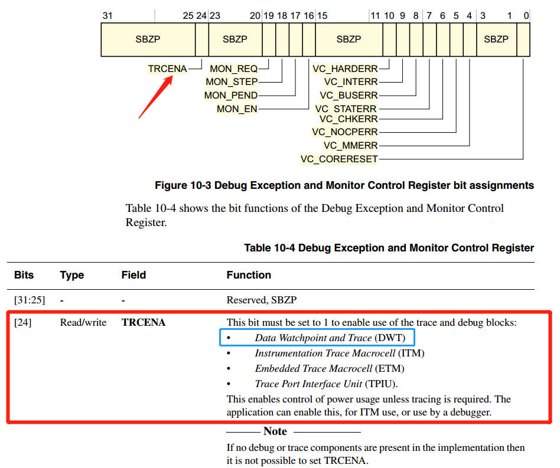
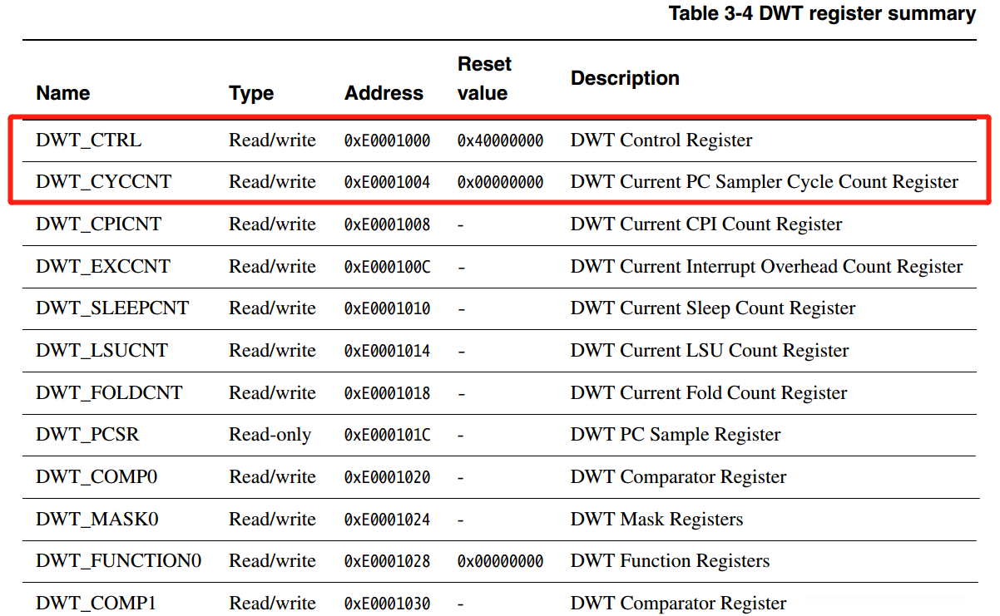
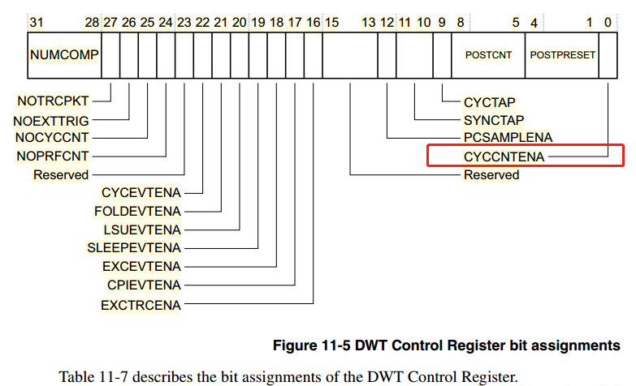

.. vim: syntax=rst

μC/OS-III的启动流程
====================

在目前的RTOS中，主要有两种比较流行的启动方式，暂时还没有看到第三种，接下来我将通过伪代码的方式来讲解下这两种启动方式的区别，
然后再具体分析下μC/OS的启动流程。

万事俱备，只欠东风
~~~~~~~~~~~~~~~~~~~~~~~~~~~

第一种我称之为万事俱备，只欠东风法。这种方法是在main()函数中将硬件初始化，RTOS系统初始化，所有任务的创建这些都弄好，
这个我称之为万事都已经准备好。最后只欠一道东风，即启动RTOS的调度器，开始多任务的调度，具体的伪代码实现见 代码清单:启动-1_ 。

.. code-block:: c
    :caption: 代码清单:启动-1万事俱备，只欠东风法伪代码实现
    :name: 代码清单:启动-1
    :linenos:

    int main (void)
    {
    /* 硬件初始化 */
        HardWare_Init();(1)

    /* RTOS 系统初始化 */
        RTOS_Init();(2)

    /* 创建任务1，但任务1不会执行，因为调度器还没有开启 */(3)
        RTOS_TaskCreate(Task1);
    /* 创建任务2，但任务2不会执行，因为调度器还没有开启 */
    RTOS_TaskCreate(Task2);

    /* ......继续创建各种任务 */

    /* 启动RTOS，开始调度 */
        RTOS_Start();(4)
    }

    voidTask1( void *arg )(5)
    {
    while (1)
        {
    /* 任务实体，必须有阻塞的情况出现 */
        }
    }

    voidTask1( void *arg )(6)
    {
    while (1)
        {
    /* 任务实体，必须有阻塞的情况出现 */
        }
    }

-   代码清单:启动-1_  **(1)**\ ：硬件初始化。硬件初始化这一步还属于裸机的范畴，我们可以把需要使用到的硬件都初始化好而且测试好，确保无误。

-   代码清单:启动-1_  **(2)**\ ：RTOS系统初始化。比如RTOS里面的全局变量的初始化，
    空闲任务的创建等。不同的RTOS，它们的初始化有细微的差别。

-   代码清单:启动-1_  **(3)**\ ：创建各种任务。这里把所有要用到的任务都创建好，但还不会进入调度，因为这个时候RTOS的调度器还没有开启。

-   代码清单:启动-1_  **(4)**\ ：启动RTOS调度器，开始任务调度。这个时候调度器就从刚刚创建好的任务中选择一个优先级最高的任务开始运行。

-   代码清单:启动-1_  **(5)(6)**\ ：任务实体通常是一个不带返回值的无限循环的C函数，函数体必须有阻塞的情况出现，
    不然任务（如果优先权恰好是最高）会一直在while循环里面执行，导致其他任务没有执行的机会。

小心翼翼，十分谨慎
~~~~~~~~~~~~~~~~~~~~~~~~~~~

第二种我称之为小心翼翼，十分谨慎法。这种方法是在main()函数中将硬件和RTOS系统先初始化好，然后创建一个启动任务后就启动调度器，
然后在启动任务里面创建各种应用任务，当所有任务都创建成功后，启动任务把自己删除，具体的伪代码实现见 代码清单:启动-2_ 。

.. code-block:: c
    :caption: 代码清单:启动-2小心翼翼，十分谨慎法伪代码实现
    :name: 代码清单:启动-2
    :linenos:

    int main (void)
    {
    /* 硬件初始化 */
        HardWare_Init();(1)

    /* RTOS 系统初始化 */
        RTOS_Init();(2)

    /* 创建一个任务 */
        RTOS_TaskCreate(AppTaskCreate);(3)

    /* 启动RTOS，开始调度 */
        RTOS_Start();(4)
    }

    /* 起始任务，在里面创建任务 */
    voidAppTaskCreate( void *arg )(5)
    {
    /* 创建任务1，然后执行 */
        RTOS_TaskCreate(Task1);(6)

    /* 当任务1阻塞时，继续创建任务2，然后执行 */
        RTOS_TaskCreate(Task2);

    /* ......继续创建各种任务 */

    /* 当任务创建完成，删除起始任务 */
        RTOS_TaskDelete(AppTaskCreate);(7)
    }

    void Task1( void *arg )(8)
    {
    while (1)
        {
    /* 任务实体，必须有阻塞的情况出现 */
        }
    }

    void Task2( void *arg )(9)
    {
    while (1)
        {
    /* 任务实体，必须有阻塞的情况出现 */
        }
    }

-   代码清单:启动-2_  **(1)**\ ：硬件初始化。来到硬件初始化这一步还属于裸机的范畴，
    我们可以把需要使用到的硬件都初始化好而且测试好，确保无误。

-   代码清单:启动-2_  **(2)**\ ：RTOS系统初始化。比如RTOS里面的全局变量的初始化，
    空闲任务的创建等。不同的RTOS，它们的初始化有细微的差别。

-   代码清单:启动-2_  **(3)**\ ：创建一个开始任务。然后在这个初始任务里面创建各种应用任务。

-   代码清单:启动-2_  **(4)**\ ：启动RTOS调度器，开始任务调度。这个时候调度器就去执行刚刚创建好的初始任务。

-   代码清单:启动-2_  **(5)**\ ：我们通常说任务是一个不带返回值的无限循环的C函数，
    但是因为初始任务的特殊性，它不能是无限循环的，只执行一次后就关闭。在初始任务里面我们创建我们需要的各种任务。

-   代码清单:启动-2_  **(6)**\ ：创建任务。每创建一个任务后它都将进入就绪态，系统会进行一次调度，
    如果新创建的任务的优先级比初始任务的优先级高的话，那将去执行新创建的任务，
    当新的任务阻塞时再回到初始任务被打断的地方继续执行。反之，则继续往下创建新的任务，直到所有任务创建完成。

-   代码清单:启动-2_  **(7)**\ ：各种应用任务创建完成后，初始任务自己关闭自己，使命完成。

-   代码清单:启动-2_  **(8)(9)**\ ：任务实体通常是一个不带返回值的无限循环的C函数，函数体必须有阻塞的情况出现，
    不然任务（如果优先权恰好是最高）会一直在while循环里面执行，其他任务没有执行的机会。

孰优孰劣
~~~~~~~~~~

那有关这两种方法孰优孰劣？我暂时没发现，我个人还是比较喜欢使用第二种。COS和LiteOS第一种和第二种都可以使用，
由用户选择，RT-Thread和FreeRTOS则默认使用第二种。接下来我们详细讲解下μC/OS的启动流程。

系统的启动
~~~~~~~~~~~

我们知道，在系统上电的时候第一个执行的是启动文件里面由汇编编写的复位函数Reset_Handler，
具体见 代码清单:启动-3_ 。复位函数的最后会调用C库函数__main，具体见 代码清单:启动-3_ 的加粗部分。
__main()函数的主要工作是初始化系统的堆和栈，最后调用C中的main()函数，从而去到C的世界。

.. code-block:: c
    :caption: 代码清单:启动-3Reset_Handler函数
    :name: 代码清单:启动-3
    :linenos:

    Reset_Handler   PROC
    EXPORT  Reset_Handler             [WEAK]
    IMPORT  __main
    IMPORT  SystemInit
    LDRR0, =SystemInit
                    BLX     R0
    LDRR0, =__main
                    BX      R0
    ENDP

系统初始化
^^^^^^^^^^^^^

在调用创建任务函数之前，我们必须要对系统进行一次初始化，而系统的初始化是根据我们配置宏定义进行初始化的，
有一些则是系统必要的初始化，如空闲任务，时钟节拍任务等，下面我们来看看系统初始化的源码，具体见 代码清单:启动-4_ 。

.. code-block:: c
    :caption: 代码清单:启动-4系统初始化（已删减）
    :name: 代码清单:启动-4
    :linenos:

    void  OSInit (OS_ERR  *p_err)
    {
        CPU_STK      *p_stk;
        CPU_STK_SIZE  size;

    if (p_err == (OS_ERR *)0) {
            OS_SAFETY_CRITICAL_EXCEPTION();
    return;
        }
    #endi
        OSInitHook();	/*初始化钩子函数相关的代码*/

        OSIntNestingCtr= (OS_NESTING_CTR)0; 	/*清除中断嵌套计数器*/

        OSRunning =  OS_STATE_OS_STOPPED; 	/*未启动多任务处理*/

        OSSchedLockNestingCtr = (OS_NESTING_CTR)0;/*清除锁定计数器*/

        OSTCBCurPtr= (OS_TCB *)0; 	/*将OS_TCB指针初始化为已知状态  */
        OSTCBHighRdyPtr = (OS_TCB *)0;

        OSPrioCur = (OS_PRIO)0; 		/*将优先级变量初始化为已知状态*/
        OSPrioHighRdy                   = (OS_PRIO)0;
        OSPrioSaved                     = (OS_PRIO)0;

    if (OSCfg_ISRStkSize > (CPU_STK_SIZE)0) {
            p_stk = OSCfg_ISRStkBasePtr; 	/*清除异常栈以进行栈检查*/
    if (p_stk != (CPU_STK *)0) {
                size  = OSCfg_ISRStkSize;
    while (size > (CPU_STK_SIZE)0) {
                    size--;
                    *p_stk = (CPU_STK)0;
                    p_stk++;
                }
            }
        }

        OS_PrioInit();	/*初始化优先级位图表*/

        OS_RdyListInit();	/*初始化就绪列表*/

        OS_TaskInit(p_err);   /*初始化任务管理器*/
    if (*p_err != OS_ERR_NONE) {
    return;
        }

        OS_IdleTaskInit(p_err);    /* 初始化空闲任务  */	(1)
    if (*p_err != OS_ERR_NONE) {
    return;
        }

        OS_TickTaskInit(p_err);   /* 初始化时钟节拍任务*/	(2)
    if (*p_err != OS_ERR_NONE) {
    return;
        }

        OSCfg_Init();
    }

在这个系统初始化中，我们主要看两个地方，一个是空闲任务的初始化，一个是时钟节拍任务的初始化，
这两个任务是必须存在的任务，否则系统无法正常运行。

空闲任务
''''''''''

-   代码清单:启动-4_  **(1)**\ ：其实初始化就是创建一个空闲任务，空闲任务的相关信息由系统默认指定，
    用户不能修改，OS_IdleTaskInit()源码具体见 代码清单:启动-5_ 。

.. code-block:: c
    :caption: 代码清单:启动-5 OS_IdleTaskInit()源码
    :name: 代码清单:启动-5
    :linenos:

    void  OS_IdleTaskInit (OS_ERR  *p_err)
    {
    #ifdef OS_SAFETY_CRITICAL
    if (p_err == (OS_ERR *)0) {
            OS_SAFETY_CRITICAL_EXCEPTION();
    return;
        }
    #endif

        OSIdleTaskCtr = (OS_IDLE_CTR)0;		(1)
    /* ---------------- CREATE THE IDLE TASK ---------------- */
        OSTaskCreate((OS_TCB     *)&OSIdleTaskTCB,
                    (CPU_CHAR   *)((void *)"μC/OS-III Idle Task"),
                    (OS_TASK_PTR)OS_IdleTask,
                    (void       *)0,
                    (OS_PRIO     )(OS_CFG_PRIO_MAX - 1u),
                    (CPU_STK    *)OSCfg_IdleTaskStkBasePtr,
                    (CPU_STK_SIZE)OSCfg_IdleTaskStkLimit,
                    (CPU_STK_SIZE)OSCfg_IdleTaskStkSize,
                    (OS_MSG_QTY  )0u,
                    (OS_TICK     )0u,
                    (void       *)0,
    (OS_OPT)(OS_OPT_TASK_STK_CHK | OS_OPT_TASK_STK_CLR |OS_OPT_TASK_NO_TLS),
                    (OS_ERR     *)p_err);		(2)
    }

-   代码清单:启动-5_  **(1)**\ ：OSIdleTaskCtr在os.h头文件中定义，是一个32位无符号整型变量，
    该变量的作用是用于统计空闲任务的运行的，怎么统计呢，我们在空闲任务中讲解。现在初始化空闲任务，系统就将OSIdleTaskCtr清零。

-   代码清单:启动-5_  **(2)**\ ：我们可以很容易看到系统只是调用了OSTaskCreate()函数来创建一个任务，这个任务就是空闲任务，
    任务优先级为OS_CFG_PRIO_MAX-1，OS_CFG_PRIO_MAX是一个宏，该宏定义表示μC/OS的任务优先级数值的最大值，我们知道，
    在μC/OS系统中，任务的优先级数值越大，表示任务的优先级越低，所以空闲任务的优先级是最低的。
    空闲任务栈大小为OSCfg_IdleTaskStkSize，它也是一个宏，在os_cfg_app.c文件中定义，默认为128，
    则空闲任务栈默认为128*4=512字节。

空闲任务其实就是一个函数，其函数入口是OS_IdleTask，源码具体见 代码清单:启动-6_ 。

.. code-block:: c
    :caption: 代码清单:启动-6 OS_IdleTask()源码
    :name: 代码清单:启动-6
    :linenos:

    void  OS_IdleTask (void  *p_arg)
    {
        CPU_SR_ALLOC();

        /* Prevent compiler warning for not using 'p_arg'*/
        p_arg = p_arg;

    while (DEF_ON) {
            CPU_CRITICAL_ENTER();
            OSIdleTaskCtr++;
    #if OS_CFG_STAT_TASK_EN > 0u
            OSStatTaskCtr++;
    #endif
            CPU_CRITICAL_EXIT();
        /* Call user definable HOOK */
            OSIdleTaskHook();
        }
    }

空闲任务的作用还是很大的，它是一个无限的死循环，因为其优先级是最低的，所以任何优先级比它高的任务都能抢占它从而取得CPU的使用权，
为什么系统要空闲任务呢？因为CPU是不会停下来的，即使啥也不干，CPU也不会停下来，此时系统就必须保证有一个随时处于就绪态的任务，
而且这个任务不会抢占其他任务，当且仅当系统的其他任务处于阻塞中，系统才会运行空闲任务，这个任务可以做很多事情，任务统计，
钩入用户自定义的钩子函数实现用户自定义的功能等，但是需要注意的是，在钩子函数中用户不允许调用任何可以使空闲任务阻塞的函数接口，
空闲任务是不允许被阻塞的。

-   代码清单:启动-4_  **(2)**\ ：同样的，OS_TickTaskInit()函数也是创建一个时钟节拍任务，具体见 代码清单:启动-7_ 。

.. code-block:: c
    :caption: 代码清单:启动-7 OS_TickTaskInit()源码
    :name: 代码清单:启动-7
    :linenos:

    void  OS_TickTaskInit (OS_ERR  *p_err)
    {
    #ifdef OS_SAFETY_CRITICAL
    if (p_err == (OS_ERR *)0) {
            OS_SAFETY_CRITICAL_EXCEPTION();
    return;
        }
    #endif

        OSTickCtr         = (OS_TICK)0u; /* Clear the tick counter   */

        OSTickTaskTimeMax = (CPU_TS)0u;

        OS_TickListInit();/* Initialize the tick list data structures  */

    /* ---------------- CREATE THE TICK TASK ---------------- */
    if (OSCfg_TickTaskStkBasePtr == (CPU_STK *)0) {
            *p_err = OS_ERR_TICK_STK_INVALID;
    return;
        }

    if (OSCfg_TickTaskStkSize < OSCfg_StkSizeMin) {
            *p_err = OS_ERR_TICK_STK_SIZE_INVALID;
    return;
        }
        /* Only one task at the 'Idle Task' priority              */
    if (OSCfg_TickTaskPrio >= (OS_CFG_PRIO_MAX - 1u)) {
            *p_err = OS_ERR_TICK_PRIO_INVALID;
    return;
        }

        OSTaskCreate((OS_TCB     *)&OSTickTaskTCB,
                    (CPU_CHAR   *)((void *)"μC/OS-III Tick Task"),
                    (OS_TASK_PTR )OS_TickTask,
                    (void       *)0,
                    (OS_PRIO     )OSCfg_TickTaskPrio,
                    (CPU_STK    *)OSCfg_TickTaskStkBasePtr,
                    (CPU_STK_SIZE)OSCfg_TickTaskStkLimit,
                    (CPU_STK_SIZE)OSCfg_TickTaskStkSize,
                    (OS_MSG_QTY  )0u,
                    (OS_TICK     )0u,
                    (void       *)0,
    (OS_OPT)(OS_OPT_TASK_STK_CHK | OS_OPT_TASK_STK_CLR | OS_OPT_TASK_NO_TLS),
                    (OS_ERR     *)p_err);
    }

当然啦，系统的初始化远远不止这两个任务，系统的其他资源也是会进行初始化的，
我们在这里就暂时不讲解，有兴趣的图像可以自行查看系统初始化的源码。

CPU初始化
^^^^^^^^^^^^^^^^^^

在main()函数中，我们除了需要对板级硬件进行初始化，还需要进行一些系统相关的初始化，如CPU的初始化，在μC/OS 中，
有一个很重要的功能就是时间戳，它的精度高达ns级别，是CPU内核的一个资源，所以使用的时候要对CPU进行相关的初始化，
具体见 代码清单:启动-8_ 。

.. code-block:: c
    :caption: 代码清单:启动-8CPU初始化源码
    :name: 代码清单:启动-8
    :linenos:

    void  CPU_Init (void)
    {
    /* --------------------- INIT TS ---------------------- */
    #if ((CPU_CFG_TS_EN     == DEF_ENABLED) || \
        (CPU_CFG_TS_TMR_EN == DEF_ENABLED))
        CPU_TS_Init();     /* 时间戳测量的初始化   */

    #endif
    /* -------------- INIT INT DIS TIME MEAS -------------- */
    #ifdef  CPU_CFG_INT_DIS_MEAS_EN
        CPU_IntDisMeasInit();  /* 最大关中断时间测量初始化     */

    #endif

    /* ------------------ INIT CPU NAME ------------------- */
    #if (CPU_CFG_NAME_EN == DEF_ENABLED)
        CPU_NameInit();		//CPU 名字初始化
    #endif
    }

我们重点来介绍一下μC/OS的时间戳。

在Cortex-M（注意：M0内核不可用）内核中有一个外设叫DWT(Data Watchpoint and Trace)，是用于系统调试及跟踪，
它有一个32位的寄存器叫CYCCNT，它是一个向上的计数器，记录的是内核时钟运行的个数，内核时钟跳动一次，
该计数器就加1，当CYCCNT溢出之后，会清零重新开始向上计数。CYCCNT的精度非常高，其精度取决于内核的频率是多少，
如果是STM32F1系列，内核时钟是72M，那精度就是1/72M = 14ns，而程序的运行时间都是微秒级别的，所以14ns的精度是远远够的。
最长能记录的时间为：60s=2的32次方/72000000(假设内核频率为72M，内核跳一次的时间大概为1/72M=14ns)，
而如果是STM32H7系列这种400M主频的芯片，那它的计时精度高达2.5ns（1/400000000 = 2.5），
而如果是i.MX RT1052这种比较厉害的处理器，最长能记录的时间为： 8.13s=2的32次方/528000000(假设内核频率为528M，
内核跳一次的时间大概为1/528M=1.9ns) 。

想要启用DWT外设，需要由另外的内核调试寄存器DEMCR的位24控制，写1启用，DEMCR的地址是0xE000 EDFC。

启用DWT_CYCCNT寄存器之前，先清零。让我们看看DWT_CYCCNT的基地址，从ARM-Cortex-M手册中可以看到其基地址是0xE000 1004，
复位默认值是0，而且它的类型是可读可写的，我们往0xE000 1004这个地址写0就将DWT_CYCCNT清零了。

关于CYCCNTENA，它是DWT控制寄存器的第一位，写1启用，则启用CYCCNT计数器，否则CYCCNT计数器将不会工作，它的地址是0xE000EDFC。

所以想要使用DWT的CYCCNT步骤：

    1. 先启用DWT外设，这个由另外内核调试寄存器DEMCR的位24控制，写1启用

    2. 在启用CYCCNT寄存器之前，先清零。

    3. 启用CYCCNT寄存器，这个由DWT的CYCCNTENA 控制，也就是DWT控制寄存器的位0控制，写1启用

这样子，我们就能去看看μC/OS的时间戳的初始化了，具体见 代码清单:启动-9_

.. code-block:: c
    :caption: 代码清单:启动-9 CPU_TS_TmrInit()源码
    :name: 代码清单:启动-9
    :linenos:

    #define  DWT_CR      *(CPU_REG32 *)0xE0001000
    #define  DWT_CYCCNT  *(CPU_REG32 *)0xE0001004
    #define  DEM_CR      *(CPU_REG32 *)0xE000EDFC

    #define  DEM_CR_TRCENA                   (1 << 24)

    #define  DWT_CR_CYCCNTENA                (1 <<  0)

    #if (CPU_CFG_TS_TMR_EN == DEF_ENABLED)
    void  CPU_TS_TmrInit (void)
    {
        CPU_INT32U  cpu_clk_freq_hz;

        /* Enable Cortex-M3's DWT CYCCNT reg. */
        DEM_CR         |= (CPU_INT32U)DEM_CR_TRCENA;

        DWT_CYCCNT      = (CPU_INT32U)0u;
        DWT_CR         |= (CPU_INT32U)DWT_CR_CYCCNTENA;

        cpu_clk_freq_hz = BSP_CPU_ClkFreq();
        CPU_TS_TmrFreqSet(cpu_clk_freq_hz);
    }
    #endif

SysTick初始化
^^^^^^^^^^^^^^^^^^^^^^^^^^^^^^

时钟节拍的频率表示操作系统每1秒钟产生多少个tick，tick即是操作系统节拍的时钟周期，时钟节拍就是系统以固定的频率产生中断（时基中断），
并在中断中处理与时间相关的事件，推动所有任务向前运行。时钟节拍需要依赖于硬件定时器，在STM32 裸机程序中经常使用的SysTick时钟是
MCU的内核定时器，通常都使用该定时器产生操作系统的时钟节拍。用户需要先在“ os_cfg_app.h”中设定时钟节拍的频率，该频率越高，
操作系统检测事件就越频繁，可以增强任务的实时性，但太频繁也会增加操作系统内核的负担加重，所以用户需要权衡该频率的设置。
我们在这里采用默认的 1000Hz（本书之后若无特别声明，均采用 1000 Hz），也就是时钟节拍的周期为 1 ms。

函数OS_CPU_SysTickInit()用于初始化时钟节拍中断，初始化中断的优先级，SysTick中断的启用等等，这个函数要跟不同的CPU进行编写，
并且在系统任务的第一个任务开始的时候进行调用，如果在此之前进行调用，可能会造成系统奔溃，因为系统还没有初始化好就进入中断，
可能在进入和退出中断的时候会调用系统未初始化好的一些模块，具体见 代码清单:启动-10_ 。

.. code-block:: c
    :caption: 代码清单:启动-10SysTick初始化
    :name: 代码清单:启动-10
    :linenos:

    cpu_clk_freq = BSP_CPU_ClkFreq();/* Determine SysTick reference freq. */
    cnts = cpu_clk_freq / (CPU_INT32U)OSCfg_TickRate_Hz;
    OS_CPU_SysTickInit(cnts); /*Init μC/OS periodic time src (SysTick).*/

内存初始化
^^^^^^^^^^^^^

我们都知道，内存在嵌入式中是很珍贵的存在，而一个系统它是软件，则必须要有一块内存属于系统所管理的，所以在系统创建任务之前，
就必须将系统必要的东西进行初始化，μC/OS采用一块连续的大数组作为系统管理的内存，
CPU_INT08U Mem_Heap[LIB_MEM_CFG_HEAP_SIZE]，
在使用之前就需要先将管理的内存进行初始化，具体见 代码清单:启动-11_ 。

.. code-block:: c
    :caption: 代码清单:启动-11内存初始化
    :name: 代码清单:启动-11
    :linenos:

    Mem_Init(); /* Initialize Memory Management Module */

OSStart()
^^^^^^^^^^^^^^^^^^^^^^^^^

在创建完任务的时候，我们需要开启调度器，因为创建仅仅是把任务添加到系统中，还没真正调度，那怎么才能让系统支持运行呢，
μC/OS为我们提供一个系统启动的函数接口——OSStart()，我们使用OSStart()函数就能让系统开始运行，具体见 代码清单:启动-12_ 。

.. code-block:: c
    :caption: 代码清单:启动-12vTaskStartScheduler()函数
    :name: 代码清单:启动-12
    :linenos:

    void  OSStart (OS_ERR  *p_err)
    {
    #ifdef OS_SAFETY_CRITICAL
    if (p_err == (OS_ERR *)0) {
            OS_SAFETY_CRITICAL_EXCEPTION();
    return;
        }
    #endif

    if (OSRunning == OS_STATE_OS_STOPPED) {
    OSPrioHighRdy   = OS_PrioGetHighest();/* Find the highest priority */
            OSPrioCur       = OSPrioHighRdy;
            OSTCBHighRdyPtr = OSRdyList[OSPrioHighRdy].HeadPtr;
            OSTCBCurPtr     = OSTCBHighRdyPtr;
            OSRunning       = OS_STATE_OS_RUNNING;
    OSStartHighRdy();/* Execute target specific code to start task  */
            *p_err           = OS_ERR_FATAL_RETURN;
    /* OSStart() is not supposed to return  */
        } else {
            *p_err           = OS_ERR_OS_RUNNING; /* OS is already running */

        }
    }

关于任务切换的详细过程在第一部分已经讲解完毕，此处就不再重复赘述。

app.c
^^^^^^^^^^^^^

当我们拿到一个移植好μC/OS的例程的时候，不出意外，你首先看到的是main()函数，当你认真一看main()函数里面只是让系统初始化和硬件初始化，
然后创建并启动一些任务，具体见 代码清单:启动-13_ 。因为这样子高度封装的函数让我们使用起来非常方便，
防止用户一不小心忘了初始化系统的某些必要资源，造成系统启动失败，而作为用户，如果只是单纯使用μC/OS的话，
无需太过于关注μC/OS 接口函数里面的实现过程，但是我们还是建议需要深入了解μC/OS然后再去使用，避免出现问题。

.. code-block:: c
    :caption: 代码清单:启动-13 main()函数
    :name: 代码清单:启动-13
    :linenos:

    int  main (void)
    {
        OS_ERR  err;

        OSInit(&err);        /* Init μC/OS-III.  */

        OSTaskCreate((OS_TCB     *)&AppTaskStartTCB,/*Create the start task*/

                    (CPU_CHAR   *)"App Task Start",
                    (OS_TASK_PTR ) AppTaskStart,			(1)
                    (void       *) 0,
                    (OS_PRIO     ) APP_TASK_START_PRIO,
                    (CPU_STK    *)&AppTaskStartStk[0],
                    (CPU_STK_SIZE) APP_TASK_START_STK_SIZE / 10,
                    (CPU_STK_SIZE) APP_TASK_START_STK_SIZE,
                    (OS_MSG_QTY  ) 5u,
                    (OS_TICK     ) 0u,
                    (void       *) 0,
    (OS_OPT      )(OS_OPT_TASK_STK_CHK | OS_OPT_TASK_STK_CLR),
                    (OS_ERR     *)&err);
        /*Start multitasking (i.e. give control to μC/OS-III)*/
    OSStart(&err); 					(2)

    }

-   代码清单:启动-13_  **(1)**\ ：系统初始化完成，就创建一个AppTaskStart任务，
    在AppTaskStart任务中创建各种应用任务，具体见 代码清单:启动-14_ 。

.. code-block:: c
    :caption: 代码清单:启动-14 AppTaskCreate函数
    :name: 代码清单:启动-14
    :linenos:

    static  void  AppTaskStart (void *p_arg)
    {
        CPU_INT32U  cpu_clk_freq;
        CPU_INT32U  cnts;
        OS_ERR      err;

        (void)p_arg;

        BSP_Init();     	/* Initialize BSP functions   */

        CPU_Init();

    cpu_clk_freq = BSP_CPU_ClkFreq();/*Determine SysTick reference freq*/
        /* Determine nbr SysTick increments */
        cnts = cpu_clk_freq / (CPU_INT32U)OSCfg_TickRate_Hz;

        OS_CPU_SysTickInit(cnts); /*Init μC/OS periodic time src (SysTick) */

        Mem_Init();  /* Initialize Memory Management Module    */

    #if OS_CFG_STAT_TASK_EN > 0u
    /* Compute CPU capacity with no task running*/
    OSStatTaskCPUUsageInit(&err);
    #endif

        CPU_IntDisMeasMaxCurReset();

        OSTaskCreate((OS_TCB     *)&AppTaskLed1TCB, /*Create the Led1 task*/
                    (CPU_CHAR   *)"App Task Led1",
                    (OS_TASK_PTR ) AppTaskLed1,
                    (void       *) 0,
                    (OS_PRIO     ) APP_TASK_LED1_PRIO,
                    (CPU_STK    *)&AppTaskLed1Stk[0],
                    (CPU_STK_SIZE) APP_TASK_LED1_STK_SIZE / 10,
                    (CPU_STK_SIZE) APP_TASK_LED1_STK_SIZE,
                    (OS_MSG_QTY  ) 5u,
                    (OS_TICK     ) 0u,
                    (void       *) 0,
                    (OS_OPT      )(OS_OPT_TASK_STK_CHK | OS_OPT_TASK_STK_CLR),
                    (OS_ERR     *)&err);

        OSTaskCreate((OS_TCB     *)&AppTaskLed2TCB, /* Create the Led2 task*/
                    (CPU_CHAR   *)"App Task Led2",
                    (OS_TASK_PTR ) AppTaskLed2,
                    (void       *) 0,
                    (OS_PRIO     ) APP_TASK_LED2_PRIO,
                    (CPU_STK    *)&AppTaskLed2Stk[0],
                    (CPU_STK_SIZE) APP_TASK_LED2_STK_SIZE / 10,
                    (CPU_STK_SIZE) APP_TASK_LED2_STK_SIZE,
                    (OS_MSG_QTY  ) 5u,
                    (OS_TICK     ) 0u,
                    (void       *) 0,
                    (OS_OPT      )(OS_OPT_TASK_STK_CHK | OS_OPT_TASK_STK_CLR),
                    (OS_ERR     *)&err);

        OSTaskCreate((OS_TCB     *)&AppTaskLed3TCB, /* Create the Led3 task*/
                    (CPU_CHAR   *)"App Task Led3",
                    (OS_TASK_PTR ) AppTaskLed3,
                    (void       *) 0,
                    (OS_PRIO     ) APP_TASK_LED3_PRIO,
                    (CPU_STK    *)&AppTaskLed3Stk[0],
                    (CPU_STK_SIZE) APP_TASK_LED3_STK_SIZE / 10,
                    (CPU_STK_SIZE) APP_TASK_LED3_STK_SIZE,
                    (OS_MSG_QTY  ) 5u,
                    (OS_TICK     ) 0u,
                    (void       *) 0,
    (OS_OPT      )(OS_OPT_TASK_STK_CHK | OS_OPT_TASK_STK_CLR),
                    (OS_ERR     *)&err);

        OSTaskDel ( & AppTaskStartTCB, & err );
    }

当在AppTaskStart中创建的应用任务的优先级比AppTaskStart任务的优先级高、低或者相等时候，程序是如何执行的？假如像我们代码一样在临界区创建任务，
任务只能在退出临界区的时候才执行最高优先级任务。假如没使用临界区的话，就会分三种情况：

    1. 应用任务的优先级比初始任务的优先级高，那创建完后立马去执行刚刚创建的应用任务，当应用任务被阻塞时，
    继续回到初始任务被打断的地方继续往下执行，直到所有应用任务创建完成，最后初始任务把自己删除，完成自己的使命；

    2. 应用任务的优先级与初始任务的优先级一样，那创建完后根据任务的时间片来执行，直到所有应用任务创建完成，
    最后初始任务把自己删除，完成自己的使命；

    3. 应用任务的优先级比初始任务的优先级低，那创建完后任务不会被执行，如果还有应用任务紧接着创建应用任务，
    如果应用任务的优先级出现了比初始任务高或者相等的情况，请参考1和2的处理方式，直到所有应用任务创建完成，最后初始任务把自己删除，完成自己的使命。

-   代码清单:启动-13_  **(2)**\：在启动任务调度器的时候，假如启动成功的话，任务就不会有返回了，
    假如启动没成功，则通过LR寄存器指定的地址退出，在创建AppTaskStart任务的时候，
    任务栈对应LR寄存器指向是任务退出函数OS_TaskReturn()，当系统启动没能成功的话，系统就不会运行。

