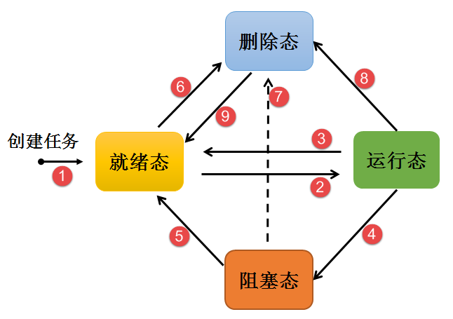
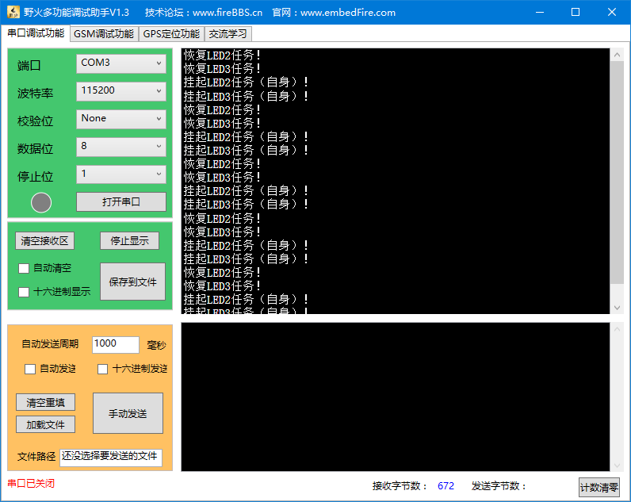

.. vim: syntax=rst

任务管理
==============

任务的基本概念
~~~~~~~~~~~~~~~~~~~

从系统的角度看，任务是竞争系统资源的最小运行单元。μC/OS是一个支持多任务的操作系统。在μC/OS中，任务可以使用或等待CPU、使用内存空间等系统资源，
并独立于其他任务运行，任何数量的任务可以共享同一个优先级，处于就绪态的多个相同优先级任务将会以时间片切换的方式共享处理器。

简而言之：μC/OS的任务可认为是一系列独立任务的集合。每个任务在自己的环境中运行。在任何时刻，只有一个任务得到运行，μC/OS调度器决定运行哪个任务。
调度器会不断的启动、停止每一个任务，宏观看上去所有的任务都在同时在执行。作为任务，不需要对调度器的活动有所了解，
在任务切入切出时保存上下文环境（寄存器值、栈内容）是调度器主要的职责。为了实现这点，每个μC/OS任务都需要有自己的栈空间。
当任务切出时，它的执行环境会被保存在该任务的栈空间中，这样当任务再次运行时，就能从栈中正确的恢复上次的运行环境，任务越多，
需要的栈空间就越大，而一个系统能运行多少个任务，取决于系统的可用的SRAM。

μC/OS的可以给用户提供多个任务单独享有独立的栈空间，系统可用决定任务的状态，决定任务是否可以运行，同时还能运用内核的IPC通信资源，
实现了任务之间的通信，帮助用户管理业务程序流程。这样用户可以将更多的精力投入到业务功能的实现中。

μC/OS中的任务是抢占式调度机制，高优先级的任务可打断低优先级任务，低优先级任务必须在高优先级任务阻塞或结束后才能得到调度。
同时μC/OS也支持时间片轮转调度方式，只不过时间片的调度是不允许抢占任务的CPU使用权。

任务通常会运行在一个死循环中，也不会退出，如果一个任务不再需要，可以调用μC/OS中的任务删除API函数接口显式地将其删除。

任务调度器的基本概念
~~~~~~~~~~~~~~~~~~~~~~~~~~~~~~

μC/OS中提供的任务调度器是基于优先级的全抢占式调度：在系统中除了中断处理函数、调度器上锁部分的代码和禁止中断的代码是不可抢占的之外，
系统的其他部分都是可以抢占的。系统理论上可以支持无数个优先级(0 ～ N，
优先级数值越大的任务优先级越低，（OS_CFG_PRIO_MAX - 1u）为最低优先级，
分配给空闲任务使用，一般不建议用户来使用这个优先级。一般系统默认的最大可用优先级数目为32。在一些资源比较紧张的系统中，
用户可以根据实际情况选择只支持8个或自定义个数优先级的系统配置。在系统中，当有比当前任务优先级更高的任务就绪时，
当前任务将立刻被切出，高优先级任务抢占处理器运行。

一个操作系统如果只是具备了高优先级任务能够“立即”获得处理器并得到执行的特点，那么它仍然不算是实时操作系统。
因为这个查找最高优先级任务的过程决定了调度时间是否具有确定性，例如一个包含n个就绪任务的系统中，如果仅仅从头找到尾，
那么这个时间将直接和n相关，而下一个就绪任务抉择时间的长短将会极大的影响系统的实时性。

μC/OS内核中采用两种方法寻找最高优先级的任务，第一种是通用的方法，因为μC/OS防止CPU平台不支持前导零指令，
就采用C语言模仿前导零指令的效果实现了快速查找到最高优先级任务的方法。而第二种方法则是特殊方法，利用硬件计算前导零指令CLZ，
这样子一次就能知道哪一个优先级任务能够运行，这种调度算法比普通方法更快捷，但受限于平台（在STM32中我们就使用这种方法）。

如果分别创建了优先级3、5、8和11这四个任务，任务创建成功后，调用CPU_CntLeadZeros()可以计算出OSPrioTbl[0]第一个置1的位前面有3个0，
那么这个3就是我们要查找的最高优先级，至于后面还有多少个位置1我们都不用管，只需要找到第一个1即可。

μC/OS内核中也允许创建相同优先级的任务。相同优先级的任务采用时间片轮转方式进行调度（也就是通常说的分时调度器），
时间片轮转调度仅在当前系统中无更高优先级就绪任务存在的情况下才有效。为了保证系统的实时性，系统尽最大可能地保证高优先级的任务得以运行。
任务调度的原则是一旦任务状态发生了改变，并且当前运行的任务优先级小于优先级队列组中任务最高优先级时，
立刻进行任务切换（除非当前系统处于中断处理程序中或禁止任务切换的状态）。

任务状态迁移
~~~~~~~~~~~~~~~~~~

μC/OS系统中的每一个任务都有多种运行状态，他们之间的转换关系是怎么样的呢？从运行态任务变成阻塞态，或者从阻塞态变成就绪态，
这些任务状态是如何进行迁移？下面就让我们一起了解任务状态迁移吧，具体见图 任务状态迁移图_ 。

-   任务状态迁移图_  **(1)**\ ：创建任务→就绪态（Ready）：任务创建完成后进入就绪态，
    表明任务已准备就绪，随时可以运行，只等待调度器进行调度。

-   任务状态迁移图_  **(2)**\ ：就绪态→运行态（Running）：发生任务切换时，就绪列表中最高优先级的任务被执行，从而进入运行态。

-   任务状态迁移图_  **(3)**\ ：运行态→就绪态：有更高优先级任务创建或者恢复后，会发生任务调度，此刻就绪列表中最高优先级任务变为运行态，
    那么原先运行的任务由运行态变为就绪态，依然在就绪列表中，
    等待最高优先级的任务运行完毕继续运行原来的任务（此处可以看作CPU使用权被更高优先级的任务抢占了）。

-   任务状态迁移图_  **(4)**\ ：运行态→阻塞态（或者称为挂起态Suspended）：正在运行的任务发生阻塞（挂起、延时、读信号量等待）时，
    该任务会从就绪列表中删除，任务状态由运行态变成阻塞态，然后发生任务切换，运行就绪列表中当前最高优先级任务。

-   任务状态迁移图_  **(5)**\ ：阻塞态→就绪态：阻塞的任务被恢复后（任务恢复、延时时间超时、读信号量超时或读到信号量等），
    此时被恢复的任务会被加入就绪列表，从而由阻塞态变成就绪态；如果此时被恢复任务的优先级高于正在运行任务的优先级，
    则会发生任务切换，将该任务将再次转换任务状态，由就绪态变成运行态。

-   任务状态迁移图_  **(6)(7)(8)**\ ：就绪态、阻塞态、运行态→删除态（Delete）：
    任务可以通过调用OSTaskDel() API 函数都可以将处于任何状态的任务删除，被删除后的任务将不能再次使用，关于任务的资源都会被系统回收。

-   任务状态迁移图_  **(9)**\ ：删除态→就绪态：这就是创建任务的过程，一个任务将会从无到有，创建成功的任务可以参与系统的调度。

注意：此处的任务状态只是大致的任务状态而并非μC/OS的所有任务状态，下面会具体介绍μC/OS中具体的任务的状态。

μC/OS的任务状态
~~~~~~~~~~~~~~~~~~~~~~~~~~~~~~

μC/OS系统中的每一任务都有多种运行状态。系统初始化完成后，创建的任务就可以在系统中竞争一定的资源，由内核进行调度。

μC/OS的任务状态通常分为以下几种：

    -  就绪（OS_TASK_STATE_RDY）：该任务在就绪列表中，就绪的任务已经具备执行的能力，
       只等待调度器进行调度，新创建的任务会初始化为就绪态。

    -  延时（OS_TASK_STATE_DLY）：该任务处于延时调度状态。

    -  等待（OS_TASK_STATE_PEND）：任务调用OSQPend()、OSSemPend()这类等待函数，
       系统就会设置一个超时时间让该任务处于等待状态，
       如果超时时间设置为0，任务的状态，无限期等下去，直到事件发生。如果超时时间为N(N>0)，在N个时间内任务等待的事件或信号都没发生，
       就退出等待状态转为就绪状态。

    -  运行（Running）：该状态表明任务正在执行，此时它占用处理器，ΜC/OS调度器选择运行的永远是处于最高优先级的就绪态任务，
       当任务被运行的一刻，它的任务状态就变成了运行态，其实运行态的任务也是处于就绪列表中的。

    -  挂起（OS_TASK_STATE_SUSPENDED）：任务通过调用 OSTaskSuspend()函数能够挂起自己或其他任务，
       调用 OSTaskResume()是使被挂起的任务回复运行的唯一的方法。挂起一任务意味着该任务再被恢复运行以前不能够取得CPU的使用权，
       类似强行暂停一个任务。

    -  延时+挂起（OS_TASK_STATE_DLY_SUSPENDED）：任务先产生一个延时，延时没结束的时候被其他任务挂起，
       挂起的效果叠加，当且仅当延时结束并且挂起被恢复了，该任务才能够再次运行。

    -  等待+挂起（OS_TASK_STATE_PEND_SUSPENDED）：任务先等待一个事件或信号的发生（无限期等待），
       还没等待到就被其他任务挂起，挂起的效果叠加，当且仅当任务等待到事件或信号并且挂起被恢复了，该任务才能够再次运行。

    -  超时等待+挂起（OS_TASK_STATE_PEND_TIMEOUT_SUSPENDED）：任务在指定时间内等待事件或信号的产生，
       但是任务已经被其他任务挂起。

    -  删除（OS_TASK_STATE_DEL）：任务被删除后的状态，任务被删除后将不再运行，除非重新创建任务。

常用的任务函数讲解
~~~~~~~~~~~~~~~~~~~~~~~~~

相信大家通过第一部分章节的学习，对任务创建以及任务调度的实现已然掌握了，下面就补充一些ΜC/OS提供给我们对任务操作的一些常用函数。

任务挂起函数OS_TaskSuspend()
^^^^^^^^^^^^^^^^^^^^^^^^^^^^^^^^^^^^^

挂起指定任务。被挂起的任务绝不会得到CPU的使用权，不管该任务具有什么优先级。

任务可以通过调用vTaskSuspend()函数都可以将处于任何状态的任务挂起，被挂起的任务得不到CPU的使用权，也不会参与调度，
它相对于调度器而言是不可见的，除非它从挂起态中解除。任务挂起是我们经常使用的一个函数，
想要使用的就必须将宏定义OS_CFG_TASK_SUSPEND_EN启用，这样在编译的时候才会包含OS_TaskSuspend()这个函数，
下面一起看看任务挂起的源码吧，具体见 代码清单:任务管理-1_ 。

.. code-block:: c
    :caption: 代码清单:任务管理-1任务挂起函数OS_TaskSuspend()源码
    :name: 代码清单:任务管理-1
    :linenos:

    #if OS_CFG_TASK_SUSPEND_EN > 0u//如果启用了函数 OSTaskSuspend()
    void   OS_TaskSuspend (OS_TCB  *p_tcb, 		(1)//任务控制块指针
                        OS_ERR  *p_err) 		(2)//返回错误类型
    {
        CPU_SR_ALLOC();  //使用到临界段（在关/开中断时）时必须用到该宏，该宏声明和
        //定义一个局部变量，用于保存关中断前的 CPU 状态寄存器
        // SR（临界段关中断只需保存SR），开中断时将该值还原。

        CPU_CRITICAL_ENTER();                         //关中断
        if (p_tcb == (OS_TCB *)0) {         (3)//如果 p_tcb 为空
            p_tcb = OSTCBCurPtr;    //挂起自身
        }

        if (p_tcb == OSTCBCurPtr) {         (4)//如果是挂起自身
            if (OSSchedLockNestingCtr > (OS_NESTING_CTR)0) {    //如果调度器被锁
                CPU_CRITICAL_EXIT();                            //开中断
                *p_err = OS_ERR_SCHED_LOCKED;          //错误类型为“调度器被锁”
                return;                                         //返回，停止执行
            }
        }

        *p_err = OS_ERR_NONE;                             //错误类型为“无错误”
        switch (p_tcb->TaskState) {      (5)//根据 p_tcb 的任务状态分类处理
            case OS_TASK_STATE_RDY:       (6)//如果是就绪状态
            OS_CRITICAL_ENTER_CPU_EXIT();                 //锁调度器，重开中断
            p_tcb->TaskState  =  OS_TASK_STATE_SUSPENDED; //任务状态改为“挂起状态”
            p_tcb->SuspendCtr = (OS_NESTING_CTR)1;           //挂起前套数为1
            OS_RdyListRemove(p_tcb);                  //将任务从就绪列表移除
            OS_CRITICAL_EXIT_NO_SCHED();              //开调度器，不进行调度
            break;                                           //跳出

            case OS_TASK_STATE_DLY:         (7)//如果是延时状态将改为“延时中被挂起”
            p_tcb->TaskState  = OS_TASK_STATE_DLY_SUSPENDED;
            p_tcb->SuspendCtr = (OS_NESTING_CTR)1;           //挂起前套数为1
            CPU_CRITICAL_EXIT();                             //开中断
            break;                                           //跳出

            case OS_TASK_STATE_PEND: (8)//如果是无期限等待状态将改为“无期限等待中被挂起”
            p_tcb->TaskState  = OS_TASK_STATE_PEND_SUSPENDED;
            p_tcb->SuspendCtr = (OS_NESTING_CTR)1;           //挂起前套数为1
            CPU_CRITICAL_EXIT();                             //开中断
            break;                                           //跳出

            case OS_TASK_STATE_PEND_TIMEOUT:(9)//如果是有期限等待将改为“有期限等待中被挂起”
            p_tcb->TaskState  = OS_TASK_STATE_PEND_TIMEOUT_SUSPENDED;
            p_tcb->SuspendCtr = (OS_NESTING_CTR)1;           //挂起前套数为1
            CPU_CRITICAL_EXIT();                             //开中断
            break;                                           //跳出

            case OS_TASK_STATE_SUSPENDED:     (10)		//如果状态中有挂起状态
            case OS_TASK_STATE_DLY_SUSPENDED:
            case OS_TASK_STATE_PEND_SUSPENDED:
            case OS_TASK_STATE_PEND_TIMEOUT_SUSPENDED:
            p_tcb->SuspendCtr++;                             //挂起嵌套数加1
            CPU_CRITICAL_EXIT();                             //开中断
            break;                                           //跳出

            default:                         (11)//如果任务状态超出预期
            CPU_CRITICAL_EXIT();                             //开中断
            *p_err = OS_ERR_STATE_INVALID;          //错误类型为“状态非法”
            return;                                          //返回，停止执行
        }

        OSSched();                     (12)//调度任务
    }
    #endif

-   代码清单:任务管理-1_  **(1)**\ ：任务控制块指针，该指针指向要挂起的任务，也可以是任务自身，但是不能是空闲任务，空闲任务永远不允许挂起。

-   代码清单:任务管理-1_  **(2)**\ ：用于存放返回错误代码，如果挂起任务失败，则返回对应的错误代码。

-   代码清单:任务管理-1_  **(3)**\ ：如果传递进来的任务控制块指针是NULL或者是0，
    则表明要挂起的任务是任务自身，将任务控制块的指针指向当前任务。

-   代码清单:任务管理-1_  **(4)**\ ：如果的任务是当前任务，也就是挂起任务自身，那么需要判断一下调度器有没有被锁定，
    因为挂起任务自身之后，就肯定需要切换任务，而如果调度器被锁定的话，就无法切换任务了，所以会返回错误类型“调度器被锁”，然后退出。

-   代码清单:任务管理-1_  **(5)**\ ：根据要挂起的任务状态分类处理，这样处理逻辑简单，更加方便快捷。

-   代码清单:任务管理-1_  **(6)**\ ：如果任务处于就绪状态，那么该任务能直接挂起，但是接下来我们要操作进行列表，
    时间是不确定的，我们不能将中断关闭太久，这样子会影响系统对中断的响应，此时系统就会打开中断，
    但是系统又不想其他任务来影响我们操作就绪列表，所以系统还会锁定调度器，不进行任务切换，这样子就不会有任务打扰我们的操作了，
    然后将任务状态变为挂起态，挂起次数为1次，然后调用OS_RdyListRemove()函数将任务从就绪列表移除，再打开调度器，
    然后跳出，最后才进行任务的调度。

-   代码清单:任务管理-1_  **(7)**\ ：如果任务当前处于延时状态，那么也能被挂起，
    任务状态将改为“延时中被挂起”状态，挂起次数为1次，然后打开中断，退出。

-   代码清单:任务管理-1_  **(8)**\ ：如果任务当前处于无期限等待状态，
    那么也能被挂起，任务状态将改为“无期限等待中被挂起”状态，挂起次数为1次，然后打开中断，退出。

-   代码清单:任务管理-1_  **(9)**\ ：如果任务当前处于有期限等待状态，
    那么也能被挂起，任务状态将改为“有期限等待中被挂起”状态，挂起次数为1次，然后打开中断，退出。

-   代码清单:任务管理-1_  **(10)**\ ：如果要挂起的任务本身就处于挂起态，
    那么再次挂起就要记录挂起的次数，将挂起的次数加一，然后打开中断，退出。

-   代码清单:任务管理-1_  **(11)**\ ：对于其他的任务状态，返回状态非法错误，然后退出。

-   代码清单:任务管理-1_  **(12)**\ ：进行一次任务调度。

注：任务可以调用OS_TaskSuspend()这个函数来挂起任务自身，但是在挂起自身的时候会进行一次任务上下文切换，
需要挂起自身就将任务控制块指针设置为NULL或0传递进来即可。无论任务是什么状态都可以被挂起，
只要调用了OS_TaskSuspend()这个函数就会挂起成功，不论是挂起其他任务还是挂起任务自身。

任务的挂起与恢复函数在很多时候都是很有用的，比如我们想暂停某个任务运行一段时间，但是我们又需要在其恢复的时候继续工作，
那么删除任务是不可能的，因为删除了任务的话，任务的所有的信息都是不可能恢复的了，删除是完完全全删除了，
里面的资源都被系统释放掉，但是挂起任务就不会这样子，调用挂起任务函数，仅仅是将任务进入挂起态，
其内部的资源都会保留下来，同时也不会参与系统中任务的调度，当调用恢复函数的时候，整个任务立即从挂起态进入就绪态，
并且参与任务的调度，如果该任务的优先级是当前就绪态优先级最高的任务，那么立即会按照挂起前的任务状态继续执行该任务，
从而达到我们需要的效果，注意，是继续执行，也就是说，挂起任务之前是什么状态，都会被系统保留下来，在恢复的瞬间，
继续执行。这个任务函数的使用方法是很简单的，只需把任务句柄传递进来即可，OS_TaskSuspend()会根据任务句柄的信息将对应的任务挂起，
具体见 代码清单:任务管理-2_ 加粗部分。

.. code-block:: c
    :caption: 代码清单:任务管理-2任务挂起函数OS_TaskSuspend()使用实例
    :emphasize-lines: 7,15
    :name: 代码清单:任务管理-2
    :linenos:

    /**************************** 任务句柄 ********************************/
    /*
    * 任务句柄是一个指针，用于指向一个任务，当任务创建好之后，它就具有了一个任务句柄
    * 以后我们要想操作这个任务都需要通过这个任务句柄，如果是自身的任务操作自己，那么
    * 这个句柄可以为NULL。
    */
    staticOS_TCB   AppTaskLed1TCB;/* LED任务句柄 */
    static void KEY_Task(void* parameter)
    {
        OS_ERR      err;
        while (1) {
            if ( Key_Scan(KEY1_GPIO_PORT,KEY1_GPIO_PIN) == KEY_ON ) {
                /* KEY1 被按下 */
                printf("挂起LED任务！\n");
                OSTaskSuspend (AppTaskLed1TCB, & err );   /* 挂起LED1任务 */
            }
            OSTimeDly ( 20, OS_OPT_TIME_DLY, & err );   /* 延时20个tick */
        }
    }

任务恢复函数OSTaskResume()
^^^^^^^^^^^^^^^^^^^^^^^^^^^^^^^^^^

既然有任务的挂起，那么当然一样有恢复，不然任务怎么恢复呢，任务恢复就是让挂起的任务重新进入就绪状态，恢复的任务会保留挂起前的状态信息，
在恢复的时候根据挂起时的状态继续运行。如果被恢复任务在所有就绪态任务中，处于最高优先级列表的第一位，那么系统将进行任务上下文的切换。
下面一起看看任务恢复函数OSTaskResume()的源码，具体见 代码清单:任务管理-3_ 。

.. code-block:: c
    :caption: 代码清单:任务管理-3任务恢复函数OSTaskResume()源码
    :name: 代码清单:任务管理-3
    :linenos:

    #if OS_CFG_TASK_SUSPEND_EN > 0u//如果启用了函数 OSTaskResume()
    void  OSTaskResume (OS_TCB  *p_tcb,     (1)//任务控制块指针
            OS_ERR  *p_err)     (2)//返回错误类型
    {
        CPU_SR_ALLOC();  //使用到临界段（在关/开中断时）时必须用到该宏，该宏声明和
        //定义一个局部变量，用于保存关中断前的 CPU 状态寄存器
        // SR（临界段关中断只需保存SR），开中断时将该值还原。

    #ifdef OS_SAFETY_CRITICAL//如果启用了安全检测
        if (p_err == (OS_ERR *)0) {      (3)//如果 p_err 为空
            OS_SAFETY_CRITICAL_EXCEPTION();   //执行安全检测异常函数
            return;                           //返回，停止执行
        }
    #endif
    //如果禁用了中断延迟发布和中断中非法调用检测
    #if (OS_CFG_ISR_POST_DEFERRED_EN   == 0u) && \
        (OS_CFG_CALLED_FROM_ISR_CHK_EN >  0u)		(4)
        if (OSIntNestingCtr > (OS_NESTING_CTR)0) { //如果在中断中调用该函数
            *p_err = OS_ERR_TASK_RESUME_ISR;        //错误类型为“在中断中恢复任务”
            return;                                //返回，停止执行
        }
    #endif

        CPU_CRITICAL_ENTER();                     //关中断
    #if OS_CFG_ARG_CHK_EN > 0u//如果启用了参数检测
        if ((p_tcb == (OS_TCB *)0) ||             //如果被恢复任务为空或是自身
            (p_tcb == OSTCBCurPtr)) {	(5)
            CPU_CRITICAL_EXIT();                  //开中断
            *p_err  = OS_ERR_TASK_RESUME_SELF;     //错误类型为“恢复自身”
            return;                               //返回，停止执行
        }
    #endif
        CPU_CRITICAL_EXIT();                      //关中断

    #if OS_CFG_ISR_POST_DEFERRED_EN > 0u(6)//如果启用了中断延迟发布
        if (OSIntNestingCtr > (OS_NESTING_CTR)0) {  //如果该函数在中断中被调用
            OS_IntQPost((OS_OBJ_TYPE)OS_OBJ_TYPE_TASK_RESUME,
                        (void      *)p_tcb,
                        (void      *)0,
                        (OS_MSG_SIZE)0,
                        (OS_FLAGS   )0,
                        (OS_OPT     )0,
                        (CPU_TS     )0,
                        (OS_ERR    *)p_err);//把恢复任务命令发布到中断消息队列
            return;       //返回，停止执行
        }
    #endif
        /* 如果禁用了中断延迟发布或不是在中断中调用该函数 */
        OS_TaskResume(p_tcb, p_err);         //直接将任务 p_tcb 恢复(7)
    }
    #endif

-   代码清单:任务管理-3_  **(1)**\ ：任务控制块指针，该指针指向要恢复的任务，与挂起任务不同的是，该指针不允许指向任务自身。

-   代码清单:任务管理-3_  **(2)**\ ：用于存放返回错误代码，如果恢复任务失败，则返回对应的错误代码。

-   代码清单:任务管理-3_  **(3)**\ ：如果启用了安全检测（OS_SAFETY_CRITICAL）这个宏定义，
    那么在编译代码的时候会包含安全检测，
    如果p_err指针为空，系统会执行安全检测异常函数OS_SAFETY_CRITICAL_EXCEPTION()，然后退出。

-   代码清单:任务管理-3_  **(4)**\ ：如果禁用了中断延迟发布和中断中非法调用检测，那么在中断中恢复任务则是非法的，
    会直接返回错误类型为“在中断中恢复任务”，并且退出。而如果启用了中断延迟发布的话呢，就可以在中断中恢复任务，
    因为中断延迟发布的真正操作是在中断发布任务中。

-   代码清单:任务管理-3_  **(5)**\ ：如果启用了参数检测（OS_CFG_ARG_CHK_EN）这个宏定义，如果被恢复任务为空或是自身，
    也是不允许的，会返回错误类型为“恢复自身”，并且退出操作。

-   代码清单:任务管理-3_  **(6)**\ ：如果启用了中断延迟发布，并且如果该函数在中断中被调用，
    系统就会把恢复任务命令发布到中断消息队列中，唤醒中断发布任务，在任务中恢复指定任务，并且退出。

-   代码清单:任务管理-3_  **(7)**\ ：如果禁用了中断延迟发布或不是在中断中调用该函数，
    直接调用OS_TaskResume()函数恢复任务，该函数源码具体见 代码清单:任务管理-4_ 。

.. code-block:: c
    :caption: 代码清单:任务管理-4 OS_TaskResume()源码
    :name: 代码清单:任务管理-4
    :linenos:

    #if OS_CFG_TASK_SUSPEND_EN > 0u//如果启用了函数 OSTaskResume()
    void  OS_TaskResume (OS_TCB  *p_tcb,      //任务控制块指针
                        OS_ERR  *p_err)      //返回错误类型
    {
        CPU_SR_ALLOC(); //使用到临界段（在关/开中断时）时必须用到该宏，该宏声明和
        //定义一个局部变量，用于保存关中断前的 CPU 状态寄存器
        // SR（临界段关中断只需保存SR），开中断时将该值还原。
        CPU_CRITICAL_ENTER();                 //关中断
        *p_err  = OS_ERR_NONE;                 //错误类型为“无错误”
        switch (p_tcb->TaskState) {      (1)//根据 p_tcb 的任务状态分类处理
            case OS_TASK_STATE_RDY:               //如果状态中没有挂起状态
            case OS_TASK_STATE_DLY:
            case OS_TASK_STATE_PEND:
            case OS_TASK_STATE_PEND_TIMEOUT:
            CPU_CRITICAL_EXIT();                              //开中断
            *p_err = OS_ERR_TASK_NOT_SUSPENDED;  (2)//错误类型为“任务未被挂起”
            break;                                            //跳出

            case OS_TASK_STATE_SUSPENDED:           (3)//如果是“挂起状态”
            OS_CRITICAL_ENTER_CPU_EXIT();                 //锁调度器，重开中断
            p_tcb->SuspendCtr--;              (4)//任务的挂起嵌套数减1
            if (p_tcb->SuspendCtr == (OS_NESTING_CTR)0) {  //如果挂起前套数为0
                p_tcb->TaskState = OS_TASK_STATE_RDY;    //修改状态为“就绪状态”
                OS_TaskRdy(p_tcb);                  //把 p_tcb 插入就绪列表
            }
            OS_CRITICAL_EXIT_NO_SCHED();              //开调度器，不调度任务
            break;                                            //跳出

            case OS_TASK_STATE_DLY_SUSPENDED:      (5)//如果是“延时中被挂起”
            p_tcb->SuspendCtr--;                       //任务的挂起嵌套数减1
            if (p_tcb->SuspendCtr == (OS_NESTING_CTR)0) { //如果挂起前套数为0
                p_tcb->TaskState = OS_TASK_STATE_DLY;    //修改状态为“延时状态”
            }
            CPU_CRITICAL_EXIT();                              //开中断
            break;                                            //跳出

            case OS_TASK_STATE_PEND_SUSPENDED:    (6)//如果是“无期限等待中被挂起”
            p_tcb->SuspendCtr--;                      //任务的挂起嵌套数减1
            if (p_tcb->SuspendCtr == (OS_NESTING_CTR)0) {  //如果挂起前套数为0
                p_tcb->TaskState = OS_TASK_STATE_PEND; //修改状态为“无期限等待状态”
            }
            CPU_CRITICAL_EXIT();                              //开中断
            break;                                            //跳出

            case OS_TASK_STATE_PEND_TIMEOUT_SUSPENDED:(7)//如果是“有期限等待中被挂起”
            p_tcb->SuspendCtr--;                //任务的挂起嵌套数减1
            if (p_tcb->SuspendCtr == (OS_NESTING_CTR)0) { //如果挂起前套数为0
                p_tcb->TaskState = OS_TASK_STATE_PEND_TIMEOUT;
            }
            CPU_CRITICAL_EXIT();                              //开中断
            break;                                            //跳出

            default:                        (8)	//如果 p_tcb 任务状态超出预期
            CPU_CRITICAL_EXIT();                              //开中断
            *p_err = OS_ERR_STATE_INVALID;        //错误类型为“状态非法”
            return;//跳出
        }

        OSSched();                (9)//调度任务
    }
    #endif

-   代码清单:任务管理-4_  **(1)**\ ：根据要挂起的任务状态分类处理，这样处理逻辑简单，更加方便快捷。

-   代码清单:任务管理-4_  **(2)**\ ：如果要恢复的任务状态中没有挂起状态，
    那表示任务没有被挂起，根本不需要恢复任务，返回错误类型为“任务未被挂起”，并且退出操作。

-   代码清单:任务管理-4_  **(3)**\ ：如果要恢复的任务是单纯的挂起状态，那么可以恢复任务。

-   代码清单:任务管理-4_  **(4)**\ ：任务的挂起记录次数减1，如果挂起前次数为0，表示任务已经完全恢复了，那么就可以参与系统的调度，
    此时就要把任务添加到就绪列表中，并且将任务的状态变为就绪状态，操作完成之后就跳出switch语句，打开中断但是不进行任务调度，
    因为在最后面才会进行任务调度。

-   代码清单:任务管理-4_  **(5)**\ ：如果任务在延时的时候被挂起了，也可以进行恢复任务操作，任务的挂起记录次数减1，如果挂起前次数为0，
    表示任务已经完全恢复了，那就会恢复挂起前的状态——延时状态，然后退出。

-   代码清单:任务管理-4_  **(6)**\ ：同理，如果任务在无期限等待的时候被挂起了，也可以进行恢复任务操作，任务的挂起记录次数减1，
    如果挂起前次数为0，表示任务已经完全恢复了，那就会恢复挂起前的状态——无期限等待状态，然后退出。

-   代码清单:任务管理-4_  **(7)**\ ：如果任务在有期限等待的时候被挂起了，也可以进行恢复任务操作，任务的挂起记录次数减1，
    如果挂起前次数为0，表示任务已经完全恢复了，那就会恢复挂起前的状态——有期限等待状态，然后退出。

-   代码清单:任务管理-4_  **(8)**\ ：对于其他的任务状态，返回状态非法错误，然后退出。

-   代码清单:任务管理-4_  **(9)**\ ：进行一次任务调度。

OSTaskResume()函数用于恢复挂起的任务。任务在挂起时候调用过多少次的OS_TaskSuspend()函数，那么就需要调用多少次OSTaskResume()
函数才能将任务恢复运行，下面来看看任务恢复函数OSTaskResume()的使用实例，具体见 代码清单:任务管理-5_ 加粗部分。

.. code-block:: c
    :caption: 代码清单:任务管理-5任务恢复函数OSTaskResume()实例
    :emphasize-lines: 6,14
    :name: 代码清单:任务管理-5
    :linenos:

    /*
    * 任务句柄是一个指针，用于指向一个任务，当任务创建好之后，它就具有了一个任务句柄
    * 以后我们要想操作这个任务都需要通过这个任务句柄，如果是自身的任务操作自己，那么
    * 这个句柄可以为NULL。
    */
    staticOS_TCB   AppTaskLed1TCB;/* LED任务句柄 */

    static void KEY_Task(void* parameter)
    {OS_ERR      err;
        while (1) {
            if ( Key_Scan(KEY2_GPIO_PORT,KEY2_GPIO_PIN) == KEY_ON ) {
                /* KEY2 被按下 */
                printf("恢复LED任务！\n");
                OSTaskResume ( &AppTaskLed1TCB, & err );  /* 恢复LED任务！ */
            }
            OSTimeDly ( 20, OS_OPT_TIME_DLY, & err );   /* 延时20个tick */
        }
    }

删除任务函数OSTaskDel()
^^^^^^^^^^^^^^^^^^^^^^^^^^^^^^^^^^^^^^^^^^^^^^^^^

OSTaskDel()用于删除一个任务。当一个任务删除另外一个任务时，形参为要删除任务创建时返回的任务句柄，如果是删除自身，则形参为 NULL。
要想使用该函数必须在os_cfg.h中把OS_CFG_TASK_DEL_EN宏定义配置为1，删除的任务将从所有就绪，阻塞，挂起和事件列表中删除，
任务删除函数OSTaskDel()源码具体见 代码清单:任务管理-6_ 。

.. code-block:: c
    :caption: 代码清单:任务管理-6任务删除函数vTaskDelete()源码
    :name: 代码清单:任务管理-6
    :linenos:

    #if OS_CFG_TASK_DEL_EN > 0u//如果启用了函数 OSTaskDel()
    void  OSTaskDel (OS_TCB  *p_tcb,                 //目标任务控制块指针
                    OS_ERR  *p_err)                 //返回错误类型
    {
        CPU_SR_ALLOC(); //使用到临界段（在关/开中断时）时必须用到该宏，该宏声明和
        //定义一个局部变量，用于保存关中断前的 CPU 状态寄存器
        // SR（临界段关中断只需保存SR），开中断时将该值还原。

    #ifdef OS_SAFETY_CRITICAL//如果启用（默认禁用）了安全检测
        if (p_err == (OS_ERR *)0) {                //如果 p_err 为空
            OS_SAFETY_CRITICAL_EXCEPTION();        //执行安全检测异常函数
            return;                                //返回，停止执行
        }
    #endif

    #if OS_CFG_CALLED_FROM_ISR_CHK_EN > 0u(1)//如果启用了中断中非法调用检测
        if (OSIntNestingCtr > (OS_NESTING_CTR)0) { //如果该函数在中断中被调用
            *p_err = OS_ERR_TASK_DEL_ISR;           //错误类型为“在中断中删除任务”
            return;                                //返回，停止执行
        }
    #endif

        if (p_tcb == &OSIdleTaskTCB) {      (2)//如果目标任务是空闲任务
            *p_err = OS_ERR_TASK_DEL_IDLE;          //错误类型为“删除空闲任务”
            return;                                //返回，停止执行
        }

    #if OS_CFG_ISR_POST_DEFERRED_EN > 0u(3)//如果启用了中断延迟发布
        if (p_tcb == &OSIntQTaskTCB) {          //如果目标任务是中断延迟提交任务
            *p_err = OS_ERR_TASK_DEL_INVALID;       //错误类型为“非法删除任务”
            return;                                //返回，停止执行
        }
    #endif

    if (p_tcb == (OS_TCB *)0) {        (4)//如果 p_tcb 为空
            CPU_CRITICAL_ENTER();                  //关中断
            p_tcb  = OSTCBCurPtr;         //目标任务设为自身
            CPU_CRITICAL_EXIT();                   //开中断
        }

        OS_CRITICAL_ENTER();                       //进入临界段
        switch (p_tcb->TaskState) {      (5)//根据目标任务的任务状态分类处理
        case OS_TASK_STATE_RDY:                //如果是就绪状态
                OS_RdyListRemove(p_tcb);     (6)//将任务从就绪列表移除
        break;                            //跳出

        case OS_TASK_STATE_SUSPENDED:    (7)//如果是挂起状态
        break;                            //直接跳出

        case OS_TASK_STATE_DLY:        (8)//如果包含延时状态
        case OS_TASK_STATE_DLY_SUSPENDED:
                OS_TickListRemove(p_tcb);         //将任务从节拍列表移除
        break;                            //跳出

        case OS_TASK_STATE_PEND:       (9)//如果包含等待状态
        case OS_TASK_STATE_PEND_SUSPENDED:
        case OS_TASK_STATE_PEND_TIMEOUT:
        case OS_TASK_STATE_PEND_TIMEOUT_SUSPENDED:
                OS_TickListRemove(p_tcb);    (10)//将任务从节拍列表移除
        switch (p_tcb->PendOn) {   (11)//根据任务的等待对象分类处理
        case OS_TASK_PEND_ON_NOTHING: //如果没在等待内核对象
        case OS_TASK_PEND_ON_TASK_Q:  //如果等待的是任务消息队列
        case OS_TASK_PEND_ON_TASK_SEM://如果等待的是任务信号量
        break;                   //直接跳出

        case OS_TASK_PEND_ON_FLAG:    //如果等待的是事件
        case OS_TASK_PEND_ON_MULTI:   //如果等待多个内核对象
        case OS_TASK_PEND_ON_MUTEX:   //如果等待的是互斥量
        case OS_TASK_PEND_ON_Q:       //如果等待的是消息队列
        case OS_TASK_PEND_ON_SEM:     //如果等待的是信号量
                    OS_PendListRemove(p_tcb);(12)//将任务从等待列表移除
        break;                   //跳出

        default:                      //如果等待对象超出预期
        break;                   //直接跳出
                }
        break;                            //跳出

        default:                        (13)//如果目标任务状态超出预期
                OS_CRITICAL_EXIT();                //退出临界段
                *p_err = OS_ERR_STATE_INVALID;      //错误类型为“状态非法”
        return;                            //返回，停止执行
        }

    #if OS_CFG_TASK_Q_EN > 0u(14)//如果启用了任务消息队列
        (void)OS_MsgQFreeAll(&p_tcb->MsgQ);        //释放任务的所有任务消息
    #endif

        OSTaskDelHook(p_tcb);              (15)//调用用户自定义的钩子函数

    #if defined(OS_CFG_TLS_TBL_SIZE) && (OS_CFG_TLS_TBL_SIZE > 0u)
        OS_TLS_TaskDel(p_tcb);                                  /* Call TLSk     */
    #endif

    #if OS_CFG_DBG_EN > 0u(16)//如果启用了调试代码和变量
        OS_TaskDbgListRemove(p_tcb);               //将任务从任务调试双向列表移除
    #endif
        OSTaskQty--;                      (17)//任务数目减1

        OS_TaskInitTCB(p_tcb);             (18)//初始化任务控制块
        p_tcb->TaskState = (OS_STATE)OS_TASK_STATE_DEL;//标定任务已被删除

        OS_CRITICAL_EXIT_NO_SCHED();               //退出临界段（无调度）

        *p_err = OS_ERR_NONE;                       //错误类型为“无错误”

        OSSched();                          (19)//调度任务
    }
    #endif

-   代码清单:任务管理-6_  **(1)**\ ：如果启用了中断中非法调用检测，
    那么在中断中删除任务则是非法的，会直接返回错误类型为“在中断中删除任务”，并且退出。

-   代码清单:任务管理-6_  **(2)**\ ：如果要删除的目标任务是空闲任务，这是绝对不允许的，系统中空闲任务的存在是必然的，
    绝对不允许删除空闲任务，会返回错误类型为“删除空闲任务”的错误代码，并且退出。

-   代码清单:任务管理-6_  **(3)**\ ：如果启用了中断延迟发布，但是要删除的目标任务是中断延迟发布任务，这也是绝对不允许的，
    因为启用了中断延迟发布，则代表着系统中必须有一个中断延迟发布任务处理在中断中的发布的事情，所以会返回错误类型为“非法删除任务”的错误代码，并且退出。

-   代码清单:任务管理-6_  **(4)**\ ：如果传递进来的任务控制块指针为0，
    表示要删除的任务是任务自身，则将任务控制块指针指向当前任务，目标任务设为任务自身。

-   代码清单:任务管理-6_  **(5)**\ ：根据目标任务的任务状态分类处理。

-   代码清单:任务管理-6_  **(6)**\ ：如果任务是处于就绪态的，就将任务从就绪列表移除。

-   代码清单:任务管理-6_  **(7)**\ ：如果任务是处于挂起状态就直接跳出switch语句。

-   代码清单:任务管理-6_  **(8)**\ ：如果任务包含延时状态，那么将任务从节拍列表移除。

-   代码清单:任务管理-6_  **(9)**\ ：如果任务包含等待状态。

-   代码清单:任务管理-6_  **(10)**\ ：系统首先会将任务从节拍列表移除。

-   代码清单:任务管理-6_  **(11)**\ ：然后再根据任务的等待对象分类处理，
    如果没在等待内核对象或者等待的是任务消息队列或者等待的是任务信号量，那么直接跳出switch语句。

-   代码清单:任务管理-6_  **(12)**\ ：而任务如果是在等待内核资源这些，如事件、消息队列、
    信号量等，系统会直接将任务从等待列表移除，然后跳出switch语句。

-   代码清单:任务管理-6_  **(13)**\ ：如果目标任务状态超出预期，直接返回错误类型为“状态非法”的错误，并且退出删除操作。

-   代码清单:任务管理-6_  **(14)**\ ：如果启用了任务消息队列，将释放任务的所有任务消息。

-   代码清单:任务管理-6_  **(15)**\ ：在删除任务的时候，系统还会调用用户自定义的钩子函数，用户可以通过该钩子函数进行自定义的操作。

-   代码清单:任务管理-6_  **(16)**\ ：如果启用了调试代码和变量，将任务从任务调试双向列表移除。

-   代码清单:任务管理-6_  **(17)**\ ：到这里就进行任务的删除操，系统的任务数目减1。

-   代码清单:任务管理-6_  **(18)**\ ：初始化对应的任务控制块，将任务状态变为删除态，
    退出临界段但不进行调度，返回错误类型为“无错误”的错误代码。

-   代码清单:任务管理-6_  **(19)**\ ：进行一次任务调度。

删除任务是说任务将返回并处以删除（休眠）状态，任务的代码不再被μC/OS调用，删除任务不是删除代码，删除任务和挂起任务有些相似，其实有着
本质的区别，根本来说，最大的不同就是删除任务队任务控制块的操作，我们知道在任务创建的时候，需要给每个任务分配一个任务控制块，这个任务
控制块存储有关这个任务重要的信息，对任务间有至关重要的作用，挂起任务根本不会动任务控制块，但删除任务就会把任务控制块进行初始化，这样
子关于任务的任何信息都被抹去。

注意了，删除任务并不会释放任务的栈空间。

删除任务函数的使用实例具体见 代码清单:任务管理-7_ 。

.. code-block:: c
    :caption: 代码清单:任务管理-7删除任务函数OSTaskDel()使用实例
    :emphasize-lines: 6,14
    :name: 代码清单:任务管理-7
    :linenos:

    /*
    * 任务句柄是一个指针，用于指向一个任务，当任务创建好之后，它就具有了一个任务句柄
    * 以后我们要想操作这个任务都需要通过这个任务句柄，如果是自身的任务操作自己，那么
    * 这个句柄可以为NULL。
    */
    staticOS_TCB   AppTaskLed1TCB;/* LED任务句柄 */

    static void KEY_Task(void* parameter)
    {OS_ERR      err;
    while (1) {
        if ( Key_Scan(KEY2_GPIO_PORT,KEY2_GPIO_PIN) == KEY_ON ) {
        /* KEY2 被按下 */
                printf("删除LED任务！\n");
                OSTaskDel( &AppTaskLed1TCB, & err );  /* 删除LED任务！ */
            }
            OSTimeDly ( 20, OS_OPT_TIME_DLY, & err );   /* 延时20个tick */
        }
    }

任务延时函数
^^^^^^^^^^^^^^^^^^

OSTimeDly()
'''''''''''

OSTimeDly()在我们任务中用得非常之多，每个任务都必须是死循环，并且是必须要有阻塞的情况，否则低优先级的任务就无法被运行了，
OSTimeDly()函数常用于停止当前任务进行的运行，延时一段时间后再运行，OSTimeDly()函数源码具体见 代码清单:任务管理-8_ 。

.. code-block:: c
    :caption: 代码清单:任务管理-8OSTimeDly()函数源码
    :name: 代码清单:任务管理-8
    :linenos:

    void  OSTimeDly (OS_TICK   dly,              (1)//延时的时钟节拍数
        OS_OPT    opt,             (2)//选项
                    OS_ERR   *p_err)           (3)//返回错误类型
    {
        CPU_SR_ALLOC();
        //使用到临界段（在关/开中断时）时必须用到该宏，该宏声明和定义一个局部变
        //量，用于保存关中断前的 CPU 状态寄存器 SR（临界段关中断只需保存SR）
        //，开中断时将该值还原。

    #ifdef OS_SAFETY_CRITICAL(4)//如果启用（默认禁用）了安全检测
        if (p_err == (OS_ERR *)0) {                        //如果错误类型实参为空
            OS_SAFETY_CRITICAL_EXCEPTION();                //执行安全检测异常函数
            return;                                        //返回，不执行延时操作
        }
    #endif
                            (5)
    #if OS_CFG_CALLED_FROM_ISR_CHK_EN > 0u//如果启用（默认启用）了中断中非法调用检测
        if (OSIntNestingCtr > (OS_NESTING_CTR)0u){//如果该延时函数是在中断中被调用
            *p_err = OS_ERR_TIME_DLY_ISR;       //错误类型为“在中断函数中延时”
            return;                             //返回，不执行延时操作
        }
    #endif
    /* 当调度器被锁时任务不能延时 */		(6)
        if (OSSchedLockNestingCtr > (OS_NESTING_CTR)0u) {  //如果调度器被锁
            *p_err = OS_ERR_SCHED_LOCKED;             //错误类型为“调度器被锁”
            return;                                        //返回，不执行延时操作
        }

        switch (opt) {             (7)//根据延时选项参数 opt 分类操作
        case OS_OPT_TIME_DLY:               //如果选择相对时间（从现在起延时多长时间）
        case OS_OPT_TIME_TIMEOUT:                      //如果选择超时（实际同上）
        case OS_OPT_TIME_PERIODIC:                     //如果选择周期性延时
        if (dly == (OS_TICK)0u) {    (8)//如果参数 dly 为0（0意味不延时）
                    *p_err = OS_ERR_TIME_ZERO_DLY;         //错误类型为“0延时”
        return;                               //返回，不执行延时操作
                }
        break;

        case OS_OPT_TIME_MATCH:         (9)
        //如果选择绝对时间（匹配系统开始运行（OSStart()）后的时钟节拍数）
        break;

        default:                            (10)//如果选项超出范围
            *p_err = OS_ERR_OPT_INVALID;               //错误类型为“选项非法”
        return;                                   //返回，不执行延时操作
        }

        OS_CRITICAL_ENTER();                             //进入临界段
        OSTCBCurPtr->TaskState = OS_TASK_STATE_DLY;  (11)//修改当前任务的任务状态为延时状态
        OS_TickListInsert(OSTCBCurPtr,             //将当前任务插入节拍列表
                        dly,
                        opt,
                        p_err);		(12)
        if (*p_err != OS_ERR_NONE) {          //如果当前任务插入节拍列表时出现错误
            OS_CRITICAL_EXIT_NO_SCHED();                  //退出临界段（无调度）
            return;                                       //返回，不执行延时操作
        }
        OS_RdyListRemove(OSTCBCurPtr);          (13)//从就绪列表移除当前任务
        OS_CRITICAL_EXIT_NO_SCHED();                       //退出临界段（无调度）
        OSSched();                              (14)//任务切换
        *p_err = OS_ERR_NONE;                               //错误类型为“无错误”
    }

-   代码清单:任务管理-8_  **(1)**\ ：任务延时的时钟节拍数，也就是延时的时间。

-   代码清单:任务管理-8_  **(2)**\ ：任务延时的可选选项，在os.h中有定义，具体见 代码清单:任务管理-9_ 。

.. code-block:: c
    :caption: 代码清单:任务管理-9任务延时的可选选项
    :name: 代码清单:任务管理-9
    :linenos:

    #define  OS_OPT_TIME_DLY                     DEF_BIT_NONE	(1)
    #define  OS_OPT_TIME_TIMEOUT                ((OS_OPT)DEF_BIT_01)	(2)
    #define  OS_OPT_TIME_MATCH                  ((OS_OPT)DEF_BIT_02)	(3)
    #define  OS_OPT_TIME_PERIODIC               ((OS_OPT)DEF_BIT_03)(4)

-   代码清单:任务管理-9_  **(1)**\ ：OS_OPT_TIME_DLY：dly 为相对时间，就是从现在起延时多长时间，
    到时钟节拍总计数OSTickCtr = OSTickCtr当前 + dly 时延时结束。

-   代码清单:任务管理-9_  **(2)**\ ：OS_OPT_TIME_TIMEOUT：跟 OS_OPT_TIME_DLY 的作用情况一样。

-   代码清单:任务管理-9_  **(3)**\ ：OS_OPT_TIME_MATCH：dly为绝对时间，
    就是从系统开始运行（调用 OSStart()）时到节拍总计数OSTickCtr = dly 时延时结束。

-   代码清单:任务管理-9_  **(4)**\ ：OS_OPT_TIME_PERIODIC：周期性延时，
    跟 OS_OPT_TIME_DLY的作用差不多，如果是长时间延时，该选项更精准一些。

-   代码清单:任务管理-8_  **(3)**\ ：用于存放返回错误代码，如果挂起任务失败，则返回对应的错误代码。

-   代码清单:任务管理-8_  **(4)**\ ：如果启用（默认禁用）了安全检测，
    系统就会执行安全检测的代码，如果错误类型实参为空，就执行安全检测异常函数，然后返回，不执行延时操作。

-   代码清单:任务管理-8_  **(5)**\ ：如果启用（默认启用）了中断中非法调用检测
    ，如果该延时函数是在中断中被调用，将返回错误类型为“在中断函数中延时”的错误代码，退出，不执行延时操作。

-   代码清单:任务管理-8_  **(6)**\ ：如果调度器被锁，则不允许进行延时操作，
    返回错误类型为“调度器被锁”的错误代码，并且退出延时操作。因为延时就必须进行任务的切换，所以在延时的时候不能锁定调度器，

-   代码清单:任务管理-8_  **(7)**\ ：根据延时选项参数 opt 分类操作。

-   代码清单:任务管理-8_  **(8)**\ ：如果选择相对时间（从现在起延时多长时间）或者选择超时时间或者选择周期性延时，
    那么这表示延时时间，如果参数 dly 为0（0意味不延时），就会返回错误类型为“0延时”的错误代码，并且退出不执行延时操作。

-   代码清单:任务管理-8_  **(9)**\ ：如果选择绝对时间（匹配系统开始运行（OSStart()）后的时钟节拍数。

-   代码清单:任务管理-8_  **(10)**\ ：如果选项超出范围，则视为非法，返回错误类型为“选项非法”的错误代码，并且退出不执行延时操作。

-   代码清单:任务管理-8_  **(11)**\ ：程序能执行到这里，说明能正常进行延时操作，那么系统就会修改当前任务的任务状态为延时状态。

-   代码清单:任务管理-8_  **(12)**\ ：调用OS_TickListInsert()函数将当前任务插入节拍列表，
    加入节拍列表的任务会按照延时时间进行升序排列，OS_TickListInsert()源码具体见 代码清单:任务管理-10_ 。

注：此源码看注释即可，就不过多讲解。

.. code-block:: c
    :caption: 代码清单:任务管理-10 OS_TickListInsert()源码
    :name: 代码清单:任务管理-10
    :linenos:

    void  OS_TickListInsert (OS_TCB   *p_tcb, //任务控制块
                            OS_TICK   time,  //时间
                            OS_OPT    opt,   //选项
                            OS_ERR   *p_err) //返回错误类型
    {
        OS_TICK            tick_delta;
        OS_TICK            tick_next;
        OS_TICK_SPOKE     *p_spoke;
        OS_TCB            *p_tcb0;
        OS_TCB            *p_tcb1;
        OS_TICK_SPOKE_IX   spoke;

        if (opt == OS_OPT_TIME_MATCH)
        {      //如果 time 是个绝对时间
            tick_delta = time - OSTickCtr - 1u;  //计算离到期还有多长时间
            if (tick_delta > OS_TICK_TH_RDY)
            {    //如果延时时间超过了门限
                p_tcb->TickCtrMatch = (OS_TICK        )0u;  //将任务的时钟节拍的匹配变量置0
                p_tcb->TickRemain   = (OS_TICK        )0u; //将任务的延时还需时钟节拍数置0
                p_tcb->TickSpokePtr = (OS_TICK_SPOKE *)0; //该任务不插入节拍列表
                *p_err      =  OS_ERR_TIME_ZERO_DLY; //错误类型相当于“0延时”
                return;                         //返回，不将任务插入节拍列表
            }
            p_tcb->TickCtrMatch = time; //任务等待的匹配点为 OSTickCtr = time
            p_tcb->TickRemain   = tick_delta + 1u; //计算任务离到期还有多长时间
        }
        else if (time > (OS_TICK)0u)
        {          //如果 time > 0
            if (opt == OS_OPT_TIME_PERIODIC)
            {    //如果 time 是周期性时间
                tick_next  = p_tcb->TickCtrPrev + time;
                //计算任务接下来要匹配的时钟节拍总计数
                tick_delta = tick_next - OSTickCtr - 1u;  //计算任务离匹配还有个多长时间
                if (tick_delta < time)
                {        //如果 p_tcb->TickCtrPrev<OSTickCtr+1
                    p_tcb->TickCtrMatch = tick_next; //将 p_tcb->TickCtrPrev + time设为时钟节拍匹配点
                }
                else
                {         //如果 p_tcb->TickCtrPrev >= OSTickCtr + 1
                     p_tcb->TickCtrMatch = OSTickCtr + time; //将 OSTickCtr + time 设为时钟节拍匹配点
                }
                p_tcb->TickRemain   = p_tcb->TickCtrMatch - OSTickCtr; //计算任务离到期还有多长时间
                p_tcb->TickCtrPrev  = p_tcb->TickCtrMatch; //保存当前匹配值为下一周期延时用

            }
            else
            {                            //如果 time 是相对时间
                p_tcb->TickCtrMatch = OSTickCtr + time; //任务等待的匹配点为 OSTickCtr + time
                p_tcb->TickRemain   = time; //计算任务离到期的时间就是 time
            }

        }
        else
        {                           //如果 time = 0
            p_tcb->TickCtrMatch = (OS_TICK        )0u; //将任务的时钟节拍的匹配变量置0
            p_tcb->TickRemain   = (OS_TICK        )0u; //将任务的延时还需时钟节拍数置0
            p_tcb->TickSpokePtr = (OS_TICK_SPOKE *)0; //该任务不插入节拍列表
            *p_err               =  OS_ERR_TIME_ZERO_DLY; //错误类型为“0延时”
            return;                           //返回，不将任务插入节拍列表
        }

        spoke   = (OS_TICK_SPOKE_IX)(p_tcb->TickCtrMatch % OSCfg_TickWheelSize);
        //使用哈希算法（取余）来决定任务存于数组
        p_spoke = &OSCfg_TickWheel[spoke];
        //OSCfg_TickWheel的哪个元素（组织一个节拍列表），
        //与更新节拍列表相对应，可方便查找到期任务。
        if (p_spoke->NbrEntries == (OS_OBJ_QTY)0u)
        {     //如果当前节拍列表为空
            p_tcb->TickNextPtr   = (OS_TCB   *)0;
            //任务中指向节拍列表中下一个任务的指针置空
            p_tcb->TickPrevPtr   = (OS_TCB   *)0;
            //任务中指向节拍列表中前一个任务的指针置空
            p_spoke->FirstPtr    =  p_tcb;
            //当前任务被列为该节拍列表的第一个任务
            p_spoke->NbrEntries  = (OS_OBJ_QTY)1u;   //节拍列表中的元素数目为1
        }
        else
        {                                     //如果当前节拍列表非空
            p_tcb1     = p_spoke->FirstPtr;          //获取列表中的第一个任务
            while (p_tcb1 != (OS_TCB *)0)
            {          //如果该任务存在
                p_tcb1->TickRemain = p_tcb1->TickCtrMatch   //计算该任务的剩余等待时间
                                    - OSTickCtr;
                if (p_tcb->TickRemain > p_tcb1->TickRemain)
                {
                    //如果当前任务的剩余等待时间大于该任务的
                    if (p_tcb1->TickNextPtr != (OS_TCB *)0)
                    {//如果该任务不是列表的最后一个元素
                        p_tcb1               =  p_tcb1->TickNextPtr;
                        //让当前任务继续与该任务的下一个任务作比较
                    }
                    else
                    {         //如果该任务是列表的最后一个元素
                        p_tcb->TickNextPtr   = (OS_TCB *)0; //当前任务为列表的最后一个元素
                        p_tcb->TickPrevPtr   =  p_tcb1;  //该任务是当前任务的前一个元素
                        p_tcb1->TickNextPtr  =  p_tcb; //当前任务是该任务的后一个元素
                        p_tcb1             = (OS_TCB *)0; //插入完成，退出 while 循环
                    }
                }
                else
                {                //如果当前任务的剩余等待时间不大于该任务的
                    if (p_tcb1->TickPrevPtr == (OS_TCB *)0)
                    {//如果该任务是列表的第一个元素
                        p_tcb->TickPrevPtr   = (OS_TCB *)0; //当前任务就作为列表的第一个元素
                        p_tcb->TickNextPtr   =  p_tcb1; //该任务是当前任务的后一个元素
                        p_tcb1->TickPrevPtr  =  p_tcb;  //当前任务是该任务的前一个元素
                        p_spoke->FirstPtr    =  p_tcb;  //当前任务是列表的第一个元素
                    }
                    else
                    {                          //如果该任务也不是是列表的第一个元素
                        p_tcb0  =  p_tcb1->TickPrevPtr; // p_tcb0 暂存该任务的前一个任务
                        p_tcb->TickPrevPtr   =  p_tcb0;
                        //该任务的前一个任务作为当前任务的前一个任务
                        p_tcb->TickNextPtr   =  p_tcb1; //该任务作为当前任务的后一个任务
                        p_tcb0->TickNextPtr  =  p_tcb;  // p_tcb0暂存的任务的下一个任务改为当前任务
                        p_tcb1->TickPrevPtr  =  p_tcb; // 该任务的前一个任务也改为当前任务
                    }
                    p_tcb1 = (OS_TCB *)0;     //插入完成，退出 while 循环
                }
            }
            p_spoke->NbrEntries++;             //节拍列表中的元素数目加1
        }	//更新节拍列表的元素数目的最大记录
        if (p_spoke->NbrEntriesMax < p_spoke->NbrEntries) {
            p_spoke->NbrEntriesMax = p_spoke->NbrEntries;
        }
        p_tcb->TickSpokePtr = p_spoke;       //记录当前任务存放于哪个节拍列表
        *p_err               = OS_ERR_NONE;//错误类型为“无错误”
    }

-   代码清单:任务管理-8_  **(13)**\ ：调用OS_RdyListRemove()函数从就绪列表移除当前任务，进行延时操作。

-   代码清单:任务管理-8_  **(14)**\ ：进行一次任务切换。

任务的延时在实际中运用特别多，因为需要暂停一个任务，让任务放弃CPU，延时结束后再继续运行该任务，如果任务中没有阻塞的话，
比该任务优先级低的任务则无法得到CPU的使用权，就无法运行，具体见 代码清单:任务管理-11_ 加粗部分。

.. code-block:: c
    :caption: 代码清单:任务管理-11延时函数vTaskDelay()的使用实例
    :emphasize-lines: 8-9
    :name: 代码清单:任务管理-11
    :linenos:

    void vTaskA( void * pvParameters )
    {
        while (1) {
        //  ...
        //  这里为任务主体代码
        //  ...

        /* 调用相对延时函数,阻塞1000个tick */
        OSTimeDly ( 1000, OS_OPT_TIME_DLY, & err );
        }
    }

OSTimeDlyHMSM()
'''''''''''''''''''''

OSTimeDlyHMSM() 函数与 OSTimeDly() 函数的功能类似，也是用于停止当前任务进行的运行，延时一段时间后再运行，
但是OSTimeDlyHMSM()函数会更加直观，延时多少个小时、分钟、秒、毫秒。但是，用户若要使用 OSTimeDlyHMSM()函数，
必须将宏OS_CFG_TIME_DLY_HMSM_EN 设为1，该宏定义位于os_cfg.h中，
OSTimeDlyHMSM()函数源码具体见 代码清单:任务管理-12_ 。

.. code-block:: c
    :caption: 代码清单:任务管理-12OSTimeDlyHMSM()源码
    :name: 代码清单:任务管理-12
    :linenos:

    #if OS_CFG_TIME_DLY_HMSM_EN > 0u//如果启用（默认启用）了 OSTimeDlyHMSM() 函数
    void  OSTimeDlyHMSM (CPU_INT16U   hours,    (1)	//延时小时数
                        CPU_INT16U   minutes,  (2)	//分钟数
                        CPU_INT16U   seconds,  (3)	//秒数
                        CPU_INT32U   milli,   (4)	//毫秒数
                        OS_OPT       opt,      (5)	//选项
                        OS_ERR      *p_err)    (6)	//返回错误类型
    {
    #if OS_CFG_ARG_CHK_EN > 0u(7)//如果启用（默认启用）了参数检测功能
        CPU_BOOLEAN  opt_invalid;      //声明变量用于参数检测
        CPU_BOOLEAN  opt_non_strict;
    #endif
        OS_OPT       opt_time;
        OS_RATE_HZ   tick_rate;
        OS_TICK      ticks;
        CPU_SR_ALLOC();

    #ifdef OS_SAFETY_CRITICAL(8)//如果启用（默认禁用）了安全检测
        if (p_err == (OS_ERR *)0) {          //如果错误类型实参为空
            OS_SAFETY_CRITICAL_EXCEPTION();  //执行安全检测异常函数
            return;                          //返回，不执行延时操作
        }
    #endif

    #if OS_CFG_CALLED_FROM_ISR_CHK_EN > 0u    (9)
        //如果启用（默认启用）了中断中非法调用检测
        if (OSIntNestingCtr > (OS_NESTING_CTR)0u){//如果该延时函数是在中断中被调用
            *p_err = OS_ERR_TIME_DLY_ISR;     //错误类型为“在中断函数中延时”
            return;                    //返回，不执行延时操作
        }
    #endif
        /* 当调度器被锁时任务不能延时 */
        if (OSSchedLockNestingCtr > (OS_NESTING_CTR)0u) { (10)//如果调度器被锁
            *p_err = OS_ERR_SCHED_LOCKED;         //错误类型为“调度器被锁”
            return;                         //返回，不执行延时操作
        }

        opt_time = opt & OS_OPT_TIME_MASK; (11)//检测除选项中与延时时间性质有关的位
        switch (opt_time) {                    //根据延时选项参数 opt 分类操作
        caseOS_OPT_TIME_DLY:               //如果选择相对时间（从现在起延时多长时间）
        case OS_OPT_TIME_TIMEOUT:                //如果选择超时（实际同上）
        case OS_OPT_TIME_PERIODIC:                         //如果选择周期性延时
            if (milli == (CPU_INT32U)0u) {                //如果毫秒数为0
                if (seconds == (CPU_INT16U)0u) {          //如果秒数为0
                    if (minutes == (CPU_INT16U)0u) {      //如果分钟数为0
                        if (hours == (CPU_INT16U)0u) {    //如果小时数为0
                                *p_err = OS_ERR_TIME_ZERO_DLY; //错误类型为“0延时”
                        return;             (12)//返回，不执行延时操作
                        }
                    }
                }
            }
    break;

        case OS_OPT_TIME_MATCH:     		(13)
        //如果选择绝对时间（把系统开始运行（OSStart()时做为起点）
        break;

        default:                               (14)//如果选项超出范围
                *p_err = OS_ERR_OPT_INVALID;                   //错误类型为“选项非法”
        return;                                       //返回，不执行延时操作
        }

    #if OS_CFG_ARG_CHK_EN > 0u              	(15)
    //如果启用（默认启用）了参数检测功能
        opt_invalid = DEF_BIT_IS_SET_ANY(opt, ~OS_OPT_TIME_OPTS_MASK);
        //检测除选项位以后其他位是否被置位
        if (opt_invalid == DEF_YES) {          	(16)
        //如果除选项位以后其他位有被置位的
            *p_err = OS_ERR_OPT_INVALID;             //错误类型为“选项非法”
            return;                            //返回，不执行延时操作
        }

        opt_non_strict = DEF_BIT_IS_SET(opt, OS_OPT_TIME_HMSM_NON_STRICT);(17)
        //检测有关时间参数取值范围的选项位
        if (opt_non_strict != DEF_YES) {//如果选项选择了OS_OPT_TIME_HMSM_STRICT
            if (milli   > (CPU_INT32U)999u) {  (18)	//如果毫秒数>999
                *p_err = OS_ERR_TIME_INVALID_MILLISECONDS; //错误类型为“毫秒数不可用”
                return;             //返回，不执行延时操作
            }
            if (seconds > (CPU_INT16U)59u) {    (19)//如果秒数>59
                *p_err = OS_ERR_TIME_INVALID_SECONDS;  //错误类型为“秒数不可用”
                return;                          //返回，不执行延时操作
            }
            if (minutes > (CPU_INT16U)59u) {  (20)//如果分钟数>59
                *p_err = OS_ERR_TIME_INVALID_MINUTES; //错误类型为“分钟数不可用”
                return;                            //返回，不执行延时操作
            }
            if (hours   > (CPU_INT16U)99u) {    (21)//如果小时数>99
                *p_err = OS_ERR_TIME_INVALID_HOURS;   //错误类型为“小时数不可用”
                return;                            //返回，不执行延时操作
            }
        } else {          //如果选项选择了 OS_OPT_TIME_HMSM_NON_STRICT

            if (minutes > (CPU_INT16U)9999u) {   (22)//如果分钟数>9999
                *p_err = OS_ERR_TIME_INVALID_MINUTES; //错误类型为“分钟数不可用”
                return;                   		//返回，不执行延时操作
            }
            if (hours   > (CPU_INT16U)999u) {  (23)	//如果小时数>999
                *p_err = OS_ERR_TIME_INVALID_HOURS; //错误类型为“小时数不可用”
                return;                         //返回，不执行延时操作
            }
        }
    #endif

    /*将延时时间转换成时钟节拍数*/
        tick_rate = OSCfg_TickRate_Hz;      (24)//获取时钟节拍的频率
        ticks     = ((OS_TICK)hours * (OS_TICK)3600u + (OS_TICK)minutes *
                    (OS_TICK)60u + (OS_TICK)seconds) * tick_rate
                    + (tick_rate * ((OS_TICK)milli + (OS_TICK)500u /
                    tick_rate)) / (OS_TICK)1000u;(25)//将延时时间转换成时钟节拍数

        if (ticks > (OS_TICK)0u) {             (26)//如果延时节拍数>0
            OS_CRITICAL_ENTER();                         //进入临界段
            OSTCBCurPtr->TaskState = OS_TASK_STATE_DLY;  //修改当前任务的任务状态为延时状态
            OS_TickListInsert(OSTCBCurPtr,     //将当前任务插入节拍列表
                            ticks,
                            opt_time,
                            p_err);		(27)
            if(*p_err != OS_ERR_NONE) {  //如果当前任务插入节拍列表时出现错误
                OS_CRITICAL_EXIT_NO_SCHED();            //退出临界段（无调度）
                return;                                 //返回，不执行延时操作
            }
            OS_RdyListRemove(OSTCBCurPtr);     (28)//从就绪列表移除当前任务
            OS_CRITICAL_EXIT_NO_SCHED();                 //退出临界段（无调度）
            OSSched();                         (29)//任务切换
            *p_err = OS_ERR_NONE;                         //错误类型为“无错误”
        } else {                                         //如果延时节拍数=0
            *p_err = OS_ERR_TIME_ZERO_DLY;       //错误类型为“0延时”
        }
    }
    #endif

-   代码清单:任务管理-12_  **(1)**\ ：延时时间——小时数。

-   代码清单:任务管理-12_  **(2)**\ ：延时时间——分钟数

-   代码清单:任务管理-12_  **(3)**\ ：延时时间——秒数

-   代码清单:任务管理-12_  **(4)**\ ：延时时间——毫秒数

-   代码清单:任务管理-12_  **(5)**\ ：任务延时的可选选项，在os.h中有定义，具体见 代码清单:任务管理-13_ 。

.. code-block:: c
    :caption: 代码清单:任务管理-13任务延时的可选选项
    :name: 代码清单:任务管理-13
    :linenos:

    #define  OS_OPT_TIME_DLY                      DEF_BIT_NONE	(1)
    #define  OS_OPT_TIME_TIMEOUT                ((OS_OPT)DEF_BIT_01)(2)
    #define  OS_OPT_TIME_MATCH                  ((OS_OPT)DEF_BIT_02)(3)
    #define  OS_OPT_TIME_PERIODIC               ((OS_OPT)DEF_BIT_03)(4)

    #define  OS_OPT_TIME_HMSM_STRICT            ((OS_OPT)DEF_BIT_NONE)(5)
    #define  OS_OPT_TIME_HMSM_NON_STRICT        ((OS_OPT)DEF_BIT_04)(6)

-   代码清单:任务管理-13_  **(1)**\ ：OS_OPT_TIME_DLY：dly 为相对时间，就是从现在起延时多长时间，
    到时钟节拍总计数OSTickCtr = OSTickCtr 当前 + dly 时延时结束。

-   代码清单:任务管理-13_  **(2)**\ ：OS_OPT_TIME_TIMEOUT：跟 OS_OPT_TIME_DLY 的作用情况一样。

-   代码清单:任务管理-13_  **(3)**\ ：OS_OPT_TIME_MATCH：dly为绝对时间，
    就是从系统开始运行（调用 OSStart()）时到节拍总计数OSTickCtr = dly 时延时结束。

-   代码清单:任务管理-13_  **(4)**\ ：OS_OPT_TIME_PERIODIC：周期性延时，
    跟 OS_OPT_TIME_DLY的作用差不多，如果是长时间延时，该选项更精准一些。

-   代码清单:任务管理-13_  **(5)**\ ：延时时间取值比较严格：

    -  小时数hours： (0-99)

    -  分钟数minutes： (0-59)

    -  秒数seconds： (0-59)

    -  毫秒数milliseconds： (0-999)

-   代码清单:任务管理-13_  **(6)**\ ：延时时间取值比较宽松。

    -  小时数hours： (0-999)

    -  分钟数minutes： (0-9999)

    -  秒数seconds： (0-65535)

    -  毫秒数milliseconds： (0-4294967295)

-   代码清单:任务管理-12_  **(6)**\ ：用于存放返回错误代码，如果挂起任务失败，则返回对应的错误代码。

-   代码清单:任务管理-12_  **(7)**\ ：如果启用（默认启用）了参数检测功能，则定义一些变量用于参数检测。

-   代码清单:任务管理-12_  **(8)**\ ：如果启用（默认禁用）了安全检测，就会包含安全检测的代码，
    如果错误类型实参为空，执行安全检测异常函数，然后返回，不执行延时操作。

-   代码清单:任务管理-12_  **(9)**\ ：如果启用（默认启用）了中断中非法调用检测，
    并且如果该延时函数是在中断中被调用，则被视为非法，返回错误类型为“在中断函数中延时”的错误，然后返回，不执行延时操作。

-   代码清单:任务管理-12_  **(10)**\ ：当调度器被锁时任务不能延时，任务延时后会进行任务调度，如果调度器被锁，
    就会返回错误类型为“调度器被锁”的错误，然后返回，不执行延时操作。

-   代码清单:任务管理-12_  **(11)**\ ：检测除选项中与延时时间性质有关的位，并且根据延时选项参数 opt 分类操作。

-   代码清单:任务管理-12_  **(12)**\ ：如果选择相对延时（从现在起延时多长时间）、
    超时延时、周期性延时等延时类型，就会检测一下延时的时间是多
    少，如果是0，则是不允许的，返回错误类型为“0延时”的错误，不进行延时操作。

-   代码清单:任务管理-12_  **(13)**\ ：如果选择绝对时间，会把系统开始运行OSStart()时做为起点。

-   代码清单:任务管理-12_  **(14)**\ ：如果选项超出范围，返回错误类型为“选项非法”的错误，然后退出，不进行延时操作。

-   代码清单:任务管理-12_  **(15)**\ ：如果启用（默认启用）了参数检测功能，就会检测除选项位以外其他位是否被置位。

-   代码清单:任务管理-12_  **(16)**\ ：如果除选项位外其他位有被置位的，则返回错误类型为“选项非法”的错误，然后退出，不执行延时操作。

-   代码清单:任务管理-12_  **(17)**\ ：检测有关时间参数取值范围的选项位，
    如果选项选择了 OS_OPT_TIME_HMSM_STRICT，就是比较严格的参数范围。

-   代码清单:任务管理-12_  **(18)**\ ：如果毫秒数大于999，返回错误类型为“毫秒数不可用”的错误，然后退出，不执行延时操作。

-   代码清单:任务管理-12_  **(19)**\ ：如果如果秒数大于59，返回错误类型为“秒数不可用”的错误，然后退出，不执行延时操作。

-   代码清单:任务管理-12_  **(20)**\ ：如果分钟数大于59，返回错误类型为“分钟数不可用”的错误，然后退出，不执行延时操作。

-   代码清单:任务管理-12_  **(21)**\ ：如果小时数大于99，返回错误类型为“小时数不可用”的错误，然后退出，不执行延时操作。

-   代码清单:任务管理-12_  **(22)**\ ：而如果选项选择了 OS_OPT_TIME_HMSM\_ NON_STRICT，
    就是比较宽松的延时操作，
    如果分钟数大于9999，返回错误类型为“分钟数不可用”的错误，然后退出，不执行延时操作。

-   代码清单:任务管理-12_  **(23)**\ ：如果小时数大于999，返回错误类型为“小时数不可用”的错误，然后退出，不执行延时操作。

-   代码清单:任务管理-12_  **(24)**\ ：因为我们延时的时间是时、分、秒、毫秒，但是系统的时间单位是时钟节拍，
    所以需要将延时时间转换成时钟节拍数，首先获取时钟节拍的频率。

-   代码清单:任务管理-12_  **(25)**\ ：然后根据我们延时的时间进行计算转换，将延时时间转换成时钟节拍数tick。

-   代码清单:任务管理-12_  **(26)**\ ：如果延时节拍数大于0，表示可以延时，修改当前任务的任务状态为延时状态。

-   代码清单:任务管理-12_  **(27)**\ ：调用OS_TickListInsert()函数将当前任务插入节拍列表。

-   代码清单:任务管理-12_  **(28)**\ ：调用OS_RdyListRemove()函数从就绪列表移除当前任务。

-   代码清单:任务管理-12_  **(29)**\ ：进行一次任务切换。

任务延时函数OSTimeDlyHMSM()的使用实例具体见 代码清单:任务管理-14_ 。

.. code-block:: c
    :caption: 代码清单:任务管理-14延时函数vTaskDelay()的使用实例
    :emphasize-lines: 8-9
    :name: 代码清单:任务管理-14
    :linenos:

    void vTaskA( void * pvParameters )
    {
        while (1) {
        //  ...
        //  这里为任务主体代码
        //  ...

        /* 调用延时函数,延时1s */
        OSTimeDlyHMSM(0,0,1,0, OS_OPT_TIME_DLY, & err );
        }
    }

任务的设计要点
~~~~~~~~~~~~~~~~~~~

作为一个嵌入式开发人员，要对自己设计的嵌入式系统要了如指掌，任务的优先级信息，任务与中断的处理，任务的运行时间、逻辑、状态等都要知道，
才能设计出好的系统，所以，在设计的时候需要根据需求制定框架。在设计之初就应该考虑下面几点因素：任务运行的上下文环境、任务的执行时间合理设计。

μC/OS中程序运行的上下文包括：

    -  中断服务函数。

    -  普通任务。

    -  空闲任务。

1. 中断服务函数：

中断服务函数是一种需要特别注意的上下文环境，它运行在非任务的执行环境下（一般为芯片的一种特殊运行模式（也被称作特权模式）），
在这个上下文环境中不能使用挂起当前任务的操作，不允许调用任何会阻塞运行的API函数接口。另外需要注意的是，中断服务程序最好保持精简短小，
快进快出，一般在中断服务函数中只做标记事件的发生，然后通知任务，让对应任务去执行相关处理，因为中断服务函数的优先级高于任何优先级的任务，
如果中断处理时间过长，将会导致整个系统的任务无法正常运行。所以在设计的时候必须考虑中断的频率、中断的处理时间等重要因素，
以便配合对应中断处理任务的工作。

μC/OS支持中断延迟发布，使得原本在中断中发布的信息变成任务级发布，这样子会使得中断服务函数的处理更加快速，屏蔽中断的时间更短，
这样子能快速响应其他的中断，真正称得上实时操作系统。

2. 任务：

任务看似没有什么限制程序执行的因素，似乎所有的操作都可以执行。但是做为一个优先级明确的实时系统，如果一个任务中的程序出现了死循环操作
（此处的死循环是指没有阻塞机制的任务循环体），那么比这个任务优先级低的任务都将无法执行，当然也包括了空闲任务，因为死循环的时候，
任务不会主动让出CPU，低优先级的任务是不可能得到CPU的使用权的，而高优先级的任务就可以抢占CPU。这个情况在实时操作系统中是必须注意的一点，
所以在任务中不允许出现死循环。如果一个任务只有就绪态而无阻塞态，势必会影响到其他低优先级任务的执行，所以在进行任务设计时，
就应该保证任务在不活跃的时候，任务可以进入阻塞态以交出CPU使用权，这就需要我们自己明确知道什么情况下让任务进入阻塞态，
保证低优先级任务可以正常运行。在实际设计中，一般会将紧急的处理事件的任务优先级设置得高一些。

3. 空闲任务：

空闲任务（idle任务）是μC/OS系统中没有其他工作进行时自动进入的系统任务。因为处理器总是需要代码来执行——所以至少要有一个任务处于运行态。
μC/OS为了保证这一点，当调用OSInit()函数进行系统初始化时，系统会自动创建一个空闲任务，空闲任务是一个非常短小的循环。
用户可以通过空闲任务钩子方式，在空闲任务上钩入自己的功能函数。通常这个空闲任务钩子能够完成一些额外的特殊功能，例如系统运行状态的指示，
系统省电模式等。空闲任务是唯一一个不允许出现阻塞情况的任务，因为μC/OS需要保证系统永远都有一个可运行的任务。

对于空闲任务钩子上挂接的空闲钩子函数，它应该满足以下的条件：

    -  永远不会挂起空闲任务；

    -  不应该陷入死循环，需要留出部分时间用于统计系统的运行状态等。

4. 任务的执行时间：

任务的执行时间一般是指两个方面，一是任务从开始到结束的时间，二是任务的周期。

在系统设计的时候这两个时间候我们都需要考虑，例如，对于事件A对应的服务任务Ta，系统要求的实时响应指标是10ms，而Ta的最大运行时间是1ms，
那么10ms就是任务Ta的周期了，1ms则是任务的运行时间，简单来说任务Ta在10ms内完成对事件A的响应即可。此时，系统中还存在着以50ms为周期的另一任务Tb，
它每次运行的最大时间长度是100us。在这种情况下，即使把任务Tb的优先级设置比Ta更高，对系统的实时性指标也没什么影响，因为即使在Ta的运行过程中，
Tb抢占了Ta的资源，等到Tb执行完毕，消耗的时间也只不过是100us，还是在事件A规定的响应时间内(10ms)，Ta能够安全完成对事件A的响应。
但是假如系统中还存在任务Tc，其运行时间为20ms，假如将Tc的优先级设置比Ta更高，那么在Ta运行的时候，突然间被Tc打断，等到Tc执行完毕，
那Ta已经错过对事件A（10ms）的响应了，这是不允许的。所以在我们设计的时候，必须考虑任务的时间，一般来说处理时间更短的任务优先级应设置更高一些。

任务管理实验
~~~~~~~~~~~~~~~~~~

任务管理实验是将任务常用的函数进行一次实验，在野火STM32开发板上进行该试验，创建 LED1、 LED2 和 LED3 三个应用任务，
三个任务的优先级均是 3，本实例使用时间片轮转调度它们运行。系统开始运行后，三个任务均每隔 1s 切换一次自己的 LED 灯的亮灭状态。
当 LED2 和 LED3两个任务切换 5 次后就均挂起自身，停止切换。而 LED1 依然继续切换 LED1，当 LED1 切换 10 次时，
会恢复 LED2 和 LED3 两个任务运行。依此循环。具体见 代码清单:任务管理-15_ 。

.. code-block:: c
    :caption: 代码清单:任务管理-15任务管理实验
    :name: 代码清单:任务管理-15
    :linenos:

    #include <includes.h>
    #include <string.h>

    //OS_MEM  mem;                    //声明内存管理对象
    //uint8_t ucArray [ 3 ] [ 20 ];   //声明内存分区大小

    static  OS_TCB   AppTaskStartTCB;    //任务控制块
    static  OS_TCB   AppTaskLed1TCB;
    static  OS_TCB   AppTaskLed2TCB;
    static  OS_TCB   AppTaskLed3TCB;

    static  CPU_STK  AppTaskStartStk[APP_TASK_START_STK_SIZE];       //任务栈
    static  CPU_STK  AppTaskLed1Stk [ APP_TASK_LED1_STK_SIZE ];
    static  CPU_STK  AppTaskLed2Stk [ APP_TASK_LED2_STK_SIZE ];
    static  CPU_STK  AppTaskLed3Stk [ APP_TASK_LED3_STK_SIZE ];

    static  void  AppTaskStart  (void *p_arg);               //任务函数声明
    static  void  AppTaskLed1  ( void * p_arg );
    static  void  AppTaskLed2  ( void * p_arg );
    static  void  AppTaskLed3  ( void * p_arg );

    int  main (void)
    {
        OS_ERR  err;
        OSInit(&err);                       //初始化 μC/OS-III

        /* 创建起始任务 */
        OSTaskCreate((OS_TCB     *)&AppTaskStartTCB,       //任务控制块地址
                    (CPU_CHAR   *)"App Task Start",            //任务名称
                    (OS_TASK_PTR ) AppTaskStart,              //任务函数
                    (void       *) 0,
                    //传递给任务函数（形参p_arg）的实参
                    (OS_PRIO     ) APP_TASK_START_PRIO,  //任务的优先级
                    (CPU_STK    *)&AppTaskStartStk[0],
                    //任务栈的基地址
                    (CPU_STK_SIZE) APP_TASK_START_STK_SIZE / 10,
                    //任务栈空间剩下1/10时限制其增长
                    (CPU_STK_SIZE) APP_TASK_START_STK_SIZE,
                    //任务栈空间（单位：sizeof(CPU_STK)）
                    (OS_MSG_QTY  ) 5u,
                    //任务可接收的最大消息数
                    (OS_TICK     ) 0u,
                    //任务的时间片节拍数（0表默认值OSCfg_TickRate_Hz/10）
                    (void       *) 0,
                    //任务扩展（0表不扩展）
                    (OS_OPT   )(OS_OPT_TASK_STK_CHK |OS_OPT_TASK_STK_CLR),//任务选项
                    (OS_ERR     *)&err);                      //返回错误类型

        OSStart(&err);
        //启动多任务管理（交由μC/OS-III控制）

    }

    static  void  AppTaskStart (void *p_arg)
    {
        CPU_INT32U  cpu_clk_freq;
        CPU_INT32U  cnts;
        OS_ERR      err;

        (void)p_arg;

        BSP_Init();               //板级初始化
        CPU_Init();
        //初始化 CPU组件（时间戳、关中断时间测量和主机名）

        cpu_clk_freq = BSP_CPU_ClkFreq();
        //获取 CPU内核时钟频率（SysTick 工作时钟）
        cnts = cpu_clk_freq / (CPU_INT32U)OSCfg_TickRate_Hz;
        //根据用户设定的时钟节拍频率计算 SysTick 定时器的计数值
        OS_CPU_SysTickInit(cnts);
        //调用 SysTick初始化函数，设置定时器计数值和启动定时器

        Mem_Init();
        //初始化内存管理组件（堆内存池和内存池表）

    #if OS_CFG_STAT_TASK_EN > 0u
    //如果启用（默认启用）了统计任务
        OSStatTaskCPUUsageInit(&err);
        //计算没有应用任务（只有空闲任务）运行时 CPU的（最大）容量（决定OS_Stat_IdleCtrMax的值，为后面计算 CPU使用率使用）。
    #endif
        CPU_IntDisMeasMaxCurReset();
        //复位（清零）当前最大关中断时间

        /* 配置时间片轮转调度 */
        OSSchedRoundRobinCfg((CPU_BOOLEAN   )DEF_ENABLED, //启用时间片轮转调度
                            (OS_TICK       )0,  //把 OSCfg_TickRate_Hz / 10设为默认时间片值
                            (OS_ERR       *)&err ); //返回错误类型

        /* 创建 LED1 任务 */
        OSTaskCreate((OS_TCB     *)&AppTaskLed1TCB,            //任务控制块地址
                    (CPU_CHAR   *)"App Task Led1",
                    (OS_TASK_PTR ) AppTaskLed1,                //任务函数
                    (void       *) 0,
                    //传递给任务函数（形参p_arg）的实参
                    (OS_PRIO     ) APP_TASK_LED1_PRIO,//任务的优先级
                    (CPU_STK    *)&AppTaskLed1Stk[0],
                    //任务栈的基地址
                    (CPU_STK_SIZE) APP_TASK_LED1_STK_SIZE / 10,
                    //任务栈空间剩下1/10时限制其增长
                    (CPU_STK_SIZE) APP_TASK_LED1_STK_SIZE,
                    //任务栈空间（单位：sizeof(CPU_STK)）
                    (OS_MSG_QTY  ) 5u,
                    //任务可接收的最大消息数
                    (OS_TICK     ) 0u,
                    //任务的时间片节拍数（0表默认值）
                    (void       *) 0,
                    //任务扩展（0表不扩展）
                    (OS_OPT      )(OS_OPT_TASK_STK_CHK | OS_OPT_TASK_STK_CLR),
                    (OS_ERR     *)&err);                    //返回错误类型

        /* 创建 LED2 任务 */
        OSTaskCreate((OS_TCB     *)&AppTaskLed2TCB, //任务控制块地址
                    (CPU_CHAR   *)"App Task Led2",           //任务名称
                    (OS_TASK_PTR ) AppTaskLed2,                //任务函数
                    (void       *) 0,
                    //传递给任务函数（形参p_arg）的实参
                    (OS_PRIO     ) APP_TASK_LED2_PRIO,        //任务的优先级
                    (CPU_STK    *)&AppTaskLed2Stk[0],
                    //任务栈的基地址
                    (CPU_STK_SIZE) APP_TASK_LED2_STK_SIZE / 10,
                    //任务栈空间剩下1/10时限制其增长
                    (CPU_STK_SIZE) APP_TASK_LED2_STK_SIZE,
                    //任务栈空间（单位：sizeof(CPU_STK)）
                    (OS_MSG_QTY  ) 5u,
                    //任务可接收的最大消息数
                    (OS_TICK     ) 0u,
                    //任务的时间片节拍数（0表默认值）
                    (void       *) 0,
                    //任务扩展（0表不扩展）
                    (OS_OPT      )(OS_OPT_TASK_STK_CHK | OS_OPT_TASK_STK_CLR),
                    (OS_ERR     *)&err);                //返回错误类型

        /* 创建 LED3 任务 */
        OSTaskCreate((OS_TCB     *)&AppTaskLed3TCB,  //任务控制块地址
                    (CPU_CHAR   *)"App Task Led3",//任务名称
                    (OS_TASK_PTR ) AppTaskLed3,                 //任务函数
                    (void       *) 0,
                    //传递给任务函数（形参p_arg）的实参
                    (OS_PRIO     ) APP_TASK_LED3_PRIO,       //任务的优先级
                    (CPU_STK    *)&AppTaskLed3Stk[0],
                    //任务栈的基地址
                    (CPU_STK_SIZE) APP_TASK_LED3_STK_SIZE / 10,
                    //任务栈空间剩下1/10时限制其增长
                    (CPU_STK_SIZE) APP_TASK_LED3_STK_SIZE,
                    //任务栈空间（单位：sizeof(CPU_STK)）
                    (OS_MSG_QTY  ) 5u,
                    //任务可接收的最大消息数
                    (OS_TICK     ) 0u,
                    //任务的时间片节拍数（0表默认值）
                    (void       *) 0,
                    //任务扩展（0表不扩展）
                    (OS_OPT      )(OS_OPT_TASK_STK_CHK | OS_OPT_TASK_STK_CLR),
                    (OS_ERR     *)&err); //返回错误类型

        OSTaskDel ( 0, & err );        //删除起始任务本身，该任务不再运行
    }

    /*
    ************************************************************************
    ****
    *                                          LED1 TASK
    ************************************************************************
    ****
    */

    static  void  AppTaskLed1 ( void * p_arg )
    {
        OS_ERR      err;
        OS_REG      value;

        (void)p_arg;

        while (DEF_TRUE)                  //任务体，通常写成一个死循环
        {
            macLED1_TOGGLE ();             //切换 LED1 的亮灭状态

            value = OSTaskRegGet ( 0, 0, & err ); //获取自身任务寄存器值

            if ( value < 10 )                  //如果任务寄存器值<10
            {
                OSTaskRegSet ( 0, 0, ++ value, & err );//继续累加任务寄存器值
            }
            else//如果累加到10
            {
                OSTaskRegSet ( 0, 0, 0, & err );        //将任务寄存器值归0

                OSTaskResume ( & AppTaskLed2TCB, & err );   //恢复 LED2 任务
                printf("恢复LED2任务！\n");

                OSTaskResume ( & AppTaskLed3TCB, & err );    //恢复 LED3 任务
                printf("恢复LED3任务！\n");
            }

            OSTimeDly ( 1000, OS_OPT_TIME_DLY, & err );
            //相对性延时1000个时钟节拍（1s）

        }

    }

    /*
    ***********************************************************************
    ****
    *                                  LED2 TASK
    ***********************************************************************
    ****
    */

    static  void  AppTaskLed2 ( void * p_arg )
    {
        OS_ERR      err;
        OS_REG      value;

        (void)p_arg;

        while (DEF_TRUE)                   //任务体，通常写成一个死循环
        {
            macLED2_TOGGLE ();               //切换 LED2 的亮灭状态

            value = OSTaskRegGet ( 0, 0, & err ); //获取自身任务寄存器值

            if ( value < 5 )                     //如果任务寄存器值<5
            {
                OSTaskRegSet ( 0, 0, ++ value, & err );  //继续累加任务寄存器值
            }
            else//如果累加到5
            {
                OSTaskRegSet ( 0, 0, 0, & err );    //将任务寄存器值归0

                OSTaskSuspend ( 0, & err );                    //挂起自身
                printf("挂起LED2任务（自身）！\n");
            }

            OSTimeDly ( 1000, OS_OPT_TIME_DLY, & err );
            //相对性延时1000个时钟节拍（1s）

        }

    }

    /*
    **********************************************************************
    ****
    *                                          LED3 TASK
    ***********************************************************************
    ****
    */

    static  void  AppTaskLed3 ( void * p_arg )
    {
        OS_ERR      err;
        OS_REG      value;

        (void)p_arg;

        while (DEF_TRUE)                    //任务体，通常写成一个死循环
        {
            macLED3_TOGGLE ();             //切换 LED3 的亮灭状态

            value = OSTaskRegGet ( 0, 0, & err );     //获取自身任务寄存器值

            if ( value < 5 )                    //如果任务寄存器值<5
            {
                OSTaskRegSet ( 0, 0, ++ value, & err );  //继续累加任务寄存器值
            }
            else//如果累加到5
            {
                OSTaskRegSet ( 0, 0, 0, & err );  //将任务寄存器值归零

                OSTaskSuspend ( 0, & err );             //挂起自身
                printf("挂起LED3任务（自身）！\n");
            }

            OSTimeDly ( 1000, OS_OPT_TIME_DLY, & err );
            //相对性延时1000个时钟节拍（1s）

        }

    }

实验现象
~~~~~~~~~~~~

将程序编译好，用USB线连接计算机和开发板的USB接口（对应丝印为USB转串口），用DAP仿真器把配套程序下载到野火STM32开发板（具体型号
根据购买的板子而定，每个型号的板子都配套有对应的程序），在计算机上打开串口调试助手，然后复位开发板就可以在调试助手中看到串口的
打印信息，在开发板可以看到，LED在闪烁，同时在串口调试助手也输出了相应的信息，说明任务已经被挂起与恢复，具体见图 任务管理实验现象_ 。

