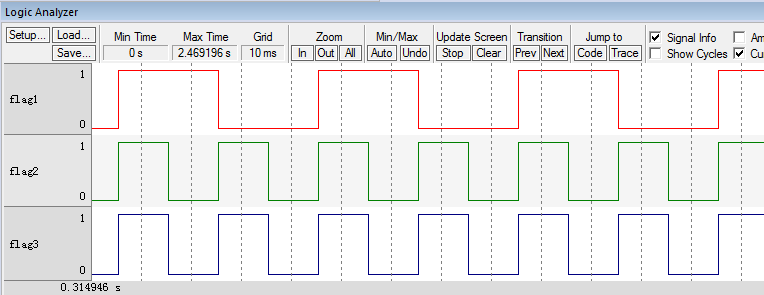

.. vim: syntax=rst

任务的挂起和恢复
===================

本章开始，我们让OS的任务支持挂起和恢复的功能，挂起就相当于暂停，暂停后任务从就绪列表中移除，
恢复即重新将任务插入就绪列表。一个任务挂起多少次就要被恢复多少次才能重新运行。

实现任务的挂起和恢复
~~~~~~~~~~~~~~~~~~~~~~~~~~~~~~

定义任务的状态
^^^^^^^^^^^^^^^^^^^

在任务实现挂起和恢复的时候，要根据任务的状态来操作，任务的状态不同，操作也不同，有关任务状态的宏定义在os.h中实现，
总共有9种状态，具体定义见 代码清单:挂起和恢复-1_。

.. code-block:: c
    :caption: 代码清单:挂起和恢复-1定义任务的状态
    :name: 代码清单:挂起和恢复-1
    :linenos:

    /* ---------- 任务的状态 -------*/
    #define  OS_TASK_STATE_BIT_DLY               (OS_STATE)(0x01u)/*   /-------- 挂起位          */
    /*   |                        */
    #define  OS_TASK_STATE_BIT_PEND              (OS_STATE)(0x02u)/*   | /-----  等待位          */
    *   | |                      */
    #define  OS_TASK_STATE_BIT_SUSPENDED         (OS_STATE)(0x04u)/*   | | /---  延时/超时位      */
    /*   | | |                    */
    /*   V V V                    */

    #define  OS_TASK_STATE_RDY                    (OS_STATE)(  0u)/*   0 0 0  就绪               */
    #define  OS_TASK_STATE_DLY                    (OS_STATE)(  1u)/*   0 0 1  延时或者超时        */
    #define  OS_TASK_STATE_PEND                   (OS_STATE)(  2u)/*   0 1 0  等待               */
    #define  OS_TASK_STATE_PEND_TIMEOUT           (OS_STATE)(  3u)/*   0 1 1  等待+超时*/
    #define  OS_TASK_STATE_SUSPENDED              (OS_STATE)(  4u)/*   1 0 0  挂起               */
    #define  OS_TASK_STATE_DLY_SUSPENDED          (OS_STATE)(  5u)/*   1 0 1  挂起 + 延时或者超时*/
    #define  OS_TASK_STATE_PEND_SUSPENDED         (OS_STATE)(  6u)/*   1 1 0  挂起 + 等待         */
    #define  OS_TASK_STATE_PEND_TIMEOUT_SUSPENDED (OS_STATE)(  7u)/*   1 1 1  挂起 + 等待 + 超时*/
    #define  OS_TASK_STATE_DEL                    (OS_STATE)(255u)

修改任务控制块TCB
^^^^^^^^^^^^^^^^^^^^^^^^^^^^^^

为了实现任务的挂起和恢复，需要先在任务控制中TCB中添加任务的状态TaskState和任务挂起计数器SusPendCtr这两个成员，
具体见 代码清单:挂起和恢复-2_ 的加粗部分。

.. code-block:: c
    :caption: 代码清单:挂起和恢复-2任务TCB
    :emphasize-lines: 28-33
    :name: 代码清单:挂起和恢复-2
    :linenos:

    struct os_tcb {
        CPU_STK         *StkPtr;
        CPU_STK_SIZE    StkSize;

    /* 任务延时周期个数 */
        OS_TICK         TaskDelayTicks;

    /* 任务优先级 */
        OS_PRIO         Prio;

    /* 就绪列表双向链表的下一个指针 */
        OS_TCB          *NextPtr;
    /* 就绪列表双向链表的前一个指针 */
        OS_TCB          *PrevPtr;

    /*时基列表相关字段*/
        OS_TCB          *TickNextPtr;
        OS_TCB          *TickPrevPtr;
        OS_TICK_SPOKE   *TickSpokePtr;

        OS_TICK         TickCtrMatch;
        OS_TICK         TickRemain;

    /* 时间片相关字段 */
        OS_TICK              TimeQuanta;
        OS_TICK              TimeQuantaCtr;

        OS_STATE             TaskState;(1)

    #if OS_CFG_TASK_SUSPEND_EN > 0u(2)
    /* 任务挂起函数OSTaskSuspend()计数器 */
        OS_NESTING_CTR       SuspendCtr;(3)
    #endif

    };

-   代码清单:挂起和恢复-2_ （1）：TaskState用来表示任务的状态，在本章之前，任务出现了两种状态，一是任务刚刚创建好的时候，
    处于就绪态，调用阻塞延时函数的时候处于延时态。本章要实现的是任务的挂起态，再往后的章节中还会有等待态，超时态，
    删除态等。TaskState能够取的值具体见 代码清单:挂起和恢复-1_。

-   代码清单:挂起和恢复-2_ （2）：任务挂起功能是可选的，通过宏OS_CFG_TASK_SUSPEND_EN来控制，该宏在os_cfg.h文件中定义。

-   代码清单:挂起和恢复-2_ （3）：任务挂起计数器，任务每被挂起一次，SuspendCtr递增一次，一个任务挂起多少次就要被恢复多少次才能重新运行。

编写任务挂起和恢复函数
^^^^^^^^^^^^^^^^^^^^^^^^^^^^^^^

OSTaskSuspend()函数
'''''''''''''''''''''''''''''''''

OSTaskSuspend()函数

.. code-block:: c
    :caption: 代码清单:挂起和恢复-3OSTaskSuspend()函数
    :name: 代码清单:挂起和恢复-3
    :linenos:

    #if OS_CFG_TASK_SUSPEND_EN > 0u
    void   OSTaskSuspend (OS_TCB  *p_tcb,
                        OS_ERR  *p_err)
    {
    CPU_SR_ALLOC();

    #if 0/* 屏蔽开始 */                                                     (1)
    #ifdef OS_SAFETY_CRITICAL
    /* 安全检查，OS_SAFETY_CRITICAL_EXCEPTION()函数需要用户自行编写 */
    if (p_err == (OS_ERR *)0) {
        OS_SAFETY_CRITICAL_EXCEPTION();
    return;
    }
    #endif

    #if OS_CFG_CALLED_FROM_ISR_CHK_EN > 0u
    /* 不能在ISR程序中调用该函数 */
    if (OSIntNestingCtr > (OS_NESTING_CTR)0) {
        *p_err = OS_ERR_TASK_SUSPEND_ISR;
    return;
    }
    #endif

    /* 不能挂起空闲任务 */
    if (p_tcb == &OSIdleTaskTCB) {
        *p_err = OS_ERR_TASK_SUSPEND_IDLE;
    return;
    }

    #if OS_CFG_ISR_POST_DEFERRED_EN > 0u
    /* 不能挂起中断处理任务 */
    if (p_tcb == &OSIntQTaskTCB) {
        *p_err = OS_ERR_TASK_SUSPEND_INT_HANDLER;
    return;
    }
    #endif

    #endif/* 屏蔽结束 */                                                   (2)

    CPU_CRITICAL_ENTER();

    /* 是否挂起自己 */                                                      (3)
    if (p_tcb == (OS_TCB *)0) {
        p_tcb = OSTCBCurPtr;
    }

    if (p_tcb == OSTCBCurPtr) {
    /* 如果调度器锁住则不能挂起自己 */
    if (OSSchedLockNestingCtr > (OS_NESTING_CTR)0) {
            CPU_CRITICAL_EXIT();
            *p_err = OS_ERR_SCHED_LOCKED;
    return;
        }
    }

    *p_err = OS_ERR_NONE;

    /* 根据任务的状态来决定挂起的动作 */(4)
    switch (p_tcb->TaskState) {
    case OS_TASK_STATE_RDY:(5)
        OS_CRITICAL_ENTER_CPU_CRITICAL_EXIT();
        p_tcb->TaskState  =  OS_TASK_STATE_SUSPENDED;
        p_tcb->SuspendCtr = (OS_NESTING_CTR)1;
        OS_RdyListRemove(p_tcb);
        OS_CRITICAL_EXIT_NO_SCHED();
    break;

    case OS_TASK_STATE_DLY:(6)
        p_tcb->TaskState  = OS_TASK_STATE_DLY_SUSPENDED;
        p_tcb->SuspendCtr = (OS_NESTING_CTR)1;
        CPU_CRITICAL_EXIT();
    break;

    case OS_TASK_STATE_PEND:(7)
        p_tcb->TaskState  = OS_TASK_STATE_PEND_SUSPENDED;
        p_tcb->SuspendCtr = (OS_NESTING_CTR)1;
        CPU_CRITICAL_EXIT();
    break;

    case OS_TASK_STATE_PEND_TIMEOUT:(8)
        p_tcb->TaskState  = OS_TASK_STATE_PEND_TIMEOUT_SUSPENDED;
        p_tcb->SuspendCtr = (OS_NESTING_CTR)1;
        CPU_CRITICAL_EXIT();
    break;

    case OS_TASK_STATE_SUSPENDED:(9)
    case OS_TASK_STATE_DLY_SUSPENDED:
    case OS_TASK_STATE_PEND_SUSPENDED:
    case OS_TASK_STATE_PEND_TIMEOUT_SUSPENDED:
        p_tcb->SuspendCtr++;
        CPU_CRITICAL_EXIT();
    break;

    default:(10)
        CPU_CRITICAL_EXIT();
        *p_err = OS_ERR_STATE_INVALID;
    return;
    }

    /* 任务切换 */
        OSSched();(11)
    }
    #endif

-   代码清单:挂起和恢复-3_ （1）和（2）：这部分代码是为了程序的健壮性写的代码，即是加了各种判断，
    避免用户的误操作。在μC/OS-III中，这段代码随处可见，但为了讲解方便，我们把这部分代码注释掉，
    里面涉及的一些宏和函数我们均不实现，只需要了解即可，在后面的讲解中，要是出现这段代码，
    我们直接删除掉，删除掉也不会影响核心功能。

-   代码清单:挂起和恢复-3_ （3）：如果任务挂起的是自己，则判断下调度器是否锁住，如果锁住则退出返回错误码，没有锁则继续往下执行。

-   代码清单:挂起和恢复-3_ （4）：根据任务的状态来决定挂起操作。

-   代码清单:挂起和恢复-3_ （5）：任务在就绪状态，则将任务的状态改为挂起态，挂起计数器置1，然后从就绪列表删除。

-   代码清单:挂起和恢复-3_ （6）：任务在延时状态，则将任务的状态改为延时加挂起态，挂起计数器置1，不用改变TCB的位置，即还是在延时的时基列表。

-   代码清单:挂起和恢复-3_ （7）：任务在等待状态，则将任务的状态改为等待加挂起态，挂起计数器置1，不用改变TCB的位置，即还是在等待列表等待。
    等待列表暂时还没有实现，将会在后面的章节实现。

-   代码清单:挂起和恢复-3_ （8）：任务在等待加超时态，
    则将任务的状态改为等待加超时加挂起态，挂起计数器置1，不用改变TCB的位置，即还在等待和时基这两个列表中。

-   代码清单:挂起和恢复-3_ （9）：只要有一个是挂起状态，则将挂起计数器加一操作，不用改变TCB的位置。

-   代码清单:挂起和恢复-3_ （10）：其他状态则无效，退出返回状态无效错误码。

-   代码清单:挂起和恢复-3_ （11）：任务切换。凡是涉及改变任务状态的地方，都需要进行任务切换。

OSTaskResume()函数
''''''''''''''''''''''''''''''''

OSTaskResume()函数用于恢复被挂起的函数，但是不能恢复自己，挂起倒是可以挂起自己，具体实现见 代码清单:挂起和恢复-4_。

.. code-block:: c
    :caption: 代码清单:挂起和恢复-4OSTaskResume()函数
    :name: 代码清单:挂起和恢复-4
    :linenos:

    #if OS_CFG_TASK_SUSPEND_EN > 0u
    void  OSTaskResume (OS_TCB  *p_tcb,
                        OS_ERR  *p_err)
    {
        CPU_SR_ALLOC();

    #if 0/* 屏蔽开始 */(1)
    #ifdef OS_SAFETY_CRITICAL
    /* 安全检查，OS_SAFETY_CRITICAL_EXCEPTION()函数需要用户自行编写 */
    if (p_err == (OS_ERR *)0) {
            OS_SAFETY_CRITICAL_EXCEPTION();
    return;
        }
    #endif

    #if OS_CFG_CALLED_FROM_ISR_CHK_EN > 0u
    /* 不能在ISR程序中调用该函数 */
    if (OSIntNestingCtr > (OS_NESTING_CTR)0) {
            *p_err = OS_ERR_TASK_RESUME_ISR;
    return;
        }
    #endif

        CPU_CRITICAL_ENTER();
    #if OS_CFG_ARG_CHK_EN > 0u
    /* 不能自己恢复自己 */
    if ((p_tcb == (OS_TCB *)0) ||
            (p_tcb == OSTCBCurPtr)) {
            CPU_CRITICAL_EXIT();
            *p_err = OS_ERR_TASK_RESUME_SELF;
    return;
        }
    #endif

    #endif/* 屏蔽结束 */(2)

        *p_err  = OS_ERR_NONE;
    /* 根据任务的状态来决定挂起的动作 */
    switch (p_tcb->TaskState) {(3)
    case OS_TASK_STATE_RDY:(4)
    case OS_TASK_STATE_DLY:
    case OS_TASK_STATE_PEND:
    case OS_TASK_STATE_PEND_TIMEOUT:
            CPU_CRITICAL_EXIT();
            *p_err = OS_ERR_TASK_NOT_SUSPENDED;
    break;

    case OS_TASK_STATE_SUSPENDED:(5)
            OS_CRITICAL_ENTER_CPU_CRITICAL_EXIT();
            p_tcb->SuspendCtr--;
    if (p_tcb->SuspendCtr == (OS_NESTING_CTR)0) {
                p_tcb->TaskState = OS_TASK_STATE_RDY;
                OS_TaskRdy(p_tcb);
            }
            OS_CRITICAL_EXIT_NO_SCHED();
    break;

    case OS_TASK_STATE_DLY_SUSPENDED:(6)
            p_tcb->SuspendCtr--;
    if (p_tcb->SuspendCtr == (OS_NESTING_CTR)0) {
                p_tcb->TaskState = OS_TASK_STATE_DLY;
            }
            CPU_CRITICAL_EXIT();
    break;

    case OS_TASK_STATE_PEND_SUSPENDED:(7)
            p_tcb->SuspendCtr--;
    if (p_tcb->SuspendCtr == (OS_NESTING_CTR)0) {
                p_tcb->TaskState = OS_TASK_STATE_PEND;
            }
            CPU_CRITICAL_EXIT();
    break;

    case OS_TASK_STATE_PEND_TIMEOUT_SUSPENDED:(8)
            p_tcb->SuspendCtr--;
    if (p_tcb->SuspendCtr == (OS_NESTING_CTR)0) {
                p_tcb->TaskState = OS_TASK_STATE_PEND_TIMEOUT;
            }
            CPU_CRITICAL_EXIT();
    break;

    default:(9)
            CPU_CRITICAL_EXIT();
            *p_err = OS_ERR_STATE_INVALID;
    return;
        }

    /* 任务切换 */
        OSSched();(10)
    }
    #endif

-   代码清单:挂起和恢复-4_ （1）和（2）：这部分代码是为了程序的健壮性写的代码，即是加了各种判断，避免用户的误操作。
    在μC/OS-III中，这段代码随处可见，但为了讲解方便，我们把这部分代码注释掉，里面涉及的一些宏和函数我们均不实现，
    只需要了解即可，在后面的讲解中，要是出现这段代码，我们直接删除掉，删除掉也不会影响核心功能。

-   代码清单:挂起和恢复-4_ （3）：根据任务的状态来决定恢复操作。

-   代码清单:挂起和恢复-4_ （4）：只要任务没有被挂起，则退出返回任务没有被挂起的错误码。

-   代码清单:挂起和恢复-4_ （5）：任务只在挂起态，
    则递减挂起计数器SuspendCtr，如果SuspendCtr等于0，则将任务的状态改为就绪态，并让任务就绪。

-   代码清单:挂起和恢复-4_ （6）：任务在延时加挂起态，
    则递减挂起计数器SuspendCtr，如果SuspendCtr等于0，则将任务的状态改为延时态。

-   代码清单:挂起和恢复-4_ （7）：任务在延时加等待态，
    则递减挂起计数器SuspendCtr，如果SuspendCtr等于0，则将任务的状态改为等待态。

-   代码清单:挂起和恢复-4_ （8）：任务在等待加超时加挂起态，
    则递减挂起计数器SuspendCtr，如果SuspendCtr等于0，则将任务的状态改为等待加超时态

-   代码清单:挂起和恢复-4_ （9）：其他状态则无效，退出返回状态无效错误码。

-   代码清单:挂起和恢复-4_ （10）：任务切换。凡是涉及改变任务状态的地方，都需要进行任务切换。

main()函数
~~~~~~~~~~~~~~~~~~~~~~~~

这里，我们创建任务1、2和3，其中任务的优先级为1，任务2的优先级为2，任务3的优先级为3。任务1将自身的flag每翻转一次后均将自己挂起，
任务2在经过两个时钟周期后将任务1恢复，任务3每隔一个时钟周期翻转一次。具体代码见 代码清单:挂起和恢复-5_。

.. code-block:: c
    :caption: 代码清单:挂起和恢复-5 main()函数
    :name: 代码清单:挂起和恢复-5
    :linenos:

    int main(void)
    {
        OS_ERR err;

    /* CPU初始化：1、初始化时间戳 */
        CPU_Init();

    /* 关闭中断 */
        CPU_IntDis();

    /* 配置SysTick 10ms 中断一次 */
        OS_CPU_SysTickInit (10);

    /* 初始化相关的全局变量 */
        OSInit(&err);

    /* 创建任务 */
        OSTaskCreate( (OS_TCB       *)&Task1TCB,
                    (OS_TASK_PTR   )Task1,
                    (void         *)0,
                    (OS_PRIO       )1,
                    (CPU_STK      *)&Task1Stk[0],
                    (CPU_STK_SIZE  )TASK1_STK_SIZE,
                    (OS_TICK       )0,
                    (OS_ERR       *)&err );

        OSTaskCreate( (OS_TCB       *)&Task2TCB,
                    (OS_TASK_PTR   )Task2,
                    (void         *)0,
                    (OS_PRIO       )2,
                    (CPU_STK      *)&Task2Stk[0],
                    (CPU_STK_SIZE  )TASK2_STK_SIZE,
                    (OS_TICK       )0,
                    (OS_ERR       *)&err );

        OSTaskCreate( (OS_TCB       *)&Task3TCB,
                    (OS_TASK_PTR   )Task3,
                    (void         *)0,
                    (OS_PRIO       )3,
                    (CPU_STK      *)&Task3Stk[0],
                    (CPU_STK_SIZE  )TASK3_STK_SIZE,
                    (OS_TICK       )0,
                    (OS_ERR       *)&err );

    /* 启动OS，将不再返回 */
        OSStart(&err);
    }

    void Task1( void *p_arg )
    {
        OS_ERR err;

    for ( ;; ) {
            flag1 = 1;
            OSTaskSuspend(&Task1TCB,&err);
            flag1 = 0;
            OSTaskSuspend(&Task1TCB,&err);
        }
    }

    void Task2( void *p_arg )
    {
        OS_ERR err;

    for ( ;; ) {
            flag2 = 1;
            OSTimeDly(1);
    //OSTaskResume(&Task1TCB,&err);
            flag2 = 0;
            OSTimeDly(1);;
            OSTaskResume(&Task1TCB,&err);
        }
    }

    void Task3( void *p_arg )
    {
    for ( ;; ) {
            flag3 = 1;
            OSTimeDly(1);
            flag3 = 0;
            OSTimeDly(1);
        }
    }

实验现象
~~~~~~~~~~~~

进入软件调试，单击全速运行按钮就可看到实验波形，具体见图 实验现象_。在图 实验现象_ 中，可以看到任务2和任务3的波形图是一样的，
任务1的波形周期是任务2的两倍，与代码实现相符。如果想实现其他效果可自行修改代码实现。

