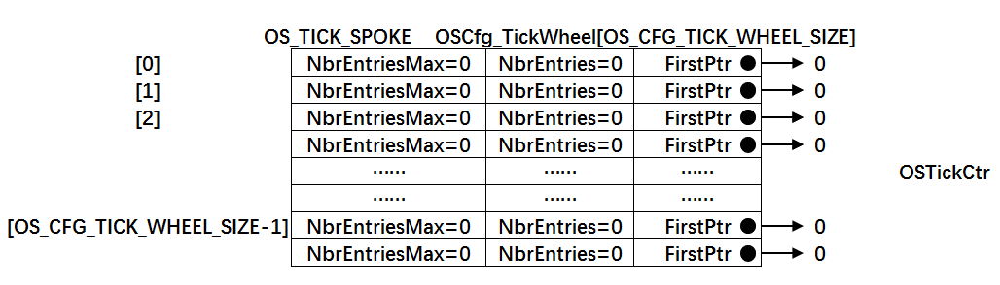
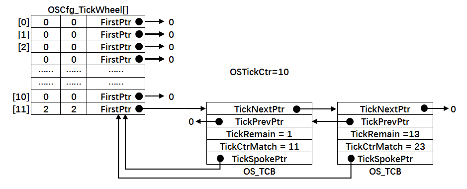
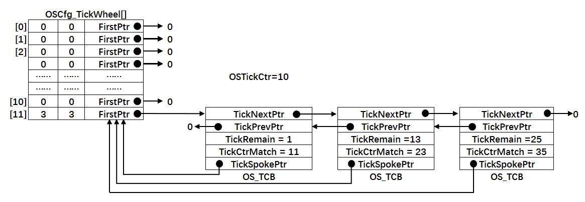
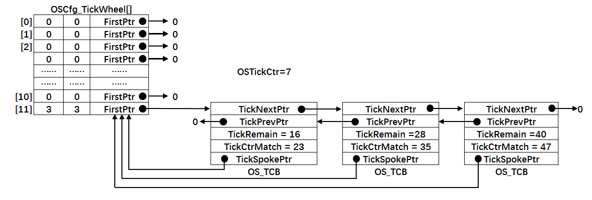

.. vim: syntax=rst

实现时基列表
================
从本章开始，我们在OS中加入时基列表，时基列表是跟时间相关的，处于延时的任务和等待事件有超时限制的任务都会从就绪列表中移除，然后插
入时基列表。时基列表在OSTimeTick中更新，如果任务的延时时间结束或者超时到期，就会让任务就绪，从时基列表移除，插入就绪列表。到目前
为止，我们在OS中只实现了两个列表，一个是就绪列表，一个是本章将要实现的时基列表，在本章之前，任务要么在就绪列表，要么在时基列表。

实现时基列表
~~~~~~~~~~~~~~~~~~

定义时基列表变量
^^^^^^^^^^^^^^^^^^^^^^^^

时基列表在代码层面上由全局数组OSCfg_TickWheel[]和全局变量OSTickCtr构成，一个空的时基列表示意图见
图 空的时基列表_ ，时基列表的代码实现具体见 代码清单:时基列表-1_。

.. code-block:: c
    :caption: 代码清单:时基列表-1时基列表定义
    :name: 代码清单:时基列表-1
    :linenos:

    /* 时基列表大小，在os_cfg_app.h 定义 */
    #define  OS_CFG_TICK_WHEEL_SIZE           17u

    /* 在os_cfg_app.c 定义 */
    /* 时基列表 */
    (1)(2)
    OS_TICK_SPOKE  OSCfg_TickWheel[OS_CFG_TICK_WHEEL_SIZE];
    /* 时基列表大小 */
    OS_OBJ_QTY const OSCfg_TickWheelSize = (OS_OBJ_QTY  )OS_CFG_TICK_WHEEL_SIZE;

    /* 在os.h中声明 */
    /* 时基列表 */
    extern  OS_TICK_SPOKE  OSCfg_TickWheel[];
    /* 时基列表大小 */
    extern  OS_OBJ_QTY    const OSCfg_TickWheelSize;

    /* Tick 计数器，在os.h中定义 */
    OS_EXT            OS_TICK                OSTickCtr;(3)

-   代码清单:时基列表-1_ （1）：OS_TICK_SPOKE为时基列表数组OSCfg_TickWheel[]的数据类型，
    在os.h文件定义，具体见 代码清单:时基列表-2_。

.. code-block:: c
    :caption: 代码清单:时基列表-2OS_TICK_SPOKE定义
    :name: 代码清单:时基列表-2
    :linenos:

    typedefstruct  os_tick_spoke       OS_TICK_SPOKE;(1)

    struct  os_tick_spoke {
        OS_TCB              *FirstPtr;(2)
        OS_OBJ_QTY           NbrEntries;(3)
        OS_OBJ_QTY           NbrEntriesMax;(4)
    };

-   代码清单:时基列表-2_ （1）：在μC/OS-III中，内核对象的数据类型都会用大写字母重新定义。

-   代码清单:时基列表-2_ （2）：时基列表OSCfg_TickWheel[]的每个成员都包含一条单向链表，
    被插入该条链表的TCB会按照延时时间做升序排列。FirstPtr用于指向这条单向链表的第一个节点。

-   代码清单:时基列表-2_ （3）：时基列表OSCfg_TickWheel[]的每个成员都包含一条单向链表，
    NbrEntries表示该条单向链表当前有多少个节点。

-   代码清单:时基列表-2_ （4）：时基列表OSCfg_TickWheel[]的每个成员都包含一条单向链表，
    NbrEntriesMax记录该条单向链表最多的时候有多少个节点，
    在增加节点的时候会刷新，在删除节点的时候不刷新。

-   代码清单:时基列表-1_ （2）：OS_CFG_TICK_WHEEL_SIZE是一个宏，
    在os_cfg_app.h中定义，用于控制时基列表的大小。OS_CFG_TICK_WHEEL_SIZE的推
    荐值为任务数/4，不推荐使用偶数，如果算出来是偶数，则加1变成质数，实际上质数是一个很好的选择。

-   代码清单:时基列表-1_ （3）：OSTickCtr为SysTick周期计数器，
    记录系统启动到现在或者从上一次复位到现在经过了多少个SysTick周期。

修改任务控制块TCB
^^^^^^^^^^^^^^^^^^^^^^^^^^^^^^

时基列表OSCfg_TickWheel[]的每个成员都包含一条单向链表，被插入该条链表的TCB会按照延时时间做升序排列，为了TCB能按照延时时间从小到大串接在一起，
需要在TCB中加入几个成员，具体见 代码清单:时基列表-3_ 的加粗部分。

.. code-block:: c
    :caption: 代码清单:时基列表-3在TCB中加入时基列表相关字段
    :emphasize-lines: 17-22
    :name: 代码清单:时基列表-3
    :linenos:

    struct os_tcb {
        CPU_STK         *StkPtr;
        CPU_STK_SIZE    StkSize;

        /* 任务延时周期个数 */
        OS_TICK         TaskDelayTicks;

        /* 任务优先级 */
        OS_PRIO         Prio;

        /* 就绪列表双向链表的下一个指针 */
        OS_TCB          *NextPtr;
        /* 就绪列表双向链表的前一个指针 */
        OS_TCB          *PrevPtr;

        /* 时基列表相关字段 */
        OS_TCB          *TickNextPtr;(1)
        OS_TCB          *TickPrevPtr;(2)
        OS_TICK_SPOKE   *TickSpokePtr;(5)

        OS_TICK         TickCtrMatch;(4)
        OS_TICK         TickRemain;(3)
    };

代码清单:时基列表-3_ 加粗部分的字段可以配合图 时基列表中有两个TCB_ 一起理解，这样会比较容易。图 时基列表中有两个TCB_ 是在时基列表
OSCfg_TickWheel[]索引11这条链表里面插入了两个TCB，一个需要延时1个时钟周期，另外一个需要延时13个时钟周期。

-   代码清单:时基列表-3_ （1）：TickNextPtr用于指向链表中的下一个TCB节点。

-   代码清单:时基列表-3_ （2）：TickPrevPtr用于指向链表中的上一个TCB节点。

-   代码清单:时基列表-3_ （3）：TickRemain用于设置任务还需要等待多少个时钟周期，每到来一个时钟周期，该值会递减。

-   代码清单:时基列表-3_ （4）：TickCtrMatch的值等于时基计数器OSTickCtr的值加上TickRemain的值，
    当TickCtrMatch的值等于OSTickCtr的值的时候，表示等待到期，TCB会从链表中删除。

-   代码清单:时基列表-3_ （5）：每个被插入链表的TCB都包含一个字段TickSpokePtr，用于回指到链表的根部。

实现时基列表相关函数
^^^^^^^^^^^^^^^^^^^^^^^^^^^^^^

时基列表相关函数在os_tick.c实现，在os.h中声明。如果os_tick.c文件是第一次使用，
需要自行在文件夹μC/OS-III\Source中新建并添加到工程的μC/OS-III Source组。

OS_TickListInit()函数
''''''''''''''''''''''''''''''''''

OS_TickListInit()函数用于初始化时基列表，即将全局变量OSCfg_TickWheel[]的数据域全部初始化为0，
一个初始化为0的的时基列表见图 时基列表的数据域全部被初始化为0_。

.. code-block:: c
    :caption: 代码清单:时基列表-4OS_TickListInit()函数
    :name: 代码清单:时基列表-4
    :linenos:

    /* 初始化时基列表的数据域 */
    void  OS_TickListInit (void)
    {
        OS_TICK_SPOKE_IX   i;
        OS_TICK_SPOKE     *p_spoke;

        for (i = 0u; i < OSCfg_TickWheelSize; i++) {
            p_spoke                = (OS_TICK_SPOKE *)&OSCfg_TickWheel[i];
            p_spoke->FirstPtr      = (OS_TCB        *)0;
            p_spoke->NbrEntries    = (OS_OBJ_QTY     )0u;
            p_spoke->NbrEntriesMax = (OS_OBJ_QTY     )0u;
        }
    }

OS_TickListInsert()函数
'''''''''''''''''''''''''''''''''''''''''

OS_TickListInsert()函数用于往时基列表中插入一个任务TCB，具体实现见 代码清单:时基列表-5_。
代码清单:时基列表-5_ 可配和图 时基列表中有三个TCB_ 一起阅读，这样理解起来会容易很多。

.. code-block:: c
    :caption: 代码清单:时基列表-5OS_TickListInsert()函数
    :name: 代码清单:时基列表-5
    :linenos:

    /* 将一个任务插入时基列表，根据延时时间的大小升序排列 */
    void  OS_TickListInsert (OS_TCB *p_tcb,OS_TICK time)
    {
        OS_TICK_SPOKE_IX   spoke;
        OS_TICK_SPOKE     *p_spoke;
        OS_TCB            *p_tcb0;
        OS_TCB            *p_tcb1;

        p_tcb->TickCtrMatch = OSTickCtr + time;(1)
        p_tcb->TickRemain   = time;(2)

        spoke   = (OS_TICK_SPOKE_IX)(p_tcb->TickCtrMatch % OSCfg_TickWheelSize);(3)
        p_spoke = &OSCfg_TickWheel[spoke];(4)

        /* 插入 OSCfg_TickWheel[spoke] 的第一个节点 */
        if (p_spoke->NbrEntries == (OS_OBJ_QTY)0u) (5)
        {
            p_tcb->TickNextPtr   = (OS_TCB   *)0;
            p_tcb->TickPrevPtr   = (OS_TCB   *)0;
            p_spoke->FirstPtr    =  p_tcb;
            p_spoke->NbrEntries  = (OS_OBJ_QTY)1u;
        }
        /* 如果插入的不是第一个节点，则按照TickRemain大小升序排列 */
        else (6)
        {
            /* 获取第一个节点指针 */
            p_tcb1 = p_spoke->FirstPtr;
            while (p_tcb1 != (OS_TCB *)0)
            {
                /* 计算比较节点的剩余时间 */
                p_tcb1->TickRemain = p_tcb1->TickCtrMatch - OSTickCtr;

                /* 插入比较节点的后面 */
                if (p_tcb->TickRemain > p_tcb1->TickRemain)
                {
                    if (p_tcb1->TickNextPtr != (OS_TCB *)0)
                    {
                        /* 寻找下一个比较节点 */
                        p_tcb1 =  p_tcb1->TickNextPtr;
                    }
                    else
                    {  /* 在最后一个节点插入 */
                        p_tcb->TickNextPtr   = (OS_TCB *)0;
                        p_tcb->TickPrevPtr   =  p_tcb1;
                        p_tcb1->TickNextPtr  =  p_tcb;
                        p_tcb1               = (OS_TCB *)0;(7)
                    }
                }
                /* 插入比较节点的前面 */
                else
                {
                    /* 在第一个节点插入 */
                    if (p_tcb1->TickPrevPtr == (OS_TCB *)0) {
                        p_tcb->TickPrevPtr   = (OS_TCB *)0;
                        p_tcb->TickNextPtr   =  p_tcb1;
                        p_tcb1->TickPrevPtr  =  p_tcb;
                        p_spoke->FirstPtr    =  p_tcb;
                    }
                    else
                    {
                        /* 插入两个节点之间 */
                        p_tcb0               =  p_tcb1->TickPrevPtr;
                        p_tcb->TickPrevPtr   =  p_tcb0;
                        p_tcb->TickNextPtr   =  p_tcb1;
                        p_tcb0->TickNextPtr  =  p_tcb;
                        p_tcb1->TickPrevPtr  =  p_tcb;
                    }
                    /* 跳出while循环 */
                    p_tcb1 = (OS_TCB *)0;(8)
                }
            }

            /* 节点成功插入 */
            p_spoke->NbrEntries++;(9)
        }

        /* 刷新NbrEntriesMax的值 */
        if (p_spoke->NbrEntriesMax < p_spoke->NbrEntries) (10)
        {
            p_spoke->NbrEntriesMax = p_spoke->NbrEntries;
        }

        /* 任务TCB中的TickSpokePtr回指根节点 */
        p_tcb->TickSpokePtr = p_spoke;(11)
    }

-   代码清单:时基列表-5_ （1）：TickCtrMatch的值等于当前时基计数器的值OSTickCtr加上任务要延时的时间time，
    time由函数形参传进来。OSTickCtr是一个全局变量，
    记录的是系统自启动以来或者自上次复位以来经过了多少个SysTick周期。OSTickCtr的值每经过一个SysTick周期其值就加一，当TickCtrMatch的值与其相等时，就表示任务等待时间到期。

-   代码清单:时基列表-5_ （2）：将任务需要延时的时间time保存到TCB的TickRemain，
    它表示任务还需要延时多少个SysTick周期，每到来一个SysTick周期，TickRemain会减一。

-   代码清单:时基列表-5_ （3）：由任务的TickCtrMatch 对时基列表的大小OSCfg_TickWheelSize进行求余操作，
    得出的值spoke作为时基列表OSCfg_TickWheel[]的索引。只要是任务的TickCtrMatch对OSCfg_TickWheelSize求余后得到的值spoke相等，
    那么任务的TCB就会被插入OSCfg_TickWheel[spoke]下的单向链表中，节点按照任务的TickCtrMatch值做升序排列。
    举例：在图 时基列表中有三个TCB_ 中，时基列表OSCfg_TickWheel[]的大小OSCfg_TickWheelSize等于12，
    当前时基计数器OSTickCtr的值为10，有三个任务分别需要延时TickTemain=1、TickTemain=23和TickTemain=25个时钟周期，
    三个任务的TickRemain加上OSTickCtr可分别得出它们的TickCtrMatch等于11、23和35，
    这三个任务的TickCtrMatch对OSCfg_TickWheelSize求余操作后的值spoke都等于11，所以这三个任务的TCB会被插入OSCfg_TickWheel[11]下的同一条链表，
    节点顺序根据TickCtrMatch的值做升序排列。

-   代码清单:时基列表-5_ （4）：根据刚刚算出的索引值spoke，获取到该索引值下的成员的地址，
    也叫根指针，因为该索引下对应的成员OSCfg_TickWheel[spoke]会维护一条双向的链表。

-   代码清单:时基列表-5_ （5）：将TCB插入链表中分两种情况，第一是当前链表是空的，
    插入的节点将成为第一个节点，这个处理非常简单；第二是当前链表已经有节点。

-   代码清单:时基列表-5_ （6）：当前的链表中已经有节点，插入的时候则根据TickCtrMatch的值做升序排列，
    插入的时候分三种情况，第一是在最后一个节点之间插入，
    第二是在第一个节点插入，第三是在两个节点之间插入。

-   代码清单:时基列表-5_ （7）（8）：节点成功插入p_tcb1指针，跳出while循环

-   代码清单:时基列表-5_ （9）：节点成功插入，记录当前链表节点个数的计数器NbrEntries加一。

-   代码清单:时基列表-5_ （10）：刷新NbrEntriesMax的值,NbrEntriesMax用于记录当前链表曾经最多有多少个节点，
    只有在增加节点的时候才刷新，在删除节点的时候是不刷新的。

-   代码清单:时基列表-5_ （11）：任务TCB被成功插入链表，TCB中的TickSpokePtr回指所在链表的根指针。

OS_TickListRemove()函数
'''''''''''''''''''''''''''''''''''''''''

OS_TickListRemove()用于从时基列表删除一个指定的TCB节点，具体实现见。代码清单:时基列表-6_

.. code-block:: c
    :caption: 代码清单:时基列表-6OS_TickListRemove()函数
    :name: 代码清单:时基列表-6
    :linenos:

    /* 从时基列表中移除一个任务 */
    void  OS_TickListRemove (OS_TCB  *p_tcb)
    {
        OS_TICK_SPOKE  *p_spoke;
        OS_TCB         *p_tcb1;
        OS_TCB         *p_tcb2;

        /* 获取任务TCB所在链表的根指针 */
        p_spoke = p_tcb->TickSpokePtr;(1)

        /* 确保任务在链表中 */
        if (p_spoke != (OS_TICK_SPOKE *)0)
        {
            /* 将剩余时间清零 */
            p_tcb->TickRemain = (OS_TICK)0u;

            /* 要移除的刚好是第一个节点 */
            if (p_spoke->FirstPtr == p_tcb) (2)
            {
                /* 更新第一个节点，原来的第一个节点需要被移除 */
                p_tcb1            = (OS_TCB *)p_tcb->TickNextPtr;
                p_spoke->FirstPtr = p_tcb1;
                if (p_tcb1 != (OS_TCB *)0)
                {
                    p_tcb1->TickPrevPtr = (OS_TCB *)0;
                }
            }
            /* 要移除的不是第一个节点 */(3)
            else
            {
                /* 保存要移除的节点的前后节点的指针 */
                p_tcb1              = p_tcb->TickPrevPtr;
                p_tcb2              = p_tcb->TickNextPtr;

                /* 节点移除，将节点前后的两个节点连接在一起 */
                p_tcb1->TickNextPtr = p_tcb2;
                if (p_tcb2 != (OS_TCB *)0)
                {
                    p_tcb2->TickPrevPtr = p_tcb1;
                }
            }

            /* 复位任务TCB中时基列表相关的字段成员 */(4)
            p_tcb->TickNextPtr  = (OS_TCB        *)0;
            p_tcb->TickPrevPtr  = (OS_TCB        *)0;
            p_tcb->TickSpokePtr = (OS_TICK_SPOKE *)0;
            p_tcb->TickCtrMatch = (OS_TICK        )0u;

            /* 节点减1 */
            p_spoke->NbrEntries--;(5)
        }
    }

-   代码清单:时基列表-6_ （1）：获取任务TCB所在链表的根指针。

-   代码清单:时基列表-6_ （2）：要删除的节点是链表的第一个节点，这个操作很好处理，只需更新下第一个节点即可。

-   代码清单:时基列表-6_ （3）：要删除的节点不是链表的第一个节点，则先保存要删除的节点的前后节点，然后把这前后两个节点相连即可。

-   代码清单:时基列表-6_ （4）：复位任务TCB中时基列表相关的字段成员。

-   代码清单:时基列表-6_ （5）：节点删除成功，链表中的节点计数器NbrEntries减一。

OS_TickListUpdate()函数
'''''''''''''''''''''''''''''''''''''''''

OS_TickListUpdate()在每个SysTick周期到来时在OSTimeTick()被调用，用于更新时基计数器OSTickCtr，
扫描时基列表中的任务延时是否到期，具体实现见 代码清单:时基列表-7_。

.. code-block:: c
    :caption: 代码清单:时基列表-7OS_TickListUpdate()函数
    :name: 代码清单:时基列表-7
    :linenos:

    void  OS_TickListUpdate (void)
    {
        OS_TICK_SPOKE_IX   spoke;
        OS_TICK_SPOKE     *p_spoke;
        OS_TCB            *p_tcb;
        OS_TCB            *p_tcb_next;
        CPU_BOOLEAN        done;

        CPU_SR_ALLOC();

        /* 进入临界段 */
        OS_CRITICAL_ENTER();

        /* 时基计数器++ */
        OSTickCtr++;(1)

        spoke    = (OS_TICK_SPOKE_IX)(OSTickCtr % OSCfg_TickWheelSize);(2)
        p_spoke  = &OSCfg_TickWheel[spoke];

        p_tcb    = p_spoke->FirstPtr;
        done     = DEF_FALSE;

        while (done == DEF_FALSE)
        {
            if (p_tcb != (OS_TCB *)0) (3)
            {
                p_tcb_next = p_tcb->TickNextPtr;

                p_tcb->TickRemain = p_tcb->TickCtrMatch - OSTickCtr;(4)

                /* 节点延时时间到 */
                if (OSTickCtr == p_tcb->TickCtrMatch) (5)
                {
                    /* 让任务就绪 */
                    OS_TaskRdy(p_tcb);
                }
                else (6)
                {
                    /* 如果第一个节点延时期未满，则退出while循环
                    因为链表是根据升序排列的，第一个节点延时期未满，那后面的肯定未满 */
                    done = DEF_TRUE;
                }

                /* 如果第一个节点延时期满，则继续遍历链表，看看还有没有延时期满的任务
                如果有，则让它就绪 */
                p_tcb = p_tcb_next;(7)
            }
            else
            {
                done  = DEF_TRUE;(8)
            }
        }

        /* 退出临界段 */
        OS_CRITICAL_EXIT();
    }

-   代码清单:时基列表-7_ （1）：每到来一个SysTick时钟周期，时基计数器OSTickCtr都要加一操作。

-   代码清单:时基列表-7_ （2）：计算要扫描的时基列表的索引，每次只扫描一条链表。
    时基列表里面有可能有多条链表，为啥只扫描其中一条链表就可以？因为任务在插入时基列表的时候，
    插入的索引值spoke_insert是通过TickCtrMatch对OSCfg_TickWheelSize求余得出，
    现在需要扫描的索引值spoke_update是通过OSTickCtr对OSCfg_TickWheelSize求余得出，
    TickCtrMatch的值等于OSTickCt加上TickRemain，只有在经过TickRemain个时钟周期后，
    spoke_update的值才有可能等于spoke_insert。如果算出的spoke_update小于spoke_insert，
    且OSCfg_TickWheel[spoke_update]下的链表的任务没有到期，那后面的肯定都没有到期，不用继续扫描。

举例，在 图时基列表中有三个TCB_ ，时基列表OSCfg_TickWheel[]的大小OSCfg_TickWheelSize等于12，
当前时基计数器OSTickCtr的值为7，有三个任务分别需要延时TickTemain=16、TickTemain=28和TickTemain=40个时钟周期，
三个任务的TickRemain加上OSTickCtr可分别得出它们的TickCtrMatch等于23、35和47，
这三个任务的TickCtrMatch对OSCfg_TickWheelSize求余操作后的值spoke都等于11，
所以这三个任务的TCB会被插入OSCfg_TickWheel[11]下的同一条链表，节点顺序根据TickCtrMatch的值做升序排列。
当下一个SysTick时钟周期到来的时候，会调用OS_TickListUpdate()函数，这时OSTickCtr加一操作后等于8，
对OSCfg_TickWheelSize（等于12）求余算得要扫描更新的索引值spoke_update等8，则对OSCfg_TickWheel[8]下面的链表进行扫描，
从 图时基列表中有三个TCB_ 可以得知，8这个索引下没有节点，则直接退出，刚刚插入的三个TCB是在OSCfg_TickWheel[11]下的链表，
根本不用扫描，因为时间只是刚刚过了1个时钟周期而已，远远没有达到他们需要的延时时间。

-   代码清单:时基列表-7_ （3）：判断链表是否为空，为空则跳转到第（8）步骤。

-   代码清单:时基列表-7_ （4）：链表不为空，递减第一个节点的TickRemain。

-   代码清单:时基列表-7_ （5）：判断第一个节点的延时时间是否到，如果到期，让任务就绪，
    即将任务从时基列表删除，插入就绪列表，这两步由函数OS_TaskRdy()来完成，
    该函数在os_core.c中定义，具体实现见 代码清单:时基列表-8_。

.. code-block:: c
    :caption: 代码清单:时基列表-8OS_TaskRdy()函数
    :name: 代码清单:时基列表-8
    :linenos:

    void  OS_TaskRdy (OS_TCB  *p_tcb)
    {
        /* 从时基列表删除 */
        OS_TickListRemove(p_tcb);

        /* 插入就绪列表 */
        OS_RdyListInsert(p_tcb);
    }

-   代码清单:时基列表-7_ （6）：如果第一个节点延时期未满，则退出while循环，
    因为链表是根据升序排列的，第一个节点延时期未满，那后面的肯定未满。

-   代码清单:时基列表-7_ （7）：如果第一个节点延时到期，则继续判断下一个节点延时是否到期。

-   代码清单:时基列表-7_ （8）：链表为空，退出扫描，因为其他还没到期。

修改OSTimeDly()函数
~~~~~~~~~~~~~~~~~~~~~~~~~~~~~~~~~~~~~~~~~~~

加入时基列表之后，OSTimeDly()函数需要被修改，具体见 代码清单:时基列表-9_ 的加粗部分，被迭代的代码已经用条件编译屏蔽。

.. code-block:: c
    :caption: 代码清单:时基列表-9OSTimeDly()函数
    :emphasize-lines: 16-20
    :name: 代码清单:时基列表-9
    :linenos:

    void  OSTimeDly(OS_TICK dly)
    {
        CPU_SR_ALLOC();

        /* 进入临界区 */
        OS_CRITICAL_ENTER();
    #if 0
        /* 设置延时时间 */
        OSTCBCurPtr->TaskDelayTicks = dly;

        /* 从就绪列表中移除 */
        //OS_RdyListRemove(OSTCBCurPtr);
        OS_PrioRemove(OSTCBCurPtr->Prio);
    #endif

        /* 插入时基列表 */
        OS_TickListInsert(OSTCBCurPtr, dly);

        /* 从就绪列表移除 */
        OS_RdyListRemove(OSTCBCurPtr);

        /* 退出临界区 */
        OS_CRITICAL_EXIT();

        /* 任务调度 */
        OSSched();
    }

修改OSTimeTick()函数
~~~~~~~~~~~~~~~~~~~~~~~~~~~~~~~~~~~~~~~~~~~~~~~~

加入时基列表之后，OSTimeTick()函数需要被修改，具体见 代码清单:时基列表-10_ 的加粗部分，被迭代的代码已经用条件编译屏蔽。

.. code-block:: c
    :caption: 代码清单:时基列表-10OSTimeTick()函数
    :emphasize-lines: 26-27
    :name: 代码清单:时基列表-10
    :linenos:

    void  OSTimeTick (void)
    {
    #if 0
        unsigned int i;
        CPU_SR_ALLOC();

        /* 进入临界区 */
        OS_CRITICAL_ENTER();

        for (i=0; i<OS_CFG_PRIO_MAX; i++)
        {
            if (OSRdyList[i].HeadPtr->TaskDelayTicks > 0)
            {
                OSRdyList[i].HeadPtr->TaskDelayTicks --;
                if (OSRdyList[i].HeadPtr->TaskDelayTicks == 0)
                {
                    /* 为0则表示延时时间到，让任务就绪 */
                    //OS_RdyListInsert (OSRdyList[i].HeadPtr);
                    OS_PrioInsert(i);
                }
            }
        }

        /* 退出临界区 */
        OS_CRITICAL_EXIT();

    #endif

        /* 更新时基列表 */
        OS_TickListUpdate();

        /* 任务调度 */
        OSSched();
    }

main 函数
~~~~~~~~~~~~~~~~~~~

main()函数同上一章一样。

实验现象
~~~~~~~~~~~~

实验现象同上一章一样，实验现象虽然一样，但是任务在就是延时状态时，任务的TCB不再继续放在就绪列表，而是放在了时基列表中。

