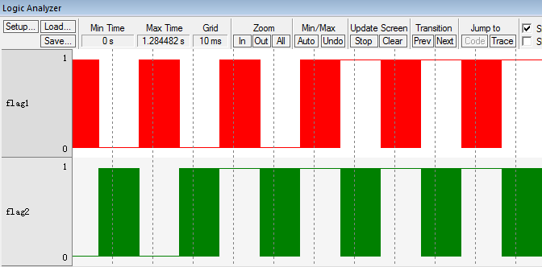
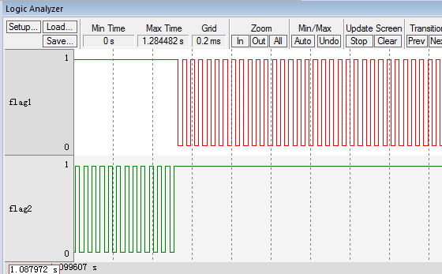

.. vim: syntax=rst

任务时间片运行
==================
本章在上一章的基础上，加入SysTick中断，在SysTick中断服务函数里面进行任务切换，从而实现双任务的时间片运行，即每个任务运行的时间都是一样的。

SysTick简介
~~~~~~~~~~~~~~~~~~~~~~~~~

RTOS需要一个时基来驱动，系统任务调度的频率等于该时基的频率。通常该时基由一个定时器来提供，也可以从其他周期性的信号源获得。刚好Cortex-M内核
中有一个系统定时器SysTick，它内嵌在NVIC中，是一个24位的递减的计数器，计数器每计数一次的时间为1/SYSCLK。当重装载数值寄存器的值递减到0的时候，
系统定时器就产生一次中断，以此循环往复。因为SysTick是嵌套在内核中的，所以使得OS在Cortex-M器件中编写的定时器代码不必修改，使移植工作一下子
变得简单很多。所以SysTick是最适合给操作系统提供时基，用于维护系统心跳的定时器。有关SysTick的寄存器汇总见表4‑1，各个寄存器的用法见表4‑2、表4‑3、表4‑4和表4‑5。

表4‑1SysTick寄存器汇总

================= =================================
寄存器名称        寄存器描述
================= =================================
CTRL              SysTick控制及状态寄存器
LOAD              SysTick重装载数值寄存器
VAL               SysTick当前数值寄存器
================= =================================

表4‑2SysTick控制及状态寄存器

.. list-table::
   :widths: 20 20 20 20 20
   :header-rows: 0

   * - 位段
     - 名称
     - 类型
     - 复位值
     - 描述

   * - 16
     - COUNTFLAG
     - R/W
     - 0
     - 如果在上次读取本寄存器后， SysTick 已经计到了 0，则该位为 1。

   * - 2
     - CLKSOURCE
     - R/W
     - 0
     - 时钟源选择位，0=AHB/8，1=处理器时钟AHB

   * - 1
     - TICKINT
     - R/W
     - 0
     - 1=SysTick倒数计数到 0时产生 SysTick异常请求，0=数到 0 时无动作。也可以通过读取COUNTFLAG标志位来确定计数器是否递减到0

   * - 0
     - ENABLE
     - R/W
     - 0
     - SysTick 定时器的启用位

表4‑3SysTick 重装载数值寄存器

==== ====== ==== ====== ================================
位段 名称   类型 复位值 描述
==== ====== ==== ====== ================================
23:0 RELOAD R/W  0      当倒数计数至零时，将被重装载的值
==== ====== ==== ====== ================================

表4‑4SysTick当前数值寄存器

.. list-table::
   :widths: 20 20 20 20 20
   :header-rows: 0

   * - 位段
     - 名称
     - 类型
     - 复位值
     - 描述

   * - 23:0
     - CURRENT
     - R/W
     - 0
     - 读取时返回当前倒计数的值，写它则使之清零，同时还会清除在SysTick控制及状态寄存器中的COUNTFLAG 标志

初始化SysTick
~~~~~~~~~~~~~~~~~~~~~~~~~~~~~~

使用SysTick非常简单，只需一个初始化函数搞定，OS_CPU_SysTickInit函数在os_cpu_c.c中定义，具体实现见 代码清单:时间片运行-1_ 。在这里，
SysTick初始化函数我们没有使用μC/OS-III官方的，我们是自己另外编写了一个。区别是uC/OS-III官方的OS_CPU_SysTickInit函数里面涉及SysTick
寄存器都是重新在cpu.h中定义，而我们自己编写的则是使用ARMCM3.h（记得在os_cpu_c.c的开头包含ARMCM3.h这个头文件）这个固件库文件里面定
义的寄存器，仅此区别而已。

.. code-block:: c
    :caption: 代码清单:时间片运行-1SysTick初始化
    :name: 代码清单:时间片运行-1
    :linenos:

    #if 0/* 不用μC/OS-III自带的 */
    void  OS_CPU_SysTickInit (CPU_INT32U  cnts)
    {
        CPU_INT32U  prio;

    /* 填写 SysTick 的重载计数值 */
        CPU_REG_NVIC_ST_RELOAD = cnts - 1u;

    /* 设置 SysTick 中断优先级 */
        prio  = CPU_REG_NVIC_SHPRI3;
        prio &= DEF_BIT_FIELD(24, 0);
        prio |= DEF_BIT_MASK(OS_CPU_CFG_SYSTICK_PRIO, 24);

        CPU_REG_NVIC_SHPRI3 = prio;

    /* 启用 SysTick 的时钟源和启动计数器 */
        CPU_REG_NVIC_ST_CTRL |= CPU_REG_NVIC_ST_CTRL_CLKSOURCE |
                                CPU_REG_NVIC_ST_CTRL_ENABLE;
    /* 启用 SysTick 的定时中断 */
        CPU_REG_NVIC_ST_CTRL |= CPU_REG_NVIC_ST_CTRL_TICKINT;
    }

    #else/* 直接使用头文件ARMCM3.h里面现有的寄存器定义和函数来实现 */
    void  OS_CPU_SysTickInit (CPU_INT32U  ms)
    {
    /* 设置重装载寄存器的值 */
        SysTick->LOAD  = ms * SystemCoreClock / 1000 - 1;(1)

    /* 配置中断优先级为最低 */
        NVIC_SetPriority (SysTick_IRQn, (1<<__NVIC_PRIO_BITS) - 1);(2)

    /* 复位当前计数器的值 */
        SysTick->VAL   = 0;(3)

    /* 选择时钟源、启用中断、启用计数器 */
        SysTick->CTRL  = SysTick_CTRL_CLKSOURCE_Msk |(4)
                        SysTick_CTRL_TICKINT_Msk   |(5)
                        SysTick_CTRL_ENABLE_Msk;(6)
    }
    #endif

-   代码清单:时间片运行-1_ （1）：配置重装载寄存器的值，我们配合函数形参ms来配置，如果需要配置为10ms产生一次中断，形参设置为10即可。

-   代码清单:时间片运行-1_ （2）：配置SysTick的优先级，这里配置为15，即最低。

-   代码清单:时间片运行-1_ （3）：复位当前计数器的值。

-   代码清单:时间片运行-1_ （4）：选择时钟源，这里选择SystemCoreClock。

-   代码清单:时间片运行-1_ （5）：启用中断。

-   代码清单:时间片运行-1_ （6）：启用计数器开始计数。

编写SysTick中断服务函数
~~~~~~~~~~~~~~~~~~~~~~~~~~~~~~~~~~~~~~~~~~~

SysTick中断服务函数也是在os_cpu_c.c中定义，具体实现见 代码清单:时间片运行-2_ 。

.. code-block:: c
    :caption: 代码清单:时间片运行-2SysTick中断服务函数
    :name: 代码清单:时间片运行-2
    :linenos:

    /* SysTick 中断服务函数 */
    void SysTick_Handler(void)
    {
        OSTimeTick();
    }

SysTick中断服务函数很简单，里面仅调用了函数OSTimeTick()。OSTimeTick()是与时间相关的函数，在os_time.c（os_time.c第一次使用需要自行
在文件夹μC/OS-III\Source中新建并添加到工程的μC/OS-IIISource组）文件中定义，具体实现见 代码清单:时间片运行-3_ 。

.. code-block:: c
    :caption: 代码清单:时间片运行-3OSTimeTick()函数
    :name: 代码清单:时间片运行-3
    :linenos:

    void  OSTimeTick (void)
    {
    /* 任务调度 */
        OSSched();
    }

OSTimeTick()很简单，里面仅调用了函数OSSched，OSSched函数暂时没有修改，与上一章一样，具体见 代码清单:时间片运行-4_ 。

.. code-block:: c
    :caption: 代码清单:时间片运行-4 OSSched函数
    :name: 代码清单:时间片运行-4
    :linenos:

    void OSSched (void)
    {
    if ( OSTCBCurPtr == OSRdyList[0].HeadPtr ) {
            OSTCBHighRdyPtr = OSRdyList[1].HeadPtr;
        } else {
            OSTCBHighRdyPtr = OSRdyList[0].HeadPtr;
        }

        OS_TASK_SW();
    }

main()函数
~~~~~~~~~~~~~~~~~~~~~~~~

main()函数与上一章区别不大，仅仅是加入了SysTick相关的内容，具体见 代码清单:时间片运行-5_ 。

.. code-block:: c
    :caption: 代码清单:时间片运行-5 main()函数和任务代码
    :emphasize-lines: 5-9
    :name: 代码清单:时间片运行-5
    :linenos:

    int main(void)
    {
        OS_ERR err;

    /* 关闭中断 */
    CPU_IntDis();(1)

    /* 配置SysTick 10ms 中断一次 */
    OS_CPU_SysTickInit (10);(2)

    /* 初始化相关的全局变量 */
        OSInit(&err);

    /* 创建任务 */
        OSTaskCreate ((OS_TCB*)      &Task1TCB,
                    (OS_TASK_PTR ) Task1,
                    (void *)       0,
                    (CPU_STK*)     &Task1Stk[0],
                    (CPU_STK_SIZE) TASK1_STK_SIZE,
                    (OS_ERR *)     &err);

        OSTaskCreate ((OS_TCB*)      &Task2TCB,
                    (OS_TASK_PTR ) Task2,
                    (void *)       0,
                    (CPU_STK*)     &Task2Stk[0],
                    (CPU_STK_SIZE) TASK2_STK_SIZE,
                    (OS_ERR *)     &err);

    /* 将任务加入到就绪列表 */
        OSRdyList[0].HeadPtr = &Task1TCB;
        OSRdyList[1].HeadPtr = &Task2TCB;

    /* 启动OS，将不再返回 */
        OSStart(&err);
    }

    /* 任务1 */
    void Task1( void *p_arg )
    {
    for ( ;; ) {
            flag1 = 1;
            delay( 100 );
            flag1 = 0;
            delay( 100 );

    /* 任务切换，这里是手动切换 */
    //OSSched();(3)
        }
    }

    /* 任务2 */
    void Task2( void *p_arg )
    {
    for ( ;; ) {
            flag2 = 1;
            delay( 100 );
            flag2 = 0;
            delay( 100 );

    /* 任务切换，这里是手动切换 */
    //OSSched();(4)
        }
    }

-   代码清单:时间片运行-5_ （1）：关闭中断。因为在OS系统初始化之前我们启用了SysTick定时器产生10ms的中断，在中断里面触发任务调度，如果
    一开始我们不关闭中断，就会在OS还有启动之前就进入SysTick中断，然后发生任务调度，既然OS都还没启动，那调度是不允许发生的，所以先关闭
    中断。系统启动后，中断由OSStart()函数里面的OSStartHighRdy()重新开启。

-   代码清单:时间片运行-5_ （2）：配置SysTick为10ms中断一次。任务的调度是在SysTick的中断服务函数中完成的，中断的频率越高就意味着OS的
    调度越高，系统的负荷就越重，一直在不断的进入中断，则执行任务的时间就减小。选择合适的SysTick中断频率会提供系统的运行效率，μC/OS-III
    官方推荐为10ms，或者高点也行。

-   代码清单:时间片运行-5_ （3）、（4）：任务调度将不再在各自的任务里面实现，而是放到了SysTick中断服务函数中。从而实现每个任务都运行相同的时间片，平等的享有CPU。

实验现象
~~~~~~~~~~~~

进入软件调试，单击全速运行按钮就可看到实验波形，具体见图 实验现象_ 。

从图 实验现象_ 我们可以看到，两个任务轮流的占有CPU，享有相同的时间片。其实目前的实验现象与上一章的实验现象还没有本质上的区别，加入
SysTick只是为了后续章节做准备。上一章两个任务也是轮流的占有CPU，也是享有相同的时间片，该时间片是任务单次运行的时间。不同的是本章任
务的时间片等于SysTick定时器的时基，是很多个任务单次运行时间的综合。即在这个时间片里面任务运行了非常多次，如果我们把波形放大，就会发
现大波形里面包含了很多小波形，具体见图 实验现象2_ 。

