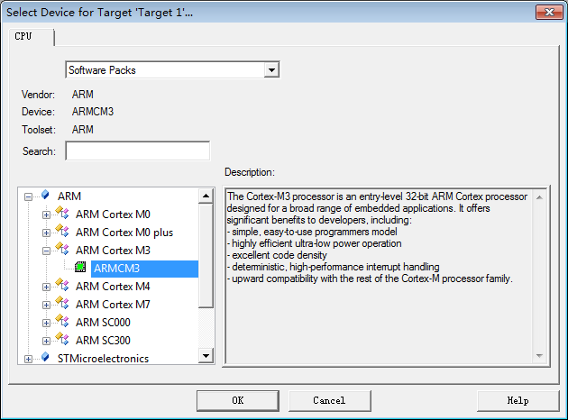
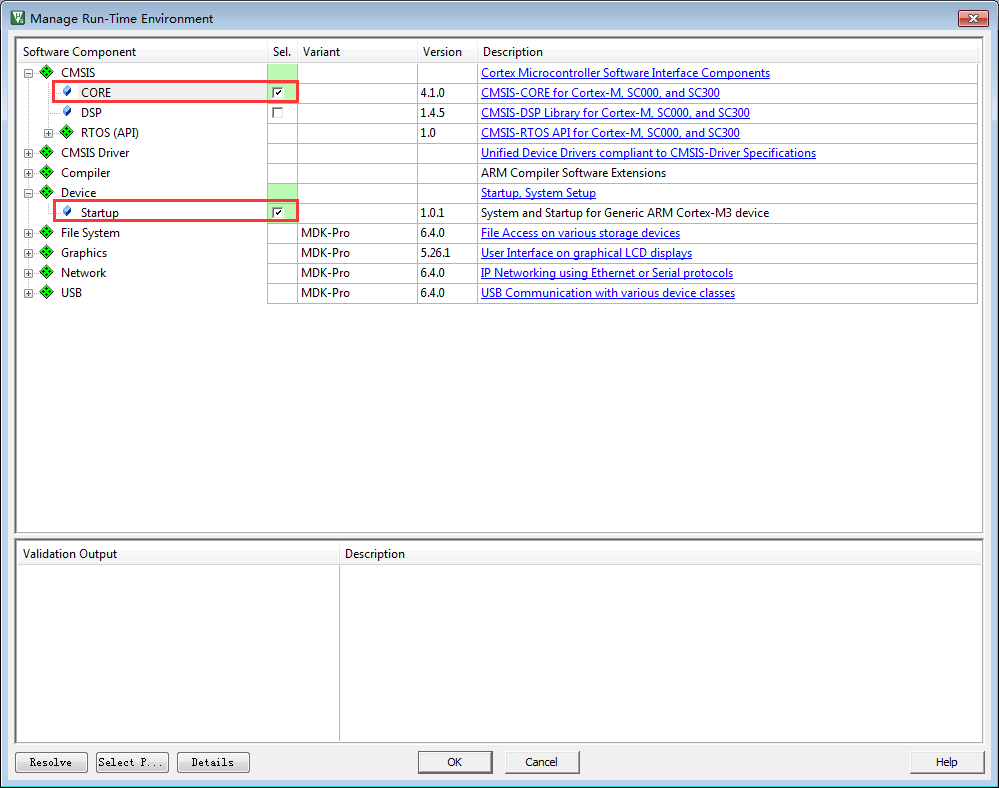
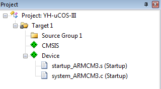
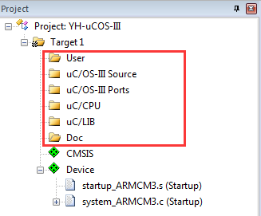
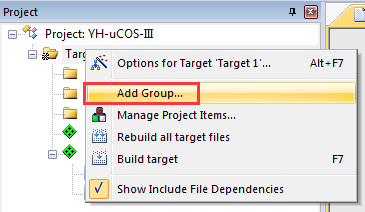
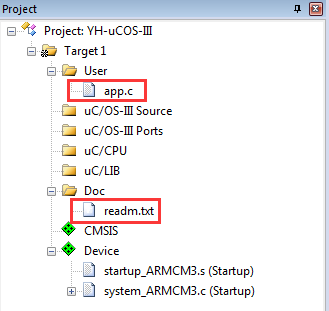
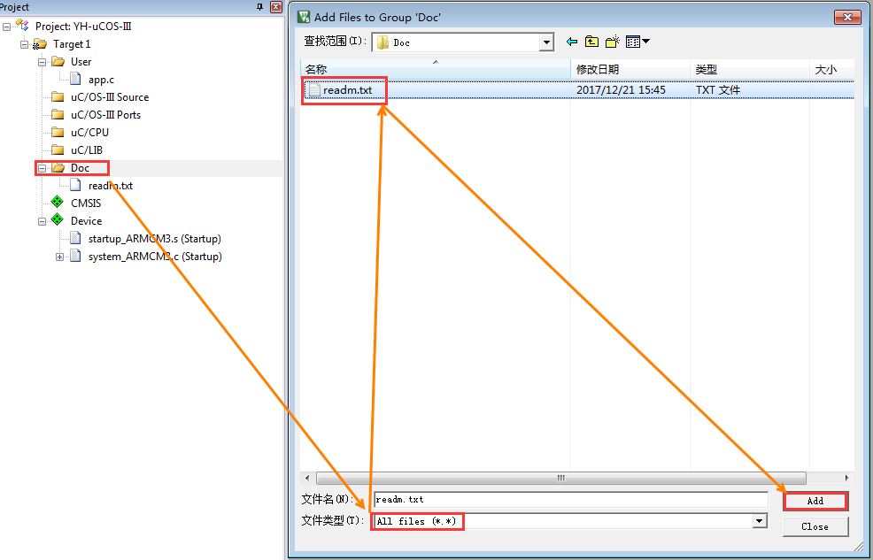
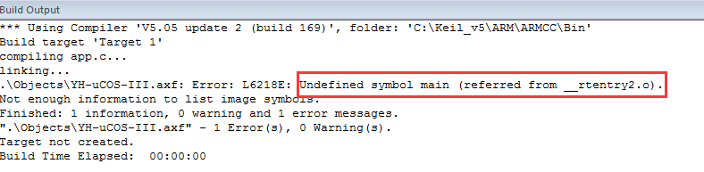
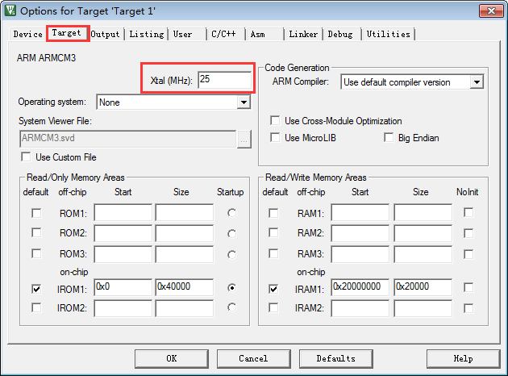
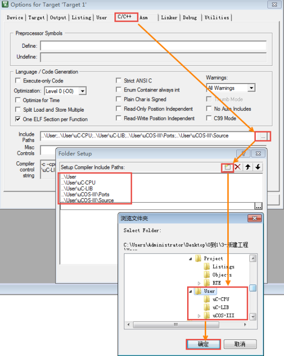

.. vim: syntax=rst

新建工程—软件仿真
===================

在开始写RTOS之前，先新建一个工程，Device选择Cortex-M3内核的处理器，调试方式选择软件仿真，到最后写完整个RTOS之后，
再把RTOS移植到野火STM32开发板上。最后的移植其实已经非常简单，只需要换一下启动文件和添加bsp驱动即可。

新建本地工程文件夹
~~~~~~~~~~~~~~~~~~~~~~~~~

在开始新建工程之前，我们先在本地计算机端新建一个文件夹用于存放工程。文件夹名设置为RTOS，然后在该文件夹下新建各个文件夹和文件，
有关这些文件夹的包含关系和作用如表 工程文件夹根目录下的文件夹的作用_ 所示。

.. list-table::
   :widths: 25 25 25 25
   :name: 工程文件夹根目录下的文件夹的作用
   :header-rows: 0

   * - 文件夹名称
     -
     -
     - 文件夹作用

   * - Doc
     - -
     - -
     - 用于存放对整个工程的说明文件，如readme.txt。通常情况下，我们都要对整个工程实现的功能、如何编译、如何使用等做一个简要的说明

   * - Project
     - -
     - -
     - 用于存放新建的工程文件

   * - Μser
     - μC/OS-III
     - Source
     - 用于存放μC/OS-III源码，其中的代码是纯软件相关的，与硬件无关

   * -
     -
     - Ports
     - 用于存放接口文件，即μC/OS-III与CPU连接的文件，也就是我们通常所说的移植文件。要想μC/OS-III在单片机上运行μC/OS-III，这些移植文件必不可少

   * -
     - μC-CPU
     - -
     - 用于存放μC/OS-III根据CPU总结的通用代码，只与CPU相关

   * -
     - μC-LIB
     - -
     - 用于存放一些C语言函数库

   * -
     - -
     - -
     - 用于存放用户程序，如app.c，main()函数就放在app.c文件中

==========  =========  ====  =====  =====
   型号       内核     引脚   RAM    ROM
==========  =========  ====  =====  =====
MINI        Cortex-M3  64    48KB   256KB
指南者      Cortex-M3  100   64KB   512KB
霸道        Cortex-M3  144   64KB   512KB
霸天虎      Cortex-M4  144   192KB  1MB
挑战者F429  Cortex-M4  176   256KB  1MB
挑战者F767  Cortex-M7  176   512KB  1MB
挑战者H7    Cortex-M7  176   1MB    2MB
==========  =========  ====  =====  =====

使用KEIL新建工程
~~~~~~~~~~~~~~~~~~~~~

开发环境我们使用KEIL5，版本为5.15，高于版本5即可。

New Project
^^^^^^^^^^^^^^^^^^^^^^^^^^^^^

首先打开KEIL5软件，新建一个工程，工程文件放在目录Project\RVMDK（uv5）下面，名称命名为YH-μC/OS-III，
其中YH是野火拼音首字母的缩写，当然你也可以换成其他名称，但是必须是英文，不能是中文，切记。

Select Device For Target
^^^^^^^^^^^^^^^^^^^^^^^^^^^^^^^^^^

当设置好工程名称并确定之后会弹出Select Device for Target对话框，在该对话框中可以选择处理器，这里选择ARMCM3，
具体如图 Select_Device_For_Target对话框_ 所示。

Manage Run-Time Environment
^^^^^^^^^^^^^^^^^^^^^^^^^^^^^^^^^^^^

选择好处理器，单击OK按钮后会弹出Manage Run-Time Environment选项框。这里我们在CMSIS栏选中CORE和Device栏选中
Startup这两个文件即可，具体见图 Manage_Run-Time_Environment_。

单击OK，关闭Manage Run-Time Environment选项框之后，刚刚我们选择的CORE和Startup这两个文件就会添加到我们的工程组里面，
具体见图 CORE和Startup文件_。

其实这两个文件刚开始都是存放在KEIL的安装目录下，当我们配置Manage Run-Time Environment选项框之后，
软件就会把选中好的文件从KEIL的安装目录复制到我们的工程目录：Project\RTE\Device\ARMCM3下面。
其中startup_ARMCM3.s是汇编编写的启动文件，system_ARMCM3.c是C语言编写的跟时钟相关的文件。
更加具体的可直接阅读这两个文件的源码。只要是Cortex-M3内核的单片机，这两个文件都适用。

在KEIL工程里面新建文件组
~~~~~~~~~~~~~~~~~~~~~~~~~~~~~~~~~~~~~~~~~~

在工程里面添加User、μC/OS-III Source、μC/OS-III Ports、μC/CPU、μC/LIB和Doc这几个文件组，
用于管理文件，具体见图 新添加的文件组_。

对于新手，这里有个问题就是如何添加文件组？具体的方法为鼠标右键Target1，在弹出的选项里面选择Add Group…即可，
具体见图 如何添加组_ ，需要多少个组就鼠标右击多少次Target1。

在KEIL工程里面添加文件
~~~~~~~~~~~~~~~~~~~~~~~~~~~~~~~~~~~~~

在工程里面添加好组之后，我们需要把本地工程里面新建好的文件添加到工程里面。具体为把readme.txt文件添加到Doc组，
app.c添加到User组，至于OS相关的文件我们还没有编写，那么OS相关的组就暂时为空，具体见图 往组里面添加好的文件_。

对于新手，这里有个问题就是如何将本地工程里面的文件添加到工程组里里面？具体的方法为鼠标左键双击相应的组，
在弹出的文件选择框中找到要添加的文件，默认的文件类型是C文件，如果要添加的是文本或者汇编文件，那么此时将看不到，
这个时候就需要把文件类型选择为All Files，最后单击Add按钮即可，具体见图 如何往组里面添加文件_。

编写main()函数
^^^^^^^^^^^^^^^^^^^^^^^^^^^^

一个工程如果没有main()函数是编译不成功的，会出错。因为系统在开始执行的时候先执行启动文件里面的复位程序，
复位程序里面会调用C库函数__main，__main的作用是初始化好系统变量，如全局变量，只读的，可读可写的等等。
__main最后会调用__rtentry，再由__rtentry调用main()函数，从而由汇编跳入到C的世界，这里面的main()函数就需要我们手动编写，
如果没有编写main()函数，就会出现main()函数没有定义的错误，具体见图 没定义main函数的错误_。

main()函数我们写在app.c文件里面，因为是刚刚新建工程，所以main()函数暂时为空，具体见代码清单 代码清单:main函数_。

.. code-block:: c
    :caption: 代码清单:main函数
    :name: 代码清单:main函数
    :linenos:

    int main(void)
    {
    for (;;)
        {
            /* 啥事不干 */
        }
    }

调试配置
~~~~~~~~~~~~

设置软件仿真
^^^^^^^^^^^^^^^^^^

最后，我们再配置下调试相关的配置即可。为了方便，我们全部代码都用软件仿真，即不需要开发板也不需要仿真器，
只需要一个KEIL软件即可，有关软件仿真的配置具体见图 软件仿真的配置_。

.. image:: media/creating_project/creati010.png
   :align: center
   :name: 软件仿真的配置
   :alt: 软件仿真的配置

修改时钟大小
^^^^^^^^^^^^^^^^^^

在时钟相关文件system_ARMCM3.c的开头，有一段代码定义了系统时钟的大小为25M，具体见 代码清单:时钟相关宏定义_。
在软件仿真的时候，确保时间的准确性，代码里面的系统时钟跟软件仿真的时钟必须一致，
所以Options for Target->Target的时钟应该由默认的12M改成25M，具体见图 软件仿真时钟配置_。

.. code-block:: c
    :caption: 代码清单:时钟相关宏定义
    :name: 代码清单:时钟相关宏定义
    :linenos:

    #define __HSI            ( 8000000UL)
    #define __XTAL    ( 5000000UL)

    #define __SYSTEM_CLOCK    (5*__XTAL)

添加头文件路径
^^^^^^^^^^^^^^^^^^^

在C/C++选项卡里面指定工程头文件的路径，不然编译会出错，头文件路径的具体指定方法见图 指定头文件的路径_。

至此，一个完整的基于Cortex-M内核的软件仿真的工程就建立完毕。

