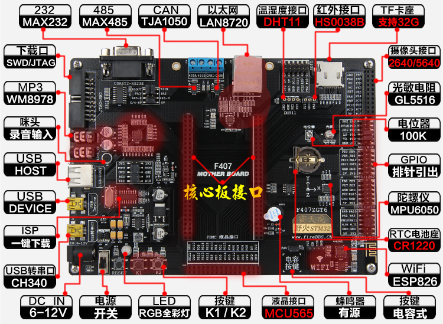
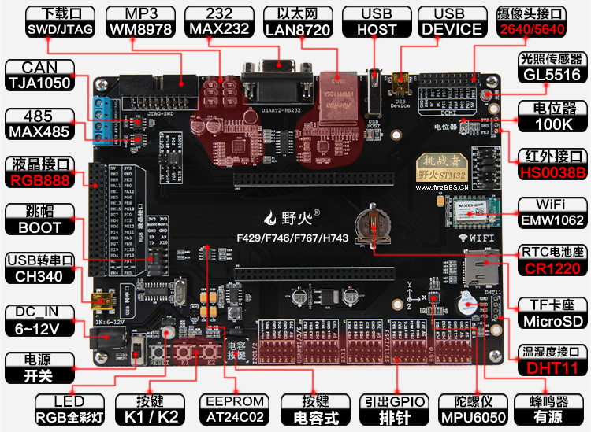

.. vim: syntax=rst

前 言
===========

如何学习本书
~~~~~~~~~~~~~~~~~~

本书与市面上的任何一本μC/OS-III相关的书都不一样，它们要么是翻译官方的参考手册，要么是讲如何使用μC/OS-III，
要么是讲μC/OS-III的源码，而本书是教你怎么从0开始把μC/OS-III写出来，既讲了源码实现，也讲了API如何使用。
当你拿到本书开始学习时一定会惊讶，原来RTOS的学习并没有那么复杂，反而是那么有趣，原来自己也可以写OS，成就感立马爆棚。

全书内容循序渐进，不断迭代，前一章都是后一章的基础，必须从头开始阅读，不能进行跳跃式的阅读。在学习的时候务必做到两点：
一是不能一味地看书，要把代码和书本结合起来学习，一边看书，一边调试代码。如何调试代码呢？即单步执行每一条程序，
看程序的执行流程和执行的效果与自己所想的是否一致；二是在每学完一章之后，必须将配套的例程重写一遍（切记不要复制，
哪怕是一个分号，但可以照书录入），做到举一反三，确保真正理解。在自己写的时候肯定会错漏百出，这个时候要认真纠错，
好好调试，这是你提高编程能力的最好机会。记住，编写程序不是一气呵成的，而是要一步一步地调试。

本书的编写风格
~~~~~~~~~~~~~~~~~~~

本书以μC/OS-III官方源码为蓝本，抽丝剥茧，不断迭代，教你如何从0开始把μC/OS-III写出来。书中涉及的数据类型、变量名称、
函数名称，文件名称、文件存放的位置都完全按照μC/OS-III官方的方式来实现。学完这本书之后，可以无缝地切换到原版的μC/OS-III中使用。
要注意的是，在实现的过程中，某些函数中会去掉一些形参和冗余的代码，只保留核心的功能，但这并不会影响学习。注意，
本书并不是教你如何写一个自己的OS，而是教你μC/OS-III是怎么写出来的，着重讲解原理实现，当你看完这本书之后，
再学习其他RTOS将会事半功倍。

本书的技术论坛
~~~~~~~~~~~~~~~~~~~

如果在学习过程中遇到问题，可以到野火电子论坛\ `www.firebbs.cn发帖交流 <http://www.firebbs.cn发帖交流>`__\ ，开源共享，共同进步。

鉴于水平有限，本书难免有错漏之处，热心的读者也可把勘误发送到论坛上以便改进。祝你学习愉快，μC/OS-III的世界，野火与你同行。

本书的参考资料
~~~~~~~~~~~~~~~~~~~

1. μC/OS-III官方源代码

2. μC/OS-III中文翻译（电子版）

3. 嵌入式操作系统μC/OS-II(第二版)（电子版）

4. 嵌入式实时操作系统μC/OS-II原理及应用任哲编著（电子版）

5. CM3权威指南CnR2（电子版）

6. STM32F10xxx Cortex-M3 programming manμal（电子版）

本书的配套硬件
~~~~~~~~~~~~~~~~~~~

本书支持野火STM32开发板全套系列，具体型号见下表，具体图片见 图 野火MINI开发板_、
图 野火指南者开发板_、图 野火霸道开发板_、图 野火霸天虎开发板_ 和图 野火挑战者开发板_。
学习的时候如果配套这些硬件平台做实验，学习必会达到事半功倍的效果，可以省去中间硬件不一样时移植遇到的各种问题。

表格:野火STM32开发板型号汇总

==========  =========  ====  =====  =====
   型号       内核     引脚   RAM    ROM
==========  =========  ====  =====  =====
MINI        Cortex-M3  64    48KB   256KB
指南者      Cortex-M3  100   64KB   512KB
霸道        Cortex-M3  144   64KB   512KB
霸天虎      Cortex-M4  144   192KB  1MB
挑战者F429  Cortex-M4  176   256KB  1MB
挑战者F767  Cortex-M7  176   512KB  1MB
挑战者H7    Cortex-M7  176   1MB    2MB
==========  =========  ====  =====  =====

图 野火【MINI】STM32F103RCT6 开发板

图 野火【指南者】STM32F103VET6 开发板

图 野火【霸道】STM32F103ZET6 开发板

图 野火【霸天虎】STM32F407ZGT6 开发板

图 野火【挑战者】STM32F429IGT6 开发板
