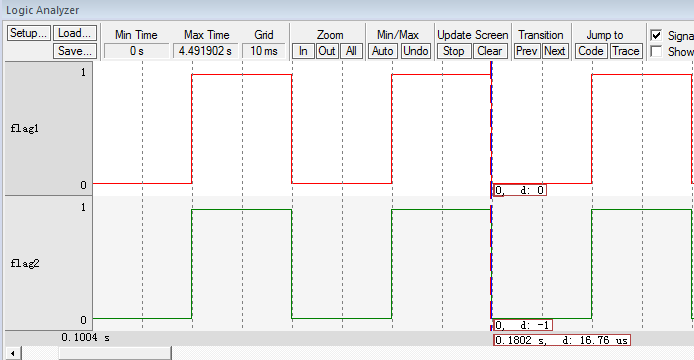

.. vim: syntax=rst

阻塞延时与空闲任务
===================

在上一章节中，任务体内的延时使用的是软件延时，即还是让CPU空等来达到延时的效果。使用RTOS的很大优势就是榨干CPU的性能，永远不能让
它闲着，任务如果需要延时也就不能再让CPU空等来实现延时的效果。RTOS中的延时叫阻塞延时，即任务需要延时的时候，任务会放弃CPU的使用
权，CPU可以去干其他的事情，当任务延时时间到，重新获取CPU使用权，任务继续运行，这样就充分地利用了CPU的资源，而不是干等着。

当任务需要延时，进入阻塞状态，那CPU又去干什么事情了？如果没有其他任务可以运行，RTOS都会为CPU创建一个空闲任务，这个时候CPU就运
行空闲任务。在μC/OS-III中，空闲任务是系统在初始化的时候创建的优先级最低的任务，空闲任务主体很简单，只是对一个全局变量进行计数。
鉴于空闲任务的这种特性，在实际应用中，当系统进入空闲任务的时候，可在空闲任务中让单片机进入休眠或者低功耗等操作。

实现空闲任务
~~~~~~~~~~~~~~~~~~

定义空闲任务栈
^^^^^^^^^^^^^^^^^^^

空闲任务栈在os_cfg_app.c（os_cfg_app.c第一次使用需要自行在文件夹μC/OS-III\Source中新建并添加到工程的μC/OS-III Source组）文件中
定义，具体见 代码清单:阻塞延时-1_ 。

.. code-block:: c
    :caption: 代码清单:阻塞延时-1os_cfg_app.c文件代码
    :name: 代码清单:阻塞延时-1
    :linenos:

    /*
    *******************************************************************
    *                              数据域
    *******************************************************************
    */

    CPU_STK    OSCfg_IdleTaskStk[OS_CFG_IDLE_TASK_STK_SIZE];(1)

    /*
    *******************************************************************
    *                              常量
    *******************************************************************
    */

    /* 空闲任务栈起始地址 */
    CPU_STK      * const  OSCfg_IdleTaskStkBasePtr   = \(2)
            (CPU_STK    *)&OSCfg_IdleTaskStk[0];
    /* 空闲任务栈大小 */
    CPU_STK_SIZE   const  OSCfg_IdleTaskStkSize      = \
            (CPU_STK_SIZE)OS_CFG_IDLE_TASK_STK_SIZE;

-   代码清单:阻塞延时-1_ （1）：空闲任务的栈是一个定义好的数组，大小由OS_CFG_IDLE_TASK_STK_SIZE这个宏控制。
    OS_CFG_IDLE_TASK_STK_SIZE在os_cfg_app.h这个头文件定义，大小为128，具体见 代码清单:阻塞延时-2_ 。

.. code-block:: c
    :caption: 代码清单:阻塞延时-2os_cfg_app.h文件代码
    :name: 代码清单:阻塞延时-2
    :linenos:

    #ifndef OS_CFG_APP_H
    #define OS_CFG_APP_H

    /*
    *******************************************************************
    *                               常量
    *******************************************************************
    */

    /* 空闲任务栈大小 */
    #define  OS_CFG_IDLE_TASK_STK_SIZE       128u

    #endif/* OS_CFG_APP_H */

-   代码清单:阻塞延时-1_ （2）：空闲任务的栈的起始地址和大小均被定义成一个常量，不能被修改。变量
    OSCfg_IdleTaskStkBasePtr和OSCfg_IdleTaskStkSize同时还在os.h中声明，这样就具有全局属性，可以
    在其他文件里面被使用，具体声明见 代码清单:阻塞延时-3_ 。

.. code-block:: c
    :caption: 代码清单:阻塞延时-3OSCfg_IdleTaskStkBasePtr和OSCfg_IdleTaskStkSize声明
    :name: 代码清单:阻塞延时-3
    :linenos:

    /* 空闲任务栈起始地址 */
    extern CPU_STK      * const  OSCfg_IdleTaskStkBasePtr;
    /* 空闲任务栈大小 */
    extern CPU_STK_SIZE   const  OSCfg_IdleTaskStkSize;

定义空闲任务TCB
^^^^^^^^^^^^^^^^^^^^^^^^^

任务控制块TCB是每一个任务必须的，空闲任务的TCB在os.h中定义，是一个全局变量，具体见 代码清单:阻塞延时-4_ 。

.. code-block:: c
    :caption: 代码清单:阻塞延时-4定义空闲任务TCB
    :name: 代码清单:阻塞延时-4
    :linenos:

    /* 空闲任务TCB */
    OS_EXT    OS_TCB         OSIdleTaskTCB;

定义空闲任务函数
^^^^^^^^^^^^^^^^^^^^^^^^

空闲任务正如其名，空闲，任务体里面只是对全局变量OSIdleTaskCtr ++ 操作，具体实现见 代码清单:阻塞延时-5_ 。

.. code-block:: c
    :caption: 代码清单:阻塞延时-5空闲任务函数
    :name: 代码清单:阻塞延时-5
    :linenos:

    /* 空闲任务 */
    void  OS_IdleTask (void  *p_arg)
    {
        p_arg = p_arg;

    /* 空闲任务什么都不做，只对全局变量OSIdleTaskCtr ++ 操作 */
    for (;;) {
            OSIdleTaskCtr++;
        }
    }

代码清单:阻塞延时-5中的全局变量OSIdleTaskCtr在os.h中定义，具体见 代码清单:阻塞延时-6_ 。

.. code-block:: c
    :caption: 代码清单:阻塞延时-6OSIdleTaskCtr定义
    :name: 代码清单:阻塞延时-6
    :linenos:

    /* 空闲任务计数变量 */
    OS_EXT    OS_IDLE_CTR    OSIdleTaskCtr;

代码清单:阻塞延时-6_ 中的OS_IDLE_CTR是在os_type.h中重新定义的数据类型，具体见 代码清单:阻塞延时-7_ 。

.. code-block:: c
    :caption: 代码清单:阻塞延时-7OS_IDLE_CTR定义
    :name: 代码清单:阻塞延时-7
    :linenos:

    /* 空闲任务计数变量定义 */
    typedef   CPU_INT32U      OS_IDLE_CTR;

空闲任务初始化
^^^^^^^^^^^^^^^^^^^

空闲任务的初始化在OSInit()在完成，意味着在系统还没有启动之前空闲任务就已经创建好，具体在os_core.c定义，具体代码见 代码清单:阻塞延时-8_ 。

.. code-block:: c
    :caption: 代码清单:阻塞延时-8空闲任务初始化函数
    :emphasize-lines: 13-14
    :name: 代码清单:阻塞延时-8
    :linenos:

    void OSInit (OS_ERR *p_err)
    {
    /* 配置OS初始状态为停止态 */
        OSRunning =  OS_STATE_OS_STOPPED;

    /* 初始化两个全局TCB，这两个TCB用于任务切换 */
        OSTCBCurPtr = (OS_TCB *)0;
        OSTCBHighRdyPtr = (OS_TCB *)0;

    /* 初始化就绪列表 */
        OS_RdyListInit();

    /* 初始化空闲任务 */
    OS_IdleTaskInit(p_err);(1)
    if (*p_err != OS_ERR_NONE) {
    return;
        }
    }

    /* 空闲任务初始化 */
    void  OS_IdleTaskInit(OS_ERR  *p_err)
    {
    /* 初始化空闲任务计数器 */
        OSIdleTaskCtr = (OS_IDLE_CTR)0;(2)

    /* 创建空闲任务 */
        OSTaskCreate( (OS_TCB     *)&OSIdleTaskTCB,(3)
                    (OS_TASK_PTR )OS_IdleTask,
                    (void       *)0,
                    (CPU_STK    *)OSCfg_IdleTaskStkBasePtr,
                    (CPU_STK_SIZE)OSCfg_IdleTaskStkSize,
                    (OS_ERR     *)p_err );
    }

-   代码清单:阻塞延时-8_ （1）：空闲任务初始化函数在OSInit中调用，在系统还没有启动之前就被创建。

-   代码清单:阻塞延时-8_ （2）：初始化空闲任务计数器，我们知道，这个是预先在os.h中定义好的全局变量。

-   代码清单:阻塞延时-8_ （3）：创建空闲任务，把栈，TCB，任务函数联系在一起。

实现阻塞延时
~~~~~~~~~~~~~~~~~~

阻塞延时的阻塞是指任务调用该延时函数后，任务会被剥离CPU使用权，然后进入阻塞状态，直到延时结束，任务重新
获取CPU使用权才可以继续运行。在任务阻塞的这段时间，CPU可以去执行其他的任务，如果其他的任务也在延时状态，
那么CPU就将运行空闲任务。阻塞延时函数在os_time.c中定义，具体代码实现见 代码清单:阻塞延时-9_ 。

.. code-block:: c
    :caption: 代码清单:阻塞延时-9阻塞延时代码
    :name: 代码清单:阻塞延时-9
    :linenos:

    /* 阻塞延时 */
    void  OSTimeDly(OS_TICK dly)
    {
    /* 设置延时时间 */
        OSTCBCurPtr->TaskDelayTicks = dly;(1)

    /* 进行任务调度 */
        OSSched();(2)
    }

-   代码清单:阻塞延时-9_ （1）：TaskDelayTicks是任务控制块的一个成员，用于记录任务需要延时的时间，单位为SysTick的中断周期。
    比如我们本书当中SysTick的中断周期为10ms，调用OSTimeDly(2)则完成2*10ms的延时。TaskDelayTicks的定义具体见 代码清单:阻塞延时-10_ 。

.. code-block:: c
    :caption: 代码清单:阻塞延时-10TaskDelayTicks定义
    :emphasize-lines: 5-6
    :name: 代码清单:阻塞延时-10
    :linenos:

    struct os_tcb {
        CPU_STK         *StkPtr;
        CPU_STK_SIZE    StkSize;

    /* 任务延时周期个数 */
    OS_TICK         TaskDelayTicks;
    };

-   代码清单:阻塞延时-9_ （2）：任务调度。这个时候的任务调度与上一章节的不一样，具体见 代码清单:阻塞延时-11_ ，其中加粗部分为上一章节的代码，
    现已用条件编译屏蔽掉。

.. code-block:: c
    :caption: 代码清单:阻塞延时-11任务调度
    :emphasize-lines: 3-9
    :name: 代码清单:阻塞延时-11
    :linenos:

    void OSSched(void)
    {
    #if 0/* 非常简单的任务调度：两个任务轮流执行 */
    if ( OSTCBCurPtr == OSRdyList[0].HeadPtr ) {
            OSTCBHighRdyPtr = OSRdyList[1].HeadPtr;
        } else {
            OSTCBHighRdyPtr = OSRdyList[0].HeadPtr;
        }
    #endif

    /* 如果当前任务是空闲任务，那么就去尝试执行任务1或者任务2，
    看看他们的延时时间是否结束，如果任务的延时时间均没有到期，
    那就返回继续执行空闲任务 */
    if ( OSTCBCurPtr == &OSIdleTaskTCB ) {(1)
    if (OSRdyList[0].HeadPtr->TaskDelayTicks == 0) {
                OSTCBHighRdyPtr = OSRdyList[0].HeadPtr;
            } else if (OSRdyList[1].HeadPtr->TaskDelayTicks == 0) {
                OSTCBHighRdyPtr = OSRdyList[1].HeadPtr;
            } else {
    /* 任务延时均没有到期则返回，继续执行空闲任务 */
    return;
            }
        } else {(2)
    /*如果是task1或者task2的话，检查下另外一个任务,
    如果另外的任务不在延时中，就切换到该任务
    否则，判断下当前任务是否应该进入延时状态，
    如果是的话，就切换到空闲任务。否则就不进行任何切换 */
    if (OSTCBCurPtr == OSRdyList[0].HeadPtr) {
    if (OSRdyList[1].HeadPtr->TaskDelayTicks == 0) {
                    OSTCBHighRdyPtr = OSRdyList[1].HeadPtr;
                } else if (OSTCBCurPtr->TaskDelayTicks != 0) {
                    OSTCBHighRdyPtr = &OSIdleTaskTCB;
                } else {
    /* 返回，不进行切换，因为两个任务都处于延时中 */
    return;
                }
            } else if (OSTCBCurPtr == OSRdyList[1].HeadPtr) {
    if (OSRdyList[0].HeadPtr->TaskDelayTicks == 0) {
                    OSTCBHighRdyPtr = OSRdyList[0].HeadPtr;
                } else if (OSTCBCurPtr->TaskDelayTicks != 0) {
                    OSTCBHighRdyPtr = &OSIdleTaskTCB;
                } else {
    /* 返回，不进行切换，因为两个任务都处于延时中 */
    return;
                }
            }
        }

    /* 任务切换 */
        OS_TASK_SW();(3)
    }

-   代码清单:阻塞延时-11_ （1）：如果当前任务是空闲任务，那么就去尝试执行任务1或者任务2，看看他们的延时时间是否结束，
    如果任务的延时时间均没有到期，那就返回继续执行空闲任务。

-   代码清单:阻塞延时-11_ （2）：如果当前任务不是空闲任务则会执行到此，那就看看当前任务是哪个任务。无论是哪个任务，
    都要检查下另外一个任务是否在延时中，如果没有在延时，那就切换到该任务，如果有在延时，那就判断下当前任务是否应该进
    入延时状态，如果是的话，就切换到空闲任务。否则就不进行任务切换。

-   代码清单:阻塞延时-11_ （3）：任务切换，实际就是触发PendSV异常。

main()函数
~~~~~~~~~~~~~~~~~~~~~~~~

main()函数和任务代码变动不大，具体见 代码清单:阻塞延时-12_ ，有变动部分代码已加粗。

.. code-block:: c
    :caption: 代码清单:阻塞延时-12 main()函数
    :emphasize-lines: 11-12,42-43,45-46,58-59,61-62
    :name: 代码清单:阻塞延时-12
    :linenos:

    int main(void)
    {
        OS_ERR err;

    /* 关闭中断 */
        CPU_IntDis();

    /* 配置SysTick 10ms 中断一次 */
        OS_CPU_SysTickInit (10);

    /* 初始化相关的全局变量 */
        OSInit(&err);(1)

    /* 创建任务 */
        OSTaskCreate ((OS_TCB*)      &Task1TCB,
                    (OS_TASK_PTR ) Task1,
                    (void *)       0,
                    (CPU_STK*)     &Task1Stk[0],
                    (CPU_STK_SIZE) TASK1_STK_SIZE,
                    (OS_ERR *)     &err);

        OSTaskCreate ((OS_TCB*)      &Task2TCB,
                    (OS_TASK_PTR ) Task2,
                    (void *)       0,
                    (CPU_STK*)     &Task2Stk[0],
                    (CPU_STK_SIZE) TASK2_STK_SIZE,
                    (OS_ERR *)     &err);

    /* 将任务加入到就绪列表 */
        OSRdyList[0].HeadPtr = &Task1TCB;
        OSRdyList[1].HeadPtr = &Task2TCB;

    /* 启动OS，将不再返回 */
        OSStart(&err);
    }

    /* 任务1 */
    void Task1( void *p_arg )
    {
    for ( ;; ) {
            flag1 = 1;
    //delay( 100 );
            OSTimeDly(2);(2)
            flag1 = 0;
    //delay( 100 );
            OSTimeDly(2);

    /* 任务切换，这里是手动切换 */
    //OSSched();
        }
    }

    /* 任务2 */
    void Task2( void *p_arg )
    {
    for ( ;; ) {
            flag2 = 1;
    //delay( 100 );
            OSTimeDly(2);(3)
            flag2 = 0;
    //delay( 100 );
            OSTimeDly(2);

    /* 任务切换，这里是手动切换 */
    //OSSched();
        }
    }

-   代码清单:阻塞延时-12_ （1）：空闲任务初始化函数在OSInint中调用，在系统启动之前创建好空闲任务。

-   代码清单:阻塞延时-12_ （2）和（3）：延时函数均替代为阻塞延时，延时时间均为2个SysTick中断周期，即20ms。

实验现象
~~~~~~~~~~~~

进入软件调试，全速运行程序，从逻辑分析仪中可以看到两个任务的波形是完全同步，就好像CPU在同时干两件事情，
具体仿真的波形图见图 实验现象1_ 和图 实验现象2_ 。

从图 实验现象1_ 和图 实验现象2_ 可以看出，flag1和flag2的高电平的时间为(0.1802-0.1602)s，刚好等于阻塞
延时的20ms，所以实验现象跟代码要实现的功能是一致的。

