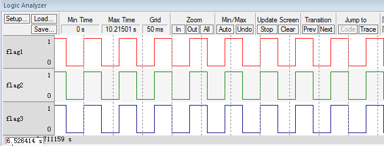
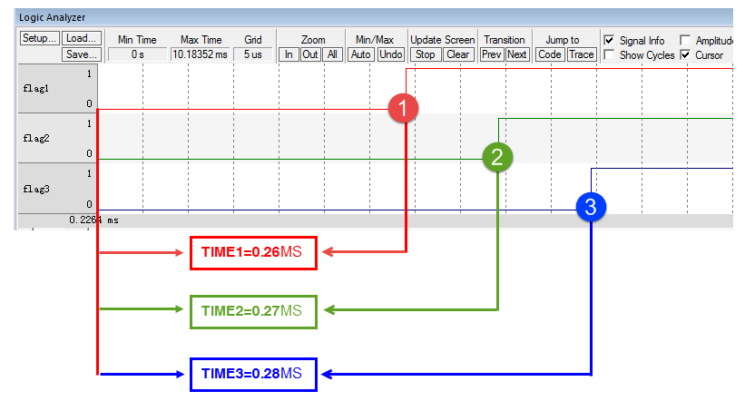

.. vim: syntax=rst

支持多优先级
================

在本章之前，OS还没有到优先级，只支持两个任务互相切换，从本章开始，任务中我们开始加入优先级的功能。
在μC/OS-III中，数字优先级越小，逻辑优先级越高。

定义优先级相关全局变量
~~~~~~~~~~~~~~~~~~~~~~~~~~~

在支持任务多优先级的时候，需要在os.h头文件添加两个优先级相关的全局变量，具体定义见 代码清单:优先级-1_。

.. code-block:: c
    :caption: 代码清单:优先级-1定义优先级相关全局变量
    :name: 代码清单:优先级-1
    :linenos:

    /* 在os.h中定义 */
    /* 当前优先级 */
    OS_EXT            OS_PRIO                OSPrioCur;
    /* 最高优先级 */
    OS_EXT            OS_PRIO                OSPrioHighRdy;

修改OSInit()函数
~~~~~~~~~~~~~~~~~~~~~~~~~~~~~~~~~~~~

刚刚新添加的优先级相关的全部变量，需要在OSInit()函数中进行初始化，具体见 代码清单:优先级-2_ 中的加粗部分代码，
其实OS中定义的所有的全局变量都是在OSInit()中初始化的。

.. code-block:: c
    :caption: 代码清单:优先级-2OSInit()函数
    :emphasize-lines: 10-12
    :name: 代码清单:优先级-2
    :linenos:

    void OSInit (OS_ERR *p_err)
    {
        /* 配置OS初始状态为停止态 */
        OSRunning =  OS_STATE_OS_STOPPED;

        /* 初始化两个全局TCB，这两个TCB用于任务切换 */
        OSTCBCurPtr = (OS_TCB *)0;
        OSTCBHighRdyPtr = (OS_TCB *)0;

        /* 初始化优先级变量 */
        OSPrioCur                       = (OS_PRIO)0;
        OSPrioHighRdy                   = (OS_PRIO)0;

        /* 初始化优先级表 */
        OS_PrioInit();

        /* 初始化就绪列表 */
        OS_RdyListInit();

        /* 初始化空闲任务 */
        OS_IdleTaskInit(p_err);
        if (*p_err != OS_ERR_NONE) {
            return;
        }
    }

修改任务控制块TCB
~~~~~~~~~~~~~~~~~~~~~~~~~~~~~~

在任务控制块中，加入优先级字段Prio，具体见 代码清单:优先级-3_ 中的加粗代码。优先级Prio的数据类型为OS_PRIO，
宏展开后是8位的整型，所以只支持255个优先级。

.. code-block:: c
    :caption: 代码清单:优先级-3在TCB中加入优先级
    :emphasize-lines: 8-9
    :name: 代码清单:优先级-3
    :linenos:

    struct os_tcb {
        CPU_STK         *StkPtr;
        CPU_STK_SIZE    StkSize;

        /* 任务延时周期个数 */
        OS_TICK         TaskDelayTicks;

        /* 任务优先级 */
        OS_PRIO         Prio;

        /* 就绪列表双向链表的下一个指针 */
        OS_TCB          *NextPtr;
        /* 就绪列表双向链表的前一个指针 */
        OS_TCB          *PrevPtr;
    };

修改OSTaskCreate()函数
~~~~~~~~~~~~~~~~~~~~~~~~~~~~~~~~~~~~~~~~~~~~~~~~~~~~~~

修改OSTaskCreate()函数，在里面加入优先级相关的处理，具体见 代码清单:优先级-4_ 的加粗部分。

.. code-block:: c
    :caption: 代码清单:优先级-4OSTaskCreate()函数加入优先级处理
    :emphasize-lines: 4,10,12-13,21,26-34
    :name: 代码清单:优先级-4
    :linenos:

    void OSTaskCreate (OS_TCB        *p_tcb,
                    OS_TASK_PTR   p_task,
    void          *p_arg,
                    OS_PRIO       prio,(1)
                    CPU_STK       *p_stk_base,
                    CPU_STK_SIZE  stk_size,
                    OS_ERR        *p_err)
    {
        CPU_STK       *p_sp;
        CPU_SR_ALLOC();(2)

        /* 初始化TCB为默认值 */
        OS_TaskInitTCB(p_tcb);(3)

        /* 初始化栈 */
        p_sp = OSTaskStkInit( p_task,
                            p_arg,
                            p_stk_base,
                            stk_size );

        p_tcb->Prio = prio;(4)

        p_tcb->StkPtr = p_sp;
        p_tcb->StkSize = stk_size;

        /* 进入临界段 */
        OS_CRITICAL_ENTER();(5)

        /* 将任务添加到就绪列表 */(6)
        OS_PrioInsert(p_tcb->Prio);
        OS_RdyListInsertTail(p_tcb);

        /* 退出临界段 */
        OS_CRITICAL_EXIT();(7)

        *p_err = OS_ERR_NONE;
    }

-   代码清单:优先级-4_ （1）：在函数形参中，加入优先级字段。任务的优先级由用户在创建任务的时候通过形参Prio传进来。

-   代码清单:优先级-4_ （2）：定义一个局部变量，用来存CPU关中断前的中断状态，因为接下来将任务添加到就绪列表这段代码属于临界短代码，需要关中断。

-   代码清单:优先级-4_ （3）：初始化TCB为默认值，其实就是全部初始化为0，
    OS_TaskInitTCB()函数在os_task.c的开头定义，具体见 代码清单:优先级-5_。

.. code-block:: c
    :caption: 代码清单:优先级-5OS_TaskInitTCB()函数
    :name: 代码清单:优先级-5
    :linenos:

    void  OS_TaskInitTCB (OS_TCB  *p_tcb)
    {
        p_tcb->StkPtr             = (CPU_STK       *)0;
        p_tcb->StkSize            = (CPU_STK_SIZE   )0u;

        p_tcb->TaskDelayTicks     = (OS_TICK       )0u;

        p_tcb->Prio               = (OS_PRIO        )OS_PRIO_INIT;(1)

        p_tcb->NextPtr            = (OS_TCB        *)0;
        p_tcb->PrevPtr            = (OS_TCB        *)0;
    }

-   代码清单:优先级-5_ （1）：OS_PRIO_INIT是任务TCB初始化的时候给的默认的一个优先级，宏展开等于OS_CFG_PRIO_MAX，
    这是一个不会被OS使用到的优先级。OS_PRIO_INIT具体在os.h中定义。

-   代码清单:优先级-4_ （4）：将形参传进来的优先级存到任务控制块TCB的优先级字段。

-   代码清单:优先级-4_ （5）：进入临界段。

-   代码清单:优先级-4_ （6）：将任务插入就绪列表，这里需要分成两步来实现：1、根据优先级置位优先级表中的相应位置；
    2、将任务TCB放到OSRdyList[优先级]中，如果同一个优先级有多个任务，那么这些任务的TCB就会被放到OSRdyList[优先级]串成一个双向链表。

-   代码清单:优先级-4_ （7）：退出临界段。

修改OS_IdleTaskInit()函数
~~~~~~~~~~~~~~~~~~~~~~~~~~~~~~~~~~~~~~~~~~~~~~~~~~~~~~~~~~~~~

修改OS_IdleTaskInit()函数，是因为该函数调用了任务创建函数OSTaskCreate()，OSTaskCreate()我们刚刚加入了优先级，
所以这里我们要跟空闲任务分配一个优先级，具体见。代码清单:优先级-6_ 的加粗部分。

.. code-block:: c
    :caption: 代码清单:优先级-6OS_IdleTaskInit()函数
    :emphasize-lines: 11
    :name: 代码清单:优先级-6
    :linenos:

    /* 空闲任务初始化 */
    void  OS_IdleTaskInit(OS_ERR  *p_err)
    {
        /* 初始化空闲任务计数器 */
        OSIdleTaskCtr = (OS_IDLE_CTR)0;

        /* 创建空闲任务 */
        OSTaskCreate( (OS_TCB     *)&OSIdleTaskTCB,
                    (OS_TASK_PTR )OS_IdleTask,
                    (void       *)0,
                    (OS_PRIO)(OS_CFG_PRIO_MAX - 1u),(1)
                    (CPU_STK    *)OSCfg_IdleTaskStkBasePtr,
                    (CPU_STK_SIZE)OSCfg_IdleTaskStkSize,
                    (OS_ERR     *)p_err );
    }

-   代码清单:优先级-6_ （1）：空闲任务是μC/OS-III的内部任务，在OSInit()中被创建，在系统没有任何用户任务运行的情况下，
    空闲任务就会被运行，优先级最低，即等于OS_CFG_PRIO_MAX- 1u。

修改OSStart()函数
~~~~~~~~~~~~~~~~~~~~~~~~~~~~~~~~~~~~~

加入优先级之后，OSStart()函数需要修改，具体哪一个任务最先运行，由优先级决定，新加入的代码具体见 代码清单:优先级-7_ 的加粗部分。

.. code-block:: c
    :caption: 代码清单:优先级-7OSStart()函数
    :emphasize-lines: 9-15
    :name: 代码清单:优先级-7
    :linenos:

    /* 启动RTOS，将不再返回 */
    void OSStart (OS_ERR *p_err)
    {
    if ( OSRunning == OS_STATE_OS_STOPPED ) {
    #if 0
            /* 手动配置任务1先运行 */
            OSTCBHighRdyPtr = OSRdyList[0].HeadPtr;
    #endif
            /* 寻找最高的优先级 */
            OSPrioHighRdy   = OS_PrioGetHighest();(1)
            OSPrioCur       = OSPrioHighRdy;

            /* 找到最高优先级的TCB */
            OSTCBHighRdyPtr = OSRdyList[OSPrioHighRdy].HeadPtr;(2)
            OSTCBCurPtr     = OSTCBHighRdyPtr;

            /* 标记OS开始运行 */
            OSRunning       = OS_STATE_OS_RUNNING;

            /* 启动任务切换，不会返回 */
            OSStartHighRdy();

            /* 不会运行到这里，运行到这里表示发生了致命的错误 */
            *p_err = OS_ERR_FATAL_RETURN;
        } else {
            *p_err = OS_STATE_OS_RUNNING;
        }
    }

-   代码清单:优先级-7_ （1）：调取OS_PrioGetHighest()函数从全局变量优先级表OSPrioTbl[]获取最高的优先级，
    放到OSPrioHighRdy这个全局变量中，
    然后把OSPrioHighRdy的值再赋给当前优先级OSPrioCur这个全局变量。在任务切换的时候需要用到OSPrioHighRdy和OSPrioCur这两个全局变量。

-   代码清单:优先级-7_ （2）：根据OSPrioHighRdy的值，
    作为全局变量OSRdyList[]的下标索引找到最高优先级任务的TCB，传给全局变量OSTCBHighRdyPtr，
    然后再将OSTCBHighRdyPtr赋值给OSTCBCurPtr。在任务切换的时候需要使用到OSTCBHighRdyPtr和OSTCBCurPtr这两个全局变量。

修改PendSV_Handler()函数
~~~~~~~~~~~~~~~~~~~~~~~~~~~~~~~~~~~~~~~~~~~~~~~~~~~~~~~~~~~~

PendSV_Handler()函数中添加了优先级相关的代码，具体见 代码清单:优先级-8_ 中加粗部分。
有关PendSV_Handler()这个函数的具体讲解要参考《任务的定义与任务切换的实现》这个章节，这里不再赘述。

.. code-block::
    :caption: 代码清单:优先级-8PendSV_Handler()函数
    :emphasize-lines: 7-11
    :name: 代码清单:优先级-8
    :linenos:

    ;*******************************************************************
    ;                          PendSVHandler异常
    ;*******************************************************************

    OS_CPU_PendSVHandler_nosave

    ; OSPrioCur   = OSPrioHighRdy
        LDR     R0, =OSPrioCur
        LDR     R1, =OSPrioHighRdy
        LDRB    R2, [R1]
        STRB    R2, [R0]

    ; OSTCBCurPtr = OSTCBHighRdyPtr
    LDR     R0, = OSTCBCurPtr
    LDR     R1, = OSTCBHighRdyPtr
    LDR     R2, [R1]
    STR     R2, [R0]

    LDR     R0, [R2]
    LDMIA   R0!, {R4-R11}

    MSR     PSP, R0
    ORR     LR, LR, #0x04
    CPSIE   I
    BX      LR

    NOP

    ENDP

修改OSTimeDly()函数
~~~~~~~~~~~~~~~~~~~~~~~~~~~~~~~~~~~~~~~~~~~

任务调用OSTimeDly()函数之后，任务就处于阻塞态，需要将任务从就绪列表中移除，具体修改的代码见 代码清单:优先级-9_ 的加粗部分。

.. code-block:: c
    :caption: 代码清单:优先级-9OSTimeDly()函数
    :emphasize-lines: 12-15,20-25
    :name: 代码清单:优先级-9
    :linenos:

    /* 阻塞延时 */
    void  OSTimeDly(OS_TICK dly)
    {
    #if 0
        /* 设置延时时间 */
        OSTCBCurPtr->TaskDelayTicks = dly;

        /* 进行任务调度 */
        OSSched();
    #endif

        CPU_SR_ALLOC();(1)

        /* 进入临界区 */
        OS_CRITICAL_ENTER();(2)

        /* 设置延时时间 */
        OSTCBCurPtr->TaskDelayTicks = dly;

        /* 从就绪列表中移除 */
        //OS_RdyListRemove(OSTCBCurPtr);
        OS_PrioRemove(OSTCBCurPtr->Prio);(3)

        /* 退出临界区 */
        OS_CRITICAL_EXIT();(4)

        /* 任务调度 */
        OSSched();
    }

-   代码清单:优先级-9_ （1）：定义一个局部变量，用来存CPU关中断前的中断状态，因为接下来将任务从就绪列表移除这段代码属于临界短代码，需要关中断。

-   代码清单:优先级-9_ （2）：进入临界段

-   代码清单:优先级-9_ （3）：将任务从就绪列表移除，
    这里只需将任务在优先级表中对应的位清除即可，暂时不需要把任务TCB从OSRdyList[]中移除，
    因为接下来OSTimeTick()函数还是通过扫描OSRdyList[]来判断任务的延时时间是否到期。当我们加入了时基列表之后，
    当任务调用OSTimeDly()函数进行延时，就可以把任务的TCB从就绪列表删除，然后把任务TCB插入时基列表，
    OSTimeTick()函数判断任务的延时是否到期只需通过扫描时基列表即可，时基列表在下一个章节实现。
    所以这里暂时不能把TCB从就绪列表中删除，只是将任务优先级在优先级表中对应的位清除来达到任务不处于就绪态的目的。

-   代码清单:优先级-9_ （4）：退出临界段。

修改OSSched()函数
~~~~~~~~~~~~~~~~~~~~~~~~~~~~~~~~~~~~~

任务调度函数OSSched()不再是之前的两个任务轮流切换，需要根据优先级来调度，
具体修改部分见 代码清单:优先级-10_ 的加粗部分，被迭代的代码已经通过条件编译屏蔽。

.. code-block:: c
    :caption: 代码清单:优先级-10OSSched()函数
    :emphasize-lines: 62-80
    :name: 代码清单:优先级-10
    :linenos:

    void OSSched(void)
    {
    #if 0
        /* 如果当前任务是空闲任务，那么就去尝试执行任务1或者任务2，
        看看他们的延时时间是否结束，如果任务的延时时间均没有到期，
        那就返回继续执行空闲任务 */
        if ( OSTCBCurPtr == &OSIdleTaskTCB )
        {
            if (OSRdyList[0].HeadPtr->TaskDelayTicks == 0)
            {
                OSTCBHighRdyPtr = OSRdyList[0].HeadPtr;
            }
            else if (OSRdyList[1].HeadPtr->TaskDelayTicks == 0)
            {
                OSTCBHighRdyPtr = OSRdyList[1].HeadPtr;
            }
            else
            {
                return;   /* 任务延时均没有到期则返回，继续执行空闲任务 */
            }
        }
        else
        {
            /*如果是task1或者task2的话，检查下另外一个任务,
            如果另外的任务不在延时中，就切换到该任务，
            否则，判断下当前任务是否应该进入延时状态，
            如果是的话，就切换到空闲任务。否则就不进行任何切换 */
            if (OSTCBCurPtr == OSRdyList[0].HeadPtr)
            {
                if (OSRdyList[1].HeadPtr->TaskDelayTicks == 0)
                {
                    OSTCBHighRdyPtr = OSRdyList[1].HeadPtr;
                } else if (OSTCBCurPtr->TaskDelayTicks != 0) {
                    OSTCBHighRdyPtr = &OSIdleTaskTCB;
                } else {
                /* 返回，不进行切换，因为两个任务都处于延时中 */
                return;
                }
            }
            else if (OSTCBCurPtr == OSRdyList[1].HeadPtr)
            {
                if (OSRdyList[0].HeadPtr->TaskDelayTicks == 0)
                {
                    OSTCBHighRdyPtr = OSRdyList[0].HeadPtr;
                }
                else if (OSTCBCurPtr->TaskDelayTicks != 0)
                {
                    OSTCBHighRdyPtr = &OSIdleTaskTCB;
                }
                else
                {
                    /* 返回，不进行切换，因为两个任务都处于延时中 */
                    return;
                }
            }
        }

        /* 任务切换 */
        OS_TASK_SW();
    #endif

        CPU_SR_ALLOC();(1)

        /* 进入临界区 */
        OS_CRITICAL_ENTER();(2)

        /* 查找最高优先级的任务 */(3)
        OSPrioHighRdy   = OS_PrioGetHighest();
        OSTCBHighRdyPtr = OSRdyList[OSPrioHighRdy].HeadPtr;

        /* 如果最高优先级的任务是当前任务则直接返回，不进行任务切换 */(4)
        if (OSTCBHighRdyPtr == OSTCBCurPtr)
        {
            /* 退出临界区 */
            OS_CRITICAL_EXIT();

            return;
        }
        /* 退出临界区 */
        OS_CRITICAL_EXIT();(5)

        /* 任务切换 */
        OS_TASK_SW();(6)
    }

-   代码清单:优先级-10_ （1）：定义一个局部变量，用来存CPU关中断前的中断状态，因为接下来查找最高优先级这段代码属于临界短代码，需要关中断。

-   代码清单:优先级-10_ （2）：进入临界段。

-   代码清单:优先级-10_ （3）：查找最高优先级任务。

-   代码清单:优先级-10_ （4）：判断最高优先级任务是不是当前任务，如果是则直接返回，否则将继续往下执行，最后执行任务切换。

-   代码清单:优先级-10_ （5）：退出临界段。

-   代码清单:优先级-10_ （6）：任务切换。

修改OSTimeTick()函数
~~~~~~~~~~~~~~~~~~~~~~~~~~~~~~~~~~~~~~~~~~~~~~~~

OSTimeTick()函数在SysTick中断服务函数中被调用，是一个周期函数，具体用于扫描就绪列表OSRdyList[]，
判断任务的延时时间是否到期，如果到期则将任务在优先级表中对应的位置位，
修改部分的代码见 代码清单:优先级-11_ 的加粗部分，被迭代的代码则通过条件编译屏蔽。

.. code-block:: c
    :caption: 代码清单:优先级-11OSTimeTick()函数
    :emphasize-lines: 4-7,20-32,34-35
    :name: 代码清单:优先级-11
    :linenos:

    void  OSTimeTick (void)
    {
        unsigned int i;
        CPU_SR_ALLOC();(1)

        /* 进入临界区 */
        OS_CRITICAL_ENTER();(2)

    /* 扫描就绪列表中所有任务的TaskDelayTicks，如果不为0，则减1 */
    #if 0
        for (i=0; i<OS_CFG_PRIO_MAX; i++)
        {
            if (OSRdyList[i].HeadPtr->TaskDelayTicks > 0)
            {
                OSRdyList[i].HeadPtr->TaskDelayTicks --;
            }
        }
    #endif

        for (i=0; i<OS_CFG_PRIO_MAX; i++) (3)
        {
            if (OSRdyList[i].HeadPtr->TaskDelayTicks > 0)
            {
                OSRdyList[i].HeadPtr->TaskDelayTicks --;
                if (OSRdyList[i].HeadPtr->TaskDelayTicks == 0)
                {
                    /* 为0则表示延时时间到，让任务就绪 */
                    //OS_RdyListInsert (OSRdyList[i].HeadPtr);
                    OS_PrioInsert(i);
                }
            }
        }

        /* 退出临界区 */
        OS_CRITICAL_EXIT();(4)

        /* 任务调度 */
        OSSched();
    }

-   代码清单:优先级-11_ （1）：定义一个局部变量，用来存CPU关中断前的中断状态，
    因为接下来扫描就绪列表OSRdyList[]这段代码属于临界短代码，需要关中断。

-   代码清单:优先级-11_ （2）：进入临界段。

-   代码清单:优先级-11_ （3）：扫描就绪列表OSRdyList[]，判断任务的延时时间是否到期，
    如果到期则将任务在优先级表中对应的位置位。

-   代码清单:优先级-11_ （4）：退出临界段。

main()函数
~~~~~~~~~~~~~~~~~~~~~~~~

main()函数具体见 代码清单:优先级-12_ ，修改部分代码已经加粗显示。

.. code-block:: c
    :caption: 代码清单:优先级-12 main()函数
    :emphasize-lines: 63-64,70,78,86,90-94
    :name: 代码清单:优先级-12
    :linenos:

    /*
    *******************************************************************
    *                             全局变量
    *******************************************************************
    */

    uint32_t flag1;
    uint32_t flag2;
    uint32_t flag3;

    /*
    *******************************************************************
    *                        TCB & STACK &任务声明
    *******************************************************************
    */
    #define  TASK1_STK_SIZE       128
    #define  TASK2_STK_SIZE       128
    #define  TASK3_STK_SIZE       128

    static   OS_TCB    Task1TCB;
    static   OS_TCB    Task2TCB;
    static   OS_TCB    Task3TCB;

    static   CPU_STK   Task1Stk[TASK1_STK_SIZE];
    static   CPU_STK   Task2Stk[TASK2_STK_SIZE];
    static   CPU_STK   Task3Stk[TASK2_STK_SIZE];

    void     Task1( void *p_arg );
    void     Task2( void *p_arg );
    void     Task3( void *p_arg );

    /*
    *******************************************************************
    *                             函数声明
    *******************************************************************
    */
    void delay(uint32_t count);

    /*
    *******************************************************************
    *                             main()函数
    *******************************************************************
    */
    /*
    * 注意事项：1、该工程使用软件仿真，debug需选择 Ude Simulator
    *           2、在Target选项卡里面把晶振Xtal(Mhz)的值改为25，默认是12，
    *              改成25是为了跟system_ARMCM3.c中定义的__SYSTEM_CLOCK相同，
    *              确保仿真的时候时钟一致
    */
    int main(void)
    {
        OS_ERR err;

        /* CPU初始化：1、初始化时间戳 */
        CPU_Init();

        /* 关闭中断 */
        CPU_IntDis();

        /* 配置SysTick 10ms 中断一次 */
        OS_CPU_SysTickInit (10);

        /* 初始化相关的全局变量 */
        OSInit(&err);(1)

        /* 创建任务 */
        OSTaskCreate( (OS_TCB*)&Task1TCB,
                    (OS_TASK_PTR )Task1,
                    (void *)0,
                    (OS_PRIO)1,(2)
                    (CPU_STK*)&Task1Stk[0],
                    (CPU_STK_SIZE)  TASK1_STK_SIZE,
                    (OS_ERR *)&err );

        OSTaskCreate( (OS_TCB*)&Task2TCB,
                    (OS_TASK_PTR )Task2,
                    (void *)0,
                    (OS_PRIO)2,(3)
                    (CPU_STK*)&Task2Stk[0],
                    (CPU_STK_SIZE)  TASK2_STK_SIZE,
                    (OS_ERR *)&err );

        OSTaskCreate( (OS_TCB*)&Task3TCB,
                    (OS_TASK_PTR )Task3,
                    (void *)0,
                    (OS_PRIO)3,(4)
                    (CPU_STK*)&Task3Stk[0],
                    (CPU_STK_SIZE)  TASK3_STK_SIZE,
                    (OS_ERR *)&err );
    #if 0
    /* 将任务加入到就绪列表 */(5)
        OSRdyList[0].HeadPtr = &Task1TCB;
        OSRdyList[1].HeadPtr = &Task2TCB;
    #endif

        /* 启动OS，将不再返回 */
        OSStart(&err);
    }

    /*
    *******************************************************************
    *                              函数实现
    *******************************************************************
    */
    /* 软件延时 */
    void delay (uint32_t count)
    {
        for (; count!=0; count--);
    }

    void Task1( void *p_arg )
    {
        for ( ;; ) {
            flag1 = 1;
            OSTimeDly(2);
            flag1 = 0;
            OSTimeDly(2);
        }
    }

    void Task2( void *p_arg )
    {
        for ( ;; ) {
            flag2 = 1;
            OSTimeDly(2);
            flag2 = 0;
            OSTimeDly(2);
        }
    }

    void Task3( void *p_arg )
    {
        for ( ;; ) {
            flag3 = 1;
            OSTimeDly(2);
            flag3 = 0;
            OSTimeDly(2);
        }
    }

-   代码清单:优先级-12_ （1）：加入了优先级相关的全局变量OSPrioCur和OSPrioHighRdy的初始化。

-   代码清单:优先级-12_ （2）、（3）和（4）：为每个任务分配了优先级，任务1的优先级为1，任务2的优先级为2，任务3的优先级为3。

-   代码清单:优先级-12_ （5）：将任务插入就绪列表这部分功能由OSTaskCreate()实现，这里通过条件编译屏蔽掉。

实验现象
~~~~~~~~~~~~

进入软件调试，全速运行程序，从逻辑分析仪中可以看到三个任务的波形是完全同步，就好像CPU在同时干三件事情，
具体仿真的波形图见图 实验现象-宏观_。任务开始的启动过程具体见图 任务的启动过程-微观_ ，这个启动过程要认真的理解下。

图 任务的启动过程-微观_ 是任务1、2和3刚开始启动时的软件仿真波形图，系统从启动到任务1开始运行前花的时间为TIME1，
等于0.26MS。任务1开始运行，然后调用OSTimeDly(1)进入延时，随后进行任务切换，切换到任务2开始运行，
从任务1切换到任务2花费的时间等于TIME2-TIME1，等于0.01MS。任务2开始运行，然后调用OSTimeDly(1)进入延时，
随后进行任务切换，切换到任务3开始运行，从任务2切换到任务3花费的时间等于TIME3-TIME1，等于0.01MS。
任务3开始运行，然后调用OSTimeDly(1)进入延时，随后进行任务切换，这个时候我们创建的3个任务都处于延时状态，
那么系统就切换到空闲任务，在三个任务延时未到期之前，系统一直都是在运行空闲任务。当第一个SysTick中断产生，
中断服务函数会调用OSTimeTick()函数扫描每个任务的延时是否到期，因为是延时1个SysTick周期，
所以第一个SysTick中断产生就意味着延时都到期，任务1、2和3依次进入就绪态，再次回到任务本身接着运行，
将自身的Flag清零，然后任务1、2和3又依次调用OSTimeDly(1)进入延时状态，直到下一个SysTick中断产生前，
系统都处在空闲任务中，一直这样循环下去。

但是，有些同学肯定就会问图 实验现象-宏观_ 中任务1、2和3的波形图是同步的，而图 任务的启动过程-微观_ 中任务的波形就不同步，有先后顺序？
答案是图 任务的启动过程-微观_ 是将两个任务切换花费的时间0.01ms进行放大后观察的波形，就好像我们用放大镜看微小的东西一样，
如果不用放大镜，在宏观层面观察就是图 实验现象-宏观_ 的实验现象。

