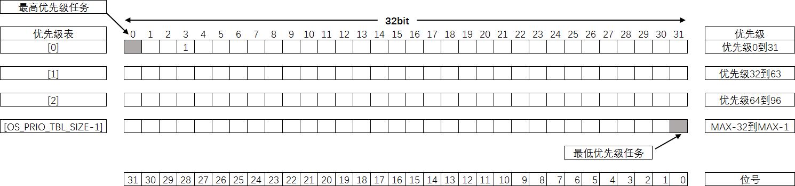
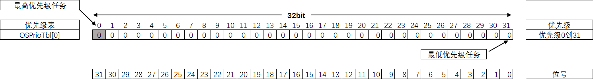
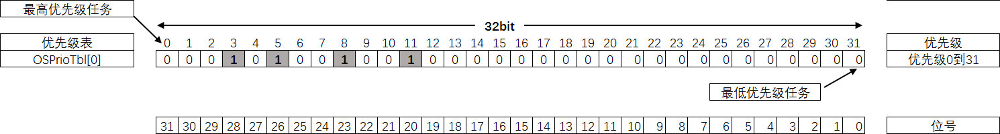
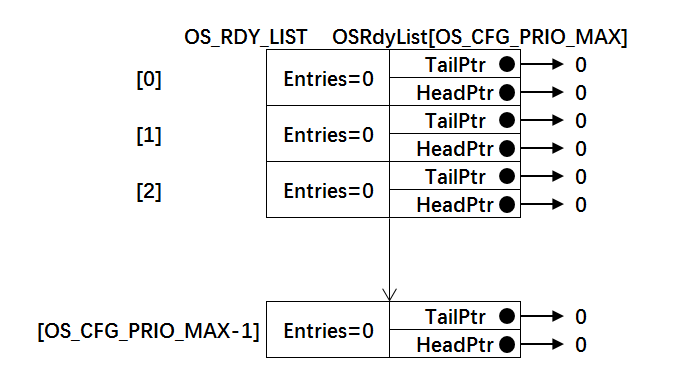
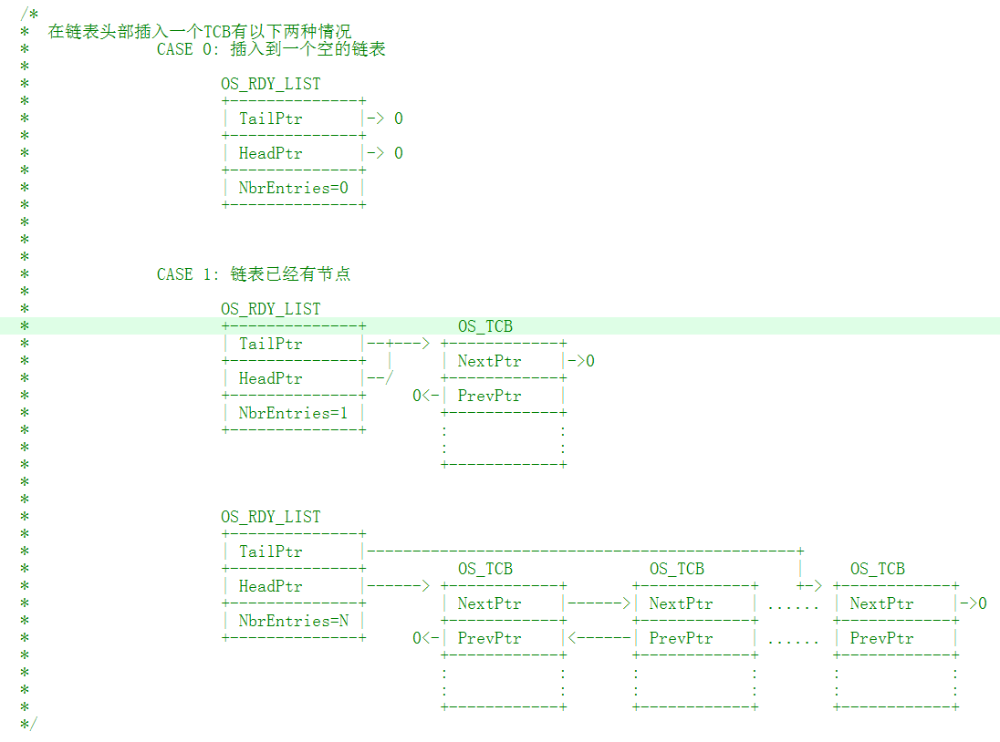
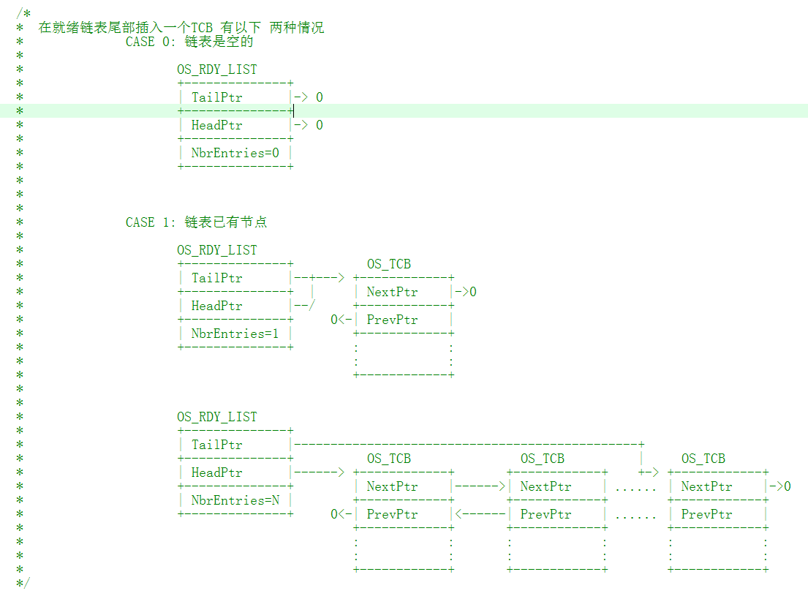
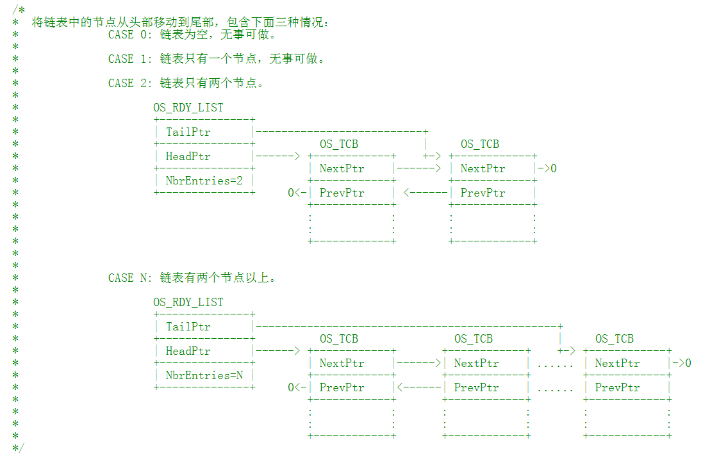
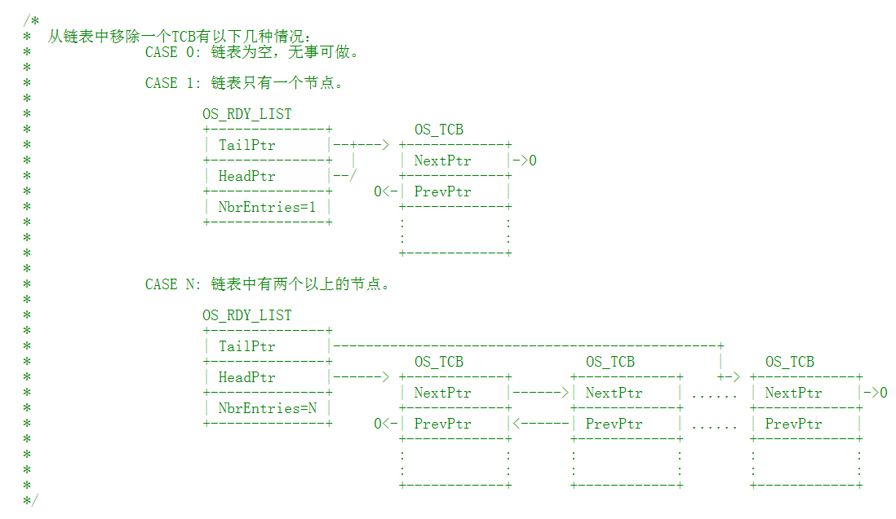

.. vim: syntax=rst

就绪列表
=============

在μC/OS-III中，任务被创建后，任务的TCB会被放入就绪列表中，表示任务在就绪，随时可能被运行。
就绪列表包含一个表示任务优先级的优先级表，一个存储任务TCB的TCB双向链表。

优先级表
~~~~~~~~~~~~

优先级表在代码层面上来看，就是一个数组，在文件os_prio.c（os_prio.c第一次使用需要自行在文件夹
μC/OS-III\Source中新建并添加到工程的μC/OS-III Source组）的开头定义，具体见 代码清单:就绪列表-1_。

.. code-block:: c
    :caption: 代码清单:就绪列表-1优先级表OSPrioTbl[]定义
    :name: 代码清单:就绪列表-1
    :linenos:

    /* 定义优先级表，在os.h中用extern声明 */
    CPU_DATA   OSPrioTbl[OS_PRIO_TBL_SIZE];(1)

-   代码清单:就绪列表-1_ （1）：正如我们所说，优先级表是一个数组，
    数组类型为CPU_DATA，在Cortex-M内核芯片的MCU中CPU_DATA为32位整型。
    数组的大小由宏OS_PRIO_TBL_SIZE控制。OS_PRIO_TBL_SIZE的具体取值与μC/OS-III支持多少个优先级有关，支持的优先级越多，
    优先级表也就越大，需要的RAM空间也就越多。理论上μC/OS-III支持无限的优先级，只要RAM控制足够。
    宏OS_PRIO_TBL_SIZE在os.h文件定义，具体实现见 代码清单:就绪列表-2_。

.. code-block:: c
    :caption: 代码清单:就绪列表-2OS_PRIO_TBL_SIZE宏定义
    :name: 代码清单:就绪列表-2
    :linenos:

    (1) (2)
    #define  OS_PRIO_TBL_SIZE((OS_CFG_PRIO_MAX - 1u) / (DEF_INT_CPU_NBR_BITS) + 1u)

-   代码清单:就绪列表-2_ （1）：OS_CFG_PRIO_MAX表示支持多少个优先级，
    在os_cfg.h中定义，本书设置为32，即最大支持32个优先级。

-   代码清单:就绪列表-2_ （2）：DEF_INT_CPU_NBR_BITS定义CPU整型数据有多少位，
    本书适配的是基于Cortex-M系列的MCU，宏展开为32位。

所以，经过OS_CFG_PRIO_MAX和DEF_INT_CPU_NBR_BITS这两个宏展开运算之后，可得出OS_PRIO_TBL_SIZE的值为1，
即优先级表只需要一个成员即可表示32个优先级。如果要支持64个优先级，即需要两个成员，以此类推。
如果MCU的类型是16位、8位或者64位，只需要把优先级表的数据类型CPU_DATA改成相应的位数即可。

那么优先级表又是如何跟任务的优先级联系在一起的？具体的优先级表的示意图见图 优先级表_。

在图 优先级表_ 中，优先级表的成员是32位的，每个成员可以表示32个优先级。如果优先级超过32个，那么优先级表的成员就要相应的增加。
以本书为例，CPU的类型为32位，支持最大的优先级为32个，优先级表只需要一个成员即可，即只有OSPrioTbl[0]。
假如创建一个优先级为Prio的任务，那么就在OSPrioTbl[0]的位[31-prio]置1即可。如果Prio等于3，那么就将位28置1。
OSPrioTbl[0]的位31表示的是优先级最高的任务，以此递减，直到OSPrioTbl[OS_PRIO_TBL_SIZE-1]]的位0，
OSPrioTbl[OS_PRIO_TBL_SIZE-1]]的位0表示的是最低的优先级。

优先级表函数讲解
^^^^^^^^^^^^^^^^^^^^^^^^

优先级表相关的函数在os_prio.c文件中实现，在os.h文件中声明，函数汇总具体见下表。

表:优先级表相关函数汇总

================= ======================
函数名称          函数作用
================= ======================
OS_PrioInit       初始化优先级表
OS_PrioInsert     设置优先级表中相应的位
OS_PrioRemove     清除优先级表中相应的位
OS_PrioGetHighest 查找最高的优先级
================= ======================

OS_PrioInit()函数
'''''''''''''''''''''''''''

OS_PrioInit()函数用于初始化优先级表，在OSInit()函数中被调用，具体实现见 代码清单:就绪列表-3_。

.. code-block:: c
    :caption: 代码清单:就绪列表-3OS_PrioInit()函数
    :name: 代码清单:就绪列表-3
    :linenos:

    /* 初始化优先级表 */
    void OS_PrioInit( void )
    {
        CPU_DATA i;

    /* 默认全部初始化为0 */
    for ( i=0u; i<OS_PRIO_TBL_SIZE; i++ ) {
            OSPrioTbl[i] = (CPU_DATA)0;
        }
    }

本书中，优先级表OS_PrioTbl[]只有一个成员，即OS_PRIO_TBL_SIZE等于1经过 代码清单:就绪列表-3_ 初始化之后，
具体示意图见图 优先级表初始化后的示意图_。

OS_PrioInsert()函数
'''''''''''''''''''''''''''''''''

OS_PrioInsert()函数用于置位优先级表中相应的位，会被OSTaskCreate()函数调用，具体实现见 代码清单:就绪列表-4_。

.. code-block:: c
    :caption: 代码清单:就绪列表-4OS_PrioInsert()函数
    :name: 代码清单:就绪列表-4
    :linenos:

    /* 置位优先级表中相应的位 */
    void  OS_PrioInsert (OS_PRIO  prio)
    {
        CPU_DATA  bit;
        CPU_DATA  bit_nbr;
        OS_PRIO   ix;

    /* 求模操作，获取优先级表数组的下标索引 */
        ix             = prio / DEF_INT_CPU_NBR_BITS;(1)

    /* 求余操作，将优先级限制在DEF_INT_CPU_NBR_BITS之内 */
        bit_nbr        = (CPU_DATA)prio & (DEF_INT_CPU_NBR_BITS - 1u);(2)

    /* 获取优先级在优先级表中对应的位的位置 */(3)
        bit            = 1u;
        bit          <<= (DEF_INT_CPU_NBR_BITS - 1u) - bit_nbr;

    /* 将优先级在优先级表中对应的位置1 */
        OSPrioTbl[ix] |= bit;(4)
    }

-   代码清单:就绪列表-4_ （1）：求模操作，获取优先级表数组的下标索引。即定位prio这个优先级对应优先级表数组的哪个成员。
    假设prio等于3，DEF_INT_CPU_NBR_BITS（用于表示CPU一个整型数有多少位）等于32，那么ix就等于0，即对应OSPrioTBL[0]。

-   代码清单:就绪列表-4_ （2）：求余操作，将优先级限制在DEF_INT_CPU_NBR_BITS之内，
    超过DEF_INT_CPU_NBR_BITS的优先级就肯定要增加优先级表的数组成员了。假设prio等于3，
    DEF_INT_CPU_NBR_BITS（用于表示CPU一个整型数有多少位）等于32，那么bit_nbr就等于3，
    但是这个还不是真正需要被置位的位。

-   代码清单:就绪列表-4_ （3）：获取优先级在优先级表中对应的位的位置。置位优先级对应的位是从高位开始的，
    不是从低位开始。位31对应的是优先级0，在μC/OS-III中，优先级数值越小，逻辑优先级就越高。
    假设prio等于3，DEF_INT_CPU_NBR_BITS（用于表示CPU一个整型数有多少位）等于32，那么bit就等于28。

-   代码清单:就绪列表-4_ （4）：将优先级在优先级表中对应的位置1。假设prio等于3，
    DEF_INT_CPU_NBR_BITS（用于表示CPU一个整型数有多少位）等于32，那么置位的就是OSPrioTbl[0]的位28。

在优先级最大是32，DEF_INT_CPU_NBR_BITS等于32的情况下，如果分别创建了优先级3、5、8和11这四个任务，任务创建成功后，
优先级表的设置情况是怎么样的？具体见图 创建优先级3-5-8和11后优先级表的设置情况_。有一点要注意的是，在μC/OS-III中，
最高优先级和最低优先级是留给系统任务使用的，用户任务不能使用。

OS_PrioRemove()函数
'''''''''''''''''''''''''''''''''

OS_PrioRemove()函数用于清除优先级表中相应的位，与OS_PrioInsert()函数的作用刚好相反，
具体实现见 代码清单:就绪列表-5_ ，有关代码的讲解参考 代码清单:就绪列表-4_ 即可，不同的是置位操作改成了清零。

.. code-block:: c
    :caption: 代码清单:就绪列表-5OS_PrioRemove()函数
    :name: 代码清单:就绪列表-5
    :linenos:

    /* 清除优先级表中相应的位 */
    void  OS_PrioRemove (OS_PRIO  prio)
    {
        CPU_DATA  bit;
        CPU_DATA  bit_nbr;
        OS_PRIO   ix;

    /* 求模操作，获取优先级表数组的下标索引 */
        ix             = prio / DEF_INT_CPU_NBR_BITS;

    /* 求余操作，将优先级限制在DEF_INT_CPU_NBR_BITS之内 */
        bit_nbr        = (CPU_DATA)prio & (DEF_INT_CPU_NBR_BITS - 1u);

    /* 获取优先级在优先级表中对应的位的位置 */
        bit            = 1u;
        bit          <<= (DEF_INT_CPU_NBR_BITS - 1u) - bit_nbr;

    /* 将优先级在优先级表中对应的位清零 */
        OSPrioTbl[ix] &= ~bit;
    }

OS_PrioGetHighest()函数
'''''''''''''''''''''''''''''''''''''''''

OS_PrioGetHighest()函数用于从优先级表中查找最高的优先级，具体实现见 代码清单:就绪列表-6_。

.. code-block:: c
    :caption: 代码清单:就绪列表-6OS_PrioGetHighest()函数
    :name: 代码清单:就绪列表-6
    :linenos:

    /* 获取最高的优先级 */
    OS_PRIO  OS_PrioGetHighest (void)
    {
        CPU_DATA  *p_tbl;
        OS_PRIO    prio;

        prio  = (OS_PRIO)0;
    /* 获取优先级表首地址 */
        p_tbl = &OSPrioTbl[0];(1)

    /* 找到数值不为0的数组成员 */(2)
    while (*p_tbl == (CPU_DATA)0) {
            prio += DEF_INT_CPU_NBR_BITS;
            p_tbl++;
        }

    /* 找到优先级表中置位的最高的优先级 */
        prio += (OS_PRIO)CPU_CntLeadZeros(*p_tbl);(3)
    return (prio);
    }

-   代码清单:就绪列表-6_ （1）：获取优先级表的首地址，从头开始搜索整个优先级表，直到找到最高的优先级。

-   代码清单:就绪列表-6_ （2）：找到优先级表中数值不为0的数组成员，只要不为0就表示该成员里面至少有一个位是置位的。
    我们知道，在 图优先级表_ 的优先级表中，优先级按照从左到右，从上到下依次减小，左上角为最高的优先级，
    右下角为最低的优先级，所以我们只需要找到第一个不是0的优先级表成员即可。

-   代码清单:就绪列表-6_ （3）：确定好优先级表中第一个不为0的成员后，
    然后再找出该成员中第一个置1的位（从高位到低位开始找）就算找到最高优先级。在一个变量中，
    按照从高位到低位的顺序查找第一个置1的位的方法是通过计算前导0函数CPU_CntLeadZeros()来实现的。
    从高位开始找1叫计算前导0，从低位开始找1叫计算后导0。如果分别创建了优先级3、5、8和11这四个任务，
    任务创建成功后，优先级表的设置情况具体见图 创建优先级3_5_8和11后优先级表的设置情况_。
    调用CPU_CntLeadZeros()可以计算出OSPrioTbl[0]第一个置1的位前面有3个0，那么这个3就是我们要查找的最高优先级，
    至于后面还有多少个位置1我们都不用管，只需要找到第一个1即可。

CPU_CntLeadZeros()函数可由汇编或者C来实现，如果使用的处理器支持前导零指令CLZ，可由汇编来实现，加快指令运算，如果不支持则由C来实现。
在μC/OS-III中，这两种实现方法均有提供代码，到底使用哪种方法由CPU_CFG_LEAD_ZEROS_ASM_PRESEN这个宏来控制，
定义了这个宏则使用汇编来实现，没有定义则使用C来实现。

Cortex-M系列处理器自带CLZ指令，所以CPU_CntLeadZeros()函数默认由汇编编写，具体在cpu_a.asm文件实现，
在cpu.h文件声明，具体见 代码清单:就绪列表-7_。

.. code-block::
    :caption: 代码清单:就绪列表-7CPU_CntLeadZeros()函数实现与声明
    :name: 代码清单:就绪列表-7
    :linenos:

    ;*******************************************************************
    ;                            PUBLIC FUNCTIONS
    ;*******************************************************************
            EXPORT  CPU_CntLeadZeros
            EXPORT  CPU_CntTrailZeros

    ;*******************************************************************
    ;                           计算前导0函数
    ;
    ; 描述：
    ;
    ; 函数声明： CPU_DATA  CPU_CntLeadZeros(CPU_DATA  val);
    ;
    ;*******************************************************************
    CPU_CntLeadZeros
            CLZ     R0, R0                          ; Count leading zeros
    BX      LR

    ;*******************************************************************
    ;                           计算后导0函数
    ;
    ; 描述：
    ;
    ; 函数声明： CPU_DATA  CPU_CntTrailZeros(CPU_DATA  val);
    ;
    ;*******************************************************************

    CPU_CntTrailZeros
            RBIT    R0, R0                          ; Reverse bits
            CLZ     R0, R0                          ; Count trailing zeros
    BX      LR

    /*
    *******************************************************************
    *                           函数声明
    *                          cpu.h文件
    *******************************************************************
    */
    #define     CPU_CFG_LEAD_ZEROS_ASM_PRESEN
    CPU_DATA    CPU_CntLeadZeros (CPU_DATA    val);    /* 在cpu_a.asm定义 */
    CPU_DATA    CPU_CntTrailZeros(CPU_DATA  val);      /* 在cpu_a.asm定义 */

如果处理器不支持前导0指令，CPU_CntLeadZeros()函数就得由C编写，具体在cpu_core.c文件实现，
在cpu.h文件声明，具体见 代码清单:就绪列表-8_。

.. code-block:: c
    :caption: 代码清单:就绪列表-8由C实现的CPU_CntLeadZeros()函数
    :name: 代码清单:就绪列表-8
    :linenos:

    #ifndef   CPU_CFG_LEAD_ZEROS_ASM_PRESENT
    CPU_DATA  CPU_CntLeadZeros (CPU_DATA  val)
    {
        CPU_DATA    nbr_lead_zeros;
        CPU_INT08U  ix;

    /* 检查高16位 */
    if (val > 0x0000FFFFu) {(1)
    /* 检查 bits [31:24] : */
    if (val > 0x00FFFFFFu) {(2)

    /* 获取bits [31:24]的值，并转换成8位 */
                ix             = (CPU_INT08U)(val >> 24u);(3)
    /* 查表找到优先级 */
                nbr_lead_zeros=(CPU_DATA)(CPU_CntLeadZerosTbl[ix]+0u);(4)

            }
    /* 检查 bits [23:16] : */
    else {
    /* 获取bits [23:16]的值，并转换成8位 */
                ix             = (CPU_INT08U)(val >> 16u);
    /* 查表找到优先级 */
                nbr_lead_zeros = (CPU_DATA  )(CPU_CntLeadZerosTbl[ix] +  8u);
            }

        }
    /* 检查低16位 */
    else {
    /* 检查 bits [15:08] : */
    if (val > 0x000000FFu) {
    /* 获取bits [15:08]的值，并转换成8位 */
                ix             = (CPU_INT08U)(val >>  8u);
    /* 查表找到优先级 */
                nbr_lead_zeros = (CPU_DATA  )(CPU_CntLeadZerosTbl[ix] + 16u);

            }
    /* 检查 bits [07:00] : */
    else {
    /* 获取bits [15:08]的值，并转换成8位 */
                ix             = (CPU_INT08U)(val >>  0u);
    /* 查表找到优先级 */
                nbr_lead_zeros = (CPU_DATA  )(CPU_CntLeadZerosTbl[ix] + 24u);
            }
        }

    /* 返回优先级 */
    return (nbr_lead_zeros);
    }
    #endif

在μC/OS-III中，由C实现的CPU_CntLeadZeros()函数支持8位、16位、32位和64位的变量的前导0计算，
但最终的代码实现都是分离成8位来计算。这里我们只讲解32位的，其他几种情况都类似。

-   代码清单:就绪列表-8_ （1）：分离出高16位，else则为低16位。

-   代码清单:就绪列表-8_ （2）：分离出高16位的高8位，else则为高16位的低8位。

-   代码清单:就绪列表-8_ （3）：将高16位的高8位通过移位强制转化为8位的变量，用于后面的查表操作。

-   代码清单:就绪列表-8_ （4）：将8位的变量ix作为数组CPU_CntLeadZerosTbl[]的索引，
    返回索引对应的值，那么该值就是8位变量ix对应的前导0，然后再加上（24-右移的位数）就等于优先级。
    数组CPU_CntLeadZerosTbl[]在cpu_core.c的开头定义，具体见 代码清单:就绪列表-9_。

.. code-block:: c
    :caption: 代码清单:就绪列表-9CPU_CntLeadZerosTbl[]定义
    :name: 代码清单:就绪列表-9
    :linenos:

    #ifndef   CPU_CFG_LEAD_ZEROS_ASM_PRESENT
    static  const  CPU_INT08U  CPU_CntLeadZerosTbl[256] = {/*   索引           */
        8u,7u,6u,6u,5u,5u,5u,5u,4u,4u,4u,4u,4u,4u,4u,4u,  /*   0x00 to 0x0F   */
        3u,3u,3u,3u,3u,3u,3u,3u,3u,3u,3u,3u,3u,3u,3u,3u,  /*   0x10 to 0x1F   */
        2u,2u,2u,2u,2u,2u,2u,2u,2u,2u,2u,2u,2u,2u,2u,2u,  /*   0x20 to 0x2F   */
        2u,2u,2u,2u,2u,2u,2u,2u,2u,2u,2u,2u,2u,2u,2u,2u,  /*   0x30 to 0x3F   */
        1u,1u,1u,1u,1u,1u,1u,1u,1u,1u,1u,1u,1u,1u,1u,1u,  /*   0x40 to 0x4F   */
        1u,1u,1u,1u,1u,1u,1u,1u,1u,1u,1u,1u,1u,1u,1u,1u,  /*   0x50 to 0x5F   */
        1u,1u,1u,1u,1u,1u,1u,1u,1u,1u,1u,1u,1u,1u,1u,1u,  /*   0x60 to 0x6F   */
        1u,1u,1u,1u,1u,1u,1u,1u,1u,1u,1u,1u,1u,1u,1u,1u,  /*   0x70 to 0x7F   */
        0u,0u,0u,0u,0u,0u,0u,0u,0u,0u,0u,0u,0u,0u,0u,0u,  /*   0x80 to 0x8F   */
        0u,0u,0u,0u,0u,0u,0u,0u,0u,0u,0u,0u,0u,0u,0u,0u,  /*   0x90 to 0x9F   */
        0u,0u,0u,0u,0u,0u,0u,0u,0u,0u,0u,0u,0u,0u,0u,0u,  /*   0xA0 to 0xAF   */
        0u,0u,0u,0u,0u,0u,0u,0u,0u,0u,0u,0u,0u,0u,0u,0u,  /*   0xB0 to 0xBF   */
        0u,0u,0u,0u,0u,0u,0u,0u,0u,0u,0u,0u,0u,0u,0u,0u,  /*   0xC0 to 0xCF   */
        0u,0u,0u,0u,0u,0u,0u,0u,0u,0u,0u,0u,0u,0u,0u,0u,  /*   0xD0 to 0xDF   */
        0u,0u,0u,0u,0u,0u,0u,0u,0u,0u,0u,0u,0u,0u,0u,0u,  /*   0xE0 to 0xEF   */
        0u,0u,0u,0u,0u,0u,0u,0u,0u,0u,0u,0u,0u,0u,0u,0u   /*   0xF0 to 0xFF   */
    };
    #endif

代码清单:就绪列表-8中，对一个32位的变量算前导0个数的时候都是分离成8位的变量来计算，然后将这个8位的变量作为数组
CPU_CntLeadZerosTbl[]的索引，索引下对应的值就是这个8位变量的前导0个数。一个8位的变量的取值范围为0~0XFF，
这些值作为数组CPU_CntLeadZerosTbl[]的索引，每一个值的前导0个数都预先算出来作为该数组索引下的值。
通过查CPU_CntLeadZerosTbl[]这个表就可以很快的知道一个8位变量的前导0个数，根本不用计算，
只是浪费了定义CPU_CntLeadZerosTbl[]这个表的一点点空间而已，在处理器内存很充足的情况下，
则优先选择这种空间换时间的方法。

就绪列表
~~~~~~~~~~~~

准备好运行的任务的TCB都会被放到就绪列表中，系统可随时调度任务运行。就绪列表在代码的层面上看就是一个
OS_RDY_LIST数据类型的数组OSRdyList[]，数组的大小由宏OS_CFG_PRIO_MAX决定，支持多少个优先级，
OSRdyList[]就有多少个成员。任务的优先级与OSRdyList[]的索引一一对应，比如优先级3的任务的TCB会被放到OSRdyList[3]中。
OSRdyList[]是一个在os.h文件中定义的全局变量，具体见 代码清单:就绪列表-10_。

.. code-block:: c
    :caption: 代码清单:就绪列表-10 OSRdyList[]数组定义
    :name: 代码清单:就绪列表-10
    :linenos:

    /* 就绪列表定义 */
    OS_EXT    OS_RDY_LIST    OSRdyList[OS_CFG_PRIO_MAX];

代码清单:就绪列表-10中的数据类型OS_RDY_LIST在os.h中定义，专用于就绪列表，具体实现见 代码清单:就绪列表-11_。

.. code-block:: c
    :caption: 代码清单:就绪列表-11OS_RDY_LIST定义
    :name: 代码清单:就绪列表-11
    :linenos:

    typedefstruct  os_rdy_list         OS_RDY_LIST;(1)

    struct os_rdy_list {
        OS_TCB        *HeadPtr;(2)
        OS_TCB        *TailPtr;
        OS_OBJ_QTY    NbrEntries;(3)
    };

-   代码清单:就绪列表-11_ （1）：在μC/OS-III中，内核对象的数据类型都会用大写字母重新定义。

-   代码清单:就绪列表-11_ （2）：OSRdyList[]的成员与任务的优先级一一对应，
    同一个优先级的多个任务会以双向链表的形式存在OSRdyList[]同一个索引下，那么HeadPtr就用于指向链表的头节点，
    TailPtr用于指向链表的尾节点，该优先级下的索引成员的地址则称为该优先级下双向链表的根节点，
    知道根节点的地址就可以查找到该链表下的每一个节点。

-   代码清单:就绪列表-11_ （3）：NbrEntries表示OSRdyList[]同一个索引下有多少个任务。

一个空的就绪列表，OSRdyList[]索引下的HeadPtr、TailPtr和NbrEntrie都会被初始化为0，具体见图 空的就绪列表_。

就绪列表相关的所有函数都在os_core.c实现，这些函数都是以“OS_”开头，表示是OS的内部函数，
用户不能调用，这些函数的汇总具体见下表。

表：就绪列表相关函数汇总

======================== =============================
函数名称                 函数作用
======================== =============================
OS_RdyListInit           初始化就绪列表为空
OS_RdyListInsert         插入一个TCB到就绪列表
OS_RdyListInsertHead     插入一个TCB到就绪列表的头部
OS_RdyListInsertTail     插入一个TCB到就绪列表的尾部
OS_RdyListMoveHeadToTail 将TCB从就绪列表的头部移到尾部
OS_RdyListRemove         将TCB从就绪列表中移除
======================== =============================

就绪列表函数讲解
^^^^^^^^^^^^^^^^^^^^^^^^

在实现就绪列表相关函数之前，我们需要在结构体os_tcb中添加Prio、NextPtr和PrevPtr这三个成员，
然后在os.h中定义两个全局变量OSPrioCur和OSPrioHighRdy，具体定义见 代码清单:就绪列表-12_。
接下来要实现的就绪列表相关的函数会用到几个变量。

.. code-block:: c
    :caption: 代码清单:就绪列表-12就绪列表函数需要用到的变量定义
    :name: 代码清单:就绪列表-12
    :linenos:

    struct os_tcb {
        CPU_STK         *StkPtr;
        CPU_STK_SIZE    StkSize;

    /* 任务延时周期个数 */
        OS_TICK         TaskDelayTicks;

    /* 任务优先级 */
        OS_PRIO         Prio;

    /* 就绪列表双向链表的下一个指针 */
        OS_TCB          *NextPtr;
    /* 就绪列表双向链表的前一个指针 */
        OS_TCB          *PrevPtr;
    };

    /* 在os.h中定义 */
    OS_EXT    OS_PRIO  OSPrioCur;       /* 当前优先级 */
    OS_EXT    OS_PRIO  OSPrioHighRdy;   /* 最高优先级 */

OS_RdyListInit()函数
''''''''''''''''''''''''''''''''''

OS_RdyListInit()用于将就绪列表OSRdyList[]初始化为空，初始化完毕之后具体示意图见图 空的就绪列表_ ，
具体实现见 代码清单:就绪列表-13_。

.. code-block:: c
    :caption: 代码清单:就绪列表-13OS_RdyListInit()函数
    :name: 代码清单:就绪列表-13
    :linenos:

    void OS_RdyListInit(void)
    {
        OS_PRIO i;
        OS_RDY_LIST *p_rdy_list;

    /* 循环初始化，所有成员都初始化为0 */
    for ( i=0u; i<OS_CFG_PRIO_MAX; i++ ) {
            p_rdy_list = &OSRdyList[i];
            p_rdy_list->NbrEntries = (OS_OBJ_QTY)0;
            p_rdy_list->HeadPtr = (OS_TCB *)0;
            p_rdy_list->TailPtr = (OS_TCB *)0;
        }
    }

OS_RdyListInsertHead()函数
''''''''''''''''''''''''''''''''''''''''''''''''

OS_RdyListInsertHead()用于在链表头部插入一个TCB节点，插入的时候分两种情况，第一种是链表是空链表，
第二种是链表中已有节点，具体示意图见图 在链表的头部插入一个TCB节点前链表的可能情况_ ，
具体的代码实现见 代码清单:就绪列表-14_ ，阅读代码的时候最好配套示意图来理解。

.. code-block:: c
    :caption: 代码清单:就绪列表-14OS_RdyListInsertHead()函数
    :name: 代码清单:就绪列表-14
    :linenos:

    void  OS_RdyListInsertHead (OS_TCB  *p_tcb)
    {
        OS_RDY_LIST  *p_rdy_list;
        OS_TCB       *p_tcb2;

    /* 获取链表根部 */
        p_rdy_list = &OSRdyList[p_tcb->Prio];

    /* CASE 0: 链表是空链表 */
    if (p_rdy_list->NbrEntries == (OS_OBJ_QTY)0) {
            p_rdy_list->NbrEntries =  (OS_OBJ_QTY)1;
            p_tcb->NextPtr         =  (OS_TCB   *)0;
            p_tcb->PrevPtr         =  (OS_TCB   *)0;
            p_rdy_list->HeadPtr    =  p_tcb;
            p_rdy_list->TailPtr    =  p_tcb;
        }
    /* CASE 1: 链表已有节点 */
    else {
            p_rdy_list->NbrEntries++;
            p_tcb->NextPtr         = p_rdy_list->HeadPtr;
            p_tcb->PrevPtr         = (OS_TCB    *)0;
            p_tcb2                 = p_rdy_list->HeadPtr;
            p_tcb2->PrevPtr        = p_tcb;
            p_rdy_list->HeadPtr    = p_tcb;
        }
    }

OS_RdyListInsertTail()函数
'''''''''''''''''''''''''''''''''

OS_RdyListInsertTail()用于在链表尾部插入一个TCB节点，插入的时候分两种情况，第一种是链表是空链表，
第二种是链表中已有节点，具体示意图见图 在链表的尾部插入一个TCB节点前链表的可能情况_ ，
具体的代码实现见，阅读代码的时候最好配套示意图来理解。

.. code-block:: c
    :caption: 代码清单:就绪列表-15OS_RdyListInsertTail()函数
    :name: 代码清单:就绪列表-
    :linenos:

    void  OS_RdyListInsertTail (OS_TCB  *p_tcb)
    {
        OS_RDY_LIST  *p_rdy_list;
        OS_TCB       *p_tcb2;

    /* 获取链表根部 */
        p_rdy_list = &OSRdyList[p_tcb->Prio];

    /* CASE 0: 链表是空链表 */
    if (p_rdy_list->NbrEntries == (OS_OBJ_QTY)0) {
            p_rdy_list->NbrEntries  = (OS_OBJ_QTY)1;
            p_tcb->NextPtr          = (OS_TCB   *)0;
            p_tcb->PrevPtr          = (OS_TCB   *)0;
            p_rdy_list->HeadPtr     = p_tcb;
            p_rdy_list->TailPtr     = p_tcb;
        }
    /* CASE 1: 链表已有节点 */
    else {
            p_rdy_list->NbrEntries++;
            p_tcb->NextPtr          = (OS_TCB   *)0;
            p_tcb2                  = p_rdy_list->TailPtr;
            p_tcb->PrevPtr          = p_tcb2;
            p_tcb2->NextPtr         = p_tcb;
            p_rdy_list->TailPtr     = p_tcb;
        }
    }

OS_RdyListInsert()函数
''''''''''''''''''''''''''''''''''''''''

OS_RdyListInsert()用于将任务的TCB插入就绪列表，插入的时候分成两步，第一步是根据优先级将优先级表中的相应位置位，
这个调用OS_PrioInsert()函数来实现，第二步是根据优先级将任务的TCB放到OSRdyList[优先级]中，
如果优先级等于当前的优先级则插入链表的尾部，否则插入链表的头部，具体实现见 代码清单:就绪列表-16_。

.. code-block:: c
    :caption: 代码清单:就绪列表-16OS_RdyListInsert()函数
    :name: 代码清单:就绪列表-16
    :linenos:

    /* 在就绪链表中插入一个TCB */
    void  OS_RdyListInsert (OS_TCB  *p_tcb)
    {
    /* 将优先级插入优先级表 */
        OS_PrioInsert(p_tcb->Prio);

    if (p_tcb->Prio == OSPrioCur) {
    /* 如果是当前优先级则插入链表尾部 */
            OS_RdyListInsertTail(p_tcb);
        } else {
    /* 否则插入链表头部 */
            OS_RdyListInsertHead(p_tcb);
        }
    }

OS_RdyListMoveHeadToTail()函数
''''''''''''''''''''''''''''''''''''''

OS_RdyListMoveHeadToTail()函数用于将节点从链表头部移动到尾部，移动的时候分四种情况，第一种是链表为空，无事可做；
第二种是链表只有一个节点，也是无事可做；第三种是链表只有两个节点；第四种是链表有两个以上节点，
具体示意图见图 将节点从链表头部移动到尾部前链表的可能情况_ ，具体代码实现见 代码清单:就绪列表-17_ ，
阅读代码的时候最好配套示意图来理解。

.. code-block:: c
    :caption: 代码清单:就绪列表-17OS_RdyListMoveHeadToTail()函数
    :name: 代码清单:就绪列表-17
    :linenos:

    void  OS_RdyListMoveHeadToTail (OS_RDY_LIST  *p_rdy_list)
    {
        OS_TCB  *p_tcb1;
        OS_TCB  *p_tcb2;
        OS_TCB  *p_tcb3;

    switch (p_rdy_list->NbrEntries) {
    case 0:
    case 1:
    break;

    case 2:
            p_tcb1              = p_rdy_list->HeadPtr;
            p_tcb2              = p_rdy_list->TailPtr;
            p_tcb1->PrevPtr     = p_tcb2;
            p_tcb1->NextPtr     = (OS_TCB *)0;
            p_tcb2->PrevPtr     = (OS_TCB *)0;
            p_tcb2->NextPtr     = p_tcb1;
            p_rdy_list->HeadPtr = p_tcb2;
            p_rdy_list->TailPtr = p_tcb1;
    break;

    default:
            p_tcb1              = p_rdy_list->HeadPtr;
            p_tcb2              = p_rdy_list->TailPtr;
            p_tcb3              = p_tcb1->NextPtr;
            p_tcb3->PrevPtr     = (OS_TCB *)0;
            p_tcb1->NextPtr     = (OS_TCB *)0;
            p_tcb1->PrevPtr     = p_tcb2;
            p_tcb2->NextPtr     = p_tcb1;
            p_rdy_list->HeadPtr = p_tcb3;
            p_rdy_list->TailPtr = p_tcb1;
    break;
        }
    }

OS_RdyListRemove()函数
''''''''''''''''''''''''''''''''''''''''

OS_RdyListRemove()函数用于从链表中移除一个节点，移除的时候分为三种情况，第一种是链表为空，无事可做；
第二种是链表只有一个节点；第三种是链表有两个以上节点，具体示意图见图 从链表中移除一个节点前链表的可能情况_ ，
具体代码实现见，阅读代码的时候最好配套示意图来理解。

.. code-block:: c
    :caption: 代码清单:就绪列表-18OS_RdyListRemove()函数
    :name: 代码清单:就绪列表-18
    :linenos:

    void  OS_RdyListRemove (OS_TCB  *p_tcb)
    {
        OS_RDY_LIST  *p_rdy_list;
        OS_TCB       *p_tcb1;
        OS_TCB       *p_tcb2;

        p_rdy_list = &OSRdyList[p_tcb->Prio];

    /* 保存要删除的TCB节点的前一个和后一个节点 */
        p_tcb1     = p_tcb->PrevPtr;
        p_tcb2     = p_tcb->NextPtr;

    /* 要移除的TCB节点是链表中的第一个节点 */
    if (p_tcb1 == (OS_TCB *)0) {
    /* 且该链表中只有一个节点 */
    if (p_tcb2 == (OS_TCB *)0) {
    /* 根节点全部初始化为0 */
                p_rdy_list->NbrEntries = (OS_OBJ_QTY)0;
                p_rdy_list->HeadPtr    = (OS_TCB   *)0;
                p_rdy_list->TailPtr    = (OS_TCB   *)0;

    /* 清除在优先级表中相应的位 */
                OS_PrioRemove(p_tcb->Prio);
            }
    /* 该链表中不止一个节点 */
    else {
    /* 节点减1 */
                p_rdy_list->NbrEntries--;
                p_tcb2->PrevPtr        = (OS_TCB   *)0;
                p_rdy_list->HeadPtr    = p_tcb2;
            }
        }
    /* 要移除的TCB节点不是链表中的第一个节点 */
    else {
            p_rdy_list->NbrEntries--;
            p_tcb1->NextPtr = p_tcb2;

    /* 如果要删除的节点的下一个节点是0，即要删除的节点是最后一个节点 */
    if (p_tcb2 == (OS_TCB *)0) {
                p_rdy_list->TailPtr = p_tcb1;
            } else {
                p_tcb2->PrevPtr     = p_tcb1;
            }
        }

    /* 复位从就绪列表中删除的TCB的PrevPtr和NextPtr这两个指针 */
        p_tcb->PrevPtr = (OS_TCB *)0;
        p_tcb->NextPtr = (OS_TCB *)0;
    }

main()函数
~~~~~~~~~~~~~~~~~~~~~~~~

本章main()函数没有添加新的测试代码，只需理解章节内容即可。

实验现象
~~~~~~~~~~~~

本章没有实验，只需理解章节内容即可。
