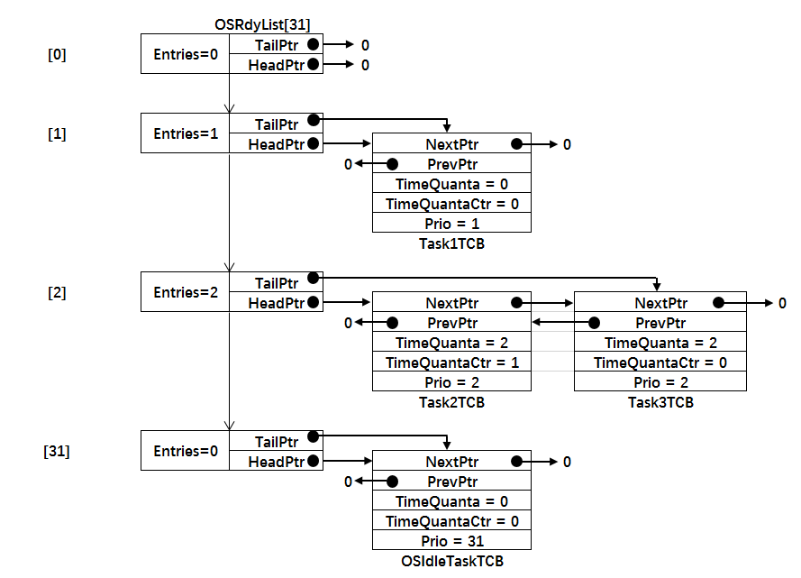
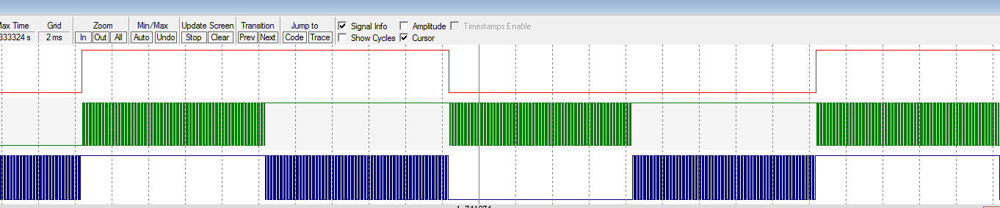

.. vim: syntax=rst

实现时间片
============

本章开始，我们让OS支持同一个优先级下可以有多个任务的功能，这些任务可以分配不同的时间片，当任务时间片用完的时候，
任务会从链表的头部移动到尾部，让下一个任务共享时间片，以此循环。

实现时间片
~~~~~~~~~~~~~

修改任务TCB
^^^^^^^^^^^^^^^^^^^

为了实现时间片功能，我们需要先在任务控制块TCB中添加两个时间片相关的变量，具体见 代码清单:阻塞延时-1_ 的加粗部分。

.. code-block:: c
    :caption: 代码清单:阻塞延时-1在 TCB中添加时间片相关的变量
    :emphasize-lines: 25-26
    :name: 代码清单:阻塞延时-1
    :linenos:

    struct os_tcb {
        CPU_STK         *StkPtr;
        CPU_STK_SIZE    StkSize;

    /* 任务延时周期个数 */
        OS_TICK         TaskDelayTicks;

    /* 任务优先级 */
        OS_PRIO         Prio;

    /* 就绪列表双向链表的下一个指针 */
        OS_TCB          *NextPtr;
    /* 就绪列表双向链表的前一个指针 */
        OS_TCB          *PrevPtr;

    /*时基列表相关字段*/
        OS_TCB          *TickNextPtr;
        OS_TCB          *TickPrevPtr;
        OS_TICK_SPOKE   *TickSpokePtr;

        OS_TICK         TickCtrMatch;
        OS_TICK         TickRemain;

    /* 时间片相关字段 */
        OS_TICK              TimeQuanta;(1)
        OS_TICK              TimeQuantaCtr;(2)
    };

-   代码清单:阻塞延时-1_ （1）：TimeQuanta表示任务需要多少个时间片，单位为系统时钟周期Tick。

-   代码清单:阻塞延时-1_ （2）：TimeQuantaCtr表示任务还剩下多少个时间片，每到来一个系统时钟周期，
    TimeQuantaCtr会减一，当TimeQuantaCtr等于零的时候，表示时间片用完，
    任务的TCB会从就绪列表链表的头部移动到尾部，好让下一个任务共享时间片。

实现时间片调度函数
^^^^^^^^^^^^^^^^^^^^^^^^^

OS_SchedRoundRobin()函数
'''''''''''''''''''''''''''''''

时间片调度函数OS_SchedRoundRobin()在os_core.c中实现，在OSTimeTick()调用，具体见 代码清单:阻塞延时-2_。
在阅读 代码清单:阻塞延时-2_ 的时候，可配图 时间片调度函数讲解配套_ 一起理解，该图画的是在一个就绪链表中，
有三个任务就绪，其中在优先级2下面有两个任务，均分配了两个时间片，其中任务3的时间片已用完，则位于链表的末尾，
任务2的时间片还剩一个，则位于链表的头部。当下一个时钟周期到来的时候，任务2的时间片将耗完，
相应的TimeQuantaCtr会递减为0，任务2的TCB会被移动到链表的末尾，任务3则被成为链表的头部，
然后重置任务3的时间片计数器TimeQuantaCtr的值为2，重新享有时间片。

.. code-block:: c
    :caption: 代码清单:阻塞延时-2时间片调度函数
    :name: 代码清单:阻塞延时-2
    :linenos:

    #if OS_CFG_SCHED_ROUND_ROBIN_EN > 0u(1)
    void OS_SchedRoundRobin(OS_RDY_LIST  *p_rdy_list)
    {
        OS_TCB   *p_tcb;
        CPU_SR_ALLOC();

    /*  进入临界段 */
        CPU_CRITICAL_ENTER();

        p_tcb = p_rdy_list->HeadPtr;(2)

    /* 如果TCB节点为空，则退出 */
    if (p_tcb == (OS_TCB *)0) {(3)
            CPU_CRITICAL_EXIT();
    return;
        }

    /* 如果是空闲任务，也退出 */
    if (p_tcb == &OSIdleTaskTCB) {(4)
            CPU_CRITICAL_EXIT();
    return;
        }

    /* 时间片自减 */
    if (p_tcb->TimeQuantaCtr > (OS_TICK)0) {(5)
            p_tcb->TimeQuantaCtr--;
        }

    /* 时间片没有用完，则退出 */
    if (p_tcb->TimeQuantaCtr > (OS_TICK)0) {(6)
            CPU_CRITICAL_EXIT();
    return;
        }

    /* 如果当前优先级只有一个任务，则退出 */
    if (p_rdy_list->NbrEntries < (OS_OBJ_QTY)2) {(7)
            CPU_CRITICAL_EXIT();
    return;
        }

    /* 时间片耗完，将任务放到链表的最后一个节点 */
        OS_RdyListMoveHeadToTail(p_rdy_list);(8)

    /* 重新获取任务节点 */
        p_tcb = p_rdy_list->HeadPtr;(9)
    /* 重载默认的时间片计数值 */
        p_tcb->TimeQuantaCtr = p_tcb->TimeQuanta;

    /* 退出临界段 */
        CPU_CRITICAL_EXIT();
    }
    #endif/* OS_CFG_SCHED_ROUND_ROBIN_EN > 0u */

-   代码清单:阻塞延时-2_ （1）：时间片是一个可选的功能，
    是否选择由OS_CFG_SCHED_ROUND_ROBIN_EN控制，该宏在os_cfg.h定义。

-   代码清单:阻塞延时-2_ （2）：获取链表的第一个节点。

-   代码清单:阻塞延时-2_ （3）：如果节点为空，则退出。

-   代码清单:阻塞延时-2_ （4）：如果节点不为空，看看是否是空闲任务，如果是则退出。

-   代码清单:阻塞延时-2_ （5）：如果不是空闲任务，则时间片计数器TimeQuantaCtr减一操作。

-   代码清单:阻塞延时-2_ （6）：时间片计数器TimeQuantaCtr递减之后，则判断下时间片是否用完，如果没有用完，则退出。

-   代码清单:阻塞延时-2_ （7）：如果时间片用完，则判断性该优先级下有多少个任务，如果是一个，就退出。

-   代码清单:阻塞延时-2_ （8）：时间片用完，如果该优先级下有两个以上任务，则将刚刚耗完时间片的节点移到链表的末尾，
    此时位于末尾的任务的TCB字段中的TimeQuantaCtr是等于0的，只有等它下一次运行的时候值才会重置为TimeQuanta。

-   代码清单:阻塞延时-2_ （9）：重新获取链表的第一个节点，
    重置时间片计数器TimeQuantaCtr的值等于TimeQuanta，任务重新享有时间片。

修改OSTimeTick()函数
~~~~~~~~~~~~~~~~~~~~~~~~~~~~~

任务的时间片的单位在每个系统时钟周期到来的时候被更新，时间片调度函数则由时基周期处理函数OSTimeTick()调用，
只需要在更新时基列表之后调用时间片调度函数即可，具体修改见 代码清单:阻塞延时-3_ 的加粗部分。

.. code-block:: c
    :caption: 代码清单:阻塞延时-3OSTimeTick()函数
    :emphasize-lines: 6-9
    :name: 代码清单:阻塞延时-3
    :linenos:

    void  OSTimeTick (void)
    {
    /* 更新时基列表 */
        OS_TickListUpdate();

    #if OS_CFG_SCHED_ROUND_ROBIN_EN > 0u
    /* 时间片调度 */
        OS_SchedRoundRobin(&OSRdyList[OSPrioCur]);
    #endif

    /* 任务调度 */
        OSSched();
    }

修改OSTaskCreate()函数
~~~~~~~~~~~~~~~~~~~~~~~~~~~~~~~~~~~~~~~~~~~~~~~~~~~~~~

任务的时间片在函数创建的时候被指定，具体修改见 代码清单:阻塞延时-4_ 中的加粗部分。

.. code-block:: c
    :caption: 代码清单:阻塞延时-4OSTaskCreate()函数
    :emphasize-lines: 28-31
    :name: 代码清单:阻塞延时-4
    :linenos:

    void OSTaskCreate (OS_TCB        *p_tcb,
                    OS_TASK_PTR   p_task,
    void          *p_arg,
                    OS_PRIO       prio,
                    CPU_STK       *p_stk_base,
                    CPU_STK_SIZE  stk_size,
    OS_TICK       time_quanta,(1)
                    OS_ERR        *p_err)
    {
        CPU_STK       *p_sp;
        CPU_SR_ALLOC();

    /* 初始化TCB为默认值 */
        OS_TaskInitTCB(p_tcb);

    /* 初始化栈 */
        p_sp = OSTaskStkInit( p_task,
                            p_arg,
                            p_stk_base,
                            stk_size );

        p_tcb->Prio = prio;

        p_tcb->StkPtr = p_sp;
        p_tcb->StkSize = stk_size;

    /* 时间片相关初始化 */
        p_tcb->TimeQuanta    = time_quanta;(2)
    #if OS_CFG_SCHED_ROUND_ROBIN_EN > 0u
        p_tcb->TimeQuantaCtr = time_quanta;(3)
    #endif

    /* 进入临界段 */
        OS_CRITICAL_ENTER();

    /* 将任务添加到就绪列表 */
        OS_PrioInsert(p_tcb->Prio);
        OS_RdyListInsertTail(p_tcb);

    /* 退出临界段 */
        OS_CRITICAL_EXIT();

        *p_err = OS_ERR_NONE;
    }

-   代码清单:阻塞延时-4_ （1）：时间片在任务创建的时候由函数形参time_quanta指定。

-   代码清单:阻塞延时-4_ （2）：初始化任务TCB字段的时间片变量TimeQuanta，
    该变量表示任务能享有的最大的时间片是多少，该值一旦初始化后就不会变，除非认为修改。

-   代码清单:阻塞延时-4_ （3）：初始化时间片计数器TimeQuantaCtr的值等于TimeQuanta，
    每经过一个系统时钟周期，该值会递减，如果该值为0，则表示时间片耗完。

修改OS_IdleTaskInit()函数
~~~~~~~~~~~~~~~~~~~~~~~~~~~~~~~~~~~~~~~~~~~~~~~~~~~~~~~~~~~~~

因为在OS_IdleTaskInit()函数中创建了空闲任务，所以该函数也需要修改，只需在空闲任务创建函数中，添加一个时间片的形参就可，
时间片我们分配为0，因为在空闲任务优先级下只有空闲任务一个任务，没有其他的任务，具体修改见 代码清单:阻塞延时-5_ 的加粗部分。

.. code-block:: c
    :caption: 代码清单:阻塞延时-5OS_IdleTaskInit()函数
    :emphasize-lines: 13
    :name: 代码清单:阻塞延时-5
    :linenos:

    void  OS_IdleTaskInit(OS_ERR  *p_err)
    {
    /* 初始化空闲任务计数器 */
        OSIdleTaskCtr = (OS_IDLE_CTR)0;

    /* 创建空闲任务 */
        OSTaskCreate( (OS_TCB     *)&OSIdleTaskTCB,
                    (OS_TASK_PTR )OS_IdleTask,
                    (void       *)0,
                    (OS_PRIO)(OS_CFG_PRIO_MAX - 1u),
                    (CPU_STK    *)OSCfg_IdleTaskStkBasePtr,
                    (CPU_STK_SIZE)OSCfg_IdleTaskStkSize,
    (OS_TICK       )0,
                    (OS_ERR     *)p_err );
    }

main()函数
~~~~~~~~~~~~~~~~~~~~~~~~

这里，我们创建任务1、2和3，其中任务1的优先级为1，时间片为0，任务2和任务3的优先级相同，均为2，均分配两个两个时间片，
当任务创建完毕后，就绪列表的分布图具体见图 main函数代码讲解配图_。

.. code-block:: c
    :caption: 代码清单:阻塞延时-6 main()函数
    :emphasize-lines: 22,25,31,34,40,43,64-65,67-68,76-77,79-80
    :name: 代码清单:阻塞延时-6
    :linenos:

    int main(void)
    {
        OS_ERR err;

    /* CPU初始化：1、初始化时间戳 */
        CPU_Init();

    /* 关闭中断 */
        CPU_IntDis();

    /* 配置SysTick 10ms 中断一次 */
        OS_CPU_SysTickInit (10);

    /* 初始化相关的全局变量 */
        OSInit(&err);

    /* 创建任务 */
        OSTaskCreate( (OS_TCB       *)&Task1TCB,
                    (OS_TASK_PTR   )Task1,
                    (void         *)0,
    (OS_PRIO       )1,(1)
                    (CPU_STK      *)&Task1Stk[0],
                    (CPU_STK_SIZE  )TASK1_STK_SIZE,
    (OS_TICK       )0,(1)
                    (OS_ERR       *)&err );

        OSTaskCreate( (OS_TCB       *)&Task2TCB,
                    (OS_TASK_PTR   )Task2,
                    (void         *)0,
    (OS_PRIO       )2,(2)
                    (CPU_STK      *)&Task2Stk[0],
                    (CPU_STK_SIZE  )TASK2_STK_SIZE,
    (OS_TICK       )1,(2)
                    (OS_ERR       *)&err );

        OSTaskCreate( (OS_TCB       *)&Task3TCB,
                    (OS_TASK_PTR   )Task3,
                    (void         *)0,
    (OS_PRIO       )2,(2)
                    (CPU_STK      *)&Task3Stk[0],
                    (CPU_STK_SIZE  )TASK3_STK_SIZE,
    (OS_TICK       )1,(2)
                    (OS_ERR       *)&err );

    /* 启动OS，将不再返回 */
        OSStart(&err);
    }

    void Task1( void *p_arg )
    {
    for ( ;; ) {
            flag1 = 1;
            OSTimeDly(2);
            flag1 = 0;
            OSTimeDly(2);
        }
    }

    void Task2( void *p_arg )
    {
    for ( ;; ) {
            flag2 = 1;
    //OSTimeDly(1);(3)
            delay(0xff);
            flag2 = 0;
    //OSTimeDly(1);
            delay(0xff);
        }
    }

    void Task3( void *p_arg )
    {
    for ( ;; ) {
            flag3 = 1;
    //OSTimeDly(1);(3)
            delay(0xff);
    flag3 = 0;
    //OSTimeDly(1);
            delay(0xff);
        }
    }

-   代码清单:阻塞延时-6_ （1）：任务1的优先级为1，时间片为0。当同一个优先级下有多个任务的时候才需要时间片功能。

-   代码清单:阻塞延时-6_ （2）：任务2和任务3的优先级相同，均为2，且分配相同的时间片，时间片也可以不同。

-   代码清单:阻塞延时-6_ （3）：因为任务2和3的优先级相同，分配了相同的时间片，也可以分配不同的时间片，
    并把阻塞延时换成软件延时，不管是阻塞延时还是软件延时，延时的时间都必须小于时间片，
    因为相同优先级的任务在运行的时候最大不能超过时间片的时间。

实验现象
~~~~~~~~~~~~

进入软件调试，单击全速运行按钮就可看到实验波形，具体见图 实验现象_。在图中我们可以看到，在任务1的flag1置1和置0的两个时间片内，
任务2和3都各运行了一次，运行的时间均为1个时间片，在这1个时间片内任务2和3的flag变量翻转了好多次，即任务运行了好多次。

