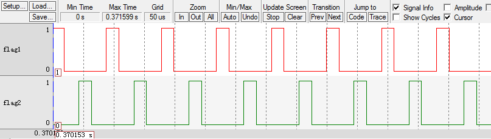
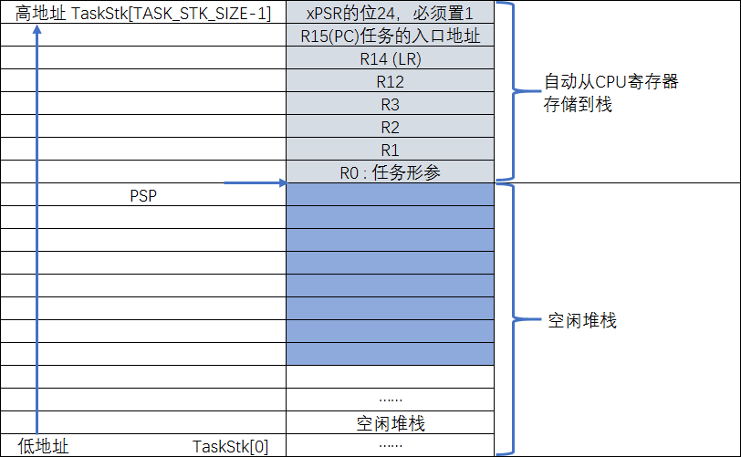

.. vim: syntax=rst

任务的定义与任务切换的实现
==============================

本章目标
~~~~~~~~~~~~

本章是我们真正从从0到1写RTOS的第一章，属于基础中的基础，必须要学会创建任务，并重点掌握任务是如何切换的。
因为任务的切换是由汇编代码来完成的，所以代码看起来比较难懂，但是我会尽力把代码讲得透彻。如果本章内容学不会，后面的内容根本无从下手。

在这章中，我们会创建两个任务，并让这两个任务不断地切换，任务的主体都是让一个变量按照一定的频率翻转，
通过KEIL的软件仿真功能，在逻辑分析仪中观察变量的波形变化，最终的波形图具体见 任务轮流切换波形图_。

其实，图 任务轮流切换波形图_ 的波形图的效果，并不是真正的多任务系统中任务切换的效果图，这个效果其实可以完全由裸机代码来实现，
具体见 代码清单:任务-1_。

.. code-block:: c
    :caption: 代码清单:任务-1裸机系统中两个变量轮流翻转
    :name: 代码清单:任务-1
    :linenos:

    /* flag 必须定义成全局变量才能添加到逻辑分析仪里面观察波形
    *在逻辑分析仪中要设置以 bit 的模式才能看到波形，不能用默认的模拟量
    */
    uint32_t flag1;
    uint32_t flag2;

    /* 软件延时，不必纠结具体的时间 */
    void delay( uint32_t count )
    {
        for (; count!=0; count--);
    }

    int main(void)
    {
        /* 无限循环，顺序执行 */
        for (;;)
        {
            flag1 = 1;
            delay( 100 );
            flag1 = 0;
            delay( 100 );

            flag2 = 1;
            delay( 100 );
            flag2 = 0;
            delay( 100 );
        }
    }

在多任务系统中，两个任务不断切换的效果图应该像 多任务系统任务切换波形图_ 所示那样，即两个变量的波形是完全一样的，
就好像CPU在同时干两件事一样，这才是多任务的意义。虽然两者的波形图一样，但是，代码的实现方式是完全不一样的，
原来的顺序执行变成了任务的主动切换，这是根本区别。这章只是开始，我们先掌握好任务是如何切换，在后面章节中，
我们会陆续的完善功能代码，加入系统调度，实现真正的多任务。千里之行，始于本章节，不要急。

.. image:: media/task_switching/tasksw003.png
   :align: center
   :name: 多任务系统任务切换波形图
   :alt: 多任务系统任务切换波形图

什么是任务
~~~~~~~~~~~~~

在裸机系统中，系统的主体就是main函数里面顺序执行的无限循环，这个无限循环里面CPU按照顺序完成各种事情。
在多任务系统中，我们根据功能的不同，把整个系统分割成一个个独立的且无法返回的函数，这个函数我们称为任务。
任务的大概形式具体见 代码清单:任务-2_。

.. code-block:: c
    :caption: 代码清单:任务-2多任务系统中任务的形式
    :name: 代码清单:任务-2
    :linenos:

    void task_entry (void *parg)
    {
        /* 任务主体，无限循环且不能返回 */
        for (;;)
        {
            /* 任务主体代码 */
        }
    }

创建任务
~~~~~~~~~~~~

定义任务栈
^^^^^^^^^^^^^

我们先回想下，在一个裸机系统中，如果有全局变量，有子函数调用，有中断发生。那么系统在运行的时候，全局变量放在哪里，
子函数调用时，局部变量放在哪里，中断发生时，函数返回地址发哪里。如果只是单纯的裸机编程，它们放哪里我们不用管，
但是如果要写一个RTOS，这些种种环境参数，我们必须弄清楚他们是如何存储的。在裸机系统中，他们统统放在一个叫栈的地方，
栈是单片机RAM里面一段连续的内存空间，栈的大小由启动文件里面的代码配置，具体见 代码清单:任务-3_ ，
最后由C库函数_main进行初始化。它们在RAM空间里面的大概分布具体见。

.. code-block:: guess
    :caption: 代码清单:任务-3裸机系统中的栈分配
    :name: 代码清单:任务-3
    :linenos:

    Stack_Size      EQU     0x00000400

                    AREA    STACK, NOINIT, READWRITE, ALIGN=3
    Stack_Mem       SPACE   Stack_Size
    __initial_sp

但是，在多任务系统中，每个任务都是独立的，互不干扰的，所以要为每个任务都分配独立的栈空间，
这个栈空间通常是一个预先定义好的全局数组。这些一个个的任务栈也是存在于RAM中，
能够使用的最大的栈也是由 代码清单:任务-3_ 中的Stack_Size决定。
只是多任务系统中任务的栈就是在统一的一个栈空间里面分配好一个个独立的房间，每个任务只能使用各自的房间，
而裸机系统中需要使用栈的时候则可以天马行空，随便在栈里面找个空闲的空间使用，大概的区别具体见。

本章我们要实现两个变量按照一定的频率轮流的翻转，需要两个任务来实现，那么就需要定义两个任务栈，具体见 代码清单:任务-4_。
在多任务系统中，有多少个任务就需要定义多少个任务栈。

.. code-block:: c
    :caption: 代码清单:任务-4定义任务栈
    :name: 代码清单:任务-4
    :linenos:

    #define  TASK1_STK_SIZE       128              (1)
    #define  TASK2_STK_SIZE       128

    static   CPU_STK   Task1Stk[TASK1_STK_SIZE];(2)
    static   CPU_STK   Task2Stk[TASK2_STK_SIZE];

-   代码清单:任务-4_ （1）任务栈的大小由宏定义控制，在μC/OS-III中，
    空闲任务的栈最小应该大于128，那么我们这里的任务的栈也暂且配置为128。

-   代码清单:任务-4_ （2）任务栈其实就是一个预先定义好的全局数据，数据类型为CPU_STK。在μC/OS-III中，凡是涉及数据类型的地方，
    μC/OS-II都会将标准的C数据类型用typedef重新取一个类型名，命名方式则采用见名之义的方式命名且统统大写。
    凡是与CPU类型相关的数据类型则统一在cpu.h中定义，与OS相关的数据类型则在os_type.h定义。CPU_STK就是与CPU相关的数据类型，
    则在cpu.h中定义，具体见 代码清单:任务-5_。cpu.h首次使用则需要自行在μC-CPU文件夹中新建并添加到工程的μC/CPU这个组中。
    代码清单:任务-5_ 中除了CPU_STK外，其他数据类型重定义是本章后面内容需要使用到，这里统一贴出来，后面将不再赘述。

.. code-block:: c
    :caption: 代码清单:任务-5 cpu.h 中的数据类型
    :name: 代码清单:任务-5
    :linenos:

    #ifndef CPU_H
    #define CPU_H

    typedefunsigned  short       CPU_INT16U;
    typedefunsigned  int         CPU_INT32U;
    typedefunsigned  char        CPU_INT08U;

    typedef  CPU_INT32U  CPU_ADDR;

    /* 栈数据类型重定义 */
    typedef  CPU_INT32U             CPU_STK;
    typedef  CPU_ADDR               CPU_STK_SIZE;

    typedef  volatile  CPU_INT32U  CPU_REG32;

    #endif/* CPU_H */

定义任务函数
^^^^^^^^^^^^^^^^^^

任务是一个独立的函数，函数主体无限循环且不能返回。本章我们定义的两个任务具体见 代码清单:任务-6_。

.. code-block:: c
    :caption: 代码清单:任务-6任务函数
    :name: 代码清单:任务-6
    :linenos:

    /* flag 必须定义成全局变量才能添加到逻辑分析仪里面观察波形
    ** 在逻辑分析仪中要设置以 bit 的模式才能看到波形，不能用默认的模拟量
    */
    uint32_t flag1;(1)
    uint32_t flag2;

    /* 任务1 */
    void Task1( void *p_arg )(2)
    {
    for ( ;; ) {
            flag1 = 1;
            delay( 100 );
            flag1 = 0;
            delay( 100 );
        }
    }

    /* 任务2 */
    void Task2( void *p_arg )(3)
    {
    for ( ;; ) {
            flag2 = 1;
            delay( 100 );
            flag2 = 0;
            delay( 100 );
        }
    }

-   代码清单:任务-6_ （1）：需要在KEIL的逻辑分析仪中观察波形的变量需要定义成全局变量，且要以bit的模式观察，不能使用默认的模拟量。

-   代码清单:任务-6_ （2）和（3）：正如我们所说的那样，任务是一个独立的、无限循环且不能返回的函数。

定义任务控制块TCB
^^^^^^^^^^^^^^^^^^^^^^^^^^^^^^

在裸机系统中，程序的主体是CPU按照顺序执行的。而在多任务系统中，任务的执行是由系统调度的。系统为了顺利的调度任务，
为每个任务都额外定义了一个任务控制块TCB（Task ControlBlock），这个任务控制块就相当于任务的身份证，
里面存有任务的所有信息，比如任务的栈，任务名称，任务的形参等。有了这个任务控制块之后，
以后系统对任务的全部操作都可以通过这个TCB来实现。TCB是一个新的数据类型，
在os.h（os.h第一次使用需要自行在文件夹μC/OS-III\Source中新建并添加到工程的μC/OS-III Source组）这个头文件中声明，
有关TCB具体的声明见 代码清单:任务-7_ ，使用它可以为每个任务都定义一个TCB实体。

.. code-block:: c
    :caption: 代码清单:任务-7任务控制块TCB类型声明
    :name: 代码清单:任务-7
    :linenos:

    /* 任务控制块重定义 */
    typedefstruct  os_tcb              OS_TCB;(1)

    /* 任务控制块数据类型声明 */
    struct os_tcb {(2)
        CPU_STK         *StkPtr;
        CPU_STK_SIZE    StkSize;
    };

-   代码清单:任务-7_ （1）：在μC/OS-III中，所有的数据类型都会重新取一个名字且用大写字母表示。

-   代码清单:任务-7_ （2）：目前TCB里面的成员还比较少，只有栈指针和栈大小。其中为了以后操作方便，我们把栈指针作为TCB的第一个成员。

在本章实验中，我们在app.c文件中为两个任务定义的TCB具体见 代码清单:任务-8_。

.. code-block:: c
    :caption: 代码清单:任务-8任务TCB定义
    :name: 代码清单:任务-8
    :linenos:

    static   OS_TCB    Task1TCB;
    static   OS_TCB    Task2TCB;

实现任务创建函数
^^^^^^^^^^^^^^^^^^^^^^^^

任务的栈，任务的函数实体，任务的TCB最终需要联系起来才能由系统进行统一调度。那么这个联系的工作就由任务创建函数
OSTaskCreate来实现，该函数在os_task.c（os_task.c第一次使用需要自行在文件夹μC/OS-III\Source中新建并添加到工程的
μC/OS-III Source组）中定义，所有跟任务相关的函数都在这个文件定义。OSTaskCreate函数的实现具体见 代码清单:任务-9_。

.. code-block:: c
    :caption: 代码清单:任务-9OSTaskCreate函数
    :name: 代码清单:任务-9
    :linenos:

    void OSTaskCreate (OS_TCB        *p_tcb,(1)
                    OS_TASK_PTR   p_task,(2)
    void          *p_arg,(3)
                    CPU_STK       *p_stk_base, (4)
                    CPU_STK_SIZE  stk_size, (5)
                    OS_ERR        *p_err) (6)
    {
        CPU_STK       *p_sp;

        p_sp = OSTaskStkInit (p_task,(7)
                            p_arg,
                            p_stk_base,
                            stk_size);
        p_tcb->StkPtr = p_sp;(8)
        p_tcb->StkSize = stk_size;(9)

        *p_err = OS_ERR_NONE;(10)
    }

代码清单:任务-9：OSTaskCreate函数遵循μC/OS-III中的函数命名规则，以大小的OS开头，表示这是一个外部函数，可以由用户调用，
以OS_开头的函数表示内部函数，只能由μC/OS-III内部使用。紧接着是文件名，表示该函数放在哪个文件，最后是函数功能名称。

-   代码清单:任务-9_ （1）：p_tcb是任务控制块指针。

-   代码清单:任务-9_ （2）：p_task 是任务函数名，类型为OS_TASK_PTR，原型声明在os.h中，具体见 代码清单:任务-10_。

.. code-block:: c
    :caption: 代码清单:任务-10OS_TASK_PTR原型声明
    :name: 代码清单:任务-10
    :linenos:

    typedefvoid (*OS_TASK_PTR)(void \*p_arg);

-   代码清单:任务-9_ （3）：p_arg是任务形参，用于传递任务参数。

-   代码清单:任务-9_ （4）：p_stk_base 用于指向任务栈的起始地址。

-   代码清单:任务-9_ （5）：stk_size 表示任务栈的大小。

-   代码清单:任务-9_ （6）：p_err 用于存错误码，μC/OS-III中为函数的返回值预先定义了很多错误码，
    通过这些错误码我们可以知道函数是因为什么出错。为了方便，我们现在把μC/OS-III中所有的错误号都贴出来，
    错误码是枚举类型的数据，在os.h中定义，具体见 代码清单:任务-11_。

.. code-block:: c
    :caption: 代码清单:任务-11错误码枚举定义
    :name: 代码清单:任务-11
    :linenos:

    typedefenum  os_err {
        OS_ERR_NONE                      =     0u,

        OS_ERR_A                         = 10000u,
        OS_ERR_ACCEPT_ISR                = 10001u,

        OS_ERR_B                         = 11000u,

        OS_ERR_C                         = 12000u,
        OS_ERR_CREATE_ISR                = 12001u,

    /* 篇幅限制，中间部分删除，具体的可查看本章配套的例程 */

        OS_ERR_X                         = 33000u,

        OS_ERR_Y                         = 34000u,
        OS_ERR_YIELD_ISR                 = 34001u,

        OS_ERR_Z                         = 35000u
    } OS_ERR;

-   代码清单:任务-9_ （7）：OSTaskStkInit()是任务栈初始化函数。当任务第一次运行的时候，
    加载到CPU寄存器的参数就放在任务栈里面，在任务创建的时候，预先初始化好栈。
    OSTaskStkInit()函数在os_cpu_c.c（os_cpu_c.c第一次使用需要自行在文件夹μC-CPU中新建并添加到工程的μC/CPU组）中定义，
    具体见 代码清单:任务-12_。

.. code-block:: c
    :caption: 代码清单:任务-12OSTaskStkInit()函数
    :name: 代码清单:任务-12
    :linenos:

    CPU_STK *OSTaskStkInit (OS_TASK_PTR  p_task,(1)
    void         *p_arg,(2)
                            CPU_STK      *p_stk_base,(3)
                            CPU_STK_SIZE stk_size)(4)
    {
        CPU_STK  *p_stk;

        p_stk = &p_stk_base[stk_size];(5)
    /* 异常发生时自动保存的寄存器 */(6)
        *--p_stk = (CPU_STK)0x01000000u;    /* xPSR的bit24必须置1  */
        *--p_stk = (CPU_STK)p_task;         /* R15(PC)任务的入口地址*/
        *--p_stk = (CPU_STK)0x14141414u;    /* R14 (LR)            */
        *--p_stk = (CPU_STK)0x12121212u;    /* R12                 */
        *--p_stk = (CPU_STK)0x03030303u;    /* R3                  */
        *--p_stk = (CPU_STK)0x02020202u;    /* R2                  */
        *--p_stk = (CPU_STK)0x01010101u;    /* R1                  */
        *--p_stk = (CPU_STK)p_arg;          /* R0 : 任务形参*/
    /* 异常发生时需手动保存的寄存器 */(7)
        *--p_stk = (CPU_STK)0x11111111u;    /* R11                 */
        *--p_stk = (CPU_STK)0x10101010u;    /* R10                 */
        *--p_stk = (CPU_STK)0x09090909u;    /* R9                  */
        *--p_stk = (CPU_STK)0x08080808u;    /* R8                  */
        *--p_stk = (CPU_STK)0x07070707u;    /* R7                  */
        *--p_stk = (CPU_STK)0x06060606u;    /* R6                  */
        *--p_stk = (CPU_STK)0x05050505u;    /* R5                  */
        *--p_stk = (CPU_STK)0x04040404u;    /* R4                  */

    return (p_stk);(8)
    }

-   代码清单:任务-12_ （1）：p_task是任务名，指示着任务的入口地址，在任务切换的时候，需要加载到R15，
    即PC寄存器，这样CPU就可以找到要运行的任务。

-   代码清单:任务-12_ （2）：p_arg 是任务的形参，用于传递参数，在任务切换的时候，需要加载到寄存器R0。R0寄存器通常用来传递参数。

-   代码清单:任务-12_ （3）：p_stk_base 表示任务栈的起始地址。

-   代码清单:任务-12_ （4）：stk_size 表示任务栈的大小，
    数据类型为CPU_STK_SIZE，在Cortex-M3内核的处理器中等于4个字节，即一个字。

-   代码清单:任务-12_ （5）：获取任务栈的栈顶地址，ARMCM3处理器的栈是由高地址向低地址生长的。所以初始化栈之前，
    要获取到栈顶地址，然后栈地址逐一递减即可。

-   代码清单:任务-12_ （6）：任务第一次运行的时候，加载到CPU寄存器的环境参数我们要预先初始化好。初始化的顺序固定，
    首先是异常发生时自动保存的8个寄存器，即xPSR、R15、R14、R12、R3、R2、R1和R0。其中xPSR寄存器的位24必须是1，
    R15PC指针必须存的是任务的入口地址，R0必须是任务形参，剩下的R14、R12、R3、R2和R1为了调试方便，填入与寄存器号相对应的16进制数。

-   代码清单:任务-12_ （7）：剩下的是8个需要手动加载到CPU寄存器的参数，为了调试方便填入与寄存器号相对应的16进制数。

-   代码清单:任务-12_ （8）：返回栈指针p_stk，这个时候p_stk指向剩余栈的栈顶。

-   代码清单:任务-9_ （8）：将剩余栈的栈顶指针p_sp保存到任务控制块TCB的第一个成员StkPtr中。

-   代码清单:任务-9_ （9）：将任务栈的大小保存到任务控制块TCB的成员StkSize中。

-   代码清单:任务-9_ （10）：函数执行到这里表示没有错误，即OS_ERR_NONE。

任务创建好之后，我们需要把任务添加到一个叫就绪列表的数组里面，表示任务已经就绪，系统随时可以调度。将任务添加到就绪列表的代码具体见 代码清单:任务-13_。

.. code-block:: c
    :caption: 代码清单:任务-13将任务添加到就绪列表
    :name: 代码清单:任务-13
    :linenos:

    /* 将任务加入到就绪列表 */
    OSRdyList[0].HeadPtr = &Task1TCB;(1)
    OSRdyList[1].HeadPtr = &Task2TCB;(2)

-   代码清单:任务-13_ （1）和（2）：把任务TCB指针放到OSRDYList数组里面。
    OSRDYList是一个类型为OS_RDY_LIST的全局变量，
    在os.h中定义，具体见 代码清单:任务-14_。

.. code-block:: c
    :caption: 代码清单:任务-14全局变量OSRDYList定义
    :name: 代码清单:任务-14
    :linenos:

    1 OS_EXT OS_RDY_LIST OSRdyList[OS_CFG_PRIO_MAX];

-   代码清单:任务-14_ （3）：OS_CFG_PRIO_MAX是一个定义，表示这个系统支持多少个优先级（刚开始暂时不支持多个优先级，往后章节会支持），
    目前这里仅用    来表示这个就绪列表可以存多少个任务的TCB指针。具体的宏在os_cfg.h（os_cfg.h第一次使用需要自行在文件夹
    μC/OS-III\Source中新建并添加到工程的μC/OS-III Source组）中定义，具体见 代码清单:任务-15_。

.. code-block:: c
    :caption: 代码清单:任务-15OS_CFG_PRIO_MAX宏定义
    :name: 代码清单:任务-15
    :linenos:

    #ifndef OS_CFG_H
    #define OS_CFG_H

    /* 支持最大的优先级 */
    #define OS_CFG_PRIO_MAX                32u

    #endif/* OS_CFG_H */

-   代码清单:任务-14_ （2）：OS_RDY_LIST是就绪列表的数据类型，在os.h中声明，具体见 代码清单:任务-16_。

.. code-block:: c
    :caption: 代码清单:任务-16OS_RDY_LIST数据类型声明
    :name: 代码清单:任务-16
    :linenos:

    typedefstruct  os_rdy_list         OS_RDY_LIST;(1)

    struct os_rdy_list {(2)
        OS_TCB        *HeadPtr;
        OS_TCB        *TailPtr;
    };

-   代码清单:任务-16_ （1）：μC/OS-III中中会为每个数据类型重新取一个大写的名字。

-   代码清单:任务-16_ （2）：OS_RDY_LIST里面目前暂时只有两个TCB类型的指针，一个是头指针，一个是尾指针。本章实验只用到头指针，
    用来指向    任务的TCB。只有当后面讲到同一个优先级支持多个任务的时候才需要使用头尾指针来将TCB串成一个双向链表。

代码清单:任务-14（1）：OS_EXT是一个在os.h中定义的宏，具体见 代码清单:任务-17_。

.. code-block:: c
    :caption: 代码清单:任务-17OS_EXT宏定义
    :name: 代码清单:任务-17
    :linenos:

    #ifdef     OS_GLOBALS
    #define    OS_EXT
    #else
    #define    OS_EXT  extern
    #endif

代码清单:任务-17：该段代码的意思是，如果没有定义OS_GLOBALS这个宏，那么OS_EXT就为空，否则就为extern。

在μC/OS-III中，需要使用很多全局变量，这些全局变量都在os.h这个头文件中定义，但是os.h会被包含进很多的文件中，
那么编译的时候，os.h里面定义的全局变量就会出现重复定义的情况，而我们要的只是os.h里面定义的全局变量只定义一次，
其他包含os.h头文件的时候只是声明。有人说，那我可以加extern，那你告诉我怎么加？

通常我们的做法都是在C文件里面定义全局变量，然后在头文件里面加extern声明，哪里需要使用就在哪里加extern声明。
但是μC/OS-III中，文件非常多，这种方法可行，但不现实。所以就有了现在在os.h头文件中定义全局变量，
然后在os.h文件的开头加上 代码清单:任务-17_ 的宏定义的方法。但是到了这里还没成功，
μC/OS-III再另外新建了一个os_var.c（os_var.c第一次使用需要自行在文件夹
μC/OS-III\Source中新建并添加到工程的μC/OS-III Source组）的文件，在里面包含os.h，
且只在这个文件里面定义OS_GLOBALS这个宏，具体见 代码清单:任务-18_。

.. code-block:: c
    :caption: 代码清单:任务-18 os_var.c文件内容
    :name: 代码清单:任务-18
    :linenos:

    #define   OS_GLOBALS

    #include"os.h"

经过这样处理之后，在编译整个工程的时候，只有var.c里面的os.h的OS_EXT才会被替换为空，即变量的定义，
其他包含os.h的文件因为没有定义OS_GLOBALS这个宏，则OS_EXT会被替换成extern，即变成了变量的声明。
这样就实现了在头文件中定义变量。

在μC/OS-III中，将任务添加到就绪列表其实是在OSTaskCreate()函数中完成的。每当任务创建好就把任务添加到就绪列表，
表示任务已经就绪。只是目前这里的就绪列表的实现还是比较简单，不支持优先级，不支持双向链表，只是简单的将任务控制块放到就绪列表的数组里面。
后面会有独立的章节来讲解就绪列表，等我们完善就绪列表之后，再把这部分的操作放回OSTaskCreate()函数里面。

OS系统初始化
~~~~~~~~~~~~~~~~~~~

OS系统初始化一般是在硬件初始化完成之后来做的，主要做的工作就是初始化μC/OS-III中定义的全局变量。OSInit()函数在文件
os_core.c（os_core.c第一次使用需要自行在文件夹μC/OS-III\Source中新建并添加到工程的μC/OS-IIISource组）中定义，
具体实现见 代码清单:任务-19_。

.. code-block:: c
    :caption: 代码清单:任务-19OSInit()函数
    :name: 代码清单:任务-19
    :linenos:

    void OSInit (OS_ERR *p_err)
    {
        OSRunning =  OS_STATE_OS_STOPPED;(1)

        OSTCBCurPtr = (OS_TCB *)0;(2)
        OSTCBHighRdyPtr = (OS_TCB *)0;(3)

        OS_RdyListInit();(4)

        *p_err = OS_ERR_NONE;(5)
    }

-   代码清单:任务-19_ （1）：系统用一个全局变量OSRunning来指示系统的运行状态，
    刚开始系统初始化的时候，默认为停止状态，即OS_STATE_OS_STOPPED。

-   代码清单:任务-19_ （2）：全局变量OSTCBCurPtr是系统用于指向当前正在运行的任务的TCB指针，在任务切换的时候用得到。

-   代码清单:任务-19_ （3）：全局变量OSTCBHighRdyPtr用于指向就绪任务中优先级最高的任务的TCB，在任务切换的时候用得到。
    本章暂时不支持优先级，则用于指向第一个运行的任务的TCB。

-   代码清单:任务-19_ （4）：OS_RdyListInit()用于初始化全局变量OSRdyList[]，即初始化就绪列表。
    OS_RdyListInit()在os_core.c文件中定义，具体实现见 代码清单:任务-20_

.. code-block:: c
    :caption: 代码清单:任务-20OS_RdyListInit()函数
    :name: 代码清单:任务-20
    :linenos:

    void OS_RdyListInit(void)
    {
        OS_PRIO i;
        OS_RDY_LIST *p_rdy_list;

    for ( i=0u; i<OS_CFG_PRIO_MAX; i++ ) {
            p_rdy_list = &OSRdyList[i];
            p_rdy_list->HeadPtr = (OS_TCB *)0;
            p_rdy_list->TailPtr = (OS_TCB *)0;
        }
    }

-   代码清单:任务-19_ （5）：代码运行到这里表示没有错误，即OS_ERR_NONE。

代码清单:任务-19_ 中的全局变量OSTCBCurPtr和OSTCBHighRdyPtr均在os.h中定义，具体见 代码清单:任务-21_。
OS_STATE_OS_STOPPED 这个表示系统运行状态的宏也在os.h中定义，具体见 代码清单:任务-22_。

.. code-block:: c
    :caption: 代码清单:任务-21 OSInit()函数中出现的全局变量的定义
    :name: 代码清单:任务-21
    :linenos:

    OS_EXT    OS_TCB         *OSTCBCurPtr;
    OS_EXT    OS_TCB         *OSTCBHighRdyPtr;
    OS_EXT    OS_RDY_LIST    OSRdyList[OS_CFG_PRIO_MAX];
    OS_EXT    OS_STATE       OSRunning;

.. code-block:: c
    :caption: 代码清单:任务-22系统状态的宏定义
    :name: 代码清单:任务-22
    :linenos:

    #define  OS_STATE_OS_STOPPED                    (OS_STATE)(0u)
    #define  OS_STATE_OS_RUNNING                    (OS_STATE)(1u)

启动系统
~~~~~~~~~~~~

任务创建好，系统初始化完毕之后，就可以开始启动系统了。系统启动函数OSStart()在os_core.c中定义，具体实现见 代码清单:任务-23_。

.. code-block:: c
    :caption: 代码清单:任务-23OSStart()函数
    :name: 代码清单:任务-23
    :linenos:

    void OSStart (OS_ERR *p_err)
    {
    if ( OSRunning == OS_STATE_OS_STOPPED ) {(1)
    /* 手动配置任务1先运行 */
            OSTCBHighRdyPtr = OSRdyList[0].HeadPtr;(2)

    /* 启动任务切换，不会返回 */
            OSStartHighRdy();(3)

    /* 不会运行到这里，运行到这里表示发生了致命的错误 */
            *p_err = OS_ERR_FATAL_RETURN;
        } else {
            *p_err = OS_STATE_OS_RUNNING;
        }
    }

-   代码清单:任务-23_ （1）：系统是第一次启动的话，if 肯定为真，则继续往下运行。

-   代码清单:任务-23_ （2）：OSTCBHIghRdyPtr 指向第一个要运行的任务的TCB。
    因为暂时不支持优先级，所以系统启动时先手动指定第一个要运行的任务。

-   代码清单:任务-23_ （3）：OSStartHighRdy()用于启动任务切换，即配置PendSV的优先级为最低，然后触发PendSV异常，
    在PendSV异常服务函数中进行任务切换。该函数不再返回，在文件os_cpu_a.s（os_cpu_a.s第一次使用需要自行在文件夹
    μC/OS-III\Ports中新建并添加到工程的μC/OS-III Ports组）中定义，由汇编语言编写，具体实现见 代码清单:任务-24_。
    os_cpu_a.s文件中涉及的ARM汇编指令的用法具体见表 常用的ARM汇编指令讲解_。

.. list-table::
   :widths: 50 50
   :name: 常用的ARM汇编指令讲解
   :header-rows: 0

   * - 指令名称作用
     - 作用

   * - EQU
     - 给数字常量取一个符号名，相当于C语言中的define

   * - AREA
     - 汇编一个新的代码段或者数据段

   * - SPACE
     - 分配内存空间

   * - PRESERVE8
     - 当前文件栈需按照8字节对齐

   * - EXPORT
     - 声明一个标号具有全局属性，可被外部的文件使用

   * - DCD
     - 以字为单位分配内存，要求4字节对齐，并要求初始化这些内存

   * - PROC
     - 定义子程序，与ENDP成对使用，表示子程序结束

   * - WEAK
     - 弱定义，如果外部文件声明了一个标号，则优先使用外部文件定义的标号，如果外部文件没有定义也不出错。要注意的是：这个不是ARM的指令，是编译器的，这里放在一起只是为了方便。

   * - IMPORT
     - 声明标号来自外部文件，跟C语言中的EXTERN关键字类似

   * - B
     - 跳转到一个标号

   * - ALIGN
     - 编译器对指令或者数据的存放地址进行对齐，一般需要跟一个立即数，缺省表示4字节对齐。要注意的是：这个不是ARM的指令，是编译器的，这里放在一起只是为了方便。

   * - END
     - 到达文件的末尾，文件结束

   * - IF,ELSE,ENDIF
     - 汇编条件分支语句，跟C语言的if else类似

.. code-block:: guess
    :caption: 代码清单:任务-24OSStartHighRdy()函数
    :name: 代码清单:任务-24
    :linenos:

    ;*******************************************************************
    ;                        开始第一次上下文切换
    ; 1、配置PendSV异常的优先级为最低
    ; 2、在开始第一次上下文切换之前，设置psp=0
    ; 3、触发PendSV异常，开始上下文切换
    ;*******************************************************************
    OSStartHighRdy
    LDR   R0, = NVIC_SYSPRI14    ; 设置  PendSV 异常优先级为最低(1)
    LDR     R1, = NVIC_PENDSV_PRI
    STRB    R1, [R0]

    MOVS    R0, #0                 ;设置psp的值为0，开始第一次上下文切换(2)
    MSR     PSP, R0

    LDR     R0, =NVIC_INT_CTRL     ; 触发PendSV异常(3)
    LDR     R1, =NVIC_PENDSVSET
    STR     R1, [R0]

    CPSIE   I                      ; 启用总中断，NMI和HardFault除外(4)

    OSStartHang
    B       OSStartHang            ; 程序应永远不会运行到这里

代码清单:任务-24_ 中涉及的NVIC_INT_CTRL、NVIC_SYSPRI14、
NVIC_PENDSV_PRI和NVIC_PENDSVSET这四个常量在
os_cpu_a.s的开头定义，具体见 代码清单:任务-25_ ，有关这四个常量的含义看代码注释即可。

.. code-block:: guess
    :caption: 代码清单:任务-25 NVIC_INT_CTRL、NVIC_SYSPRI14、NVIC_PENDSV_PRI和NVIC_PENDSVSET常量定义
    :name: 代码清单:任务-25
    :linenos:

    ;********************************************************************
    ;                               常量
    ;********************************************************************
    ;--------------------------------------------------------------------
    ;有关内核外设寄存器定义可参考官方文档：STM32F10xxx Cortex-M3 programming manual
    ;系统控制块外设SCB地址范围：0xE000ED00-0xE000ED3F
    ;--------------------------------------------------------------------
    NVIC_INT_CTRL   EQU     0xE000ED04    ; 中断控制及状态寄存器 SCB_ICSR。
    NVIC_SYSPRI14   EQU     0xE000ED22    ; 系统优先级寄存器 SCB_SHPR3：
    ; bit16~23
    NVIC_PENDSV_PRI EQU           0xFF    ; PendSV 优先级的值(最低)。
    NVIC_PENDSVSET EQU     0x10000000    ; 触发PendSV异常的值 Bit28：PENDSVSET

-   代码清单:任务-24_ （1）：配置PendSV的优先级为0XFF，即最低。在μC/OS-III中，
    上下文切换是在PendSV异常服务程序中执行的，配置PendSV的优先级为最低，从而消灭了在中断服务程序中执行上下文切换的可能。

-   代码清单:任务-24_ （2）：设置PSP的值为0，开始第一个任务切换。在任务中，
    使用的栈指针都是PSP，后面如果判断出PSP为0，则表示第一次任务切换。

-   代码清单:任务-24_ （3）：触发PendSV异常，如果中断启用且有编写PendSV异常服务函数的话，
    则内核会响应PendSV异常，去执行PendSV异常服务函数。

-   代码清单:任务-24_ （4）：开中断，因为有些用户在main()函数开始会先关掉中断，
    等全部初始化完成后，在启动OS的时候才开中断。为了快速地开关中断， CM3 专门设置了一条 CPS 指令，有 4 种用法，具体见代码清单:任务-26。

.. code-block:: guess
    :caption: 代码清单:任务-26 CPS 指令用法
    :name: 代码清单:任务-26
    :linenos:

    CPSID I ;PRIMASK=1     ;关中断
    CPSIE I ;PRIMASK=0     ;开中断
    CPSID F ;FAULTMASK=1   ;关异常
    CPSIE F ;FAULTMASK=0   ;开异常

代码清单:任务-26中PRIMASK和FAULTMAST是CM3里面三个中断屏蔽寄存器中的两个，还有一个是BASEPRI，
有关这三个寄存器的详细用法见表 CM3中断屏蔽寄存器组描述_。

.. list-table::
   :widths: 50 50
   :name: CM3中断屏蔽寄存器组描述
   :header-rows: 0

   * - 名字
     - 功能描述

   * - PRIMASK
     - 这是个只有单一比特的寄存器。在它被置1后，就关掉所有可屏蔽的异常，只剩下NMI和硬FAULT可以响应。它的缺省值是0，表示没有关中断。

   * - FAULTMASK
     - 这是个只有1个位的寄存器。当它置1时，只有NMI才能响应，所有其他的异常，甚至是硬FAULT，也通通闭嘴。它的缺省值也是0，表示没有关异常。

   * - BASEPRI
     - 这个寄存器最多有9位（由表达优先级的位数决定）。它定义了被屏蔽优先级的阈值。当它被设成
       某个值后，所有优先级号大于等于此值的中断都被关（优先级号越大，优先级越低）。但若被设成0，则不关闭任何中断，0也是缺省值。                                            |

任务切换
~~~~~~~~~~~~

当调用OSStartHighRdy()函数，触发PendSV异常后，就需要编写PendSV异常服务函数，然后在里面进行任务切换。
PendSV异常服务函数具体见 代码清单:任务-27_。PendSV异常服务函数名称必须与启动文件里面向量表中PendSV的向量名一致，
如果不一致则内核是响应不了用户编写的PendSV异常服务函数的，只响应启动文件里面默认的PendSV异常服务函数。
启动文件里面为每个异常都编写好默认的异常服务函数，函数体都是一个死循环，当你发现代码跳转到这些启动文件里面默认的异常服务函数的时候，
就要检查下异常函数名称是否写错了，没有跟向量表里面的一致。
PendSV_Handler函数里面涉及的ARM汇编指令的讲解具体见表 PendSV_Handler函数中涉及的ARM汇编指令讲解_。

.. code-block:: guess
    :caption: 代码清单:任务-27PendSV异常服务函数
    :name: 代码清单:任务-27
    :linenos:

    ;***********************************************************************
    ;                          PendSVHandler异常
    ;***********************************************************************
    PendSV_Handler
    ; 关中断，NMI和HardFault除外，防止上下文切换被中断
    CPSID   I(1)

    ; 将psp的值加载到R0
    MRS     R0, PSP(2)

    ; 判断R0，如果值为0则跳转到OS_CPU_PendSVHandler_nosave
    ; 进行第一次任务切换的时候，R0肯定为0
    CBZ     R0, OS_CPU_PendSVHandler_nosave   (3)

    ;-----------------------一、保存上文-----------------------------
    ; 任务的切换，即把下一个要运行的任务的栈内容加载到CPU寄存器中
    ;--------------------------------------------------------------
    ; 在进入PendSV异常的时候，当前CPU的xPSR，PC（任务入口地址），
    ; R14，R12，R3，R2，R1，R0会自动存储到当前任务栈，
    ;同时递减PSP的值，随便通过代码：MRS R0, PSP 把PSP的值传给R0

    ; 手动存储CPU寄存器R4-R11的值到当前任务的栈
    STMDB   R0!, {R4-R11}(15)

    ; 加载 OSTCBCurPtr 指针的地址到R1，这里LDR属于伪指令
    LDR     R1, = OSTCBCurPtr(16)
    ; 加载 OSTCBCurPtr 指针到R1，这里LDR属于ARM指令
    LDR     R1, [R1](17)
    ; 存储R0的值到OSTCBCurPtr->OSTCBStkPtr，这个时候R0存的是任务空闲栈的栈顶
    STR     R0, [R1] (18)

    ;-----------------------二、切换下文-----------------------------
    ; 实现 OSTCBCurPtr = OSTCBHighRdyPtr
    ; 把下一个要运行的任务的栈内容加载到CPU寄存器中
    ;--------------------------------------------------------------
    OS_CPU_PendSVHandler_nosave  (4)

    ; 加载 OSTCBCurPtr 指针的地址到R0，这里LDR属于伪指令
    LDR     R0, = OSTCBCurPtr(5)
    ; 加载 OSTCBHighRdyPtr 指针的地址到R1，这里LDR属于伪指令
    LDR     R1, = OSTCBHighRdyPtr(6)
    ; 加载 OSTCBHighRdyPtr 指针到R2，这里LDR属于ARM指令
    LDR     R2, [R1](7)
    ; 存储 OSTCBHighRdyPtr 到 OSTCBCurPtr
    STR     R2, [R0](8)

    ; 加载 OSTCBHighRdyPtr 到 R0
    LDR     R0, [R2](9)
    ; 加载需要手动保存的信息到CPU寄存器R4-R11
    LDMIA   R0!, {R4-R11}(10)

    ; 更新PSP的值，这个时候PSP指向下一个要执行的任务的栈的栈底
    ;（这个栈底已经加上刚刚手动加载到CPU寄存器R4-R11的偏移）
    MSR     PSP, R0(11)

    ; 确保异常返回使用的栈指针是PSP，即LR寄存器的位2要为1
    ORR     LR, LR, #0x04 (12)

    ; 开中断
    CPSIE   I (13)

    ; 异常返回，这个时候任务栈中的剩下内容将会自动加载到xPSR，
    ; PC（任务入口地址），R14，R12，R3，R2，R1，R0（任务的形参）
    ; 同时PSP的值也将更新，即指向任务栈的栈顶。
    ; 在STM32中，栈是由高地址向低地址生长的。
    BX      LR  (14)

代码清单:任务-27_  PendSV异常服务中主要完成两个工作，一是保存上文，即保存当前正在运行的任务的环境参数；二是切换下文，
即把下一个需要运行的任务的环境参数从任务栈中加载到CPU寄存器，从而实现任务的切换。接下来具体讲解下 代码清单:任务-27_ 每句代码的含义。

代码清单:任务-27_  PendSV异常服务中用到了OSTCBCurPtr和OSTCBHighRdyPtr这两个全局变量，这两个全局变量在os.h中定义，
要想在汇编文件os_cpu_a.s中使用，必须将这两个全局变量导入到os_cpu_a.s中，具体如何导入见 代码清单:任务-28_。

.. code-block:: c
    :caption: 代码清单:任务-28导入OSTCBCurPtr和OSTCBHighRdyPtr到os_cpu_a.s
    :name: 代码清单:任务-28
    :linenos:

    ;*******************************************************************
    ;                           全局变量&函数
    ;*******************************************************************
    IMPORT  OSTCBCurPtr              ; 外部文件引人的参考(1)
    IMPORT  OSTCBHighRdyPtr

        EXPORT  OSStartHighRdy           ; 该文件定义的函数(2)
    EXPORT  PendSV_Handler

-   代码清单:任务-28_ （1）：
    使用IMPORT关键字将os.h中的OSTCBCurPtr和OSTCBHighRdyPtr这两个全局变量导入到该汇编文件，
    从而该汇编文件可以使用这两个变量。如果是函数也可以使用IMPORT导入的方法。

-   代码清单:任务-28_ （2）：使用EXPORT关键字导出该汇编文件里面的OSStartHighRdy和PendSV_Handler这两个函数，
    让外部文件可见。除了使用EXPORT导出外，还要在
    某个C的头文件里面声明下这两个函数（在μC/OS-III中是在os_cpu.h中声明），这样才可以在C文件里面调用这两个函数。

-   代码清单:任务-27_ （1）：关中断，NMI和HardFault除外，防止上下文切换被中断。
    在上下文切换完毕之后，会重新开中断。

-   代码清单:任务-27_ （2）：将PSP的值加载到R0寄存器。MRS是ARM 32位数据加载指令，
    功能是加载特殊功能寄存器的值到通用寄存器。

-   代码清单:任务-27_ （3）：判断R0，如果值为0则跳转到OS_CPU_PendSVHandler_nosave。进行第一次任务切换的时候，
    PSP在OSStartHighRdy初始化为0，所以这个时候R0肯定为0，则跳转到OS_CPU_PendSVHandler_nosave。
    CBZ是ARM16位转移指令，用于比较，结果为0则跳转。

-   代码清单:任务-27_ （4）：当第一次任务切换的时候，会跳转到这里运行。当执行过一次任务切换之后，
    则顺序执行到这里。这个标号以后的内容属于下文切换。

-   代码清单:任务-27_ （5）：加载 OSTCBCurPtr 指针的地址到R0。在ARM汇编中，操作变量都属于间接操作，
    即要先获取到这个变量的地址。这里LDR属于伪指令，不是ARM指令。举例：LDR Rd, = label，如果label是立即数，
    那Rd等于立即数，如果label是一个标识符，比如指针，那存到Rd的就是label这个标识符的地址。

-   代码清单:任务-27_ （6）：加载 OSTCBHighRdyPtr 指针的地址到R1，这里LDR也属于伪指令。

-   代码清单:任务-27_ （7）：加载 OSTCBHighRdyPtr 指针到R2，这里LDR属于ARM指令。

-   代码清单:任务-27_ （8）：存储 OSTCBHighRdyPtr 到 OSTCBCurPtr，
    实现下一个要运行的任务的TCB存储到OSTCBCurPtr。

-   代码清单:任务-27_ （9）：加载 OSTCBHighRdyPtr 到 R0。TCB中第一个成员是栈指针StkPtr，
    所以这个时候R0等于StkPtr，后续操作任务栈都是通过操作R0来实现，不需要操作StkPtr。

-   代码清单:任务-27_ （10）：将任务栈中需要手动加载的内容加载到CPU寄存器R4-R11，同时会递增R0，
    让R0指向空闲栈的栈顶。LDMIA中的I是increase的缩写，A是after的缩小，
    R0后面的感叹号“！”表示会自动调节R0里面存的指针。当任务被创建的时候，任务的栈会被初始化，
    初始化的流程是：先让栈指针StkPtr指向栈顶，
    然后从栈顶开始依次存储异常退出时会自动加载到CPU寄存器的值和需要手动加载到CPU寄存器的值，
    具体代码实现见代码清单:任务-12OSTaskStkInit()函数，栈空间的分布情况具体见 任务创建成功后栈空间的分布图_。
    当把需要手动加载到CPU的栈内容加载完毕之后，栈空间的分布图和栈指针指向具体见图 手动加载栈内容到CPU寄存器后的栈空间分布图_ ，
    注意这个时候StkPtr不变，变的是R0。

-   代码清单:任务-27_ （11）：更新PSP的值，这个时候PSP与图3‑4中R0的指向一致。

-   代码清单:任务-27_ （12）：设置LR寄存器的位2为1，确保异常退出时使用的栈指针是PSP。
    当异常退出后，就切换到就绪任务中优先级最高的任务继续运行。

-   代码清单:任务-27_ （13）：开中断。上下文切换已经完成了四分之三，剩下的就是异常退出时自动保存的部分。

-   代码清单:任务-27_ （14）：异常返回，这个时候任务栈中的剩下内容将会自动加载到xPSR，PC（任务入口地址），
    R14，R12，R3，R2，R1，R0（任务的形参）这些寄存器。同时PSP的值也将更新，即指向任务栈的栈顶。这样就切换到了新的任务。
    这个时候栈空间的分布具体见图 刚切换完成即将运行的任务的栈空间分布和栈指针指向_。

-   代码清单:任务-27_ （15）：手动存储CPU寄存器R4-R11的值到当前任务的栈。当异常发生，进入PendSV异常服务函数的时候，
    当前CPU寄存器xPSR，PC（任务入口地址），R14，R12，R3，R2，R1，R0会自动存储到当前的任务栈，同时递减PSP的值，
    这个时候当前任务的栈空间分布具体见图 进入PendSV异常时当前任务的栈空间分布_。当执行STMDB R0!, {R4-R11}代码后，
    当前任务的栈空间分布图具体见 当前任务执行完上文保存时的栈空间分布_。

-   代码清单:任务-27_ （16）：加载 OSTCBCurPtr 指针的地址到R1，这里LDR属于伪指令。

-   代码清单:任务-27_ （17）：加载 OSTCBCurPtr 指针到R1，这里LDR属于ARM指令。

-   代码清单:任务-27_ （18）：存储R0的值到OSTCBCurPtr->OSTCBStkPtr，
    这个时候R0存的是任务空闲栈的栈顶。到了这里，上文的保存就总算完成。
    这个时候当前任务的栈空间分布和栈指针指向具体见图 当前任务执行完上文保存时的栈空间分布和StkPtr指向_。

.. list-table::
   :widths: 50 50
   :name: PendSV_Handler函数中涉及的ARM汇编指令讲解
   :header-rows: 0

   * - 指令名称
     - 作用

   * - MRS
     - 加载特殊功能寄存器的值到通用寄存器

   * - MSR
     - 存储通用寄存器的值到特殊功能寄存器

   * - CBZ
     - 比较，如果结果为0 就转移

   * - CBNZ
     - 比较，如果结果非0 就转移

   * - LDR
     - 从存储器中加载字到一个寄存器中

   * - LDR[伪指令] 加
     - 一个立即数或者一个地址值到一个寄存器。举例：LDR | Rd, = label，如果label是立即数，那Rd等于立即数，如果label是一个标识符，比如指针，那存到Rd的就是label这个标识符的地址

   * - LDRH
     - 从存储器中加载半字到一个寄存器中

   * - LDRB
     - 从存储器中加载字节到一个寄存器中

   * - STR
     - 把一个寄存器按字存储到存储器中

   * - STRH
     - 把一个寄存器存器的低半字存储到存储器中

   * - STRB
     - 把一个寄存器的低字节存储到存储器中

   * - LDMIA
     - 加载多个字，并且在加载后自增基址寄存器

   * - STMIA
     - 存储多个字，并且在存储后自增基址寄存器

   * - ORR
     - 按位或

   * - BX
     - 直接跳转到由寄存器给定的地址

   * - BL
     - 跳转到标号对应的地址，并且把跳转前的下条指令地址保存到LR

   * - BLX
     - 跳转到由寄存器REG给出的的地址，并根据REG的LSB切换处理器状态，还要把转移前的下条指令地址保存到LR。ARM(LSB=0)，Thumb(LSB=1)。CM3 只在Thumb中运行，就必须保证reg 的LSB=1，否则一个fault 打过来

main()函数
~~~~~~~~~~~~~~~~~~~~~~~~

main()函数在文件app.c中编写，其中app.c文件中的所有代码具体见 代码清单:任务-29_。

.. code-block:: c
    :caption: 代码清单:任务-29 app.c文件中的代码
    :name: 代码清单:任务-29
    :linenos:

    /*
    *******************************************************************
    *                          包含的头文件
    *******************************************************************
    */
    #include"os.h"
    #include"ARMCM3.h"

    /*
    *******************************************************************
    *                            宏定义
    *******************************************************************
    */

    /*
    *******************************************************************
    *                          全局变量
    *******************************************************************
    */

    uint32_t flag1;
    uint32_t flag2;

    /*
    *******************************************************************
    *                        TCB & STACK &任务声明
    *******************************************************************
    */
    #define  TASK1_STK_SIZE       20
    #define  TASK2_STK_SIZE       20

    static   CPU_STK   Task1Stk[TASK1_STK_SIZE];
    static   CPU_STK   Task2Stk[TASK2_STK_SIZE];

    static   OS_TCB    Task1TCB;
    static   OS_TCB    Task2TCB;

    void     Task1( void *p_arg );
    void     Task2( void *p_arg );

    /*
    *******************************************************************
    *                            函数声明
    *******************************************************************
    */
    void delay(uint32_t count);

    /*
    *******************************************************************
    *                            main()函数
    *******************************************************************
    */
    /*
    * 注意事项：1、该工程使用软件仿真，debug需选择 Ude Simulator
    *         2、在Target选项卡里面把晶振Xtal(Mhz)的值改为25，默认是12，
    *              改成25是为了跟system_ARMCM3.c中定义的__SYSTEM_CLOCK相同，
    *              确保仿真的时候时钟一致
    */
    int main(void)
    {
    OS_ERR err;

    /* 初始化相关的全局变量 */
    OSInit(&err);

    /* 创建任务 */
    OSTaskCreate ((OS_TCB*)      &Task1TCB,
                    (OS_TASK_PTR ) Task1,
                    (void *)       0,
                    (CPU_STK*)     &Task1Stk[0],
                    (CPU_STK_SIZE) TASK1_STK_SIZE,
                    (OS_ERR *)     &err);

    OSTaskCreate ((OS_TCB*)      &Task2TCB,
                    (OS_TASK_PTR ) Task2,
                    (void *)       0,
                    (CPU_STK*)     &Task2Stk[0],
                    (CPU_STK_SIZE) TASK2_STK_SIZE,
                    (OS_ERR *)     &err);

    /* 将任务加入到就绪列表 */
    OSRdyList[0].HeadPtr = &Task1TCB;
    OSRdyList[1].HeadPtr = &Task2TCB;

    /* 启动OS，将不再返回 */
    OSStart(&err);
    }

    /*
    *******************************************************************
    *                           函数实现
    *******************************************************************
    */
    /* 软件延时 */
    void delay (uint32_t count)
    {
    for (; count!=0; count--);
    }

    /* 任务1 */
    void Task1( void *p_arg )
    {
    for ( ;; ) {
            flag1 = 1;
            delay( 100 );
            flag1 = 0;
            delay( 100 );

    /* 任务切换，这里是手动切换 */
            OSSched();
        }
    }

    /* 任务2 */
    void Task2( void *p_arg )
    {
    for ( ;; ) {
            flag2 = 1;
            delay( 100 );
            flag2 = 0;
            delay( 100 );

    /* 任务切换，这里是手动切换 */
            OSSched();
        }
    }

代码清单:任务-29中的所有代码在本小节之前都有循序渐进的讲解，这里这是融合在一起放在main()函数中。其实现在Task1和Task2并不会真正
的自动切换，而是在各自的函数体里面加入了OSSched()函数来实现手动切换,OSSched()函数的实现具体见 代码清单:任务-30_。

.. code-block:: c
    :caption: 代码清单:任务-30OSSched()函数
    :name: 代码清单:任务-30
    :linenos:

    /* 任务切换，实际就是触发PendSV异常，然后在PendSV异常中进行上下文切换 */
    void OSSched (void)
    {
    if ( OSTCBCurPtr == OSRdyList[0].HeadPtr ) {
            OSTCBHighRdyPtr = OSRdyList[1].HeadPtr;
        } else {
            OSTCBHighRdyPtr = OSRdyList[0].HeadPtr;
        }

        OS_TASK_SW();
    }

OSSched()函数的调度算法很简单，即如果当前任务是任务1，那么下一个任务就是任务2，如果当前任务是任务2，那么下一个任务就是任务1，
然后再调用OS_TASK_SW()函数触发PendSV异常，然后在PendSV异常里面实现任务的切换。在往后的章节中，我们将继续完善，加入SysTick中断，
从而实现系统调度的自动切换。OS_TASK_SW()函数其实是一个宏定义，具体是往中断及状态控制寄存器SCB_ICSR的位28（PendSV异常启用位）写入1，
从而触发PendSV异常。OS_TASK_SW()函数在os_cpu.h文件中实现，os_cpu.h（os_cpu.h第一次使用需要自行在文件夹μC-CPU中新建并添加到工程的
μC-CPU组）文件内容具体见 代码清单:任务-31_。

.. code-block:: c
    :caption: 代码清单:任务-31 os_cpu.h 文件代码清单
    :name: 代码清单:任务-31
    :linenos:

    #ifndef  OS_CPU_H
    #define  OS_CPU_H

    /*
    *******************************************************************
    *                              宏定义
    *******************************************************************
    */

    #ifndef  NVIC_INT_CTRL
    /* 中断控制及状态寄存器 SCB_ICSR */
    #define  NVIC_INT_CTRL                 *((CPU_REG32 *)0xE000ED04)
    #endif

    #ifndef  NVIC_PENDSVSET
    /* 触发PendSV异常的值 Bit28：PENDSVSET */
    #define  NVIC_PENDSVSET                0x10000000
    #endif

    /* 触发PendSV异常 */
    #define  OS_TASK_SW()               NVIC_INT_CTRL = NVIC_PENDSVSET
    /* 触发PendSV异常 */
    #define  OSIntCtxSw()               NVIC_INT_CTRL = NVIC_PENDSVSET
    /*
    *******************************************************************
    *                              函数声明
    *******************************************************************
    */
    void OSStartHighRdy(void);/* 在os_cpu_a.s中实现 */
    void PendSV_Handler(void);/* 在os_cpu_a.s中实现 */

    #endif/* OS_CPU_H */

实验现象
~~~~~~~~~~~~

本章代码讲解完毕，接下来是软件调试仿真，具体过程见

-   图 点击Debug按钮进入调试界面_
-   图 点击逻辑分析仪按钮调出逻辑分析仪_
-   图 将要观察的变量添加到逻辑分析仪_
-   图 将变量设置为Bit模式_，默认是Analog
-   图 点击全速运行按钮_，即可看到波形，Zoom栏的In Out All可放大和缩小波形

至此，本章讲解完毕。但是，只是把本章的内容看完，然后再仿真看看波形是远远不够的，应该是把任务的栈、TCB、
OSTCBCurPtr和OSTCBHighRdyPtr这些变量统统添加到观察窗口，然后单步执行程序，看看这些变量是怎么变化的。特别是任务切换时，
CPU寄存器、任务栈和PSP这些是怎么变化的，让机器执行代码的过程在自己的脑子里面过一遍。
图 软件调试仿真时的Watch窗口_ 就是我在仿真调试时的观察窗口。

